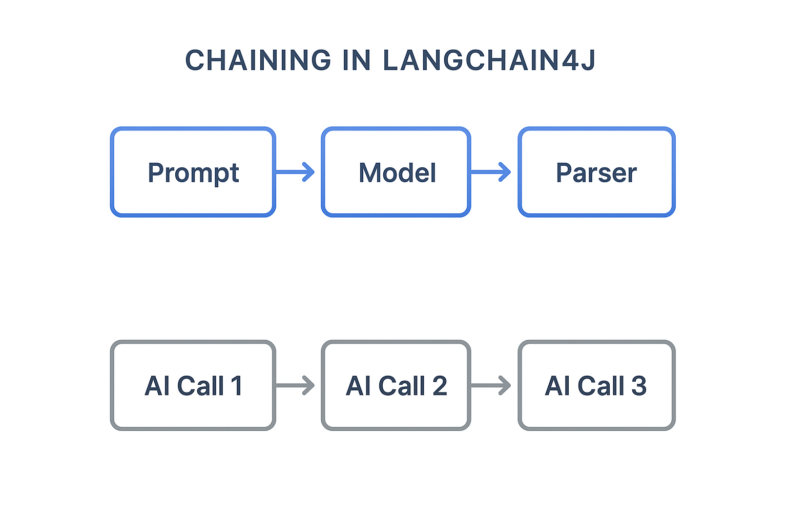
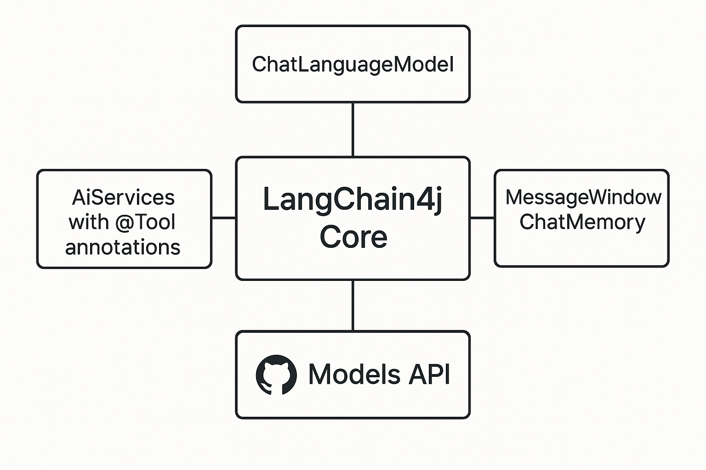

# Module 00: Quick Start

## Table of Contents

- [Introduction](#introduction)
- [What is LangChain4j?](#what-is-langchain4j)
- [LangChain4j Dependencies](#langchain4j-dependencies)
- [Prerequisites](#prerequisites)
- [Setup](#setup)
  - [1. Get Your GitHub Token](#1-get-your-github-token)
  - [2. Set Your Token](#2-set-your-token)
- [Run the Examples](#run-the-examples)
  - [1. Basic Chat](#1-basic-chat)
  - [2. Prompt Patterns](#2-prompt-patterns)
  - [3. Function Calling](#3-function-calling)
  - [4. Document Q&A (RAG)](#4-document-qa-rag)
  - [5. Responsible AI](#5-responsible-ai)
- [What Each Example Shows](#what-each-example-shows)
- [Next Steps](#next-steps)
- [Troubleshooting](#troubleshooting)

## Introduction

This quickstart is meant to get you up and running with LangChain4j as quickly as possible. It covers the absolute basics of building AI applications with LangChain4j and GitHub Models. In the next modules you'll use Azure OpenAI with LangChain4j to build more advanced applications.

## What is LangChain4j?

LangChain4j is a Java library that simplifies building AI-powered applications. Instead of dealing with HTTP clients and JSON parsing, you work with clean Java APIs. 

The "chain" in LangChain refers to chaining together multiple components - you might chain a prompt to a model to a parser, or chain multiple AI calls together where one output feeds into the next input. This quick start focuses on the fundamentals before exploring more complex chains.



*Chaining components in LangChain4j - building blocks connect to create powerful AI workflows*

We'll use three core components:

**ChatLanguageModel** - The interface for AI model interactions. Call `model.chat("prompt")` and get a response string. We use `OpenAiOfficialChatModel` which works with OpenAI-compatible endpoints like GitHub Models.

**AiServices** - Creates type-safe AI service interfaces. Define methods, annotate them with `@Tool`, and LangChain4j handles the orchestration. The AI automatically calls your Java methods when needed.

**MessageWindowChatMemory** - Maintains conversation history. Without this, each request is independent. With it, the AI remembers previous messages and maintains context across multiple turns.



*LangChain4j architecture - core components working together to power your AI applications*

## LangChain4j Dependencies

This quick start uses two Maven dependencies in the [`pom.xml`](pom.xml):

```xml
<!-- Core LangChain4j library -->
<dependency>
    <groupId>dev.langchain4j</groupId>
    <artifactId>langchain4j</artifactId> <!-- Inherited from BOM in root pom.xml -->
</dependency>

<!-- OpenAI integration (works with GitHub Models) -->
<dependency>
    <groupId>dev.langchain4j</groupId>
    <artifactId>langchain4j-open-ai-official</artifactId> <!-- Inherited from BOM in root pom.xml -->
</dependency>
```

The `langchain4j-open-ai-official` module provides the `OpenAiOfficialChatModel` class that connects to OpenAI-compatible APIs. GitHub Models uses the same API format, so no special adapter is needed - just point the base URL to `https://models.github.ai/inference`.

## Prerequisites

**Using the Dev Container?** Java and Maven are already installed. You only need a GitHub Personal Access Token.

**Local Development:**
- Java 21+, Maven 3.9+
- GitHub Personal Access Token (instructions below)

> **Note:** This module uses `gpt-4.1-nano` from GitHub Models. Do not modify the model name in the code - it's configured to work with GitHub's available models.

## Setup

### 1. Get Your GitHub Token

1. Go to [GitHub Settings → Personal Access Tokens](https://github.com/settings/personal-access-tokens)
2. Click "Generate new token"
3. Set a descriptive name (e.g., "LangChain4j Demo")
4. Set expiration (7 days recommended)
5. Under "Account permissions", find "Models" and set to "Read-only"
6. Click "Generate token"
7. Copy and save your token - you won't see it again

### 2. Set Your Token

**Option 1: Using VS Code (Recommended)**

If you're using VS Code, add your token to the `.env` file in the project root:

If the `.env` file does not exist, copy `.env.example` to `.env` or create a new `.env` file in the project root.

**Example `.env` file:**
```bash
# In /workspaces/LangChain4j-for-Beginners/.env
GITHUB_TOKEN=your_token_here
```

Then you can simply right-click on any demo file (e.g., `BasicChatDemo.java`) in the Explorer and select **"Run Java"** or use the launch configurations from the Run and Debug panel.

**Option 2: Using Terminal**

Set the token as an environment variable:

**Bash:**
```bash
export GITHUB_TOKEN=your_token_here
```

**PowerShell:**
```powershell
$env:GITHUB_TOKEN=your_token_here
```

## Run the Examples

**Using VS Code:** Simply right-click on any demo file in the Explorer and select **"Run Java"**, or use the launch configurations from the Run and Debug panel (make sure you've added your token to the `.env` file first).

**Using Maven:** Alternatively, you can run from the command line:

### 1. Basic Chat

**Bash:**
```bash
mvn compile exec:java -Dexec.mainClass=com.example.langchain4j.quickstart.BasicChatDemo
```

**PowerShell:**
```powershell
mvn --% compile exec:java -Dexec.mainClass=com.example.langchain4j.quickstart.BasicChatDemo
```

### 2. Prompt Patterns

**Bash:**
```bash
mvn compile exec:java -Dexec.mainClass=com.example.langchain4j.quickstart.PromptEngineeringDemo
```

**PowerShell:**
```powershell
mvn --% compile exec:java -Dexec.mainClass=com.example.langchain4j.quickstart.PromptEngineeringDemo
```

Shows zero-shot, few-shot, chain-of-thought, and role-based prompting.

### 3. Function Calling

**Bash:**
```bash
mvn compile exec:java -Dexec.mainClass=com.example.langchain4j.quickstart.ToolIntegrationDemo
```

**PowerShell:**
```powershell
mvn --% compile exec:java -Dexec.mainClass=com.example.langchain4j.quickstart.ToolIntegrationDemo
```

AI automatically calls your Java methods when needed.

### 4. Document Q&A (RAG)

**Bash:**
```bash
mvn compile exec:java -Dexec.mainClass=com.example.langchain4j.quickstart.SimpleReaderDemo
```

**PowerShell:**
```powershell
mvn --% compile exec:java -Dexec.mainClass=com.example.langchain4j.quickstart.SimpleReaderDemo
```

Ask questions about content in `document.txt`.

### 5. Responsible AI

**Bash:**
```bash
mvn compile exec:java -Dexec.mainClass=com.example.langchain4j.quickstart.ResponsibleGithubModels
```

**PowerShell:**
```powershell
mvn --% compile exec:java -Dexec.mainClass=com.example.langchain4j.quickstart.ResponsibleGithubModels
```

See how AI safety filters block harmful content.

## What Each Example Shows

**Basic Chat** - [BasicChatDemo.java](src/main/java/com/example/langchain4j/quickstart/BasicChatDemo.java)

Start here to see LangChain4j at its simplest. You'll create an `OpenAiOfficialChatModel`, send a prompt with `.chat()`, and get back a response. This demonstrates the foundation: how to initialize models with custom endpoints and API keys. Once you understand this pattern, everything else builds on it.

```java
ChatLanguageModel model = OpenAiOfficialChatModel.builder()
    .baseUrl("https://models.github.ai/inference")
    .apiKey(System.getenv("GITHUB_TOKEN"))
    .modelName("gpt-4.1-nano")
    .build();

String response = model.chat("What is LangChain4j?");
System.out.println(response);
```

> **🤖 Try with [GitHub Copilot](https://github.com/features/copilot) Chat:** Open [`BasicChatDemo.java`](src/main/java/com/example/langchain4j/quickstart/BasicChatDemo.java) and ask:
> - "How would I switch from GitHub Models to Azure OpenAI in this code?"
> - "What other parameters can I configure in OpenAiOfficialChatModel.builder()?"
> - "How do I add streaming responses instead of waiting for the complete response?"

**Prompt Engineering** - [PromptEngineeringDemo.java](src/main/java/com/example/langchain4j/quickstart/PromptEngineeringDemo.java)

Now that you know how to talk to a model, let's explore what you say to it. This demo uses the same model setup but shows four different prompting patterns. Try zero-shot prompts for direct instructions, few-shot prompts that learn from examples, chain-of-thought prompts that reveal reasoning steps, and role-based prompts that set context. You'll see how the same model gives dramatically different results based on how you frame your request.

```java
PromptTemplate template = PromptTemplate.from(
    "What's the best time to visit {{destination}} for {{activity}}?"
);

Prompt prompt = template.apply(Map.of(
    "destination", "Paris",
    "activity", "sightseeing"
));

String response = model.chat(prompt.text());
```

> **🤖 Try with [GitHub Copilot](https://github.com/features/copilot) Chat:** Open [`PromptEngineeringDemo.java`](src/main/java/com/example/langchain4j/quickstart/PromptEngineeringDemo.java) and ask:
> - "What's the difference between zero-shot and few-shot prompting, and when should I use each?"
> - "How does the temperature parameter affect the model's responses?"
> - "What are some techniques to prevent prompt injection attacks in production?"
> - "How can I create reusable PromptTemplate objects for common patterns?"

**Tool Integration** - [ToolIntegrationDemo.java](src/main/java/com/example/langchain4j/quickstart/ToolIntegrationDemo.java)

This is where LangChain4j gets powerful. You'll use `AiServices` to create an AI assistant that can call your Java methods. Just annotate methods with `@Tool("description")` and LangChain4j handles the rest - the AI automatically decides when to use each tool based on what the user asks. This demonstrates function calling, a key technique for building AI that can take actions, not just answer questions.

```java
@Tool("Performs addition of two numeric values")
public double add(double a, double b) {
    return a + b;
}

MathAssistant assistant = AiServices.create(MathAssistant.class, model);
String response = assistant.chat("What is 25 plus 17?");
```

> **🤖 Try with [GitHub Copilot](https://github.com/features/copilot) Chat:** Open [`ToolIntegrationDemo.java`](src/main/java/com/example/langchain4j/quickstart/ToolIntegrationDemo.java) and ask:
> - "How does the @Tool annotation work and what does LangChain4j do with it behind the scenes?"
> - "Can the AI call multiple tools in sequence to solve complex problems?"
> - "What happens if a tool throws an exception - how should I handle errors?"
> - "How would I integrate a real API instead of this calculator example?"

**Document Q&A (RAG)** - [SimpleReaderDemo.java](src/main/java/com/example/langchain4j/quickstart/SimpleReaderDemo.java)

Here you'll see the foundation of RAG (retrieval-augmented generation). Instead of relying on the model's training data, you load content from [`document.txt`](document.txt) and include it in the prompt. The AI answers based on your document, not its general knowledge. This is the first step toward building systems that can work with your own data.

```java
Document document = FileSystemDocumentLoader.loadDocument("document.txt");
String content = document.text();

String prompt = "Based on this document: " + content + 
                "\nQuestion: What is the main topic?";
String response = model.chat(prompt);
```

> **Note:** This simple approach loads the entire document into the prompt. For large files (>10KB), you'll exceed context limits. Module 03 covers chunking and vector search for production RAG systems.

> **🤖 Try with [GitHub Copilot](https://github.com/features/copilot) Chat:** Open [`SimpleReaderDemo.java`](src/main/java/com/example/langchain4j/quickstart/SimpleReaderDemo.java) and ask:
> - "How does RAG prevent AI hallucinations compared to using the model's training data?"
> - "What's the difference between this simple approach and using vector embeddings for retrieval?"
> - "How would I scale this to handle multiple documents or larger knowledge bases?"
> - "What are best practices for structuring the prompt to ensure the AI uses only the provided context?"

**Responsible AI** - [ResponsibleGithubModels.java](src/main/java/com/example/langchain4j/quickstart/ResponsibleGithubModels.java)

Build AI safety with defense in depth. This demo shows two layers of protection working together:

**Part 1: LangChain4j Input Guardrails** - Block dangerous prompts before they reach the LLM. Create custom guardrails that check for prohibited keywords or patterns. These run in your code, so they're fast and free.

```java
class DangerousContentGuardrail implements InputGuardrail {
    @Override
    public InputGuardrailResult validate(UserMessage userMessage) {
        String text = userMessage.singleText().toLowerCase();
        if (text.contains("explosives")) {
            return fatal("Blocked: contains prohibited keyword");
        }
        return success();
    }
}
```

**Part 2: Provider Safety Filters** - GitHub Models has built-in filters that catch what your guardrails might miss. You'll see hard blocks (HTTP 400 errors) for severe violations and soft refusals where the AI politely declines.

> **🤖 Try with [GitHub Copilot](https://github.com/features/copilot) Chat:** Open [`ResponsibleGithubModels.java`](src/main/java/com/example/langchain4j/quickstart/ResponsibleGithubModels.java) and ask:
> - "What is InputGuardrail and how do I create my own?"
> - "What is the difference between a hard block and a soft refusal?"
> - "Why use both guardrails and provider filters together?"

## Next Steps

**Next Module:** [01-introduction - Getting Started with LangChain4j and gpt-5 on Azure](../01-introduction/README.md)

---

**Navigation:** [← Back to Main](../README.md) | [Next: Module 01 - Introduction →](../01-introduction/README.md)

---

## Troubleshooting

### First-Time Maven Build

**Issue**: Initial `mvn clean compile` or `mvn package` takes a long time (10-15 minutes)

**Cause**: Maven needs to download all project dependencies (Spring Boot, LangChain4j libraries, Azure SDKs, etc.) on the first build.

**Solution**: This is normal behavior. Subsequent builds will be much faster as dependencies are cached locally. Download time depends on your network speed.

### PowerShell Maven Command Syntax

**Issue**: Maven commands fail with error `Unknown lifecycle phase ".mainClass=..."`

**Cause**: PowerShell interprets `=` as a variable assignment operator, breaking Maven property syntax

**Solution**: Use the stop-parsing operator `--%` before the Maven command:

**PowerShell:**
```powershell
mvn --% compile exec:java -Dexec.mainClass=com.example.langchain4j.quickstart.BasicChatDemo
```

**Bash:**
```bash
mvn compile exec:java -Dexec.mainClass=com.example.langchain4j.quickstart.BasicChatDemo
```

The `--%` operator tells PowerShell to pass all remaining arguments literally to Maven without interpretation.

### Windows PowerShell Emoji Display

**Issue**: AI responses show garbage characters (e.g., `????` or `â??`) instead of emojis in PowerShell

**Cause**: PowerShell's default encoding doesn't support UTF-8 emojis

**Solution**: Run this command before executing Java applications:
```cmd
chcp 65001
```

This forces UTF-8 encoding in the terminal. Alternatively, use Windows Terminal which has better Unicode support.

### Debugging API Calls

**Issue**: Authentication errors, rate limits, or unexpected responses from the AI model

**Solution**: The examples include `.logRequests(true)` and `.logResponses(true)` to show API calls in the console. This helps troubleshoot authentication errors, rate limits, or unexpected responses. Remove these flags in production to reduce log noise.