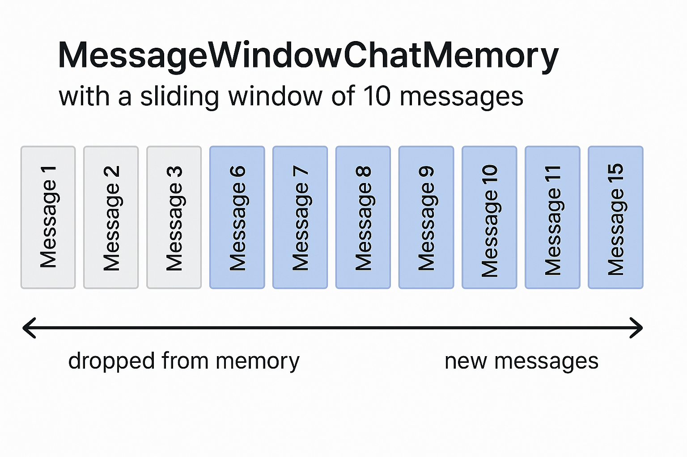

# Module 01: Getting Started with LangChain4j

## Table of Contents

- [What You'll Learn](#what-youll-learn)
- [Prerequisites](#prerequisites)
- [Understanding the Core Problem](#understanding-the-core-problem)
- [Understanding Tokens](#understanding-tokens)
- [How Memory Works](#how-memory-works)
- [How This Uses LangChain4j](#how-this-uses-langchain4j)
- [Deploy Azure OpenAI Infrastructure](#deploy-azure-openai-infrastructure)
- [Run the Application Locally](#run-the-application-locally)
- [Using the Application](#using-the-application)
  - [Stateless Chat (Left Panel)](#stateless-chat-left-panel)
  - [Stateful Chat (Right Panel)](#stateful-chat-right-panel)
- [Next Steps](#next-steps)

## What You'll Learn

If you completed the quick start, you saw how to send prompts and get responses. That's the foundation, but real applications need more. This module teaches you how to build conversational AI that remembers context and maintains state - the difference between a one-off demo and a production-ready application.

We'll use Azure OpenAI's GPT-5 throughout this guide because its advanced reasoning capabilities make the behavior of different patterns more apparent. When you add memory, you'll clearly see the difference. This makes it easier to understand what each component brings to your application.

You'll build one application that demonstrates both patterns:

**Stateless Chat** - Each request is independent. The model has no memory of previous messages. This is the pattern you used in the quick start.

**Stateful Conversation** - Each request includes conversation history. The model maintains context across multiple turns. This is what production applications require.

## Prerequisites

- Azure subscription with Azure OpenAI access
- Java 21, Maven 3.9+ 
- Azure CLI (https://learn.microsoft.com/en-us/cli/azure/install-azure-cli)
- Azure Developer CLI (azd) (https://learn.microsoft.com/en-us/azure/developer/azure-developer-cli/install-azd)

> **Note:** Java, Maven, Azure CLI and Azure Developer CLI (azd) are pre-installed in the provided devcontainer.

## Understanding the Core Problem

Language models are stateless. Each API call is independent. If you send "My name is John" and then ask "What's my name?", the model has no idea you just introduced yourself. It treats every request as if it's the first conversation you've ever had.

This is fine for simple Q&A but useless for real applications. Customer service bots need to remember what you told them. Personal assistants need context. Any multi-turn conversation requires memory.


*The difference between stateless (independent calls) and stateful (context-aware) conversations*

## Understanding Tokens

Before diving into conversations, it's important to understand tokens - the basic units of text that language models process:


*Example of how text is broken into tokens - "I love AI!" becomes 4 separate processing units*

Tokens are how AI models measure and process text. Words, punctuation, and even spaces can be tokens. Your model has a limit of how many tokens it can process at once (400,000 for GPT-5, with up to 272,000 input tokens and 128,000 output tokens). Understanding tokens helps you manage conversation length and costs.

## How Memory Works

Chat memory solves the stateless problem by maintaining conversation history. Before sending your request to the model, the framework prepends relevant previous messages. When you ask "What's my name?", the system actually sends the entire conversation history, allowing the model to see you previously said "My name is John."

LangChain4j provides memory implementations that handle this automatically. You choose how many messages to retain and the framework manages the context window.



*MessageWindowChatMemory maintains a sliding window of recent messages, automatically dropping old ones*

## How This Uses LangChain4j

This module builds on the quick start by adding Spring Boot and conversation memory. Here's what LangChain4j brings:

**Dependencies** - Two core libraries work together:
```xml
<dependency>
    <groupId>dev.langchain4j</groupId>
    <artifactId>langchain4j</artifactId> <!-- Inherited from BOM in root pom.xml -->
</dependency>
<dependency>
    <groupId>dev.langchain4j</groupId>
    <artifactId>langchain4j-azure-open-ai</artifactId> <!-- Inherited from BOM in root pom.xml -->
</dependency>
```

**AzureOpenAiChatModel** - [LangChainConfig.java](src/main/java/com/example/langchain4j/config/LangChainConfig.java)

Instead of the generic `OpenAiChatModel` from the quick start, we use `AzureOpenAiChatModel` which connects directly to Azure OpenAI. Spring Boot configures it as a bean using your Azure credentials (endpoint, API key, deployment name).

```java
@Bean
public AzureOpenAiChatModel chatModel() {
    return AzureOpenAiChatModel.builder()
        .endpoint(azureOpenAiEndpoint)
        .apiKey(azureOpenAiKey)
        .deploymentName(azureOpenAiDeploymentName)
        .build();
}
```

> **🤖 Try with [GitHub Copilot](https://github.com/features/copilot) Chat:** Open [`LangChainConfig.java`](src/main/java/com/example/langchain4j/config/LangChainConfig.java) and ask:
> - "What's the difference between AzureOpenAiChatModel and OpenAiChatModel?"
> - "Why does GPT-5 use maxCompletionTokens instead of maxTokens?"
> - "How can I configure different timeout values or retry policies?"

**MessageWindowChatMemory & Message Types** - [ConversationService.java](src/main/java/com/example/langchain4j/service/ConversationService.java)

The key component for stateful conversations. Create it with `MessageWindowChatMemory.withMaxMessages(10)` to retain the last 10 messages. The service stores one memory instance per conversation ID, allowing multiple users to chat simultaneously without mixing contexts. LangChain4j uses typed messages: `UserMessage.from(text)` for user input and `AiMessage.from(text)` for AI responses. Add these to memory with `memory.add(message)` and retrieve the full history with `memory.messages()`. This structure makes it easy to build conversation context before sending to the model.

```java
ChatMemory memory = MessageWindowChatMemory.withMaxMessages(10);

memory.add(UserMessage.from("My name is John"));
memory.add(AiMessage.from("Nice to meet you, John!"));

memory.add(UserMessage.from("What's my name?"));
String response = chatModel.chat(memory.messages());
memory.add(AiMessage.from(response));
```

> **🤖 Try with [GitHub Copilot](https://github.com/features/copilot) Chat:** Open [`ConversationService.java`](src/main/java/com/example/langchain4j/service/ConversationService.java) and ask:
> - "How does MessageWindowChatMemory decide which messages to drop when the window is full?"
> - "Can I implement custom memory storage using a database instead of in-memory?"
> - "How would I add summarization to compress old conversation history?"

The stateless chat endpoint skips memory entirely - just `chatModel.chat(prompt)` like the quick start. The stateful endpoint adds messages to memory, retrieves history, and includes that context with each request. Same model, different patterns.

## Deploy Azure OpenAI Infrastructure

```bash
cd 01-introduction
azd up  # Select subscription and location (eastus2 recommended)
```

This will:
1. Deploy Azure OpenAI resource with GPT-5 and text-embedding-3-small models
2. Automatically generate `.env` file in project root with credentials
3. Set up all required environment variables

> **Note:** On first deployment, you may encounter a "RequestConflict" error. This is a known Azure timing issue. Simply run `azd up` again and it will complete successfully.

**Verify deployment succeeded:**
```bash
cat ../.env  # Should show AZURE_OPENAI_ENDPOINT, API_KEY, etc.
```

> **Note:** The `azd up` command automatically generates the `.env` file. If you need to update it later, you can either edit the `.env` file manually or regenerate it by running:
> ```bash
> cd ..
> bash .azd-env.sh
> ```

## Run the Application Locally

**Verify deployment:**

Ensure the `.env` file exists in root directory with Azure credentials:
```bash
cat ../.env  # Should show AZURE_OPENAI_ENDPOINT, API_KEY, DEPLOYMENT
```

**Start the applications:**

**Option 1: Using Spring Boot Dashboard (Recommended for VS Code users)**

The dev container includes the Spring Boot Dashboard extension, which provides a visual interface to manage all Spring Boot applications. You can find it in the Activity Bar on the left side of VS Code (look for the Spring Boot icon).

From the Spring Boot Dashboard, you can:
- See all available Spring Boot applications in the workspace
- Start/stop applications with a single click
- View application logs in real-time
- Monitor application status

Simply click the play button next to "introduction" to start this module, or start all modules at once.


**Option 2: Using shell scripts**

Start all web applications (modules 01-04):
```bash
cd ..  # From root directory
./start-all.sh
```

Or start just this module:
```bash
cd 01-introduction
./start.sh
```

Both scripts automatically load environment variables from the root `.env` file and will build the JARs if they don't exist.

> **Note:** If you prefer to build all modules manually before starting:
> ```bash
> cd ..  # Go to root directory
> mvn clean package -DskipTests
> ```

Open http://localhost:8080 in your browser.

**To stop:** Run `./stop.sh` (this module only) or `cd .. && ./stop-all.sh` (all modules)

## Using the Application

The application provides a web interface with two chat implementations side-by-side.


*Dashboard showing both Simple Chat (stateless) and Conversational Chat (stateful) options*

### Stateless Chat (Left Panel)

Try this first. Ask "My name is John" and then immediately ask "What's my name?" The model won't remember because each message is independent. This demonstrates the core problem with basic language model integration - no conversation context.


*AI doesn't remember your name from the previous message*

### Stateful Chat (Right Panel)

Now try the same sequence here. Ask "My name is John" and then "What's my name?" This time it remembers. The difference is MessageWindowChatMemory - it maintains conversation history and includes it with each request. This is how production conversational AI works.


*AI remembers your name from earlier in the conversation*

Both panels use the same GPT-5 model. The only difference is memory. This makes it clear what memory brings to your application and why it's essential for real use cases.

## Next Steps

**Next Module:** [02-prompt-engineering - Prompt Engineering with GPT-5](../02-prompt-engineering/README.md)

---

**Navigation:** [← Previous: Module 00 - Quick Start](../00-quick-start/README.md) | [Back to Main](../README.md) | [Next: Module 02 - Prompt Engineering →](../02-prompt-engineering/README.md)
