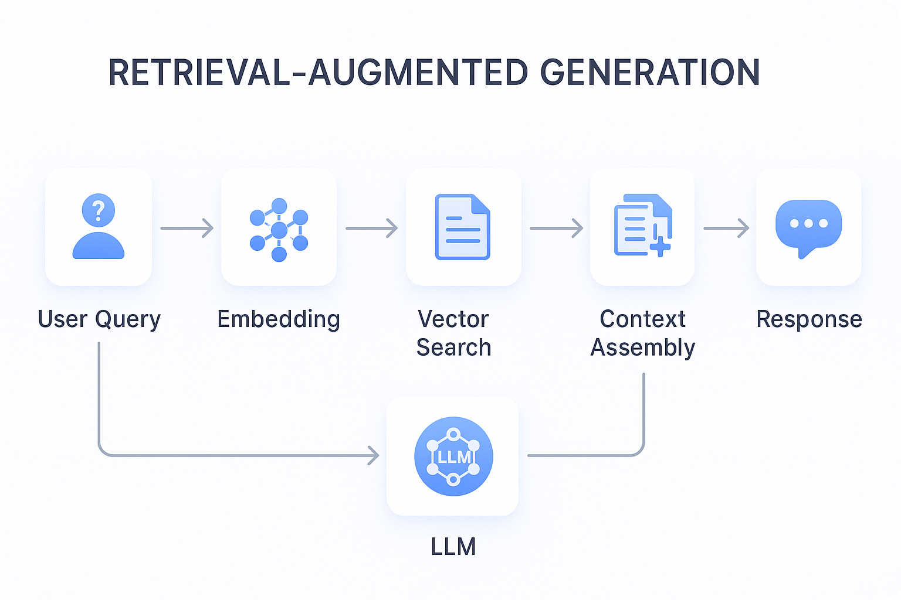

# Module 03: RAG (Retrieval-Augmented Generation)

## Table of Contents

- [What You'll Learn](#what-youll-learn)
- [Understanding RAG](#understanding-rag)
- [How It Works](#how-it-works)
  - [Document Processing](#document-processing)
  - [Creating Embeddings](#creating-embeddings)
  - [Semantic Search](#semantic-search)
  - [Answer Generation](#answer-generation)
- [Quick Start](#quick-start)
  - [Use Existing Azure Resources](#use-existing-azure-resources)
- [Using the Application](#using-the-application)
  - [Upload a Document](#upload-a-document)
  - [Ask Questions](#ask-questions)
  - [Check Source References](#check-source-references)
  - [Experiment with Questions](#experiment-with-questions)
- [Key Concepts](#key-concepts)
  - [Chunking Strategy](#chunking-strategy)
  - [Similarity Scores](#similarity-scores)
  - [In-Memory Storage](#in-memory-storage)
  - [Context Window Management](#context-window-management)
- [When RAG Matters](#when-rag-matters)
- [Next Steps](#next-steps)

## What You'll Learn

In the previous modules, you learned how to have conversations with AI and structure your prompts effectively. But there's a fundamental limitation: language models only know what they learned during training. They can't answer questions about your company's policies, your project documentation, or any information they weren't trained on.

RAG (Retrieval-Augmented Generation) solves this problem. Instead of trying to teach the model your information (which is expensive and impractical), you give it the ability to search through your documents. When someone asks a question, the system finds relevant information and includes it in the prompt. The model then answers based on that retrieved context.



*RAG workflow - from user query to semantic search to contextual answer generation*

## Understanding RAG

Think of RAG as giving the model a reference library. When you ask a question, the system:

1. Searches your documents for relevant information
2. Pulls the most relevant chunks into the context
3. Asks the model to answer based on that specific information
4. Returns the answer along with source references

This grounds the model's responses in your actual data instead of relying on its training knowledge or making up answers.

## How It Works

**Document Processing** - [DocumentService.java](src/main/java/com/example/langchain4j/rag/service/DocumentService.java)

When you upload a document, the system breaks it into chunks - smaller pieces that fit comfortably in the model's context window. These chunks overlap slightly so you don't lose context at the boundaries.

**Creating Embeddings** - [LangChainRagConfig.java](src/main/java/com/example/langchain4j/rag/config/LangChainRagConfig.java)

Each chunk is converted into a numerical representation called an embedding - essentially a mathematical fingerprint that captures the meaning of the text. Similar text produces similar embeddings.


*Documents represented as vectors in embedding space - similar content clusters together*

**Semantic Search** - [RagService.java](src/main/java/com/example/langchain4j/rag/service/RagService.java)

When you ask a question, your question also becomes an embedding. The system compares your question's embedding against all the document chunks' embeddings. It finds the chunks with the most similar meanings - not just matching keywords, but actual semantic similarity.

**Answer Generation** - [RagService.java](src/main/java/com/example/langchain4j/rag/service/RagService.java)

The most relevant chunks are included in the prompt to the model. The model reads those specific chunks and answers your question based on that information. This prevents hallucination - the model can only answer from what's in front of it.

## Quick Start

### Use Existing Azure Resources

**Prerequisites:**

1. Build all modules (required before first run):
```bash
cd ..  # Go to root directory
mvn clean package -DskipTests
```

2. Start the application:

**Note:** If you already started all applications using `./start-all.sh` from Module 01, this module is already running on port 8081. You can skip the start commands below and go directly to http://localhost:8081.

```bash
cd 03-rag
source ../.env
mvn spring-boot:run
```

Or use the start script:
```bash
cd 03-rag
./start.sh  # Automatically sources .env from parent directory
```

Or start all web applications (modules 01-04):
```bash
cd ..
./start-all.sh  # From root directory - runs all 4 Spring Boot apps
```

Open http://localhost:8081 in your browser.

## Using the Application

The application provides a web interface for document upload and questioning.

<a href="images/rag-homepage.png"></a>

*The RAG application interface - upload documents and ask questions*

**Upload a Document**

Start by uploading a document - TXT files work best for testing. A `sample-document.txt` is provided in this directory that contains information about LangChain4j features, RAG implementation, and best practices - perfect for testing the system. 

The system processes your document, breaks it into chunks, and creates embeddings for each chunk. This happens automatically when you upload.

**Ask Questions**

Now ask specific questions about the document content. Try something factual that's clearly stated in the document. The system searches for relevant chunks, includes them in the prompt, and generates an answer.

**Check Source References**

Notice each answer includes source references with similarity scores. These scores (0 to 1) show how relevant each chunk was to your question. Higher scores mean better matches. This lets you verify the answer against the source material.

<a href="images/rag-query-results.png"></a>

*Query results showing answer with source references and relevance scores*

**Experiment with Questions**

Try different types of questions:
- Specific facts: "What is the main topic?"
- Comparisons: "What's the difference between X and Y?"
- Summaries: "Summarize the key points about Z"

Watch how the relevance scores change based on how well your question matches document content.

## Key Concepts

**Chunking Strategy**

Documents are split into 300-token chunks with 30 tokens of overlap. This balance ensures each chunk has enough context to be meaningful while staying small enough to include multiple chunks in a prompt.

**Similarity Scores**

Scores range from 0 to 1:
- 0.7-1.0: Highly relevant, exact match
- 0.5-0.7: Relevant, good context
- Below 0.5: Filtered out, too dissimilar

The system only retrieves chunks above the minimum threshold to ensure quality.

**In-Memory Storage**

This module uses in-memory storage for simplicity. When you restart the application, uploaded documents are lost. Production systems use persistent vector databases like Qdrant or Azure AI Search.

**Context Window Management**

Each model has a maximum context window. You can't include every chunk from a large document. The system retrieves the top N most relevant chunks (default 5) to stay within limits while providing enough context for accurate answers.

## When RAG Matters

**Use RAG when:**
- Answering questions about proprietary documents
- Information changes frequently (policies, prices, specifications)
- Accuracy requires source attribution
- Content is too large to fit in a single prompt
- You need verifiable, grounded responses

**Don't use RAG when:**
- Questions require general knowledge the model already has
- Real-time data is needed (RAG works on uploaded documents)
- Content is small enough to include directly in prompts

## Next Steps

**Next Module:** [04-tools - AI Agents with Tools](../04-tools/README.md)

---

**Navigation:** [← Previous: Module 02 - Prompt Engineering](../02-prompt-engineering/README.md) | [Back to Main](../README.md) | [Next: Module 04 - Tools →](../04-tools/README.md)