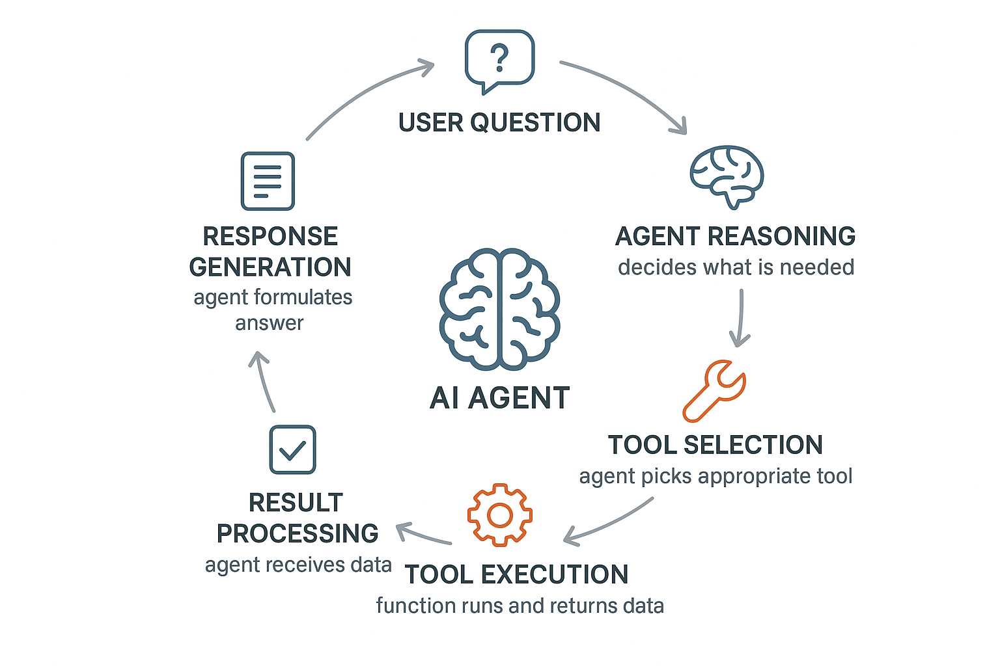
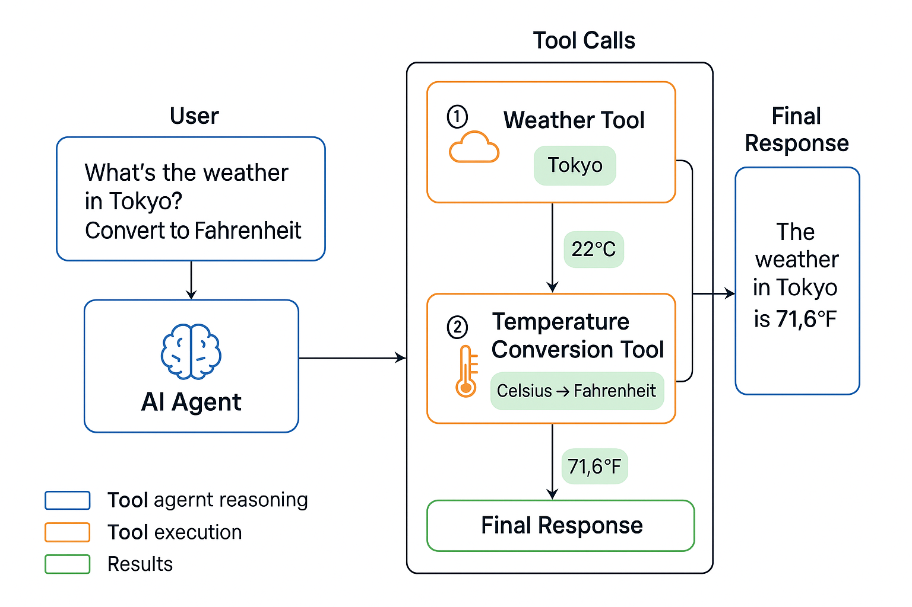
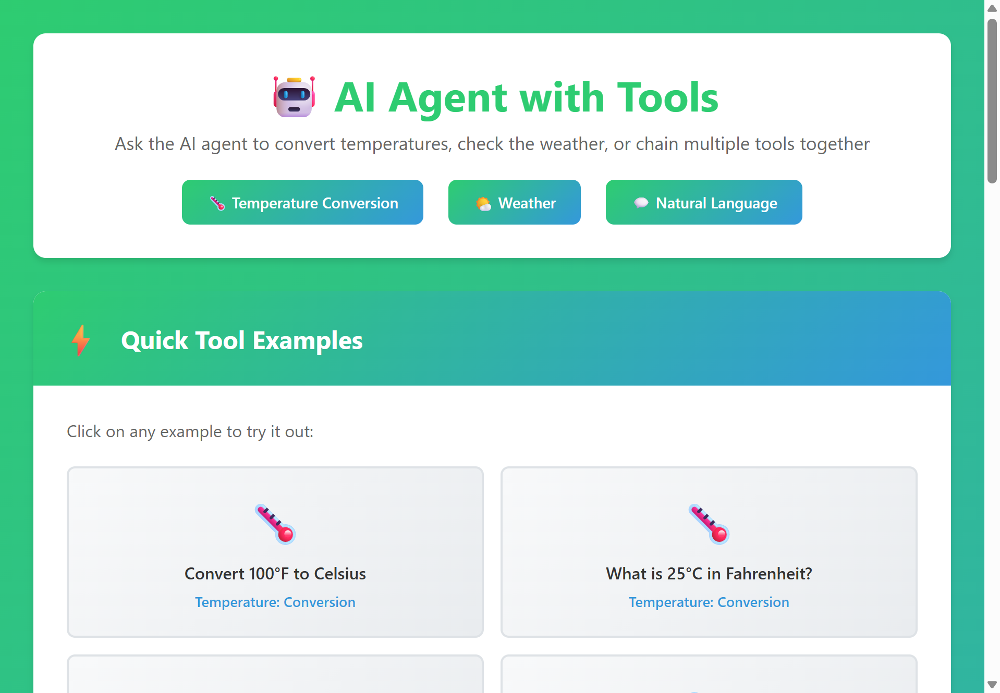
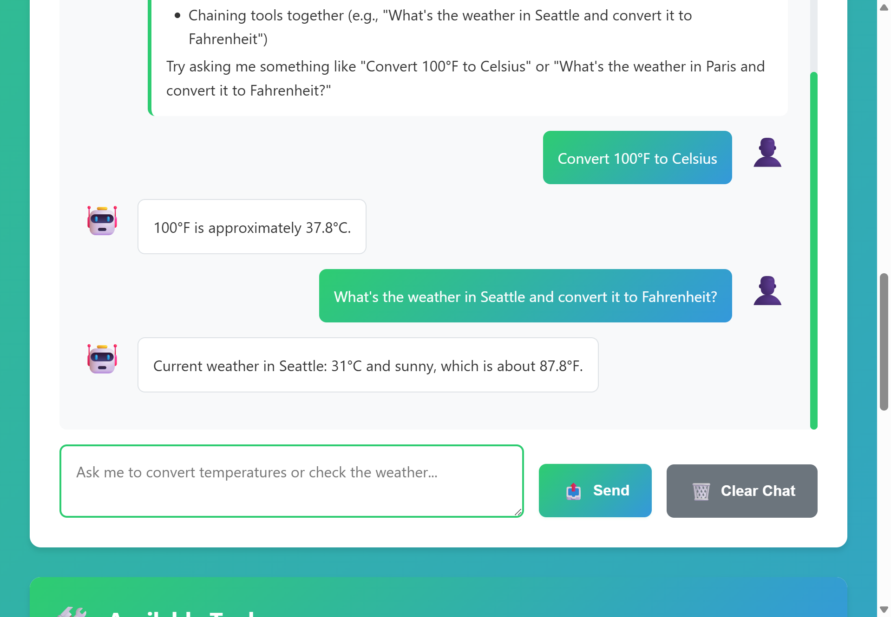
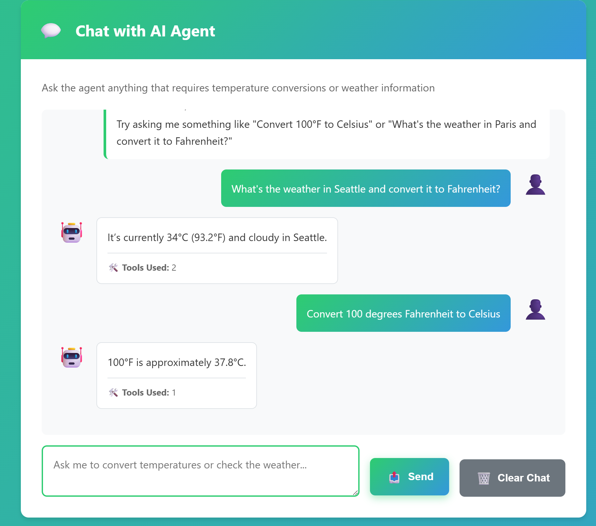

# Module 04: AI Agents with Tools

## Table of Contents

- [What You'll Learn](#what-youll-learn)
- [Understanding AI Agents with Tools](#understanding-ai-agents-with-tools)
- [How Tool Calling Works](#how-tool-calling-works)
  - [Tool Definitions](#tool-definitions)
  - [Decision Making](#decision-making)
  - [Execution](#execution)
  - [Response Generation](#response-generation)
- [Tool Chaining](#tool-chaining)
- [Quick Start](#quick-start)
  - [Use Existing Azure Resources](#use-existing-azure-resources)
- [Using the Application](#using-the-application)
  - [Try Simple Tool Usage](#try-simple-tool-usage)
  - [Test Tool Chaining](#test-tool-chaining)
  - [See Conversation Flow](#see-conversation-flow)
  - [Observe the Reasoning](#observe-the-reasoning)
  - [Experiment with Different Requests](#experiment-with-different-requests)
- [Key Concepts](#key-concepts)
  - [ReAct Pattern (Reasoning and Acting)](#react-pattern-reasoning-and-acting)
  - [Tool Descriptions Matter](#tool-descriptions-matter)
  - [Session Management](#session-management)
  - [Error Handling](#error-handling)
- [Available Tools](#available-tools)
- [When to Use Tool-Based Agents](#when-to-use-tool-based-agents)
- [Next Steps](#next-steps)

## What You'll Learn

So far, you've learned how to have conversations with AI, structure prompts effectively, and ground responses in your documents. But there's still a fundamental limitation: language models can only generate text. They can't check the weather, perform calculations, query databases, or interact with external systems.

Tools change this. By giving the model access to functions it can call, you transform it from a text generator into an agent that can take actions. The model decides when it needs a tool, which tool to use, and what parameters to pass. Your code executes the function and returns the result. The model incorporates that result into its response.

## Understanding AI Agents with Tools

An AI agent with tools follows a reasoning and acting pattern (ReAct):

1. User asks a question
2. Agent reasons about what it needs to know
3. Agent decides if it needs a tool to answer
4. If yes, agent calls the appropriate tool with the right parameters
5. Tool executes and returns data
6. Agent incorporates the result and provides the final answer



*The ReAct pattern - how AI agents alternate between reasoning and acting to solve problems*

This happens automatically. You define the tools and their descriptions. The model handles the decision-making about when and how to use them.

## How Tool Calling Works

**Tool Definitions** - [WeatherTool.java](src/main/java/com/example/langchain4j/agents/tools/WeatherTool.java) | [TemperatureTool.java](src/main/java/com/example/langchain4j/agents/tools/TemperatureTool.java)

You define functions with clear descriptions and parameter specifications. The model sees these descriptions in its system prompt and understands what each tool does.

```java
public class WeatherTool {
    
    @Tool("Get the current weather for a location")
    public String getCurrentWeather(@P("Location name") String location) {
        // Your weather lookup logic
        return "Weather in " + location + ": 22°C, cloudy";
    }
}

interface Assistant {
    String chat(String userMessage);
}

Assistant assistant = AiServices.builder(Assistant.class)
    .chatLanguageModel(model)
    .tools(new WeatherTool())
    .build();
```

> 💡 **Explore with GitHub Copilot:** Open [`WeatherTool.java`](src/main/java/com/example/langchain4j/agents/tools/WeatherTool.java) and ask:
> - "How would I integrate a real weather API like OpenWeatherMap instead of mock data?"
> - "What makes a good tool description that helps the AI use it correctly?"
> - "How do I handle API errors and rate limits in tool implementations?"

**Decision Making**

When a user asks "What's the weather in Seattle?", the model recognizes it needs the weather tool. It generates a function call with the location parameter set to "Seattle".

**Execution** - [AgentService.java](src/main/java/com/example/langchain4j/agents/service/AgentService.java)

Your code intercepts the function call, executes the actual weather lookup (via API or database), and returns the result to the model.

> 💡 **Explore with GitHub Copilot:** Open [`AgentService.java`](src/main/java/com/example/langchain4j/agents/service/AgentService.java) and ask:
> - "How does the ReAct pattern work and why is it effective for AI agents?"
> - "How does the agent decide which tool to use and in what order?"
> - "What happens if a tool execution fails - how should I handle errors robustly?"

**Response Generation**

The model receives the weather data and formats it into a natural language response for the user.

## Tool Chaining

**Tool Chaining** - The AI might call multiple tools in sequence. Ask "What's the weather in Seattle and should I bring an umbrella?" and watch it chain `getCurrentWeather` with reasoning about rain gear.

<a href="images/tool-chaining.png"></a>

*Sequential tool calls - one tool's output feeds into the next decision*

**Graceful Failures** - Ask for weather in a city that's not in the mock data. The tool returns an error message, and the AI explains it can't help. Tools fail safely.

This happens in a single conversation turn. The agent orchestrates multiple tool calls autonomously.

## Quick Start

### Use Existing Azure Resources

**Prerequisites:**

1. Build all modules (required before first run):
```bash
cd ..  # Go to root directory
mvn clean package -DskipTests
```

2. Start the application:

**Note:** If you already started all applications using `./start-all.sh` from Module 01, this module is already running on port 8084. You can skip the start commands below and go directly to http://localhost:8084.

**Recommended:** Start all web applications (modules 01-04):
```bash
cd ..  # From root directory
./start-all.sh
```

Or start just this module:
```bash
cd 04-tools
./start.sh
```

Both scripts automatically load environment variables from the root `.env` file.

Open http://localhost:8084 in your browser.

## Using the Application

The application provides a web interface where you can interact with an AI agent that has access to weather and temperature conversion tools.

<a href="images/tools-homepage.png"></a>

*The AI Agent Tools interface - quick examples and chat interface for interacting with tools*

**Try Simple Tool Usage**

Start with a straightforward request: "Convert 100 degrees Fahrenheit to Celsius". The agent recognizes it needs the temperature conversion tool, calls it with the right parameters, and returns the result. Notice how natural this feels - you didn't specify which tool to use or how to call it.

**Test Tool Chaining**

Now try something more complex: "What's the weather in Seattle and convert it to Fahrenheit?" Watch the agent work through this in steps. It first gets the weather (which returns Celsius), recognizes it needs to convert to Fahrenheit, calls the conversion tool, and combines both results into one response.

<a href="images/tools-chaining-demo.png"></a>

*Agent using multiple tools - weather lookup followed by temperature conversion*

**See Conversation Flow**

<a href="images/tools-chaining-demo.png"></a>

*Agent using multiple tools - weather lookup followed by temperature conversion*

**Observe the Reasoning**

The interface shows you which tools were called. This visibility into the agent's decision-making helps you understand how it breaks down complex requests into tool executions.

<a href="images/tools-conversation-demo.png"></a>

*Multi-turn conversation showing both single tool usage and tool chaining*

**Experiment with Different Requests**

Try various combinations:
- Weather lookups: "What's the weather in Tokyo?"
- Temperature conversions: "What is 25°C in Kelvin?"
- Combined queries: "Check the weather in Paris and tell me if it's above 20°C"

Notice how the agent interprets natural language and maps it to appropriate tool calls.

## Key Concepts

**ReAct Pattern (Reasoning and Acting)**

The agent alternates between reasoning (deciding what to do) and acting (using tools). This pattern enables autonomous problem-solving rather than just responding to instructions.

**Tool Descriptions Matter**

The quality of your tool descriptions directly affects how well the agent uses them. Clear, specific descriptions help the model understand when and how to call each tool.

**Session Management**

Like the conversation memory in Module 01, tool-based agents maintain session context. The agent remembers previous tool calls and results within a session, enabling multi-turn interactions.

**Error Handling**

Tools can fail - APIs timeout, parameters might be invalid, external services go down. Production agents need error handling so the model can explain problems or try alternatives.

## Available Tools

**Weather Tools** (mock data for demonstration):
- Get current weather for a location
- Get multi-day forecast

**Temperature Conversion Tools**:
- Celsius to Fahrenheit
- Fahrenheit to Celsius
- Celsius to Kelvin
- Kelvin to Celsius
- Fahrenheit to Kelvin
- Kelvin to Fahrenheit

These are simple examples, but the pattern extends to any function: database queries, API calls, calculations, file operations, or system commands.

## When to Use Tool-Based Agents

**Use tools when:**
- Answering requires real-time data (weather, stock prices, inventory)
- You need to perform calculations beyond simple math
- Accessing databases or APIs
- Taking actions (sending emails, creating tickets, updating records)
- Combining multiple data sources

**Don't use tools when:**
- Questions can be answered from general knowledge
- Response is purely conversational
- Tool latency would make the experience too slow

## Next Steps

**Next Module:** [05-mcp - Model Context Protocol (MCP)](../05-mcp/README.md)

---

**Navigation:** [← Previous: Module 03 - RAG](../03-rag/README.md) | [Back to Main](../README.md) | [Next: Module 05 - MCP →](../05-mcp/README.md)