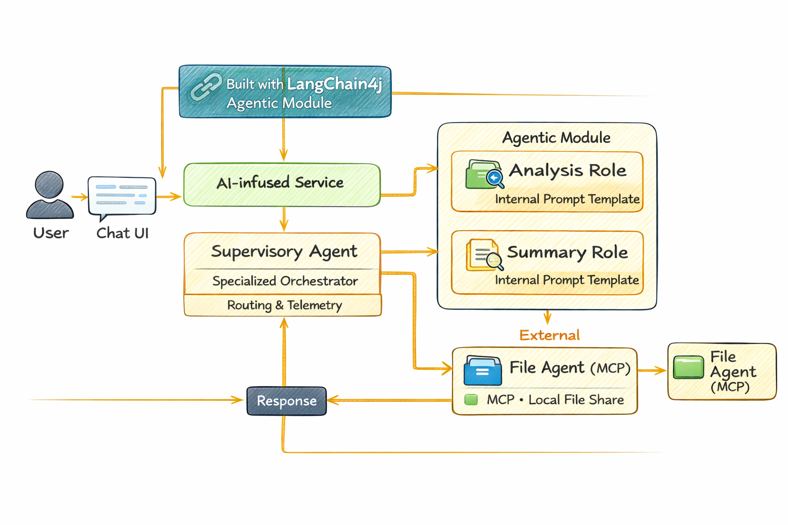

# Module 05: Model Context Protocol (MCP)

## Table of Contents

- [What You'll Learn](#what-youll-learn)
- [What is MCP?](#what-is-mcp)
- [How MCP Works](#how-mcp-works)
- [The Agentic Module](#the-agentic-module)
- [Running the Examples](#running-the-examples)
  - [Prerequisites](#prerequisites)
- [Quick Start](#quick-start)
  - [File Operations (Stdio)](#file-operations-stdio)
  - [Supervisor Agent](#supervisor-agent)
    - [Understanding the Output](#understanding-the-output)
    - [Response Strategies](#response-strategies)
    - [Explanation of Agentic Module Features](#explanation-of-agentic-module-features)
- [Key Concepts](#key-concepts)
- [Congratulations!](#congratulations)
  - [What's Next?](#whats-next)

## What You'll Learn

You've built conversational AI, mastered prompts, grounded responses in documents, and created agents with tools. But all those tools were custom-built for your specific application. What if you could give your AI access to a standardized ecosystem of tools that anyone can create and share? In this module, you'll learn how to do just that with the Model Context Protocol (MCP) and LangChain4j's agentic module. We first showcase a simple MCP file reader and then show how it easily integrates into advanced agentic workflows using the Supervisor Agent pattern.

## What is MCP?

The Model Context Protocol (MCP) provides exactly that - a standard way for AI applications to discover and use external tools. Instead of writing custom integrations for each data source or service, you connect to MCP servers that expose their capabilities in a consistent format. Your AI agent can then discover and use these tools automatically.


*Before MCP: Complex point-to-point integrations. After MCP: One protocol, endless possibilities.*

MCP solves a fundamental problem in AI development: every integration is custom. Want to access GitHub? Custom code. Want to read files? Custom code. Want to query a database? Custom code. And none of these integrations work with other AI applications.

MCP standardizes this. An MCP server exposes tools with clear descriptions and schemas. Any MCP client can connect, discover available tools, and use them. Build once, use everywhere.


*Model Context Protocol architecture - standardized tool discovery and execution*

## How MCP Works

**Server-Client Architecture**

MCP uses a client-server model. Servers provide tools - reading files, querying databases, calling APIs. Clients (your AI application) connect to servers and use their tools.

To use MCP with LangChain4j, add this Maven dependency:

```xml
<dependency>
    <groupId>dev.langchain4j</groupId>
    <artifactId>langchain4j-mcp</artifactId>
    <version>${langchain4j.version}</version>
</dependency>
```

**Tool Discovery**

When your client connects to an MCP server, it asks "What tools do you have?" The server responds with a list of available tools, each with descriptions and parameter schemas. Your AI agent can then decide which tools to use based on user requests.

**Transport Mechanisms**

MCP supports different transport mechanisms. This module demonstrates the Stdio transport for local processes:


*MCP transport mechanisms: HTTP for remote servers, Stdio for local processes*

**Stdio** - [StdioTransportDemo.java](src/main/java/com/example/langchain4j/mcp/StdioTransportDemo.java)

For local processes. Your application spawns a server as a subprocess and communicates through standard input/output. Useful for filesystem access or command-line tools.

```java
McpTransport stdioTransport = new StdioMcpTransport.Builder()
    .command(List.of(
        npmCmd, "exec",
        "@modelcontextprotocol/server-filesystem@2025.12.18",
        resourcesDir
    ))
    .logEvents(false)
    .build();
```

> **🤖 Try with [GitHub Copilot](https://github.com/features/copilot) Chat:** Open [`StdioTransportDemo.java`](src/main/java/com/example/langchain4j/mcp/StdioTransportDemo.java) and ask:
> - "How does Stdio transport work and when should I use it vs HTTP?"
> - "How does LangChain4j manage the lifecycle of spawned MCP server processes?"
> - "What are the security implications of giving AI access to the file system?"

## The Agentic Module

While MCP provides standardized tools, LangChain4j's **agentic module** provides a declarative way to build agents that orchestrate those tools. The `@Agent` annotation and `AgenticServices` let you define agent behavior through interfaces rather than imperative code.

In this module, you'll explore the **Supervisor Agent** pattern — an advanced agentic AI approach where a "supervisor" agent dynamically decides which sub-agents to invoke based on user requests. We'll combine both concepts by giving one of our sub-agents MCP-powered file access capabilities.

To use the agentic module, add this Maven dependency:

```xml
<dependency>
    <groupId>dev.langchain4j</groupId>
    <artifactId>langchain4j-agentic</artifactId>
    <version>${langchain4j.mcp.version}</version>
</dependency>
```

> **⚠️ Experimental:** The `langchain4j-agentic` module is **experimental** and subject to change. The stable way to build AI assistants remains `langchain4j-core` with custom tools (Module 04).

## Running the Examples

### Prerequisites

- Java 21+, Maven 3.9+
- Node.js 16+ and npm (for MCP servers)
- Environment variables configured in `.env` file (from the root directory):
  - `AZURE_OPENAI_ENDPOINT`, `AZURE_OPENAI_API_KEY`, `AZURE_OPENAI_DEPLOYMENT` (same as Modules 01-04)

> **Note:** If you haven't set up your environment variables yet, see [Module 00 - Quick Start](../00-quick-start/README.md) for instructions, or copy `.env.example` to `.env` in the root directory and fill in your values.

## Quick Start

**Using VS Code:** Simply right-click on any demo file in the Explorer and select **"Run Java"**, or use the launch configurations from the Run and Debug panel (make sure you've added your token to the `.env` file first).

**Using Maven:** Alternatively, you can run from the command line with the examples below.

### File Operations (Stdio)

This demonstrates local subprocess-based tools.

**✅ No prerequisites needed** - the MCP server is spawned automatically.

**Using the Start Scripts (Recommended):**

The start scripts automatically load environment variables from the root `.env` file:

**Bash:**
```bash
cd 05-mcp
chmod +x start-stdio.sh
./start-stdio.sh
```

**PowerShell:**
```powershell
cd 05-mcp
.\start-stdio.ps1
```

**Using VS Code:** Right-click on `StdioTransportDemo.java` and select **"Run Java"** (ensure your `.env` file is configured).

The application spawns a filesystem MCP server automatically and reads a local file. Notice how the subprocess management is handled for you.

**Expected output:**
```
Assistant response: The file provides an overview of LangChain4j, an open-source Java library
for integrating Large Language Models (LLMs) into Java applications...
```

### Supervisor Agent

The **Supervisor Agent pattern** is a **flexible** form of agentic AI. A Supervisor uses an LLM to autonomously decide which agents to invoke based on the user's request. In the next example, we combine MCP-powered file access with an LLM agent to create a supervised file read → report workflow.

In the demo, `FileAgent` reads a file using MCP filesystem tools, and `ReportAgent` generates a structured report with an executive summary (1 sentence), 3 key points, and recommendations. The Supervisor orchestrates this flow automatically:



```
┌─────────────┐      ┌──────────────┐
│  FileAgent  │ ───▶ │ ReportAgent  │
│ (MCP tools) │      │  (pure LLM)  │
└─────────────┘      └──────────────┘
 outputKey:           outputKey:
 'fileContent'        'report'
```

Each agent stores its output in the **Agentic Scope** (shared memory), allowing downstream agents to access previous results. This demonstrates how MCP tools integrate seamlessly into agentic workflows — the Supervisor doesn't need to know *how* files are read, only that `FileAgent` can do it.

**Using the Start Scripts (Recommended):**

The start scripts automatically load environment variables from the root `.env` file:

**Bash:**
```bash
cd 05-mcp
chmod +x start-supervisor.sh
./start-supervisor.sh
```

**PowerShell:**
```powershell
cd 05-mcp
.\start-supervisor.ps1
```

**Using VS Code:** Right-click on `SupervisorAgentDemo.java` and select **"Run Java"** (ensure your `.env` file is configured).

**How the Supervisor Works:**

```java
// Step 1: FileAgent reads files using MCP tools
FileAgent fileAgent = AgenticServices.agentBuilder(FileAgent.class)
        .chatModel(model)
        .toolProvider(mcpToolProvider)  // Has MCP tools for file operations
        .build();

// Step 2: ReportAgent generates structured reports
ReportAgent reportAgent = AgenticServices.agentBuilder(ReportAgent.class)
        .chatModel(model)
        .build();

// Supervisor orchestrates the file → report workflow
SupervisorAgent supervisor = AgenticServices.supervisorBuilder()
        .chatModel(model)
        .subAgents(fileAgent, reportAgent)
        .responseStrategy(SupervisorResponseStrategy.LAST)  // Return the final report
        .build();

// The Supervisor decides which agents to invoke based on the request
String response = supervisor.invoke("Read the file at /path/file.txt and generate a report");
```

#### Response Strategies

When you configure a `SupervisorAgent`, you specify how it should formulate its final answer to the user after the sub-agents have completed their tasks. The available strategies are:

| Strategy | Description |
|----------|-------------|
| **LAST** | The supervisor returns the output of the last sub-agent or tool called. This is useful when the final agent in the workflow is specifically designed to produce the complete, final answer (e.g., a "Summary Agent" in a research pipeline). |
| **SUMMARY** | The supervisor uses its own internal Language Model (LLM) to synthesize a summary of the entire interaction and all sub-agent outputs, then returns that summary as the final response. This provides a clean, aggregated answer to the user. |
| **SCORED** | The system uses an internal LLM to score both the LAST response and the SUMMARY of the interaction against the original user request, returning whichever output receives the higher score. |

See [SupervisorAgentDemo.java](src/main/java/com/example/langchain4j/mcp/SupervisorAgentDemo.java) for the complete implementation.

> **🤖 Try with [GitHub Copilot](https://github.com/features/copilot) Chat:** Open [`SupervisorAgentDemo.java`](src/main/java/com/example/langchain4j/mcp/SupervisorAgentDemo.java) and ask:
> - "How does the Supervisor decide which agents to invoke?"
> - "What's the difference between Supervisor and Sequential workflow patterns?"
> - "How can I customize the Supervisor's planning behavior?"

#### Understanding the Output

When you run the demo, you'll see a structured walkthrough of how the Supervisor orchestrates multiple agents. Here's what each section means:

```
======================================================================
  FILE → REPORT WORKFLOW DEMO
======================================================================

This demo shows a clear 2-step workflow: read a file, then generate a report.
The Supervisor orchestrates the agents automatically based on the request.
```

**The header** introduces the workflow concept: a focused pipeline from file reading to report generation.

```
--- WORKFLOW ---------------------------------------------------------
  ┌─────────────┐      ┌──────────────┐
  │  FileAgent  │ ───▶ │ ReportAgent  │
  │ (MCP tools) │      │  (pure LLM)  │
  └─────────────┘      └──────────────┘
   outputKey:           outputKey:
   'fileContent'        'report'

--- AVAILABLE AGENTS -------------------------------------------------
  [FILE]   FileAgent   - Reads files via MCP → stores in 'fileContent'
  [REPORT] ReportAgent - Generates structured report → stores in 'report'
```

**Workflow Diagram** shows the data flow between agents. Each agent has a specific role:
- **FileAgent** reads files using MCP tools and stores raw content in `fileContent`
- **ReportAgent** consumes that content and produces a structured report in `report`

```
--- USER REQUEST -----------------------------------------------------
  "Read the file at .../file.txt and generate a report on its contents"
```

**User Request** shows the task. The Supervisor parses this and decides to invoke FileAgent → ReportAgent.

```
--- SUPERVISOR ORCHESTRATION -----------------------------------------
  The Supervisor decides which agents to invoke and passes data between them...

  +-- STEP 1: Supervisor chose -> FileAgent (reading file via MCP)
  |
  |   Input: .../file.txt
  |
  |   Result: LangChain4j is an open-source, provider-agnostic Java framework for building LLM...
  +-- [OK] FileAgent (reading file via MCP) completed

  +-- STEP 2: Supervisor chose -> ReportAgent (generating structured report)
  |
  |   Input: LangChain4j is an open-source, provider-agnostic Java framew...
  |
  |   Result: Executive Summary
LangChain4j is a provider-agnostic Java framework that normali...
  +-- [OK] ReportAgent (generating structured report) completed
```

**Supervisor Orchestration** shows the 2-step flow in action:
1. **FileAgent** reads the file via MCP and stores the content
2. **ReportAgent** receives the content and generates a structured report

The Supervisor made these decisions **autonomously** based on the user's request.

```
--- FINAL RESPONSE ---------------------------------------------------
Executive Summary
...

Key Points
...

Recommendations
...

--- AGENTIC SCOPE (Data Flow) ----------------------------------------
  Each agent stores its output for downstream agents to consume:
  * fileContent: LangChain4j is an open-source, provider-agnostic Java framework...
  * report: Executive Summary...
```

#### Explanation of Agentic Module Features

The example demonstrates several advanced features of the agentic module. Let's have a closer look at Agentic Scope and Agent Listeners.

**Agentic Scope** shows the shared memory where agents stored their results using `@Agent(outputKey="...")`. This allows:
- Later agents to access earlier agents' outputs
- The Supervisor to synthesize a final response
- You to inspect what each agent produced

```java
ResultWithAgenticScope<String> result = supervisor.invokeWithAgenticScope(request);
AgenticScope scope = result.agenticScope();
String fileContent = scope.readState("fileContent");  // Raw file data from FileAgent
String report = scope.readState("report");            // Structured report from ReportAgent
```

**Agent Listeners** enable monitoring and debugging of agent execution. The step-by-step output you see in the demo comes from an AgentListener that hooks into each agent invocation:
- **beforeAgentInvocation** - Called when the Supervisor selects an agent, letting you see which agent was chosen and why
- **afterAgentInvocation** - Called when an agent completes, showing its result
- **inheritedBySubagents** - When true, the listener monitors all agents in the hierarchy

```java
AgentListener monitor = new AgentListener() {
    private int step = 0;
    
    @Override
    public void beforeAgentInvocation(AgentRequest request) {
        step++;
        System.out.println("  +-- STEP " + step + ": " + request.agentName());
    }
    
    @Override
    public void afterAgentInvocation(AgentResponse response) {
        System.out.println("  +-- [OK] " + response.agentName() + " completed");
    }
    
    @Override
    public boolean inheritedBySubagents() {
        return true; // Propagate to all sub-agents
    }
};
```

Beyond the Supervisor pattern, the `langchain4j-agentic` module provides several powerful workflow patterns and features:

| Pattern | Description | Use Case |
|---------|-------------|----------|
| **Sequential** | Execute agents in order, output flows to next | Pipelines: research → analyze → report |
| **Parallel** | Run agents simultaneously | Independent tasks: weather + news + stocks |
| **Loop** | Iterate until condition met | Quality scoring: refine until score ≥ 0.8 |
| **Conditional** | Route based on conditions | Classify → route to specialist agent |
| **Human-in-the-Loop** | Add human checkpoints | Approval workflows, content review |

## Key Concepts

Now that you've explored MCP and the agentic module in action, let's summarize when to use each approach.

**MCP** is ideal when you want to leverage existing tool ecosystems, build tools that multiple applications can share, integrate third-party services with standard protocols, or swap tool implementations without changing code.

**The Agentic Module** works best when you want declarative agent definitions with `@Agent` annotations, need workflow orchestration (sequential, loop, parallel), prefer interface-based agent design over imperative code, or are combining multiple agents that share outputs via `outputKey`.

**The Supervisor Agent pattern** shines when the workflow isn't predictable in advance and you want the LLM to decide, when you have multiple specialized agents that need dynamic orchestration, when building conversational systems that route to different capabilities, or when you want the most flexible, adaptive agent behavior.

## Congratulations!

You've completed the LangChain4j for Beginners course. You've learned:

- How to build conversational AI with memory (Module 01)
- Prompt engineering patterns for different tasks (Module 02)
- Grounding responses in your documents with RAG (Module 03)
- Creating basic AI agents (assistants) with custom tools (Module 04)
- Integrating standardized tools with the LangChain4j MCP and Agentic modules (Module 05)

### What's Next?

After completing the modules, explore the [Testing Guide](../docs/TESTING.md) to see LangChain4j testing concepts in action.

**Official Resources:**
- [LangChain4j Documentation](https://docs.langchain4j.dev/) - Comprehensive guides and API reference
- [LangChain4j GitHub](https://github.com/langchain4j/langchain4j) - Source code and examples
- [LangChain4j Tutorials](https://docs.langchain4j.dev/tutorials/) - Step-by-step tutorials for various use cases

Thank you for completing this course!

---

**Navigation:** [← Previous: Module 04 - Tools](../04-tools/README.md) | [Back to Main](../README.md)

