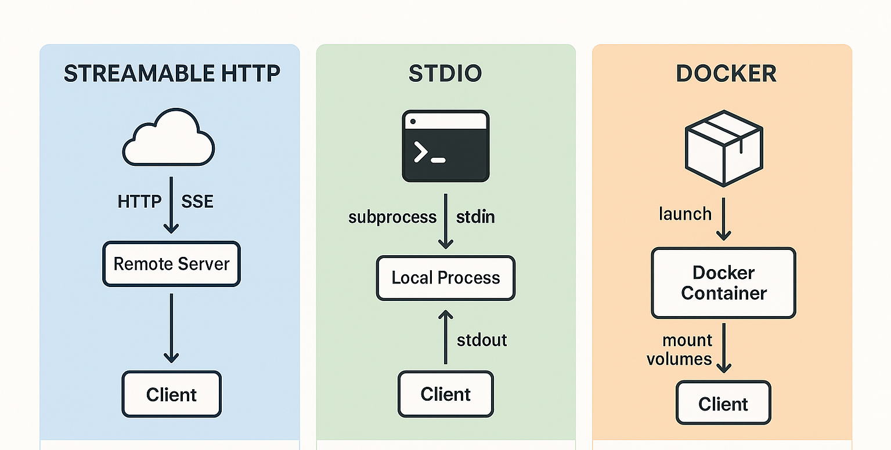

# Module 05: Model Context Protocol (MCP)

## Table of Contents

- [What You'll Learn](#what-youll-learn)
- [Understanding MCP](#understanding-mcp)
- [How MCP Works](#how-mcp-works)
- [Running the Examples](#running-the-examples)
  - [Prerequisites](#prerequisites)
- [Quick Start](#quick-start)
  - [File Operations (Stdio)](#file-operations-stdio)
  - [Supervisor Agent (Pure Agentic AI)](#supervisor-agent-pure-agentic-ai)
- [Key Concepts](#key-concepts)
- [Project Structure](#project-structure)
- [When to Use MCP](#when-to-use-mcp)
- [MCP Ecosystem](#mcp-ecosystem)
- [Congratulations!](#congratulations)
  - [What's Next?](#whats-next)
- [Troubleshooting](#troubleshooting)

## What You'll Learn

You've built conversational AI, mastered prompts, grounded responses in documents, and created agents with tools. But all those tools were custom-built for your specific application. What if you could give your AI access to a standardized ecosystem of tools that anyone can create and share?

The Model Context Protocol (MCP) provides exactly that - a standard way for AI applications to discover and use external tools. Instead of writing custom integrations for each data source or service, you connect to MCP servers that expose their capabilities in a consistent format. Your AI agent can then discover and use these tools automatically.

In this module, you'll learn:

- **Model Context Protocol (MCP)** - A standard way for AI applications to discover and use external tools
- **MCP Transports** - How to connect to MCP servers using Stdio for local processes
- **Tool Discovery** - How AI agents automatically discover and use available tools
- **Agentic Module** - Build declarative agents using `@Agent` annotations and `AgenticServices` - the modern approach to creating AI agents that can leverage MCP tools


*Before MCP: Complex point-to-point integrations. After MCP: One protocol, endless possibilities.*

## Understanding MCP

MCP solves a fundamental problem in AI development: every integration is custom. Want to access GitHub? Custom code. Want to read files? Custom code. Want to query a database? Custom code. And none of these integrations work with other AI applications.

MCP standardizes this. An MCP server exposes tools with clear descriptions and schemas. Any MCP client can connect, discover available tools, and use them. Build once, use everywhere.


*Model Context Protocol architecture - standardized tool discovery and execution*

## How MCP Works

**Server-Client Architecture**

MCP uses a client-server model. Servers provide tools - reading files, querying databases, calling APIs. Clients (your AI application) connect to servers and use their tools.

**Tool Discovery**

When your client connects to an MCP server, it asks "What tools do you have?" The server responds with a list of available tools, each with descriptions and parameter schemas. Your AI agent can then decide which tools to use based on user requests.

**Combining MCP with the Agentic Module**

While MCP provides standardized tools, LangChain4j's **agentic module** provides a declarative way to build the agents that use those tools. The `@Agent` annotation and `AgenticServices` let you define agent behavior through interfaces rather than imperative code, making it easy to create sophisticated agents that leverage MCP's tool ecosystem.

> **⚠️ Experimental:** Currently, the **NEW** `langchain4j-agentic` module should be considered **experimental** and is subject to change in future releases. The stable way to build AI assistants remains the `langchain4j-core` module with custom tools (Module 04). The agentic module is evolving rapidly to provide a more declarative and flexible approach to building AI agents.

**Transport Mechanisms**

MCP supports different transport mechanisms. This module demonstrates the Stdio transport for local processes:



*MCP transport mechanisms: HTTP for remote servers, Stdio for local processes*

**Stdio** - [StdioTransportDemo.java](src/main/java/com/example/langchain4j/mcp/StdioTransportDemo.java)

For local processes. Your application spawns a server as a subprocess and communicates through standard input/output. Useful for filesystem access or command-line tools.

```java
McpTransport stdioTransport = new StdioMcpTransport.Builder()
    .command(List.of(
        npmCmd, "exec",
        "@modelcontextprotocol/server-filesystem@2025.12.18",
        resourcesDir
    ))
    .logEvents(false)
    .build();
```

> **🤖 Try with [GitHub Copilot](https://github.com/features/copilot) Chat:** Open [`StdioTransportDemo.java`](src/main/java/com/example/langchain4j/mcp/StdioTransportDemo.java) and ask:
> - "How does Stdio transport work and when should I use it vs HTTP?"
> - "How does LangChain4j manage the lifecycle of spawned MCP server processes?"
> - "What are the security implications of giving AI access to the file system?"

## Running the Examples

### Prerequisites

- Java 21+, Maven 3.9+
- Node.js 16+ and npm (for MCP servers)
- GitHub Personal Access Token configured in `.env` file (from Module 00)

> **Note:** If you haven't set up your GitHub token yet, see [Module 00 - Quick Start](../00-quick-start/README.md) for instructions.

## Quick Start

**Using VS Code:** Simply right-click on any demo file in the Explorer and select **"Run Java"**, or use the launch configurations from the Run and Debug panel (make sure you've added your token to the `.env` file first).

**Using Maven:** Alternatively, you can run from the command line with the examples below.

### File Operations (Stdio)

This demonstrates local subprocess-based tools.

**✅ No prerequisites needed** - the MCP server is spawned automatically.

**Using VS Code:** Right-click on `StdioTransportDemo.java` and select **"Run Java"**.

**Using Maven:**

**Bash:**
```bash
export GITHUB_TOKEN=your_token_here
cd 05-mcp
mvn compile exec:java -Dexec.mainClass=com.example.langchain4j.mcp.StdioTransportDemo
```

**PowerShell:**
```powershell
$env:GITHUB_TOKEN=your_token_here
cd 05-mcp
mvn --% compile exec:java -Dexec.mainClass=com.example.langchain4j.mcp.StdioTransportDemo
```

The application spawns a filesystem MCP server automatically and reads a local file. Notice how the subprocess management is handled for you.

**Expected output:**
```
Assistant response: The file provides an overview of LangChain4j, an open-source Java library
for integrating Large Language Models (LLMs) into Java applications...
```

### Supervisor Agent (Pure Agentic AI)

The **Supervisor Agent** pattern is the most flexible form of agentic AI. Unlike deterministic workflows (sequential, loop, parallel), a Supervisor uses an LLM to autonomously decide which agents to invoke based on the user's request.

**Key concepts:**
- The Supervisor analyzes the user request and generates an execution plan
- It decides which sub-agents to invoke and in what order
- It can adapt dynamically to different types of requests
- Returns either the last agent's response or a summary of all operations

**Using VS Code:** Right-click on `SupervisorAgentDemo.java` and select **"Run Java"**.

**Using Maven:**

**Bash:**
```bash
export GITHUB_TOKEN=your_token_here
cd 05-mcp
mvn compile exec:java -Dexec.mainClass=com.example.langchain4j.mcp.SupervisorAgentDemo
```

**PowerShell:**
```powershell
$env:GITHUB_TOKEN=your_token_here
cd 05-mcp
mvn --% compile exec:java -Dexec.mainClass=com.example.langchain4j.mcp.SupervisorAgentDemo
```

**How the Supervisor Works:**

```java
// Define multiple agents with specific capabilities
FileAgent fileAgent = AgenticServices.agentBuilder(FileAgent.class)
        .chatModel(model)
        .toolProvider(mcpToolProvider)  // Has MCP tools for file operations
        .build();

AnalysisAgent analysisAgent = AgenticServices.agentBuilder(AnalysisAgent.class)
        .chatModel(model)
        .build();

SummaryAgent summaryAgent = AgenticServices.agentBuilder(SummaryAgent.class)
        .chatModel(model)
        .build();

// Create a Supervisor that orchestrates these agents
SupervisorAgent supervisor = AgenticServices.supervisorBuilder()
        .chatModel(model)  // The "planner" model
        .subAgents(fileAgent, analysisAgent, summaryAgent)
        .responseStrategy(SupervisorResponseStrategy.SUMMARY)
        .build();

// The Supervisor autonomously decides which agents to invoke
// Just pass a natural language request - the LLM plans the execution
String response = supervisor.invoke("Read the file at /path/file.txt and analyze it");
```

See [SupervisorAgentDemo.java](src/main/java/com/example/langchain4j/mcp/SupervisorAgentDemo.java) for the complete implementation.

> **🤖 Try with [GitHub Copilot](https://github.com/features/copilot) Chat:** Open [`SupervisorAgentDemo.java`](src/main/java/com/example/langchain4j/mcp/SupervisorAgentDemo.java) and ask:
> - "How does the Supervisor decide which agents to invoke?"
> - "What's the difference between Supervisor and Sequential workflow patterns?"
> - "How can I customize the Supervisor's planning behavior?"

**Expected output:**
```
Supervisor Agent Demo (Pure Agentic AI Pattern)
==================================================

📋 Request 1: Read and Analyze
User request: Read the file at .../file.txt and analyze what it's about
--------------------------------------------------

🤖 Supervisor Response:
The file contains information about LangChain4j framework. Analysis shows it describes...

==================================================

📋 Request 2: Summarize Content
User request: [asking for summary of LangChain4j description]
--------------------------------------------------

🤖 Supervisor Response:
LangChain4j is a Java AI library providing unified APIs, RAG support, and agent capabilities...
```

## Key Concepts

**MCP Server-Client Architecture**

MCP uses a standardized client-server model where servers expose tools and clients (your AI application) discover and use them. This decouples tool implementation from AI agents, enabling tool reuse across different applications.

**Tool Discovery**

When your client connects to an MCP server, it automatically discovers available tools with their descriptions and parameter schemas. Your AI agent can then decide which tools to use based on user requests without hardcoded integrations.

**The @Agent Annotation**

The `@Agent` annotation marks methods as agentic workflow steps. It includes a description (for LLM understanding) and an `outputKey` (for sharing results between agents). This declarative approach replaces imperative tool coordination code.

**Supervisor vs Deterministic Workflows**

- **Sequential/Loop/Parallel** - You define the exact execution order; predictable but inflexible
- **Supervisor** - The LLM decides which agents to invoke and in what order; flexible but requires a capable planning model

**Response Strategies**

The Supervisor Agent supports three response strategies:
- `LAST` - Returns the final agent's response (default)
- `SUMMARY` - Returns a summary of all operations performed
- `SCORED` - Uses another LLM to score and select the best response

## Project Structure

This module organizes agents into a dedicated folder to separate concerns and improve maintainability:

```
05-mcp/src/main/java/com/example/langchain4j/mcp/
├── agents/                      # Agent interfaces (sub-agents)
│   ├── FileAgent.java           # Reads files via MCP tools
│   ├── AnalysisAgent.java       # Analyzes content structure and themes
│   └── SummaryAgent.java        # Creates concise summaries
├── StdioTransportDemo.java      # Basic MCP transport demo
└── SupervisorAgentDemo.java     # Supervisor pattern demo
```

**Multi-Agent Workflow Diagram:**

```
┌─────────────────────────────────────────────────────────────────────┐
│                         User Request                                │
│            "Read file.txt and analyze what it's about"              │
└─────────────────────────────────────────────────────────────────────┘
                                  │
                                  ▼
┌─────────────────────────────────────────────────────────────────────┐
│                        Supervisor Agent                             │
│  ┌───────────────────────────────────────────────────────────────┐  │
│  │ 🧠 LLM Plans Execution:                                       │  │
│  │    1. User wants to read a file → invoke FileAgent            │  │
│  │    2. User wants analysis → invoke AnalysisAgent              │  │
│  └───────────────────────────────────────────────────────────────┘  │
└─────────────────────────────────────────────────────────────────────┘
                                  │
          ┌───────────────────────┴───────────────────────┐
          ▼                                               ▼
┌─────────────────────┐                     ┌─────────────────────────┐
│     FileAgent       │                     │     AnalysisAgent       │
│  ┌───────────────┐  │                     │  ┌───────────────────┐  │
│  │  @Agent       │  │  outputKey:         │  │  @Agent           │  │
│  │  description: │  │  "summary"          │  │  description:     │  │
│  │  "Reads and   │  │      │              │  │  "Analyzes text"  │  │
│  │  summarizes   │  │      │              │  └───────────────────┘  │
│  │  file..."     │  │      ▼              │            │            │
│  └───────────────┘  │   Agentic Scope     │            ▼            │
│         │           │   ┌───────────┐     │     outputKey:          │
│         ▼           │   │ summary:  │     │     "analysis"          │
│   MCP Tool Call     │   │ "..."     │     └─────────────────────────┘
│   read_file()       │   └───────────┘
└─────────────────────┘         │
                                ▼
┌─────────────────────────────────────────────────────────────────────┐
│                        Supervisor Returns                           │
│              (Based on ResponseStrategy: SUMMARY)                   │
│      "The file describes LangChain4j framework. Analysis shows..."  │
└─────────────────────────────────────────────────────────────────────┘
```

**Key Workflow Concepts:**

1. **Supervisor as Orchestrator** - The Supervisor Agent receives the user request and uses an LLM to plan which sub-agents to invoke. This is "pure agentic AI" - the LLM decides the workflow, not hardcoded logic.

2. **Specialized Sub-Agents** - Each agent in the `agents/` folder is specialized:
   - `FileAgent` - Has MCP tools for file system access
   - `AnalysisAgent` - Pure LLM reasoning for content analysis
   - `SummaryAgent` - Pure LLM reasoning for summarization

3. **Output Sharing via Agentic Scope** - Agents can share data using `outputKey`. When `FileAgent` returns a result, it's stored in the agentic scope under the key "summary", making it available to subsequent agents.

4. **Dynamic Routing** - The Supervisor reads the `@Agent` descriptions to understand each agent's capabilities. Based on the user request, it dynamically selects which agents to invoke.

## When to Use MCP

**Use MCP when:**
- You want to leverage existing tool ecosystems
- Building tools that multiple applications will use
- Integrating third-party services with standard protocols
- You need to swap tool implementations without code changes

**Use the Agentic Module when:**
- You want declarative agent definitions with `@Agent` annotations
- Building agents that need workflow orchestration (sequential, loop, parallel)
- You prefer interface-based agent design over imperative code
- Combining multiple agents that can share outputs via `outputKey`

**Use the Supervisor Agent pattern when:**
- The workflow isn't predictable in advance - let the LLM decide
- You have multiple specialized agents and want dynamic orchestration
- Building conversational systems that need to route to different capabilities
- You want the most flexible, adaptive agent behavior

## MCP Ecosystem

The Model Context Protocol is an open standard with a growing ecosystem:

- Official MCP servers for common tasks (filesystem, Git, databases)
- Community-contributed servers for various services
- Standardized tool descriptions and schemas
- Cross-framework compatibility (works with any MCP client)

This standardization means tools built for one AI application work with others, creating a shared ecosystem of capabilities.

LangChain4j's agentic module complements MCP by providing a declarative layer on top. While MCP standardizes *what tools are available*, the agentic module standardizes *how agents use those tools* - through annotations, interfaces, and workflow patterns. Together, they enable building sophisticated AI agents with minimal boilerplate code.

## Congratulations!

You've completed the LangChain4j for Beginners course. You've learned:

- How to build conversational AI with memory (Module 01)
- Prompt engineering patterns for different tasks (Module 02)
- Grounding responses in your documents with RAG (Module 03)
- Creating AI agents with custom tools (Module 04)
- Integrating standardized tools through MCP (Module 05)
- Building declarative agents with the agentic module
- Orchestrating multiple agents with the Supervisor pattern

You now have the foundation to build production AI applications. The concepts you've learned apply regardless of specific frameworks or models - they're fundamental patterns in AI engineering.

### What's Next?

After completing the modules, explore the [Testing Guide](../docs/TESTING.md) to see LangChain4j testing concepts in action.

**Official Resources:**
- [LangChain4j Documentation](https://docs.langchain4j.dev/) - Comprehensive guides and API reference
- [LangChain4j GitHub](https://github.com/langchain4j/langchain4j) - Source code and examples
- [LangChain4j Tutorials](https://docs.langchain4j.dev/tutorials/) - Step-by-step tutorials for various use cases

Thank you for completing this course!

---

**Navigation:** [← Previous: Module 04 - Tools](../04-tools/README.md) | [Back to Main](../README.md)

---

## Troubleshooting

### PowerShell Maven Command Syntax

**Issue**: Maven commands fail with error `Unknown lifecycle phase ".mainClass=..."`

**Cause**: PowerShell interprets `=` as a variable assignment operator, breaking Maven property syntax

**Solution**: Use the stop-parsing operator `--%` before the Maven command:

**PowerShell:**
```powershell
mvn --% compile exec:java -Dexec.mainClass=com.example.langchain4j.mcp.StdioTransportDemo
```

**Bash:**
```bash
mvn compile exec:java -Dexec.mainClass=com.example.langchain4j.mcp.StdioTransportDemo
```

The `--%` operator tells PowerShell to pass all remaining arguments literally to Maven without interpretation.
