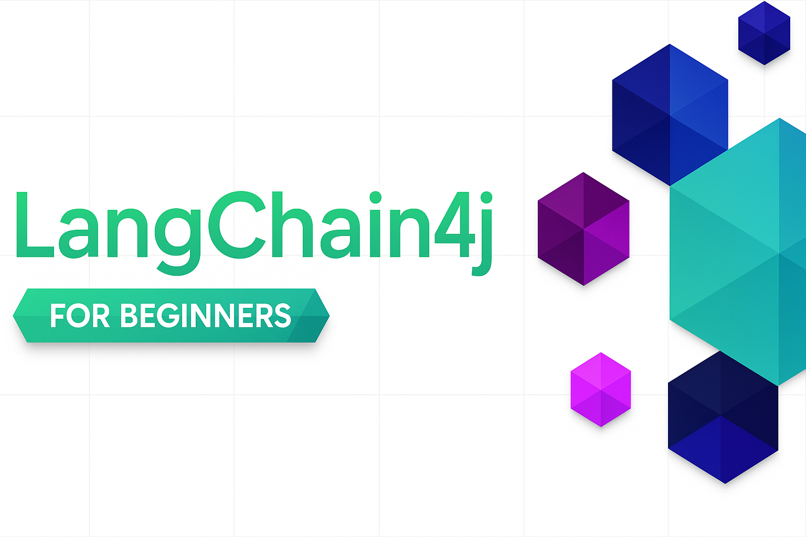
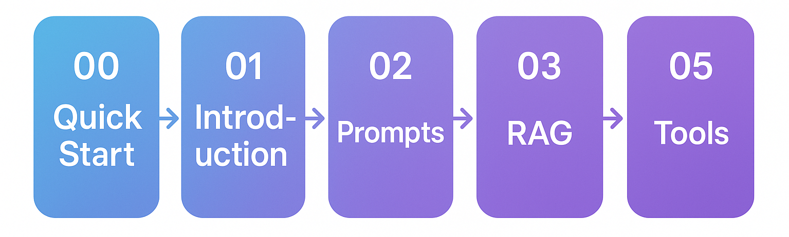

### 🌐 Multi-Language Support

#### Supported via GitHub Action (Automated & Always Up-to-Date)

<!-- CO-OP TRANSLATOR LANGUAGES TABLE START -->
[Arabic](./translations/ar/README.md) | [Bengali](./translations/bn/README.md) | [Bulgarian](./translations/bg/README.md) | [Burmese (Myanmar)](./translations/my/README.md) | [Chinese (Simplified)](./translations/zh/README.md) | [Chinese (Traditional, Hong Kong)](./translations/hk/README.md) | [Chinese (Traditional, Macau)](./translations/mo/README.md) | [Chinese (Traditional, Taiwan)](./translations/tw/README.md) | [Croatian](./translations/hr/README.md) | [Czech](./translations/cs/README.md) | [Danish](./translations/da/README.md) | [Dutch](./translations/nl/README.md) | [Estonian](./translations/et/README.md) | [Finnish](./translations/fi/README.md) | [French](./translations/fr/README.md) | [German](./translations/de/README.md) | [Greek](./translations/el/README.md) | [Hebrew](./translations/he/README.md) | [Hindi](./translations/hi/README.md) | [Hungarian](./translations/hu/README.md) | [Indonesian](./translations/id/README.md) | [Italian](./translations/it/README.md) | [Japanese](./translations/ja/README.md) | [Kannada](./translations/kn/README.md) | [Korean](./translations/ko/README.md) | [Lithuanian](./translations/lt/README.md) | [Malay](./translations/ms/README.md) | [Malayalam](./translations/ml/README.md) | [Marathi](./translations/mr/README.md) | [Nepali](./translations/ne/README.md) | [Nigerian Pidgin](./translations/pcm/README.md) | [Norwegian](./translations/no/README.md) | [Persian (Farsi)](./translations/fa/README.md) | [Polish](./translations/pl/README.md) | [Portuguese (Brazil)](./translations/br/README.md) | [Portuguese (Portugal)](./translations/pt/README.md) | [Punjabi (Gurmukhi)](./translations/pa/README.md) | [Romanian](./translations/ro/README.md) | [Russian](./translations/ru/README.md) | [Serbian (Cyrillic)](./translations/sr/README.md) | [Slovak](./translations/sk/README.md) | [Slovenian](./translations/sl/README.md) | [Spanish](./translations/es/README.md) | [Swahili](./translations/sw/README.md) | [Swedish](./translations/sv/README.md) | [Tagalog (Filipino)](./translations/tl/README.md) | [Tamil](./translations/ta/README.md) | [Telugu](./translations/te/README.md) | [Thai](./translations/th/README.md) | [Turkish](./translations/tr/README.md) | [Ukrainian](./translations/uk/README.md) | [Urdu](./translations/ur/README.md) | [Vietnamese](./translations/vi/README.md)
<!-- CO-OP TRANSLATOR LANGUAGES TABLE END -->

# LangChain4j for Beginners

A course for building AI applications with LangChain4j and Azure OpenAI GPT-5, from basic chat to AI agents.

**New to LangChain4j?** Check out the [Glossary](docs/GLOSSARY.md) for definitions of key terms and concepts.

## Table of Contents

1. [Quick Start](00-quick-start/README.md) - Get started with LangChain4j
2. [Introduction](01-introduction/README.md) - Learn the fundamentals of LangChain4j
3. [Prompt Engineering](02-prompt-engineering/README.md) - Master effective prompt design
4. [RAG (Retrieval-Augmented Generation)](03-rag/README.md) - Build intelligent knowledge-based systems
5. [Tools](04-tools/README.md) - Integrate external tools and APIs with AI agents
6. [MCP (Model Context Protocol)](05-mcp/README.md) - Work with the Model Context Protocol
---

##  Learning Path

Start with the [Quick Start](00-quick-start/README.md) module and progress through each module to build your skills step-by-step. You'll try basic examples to understand the fundamentals before moving to the [Introduction](01-introduction/README.md) module for a deeper dive with GPT-5.

After completing the modules, explore the [Testing Guide](docs/TESTING.md) to see LangChain4j testing concepts in action.

> **Note:** This training uses both GitHub Models and Azure OpenAI. The [Quick Start](00-quick-start/README.md) and [MCP](05-mcp/README.md) modules use GitHub Models (no Azure subscription required), while modules 1-4 use Azure OpenAI GPT-5.

## Learning with GitHub Copilot

To quickly start coding, open this project in a GitHub Codespace or your local IDE with the provided devcontainer. The devcontainer used in this course comes pre-configured with GitHub Copilot for AI paired programming.

Each code example includes suggested questions you can ask GitHub Copilot to deepen your understanding. Look for the 💡/🤖 prompts in:

- **Java file headers** - Questions specific to each example
- **Module READMEs** - Exploration prompts after code examples

**How to use:** Open any code file and ask Copilot the suggested questions. It has full context of the codebase and can explain, extend, and suggest alternatives.

Want to learn more? Check out [Copilot for AI Paired Programming](https://aka.ms/GitHubCopilotAI).

## Additional Resources 

### LangChain

---

### Azure / Edge / MCP / Agents

---
 
### Generative AI Series

[-9333EA?style=for-the-badge&labelColor=E5E7EB&color=9333EA)](https://github.com/microsoft/Generative-AI-for-beginners-dotnet?WT.mc_id=academic-105485-koreyst)
[-C084FC?style=for-the-badge&labelColor=E5E7EB&color=C084FC)](https://github.com/microsoft/generative-ai-for-beginners-java?WT.mc_id=academic-105485-koreyst)
[-E879F9?style=for-the-badge&labelColor=E5E7EB&color=E879F9)](https://github.com/microsoft/generative-ai-with-javascript?WT.mc_id=academic-105485-koreyst)

---
 
### Core Learning

---
 
### Copilot Series

## Getting Help

If you get stuck or have any questions about building AI apps, join:

If you have product feedback or errors while building visit:

## License

MIT License - See [LICENSE](LICENSE) file for details.

