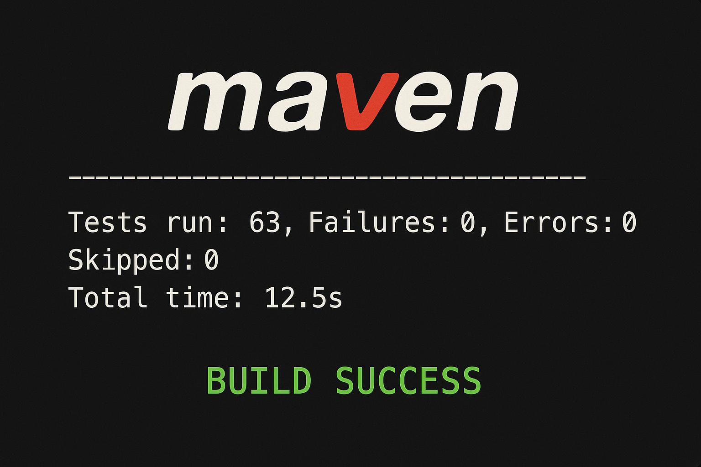
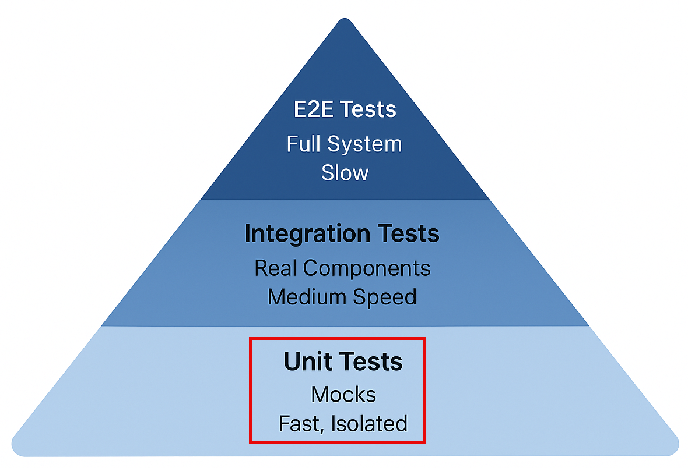
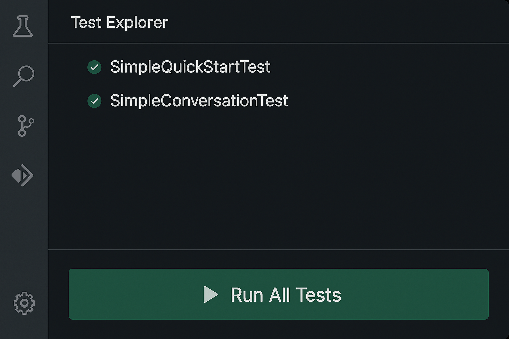
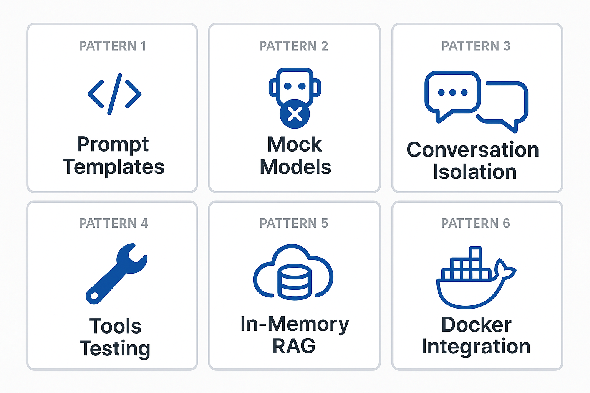
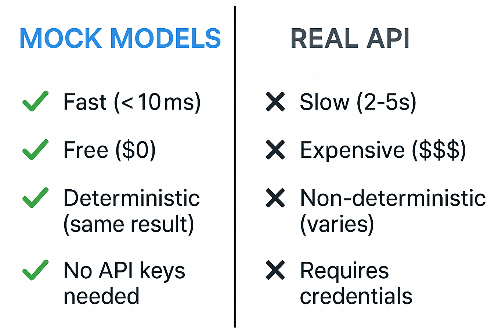
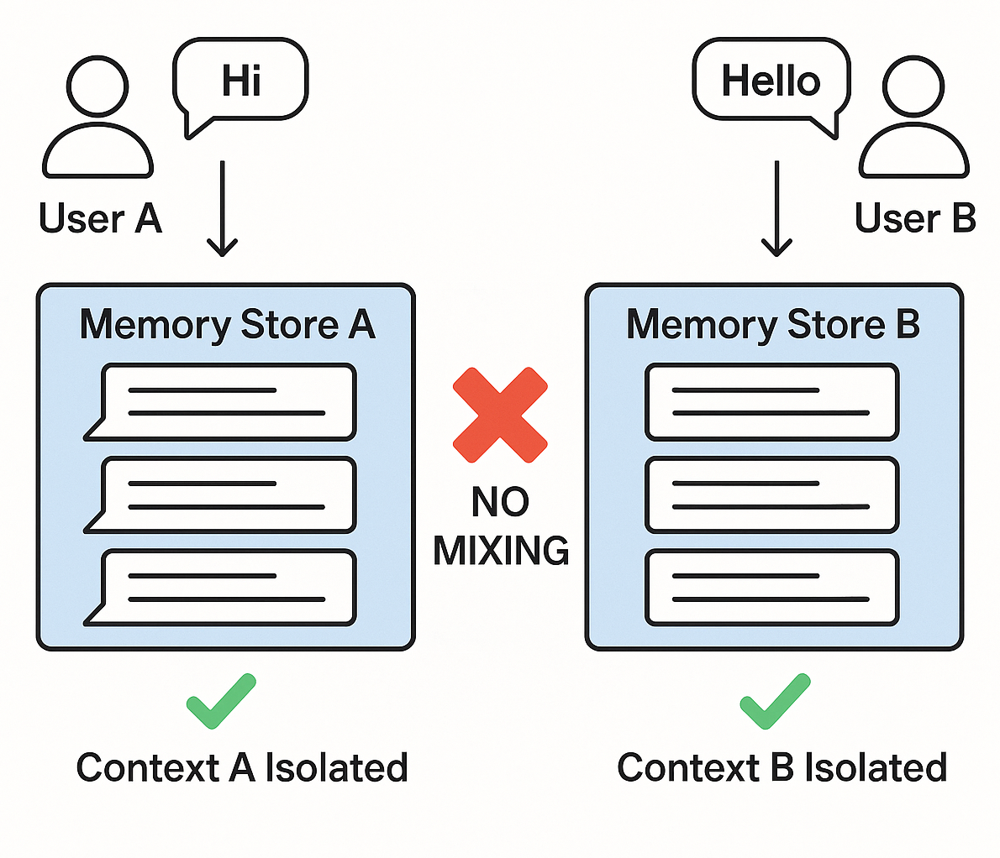
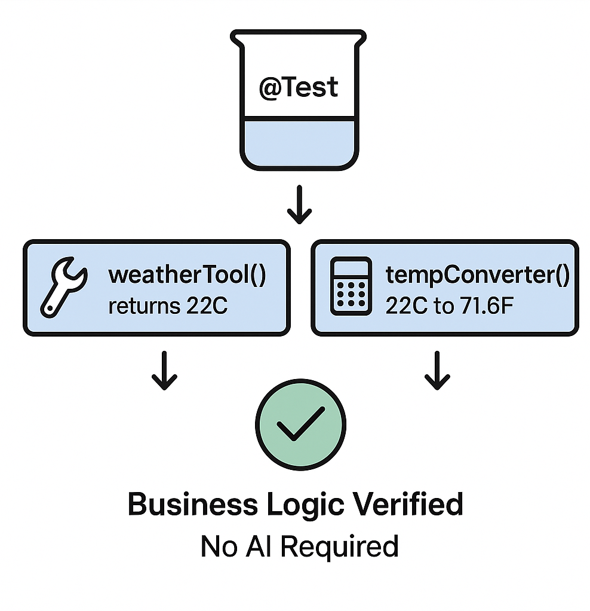
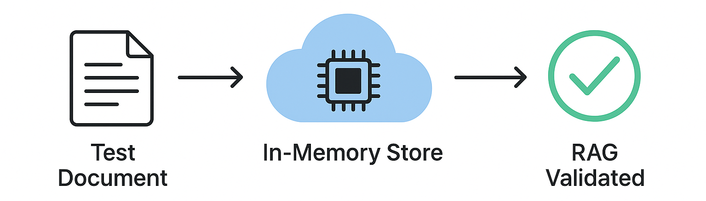
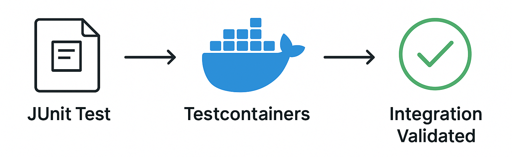

# Testing LangChain4j Applications

This guide walks you through the tests that demonstrate how to test AI applications without requiring API keys or external services.

## Quick Start

Run all tests with a single command:

```bash
mvn test
```



*Successful test execution showing all tests passing with zero failures*

## Table of Contents

- [Quick Start](#quick-start)
- [What the Tests Cover](#what-the-tests-cover)
- [Running the Tests](#running-the-tests)
- [Running Tests in VS Code](#running-tests-in-vs-code)
- [Testing Patterns](#testing-patterns)
- [Testing Philosophy](#testing-philosophy)
- [Next Steps](#next-steps)

## What the Tests Cover

This course includes tests that run locally. Each test demonstrates a specific LangChain4j concept in isolation.



*Testing pyramid showing the balance between unit tests (fast, isolated), integration tests (real components), and end-to-end tests (full system with Docker)*

| Module | Tests | Focus | Key Files |
|--------|-------|-------|-----------|
| **00 - Quick Start** | 6 | Prompt templates and variable substitution | `SimpleQuickStartTest.java` |
| **01 - Introduction** | 8 | Conversation memory and stateful chat | `SimpleConversationTest.java` |
| **02 - Prompt Engineering** | 12 | GPT-5 patterns, eagerness levels, structured output | `SimpleGpt5PromptTest.java` |
| **03 - RAG** | 10 | Document ingestion, embeddings, similarity search | `DocumentServiceTest.java` |
| **04 - Tools** | 12 | Function calling and tool chaining | `SimpleToolsTest.java` |
| **05 - MCP** | 15 | Model Context Protocol with Docker | `SimpleMcpTest.java`, `McpDockerTransportTest.java` |

## Running the Tests

Run all tests from the root directory with `mvn test`. For a specific module, navigate to that directory first with `cd 01-introduction && mvn test`, or run from root while targeting a specific module with `mvn test -pl 01-introduction`. To run a single test class, use `mvn test -Dtest=SimpleConversationTest`. Add a method name to run just one test with `mvn test -Dtest=SimpleConversationTest#shouldMaintainConversationHistory`.

## Running Tests in VS Code

If you're using Visual Studio Code, the Test Explorer provides a graphical interface for running and debugging tests.



*VS Code Test Explorer showing the test tree with all Java test classes and individual test methods*

**To run tests in VS Code:**

1. Open the Test Explorer by clicking the beaker icon in the Activity Bar
2. Expand the test tree to see all modules and test classes
3. Click the play button next to any test to run it individually
4. Click "Run All Tests" to execute the entire suite
5. Right-click any test and select "Debug Test" to set breakpoints and step through code

The Test Explorer shows green checkmarks for passing tests and provides detailed failure messages when tests fail.

## Testing Patterns



*Six testing patterns for LangChain4j applications: prompt templates, mocking models, conversation isolation, tools testing, in-memory RAG, and Docker integration*

### Pattern 1: Testing Prompt Templates

The simplest pattern tests prompt templates without calling any AI model. You verify that variable substitution works correctly and prompts are formatted as expected.


*Testing prompt templates showing variable substitution flow: template with placeholders → values applied → formatted output verified*

```java
@Test
@DisplayName("Should format prompt template with variables")
void testPromptTemplateFormatting() {
    PromptTemplate template = PromptTemplate.from(
        "Best time to visit {{destination}} for {{activity}}?"
    );
    
    Prompt prompt = template.apply(Map.of(
        "destination", "Paris",
        "activity", "sightseeing"
    ));
    
    assertThat(prompt.text()).isEqualTo("Best time to visit Paris for sightseeing?");
}
```

This test lives in `00-quick-start/src/test/java/com/example/langchain4j/azure/quickstart/SimpleQuickStartTest.java`. Run it with `cd 00-quick-start && mvn test -Dtest=SimpleQuickStartTest#testPromptTemplateFormatting`.

### Pattern 2: Mocking Language Models

When testing conversation logic, use Mockito to create fake models that return predetermined responses. This makes tests fast, free, and deterministic.



*Comparison showing why mocks are preferred for testing: they're fast, free, deterministic, and require no API keys*

```java
@ExtendWith(MockitoExtension.class)
class SimpleConversationTest {
    
    @Mock
    private AzureOpenAiChatModel mockChatModel;
    
    @BeforeEach
    void setUp() {
        when(mockChatModel.chat(anyString())).thenReturn("Test response");
        conversationService = new ConversationService(mockChatModel);
    }
    
    @Test
    void shouldMaintainConversationHistory() {
        String conversationId = conversationService.startConversation();
        
        when(mockChatModel.chat(anyString()))
            .thenReturn("Response 1")
            .thenReturn("Response 2")
            .thenReturn("Response 3");

        conversationService.chat(conversationId, "First message");
        conversationService.chat(conversationId, "Second message");
        conversationService.chat(conversationId, "Third message");

        List<ChatMessage> history = conversationService.getHistory(conversationId);
        assertThat(history).hasSize(6); // 3 user + 3 AI messages
    }
}
```

This pattern appears in `01-introduction/src/test/java/com/example/langchain4j/service/SimpleConversationTest.java`. The mock ensures consistent behavior so you can verify memory management works correctly.

### Pattern 3: Testing Conversation Isolation

Conversation memory must keep multiple users separate. This test verifies that conversations don't mix contexts.



*Testing conversation isolation showing separate memory stores for different users to prevent context mixing*

```java
@Test
void shouldIsolateConversationsByid() {
    String conv1 = conversationService.startConversation();
    String conv2 = conversationService.startConversation();
    
    when(mockChatModel.chat(anyString())).thenReturn("Response");

    conversationService.chat(conv1, "Message for conversation 1");
    conversationService.chat(conv2, "Message for conversation 2");

    List<ChatMessage> history1 = conversationService.getHistory(conv1);
    List<ChatMessage> history2 = conversationService.getHistory(conv2);
    
    assertThat(history1).hasSize(2);
    assertThat(history2).hasSize(2);
}
```

Each conversation maintains its own independent history. In production systems, this isolation is critical for multi-user applications.

### Pattern 4: Testing Tools Independently

Tools are functions the AI can call. Test them directly to ensure they work correctly regardless of AI decisions.



*Testing tools independently showing mock tool execution without AI calls to verify business logic*

```java
@Test
void shouldConvertCelsiusToFahrenheit() {
    TemperatureTool tempTool = new TemperatureTool();
    String result = tempTool.celsiusToFahrenheit(25.0);
    assertThat(result).containsPattern("77[.,]0°F");
}

@Test
void shouldDemonstrateToolChaining() {
    WeatherTool weatherTool = new WeatherTool();
    TemperatureTool tempTool = new TemperatureTool();

    String weatherResult = weatherTool.getCurrentWeather("Seattle");
    assertThat(weatherResult).containsPattern("\\d+°C");

    String conversionResult = tempTool.celsiusToFahrenheit(22.0);
    assertThat(conversionResult).containsPattern("71[.,]6°F");
}
```

These tests from `04-tools/src/test/java/com/example/langchain4j/agents/tools/SimpleToolsTest.java` validate tool logic without AI involvement. The chaining example shows how one tool's output feeds into another's input.

### Pattern 5: In-Memory RAG Testing

RAG systems traditionally require vector databases and embedding services. The in-memory pattern lets you test the entire pipeline without external dependencies.



*In-memory RAG testing workflow showing document parsing, embedding storage, and similarity search without requiring a database*

```java
@Test
void testProcessTextDocument() {
    String content = "This is a test document.\nIt has multiple lines.";
    InputStream inputStream = new ByteArrayInputStream(content.getBytes(StandardCharsets.UTF_8));
    
    DocumentService.ProcessedDocument result = 
        documentService.processDocument(inputStream, "test.txt");

    assertNotNull(result);
    assertTrue(result.segments().size() > 0);
    assertEquals("test.txt", result.segments().get(0).metadata().getString("filename"));
}
```

This test from `03-rag/src/test/java/com/example/langchain4j/rag/service/DocumentServiceTest.java` creates a document in memory and verifies chunking and metadata handling.

### Pattern 6: Integration Testing with Docker

Some features need real infrastructure. The MCP module uses Testcontainers to spin up Docker containers for integration tests. These validate your code works with actual services while maintaining test isolation.



*MCP integration testing with Testcontainers showing automated container lifecycle: start, test execution, stop, and cleanup*

The tests in `05-mcp/src/test/java/com/example/langchain4j/mcp/McpDockerTransportTest.java` require Docker to be running. Run them with `cd 05-mcp && mvn test`.

## Testing Philosophy

Test your code, not the AI. Your tests should validate the code you write by checking how prompts are constructed, how memory is managed, and how tools execute. AI responses vary and shouldn't be part of test assertions. Ask yourself whether your prompt template correctly substitutes variables, not whether the AI gives the right answer.

Use mocks for language models. They're external dependencies that are slow, expensive, and non-deterministic. Mocking makes tests fast with milliseconds instead of seconds, free with no API costs, and deterministic with the same result every time.

Keep tests independent. Each test should set up its own data, not rely on other tests, and clean up after itself. Tests should pass regardless of execution order.

Test edge cases beyond the happy path. Try empty inputs, very large inputs, special characters, invalid parameters, and boundary conditions. These often reveal bugs that normal usage doesn't expose.

Use descriptive names. Compare `shouldMaintainConversationHistoryAcrossMultipleMessages()` with `test1()`. The first tells you exactly what's being tested, making debugging failures much easier.

## Next Steps

Now that you understand the testing patterns, dive deeper into each module:

- **[00 - Quick Start](../00-quick-start/README.md)** - Start with prompt template basics
- **[01 - Introduction](../01-introduction/README.md)** - Learn conversation memory management
- **[02 - Prompt Engineering](../02-prompt-engineering/README.md)** - Master GPT-5 prompting patterns
- **[03 - RAG](../03-rag/README.md)** - Build retrieval-augmented generation systems
- **[04 - Tools](../04-tools/README.md)** - Implement function calling and tool chains
- **[05 - MCP](../05-mcp/README.md)** - Integrate Model Context Protocol with Docker

Each module's README provides detailed explanations of the concepts tested here.

---

**Navigation:** [← Back to Main](../README.md)
