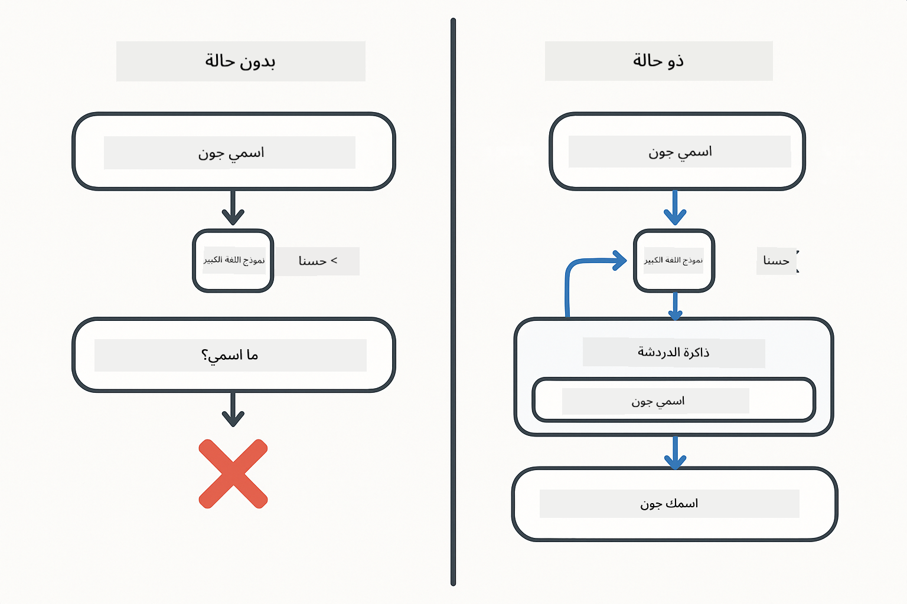
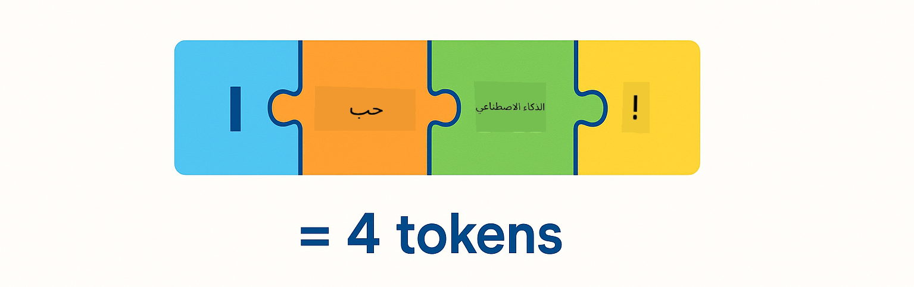
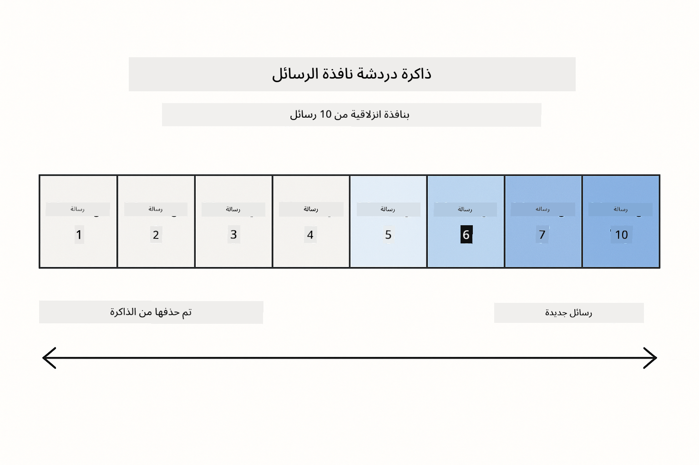
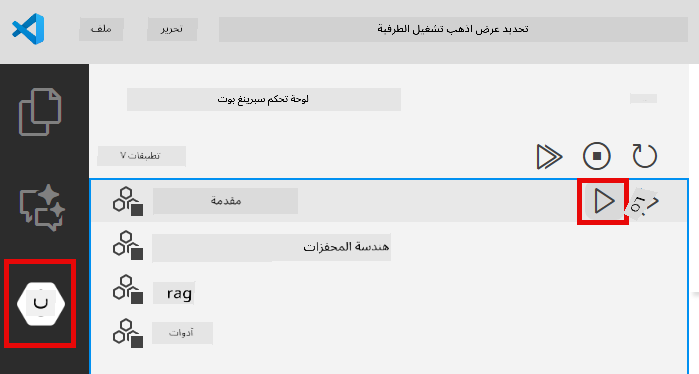
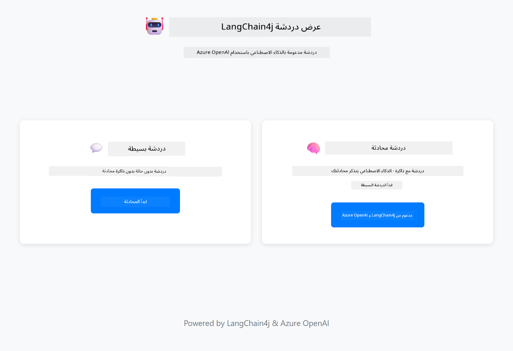
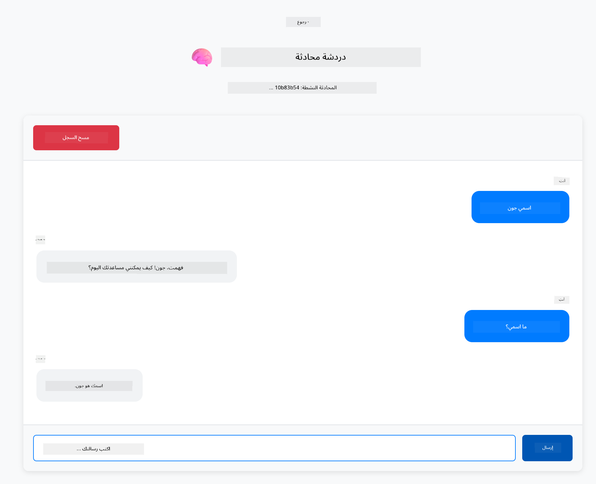

<!--
CO_OP_TRANSLATOR_METADATA:
{
  "original_hash": "c3e07ca58d0b8a3f47d3bf5728541e0a",
  "translation_date": "2025-12-13T13:05:58+00:00",
  "source_file": "01-introduction/README.md",
  "language_code": "ar"
}
-->
# الوحدة 01: البدء مع LangChain4j

## جدول المحتويات

- [ما الذي ستتعلمه](../../../01-introduction)
- [المتطلبات الأساسية](../../../01-introduction)
- [فهم المشكلة الأساسية](../../../01-introduction)
- [فهم الرموز](../../../01-introduction)
- [كيف تعمل الذاكرة](../../../01-introduction)
- [كيف يستخدم هذا LangChain4j](../../../01-introduction)
- [نشر بنية Azure OpenAI التحتية](../../../01-introduction)
- [تشغيل التطبيق محليًا](../../../01-introduction)
- [استخدام التطبيق](../../../01-introduction)
  - [الدردشة بدون حالة (اللوحة اليسرى)](../../../01-introduction)
  - [الدردشة بحالة (اللوحة اليمنى)](../../../01-introduction)
- [الخطوات التالية](../../../01-introduction)

## ما الذي ستتعلمه

إذا أكملت البداية السريعة، فقد رأيت كيف ترسل المطالبات وتحصل على الردود. هذا هو الأساس، لكن التطبيقات الحقيقية تحتاج إلى أكثر من ذلك. تعلمك هذه الوحدة كيفية بناء ذكاء اصطناعي محادثي يتذكر السياق ويحافظ على الحالة - الفرق بين عرض توضيحي لمرة واحدة وتطبيق جاهز للإنتاج.

سنستخدم GPT-5 من Azure OpenAI طوال هذا الدليل لأن قدراته المتقدمة في الاستدلال تجعل سلوك الأنماط المختلفة أكثر وضوحًا. عندما تضيف الذاكرة، سترى الفرق بوضوح. هذا يجعل من السهل فهم ما يضيفه كل مكون إلى تطبيقك.

ستبني تطبيقًا واحدًا يوضح كلا النمطين:

**الدردشة بدون حالة** - كل طلب مستقل. النموذج لا يتذكر الرسائل السابقة. هذا هو النمط الذي استخدمته في البداية السريعة.

**المحادثة بحالة** - كل طلب يتضمن تاريخ المحادثة. النموذج يحافظ على السياق عبر عدة جولات. هذا ما تتطلبه تطبيقات الإنتاج.

## المتطلبات الأساسية

- اشتراك Azure مع وصول إلى Azure OpenAI
- جافا 21، مافن 3.9+
- Azure CLI (https://learn.microsoft.com/en-us/cli/azure/install-azure-cli)
- Azure Developer CLI (azd) (https://learn.microsoft.com/en-us/azure/developer/azure-developer-cli/install-azd)

> **ملاحظة:** جافا، مافن، Azure CLI و Azure Developer CLI (azd) مثبتة مسبقًا في حاوية التطوير المقدمة.

> **ملاحظة:** تستخدم هذه الوحدة GPT-5 على Azure OpenAI. يتم تكوين النشر تلقائيًا عبر `azd up` - لا تقم بتعديل اسم النموذج في الكود.

## فهم المشكلة الأساسية

نماذج اللغة بدون حالة. كل استدعاء API مستقل. إذا أرسلت "اسمي جون" ثم سألت "ما اسمي؟"، النموذج لا يعرف أنك قدمت نفسك للتو. يعامل كل طلب كما لو كانت هذه أول محادثة لك على الإطلاق.

هذا جيد للأسئلة والأجوبة البسيطة لكنه عديم الفائدة للتطبيقات الحقيقية. تحتاج روبوتات خدمة العملاء إلى تذكر ما أخبرتهم به. يحتاج المساعدون الشخصيون إلى السياق. أي محادثة متعددة الجولات تتطلب ذاكرة.



*الفرق بين المحادثات بدون حالة (استدعاءات مستقلة) والمحادثات بحالة (واعية للسياق)*

## فهم الرموز

قبل الغوص في المحادثات، من المهم فهم الرموز - الوحدات الأساسية للنص التي تعالجها نماذج اللغة:



*مثال على كيفية تقسيم النص إلى رموز - "أنا أحب الذكاء الاصطناعي!" تصبح 4 وحدات معالجة منفصلة*

الرموز هي كيف تقيس نماذج الذكاء الاصطناعي النص وتعالجه. الكلمات، علامات الترقيم، وحتى الفراغات يمكن أن تكون رموزًا. لدى نموذجك حد لعدد الرموز التي يمكنه معالجتها مرة واحدة (400,000 لـ GPT-5، مع ما يصل إلى 272,000 رمز إدخال و128,000 رمز إخراج). فهم الرموز يساعدك على إدارة طول المحادثة والتكاليف.

## كيف تعمل الذاكرة

تحل ذاكرة الدردشة مشكلة عدم وجود حالة من خلال الحفاظ على تاريخ المحادثة. قبل إرسال طلبك إلى النموذج، يقوم الإطار بإضافة الرسائل السابقة ذات الصلة في البداية. عندما تسأل "ما اسمي؟"، يرسل النظام فعليًا كامل تاريخ المحادثة، مما يسمح للنموذج برؤية أنك قلت سابقًا "اسمي جون".

يوفر LangChain4j تطبيقات للذاكرة تتعامل مع هذا تلقائيًا. تختار عدد الرسائل التي تريد الاحتفاظ بها ويدير الإطار نافذة السياق.



*MessageWindowChatMemory يحتفظ بنافذة منزلقة من الرسائل الأخيرة، ويتخلص تلقائيًا من الرسائل القديمة*

## كيف يستخدم هذا LangChain4j

توسع هذه الوحدة البداية السريعة بدمج Spring Boot وإضافة ذاكرة المحادثة. إليك كيف تتناسب الأجزاء معًا:

**التبعيات** - أضف مكتبتين من LangChain4j:

```xml
<dependency>
    <groupId>dev.langchain4j</groupId>
    <artifactId>langchain4j</artifactId> <!-- Inherited from BOM in root pom.xml -->
</dependency>
<dependency>
    <groupId>dev.langchain4j</groupId>
    <artifactId>langchain4j-open-ai-official</artifactId> <!-- Inherited from BOM in root pom.xml -->
</dependency>
```

**نموذج الدردشة** - قم بتكوين Azure OpenAI كـ bean في Spring ([LangChainConfig.java](../../../01-introduction/src/main/java/com/example/langchain4j/config/LangChainConfig.java)):

```java
@Bean
public OpenAiOfficialChatModel openAiOfficialChatModel() {
    return OpenAiOfficialChatModel.builder()
            .baseUrl(azureEndpoint)
            .apiKey(azureApiKey)
            .modelName(deploymentName)
            .timeout(Duration.ofMinutes(5))
            .maxRetries(3)
            .build();
}
```

يقوم الباني بقراءة بيانات الاعتماد من متغيرات البيئة التي تم تعيينها بواسطة `azd up`. تعيين `baseUrl` إلى نقطة نهاية Azure الخاصة بك يجعل عميل OpenAI يعمل مع Azure OpenAI.

**ذاكرة المحادثة** - تتبع تاريخ الدردشة باستخدام MessageWindowChatMemory ([ConversationService.java](../../../01-introduction/src/main/java/com/example/langchain4j/service/ConversationService.java)):

```java
ChatMemory memory = MessageWindowChatMemory.withMaxMessages(10);

memory.add(UserMessage.from("My name is John"));
memory.add(AiMessage.from("Nice to meet you, John!"));

memory.add(UserMessage.from("What's my name?"));
AiMessage aiMessage = chatModel.chat(memory.messages()).aiMessage();
memory.add(aiMessage);
```

أنشئ الذاكرة باستخدام `withMaxMessages(10)` للاحتفاظ بآخر 10 رسائل. أضف رسائل المستخدم والذكاء الاصطناعي باستخدام الأغلفة المطبقة: `UserMessage.from(text)` و `AiMessage.from(text)`. استرجع التاريخ باستخدام `memory.messages()` وأرسله إلى النموذج. يخزن الخدمة نسخ ذاكرة منفصلة لكل معرف محادثة، مما يسمح لعدة مستخدمين بالدردشة في نفس الوقت.

> **🤖 جرب مع [GitHub Copilot](https://github.com/features/copilot) Chat:** افتح [`ConversationService.java`](../../../01-introduction/src/main/java/com/example/langchain4j/service/ConversationService.java) واسأل:
> - "كيف يقرر MessageWindowChatMemory أي الرسائل يتم حذفها عندما تكون النافذة ممتلئة؟"
> - "هل يمكنني تنفيذ تخزين ذاكرة مخصص باستخدام قاعدة بيانات بدلاً من الذاكرة المؤقتة؟"
> - "كيف يمكنني إضافة التلخيص لضغط تاريخ المحادثة القديم؟"

نقطة نهاية الدردشة بدون حالة تتخطى الذاكرة تمامًا - فقط `chatModel.chat(prompt)` كما في البداية السريعة. نقطة النهاية بحالة تضيف الرسائل إلى الذاكرة، تسترجع التاريخ، وتضمّن هذا السياق مع كل طلب. نفس تكوين النموذج، أنماط مختلفة.

## نشر بنية Azure OpenAI التحتية

**باش:**
```bash
cd 01-introduction
azd up  # اختر الاشتراك والموقع (يفضل eastus2)
```

**PowerShell:**
```powershell
cd 01-introduction
azd up  # اختر الاشتراك والموقع (يفضل eastus2)
```

> **ملاحظة:** إذا واجهت خطأ انتهاء المهلة (`RequestConflict: Cannot modify resource ... provisioning state is not terminal`)، فقط قم بتشغيل `azd up` مرة أخرى. قد تكون موارد Azure لا تزال في طور الإعداد في الخلفية، وإعادة المحاولة تسمح للنشر بالاكتمال بمجرد وصول الموارد إلى حالة نهائية.

سيقوم هذا بـ:
1. نشر مورد Azure OpenAI مع نماذج GPT-5 و text-embedding-3-small
2. إنشاء ملف `.env` تلقائيًا في جذر المشروع مع بيانات الاعتماد
3. إعداد جميع متغيرات البيئة المطلوبة

**هل تواجه مشاكل في النشر؟** راجع [README البنية التحتية](infra/README.md) للحصول على استكشاف الأخطاء وإصلاحها التفصيلي بما في ذلك تعارضات أسماء النطاقات الفرعية، خطوات النشر اليدوي عبر بوابة Azure، وإرشادات تكوين النموذج.

**تحقق من نجاح النشر:**

**باش:**
```bash
cat ../.env  # يجب أن يعرض AZURE_OPENAI_ENDPOINT، API_KEY، إلخ.
```

**PowerShell:**
```powershell
Get-Content ..\.env  # يجب أن يعرض AZURE_OPENAI_ENDPOINT، API_KEY، إلخ.
```

> **ملاحظة:** يقوم أمر `azd up` بإنشاء ملف `.env` تلقائيًا. إذا كنت بحاجة إلى تحديثه لاحقًا، يمكنك إما تحرير ملف `.env` يدويًا أو إعادة إنشائه بتشغيل:
>
> **باش:**
> ```bash
> cd ..
> bash .azd-env.sh
> ```
>
> **PowerShell:**
> ```powershell
> cd ..
> .\.azd-env.ps1
> ```

## تشغيل التطبيق محليًا

**تحقق من النشر:**

تأكد من وجود ملف `.env` في الدليل الجذري مع بيانات اعتماد Azure:

**باش:**
```bash
cat ../.env  # يجب أن يعرض AZURE_OPENAI_ENDPOINT و API_KEY و DEPLOYMENT
```

**PowerShell:**
```powershell
Get-Content ..\.env  # يجب أن يعرض AZURE_OPENAI_ENDPOINT و API_KEY و DEPLOYMENT
```

**ابدأ التطبيقات:**

**الخيار 1: استخدام لوحة تحكم Spring Boot (موصى به لمستخدمي VS Code)**

تتضمن حاوية التطوير إضافة لوحة تحكم Spring Boot، التي توفر واجهة بصرية لإدارة جميع تطبيقات Spring Boot. يمكنك العثور عليها في شريط النشاط على الجانب الأيسر من VS Code (ابحث عن أيقونة Spring Boot).

من لوحة تحكم Spring Boot، يمكنك:
- رؤية جميع تطبيقات Spring Boot المتاحة في مساحة العمل
- بدء/إيقاف التطبيقات بنقرة واحدة
- عرض سجلات التطبيق في الوقت الحقيقي
- مراقبة حالة التطبيق

فقط انقر على زر التشغيل بجانب "introduction" لبدء هذه الوحدة، أو ابدأ جميع الوحدات دفعة واحدة.



**الخيار 2: استخدام سكربتات الشل**

ابدأ جميع تطبيقات الويب (الوحدات 01-04):

**باش:**
```bash
cd ..  # من الدليل الجذري
./start-all.sh
```

**PowerShell:**
```powershell
cd ..  # من الدليل الجذري
.\start-all.ps1
```

أو ابدأ هذه الوحدة فقط:

**باش:**
```bash
cd 01-introduction
./start.sh
```

**PowerShell:**
```powershell
cd 01-introduction
.\start.ps1
```

يقوم كلا السكربتين بتحميل متغيرات البيئة تلقائيًا من ملف `.env` الجذري وسيبني ملفات JAR إذا لم تكن موجودة.

> **ملاحظة:** إذا كنت تفضل بناء جميع الوحدات يدويًا قبل البدء:
>
> **باش:**
> ```bash
> cd ..  # Go to root directory
> mvn clean package -DskipTests
> ```
>
> **PowerShell:**
> ```powershell
> cd ..  # Go to root directory
> mvn clean package -DskipTests
> ```

افتح http://localhost:8080 في متصفحك.

**لإيقاف التشغيل:**

**باش:**
```bash
./stop.sh  # هذا الوحدة فقط
# أو
cd .. && ./stop-all.sh  # جميع الوحدات
```

**PowerShell:**
```powershell
.\stop.ps1  # هذا الوحدة فقط
# أو
cd ..; .\stop-all.ps1  # جميع الوحدات
```

## استخدام التطبيق

يوفر التطبيق واجهة ويب مع تنفيذين للدردشة جنبًا إلى جنب.



*لوحة تحكم تعرض خيارات الدردشة البسيطة (بدون حالة) والدردشة المحادثية (بحالة)*

### الدردشة بدون حالة (اللوحة اليسرى)

جرب هذا أولاً. اسأل "اسمي جون" ثم اسأل فورًا "ما اسمي؟" النموذج لن يتذكر لأن كل رسالة مستقلة. هذا يوضح المشكلة الأساسية مع دمج نموذج اللغة الأساسي - لا يوجد سياق للمحادثة.


*الذكاء الاصطناعي لا يتذكر اسمك من الرسالة السابقة*

### الدردشة بحالة (اللوحة اليمنى)

الآن جرب نفس التسلسل هنا. اسأل "اسمي جون" ثم "ما اسمي؟" هذه المرة يتذكر. الفرق هو MessageWindowChatMemory - يحتفظ بتاريخ المحادثة ويضمّنه مع كل طلب. هذه هي طريقة عمل الذكاء الاصطناعي المحادثي في الإنتاج.



*الذكاء الاصطناعي يتذكر اسمك من وقت سابق في المحادثة*

تستخدم كلتا اللوحتين نفس نموذج GPT-5. الفرق الوحيد هو الذاكرة. هذا يوضح بجلاء ما تضيفه الذاكرة إلى تطبيقك ولماذا هي ضرورية للحالات الحقيقية.

## الخطوات التالية

**الوحدة التالية:** [02-prompt-engineering - هندسة المطالبات مع GPT-5](../02-prompt-engineering/README.md)

---

**التنقل:** [← السابق: الوحدة 00 - البداية السريعة](../00-quick-start/README.md) | [العودة إلى الرئيسي](../README.md) | [التالي: الوحدة 02 - هندسة المطالبات →](../02-prompt-engineering/README.md)

---

<!-- CO-OP TRANSLATOR DISCLAIMER START -->
**إخلاء المسؤولية**:  
تمت ترجمة هذا المستند باستخدام خدمة الترجمة الآلية [Co-op Translator](https://github.com/Azure/co-op-translator). بينما نسعى لتحقيق الدقة، يرجى العلم أن الترجمات الآلية قد تحتوي على أخطاء أو عدم دقة. يجب اعتبار المستند الأصلي بلغته الأصلية المصدر الموثوق به. للمعلومات الهامة، يُنصح بالاعتماد على الترجمة البشرية المهنية. نحن غير مسؤولين عن أي سوء فهم أو تفسير ناتج عن استخدام هذه الترجمة.
<!-- CO-OP TRANSLATOR DISCLAIMER END -->