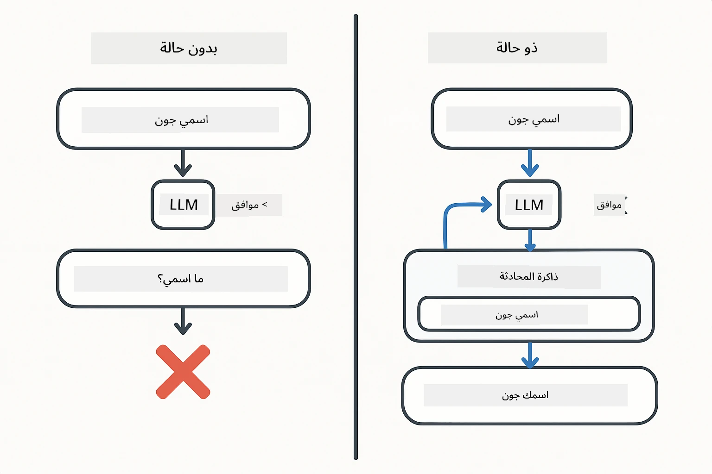
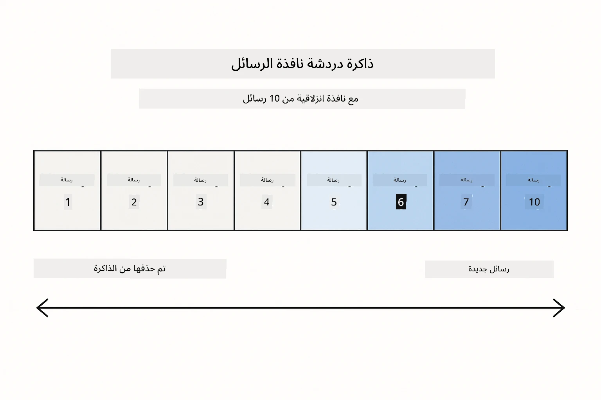
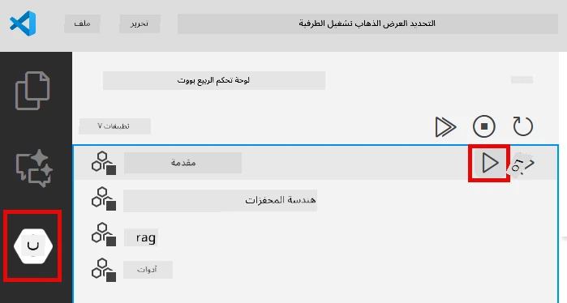
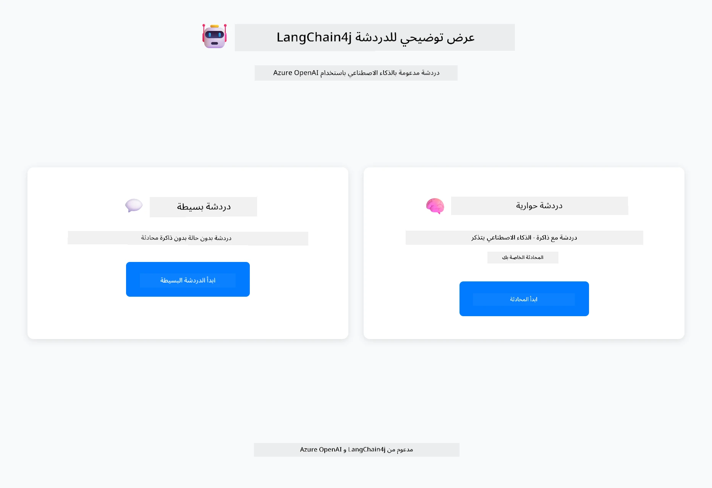
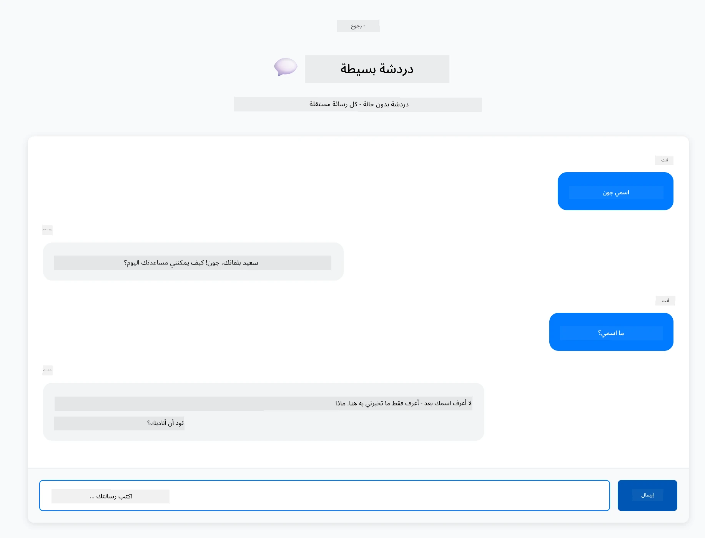
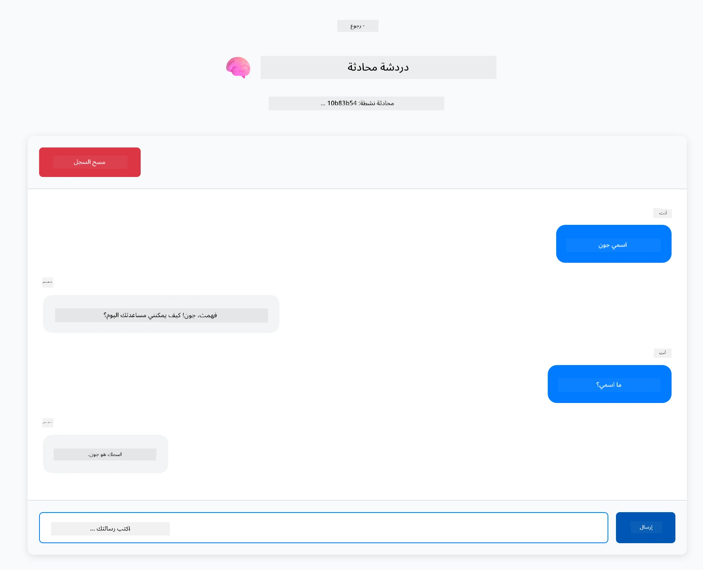

# الوحدة 01: البدء مع LangChain4j

## جدول المحتويات

- [جولة فيديو](#جولة-فيديو)
- [ما ستتعلمه](#ما-ستتعلمه)
- [المتطلبات المسبقة](#المتطلبات-المسبقة)
- [فهم المشكلة الأساسية](#فهم-المشكلة-الأساسية)
- [فهم الرموز](#فهم-الرموز)
- [كيفية عمل الذاكرة](#كيفية-عمل-الذاكرة)
- [كيفية استخدام هذا لـ LangChain4j](#كيفية-استخدام-هذا-لـ-langchain4j)
- [نشر بنية Azure OpenAI التحتية](#نشر-بنية-azure-openai-التحتية)
- [تشغيل التطبيق محليًا](#تشغيل-التطبيق-محليًا)
- [استخدام التطبيق](#استخدام-التطبيق)
  - [دردشة بدون حالة (اللوحة اليسرى)](#دردشة-بدون-حالة-اللوحة-اليسرى)
  - [دردشة بحالة (اللوحة اليمنى)](#دردشة-بحالة-اللوحة-اليمنى)
- [الخطوات التالية](#الخطوات-التالية)

## جولة فيديو

شاهد هذه الجلسة المباشرة التي تشرح كيفية البدء مع هذه الوحدة:

<a href="https://www.youtube.com/live/nl_troDm8rQ?si=6b85S8xGjWnT2fX9"></a>

## ما ستتعلمه

هذه هي نقطة البداية الخاصة بك مع LangChain4j و Azure OpenAI. نبدأ بالأساسيات ونبدأ ببناء تطبيقات بأسلوب الإنتاج. تركز هذه الوحدة على الذكاء الاصطناعي الحواري الذي يتذكر السياق ويحافظ على الحالة — المفاهيم الأساسية التي تبني عليها كل الوحدات اللاحقة.

سنستخدم GPT-5.2 من Azure OpenAI في جميع أنحاء هذا الدليل لأن قدراته المتقدمة في الاستدلال تجعل سلوك الأنماط المختلفة أكثر وضوحًا. عند إضافة الذاكرة، سترى الفرق بوضوح. هذا يجعل من الأسهل فهم ما يضيفه كل مكون إلى تطبيقك.

ستبني تطبيقًا واحدًا يوضح كلا النمطين:

**الدردشة بدون حالة** - كل طلب مستقل. النموذج لا يتذكر الرسائل السابقة. هذه هي أبسط نقطة بداية.

**المحادثة بحالة** - كل طلب يشمل تاريخ المحادثة. النموذج يحافظ على السياق عبر عدة تبادلات. هذا ما تتطلبه تطبيقات الإنتاج.

## المتطلبات المسبقة

- اشتراك في Azure مع إمكانية الوصول إلى Azure OpenAI
- Java 21، Maven 3.9+
- Azure CLI (https://learn.microsoft.com/en-us/cli/azure/install-azure-cli)
- Azure Developer CLI (azd) (https://learn.microsoft.com/en-us/azure/developer/azure-developer-cli/install-azd)

> **ملاحظة:** Java و Maven و Azure CLI و Azure Developer CLI (azd) مثبتة مسبقًا في حاوية التطوير المقدمة.

> **ملاحظة:** تستخدم هذه الوحدة GPT-5.2 على Azure OpenAI. يتم تكوين النشر تلقائيًا عبر `azd up` - لا تقم بتعديل اسم النموذج في الشفرة.

## فهم المشكلة الأساسية

نماذج اللغة لا تحتفظ بالحالة. كل استدعاء API مستقل. إذا أرسلت "اسمي جون" ثم سألت "ما اسمي؟"، فلا يعلم النموذج أنك قدمت نفسك للتو. يعامل كل طلب كما لو كان أول محادثة تجريها على الإطلاق.

هذا مقبول للأسئلة البسيطة والأجوبة لكنه غير مفيد للتطبيقات الحقيقية. بحاجة روبوتات خدمة العملاء لتذكر ما قلته لهم. المساعدون الشخصيون يحتاجون للسياق. أي محادثة متعددة التناوب تتطلب ذاكرة.

الرسم التوضيحي التالي يقارن بين النهجين — على اليسار، استدعاء بدون حالة ينسى اسمك؛ وعلى اليمين، استدعاء بحالة مدعوم بـ ChatMemory يتذكره.



*الفرق بين المحادثات بدون حالة (استدعاءات مستقلة) وبحالة (مدركة للسياق)*

## فهم الرموز

قبل الخوض في المحادثات، من المهم فهم الرموز — وحدات النص الأساسية التي تعالجها نماذج اللغة:


*مثال على كيفية تقسيم النص إلى رموز - "I love AI!" تصبح 4 وحدات معالجة منفصلة*

الرموز هي كيفية قياس ومعالجة نماذج الذكاء الاصطناعي للنص. الكلمات، علامات الترقيم، وحتى المساحات قد تكون رموزًا. للنموذج حد أقصى لعدد الرموز التي يمكنه معالجتها مرة واحدة (400,000 لـ GPT-5.2، مع ما يصل إلى 272,000 رمز إدخال و 128,000 رمز إخراج). فهم الرموز يساعدك على إدارة طول المحادثة والتكاليف.

## كيفية عمل الذاكرة

تحل ذاكرة الدردشة مشكلة عدم الاحتفاظ بالحالة من خلال الحفاظ على تاريخ المحادثة. قبل إرسال طلبك إلى النموذج، يقوم الإطار بإضافة الرسائل السابقة ذات الصلة في البداية. عندما تسأل "ما اسمي؟"، يرسل النظام فعليًا تاريخ المحادثة بالكامل، مما يسمح للنموذج برؤية أنك قلت سابقًا "اسمي جون".

يوفر LangChain4j تطبيقات للذاكرة تتعامل مع هذا تلقائيًا. تختار عدد الرسائل التي تريد الاحتفاظ بها ويتولى الإطار إدارة نافذة السياق. يوضح الرسم أدناه كيف يحافظ MessageWindowChatMemory على نافذة منزلقة من الرسائل الأخيرة.



*MessageWindowChatMemory يحافظ على نافذة منزلقة من الرسائل الأخيرة، ويحذف الرسائل القديمة تلقائيًا*

## كيفية استخدام هذا لـ LangChain4j

تدمج هذه الوحدة Spring Boot وتضيف ذاكرة المحادثة. هكذا تتكامل القطع معًا:

**التبعيات** - أضف مكتبتين من LangChain4j:

```xml
<dependency>
    <groupId>dev.langchain4j</groupId>
    <artifactId>langchain4j</artifactId> <!-- Inherited from BOM in root pom.xml -->
</dependency>
<dependency>
    <groupId>dev.langchain4j</groupId>
    <artifactId>langchain4j-open-ai-official</artifactId> <!-- Inherited from BOM in root pom.xml -->
</dependency>
```

**نموذج الدردشة** - قم بتكوين Azure OpenAI كعنصر Spring bean ([LangChainConfig.java](../../../01-introduction/src/main/java/com/example/langchain4j/config/LangChainConfig.java)):

```java
@Bean
public OpenAiOfficialChatModel openAiOfficialChatModel() {
    return OpenAiOfficialChatModel.builder()
            .baseUrl(azureEndpoint)
            .apiKey(azureApiKey)
            .modelName(deploymentName)
            .timeout(Duration.ofMinutes(5))
            .maxRetries(3)
            .build();
}
```

يقرأ المُنشئ بيانات الاعتماد من متغيرات البيئة التي يتم إعدادها بواسطة `azd up`. تعيين `baseUrl` لنقطة نهاية Azure الخاصة بك يجعل عميل OpenAI يعمل مع Azure OpenAI.

**ذاكرة المحادثة** - تتبع سجل الدردشة مع MessageWindowChatMemory ([ConversationService.java](../../../01-introduction/src/main/java/com/example/langchain4j/service/ConversationService.java)):

```java
ChatMemory memory = MessageWindowChatMemory.withMaxMessages(10);

memory.add(UserMessage.from("My name is John"));
memory.add(AiMessage.from("Nice to meet you, John!"));

memory.add(UserMessage.from("What's my name?"));
AiMessage aiMessage = chatModel.chat(memory.messages()).aiMessage();
memory.add(aiMessage);
```

أنشئ الذاكرة مع `withMaxMessages(10)` للاحتفاظ بآخر 10 رسائل. أضف رسائل المستخدم والذكاء الاصطناعي باستخدام الأغلفة المكتوبة: `UserMessage.from(text)` و `AiMessage.from(text)`. استرجع التاريخ بـ `memory.messages()` وأرسله إلى النموذج. يخزن الخدمة مثيلات ذاكرة منفصلة لكل معرف محادثة، مما يسمح لعدة مستخدمين بالدردشة في نفس الوقت.

> **🤖 جرب مع [GitHub Copilot](https://github.com/features/copilot) Chat:** افتح [`ConversationService.java`](../../../01-introduction/src/main/java/com/example/langchain4j/service/ConversationService.java) واسأل:
> - "كيف يقرر MessageWindowChatMemory أي الرسائل يجب حذفها عندما تمتلئ النافذة؟"
> - "هل يمكنني تنفيذ تخزين ذاكرة مخصص باستخدام قاعدة بيانات بدلاً من الذاكرة الداخلية؟"
> - "كيف يمكنني إضافة تلخيص لضغط تاريخ المحادثة القديم؟"

نقطة نهاية الدردشة بدون حالة تتخطى الذاكرة تمامًا - فقط `chatModel.chat(prompt)` كما في البداية السريعة. نقطة نهاية الدردشة بحالة تضيف الرسائل إلى الذاكرة، تسترجع التاريخ، وتضمّن هذا السياق مع كل طلب. نفس تكوين النموذج، أنماط مختلفة.

## نشر بنية Azure OpenAI التحتية

**Bash:**
```bash
cd 01-introduction
azd up  # اختر الاشتراك والموقع (يوصى بـ eastus2)
```

**PowerShell:**
```powershell
cd 01-introduction
azd up  # اختر الاشتراك والموقع (يفضل eastus2)
```

> **ملاحظة:** إذا واجهت خطأ في نفاد المهلة (`RequestConflict: Cannot modify resource ... provisioning state is not terminal`)، فقط شغّل `azd up` مرة أخرى. قد لا تزال موارد Azure في طور الإعداد في الخلفية، وإعادة المحاولة تسمح للنشر بالإكمال بمجرد وصول الموارد إلى حالة نهائية.

سيقوم هذا بـ:
1. نشر مورد Azure OpenAI مع نموذج GPT-5.2 ونماذج text-embedding-3-small
2. إنشاء ملف `.env` تلقائيًا في جذر المشروع مع بيانات الاعتماد
3. إعداد جميع متغيرات البيئة المطلوبة

**هل تواجه مشاكل في النشر؟** اطلع على [ملف README للبنية التحتية](infra/README.md) للحصول على حلول تفصيلية تشمل تعارض أسماء النطاقات الفرعية، خطوات النشر اليدوي عبر بوابة Azure، وإرشادات تكوين النموذج.

**تحقق من نجاح النشر:**

**Bash:**
```bash
cat ../.env  # يجب أن يعرض AZURE_OPENAI_ENDPOINT و API_KEY وما إلى ذلك.
```

**PowerShell:**
```powershell
Get-Content ..\.env  # يجب أن يعرض AZURE_OPENAI_ENDPOINT وAPI_KEY، إلخ.
```

> **ملاحظة:** يولد أمر `azd up` ملف `.env` تلقائيًا. إذا احتجت لتحديثه لاحقًا، يمكنك إما تعديل ملف `.env` يدويًا أو إعادة إنشائه بتشغيل:
>
> **Bash:**
> ```bash
> cd ..
> bash .azd-env.sh
> ```
>
> **PowerShell:**
> ```powershell
> cd ..
> .\.azd-env.ps1
> ```

## تشغيل التطبيق محليًا

**تحقق من النشر:**

تأكد من وجود ملف `.env` في الدليل الجذر مع بيانات اعتماد Azure. شغل هذا الأمر من دليل الوحدة (`01-introduction/`):

**Bash:**
```bash
cat ../.env  # يجب أن تظهر AZURE_OPENAI_ENDPOINT، API_KEY، DEPLOYMENT
```

**PowerShell:**
```powershell
Get-Content ..\.env  # يجب أن يعرض AZURE_OPENAI_ENDPOINT و API_KEY و DEPLOYMENT
```

**ابدأ التطبيقات:**

**الخيار 1: استخدام لوحة تحكم Spring Boot (موصى به لمستخدمي VS Code)**

تتضمن حاوية التطوير ملحق لوحة تحكم Spring Boot، الذي يوفر واجهة بصرية لإدارة كل تطبيقات Spring Boot. يمكنك العثور عليه في شريط النشاط على الجانب الأيسر من VS Code (ابحث عن أيقونة Spring Boot).

من لوحة تحكم Spring Boot، يمكنك:
- رؤية جميع تطبيقات Spring Boot المتوفرة في مساحة العمل
- بدء/إيقاف التطبيقات بنقرة واحدة
- عرض سجلات التطبيق في الوقت الحقيقي
- مراقبة حالة التطبيق

انقر ببساطة على زر التشغيل بجوار "introduction" لبدء هذه الوحدة، أو ابدأ جميع الوحدات دفعة واحدة.



*لوحة تحكم Spring Boot في VS Code — ابدأ، أوقف، وراقب كل الوحدات من مكان واحد*

**الخيار 2: استخدام سكريبتات الشل**

شغل كل تطبيقات الويب (الوحدات 01-04):

**Bash:**
```bash
cd ..  # من الدليل الجذر
./start-all.sh
```

**PowerShell:**
```powershell
cd ..  # من الدليل الجذري
.\start-all.ps1
```

أو شغل هذه الوحدة فقط:

**Bash:**
```bash
cd 01-introduction
./start.sh
```

**PowerShell:**
```powershell
cd 01-introduction
.\start.ps1
```

تقوم كلا السكريبتات بتحميل متغيرات البيئة تلقائيًا من ملف `.env` الجذري وستبني ملفات JAR إذا لم تكن موجودة.

> **ملاحظة:** إذا كنت تفضل بناء كل الوحدات يدويًا قبل التشغيل:
>
> **Bash:**
> ```bash
> cd ..  # Go to root directory
> mvn clean package -DskipTests
> ```
>
> **PowerShell:**
> ```powershell
> cd ..  # Go to root directory
> mvn clean package -DskipTests
> ```

افتح http://localhost:8080 في متصفحك.

**لإيقاف التشغيل:**

**Bash:**
```bash
./stop.sh  # هذا الوحدة فقط
# أو
cd .. && ./stop-all.sh  # كل الوحدات
```

**PowerShell:**
```powershell
.\stop.ps1  # هذا الوحدة فقط
# أو
cd ..; .\stop-all.ps1  # جميع الوحدات
```

## استخدام التطبيق

يقدم التطبيق واجهة ويب مع تنفيذين للدردشة جنبًا إلى جنب.



*لوحة تحكم تعرض خيارا الدردشة البسيطة (بدون حالة) والدردشة الحواريّة (بحالة)*

### دردشة بدون حالة (اللوحة اليسرى)

جرب هذا أولاً. اسأل "اسمي جون" ثم اسأل فورًا "ما اسمي؟" لن يتذكر النموذج لأنه كل رسالة مستقلة. هذا يوضح المشكلة الأساسية في دمج نموذج اللغة الأساسي — لا سياق للمحادثة.



*الذكاء الاصطناعي لا يتذكر اسمك من الرسالة السابقة*

### دردشة بحالة (اللوحة اليمنى)

الآن جرب نفس التسلسل هنا. اسأل "اسمي جون" ثم "ما اسمي؟" هذه المرة يتذكر. الفرق هو MessageWindowChatMemory — يحافظ على سجل المحادثة ويضمّنه مع كل طلب. هكذا يعمل الذكاء الاصطناعي الحواري في الإنتاج.



*الذكاء الاصطناعي يتذكر اسمك من بداية المحادثة*

تستخدم كلتا اللوحتين نفس نموذج GPT-5.2. الفرق الوحيد هو الذاكرة. هذا يوضح ما تضيفه الذاكرة لتطبيقك ولماذا هي ضرورية لحالات الاستخدام الحقيقية.

## الخطوات التالية

**الوحدة التالية:** [02-prompt-engineering - هندسة المُطالبات مع GPT-5.2](../02-prompt-engineering/README.md)

---

**التنقل:** [← العودة إلى الرئيسية](../README.md) | [التالي: الوحدة 02 - هندسة المُطالبات →](../02-prompt-engineering/README.md)

---

<!-- CO-OP TRANSLATOR DISCLAIMER START -->
**تنويه**:
تمت ترجمة هذا المستند باستخدام خدمة الترجمة بالذكاء الاصطناعي [Co-op Translator](https://github.com/Azure/co-op-translator). بينما نسعى للدقة، يرجى العلم أن الترجمات الآلية قد تحتوي على أخطاء أو عدم دقة. يجب اعتبار المستند الأصلي بلغته الأصلية المصدر الرسمي والمعتمد. للمعلومات الهامة، يُنصح بالاستعانة بترجمة بشرية محترفة. نحن غير مسؤولين عن أي سوء فهم أو تفسير ناتج عن استخدام هذه الترجمة.
<!-- CO-OP TRANSLATOR DISCLAIMER END -->