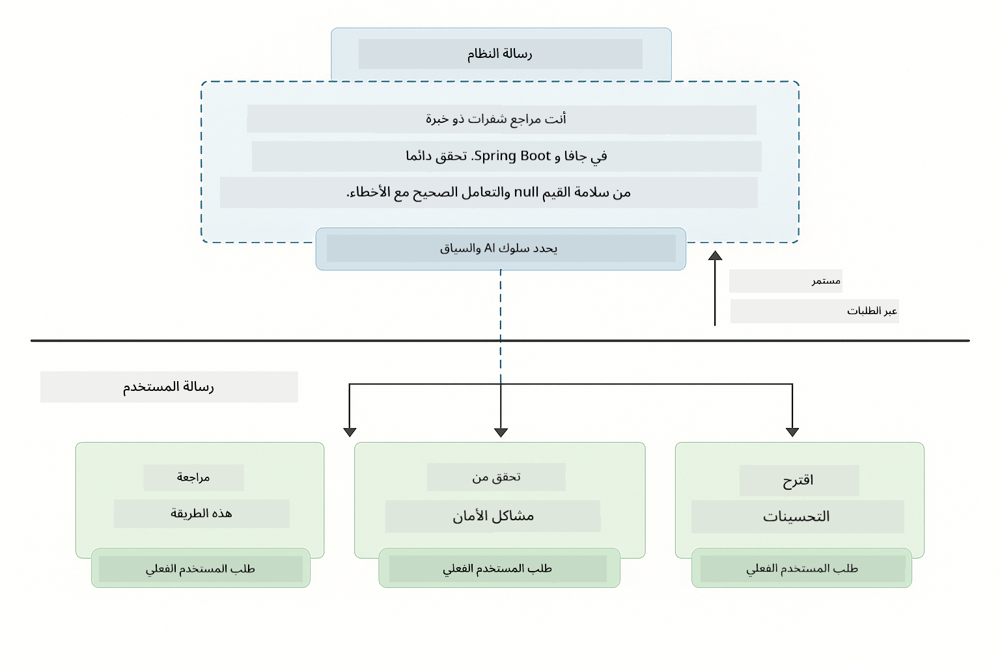
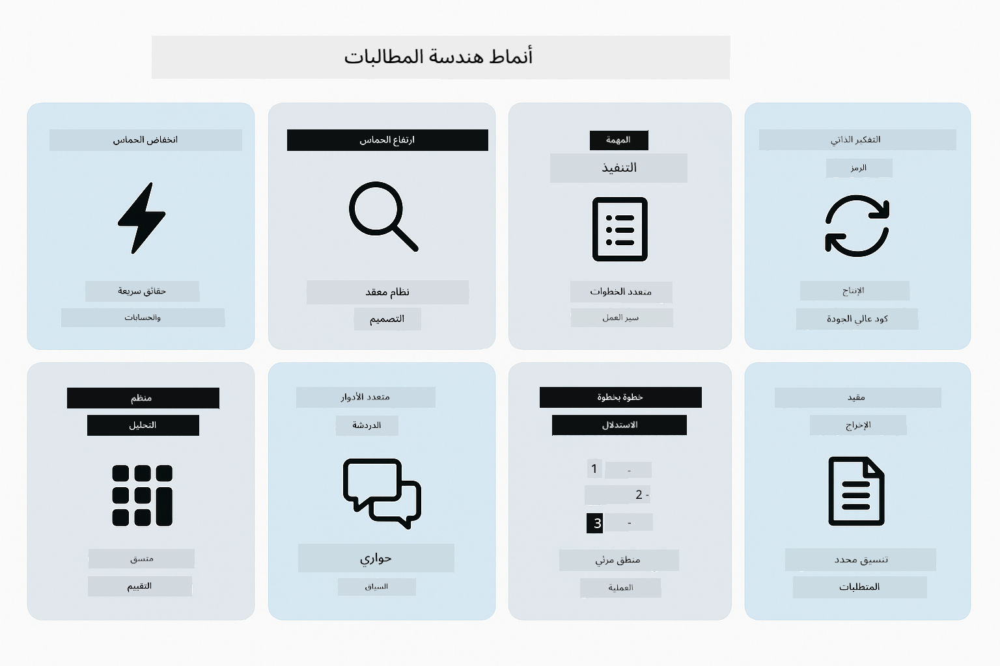
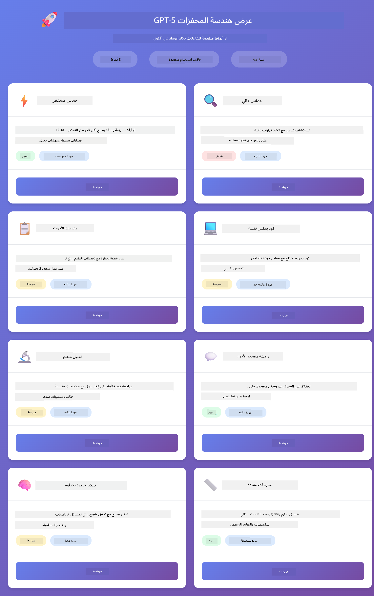
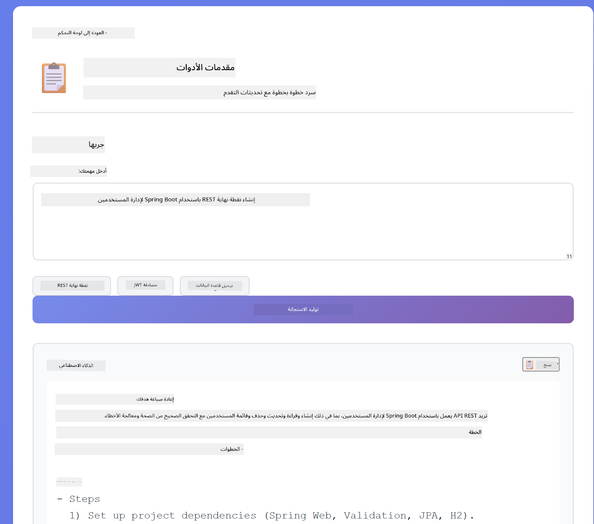
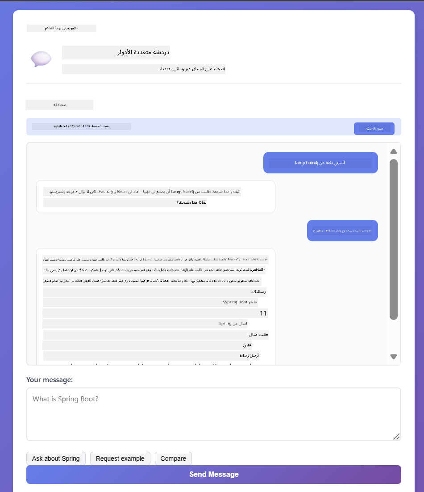
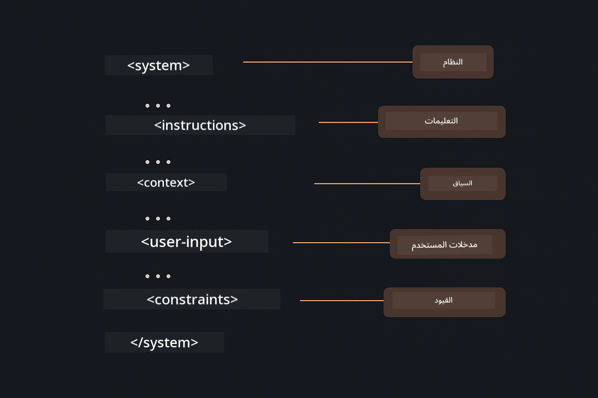

<!--
CO_OP_TRANSLATOR_METADATA:
{
  "original_hash": "8d787826cad7e92bf5cdbd116b1e6116",
  "translation_date": "2025-12-13T15:49:24+00:00",
  "source_file": "02-prompt-engineering/README.md",
  "language_code": "ar"
}
-->
# الوحدة 02: هندسة المطالبات مع GPT-5

## جدول المحتويات

- [ما الذي ستتعلمه](../../../02-prompt-engineering)
- [المتطلبات الأساسية](../../../02-prompt-engineering)
- [فهم هندسة المطالبات](../../../02-prompt-engineering)
- [كيف يستخدم هذا LangChain4j](../../../02-prompt-engineering)
- [الأنماط الأساسية](../../../02-prompt-engineering)
- [استخدام موارد Azure الموجودة](../../../02-prompt-engineering)
- [لقطات شاشة التطبيق](../../../02-prompt-engineering)
- [استكشاف الأنماط](../../../02-prompt-engineering)
  - [قلة الحماس مقابل الحماس العالي](../../../02-prompt-engineering)
  - [تنفيذ المهام (مقدمات الأدوات)](../../../02-prompt-engineering)
  - [الكود العاكس للذات](../../../02-prompt-engineering)
  - [التحليل المنظم](../../../02-prompt-engineering)
  - [الدردشة متعددة الأدوار](../../../02-prompt-engineering)
  - [التفكير خطوة بخطوة](../../../02-prompt-engineering)
  - [الإخراج المقيد](../../../02-prompt-engineering)
- [ما الذي تتعلمه حقًا](../../../02-prompt-engineering)
- [الخطوات التالية](../../../02-prompt-engineering)

## ما الذي ستتعلمه

في الوحدة السابقة، رأيت كيف تُمكّن الذاكرة الذكاء الاصطناعي الحواري واستخدمت نماذج GitHub للتفاعلات الأساسية. الآن سنركز على كيفية طرح الأسئلة - أي المطالبات نفسها - باستخدام GPT-5 من Azure OpenAI. الطريقة التي تبني بها مطالباتك تؤثر بشكل كبير على جودة الردود التي تحصل عليها.

سنستخدم GPT-5 لأنه يقدم تحكمًا في التفكير - يمكنك إخبار النموذج بكمية التفكير التي يجب أن يقوم بها قبل الإجابة. هذا يجعل استراتيجيات المطالبة المختلفة أكثر وضوحًا ويساعدك على فهم متى تستخدم كل نهج. سنستفيد أيضًا من حدود المعدل الأقل في Azure لـ GPT-5 مقارنة بنماذج GitHub.

## المتطلبات الأساسية

- إكمال الوحدة 01 (تم نشر موارد Azure OpenAI)
- ملف `.env` في الدليل الجذري يحتوي على بيانات اعتماد Azure (تم إنشاؤه بواسطة `azd up` في الوحدة 01)

> **ملاحظة:** إذا لم تكمل الوحدة 01، فاتبع تعليمات النشر هناك أولاً.

## فهم هندسة المطالبات

هندسة المطالبات هي تصميم نص الإدخال الذي يضمن لك الحصول على النتائج التي تحتاجها باستمرار. الأمر لا يقتصر على طرح الأسئلة فقط - بل يتعلق ببناء الطلبات بحيث يفهم النموذج بالضبط ما تريده وكيفية تقديمه.

فكر فيها كأنك تعطي تعليمات لزميل. "إصلاح الخطأ" غامض. "إصلاح استثناء المؤشر الخالي في UserService.java السطر 45 بإضافة فحص null" محدد. نماذج اللغة تعمل بنفس الطريقة - الدقة والبنية مهمة.

## كيف يستخدم هذا LangChain4j

توضح هذه الوحدة أنماط المطالبة المتقدمة باستخدام نفس أساس LangChain4j من الوحدات السابقة، مع التركيز على بنية المطالبات والتحكم في التفكير.


*كيف يربط LangChain4j مطالباتك بـ Azure OpenAI GPT-5*

**التبعيات** - تستخدم الوحدة 02 التبعيات التالية لـ langchain4j المعرفة في `pom.xml`:
```xml
<dependency>
    <groupId>dev.langchain4j</groupId>
    <artifactId>langchain4j</artifactId> <!-- Inherited from BOM in root pom.xml -->
</dependency>
<dependency>
    <groupId>dev.langchain4j</groupId>
    <artifactId>langchain4j-open-ai-official</artifactId> <!-- Inherited from BOM in root pom.xml -->
</dependency>
```

**تكوين OpenAiOfficialChatModel** - [LangChainConfig.java](../../../02-prompt-engineering/src/main/java/com/example/langchain4j/prompts/config/LangChainConfig.java)

يتم تكوين نموذج الدردشة يدويًا كـ bean في Spring باستخدام عميل OpenAI الرسمي، الذي يدعم نقاط نهاية Azure OpenAI. الفرق الرئيسي عن الوحدة 01 هو كيفية بناء المطالبات المرسلة إلى `chatModel.chat()`، وليس إعداد النموذج نفسه.

**رسائل النظام والمستخدم** - [Gpt5PromptService.java](../../../02-prompt-engineering/src/main/java/com/example/langchain4j/prompts/service/Gpt5PromptService.java)

يفصل LangChain4j أنواع الرسائل للوضوح. `SystemMessage` يحدد سلوك وسياق الذكاء الاصطناعي (مثل "أنت مراجع كود")، بينما تحتوي `UserMessage` على الطلب الفعلي. هذا الفصل يسمح بالحفاظ على سلوك الذكاء الاصطناعي المتسق عبر استفسارات المستخدم المختلفة.

```java
SystemMessage systemMsg = SystemMessage.from(
    "You are a helpful Java programming expert."
);

UserMessage userMsg = UserMessage.from(
    "Explain what a List is in Java"
);

String response = chatModel.chat(systemMsg, userMsg);
```



*SystemMessage يوفر سياقًا دائمًا بينما تحتوي UserMessages على طلبات فردية*

**MessageWindowChatMemory للمحادثات متعددة الأدوار** - لنمط المحادثة متعددة الأدوار، نعيد استخدام `MessageWindowChatMemory` من الوحدة 01. كل جلسة تحصل على مثيل ذاكرة خاص مخزن في `Map<String, ChatMemory>`، مما يسمح بعدة محادثات متزامنة دون خلط السياقات.

**قوالب المطالبات** - التركيز الحقيقي هنا هو هندسة المطالبات، وليس واجهات برمجة تطبيقات LangChain4j الجديدة. كل نمط (قلة الحماس، الحماس العالي، تنفيذ المهام، إلخ) يستخدم نفس طريقة `chatModel.chat(prompt)` ولكن مع سلاسل مطالبات منظمة بعناية. علامات XML والتعليمات والتنسيق كلها جزء من نص المطالبة، وليست ميزات LangChain4j.

**التحكم في التفكير** - يتم التحكم في جهد التفكير لـ GPT-5 من خلال تعليمات المطالبة مثل "حد أقصى خطوتين للتفكير" أو "استكشاف شامل". هذه تقنيات هندسة مطالبات، وليست تكوينات LangChain4j. المكتبة ببساطة توصل مطالباتك إلى النموذج.

الاستنتاج الرئيسي: يوفر LangChain4j البنية التحتية (الاتصال بالنموذج عبر [LangChainConfig.java](../../../02-prompt-engineering/src/main/java/com/example/langchain4j/prompts/config/LangChainConfig.java)، الذاكرة، معالجة الرسائل عبر [Gpt5PromptService.java](../../../02-prompt-engineering/src/main/java/com/example/langchain4j/prompts/service/Gpt5PromptService.java))، بينما تعلمك هذه الوحدة كيفية صياغة مطالبات فعالة ضمن تلك البنية.

## الأنماط الأساسية

ليست كل المشاكل تحتاج نفس النهج. بعض الأسئلة تحتاج إجابات سريعة، وأخرى تحتاج تفكيرًا عميقًا. بعضها يحتاج إلى تفكير مرئي، وبعضها يحتاج فقط إلى النتائج. تغطي هذه الوحدة ثمانية أنماط للمطالبات - كل منها مُحسّن لسيناريوهات مختلفة. ستجربها جميعًا لتتعلم متى يعمل كل نهج بشكل أفضل.



*نظرة عامة على ثمانية أنماط هندسة المطالبات وحالات استخدامها*


*قلة الحماس (سريع، مباشر) مقابل الحماس العالي (شامل، استكشافي) في أساليب التفكير*

**قلة الحماس (سريع ومركز)** - للأسئلة البسيطة حيث تريد إجابات سريعة ومباشرة. يقوم النموذج بأقل قدر من التفكير - بحد أقصى خطوتين. استخدم هذا للحسابات، عمليات البحث، أو الأسئلة المباشرة.

```java
String prompt = """
    <reasoning_effort>low</reasoning_effort>
    <instruction>maximum 2 reasoning steps</instruction>
    
    What is 15% of 200?
    """;

String response = chatModel.chat(prompt);
```

> 💡 **استكشف مع GitHub Copilot:** افتح [`Gpt5PromptService.java`](../../../02-prompt-engineering/src/main/java/com/example/langchain4j/prompts/service/Gpt5PromptService.java) واسأل:
> - "ما الفرق بين أنماط المطالبة ذات الحماس المنخفض والحماس العالي؟"
> - "كيف تساعد علامات XML في المطالبات على تنظيم استجابة الذكاء الاصطناعي؟"
> - "متى يجب أن أستخدم أنماط التفكير الذاتي مقابل التعليمات المباشرة؟"

**الحماس العالي (عميق وشامل)** - للمشاكل المعقدة حيث تريد تحليلاً شاملاً. يستكشف النموذج بعمق ويعرض تفكيرًا مفصلًا. استخدم هذا لتصميم الأنظمة، قرارات الهندسة المعمارية، أو الأبحاث المعقدة.

```java
String prompt = """
    <reasoning_effort>high</reasoning_effort>
    <instruction>explore thoroughly, show detailed reasoning</instruction>
    
    Design a caching strategy for a high-traffic REST API.
    """;

String response = chatModel.chat(prompt);
```

**تنفيذ المهام (التقدم خطوة بخطوة)** - لسير العمل متعدد الخطوات. يقدم النموذج خطة مبدئية، يروي كل خطوة أثناء العمل، ثم يعطي ملخصًا. استخدم هذا للهجرات، التنفيذات، أو أي عملية متعددة الخطوات.

```java
String prompt = """
    <task>Create a REST endpoint for user registration</task>
    <preamble>Provide an upfront plan</preamble>
    <narration>Narrate each step as you work</narration>
    <summary>Summarize what was accomplished</summary>
    """;

String response = chatModel.chat(prompt);
```

مطالبة سلسلة التفكير تطلب صراحة من النموذج عرض عملية تفكيره، مما يحسن الدقة للمهام المعقدة. التفصيل خطوة بخطوة يساعد البشر والذكاء الاصطناعي على فهم المنطق.

> **🤖 جرب مع دردشة [GitHub Copilot](https://github.com/features/copilot):** اسأل عن هذا النمط:
> - "كيف يمكنني تكييف نمط تنفيذ المهام للعمليات طويلة الأمد؟"
> - "ما هي أفضل الممارسات لبناء مقدمات الأدوات في تطبيقات الإنتاج؟"
> - "كيف يمكنني التقاط وعرض تحديثات التقدم الوسيط في واجهة المستخدم؟"


*خطة → تنفيذ → تلخيص لسير العمل متعدد الخطوات*

**الكود العاكس للذات** - لتوليد كود بجودة الإنتاج. يولد النموذج الكود، يتحقق منه مقابل معايير الجودة، ويحسنه بشكل تكراري. استخدم هذا عند بناء ميزات أو خدمات جديدة.

```java
String prompt = """
    <task>Create an email validation service</task>
    <quality_criteria>
    - Correct logic and error handling
    - Best practices (clean code, proper naming)
    - Performance optimization
    - Security considerations
    </quality_criteria>
    <instruction>Generate code, evaluate against criteria, improve iteratively</instruction>
    """;

String response = chatModel.chat(prompt);
```


*حلقة تحسين تكرارية - توليد، تقييم، تحديد المشكلات، تحسين، تكرار*

**التحليل المنظم** - للتقييم المتسق. يراجع النموذج الكود باستخدام إطار عمل ثابت (الصحة، الممارسات، الأداء، الأمان). استخدم هذا لمراجعات الكود أو تقييمات الجودة.

```java
String prompt = """
    <code>
    public List getUsers() {
        return database.query("SELECT * FROM users");
    }
    </code>
    
    <framework>
    Evaluate using these categories:
    1. Correctness - Logic and functionality
    2. Best Practices - Code quality
    3. Performance - Efficiency concerns
    4. Security - Vulnerabilities
    </framework>
    """;

String response = chatModel.chat(prompt);
```

> **🤖 جرب مع دردشة [GitHub Copilot](https://github.com/features/copilot):** اسأل عن التحليل المنظم:
> - "كيف يمكنني تخصيص إطار التحليل لأنواع مختلفة من مراجعات الكود؟"
> - "ما هي أفضل طريقة لتحليل والتصرف بناءً على الإخراج المنظم برمجيًا؟"
> - "كيف أضمن مستويات شدة متسقة عبر جلسات المراجعة المختلفة؟"


*إطار عمل بأربع فئات لمراجعات الكود المتسقة مع مستويات الشدة*

**الدردشة متعددة الأدوار** - للمحادثات التي تحتاج إلى سياق. يتذكر النموذج الرسائل السابقة ويبني عليها. استخدم هذا لجلسات المساعدة التفاعلية أو الأسئلة المعقدة.

```java
ChatMemory memory = MessageWindowChatMemory.withMaxMessages(10);

memory.add(UserMessage.from("What is Spring Boot?"));
AiMessage aiMessage1 = chatModel.chat(memory.messages()).aiMessage();
memory.add(aiMessage1);

memory.add(UserMessage.from("Show me an example"));
AiMessage aiMessage2 = chatModel.chat(memory.messages()).aiMessage();
memory.add(aiMessage2);
```


*كيف يتراكم سياق المحادثة عبر أدوار متعددة حتى الوصول إلى حد الرموز*

**التفكير خطوة بخطوة** - للمشاكل التي تتطلب منطقًا مرئيًا. يعرض النموذج تفكيرًا صريحًا لكل خطوة. استخدم هذا لمشاكل الرياضيات، الألغاز المنطقية، أو عندما تحتاج لفهم عملية التفكير.

```java
String prompt = """
    <instruction>Show your reasoning step-by-step</instruction>
    
    If a train travels 120 km in 2 hours, then stops for 30 minutes,
    then travels another 90 km in 1.5 hours, what is the average speed
    for the entire journey including the stop?
    """;

String response = chatModel.chat(prompt);
```


*تفكيك المشاكل إلى خطوات منطقية صريحة*

**الإخراج المقيد** - للردود التي تتطلب تنسيقًا محددًا. يتبع النموذج قواعد التنسيق والطول بدقة. استخدم هذا للملخصات أو عندما تحتاج إلى هيكل إخراج دقيق.

```java
String prompt = """
    <constraints>
    - Exactly 100 words
    - Bullet point format
    - Technical terms only
    </constraints>
    
    Summarize the key concepts of machine learning.
    """;

String response = chatModel.chat(prompt);
```


*فرض متطلبات تنسيق، طول، وبنية محددة*

## استخدام موارد Azure الموجودة

**تحقق من النشر:**

تأكد من وجود ملف `.env` في الدليل الجذري يحتوي على بيانات اعتماد Azure (تم إنشاؤه أثناء الوحدة 01):
```bash
cat ../.env  # يجب أن يعرض AZURE_OPENAI_ENDPOINT و API_KEY و DEPLOYMENT
```

**ابدأ التطبيق:**

> **ملاحظة:** إذا كنت قد بدأت جميع التطبيقات باستخدام `./start-all.sh` من الوحدة 01، فإن هذه الوحدة تعمل بالفعل على المنفذ 8083. يمكنك تخطي أوامر البدء أدناه والذهاب مباشرة إلى http://localhost:8083.

**الخيار 1: استخدام لوحة تحكم Spring Boot (موصى به لمستخدمي VS Code)**

تتضمن حاوية التطوير امتداد لوحة تحكم Spring Boot، الذي يوفر واجهة بصرية لإدارة جميع تطبيقات Spring Boot. يمكنك العثور عليه في شريط النشاط على الجانب الأيسر من VS Code (ابحث عن أيقونة Spring Boot).

من لوحة تحكم Spring Boot، يمكنك:
- رؤية جميع تطبيقات Spring Boot المتاحة في مساحة العمل
- بدء/إيقاف التطبيقات بنقرة واحدة
- عرض سجلات التطبيق في الوقت الحقيقي
- مراقبة حالة التطبيق

فقط انقر على زر التشغيل بجانب "prompt-engineering" لبدء هذه الوحدة، أو ابدأ جميع الوحدات دفعة واحدة.


**الخيار 2: استخدام سكربتات الشل**

ابدأ جميع تطبيقات الويب (الوحدات 01-04):

**Bash:**
```bash
cd ..  # من الدليل الجذري
./start-all.sh
```

**PowerShell:**
```powershell
cd ..  # من الدليل الجذري
.\start-all.ps1
```

أو ابدأ هذه الوحدة فقط:

**Bash:**
```bash
cd 02-prompt-engineering
./start.sh
```

**PowerShell:**
```powershell
cd 02-prompt-engineering
.\start.ps1
```

كلا السكربتين يقومان تلقائيًا بتحميل متغيرات البيئة من ملف `.env` الجذري وسيبنيان ملفات JAR إذا لم تكن موجودة.

> **ملاحظة:** إذا كنت تفضل بناء جميع الوحدات يدويًا قبل البدء:
>
> **Bash:**
> ```bash
> cd ..  # Go to root directory
> mvn clean package -DskipTests
> ```
>
> **PowerShell:**
> ```powershell
> cd ..  # Go to root directory
> mvn clean package -DskipTests
> ```

افتح http://localhost:8083 في متصفحك.

**لإيقاف التشغيل:**

**Bash:**
```bash
./stop.sh  # هذا الوحدة فقط
# أو
cd .. && ./stop-all.sh  # جميع الوحدات
```

**PowerShell:**
```powershell
.\stop.ps1  # هذا الوحدة فقط
# أو
cd ..; .\stop-all.ps1  # جميع الوحدات
```

## لقطات شاشة التطبيق



*لوحة التحكم الرئيسية تعرض جميع أنماط هندسة المطالبات الثمانية مع خصائصها وحالات استخدامها*

## استكشاف الأنماط

تتيح لك الواجهة الإلكترونية تجربة استراتيجيات مطالبة مختلفة. كل نمط يحل مشاكل مختلفة - جربها لترى متى يبرع كل نهج.

### قلة الحماس مقابل الحماس العالي

اطرح سؤالًا بسيطًا مثل "ما هو 15% من 200؟" باستخدام قلة الحماس. ستحصل على إجابة فورية ومباشرة. الآن اسأل شيئًا معقدًا مثل "صمم استراتيجية تخزين مؤقت لواجهة برمجة تطبيقات ذات حركة مرور عالية" باستخدام الحماس العالي. شاهد كيف يتباطأ النموذج ويقدم تفكيرًا مفصلًا. نفس النموذج، نفس بنية السؤال - لكن المطالبة تخبره بكمية التفكير المطلوبة.


*حساب سريع مع تفكير محدود*


*استراتيجية تخزين شاملة (2.8 ميجابايت)*

### تنفيذ المهمة (مقدمات الأدوات)

تستفيد سير العمل متعددة الخطوات من التخطيط المسبق وسرد التقدم. يوضح النموذج ما سيفعله، يروي كل خطوة، ثم يلخص النتائج.



*إنشاء نقطة نهاية REST مع سرد خطوة بخطوة (3.9 ميجابايت)*

### كود يعكس نفسه

جرب "إنشاء خدمة تحقق من البريد الإلكتروني". بدلاً من مجرد توليد الكود والتوقف، يولد النموذج، يقيمه مقابل معايير الجودة، يحدد نقاط الضعف، ويحسن. سترى تكراره حتى يفي الكود بمعايير الإنتاج.


*خدمة تحقق من البريد الإلكتروني كاملة (5.2 ميجابايت)*

### التحليل المنظم

تحتاج مراجعات الكود إلى أطر تقييم متسقة. يحلل النموذج الكود باستخدام فئات ثابتة (الصحة، الممارسات، الأداء، الأمان) مع مستويات شدة.


*مراجعة كود قائمة على إطار عمل*

### محادثة متعددة الأدوار

اسأل "ما هو Spring Boot؟" ثم تابع فوراً بـ "أرني مثالاً". يتذكر النموذج سؤالك الأول ويعطيك مثالاً محدداً على Spring Boot. بدون الذاكرة، سيكون السؤال الثاني غامضاً جداً.



*الحفاظ على السياق عبر الأسئلة*

### التفكير خطوة بخطوة

اختر مسألة رياضية وجربها مع كل من التفكير خطوة بخطوة والحماس المنخفض. الحماس المنخفض يعطيك الإجابة فقط - سريع لكنه غامض. التفكير خطوة بخطوة يعرض كل حساب وقرار.


*مسألة رياضية مع خطوات واضحة*

### إخراج مقيد

عندما تحتاج إلى تنسيقات محددة أو عدد كلمات معين، يفرض هذا النمط الالتزام الصارم. جرب توليد ملخص يحتوي بالضبط على 100 كلمة بصيغة نقاط.


*ملخص تعلم آلي مع تحكم في التنسيق*

## ما تتعلمه حقاً

**جهد التفكير يغير كل شيء**

يتيح لك GPT-5 التحكم في جهد الحوسبة من خلال مطالباتك. الجهد المنخفض يعني استجابات سريعة مع استكشاف محدود. الجهد العالي يعني أن النموذج يأخذ وقتاً للتفكير بعمق. أنت تتعلم مطابقة الجهد مع تعقيد المهمة - لا تضيع وقتاً على أسئلة بسيطة، ولا تتسرع في قرارات معقدة.

**الهيكل يوجه السلوك**

هل لاحظت علامات XML في المطالبات؟ ليست للزينة. تتبع النماذج التعليمات المنظمة بشكل أكثر موثوقية من النص الحر. عندما تحتاج إلى عمليات متعددة الخطوات أو منطق معقد، يساعد الهيكل النموذج على تتبع موقعه وما سيأتي بعده.



*تشريح مطالبة منظمة جيداً مع أقسام واضحة وتنظيم بأسلوب XML*

**الجودة من خلال التقييم الذاتي**

تعمل أنماط التفكير الذاتي بجعل معايير الجودة صريحة. بدلاً من الأمل في أن "يفعل النموذج ذلك بشكل صحيح"، تخبره بالضبط ما يعنيه "الصحيح": المنطق السليم، التعامل مع الأخطاء، الأداء، الأمان. يمكن للنموذج بعد ذلك تقييم مخرجاته وتحسينها. هذا يحول توليد الكود من يانصيب إلى عملية.

**السياق محدود**

تعمل المحادثات متعددة الأدوار بإدراج سجل الرسائل مع كل طلب. لكن هناك حد - لكل نموذج حد أقصى لعدد الرموز. مع نمو المحادثات، ستحتاج إلى استراتيجيات للحفاظ على السياق ذي الصلة دون الوصول إلى هذا الحد. يوضح لك هذا الوحدة كيف تعمل الذاكرة؛ لاحقاً ستتعلم متى تلخص، ومتى تنسى، ومتى تسترجع.

## الخطوات التالية

**الوحدة التالية:** [03-rag - RAG (التوليد المعزز بالاسترجاع)](../03-rag/README.md)

---

**التنقل:** [← السابق: الوحدة 01 - المقدمة](../01-introduction/README.md) | [العودة إلى الرئيسي](../README.md) | [التالي: الوحدة 03 - RAG →](../03-rag/README.md)

---

<!-- CO-OP TRANSLATOR DISCLAIMER START -->
**إخلاء المسؤولية**:  
تمت ترجمة هذا المستند باستخدام خدمة الترجمة الآلية [Co-op Translator](https://github.com/Azure/co-op-translator). بينما نسعى لتحقيق الدقة، يرجى العلم أن الترجمات الآلية قد تحتوي على أخطاء أو عدم دقة. يجب اعتبار المستند الأصلي بلغته الأصلية المصدر الموثوق به. للمعلومات الهامة، يُنصح بالاعتماد على الترجمة البشرية المهنية. نحن غير مسؤولين عن أي سوء فهم أو تفسير ناتج عن استخدام هذه الترجمة.
<!-- CO-OP TRANSLATOR DISCLAIMER END -->