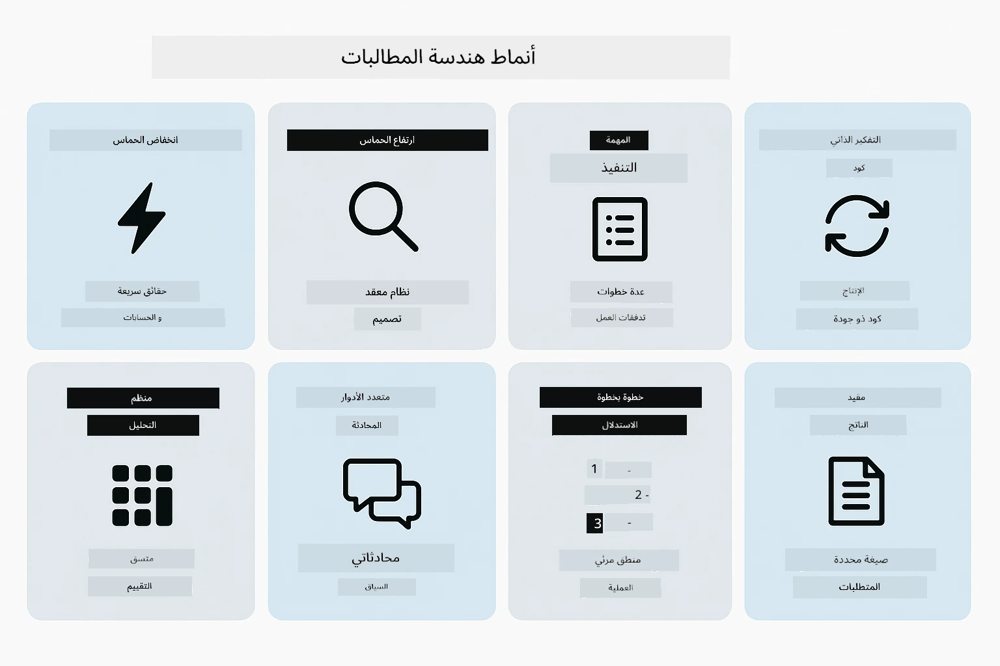
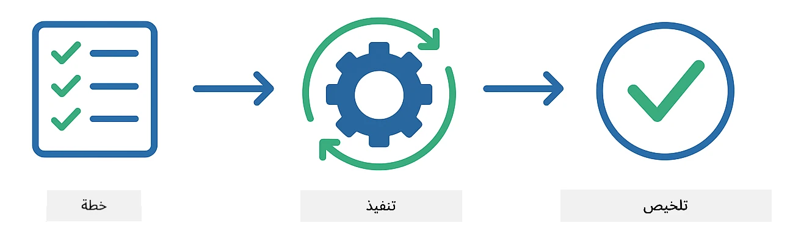
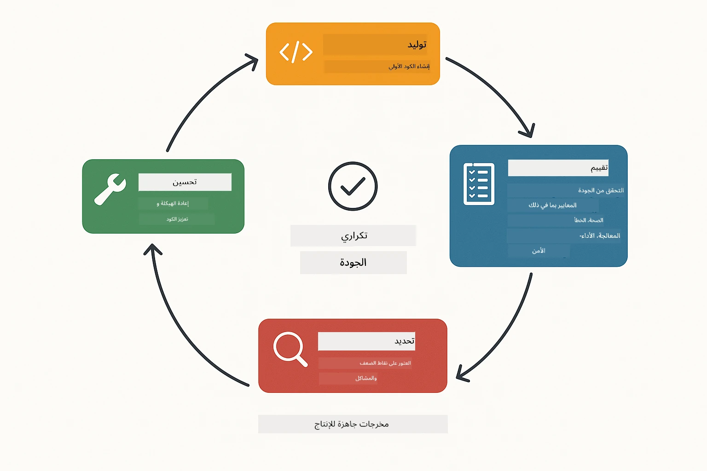
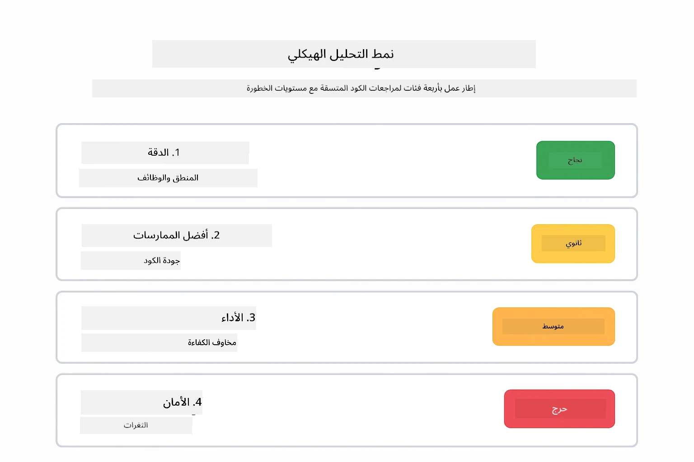
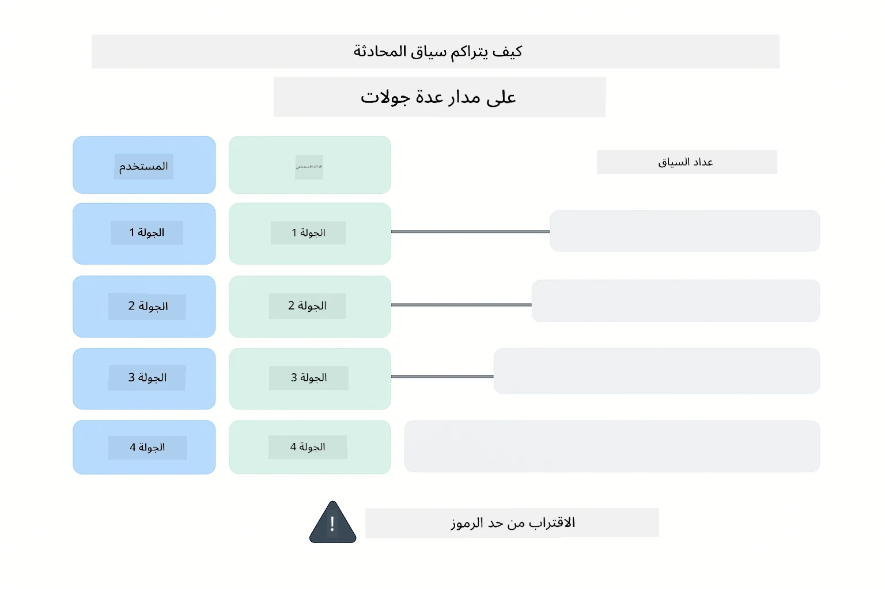
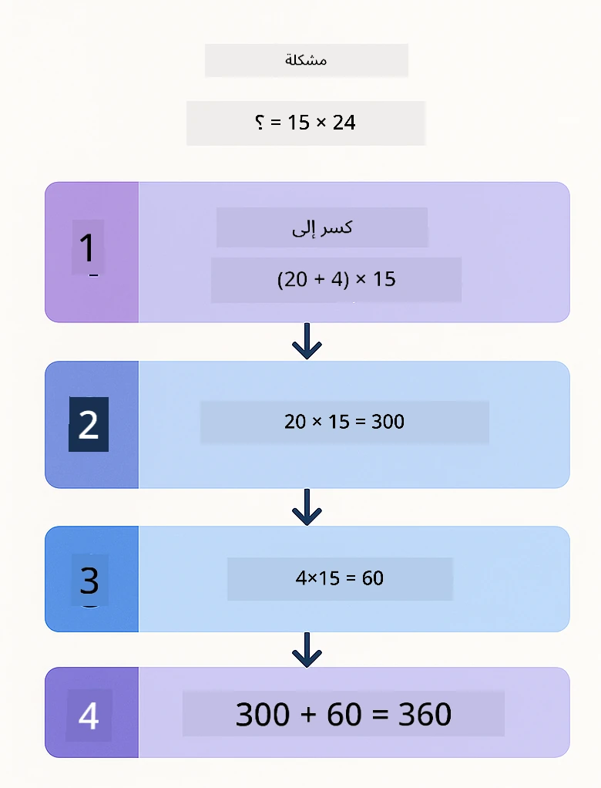
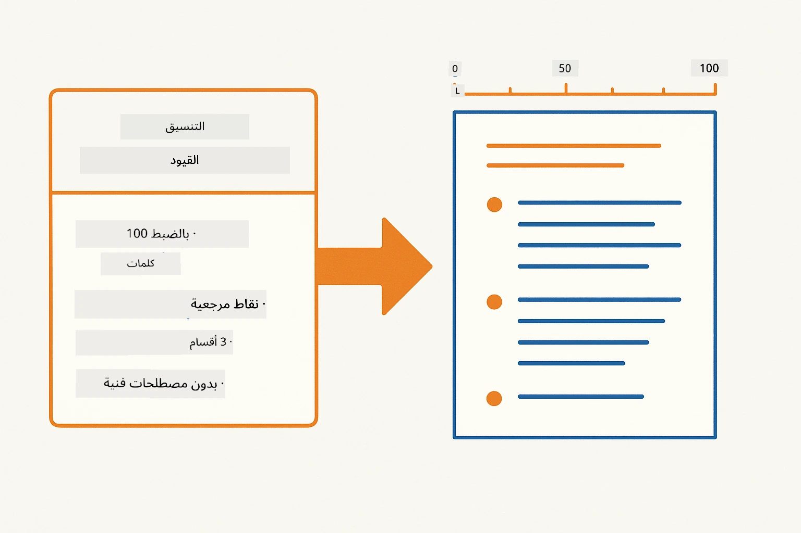
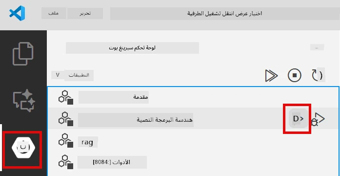
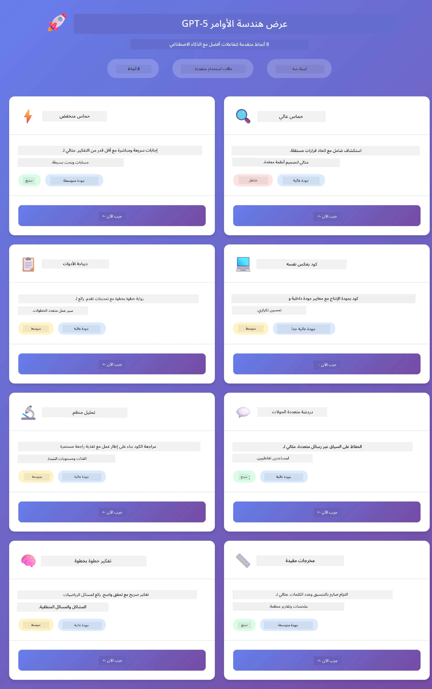
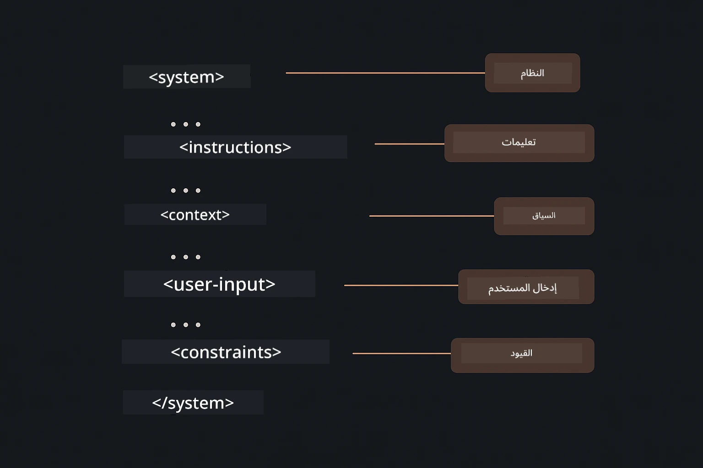

# الوحدة 02: هندسة المطالبات مع GPT-5.2

## جدول المحتويات

- [استعراض الفيديو](#استعراض-الفيديو)
- [ما الذي ستتعلمه](#ما-الذي-ستتعلمه)
- [المتطلبات الأساسية](#المتطلبات-الأساسية)
- [فهم هندسة المطالبات](#فهم-هندسة-المطالبات)
- [أساسيات هندسة المطالبات](#أساسيات-هندسة-المطالبات)
  - [المطالبة بدون أمثلة](#المطالبة-بدون-أمثلة)
  - [المطالبة مع بعض الأمثلة](#المطالبة-مع-بعض-الأمثلة)
  - [سلسلة التفكير](#سلسلة-التفكير)
  - [المطالبة بناءً على الدور](#المطالبة-بناءً-على-الدور)
  - [قوالب المطالبات](#قوالب-المطالبات)
- [الأنماط المتقدمة](#الأنماط-المتقدمة)
- [تشغيل التطبيق](#تشغيل-التطبيق)
- [لقطات شاشة للتطبيق](#لقطات-شاشة-للتطبيق)
- [استكشاف الأنماط](#استكشاف-الأنماط)
  - [الحماس المنخفض مقابل المرتفع](#الحماسة-المنخفضة-مقابل-الحماسة-العالية)
  - [تنفيذ المهمة (مقدمات الأدوات)](#تنفيذ-المهام-مقدمات-الأدوات)
  - [الكود التأملي الذاتي](#الكود-العاكس-للذات)
  - [التحليل المنظم](#التحليل-المنظم)
  - [الدردشة متعددة الأدوار](#الدردشة-متعددة-الأدوار)
  - [التفكير خطوة بخطوة](#التفكير-خطوة-بخطوة)
  - [الناتج المقيد](#مخرجات-مقيدة)
- [ما الذي تتعلمه حقًا](#ما-تتعلمه-حقًا)
- [الخطوات التالية](#الخطوات-التالية)

## استعراض الفيديو

شاهد هذا الجلسة المباشرة التي تشرح كيفية البدء مع هذه الوحدة:

<a href="https://www.youtube.com/live/PJ6aBaE6bog?si=LDshyBrTRodP-wke"></a>

## ما الذي ستتعلمه

يوفر المخطط التالي نظرة عامة على الموضوعات والمهارات الأساسية التي ستطورها في هذه الوحدة — من تقنيات تحسين المطالبات إلى سير العمل خطوة بخطوة الذي ستتبعه.


في الوحدة السابقة، رأيت كيف تمكّن الذاكرة الذكاء الاصطناعي الحواري مع Azure OpenAI. الآن سنركز على كيفية طرح الأسئلة — أي المطالبات نفسها — باستخدام GPT-5.2 من Azure OpenAI. الطريقة التي تبني بها مطالباتك تؤثر بشكل كبير على جودة الردود التي تحصل عليها. نبدأ بمراجعة تقنيات المطالبات الأساسية، ثم ننتقل إلى ثمانية أنماط متقدمة تستغل إمكانيات GPT-5.2 بالكامل.

سنستخدم GPT-5.2 لأنه يقدم تحكمًا في المنطق — يمكنك إخبار النموذج بكمية التفكير التي يجب أن يقوم بها قبل الإجابة. هذا يجعل استراتيجيات المطالبة المختلفة أكثر وضوحًا ويساعدك على فهم متى تستخدم كل نهج.

## المتطلبات الأساسية

- إكمال الوحدة 01 (تم نشر موارد Azure OpenAI)
- ملف `.env` في الدليل الجذري مع بيانات الاعتماد الخاصة بـ Azure (تم إنشاؤه بواسطة `azd up` في الوحدة 01)

> **ملاحظة:** إذا لم تكمل الوحدة 01، اتبع تعليمات النشر هناك أولاً.

## فهم هندسة المطالبات

في جوهرها، هندسة المطالبات هي الفرق بين التعليمات الغامضة والتعليمات الدقيقة، كما يوضح المقارنة أدناه.


هندسة المطالبات تتعلق بتصميم نص الإدخال الذي يمنحك النتائج التي تحتاجها بشكل متسق. الأمر ليس مجرد طرح أسئلة — بل هو هيكلة الطلبات بحيث يفهم النموذج بالضبط ما تريد وكيفية تقديمه.

فكر في الأمر كما لو كنت تعطي تعليمات لزميل في العمل. "أصلح الخطأ" غامض. "أصلح استثناء المؤشر الخالي في UserService.java في السطر 45 بإضافة فحص القيم الخالية" دقيق. نماذج اللغة تعمل بنفس الطريقة — الدقة والهيكل مهمان.

يوضح المخطط أدناه كيف يتناسب LangChain4j مع هذه الصورة — حيث يربط أنماط مطالباتك بالنموذج من خلال وحدات بناء SystemMessage وUserMessage.


يوفر LangChain4j البنية التحتية — اتصالات النموذج، الذاكرة، وأنواع الرسائل — بينما أنماط المطالبات هي مجرد نص منظم بعناية ترسله عبر هذه البنية. اللبنات الأساسية الرئيسية هي `SystemMessage` (الذي يحدد سلوك ودور الذكاء الاصطناعي) و `UserMessage` (الذي يحمل طلبك الفعلي).

## أساسيات هندسة المطالبات

تشكل التقنيات الخمس الأساسية الموضحة أدناه أساس هندسة المطالبات الفعالة. يعالج كل منها جانبًا مختلفًا من كيفية تواصلك مع نماذج اللغة.


قبل الغوص في الأنماط المتقدمة في هذه الوحدة، دعنا نراجع خمس تقنيات تأسيسية للمطالبات. هذه هي اللبنات التي يجب أن يعرفها كل مهندس مطالبات.

### المطالبة بدون أمثلة

أسهل نهج: أعط النموذج تعليمات مباشرة بدون أمثلة. يعتمد النموذج بالكامل على تدريبه لفهم وتنفيذ المهمة. يعمل هذا جيدًا للطلبات البسيطة حيث السلوك المتوقع واضح.


*تعليمات مباشرة بدون أمثلة — يستنتج النموذج المهمة من التعليمات فقط*

```java
String prompt = "Classify this sentiment: 'I absolutely loved the movie!'";
String response = model.chat(prompt);
// رد: "إيجابي"
```

**متى تستخدم:** التصنيفات البسيطة، الأسئلة المباشرة، الترجمات، أو أي مهمة يمكن للنموذج التعامل معها بدون توجيه إضافي.

### المطالبة مع بعض الأمثلة

قدِّم أمثلة توضح النمط الذي تريد من النموذج اتباعه. يتعلم النموذج تنسيق الإدخال والإخراج المتوقع من أمثلتك ويطبقه على المدخلات الجديدة. هذا يحسّن الاتساق بشكل كبير للمهام التي يكون فيها التنسيق أو السلوك المطلوب غير واضح.


*التعلم من الأمثلة — يتعرف النموذج على النمط ويطبقه على المدخلات الجديدة*

```java
String prompt = """
    Classify the sentiment as positive, negative, or neutral.
    
    Examples:
    Text: "This product exceeded my expectations!" → Positive
    Text: "It's okay, nothing special." → Neutral
    Text: "Waste of money, very disappointed." → Negative
    
    Now classify this:
    Text: "Best purchase I've made all year!"
    """;
String response = model.chat(prompt);
```

**متى تستخدم:** التصنيفات المخصصة، التنسيق المتسق، المهام الخاصة بالمجال، أو عندما تكون نتائج المطالبة بدون أمثلة غير متسقة.

### سلسلة التفكير

اطلب من النموذج عرض تفكيره خطوة بخطوة. بدلاً من القفز مباشرة إلى الإجابة، يكسر النموذج المشكلة ويعمل على كل جزء بشكل صريح. هذا يحسن الدقة في الرياضيات، المنطق، ومهام التفكير متعدد الخطوات.


*التفكير خطوة بخطوة — تقسيم المشاكل المعقدة إلى خطوات منطقية صريحة*

```java
String prompt = """
    Problem: A store has 15 apples. They sell 8 apples and then 
    receive a shipment of 12 more apples. How many apples do they have now?
    
    Let's solve this step-by-step:
    """;
String response = model.chat(prompt);
// يوضح النموذج: ١٥ - ٨ = ٧، ثم ٧ + ١٢ = ١٩ تفاحة
```

**متى تستخدم:** مسائل رياضية، ألغاز منطقية، تصحيح الأخطاء، أو أي مهمة حيث يساعد عرض عملية التفكير في تحسين الدقة والثقة.

### المطالبة بناءً على الدور

حدد شخصية أو دور للذكاء الاصطناعي قبل طرح سؤالك. هذا يوفر سياقاً يشكل نبرة، عمق، وتركيز الرد. "مهندس برمجيات" يقدم نصائح مختلفة عن "مطور مبتدئ" أو "مدقق أمني".


*تحديد السياق والشخصية — نفس السؤال يحصل على رد مختلف بناءً على الدور المعين*

```java
String prompt = """
    You are an experienced software architect reviewing code.
    Provide a brief code review for this function:
    
    def calculate_total(items):
        total = 0
        for item in items:
            total = total + item['price']
        return total
    """;
String response = model.chat(prompt);
```

**متى تستخدم:** مراجعات الكود، التدريس، التحليل الخاص بالمجال، أو عندما تحتاج إلى ردود مخصصة لمستوى خبرة أو منظور معين.

### قوالب المطالبات

أنشئ مطالبات قابلة لإعادة الاستخدام مع متغيرات مكان العناصر. بدلاً من كتابة مطالبة جديدة في كل مرة، عرّف قالباً مرة واحدة واملأ قيم مختلفة. تسهل فئة `PromptTemplate` في LangChain4j هذا باستخدام صيغة `{{variable}}`.


*مطالبات قابلة لإعادة الاستخدام مع متغيرات مكان العناصر — قالب واحد، استخدامات متعددة*

```java
PromptTemplate template = PromptTemplate.from(
    "What's the best time to visit {{destination}} for {{activity}}?"
);

Prompt prompt = template.apply(Map.of(
    "destination", "Paris",
    "activity", "sightseeing"
));

String response = model.chat(prompt.text());
```

**متى تستخدم:** استعلامات متكررة مع مدخلات مختلفة، المعالجة الدفعية، بناء سير عمل ذكاء اصطناعي قابل لإعادة الاستخدام، أو أي سيناريو يبقى فيه هيكل المطالبة نفسه لكن البيانات تتغير.

---

هذه الأساسيات الخمسة تزودك بمجموعة أدوات قوية لمعظم مهام المطالبة. بقية هذه الوحدة تبني عليها بـ **ثمانية أنماط متقدمة** تستفيد من تحكم GPT-5.2 في المنطق، التقييم الذاتي، وقدرات الإخراج المهيكل.

## الأنماط المتقدمة

بعد تغطية الأساسيات، لننتقل إلى الثمانية أنماط المتقدمة التي تميز هذه الوحدة. ليست كل المشاكل تحتاج لنفس النهج. بعض الأسئلة تحتاج إجابات سريعة، وأخرى تحتاج تفكيرًا عميقًا. بعض تحتاج إلى منطق مرئي، والبعض الآخر يحتاج فقط النتائج. كل نمط أدناه مُحسّن لسيناريو مختلف — وتحكم GPT-5.2 في المنطق يجعل الفروقات أكثر وضوحًا.



*نظرة عامة على ثمانية أنماط هندسة المطالبات وحالات استخدامها*

يضيف GPT-5.2 بعدًا آخر لهذه الأنماط: *تحكم في المنطق*. يظهر شريط التمرير أدناه كيف يمكنك تعديل جهد التفكير لدى النموذج — من إجابات سريعة ومباشرة إلى تحليل عميق وشامل.


*تحكم GPT-5.2 في المنطق يتيح لك تحديد مقدار التفكير الذي يجب أن يقوم به النموذج — من إجابات سريعة ومباشرة إلى استكشاف عميق*

**حماس منخفض (سريع ومركز)** - للأسئلة البسيطة التي تريد فيها إجابات سريعة ومباشرة. يقوم النموذج بأقل قدر من التفكير - بحد أقصى خطوتين. استخدم هذا للحسابات، الاستعلامات، أو الأسئلة البسيطة.

```java
String prompt = """
    <context_gathering>
    - Search depth: very low
    - Bias strongly towards providing a correct answer as quickly as possible
    - Usually, this means an absolute maximum of 2 reasoning steps
    - If you think you need more time, state what you know and what's uncertain
    </context_gathering>
    
    Problem: What is 15% of 200?
    
    Provide your answer:
    """;

String response = chatModel.chat(prompt);
```

> 💡 **استكشف مع GitHub Copilot:** افتح [`Gpt5PromptService.java`](../../../02-prompt-engineering/src/main/java/com/example/langchain4j/prompts/service/Gpt5PromptService.java) واسأل:
> - "ما الفرق بين نمطي المطالبة الحماسية المنخفضة والحماسية العالية؟"
> - "كيف تساعد علامات XML في المطالبات على هيكلة رد الذكاء الاصطناعي؟"
> - "متى يجب أن أستخدم أنماط التأمل الذاتي مقابل التعليمات المباشرة؟"

**حماس عالي (عميق وشامل)** - للمشكلات المعقدة التي تريد فيها تحليلاً شاملاً. يستكشف النموذج بدقة ويعرض تفكيرًا مفصلًا. استخدم هذا لتصميم النظم، قرارات الهندسة المعمارية، أو البحث المعقد.

```java
String prompt = """
    Analyze this problem thoroughly and provide a comprehensive solution.
    Consider multiple approaches, trade-offs, and important details.
    Show your analysis and reasoning in your response.
    
    Problem: Design a caching strategy for a high-traffic REST API.
    """;

String response = chatModel.chat(prompt);
```

**تنفيذ المهمة (تقدم خطوة بخطوة)** - لسير العمل متعددة الخطوات. يقدم النموذج خطة مبدئية، يروي كل خطوة أثناء التنفيذ، ثم يعطي ملخصًا. استخدم هذا للهجرات، التطبيقات، أو أي عملية متعددة الخطوات.

```java
String prompt = """
    <task_execution>
    1. First, briefly restate the user's goal in a friendly way
    
    2. Create a step-by-step plan:
       - List all steps needed
       - Identify potential challenges
       - Outline success criteria
    
    3. Execute each step:
       - Narrate what you're doing
       - Show progress clearly
       - Handle any issues that arise
    
    4. Summarize:
       - What was completed
       - Any important notes
       - Next steps if applicable
    </task_execution>
    
    <tool_preambles>
    - Always begin by rephrasing the user's goal clearly
    - Outline your plan before executing
    - Narrate each step as you go
    - Finish with a distinct summary
    </tool_preambles>
    
    Task: Create a REST endpoint for user registration
    
    Begin execution:
    """;

String response = chatModel.chat(prompt);
```

المطالبة بسلسلة التفكير تطلب صراحة من النموذج عرض عملية تفكيره، مما يحسن الدقة للمهام المعقدة. يساعد التفصيل خطوة بخطوة البشر والذكاء الاصطناعي على فهم المنطق.

> **🤖 جرب مع دردشة [GitHub Copilot](https://github.com/features/copilot):** اسأل عن هذا النمط:
> - "كيف يمكنني تكييف نمط تنفيذ المهمة للعمليات طويلة الأمد؟"
> - "ما هي أفضل الممارسات لهياكلة مقدمات الأدوات في تطبيقات الإنتاج؟"
> - "كيف يمكنني التقاط وعرض تحديثات التقدم المرحلية في واجهة المستخدم؟"

يوضح المخطط أدناه هذا سير العمل خطة → تنفيذ → تلخيص.



*سير العمل خطة → تنفيذ → تلخيص للمهام متعددة الخطوات*

**الكود التأملي الذاتي** - لتوليد رمز بجودة الإنتاج. ينتج النموذج كودًا يتبع معايير الإنتاج مع التعامل السليم مع الأخطاء. استخدم هذا عند بناء ميزات أو خدمات جديدة.

```java
String prompt = """
    Generate Java code with production-quality standards: Create an email validation service
    Keep it simple and include basic error handling.
    """;

String response = chatModel.chat(prompt);
```

يوضح المخطط أدناه حلقة التحسين التكرارية هذه — إنتاج، تقييم، تحديد نقاط الضعف، وتحسين حتى يلبي الكود معايير الإنتاج.



*حلقة تحسين تكرارية - إنتاج، تقييم، تحديد المشكلات، تحسين، تكرار*

**التحليل المنظم** - للتقييم المتسق. يراجع النموذج الكود باستخدام إطار ثابت (الصحة، الممارسات، الأداء، الأمان، قابلية الصيانة). استخدم هذا لمراجعات الكود أو تقييمات الجودة.

```java
String prompt = """
    <analysis_framework>
    You are an expert code reviewer. Analyze the code for:
    
    1. Correctness
       - Does it work as intended?
       - Are there logical errors?
    
    2. Best Practices
       - Follows language conventions?
       - Appropriate design patterns?
    
    3. Performance
       - Any inefficiencies?
       - Scalability concerns?
    
    4. Security
       - Potential vulnerabilities?
       - Input validation?
    
    5. Maintainability
       - Code clarity?
       - Documentation?
    
    <output_format>
    Provide your analysis in this structure:
    - Summary: One-sentence overall assessment
    - Strengths: 2-3 positive points
    - Issues: List any problems found with severity (High/Medium/Low)
    - Recommendations: Specific improvements
    </output_format>
    </analysis_framework>
    
    Code to analyze:
    ```
    public List getUsers() {
        return database.query("SELECT * FROM users");
    }
    ```
    Provide your structured analysis:
    """;

String response = chatModel.chat(prompt);
```

> **🤖 جرب مع دردشة [GitHub Copilot](https://github.com/features/copilot):** اسأل عن التحليل المنظم:
> - "كيف يمكنني تخصيص إطار التحليل لأنواع مختلفة من مراجعات الكود؟"
> - "ما أفضل طريقة لتحليل والإجراء على الإخراج المنظم برمجيًا؟"
> - "كيف أضمن مستويات شدة متسقة عبر جلسات المراجعة المختلفة؟"

يوضح المخطط التالي كيف ينظم هذا الإطار المنظم مراجعة الكود إلى فئات متسقة مع مستويات شدة.



*إطار عمل لمراجعات الكود المتسقة مع مستويات الشدة*

**الدردشة متعددة الأدوار** - للمحادثات التي تحتاج للسياق. يتذكر النموذج الرسائل السابقة ويبني عليها. استخدم هذا لجلسات المساعدة التفاعلية أو أسئلة وأجوبة معقدة.

```java
ChatMemory memory = MessageWindowChatMemory.withMaxMessages(10);

memory.add(UserMessage.from("What is Spring Boot?"));
AiMessage aiMessage1 = chatModel.chat(memory.messages()).aiMessage();
memory.add(aiMessage1);

memory.add(UserMessage.from("Show me an example"));
AiMessage aiMessage2 = chatModel.chat(memory.messages()).aiMessage();
memory.add(aiMessage2);
```

يوضح المخطط أدناه كيف يتكامل سياق المحادثة مع كل دورة وكيف يرتبط بحدود عدد الرموز للنموذج.



*كيف يتراكم سياق المحادثة عبر عدة دورات حتى الوصول إلى حد الرموز*

**التفكير خطوة بخطوة** - للمشاكل التي تتطلب منطقًا مرئيًا. يعرض النموذج تفكيرًا صريحًا لكل خطوة. استخدم هذا للمسائل الرياضية، الألغاز المنطقية، أو عندما تحتاج إلى فهم عملية التفكير.

```java
String prompt = """
    <instruction>Show your reasoning step-by-step</instruction>
    
    If a train travels 120 km in 2 hours, then stops for 30 minutes,
    then travels another 90 km in 1.5 hours, what is the average speed
    for the entire journey including the stop?
    """;

String response = chatModel.chat(prompt);
```

يوضح المخطط أدناه كيف يكسر النموذج المشاكل إلى خطوات منطقية مرقمة وصريحة.


*تفكيك المشكلات إلى خطوات منطقية صريحة*

**المخرجات المقيدة** - للردود التي تتطلب تنسيقًا محددًا. يتبع النموذج بدقة قواعد الشكل والطول. استخدم هذا للملخصات أو عندما تحتاج إلى هيكل إخراج دقيق.

```java
String prompt = """
    <constraints>
    - Exactly 100 words
    - Bullet point format
    - Technical terms only
    </constraints>
    
    Summarize the key concepts of machine learning.
    """;

String response = chatModel.chat(prompt);
```

يُظهر الشكل التالي كيف توجه القيود النموذج لإنتاج مخرجات تلتزم بدقة بمتطلبات التنسيق والطول الخاصة بك.



*فرض متطلبات معينة على التنسيق والطول والتركيب*

## تشغيل التطبيق

**التحقق من النشر:**

تأكد من وجود ملف `.env` في الدليل الجذري يحتوي على بيانات اعتماد Azure (تم إنشاؤه خلال الوحدة 01). نفذ هذا من دليل الوحدة (`02-prompt-engineering/`):

**Bash:**
```bash
cat ../.env  # يجب عرض AZURE_OPENAI_ENDPOINT و API_KEY و DEPLOYMENT
```

**PowerShell:**
```powershell
Get-Content ..\.env  # يجب أن يعرض AZURE_OPENAI_ENDPOINT و API_KEY و DEPLOYMENT
```

**بدء التطبيق:**

> **ملاحظة:** إذا كنت قد بدأت جميع التطبيقات بالفعل باستخدام `./start-all.sh` من الدليل الجذري (كما هو موضح في الوحدة 01)، فإن هذه الوحدة تعمل بالفعل على المنفذ 8083. يمكنك تخطي أوامر البدء أدناه والانتقال مباشرة إلى http://localhost:8083.

**الخيار 1: استخدام لوحة تحكم Spring Boot (موصى به لمستخدمي VS Code)**

يشتمل حاوية التطوير على امتداد Spring Boot Dashboard الذي يوفر واجهة مرئية لإدارة جميع تطبيقات Spring Boot. يمكنك العثور عليه في شريط النشاط على الجانب الأيسر من VS Code (ابحث عن أيقونة Spring Boot).

من لوحة تحكم Spring Boot، يمكنك:
- رؤية جميع تطبيقات Spring Boot المتاحة في مساحة العمل
- بدء/إيقاف التطبيقات بنقرة واحدة
- عرض سجلات التطبيق في الوقت الحقيقي
- مراقبة حالة التطبيق

ببساطة انقر على زر التشغيل بجانب "prompt-engineering" لبدء هذه الوحدة، أو ابدأ جميع الوحدات دفعة واحدة.



*لوحة تحكم Spring Boot في VS Code — بدء، إيقاف، ومراقبة جميع الوحدات من مكان واحد*

**الخيار 2: استخدام سكربتات الشيل**

ابدأ جميع تطبيقات الويب (الوحدات 01-04):

**Bash:**
```bash
cd ..  # من الدليل الجذري
./start-all.sh
```

**PowerShell:**
```powershell
cd ..  # من الدليل الجذري
.\start-all.ps1
```

أو ابدأ هذه الوحدة فقط:

**Bash:**
```bash
cd 02-prompt-engineering
./start.sh
```

**PowerShell:**
```powershell
cd 02-prompt-engineering
.\start.ps1
```

يقوم كلا السكربتين بتحميل متغيرات البيئة تلقائيًا من ملف `.env` في الدليل الجذري وسيبني ملفات JAR إذا لم تكن موجودة.

> **ملاحظة:** إذا كنت تفضل بناء جميع الوحدات يدويًا قبل البدء:
>
> **Bash:**
> ```bash
> cd ..  # Go to root directory
> mvn clean package -DskipTests
> ```
>
> **PowerShell:**
> ```powershell
> cd ..  # Go to root directory
> mvn clean package -DskipTests
> ```

افتح http://localhost:8083 في متصفحك.

**للتوقف:**

**Bash:**
```bash
./stop.sh  # هذا الوحدة فقط
# أو
cd .. && ./stop-all.sh  # كل الوحدات
```

**PowerShell:**
```powershell
.\stop.ps1  # هذا الوحدة فقط
# أو
cd ..; .\stop-all.ps1  # جميع الوحدات
```

## لقطات شاشة للتطبيق

إليك الواجهة الرئيسية لوحدة هندسة الحث، حيث يمكنك تجربة جميع الأنماط الثمانية جنبًا إلى جنب.



*الواجهة الرئيسية تعرض جميع 8 أنماط هندسة الحث مع خصائصها وحالات استخدامها*

## استكشاف الأنماط

تتيح لك الواجهة الإلكترونية تجربة استراتيجيات تحفيز مختلفة. كل نمط يحل مشاكل مختلفة - جربها لترى متى يتألق كل نهج.

> **ملاحظة: البث مقابل غير البث** — تقدم كل صفحة نمط زرين: **🔴 بث الرد (مباشر)** وخيار **غير بث**. يستخدم البث أحداث الخادم (SSE) لعرض الرموز في الوقت الحقيقي أثناء توليد النموذج لها، لذا ترى التقدم فورًا. خيار غير البث ينتظر الرد الكامل قبل عرضه. بالنسبة للأوامر التي تحفز التفكير العميق (مثل الحماسة العالية، الكود العاكس للذات)، قد يستغرق استدعاء غير البث وقتًا طويلًا - أحيانًا دقائق - دون أي ملاحظات مرئية. **استخدم البث عند تجربة أوامر معقدة** لتتمكن من مشاهدة النموذج يعمل وتجنب انطباع انتهاء المهلة.
>
> **ملاحظة: متطلبات المتصفح** — تستخدم ميزة البث واجهة Fetch Streams API (`response.body.getReader()`) التي تتطلب متصفحًا كاملاً (Chrome، Edge، Firefox، Safari). **لا يعمل** في المتصفح البسيط المدمج بداخل VS Code، لأن عرض الويب فيه لا يدعم واجهة ReadableStream API. إذا استخدمت المتصفح البسيط، ستعمل أزرار غير البث بشكل طبيعي — فقط أزرار البث هي المتأثرة. افتح `http://localhost:8083` في متصفح خارجي لتجربة كاملة.

### الحماسة المنخفضة مقابل الحماسة العالية

اطرح سؤالًا بسيطًا مثل "ما هو 15% من 200؟" باستخدام الحماسة المنخفضة. ستحصل على إجابة فورية ومباشرة. الآن اطرح شيئًا معقدًا مثل "صمم استراتيجية تخزين مؤقت لواجهة برمجة تطبيقات عالية الحركة" باستخدام الحماسة العالية. انقر على **🔴 بث الرد (مباشر)** وشاهد التفكير التفصيلي للنموذج يظهر رمزًا تلو الآخر. نفس النموذج، نفس هيكل السؤال - لكن الحث يخبره بكمية التفكير المطلوب.

### تنفيذ المهام (مقدمات الأدوات)

تستفيد تدفقات العمل متعددة الخطوات من التخطيط المسبق وسرد التقدم. يوضح النموذج ما سيفعله، يسرد كل خطوة، ثم يلخص النتائج.

### الكود العاكس للذات

جرّب "إنشاء خدمة تحقق من البريد الإلكتروني". بدلاً من مجرد توليد الكود والتوقف، يولد النموذج، ويقيّم وفقاً لمعايير الجودة، ويحدد نقاط الضعف، ويحسّن. سترى تكرار العملية حتى يفي الكود بمعايير الإنتاج.

### التحليل المنظم

تحتاج مراجعات الكود إلى أُطر تقييم متسقة. يحلل النموذج الكود باستخدام فئات ثابتة (الصحة، الممارسات، الأداء، الأمان) مع مستويات شدة.

### الدردشة متعددة الأدوار

اسأل "ما هو Spring Boot؟" ثم تابع فورًا بـ "اعرض مثالًا". يتذكر النموذج سؤالك الأول ويعطيك مثال Spring Boot محدد. بدون ذاكرة، سيكون السؤال الثاني غامضًا جدًا.

### التفكير خطوة بخطوة

اختر مسألة رياضية وجربها مع كل من التفكير خطوة بخطوة والحماسة المنخفضة. الحماسة المنخفضة تعطيك فقط الإجابة - بسرعة ولكن بشكل غامض. التفكير خطوة بخطوة يعرض كل حساب وقرار.

### مخرجات مقيدة

عندما تحتاج إلى تنسيقات محددة أو عدد كلمات محدد، يفرض هذا النمط الالتزام التام. جرّب إنشاء ملخص يحتوي على 100 كلمة تمامًا بصيغة نقاط.

## ما تتعلمه حقًا

**جهد التفكير يغير كل شيء**

تتيح لك GPT-5.2 التحكم في الجهد الحاسوبي من خلال ألوماتك. الجهد المنخفض يعني ردود سريعة مع استكشاف قليل، والجهد العالي يعني أن النموذج يأخذ وقتًا للتفكير بعمق. تتعلم مطابقة الجهد مع تعقيد المهمة - لا تهدر الوقت في الأسئلة البسيطة، ولا تتعجل في القرارات المعقدة.

**التركيب يوجه السلوك**

هل لاحظت علامات XML في الحث؟ ليست للزينة. تتبع النماذج التعليمات المنظمة أكثر موثوقية من النص الحر. عندما تحتاج إلى عمليات متعددة الخطوات أو منطق معقد، يساعد التركيب النموذج على تتبع موقعه والمرحلة التالية. ينفصل المخطط أدناه حثًا منظمًا جيدًا، موضحًا كيف تنظم العلامات مثل `<system>`, `<instructions>`, `<context>`, `<user-input>`, و `<constraints>` تعليماتك إلى أقسام واضحة.



*تشريح حث منظم جيدًا مع أقسام واضحة وتنظيم بأسلوب XML*

**الجودة من خلال التقييم الذاتي**

تعمل أنماط العاكسة للذات عن طريق جعل معايير الجودة صريحة. بدلاً من الأمل بأن "يفعل النموذج الشيء الصحيح"، أنت تخبره ما هو "الصحيح" بالضبط: منطق صحيح، التعامل مع الأخطاء، الأداء، الأمان. يمكن للنموذج بعد ذلك تقييم مخرجاته وتحسينها. يحول هذا توليد الكود من يانصيب إلى عملية منظمة.

**السياق محدود**

تعمل المحادثات متعددة الأدوار عن طريق تضمين سجل الرسائل مع كل طلب، لكن هناك حدًا - لكل نموذج حد أقصى للرموز. مع نمو المحادثات، ستحتاج إلى استراتيجيات للحفاظ على السياق ذي الصلة دون الوصول إلى الحد الأعلى. تعرض لك هذه الوحدة كيفية عمل الذاكرة؛ وستتعلم لاحقًا متى تلخص، ومتى تنسى، ومتى تستعيد.

## الخطوات التالية

**الوحدة التالية:** [03-rag - RAG (التوليد المدعوم بالاستخراج)](../03-rag/README.md)

---

**التنقل:** [← السابق: الوحدة 01 - مقدمة](../01-introduction/README.md) | [عودة للرئيسية](../README.md) | [التالي: الوحدة 03 - RAG →](../03-rag/README.md)

---

<!-- CO-OP TRANSLATOR DISCLAIMER START -->
**تنويه**:
تمت ترجمة هذا المستند باستخدام خدمة الترجمة بالذكاء الاصطناعي [Co-op Translator](https://github.com/Azure/co-op-translator). بينما نسعى للدقة، يرجى العلم أن الترجمات الآلية قد تحتوي على أخطاء أو عدم دقة. يجب اعتبار المستند الأصلي بلغته الأصلية المصدر الرسمي والمعتمد. للمعلومات الهامة، يُنصح بالاستعانة بترجمة بشرية محترفة. نحن غير مسؤولين عن أي سوء فهم أو تفسير ناتج عن استخدام هذه الترجمة.
<!-- CO-OP TRANSLATOR DISCLAIMER END -->