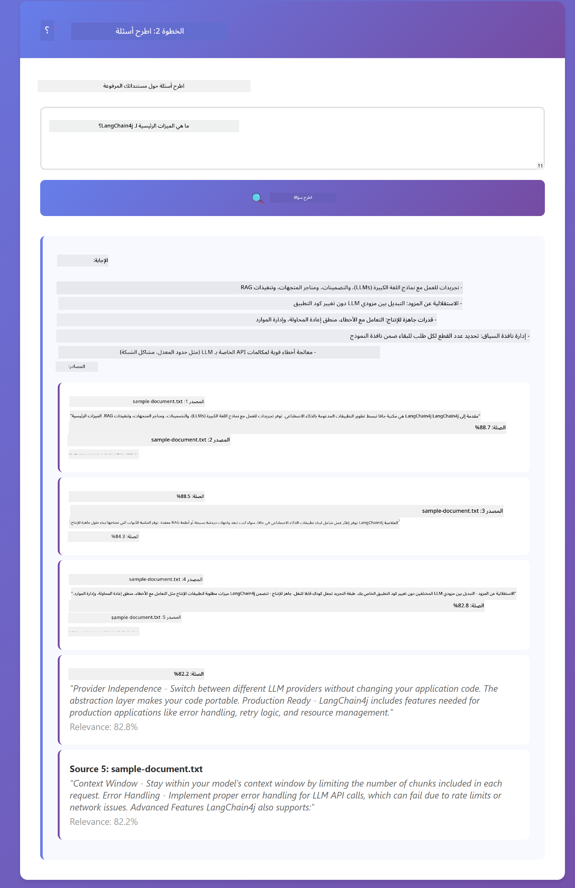

<!--
CO_OP_TRANSLATOR_METADATA:
{
  "original_hash": "f538a51cfd13147d40d84e936a0f485c",
  "translation_date": "2025-12-13T16:45:49+00:00",
  "source_file": "03-rag/README.md",
  "language_code": "ar"
}
-->
# الوحدة 03: RAG (التوليد المعزز بالاسترجاع)

## جدول المحتويات

- [ما ستتعلمه](../../../03-rag)
- [المتطلبات المسبقة](../../../03-rag)
- [فهم RAG](../../../03-rag)
- [كيف يعمل](../../../03-rag)
  - [معالجة المستندات](../../../03-rag)
  - [إنشاء التضمينات](../../../03-rag)
  - [البحث الدلالي](../../../03-rag)
  - [توليد الإجابة](../../../03-rag)
- [تشغيل التطبيق](../../../03-rag)
- [استخدام التطبيق](../../../03-rag)
  - [تحميل مستند](../../../03-rag)
  - [طرح الأسئلة](../../../03-rag)
  - [التحقق من مراجع المصدر](../../../03-rag)
  - [التجربة مع الأسئلة](../../../03-rag)
- [المفاهيم الرئيسية](../../../03-rag)
  - [استراتيجية التقسيم](../../../03-rag)
  - [درجات التشابه](../../../03-rag)
  - [التخزين في الذاكرة](../../../03-rag)
  - [إدارة نافذة السياق](../../../03-rag)
- [متى يكون RAG مهمًا](../../../03-rag)
- [الخطوات التالية](../../../03-rag)

## ما ستتعلمه

في الوحدات السابقة، تعلمت كيفية إجراء محادثات مع الذكاء الاصطناعي وتنظيم مطالباتك بشكل فعال. لكن هناك قيدًا أساسيًا: نماذج اللغة تعرف فقط ما تعلمته أثناء التدريب. لا يمكنها الإجابة عن أسئلة حول سياسات شركتك، أو وثائق مشروعك، أو أي معلومات لم يتم تدريبها عليها.

يحل RAG (التوليد المعزز بالاسترجاع) هذه المشكلة. بدلاً من محاولة تعليم النموذج معلوماتك (وهو أمر مكلف وغير عملي)، تمنحه القدرة على البحث في مستنداتك. عندما يطرح شخص ما سؤالًا، يجد النظام المعلومات ذات الصلة ويضمّنها في المطالبة. ثم يجيب النموذج بناءً على هذا السياق المسترجع.

فكر في RAG كأنه يمنح النموذج مكتبة مرجعية. عندما تطرح سؤالًا، يقوم النظام بـ:

1. **استعلام المستخدم** - تطرح سؤالًا  
2. **التضمين** - يحول سؤالك إلى متجه  
3. **البحث المتجهي** - يجد أجزاء المستند المشابهة  
4. **تجميع السياق** - يضيف الأجزاء ذات الصلة إلى المطالبة  
5. **الاستجابة** - يولد النموذج إجابة بناءً على السياق  

هذا يؤسس ردود النموذج على بياناتك الفعلية بدلاً من الاعتماد على معرفته التدريبية أو اختلاق الإجابات.


*سير عمل RAG - من استعلام المستخدم إلى البحث الدلالي إلى توليد الإجابة السياقية*

## المتطلبات المسبقة

- إكمال الوحدة 01 (تم نشر موارد Azure OpenAI)  
- ملف `.env` في الدليل الجذري يحتوي على بيانات اعتماد Azure (تم إنشاؤه بواسطة `azd up` في الوحدة 01)  

> **ملاحظة:** إذا لم تكمل الوحدة 01، فاتبع تعليمات النشر هناك أولاً.

## كيف يعمل

**معالجة المستندات** - [DocumentService.java](../../../03-rag/src/main/java/com/example/langchain4j/rag/service/DocumentService.java)

عند تحميل مستند، يقوم النظام بتقسيمه إلى أجزاء - قطع أصغر تناسب نافذة السياق الخاصة بالنموذج بشكل مريح. تتداخل هذه الأجزاء قليلاً حتى لا تفقد السياق عند الحدود.

```java
Document document = FileSystemDocumentLoader.loadDocument("sample-document.txt");

DocumentSplitter splitter = DocumentSplitters
    .recursive(300, 30, new OpenAiTokenizer());

List<TextSegment> segments = splitter.split(document);
```
  
> **🤖 جرب مع [GitHub Copilot](https://github.com/features/copilot) Chat:** افتح [`DocumentService.java`](../../../03-rag/src/main/java/com/example/langchain4j/rag/service/DocumentService.java) واسأل:  
> - "كيف يقوم LangChain4j بتقسيم المستندات إلى أجزاء ولماذا التداخل مهم؟"  
> - "ما هو حجم الجزء الأمثل لأنواع المستندات المختلفة ولماذا؟"  
> - "كيف أتعامل مع المستندات متعددة اللغات أو ذات التنسيق الخاص؟"

**إنشاء التضمينات** - [LangChainRagConfig.java](../../../03-rag/src/main/java/com/example/langchain4j/rag/config/LangChainRagConfig.java)

يتم تحويل كل جزء إلى تمثيل رقمي يسمى تضمين - وهو بصمة رياضية تلتقط معنى النص. النصوص المتشابهة تنتج تضمينات متشابهة.

```java
@Bean
public EmbeddingModel embeddingModel() {
    return OpenAiOfficialEmbeddingModel.builder()
        .baseUrl(azureOpenAiEndpoint)
        .apiKey(azureOpenAiKey)
        .modelName(azureEmbeddingDeploymentName)
        .build();
}

EmbeddingStore<TextSegment> embeddingStore = 
    new InMemoryEmbeddingStore<>();
```
  


*المستندات ممثلة كمتجهات في فضاء التضمين - المحتوى المتشابه يتجمع معًا*

**البحث الدلالي** - [RagService.java](../../../03-rag/src/main/java/com/example/langchain4j/rag/service/RagService.java)

عندما تطرح سؤالًا، يتحول سؤالك أيضًا إلى تضمين. يقارن النظام تضمين سؤالك مع جميع تضمينات أجزاء المستند. يجد الأجزاء التي تحمل معاني مشابهة - ليس فقط الكلمات المفتاحية المتطابقة، بل التشابه الدلالي الفعلي.

```java
Embedding queryEmbedding = embeddingModel.embed(question).content();

List<EmbeddingMatch<TextSegment>> matches = 
    embeddingStore.findRelevant(queryEmbedding, 5, 0.7);

for (EmbeddingMatch<TextSegment> match : matches) {
    String relevantText = match.embedded().text();
    double score = match.score();
}
```
  
> **🤖 جرب مع [GitHub Copilot](https://github.com/features/copilot) Chat:** افتح [`RagService.java`](../../../03-rag/src/main/java/com/example/langchain4j/rag/service/RagService.java) واسأل:  
> - "كيف يعمل البحث بالتشابه مع التضمينات وما الذي يحدد الدرجة؟"  
> - "ما هو عتبة التشابه التي يجب أن أستخدمها وكيف تؤثر على النتائج؟"  
> - "كيف أتعامل مع الحالات التي لا يتم فيها العثور على مستندات ذات صلة؟"

**توليد الإجابة** - [RagService.java](../../../03-rag/src/main/java/com/example/langchain4j/rag/service/RagService.java)

يتم تضمين الأجزاء الأكثر صلة في المطالبة المقدمة للنموذج. يقرأ النموذج تلك الأجزاء المحددة ويجيب على سؤالك بناءً على تلك المعلومات. هذا يمنع الهلوسة - يمكن للنموذج الإجابة فقط مما هو أمامه.

## تشغيل التطبيق

**التحقق من النشر:**

تأكد من وجود ملف `.env` في الدليل الجذري يحتوي على بيانات اعتماد Azure (تم إنشاؤه أثناء الوحدة 01):  
```bash
cat ../.env  # يجب أن يعرض AZURE_OPENAI_ENDPOINT و API_KEY و DEPLOYMENT
```
  
**بدء التطبيق:**

> **ملاحظة:** إذا كنت قد بدأت جميع التطبيقات باستخدام `./start-all.sh` من الوحدة 01، فإن هذه الوحدة تعمل بالفعل على المنفذ 8081. يمكنك تخطي أوامر البدء أدناه والذهاب مباشرة إلى http://localhost:8081.

**الخيار 1: استخدام لوحة تحكم Spring Boot (موصى به لمستخدمي VS Code)**

تتضمن حاوية التطوير امتداد لوحة تحكم Spring Boot، الذي يوفر واجهة بصرية لإدارة جميع تطبيقات Spring Boot. يمكنك العثور عليه في شريط النشاط على الجانب الأيسر من VS Code (ابحث عن أيقونة Spring Boot).

من لوحة تحكم Spring Boot، يمكنك:  
- رؤية جميع تطبيقات Spring Boot المتاحة في مساحة العمل  
- بدء/إيقاف التطبيقات بنقرة واحدة  
- عرض سجلات التطبيق في الوقت الحقيقي  
- مراقبة حالة التطبيق  

فقط انقر على زر التشغيل بجانب "rag" لبدء هذه الوحدة، أو ابدأ جميع الوحدات دفعة واحدة.


**الخيار 2: استخدام سكربتات الشل**

ابدأ جميع تطبيقات الويب (الوحدات 01-04):

**Bash:**  
```bash
cd ..  # من الدليل الجذري
./start-all.sh
```
  
**PowerShell:**  
```powershell
cd ..  # من الدليل الجذري
.\start-all.ps1
```
  
أو ابدأ هذه الوحدة فقط:

**Bash:**  
```bash
cd 03-rag
./start.sh
```
  
**PowerShell:**  
```powershell
cd 03-rag
.\start.ps1
```
  
كلا السكربتين يقومان تلقائيًا بتحميل متغيرات البيئة من ملف `.env` الجذري وسيبنيان ملفات JAR إذا لم تكن موجودة.

> **ملاحظة:** إذا كنت تفضل بناء جميع الوحدات يدويًا قبل البدء:  
>  
> **Bash:**  
> ```bash
> cd ..  # Go to root directory
> mvn clean package -DskipTests
> ```
  
> **PowerShell:**  
> ```powershell
> cd ..  # Go to root directory
> mvn clean package -DskipTests
> ```
  
افتح http://localhost:8081 في متصفحك.

**لإيقاف التطبيق:**

**Bash:**  
```bash
./stop.sh  # هذا الوحدة فقط
# أو
cd .. && ./stop-all.sh  # جميع الوحدات
```
  
**PowerShell:**  
```powershell
.\stop.ps1  # هذا الوحدة فقط
# أو
cd ..; .\stop-all.ps1  # جميع الوحدات
```


## استخدام التطبيق

يوفر التطبيق واجهة ويب لتحميل المستندات وطرح الأسئلة.

<a href="images/rag-homepage.png"></a>

*واجهة تطبيق RAG - قم بتحميل المستندات واطرح الأسئلة*

**تحميل مستند**

ابدأ بتحميل مستند - ملفات TXT هي الأفضل للاختبار. يوجد ملف `sample-document.txt` في هذا الدليل يحتوي على معلومات حول ميزات LangChain4j، وتنفيذ RAG، وأفضل الممارسات - مثالي لاختبار النظام.

يقوم النظام بمعالجة مستندك، وتقسيمه إلى أجزاء، وإنشاء تضمينات لكل جزء. يحدث هذا تلقائيًا عند التحميل.

**طرح الأسئلة**

اطرح الآن أسئلة محددة حول محتوى المستند. جرب شيئًا واقعيًا مذكورًا بوضوح في المستند. يبحث النظام عن الأجزاء ذات الصلة، ويضمّنها في المطالبة، ويولد إجابة.

**التحقق من مراجع المصدر**

لاحظ أن كل إجابة تتضمن مراجع للمصدر مع درجات التشابه. تظهر هذه الدرجات (من 0 إلى 1) مدى صلة كل جزء بسؤالك. الدرجات الأعلى تعني تطابقًا أفضل. هذا يتيح لك التحقق من الإجابة مقابل المادة المصدر.

<a href="images/rag-query-results.png"></a>

*نتائج الاستعلام تظهر الإجابة مع مراجع المصدر ودرجات الصلة*

**التجربة مع الأسئلة**

جرب أنواعًا مختلفة من الأسئلة:  
- حقائق محددة: "ما هو الموضوع الرئيسي؟"  
- مقارنات: "ما الفرق بين X و Y؟"  
- ملخصات: "لخص النقاط الرئيسية حول Z"  

راقب كيف تتغير درجات الصلة بناءً على مدى تطابق سؤالك مع محتوى المستند.

## المفاهيم الرئيسية

**استراتيجية التقسيم**

يتم تقسيم المستندات إلى أجزاء من 300 رمز مع تداخل 30 رمزًا. هذا التوازن يضمن أن كل جزء يحتوي على سياق كاف ليكون ذا معنى مع البقاء صغيرًا بما يكفي لتضمين عدة أجزاء في المطالبة.

**درجات التشابه**

تتراوح الدرجات من 0 إلى 1:  
- 0.7-1.0: ذات صلة عالية، تطابق دقيق  
- 0.5-0.7: ذات صلة، سياق جيد  
- أقل من 0.5: تم تصفيتها، غير متشابهة جدًا  

يسترجع النظام فقط الأجزاء التي تتجاوز الحد الأدنى لضمان الجودة.

**التخزين في الذاكرة**

تستخدم هذه الوحدة التخزين في الذاكرة للبساطة. عند إعادة تشغيل التطبيق، تُفقد المستندات المحملة. تستخدم أنظمة الإنتاج قواعد بيانات متجهية دائمة مثل Qdrant أو Azure AI Search.

**إدارة نافذة السياق**

لكل نموذج حد أقصى لنافذة السياق. لا يمكنك تضمين كل جزء من مستند كبير. يسترجع النظام أفضل N أجزاء ذات الصلة (الافتراضي 5) للبقاء ضمن الحدود مع توفير سياق كافٍ لإجابات دقيقة.

## متى يكون RAG مهمًا

**استخدم RAG عندما:**  
- الإجابة على أسئلة حول مستندات خاصة  
- تتغير المعلومات بشكل متكرر (السياسات، الأسعار، المواصفات)  
- الدقة تتطلب نسب المصدر  
- المحتوى كبير جدًا ليتم تضمينه في مطالبة واحدة  
- تحتاج إلى ردود يمكن التحقق منها ومرتكزة على مصادر

**لا تستخدم RAG عندما:**  
- الأسئلة تتطلب معرفة عامة يمتلكها النموذج بالفعل  
- الحاجة إلى بيانات في الوقت الحقيقي (يعمل RAG على المستندات المحملة)  
- المحتوى صغير بما يكفي ليتم تضمينه مباشرة في المطالبات

## الخطوات التالية

**الوحدة التالية:** [04-tools - وكلاء الذكاء الاصطناعي مع الأدوات](../04-tools/README.md)

---

**التنقل:** [← السابق: الوحدة 02 - هندسة المطالبات](../02-prompt-engineering/README.md) | [العودة إلى الرئيسي](../README.md) | [التالي: الوحدة 04 - الأدوات →](../04-tools/README.md)

---

<!-- CO-OP TRANSLATOR DISCLAIMER START -->
**إخلاء المسؤولية**:  
تمت ترجمة هذا المستند باستخدام خدمة الترجمة الآلية [Co-op Translator](https://github.com/Azure/co-op-translator). بينما نسعى لتحقيق الدقة، يرجى العلم أن الترجمات الآلية قد تحتوي على أخطاء أو عدم دقة. يجب اعتبار المستند الأصلي بلغته الأصلية المصدر الموثوق به. للمعلومات الهامة، يُنصح بالترجمة البشرية المهنية. نحن غير مسؤولين عن أي سوء فهم أو تفسير ناتج عن استخدام هذه الترجمة.
<!-- CO-OP TRANSLATOR DISCLAIMER END -->