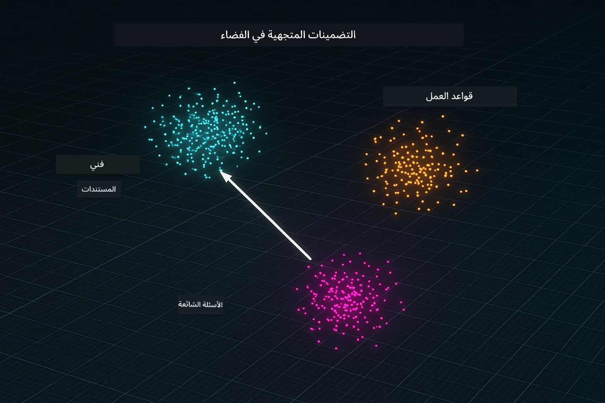
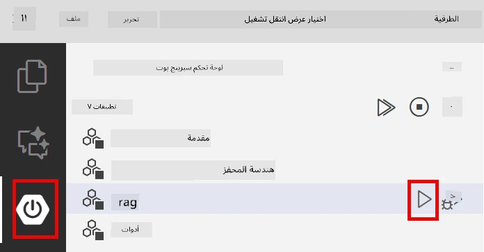
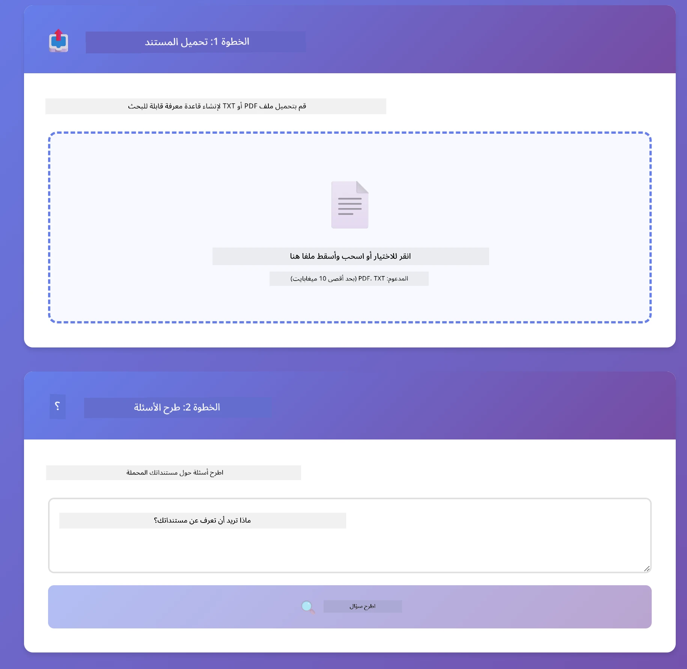
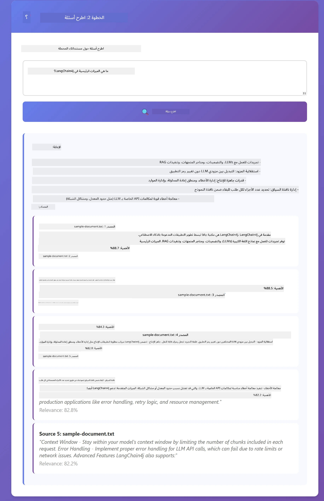

<!--
CO_OP_TRANSLATOR_METADATA:
{
  "original_hash": "81d087662fb3dd7b7124bce1a9c9ec86",
  "translation_date": "2026-01-05T21:37:20+00:00",
  "source_file": "03-rag/README.md",
  "language_code": "ar"
}
-->
# الوحدة 03: RAG (التوليد المدعوم بالاستخراج)

## جدول المحتويات

- [ما ستتعلمه](../../../03-rag)
- [المتطلبات الأساسية](../../../03-rag)
- [فهم RAG](../../../03-rag)
- [كيف يعمل](../../../03-rag)
  - [معالجة المستندات](../../../03-rag)
  - [إنشاء التضمينات](../../../03-rag)
  - [البحث الدلالي](../../../03-rag)
  - [توليد الإجابات](../../../03-rag)
- [تشغيل التطبيق](../../../03-rag)
- [استخدام التطبيق](../../../03-rag)
  - [تحميل مستند](../../../03-rag)
  - [طرح الأسئلة](../../../03-rag)
  - [التحقق من مراجع المصادر](../../../03-rag)
  - [التجربة مع الأسئلة](../../../03-rag)
- [المفاهيم الأساسية](../../../03-rag)
  - [استراتيجية التقسيم](../../../03-rag)
  - [درجات التشابه](../../../03-rag)
  - [التخزين داخل الذاكرة](../../../03-rag)
  - [إدارة نافذة السياق](../../../03-rag)
- [متى يكون RAG مهمًا](../../../03-rag)
- [الخطوات التالية](../../../03-rag)

## ما ستتعلمه

في الوحدات السابقة، تعلمت كيف تجري محادثات مع الذكاء الاصطناعي وكيف تبني المطالبات الخاصة بك بفعالية. لكن هناك قيد أساسي: نماذج اللغات تعرف فقط ما تعلمته أثناء التدريب. لا يمكنها الإجابة عن أسئلة حول سياسات شركتك، أو وثائق مشروعك، أو أي معلومات لم يتم تدريبها عليها.

يحل RAG (التوليد المدعوم بالاستخراج) هذه المشكلة. بدلًا من محاولة تعليم النموذج معلوماتك (وهو مكلف وغير عملي)، تمنحه القدرة على البحث عبر مستنداتك. عندما يسأل شخص ما سؤالًا، يجد النظام المعلومات ذات الصلة ويضمّنها في المطالبة. ثم يجيب النموذج بناءً على هذا السياق المسترجع.

فكر في RAG كأنه يمنح النموذج مكتبة مرجعية. عندما تطرح سؤالًا، يقوم النظام بـ:

1. **استعلام المستخدم** - أنت تطرح سؤالًا  
2. **التضمين** - يحول سؤالك إلى متجه  
3. **البحث المتجهي** - يجد أجزاء المستندات المشابهة  
4. **تجميع السياق** - يضيف الأجزاء ذات الصلة إلى المطالبة  
5. **الرد** - يولد نموذج اللغة الإجابة بناءً على السياق  

هذا يؤسس ردود النموذج على بياناتك الفعلية بدلاً من الاعتماد على معرفة تدريبه أو تخليق الأجوبة.


*سير عمل RAG - من استعلام المستخدم إلى البحث الدلالي ثم توليد الإجابة السياقية*

## المتطلبات الأساسية

- الانتهاء من الوحدة 01 (تم نشر موارد Azure OpenAI)  
- ملف `.env` في الدليل الجذري يحتوي على بيانات اعتماد Azure (تم إنشاؤه بواسطة `azd up` في الوحدة 01)  

> **ملاحظة:** إذا لم تكمل الوحدة 01 بعد، اتبع تعليمات النشر هناك أولاً.

## كيف يعمل

### معالجة المستندات

[DocumentService.java](../../../03-rag/src/main/java/com/example/langchain4j/rag/service/DocumentService.java)

عند تحميل مستند، يقوم النظام بتقسيمه إلى أجزاء صغيرة - قطع أصغر تناسب نافذة سياق النموذج. تتداخل هذه القطع قليلاً حتى لا تفقد السياق عند الحدود.

```java
Document document = FileSystemDocumentLoader.loadDocument("sample-document.txt");

DocumentSplitter splitter = DocumentSplitters
    .recursive(300, 30, new OpenAiTokenizer());

List<TextSegment> segments = splitter.split(document);
```

> **🤖 جرّب مع [GitHub Copilot](https://github.com/features/copilot) Chat:** افتح [`DocumentService.java`](../../../03-rag/src/main/java/com/example/langchain4j/rag/service/DocumentService.java) واسأل:
> - "كيف يقسم LangChain4j المستندات إلى قطع ولماذا التداخل مهم؟"
> - "ما هو حجم القطعة الأمثل لأنواع المستندات المختلفة ولماذا؟"
> - "كيف أتعامل مع المستندات بلغات متعددة أو بتنسيق خاص؟"

### إنشاء التضمينات

[LangChainRagConfig.java](../../../03-rag/src/main/java/com/example/langchain4j/rag/config/LangChainRagConfig.java)

يتم تحويل كل قطعة إلى تمثيل عددي يُسمى تضمينًا - وهو بصمة رياضية تلتقط معنى النص. يسفر النص المماثل عن تضمينات متشابهة.

```java
@Bean
public EmbeddingModel embeddingModel() {
    return OpenAiOfficialEmbeddingModel.builder()
        .baseUrl(azureOpenAiEndpoint)
        .apiKey(azureOpenAiKey)
        .modelName(azureEmbeddingDeploymentName)
        .build();
}

EmbeddingStore<TextSegment> embeddingStore = 
    new InMemoryEmbeddingStore<>();
```



*المستندات ممثلة كمتجهات في فضاء التضمين - تتجمع المحتويات المتشابهة معًا*

### البحث الدلالي

[RagService.java](../../../03-rag/src/main/java/com/example/langchain4j/rag/service/RagService.java)

عندما تطرح سؤالًا، يتحول سؤالك أيضًا إلى تضمين. يقارن النظام تضمين سؤالك مع تضمينات جميع أجزاء المستندات. يجد القطع التي تحمل المعاني الأكثر تشابهًا - ليس فقط الكلمات المفتاحية المتطابقة، بل التشابه الدلالي الفعلي.

```java
Embedding queryEmbedding = embeddingModel.embed(question).content();

List<EmbeddingMatch<TextSegment>> matches = 
    embeddingStore.findRelevant(queryEmbedding, 5, 0.7);

for (EmbeddingMatch<TextSegment> match : matches) {
    String relevantText = match.embedded().text();
    double score = match.score();
}
```

> **🤖 جرّب مع [GitHub Copilot](https://github.com/features/copilot) Chat:** افتح [`RagService.java`](../../../03-rag/src/main/java/com/example/langchain4j/rag/service/RagService.java) واسأل:
> - "كيف يعمل بحث التشابه باستخدام التضمينات وما الذي يحدد الدرجة؟"
> - "ما هو عتبة التشابه التي يجب أن أستخدمها وكيف تؤثر على النتائج؟"
> - "كيف أتعامل مع الحالات التي لا يتم فيها العثور على مستندات ذات صلة؟"

### توليد الإجابات

[RagService.java](../../../03-rag/src/main/java/com/example/langchain4j/rag/service/RagService.java)

يتم تضمين القطع الأكثر صلة في المطالبة المقدمة للنموذج. يقرأ النموذج تلك القطع المحددة ويجيب على سؤالك بناءً على تلك المعلومات. هذا يمنع التخيل - إذ لا يمكن للنموذج الإجابة إلا مما هو أمامه.

## تشغيل التطبيق

**تحقق من النشر:**

تأكد من وجود ملف `.env` في الدليل الجذري يحتوي على بيانات اعتماد Azure (تم إنشاؤه أثناء الوحدة 01):  
```bash
cat ../.env  # يجب أن يعرض AZURE_OPENAI_ENDPOINT و API_KEY و DEPLOYMENT
```
  
**تشغيل التطبيق:**

> **ملاحظة:** إذا كنت قد شغلت جميع التطبيقات باستخدام `./start-all.sh` من الوحدة 01، فهذه الوحدة تعمل بالفعل على المنفذ 8081. يمكنك تخطي أوامر البدء أدناه والذهاب مباشرة إلى http://localhost:8081.

**الخيار 1: استخدام لوحة تحكم Spring Boot (موصى به لمستخدمي VS Code)**

يحتوي حاوية التطوير على ملحق لوحة تحكم Spring Boot، الذي يوفر واجهة بصرية لإدارة جميع تطبيقات Spring Boot. يمكنك العثور عليه في شريط النشاط على الجانب الأيسر من VS Code (ابحث عن أيقونة Spring Boot).

من لوحة تحكم Spring Boot، يمكنك:
- رؤية جميع تطبيقات Spring Boot المتاحة في مساحة العمل  
- بدء/إيقاف التطبيقات بنقرة واحدة  
- عرض سجلات التطبيق في الوقت الحقيقي  
- مراقبة حالة التطبيق  

فقط اضغط زر التشغيل بجانب "rag" لبدء هذه الوحدة، أو ابدأ كل الوحدات مرة واحدة.



**الخيار 2: استخدام سكربتات الشل**

ابدأ جميع تطبيقات الويب (الوحدات 01-04):

**Bash:**  
```bash
cd ..  # من الدليل الجذر
./start-all.sh
```
  
**PowerShell:**  
```powershell
cd ..  # من الدليل الجذر
.\start-all.ps1
```
  
أو ابدأ هذه الوحدة فقط:

**Bash:**  
```bash
cd 03-rag
./start.sh
```
  
**PowerShell:**  
```powershell
cd 03-rag
.\start.ps1
```
  
كلا السكربتين يقومان بتحميل متغيرات البيئة تلقائيًا من ملف `.env` الجذري وسوف يبنيان ملفات JAR إذا لم تكن موجودة.

> **ملاحظة:** إذا فضلت بناء جميع الوحدات يدويًا قبل التشغيل:  
>  
> **Bash:**  
> ```bash
> cd ..  # Go to root directory
> mvn clean package -DskipTests
> ```
>  
> **PowerShell:**  
> ```powershell
> cd ..  # Go to root directory
> mvn clean package -DskipTests
> ```
  
افتح http://localhost:8081 في متصفحك.

**لإيقاف التطبيق:**

**Bash:**  
```bash
./stop.sh  # هذا الوحدة فقط
# أو
cd .. && ./stop-all.sh  # جميع الوحدات
```
  
**PowerShell:**  
```powershell
.\stop.ps1  # هذا الوحدة فقط
# أو
cd ..; .\stop-all.ps1  # كل الوحدات
```
  
## استخدام التطبيق

يوفر التطبيق واجهة ويب لتحميل المستندات وطرح الأسئلة.

<a href="images/rag-homepage.png"></a>

*واجهة تطبيق RAG - قم بتحميل المستندات واطرح الأسئلة*

### تحميل مستند

ابدأ بتحميل مستند - ملفات TXT هي الأنسب للاختبار. يوجد ملف `sample-document.txt` في هذا الدليل يحتوي على معلومات حول ميزات LangChain4j، وتنفيذ RAG، وأفضل الممارسات - مثالي لاختبار النظام.

يقوم النظام بمعالجة المستند الخاص بك، ويقسّمه إلى قطع، وينشئ تضمينات لكل قطعة. يحدث هذا تلقائيًا عند التحميل.

### طرح الأسئلة

الآن اطرح أسئلة محددة حول محتوى المستند. جرب شيئًا واقعيًا مذكورًا بوضوح في المستند. يبحث النظام عن الأجزاء ذات الصلة، يدرجها في المطالبة، وينشئ إجابة.

### التحقق من مراجع المصادر

لاحظ أن كل إجابة تتضمن مراجع للمصادر مع درجات التشابه. تظهر هذه الدرجات (من 0 إلى 1) مدى ارتباط كل قطعة بسؤالك. الدرجات الأعلى تعني تطابقًا أفضل. يتيح لك ذلك التحقق من الإجابة مقابل المادة المصدرية.

<a href="images/rag-query-results.png"></a>

*نتائج الاستعلام تظهر الإجابة مع مراجع المصدر ودرجات الصلة*

### التجربة مع الأسئلة

جرّب أنواعًا مختلفة من الأسئلة:  
- حقائق محددة: "ما هو الموضوع الرئيسي؟"  
- مقارنات: "ما الفرق بين X و Y؟"  
- ملخصات: "لخص النقاط الرئيسية حول Z"  

راقب كيف تتغير درجات الصلة بناءً على مدى تطابق سؤالك مع محتوى المستند.

## المفاهيم الأساسية

### استراتيجية التقسيم

تُقسم المستندات إلى قطع من 300 توكن مع تداخل يبلغ 30 توكن. هذا التوازن يضمن أن كل قطعة تحتوي على سياق كافٍ لتكون ذات معنى مع إبقائها صغيرة بما يكفي لتضمين عدة قطع في المطالبة.

### درجات التشابه

تتراوح الدرجات من 0 إلى 1:  
- 0.7-1.0: ذات صلة عالية، تطابق دقيق  
- 0.5-0.7: ذات صلة، سياق جيد  
- أقل من 0.5: تم تصفيتها، غير متشابهة كثيرًا  

يسترجع النظام فقط القطع التي تتجاوز الحد الأدنى لضمان الجودة.

### التخزين داخل الذاكرة

تستخدم هذه الوحدة التخزين داخل الذاكرة للبساطة. عند إعادة تشغيل التطبيق، تفقد المستندات التي تم تحميلها. تستخدم أنظمة الإنتاج قواعد بيانات متجهة دائمة مثل Qdrant أو Azure AI Search.

### إدارة نافذة السياق

لكل نموذج حد أقصى لنافذة السياق. لا يمكنك تضمين كل قطع مستند كبير. يسترجع النظام أفضل N قطع ذات صلة (افتراضيًا 5) ليبقى ضمن الحدود مع توفير سياق كافٍ لإجابات دقيقة.

## متى يكون RAG مهمًا

**استخدم RAG عندما:**  
- الإجابة عن أسئلة حول مستندات خاصة  
- تتغير المعلومات بشكل متكرر (السياسات، الأسعار، المواصفات)  
- الدقة تتطلب نسبة المصدر  
- المحتوى كبير جدًا لاحتوائه في مطالبة واحدة  
- تحتاج إلى ردود يمكن التحقق منها وموثوقة  

**لا تستخدم RAG عندما:**  
- الأسئلة تتطلب معرفة عامة يمتلكها النموذج بالفعل  
- تحتاج إلى بيانات في الوقت الحقيقي (يعمل RAG على المستندات المحملة)  
- المحتوى صغير بما يكفي لتضمينه مباشرة في المطالبات  

## الخطوات التالية

**الوحدة التالية:** [04-tools - الوكلاء الذكيون مع الأدوات](../04-tools/README.md)

---

**التنقل:** [← السابق: الوحدة 02 - هندسة المطالبات](../02-prompt-engineering/README.md) | [العودة إلى الرئيسي](../README.md) | [التالي: الوحدة 04 - الأدوات →](../04-tools/README.md)

---

<!-- CO-OP TRANSLATOR DISCLAIMER START -->
**إخلاء المسؤولية**:
تمت ترجمة هذا المستند باستخدام خدمة الترجمة الآلية [Co-op Translator](https://github.com/Azure/co-op-translator). بينما نسعى لتحقيق الدقة، يرجى العلم أن الترجمات الآلية قد تحتوي على أخطاء أو عدم دقة. يجب اعتبار الوثيقة الأصلية بلغتها الأصلية المصدر المعتمد. للمعلومات الحساسة أو الهامة، يوصى بالاستعانة بالترجمة المهنية البشرية. نحن غير مسؤولين عن أي سوء فهم أو تفسيرات خاطئة تنشأ عن استخدام هذه الترجمة.
<!-- CO-OP TRANSLATOR DISCLAIMER END -->