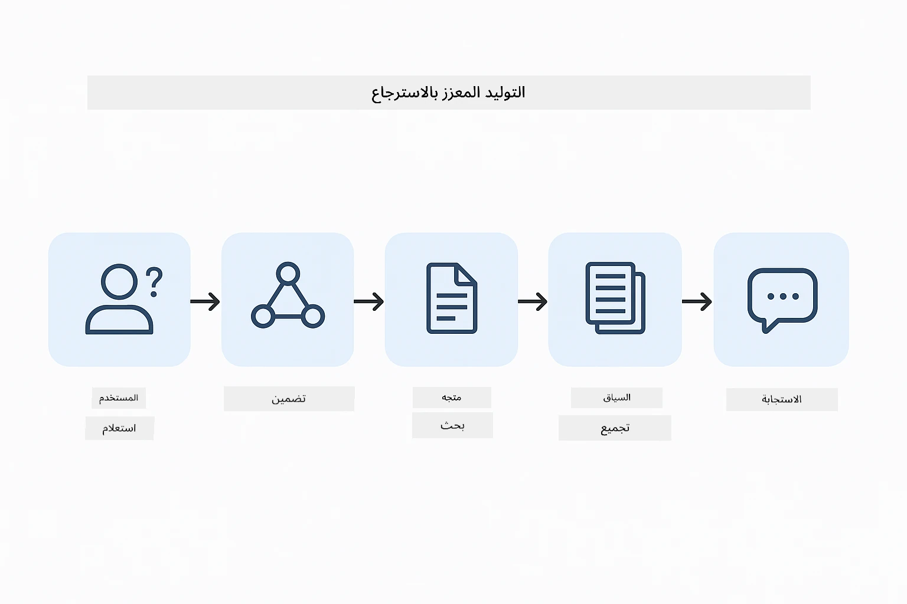
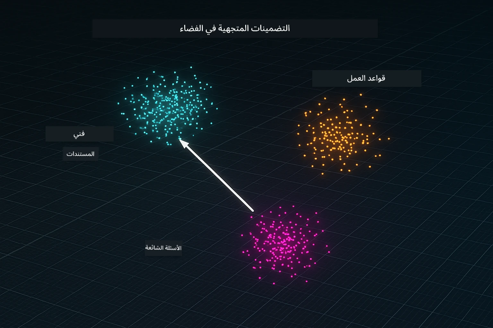
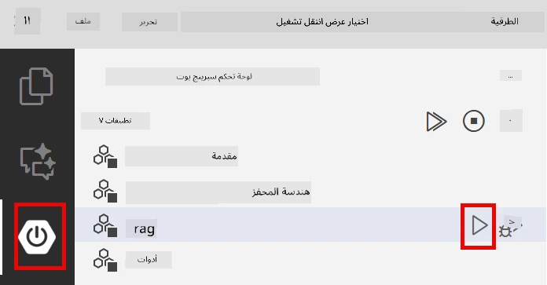
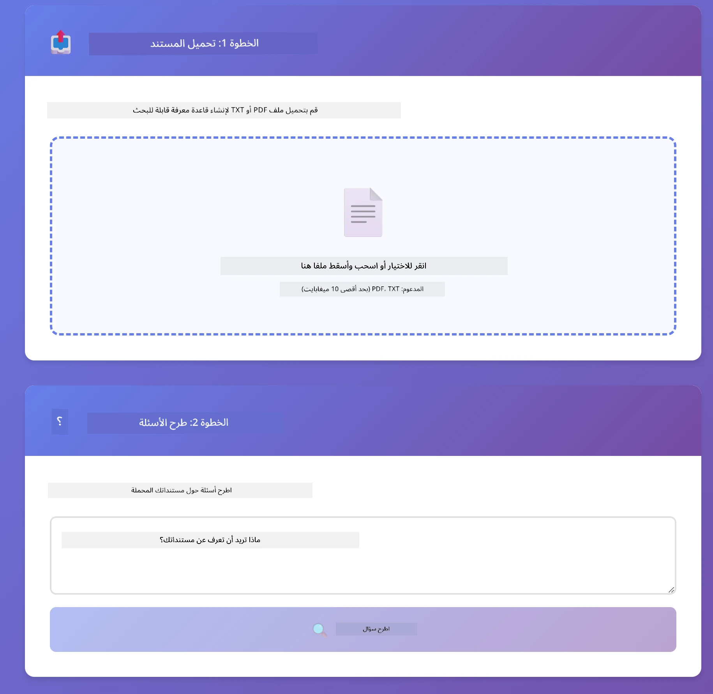
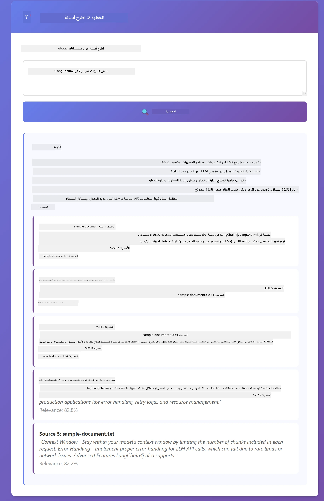

# الوحدة 03: RAG (التوليد المعزز بالاسترجاع)

## جدول المحتويات

- [عرض الفيديو](#عرض-الفيديو)
- [ما ستتعلمه](#ما-ستتعلمه)
- [المتطلبات المسبقة](#المتطلبات-المسبقة)
- [فهم RAG](#فهم-rag)
  - [أي نهج RAG يستخدم هذا الدرس؟](#أي-نهج-rag-يستخدم-هذا-الدرس؟)
- [كيف يعمل](#كيف-يعمل)
  - [معالجة المستندات](#معالجة-المستندات)
  - [إنشاء التمثيلات](#إنشاء-التمثيلات)
  - [البحث الدلالي](#البحث-الدلالي)
  - [توليد الإجابة](#توليد-الإجابة)
- [تشغيل التطبيق](#تشغيل-التطبيق)
- [استخدام التطبيق](#استخدام-التطبيق)
  - [تحميل مستند](#رفع-مستند)
  - [طرح الأسئلة](#طرح-الأسئلة)
  - [فحص مراجع المصادر](#تحقق-من-مراجع-المصادر)
  - [التجربة مع الأسئلة](#جرب-بأسئلة-متنوعة)
- [المفاهيم الرئيسية](#المفاهيم-الرئيسية)
  - [استراتيجية التقسيم](#استراتيجية-التقسيم-إلى-أجزاء)
  - [درجات التشابه](#درجات-التشابه)
  - [التخزين في الذاكرة](#التخزين-في-الذاكرة)
  - [إدارة نافذة السياق](#إدارة-نافذة-السياق)
- [متى تهم RAG](#متى-يكون-rag-مهمًا)
- [الخطوات التالية](#الخطوات-التالية)

## عرض الفيديو

شاهد هذه الجلسة المباشرة التي تشرح كيفية البدء مع هذه الوحدة:

<a href="https://www.youtube.com/watch?v=_olq75ZH_eY"></a>

## ما ستتعلمه

في الوحدات السابقة، تعلمت كيفية إجراء محادثات مع الذكاء الاصطناعي وتنظيم مطالباتك بشكل فعّال. لكن هناك قيد أساسي: نماذج اللغة تعرف فقط ما تعلمته أثناء التدريب. لا يمكنها الإجابة عن أسئلة حول سياسات شركتك، أو توثيق مشروعك، أو أي معلومات لم يتم تدريبها عليها.

RAG (التوليد المعزز بالاسترجاع) يحل هذه المشكلة. بدلًا من محاولة تعليم النموذج معلوماتك (وهو أمر مكلف وغير عملي)، تمنحه القدرة على البحث عبر مستنداتك. عندما يسأل شخص ما سؤالاً، يجد النظام المعلومات ذات الصلة ويُدرجها في المطالبة. ثم يجيب النموذج بناءً على ذلك السياق المسترجع.

فكر في RAG كأنه يعطي النموذج مكتبة مراجع. عندما تطرح سؤالاً، يقوم النظام بـ:

1. **استعلام المستخدم** - أنت تطرح سؤالاً
2. **التمثيل** - يحول سؤالك إلى متجه رقمي
3. **بحث المتجهات** - يعثر على مقاطع مستندات مشابهة
4. **تجميع السياق** - يضيف المقاطع ذات الصلة إلى المطالبة
5. **الرد** - يقوم نموذج اللغة بتوليد إجابة بناءً على السياق

هذا يجعل ردود النموذج مستندة إلى بياناتك الفعلية بدلاً من الاعتماد على معرفته التدريبية أو اختلاق الإجابات.

## المتطلبات المسبقة

- إتمام [الوحدة 01 - المقدمة](../01-introduction/README.md) (نشر موارد Azure OpenAI، بما في ذلك نموذج التمثيل `text-embedding-3-small`)
- وجود ملف `.env` في الدليل الجذري مع بيانات اعتماد Azure (تم إنشاؤه بواسطة `azd up` في الوحدة 01)

> **ملاحظة:** إذا لم تكمل الوحدة 01، اتبع تعليمات النشر هناك أولاً. تقوم أمر `azd up` بنشر كل من نموذج الدردشة GPT ونموذج التمثيل المستخدم في هذه الوحدة.

## فهم RAG

الرسم التوضيحي أدناه يوضح المفهوم الأساسي: بدلًا من الاعتماد فقط على بيانات تدريب النموذج، يمنحه RAG مكتبة مراجعة من مستنداتك ليطلع عليها قبل توليد كل إجابة.


*هذا الرسم يوضح الفرق بين نموذج لغة كبير عادي (يخمن بناءً على بيانات التدريب) ونموذج معزز بـ RAG (يستشير مستنداتك أولاً).*

إليك كيف تتصل الأجزاء من البداية للنهاية. سؤال المستخدم يمر عبر أربع مراحل — التمثيل، بحث المتجه، تجميع السياق، وتوليد الإجابة — كل مرحلة تبني على التي قبلها:



*هذا الرسم يوضح خط أنابيب RAG من البداية إلى النهاية — سؤال المستخدم يمر عبر التمثيل، بحث المتجه، تجميع السياق، وتوليد الإجابة.*

البقية من هذه الوحدة تشرح كل مرحلة بالتفصيل، مع كود يمكنك تشغيله وتعديله.

### أي نهج RAG يستخدم هذا الدرس؟

يقدم LangChain4j ثلاث طرق لتنفيذ RAG، كل منها بمستوى مختلف من التجريد. الرسم أدناه يقارنها جنبًا إلى جنب:


*هذا الرسم يقارن بين ثلاثة نهج RAG في LangChain4j — سهولة، أصلي، ومتقدم — موضحًا مكونات كل منهما ومتى تستخدم كل واحد.*

| النهج | ماذا يفعل | الموازنة |
|---|---|---|
| **RAG السهل** | يربط كل شيء تلقائيًا عبر `AiServices` و `ContentRetriever`. تقوم بالتعليق على واجهة، تربط مسترجعًا، وLangChain4j يتولى التمثيل، البحث، وتجميع المطالبات في الخلفية. | كود قليل، لكن لا ترى ما يحدث في كل خطوة. |
| **RAG الأصلي** | تقوم بنداء نموذج التمثيل، والبحث في المخزن، وبناء المطالبة، وتوليد الإجابة بنفسك — خطوة واحدة صريحة في كل مرة. | كود أكثر، لكن كل مرحلة مرئية وقابلة للتعديل. |
| **RAG المتقدم** | يستخدم إطار `RetrievalAugmentor` مع محولات الاستعلام، الموجهات، معيد الترتيب، وحقن المحتوى، مناسب لأنظمة الإنتاج. | أكبر قدر من المرونة، لكن مع تعقيد أعلى بكثير. |

**هذا الدرس يستخدم النهج الأصلي.** كل خطوة في خط أنابيب RAG — تمثيل الاستعلام، البحث في متجر المتجهات، تجميع السياق، وتوليد الإجابة — مكتوبة بشكل صريح في [`RagService.java`](../../../03-rag/src/main/java/com/example/langchain4j/rag/service/RagService.java). هذا مقصود: كمورد تعليمي، من المهم أكثر أن ترى وتفهم كل مرحلة بدلاً من تقليل الكود. بمجرد أن تشعر بالراحة مع كيفية توصيل الأجزاء، يمكنك التدرج إلى RAG السهل لنماذج أولية سريعة أو RAG المتقدم لأنظمة الإنتاج.

> **💡 مهتم بـ RAG السهل؟** يقدم LangChain4j أيضًا طريقة *RAG سهلة* حيث يتولى `AiServices` و `ContentRetriever` تمثيل، بحث، وتجميع المطالبات تلقائيًا. هذه الوحدة تأخذ الطريق الأكثر صراحة — تكشف ذلك الخط الأنبوبي لتتمكن من رؤية والتحكم في كل مرحلة بنفسك.

الرسم أدناه يوضح خط أنابيب RAG السهل. لاحظ كيف يخفي `AiServices` و `EmbeddingStoreContentRetriever` كل التعقيد — تقوم بتحميل مستند، توصيل مسترجع، وتحصل على إجابات. النهج الأصلي في هذه الوحدة يفتح كل تلك الخطوات الخفية:


*هذا الرسم يوضح خط أنابيب RAG السهل. قارن هذا مع النهج الأصلي المستخدم في هذه الوحدة: RAG السهل يخفي التمثيل، الاسترجاع، وتجميع المطالبات خلف `AiServices` و `ContentRetriever` — تقوم بتحميل مستند، توصيل مسترجع، وتحصل على إجابات. النهج الأصلي في هذه الوحدة يفتح هذا الخط الأنبوبي بحيث تستدعي كل مرحلة (التمثيل، البحث، تجميع السياق، التوليد) بنفسك، مما يمنحك رؤية وتحكم كاملين.*

## كيف يعمل

خط أنابيب RAG في هذه الوحدة يتكون من أربع مراحل تعمل بالتتابع في كل مرة يطرح فيها المستخدم سؤالاً. أولاً، يتم **تحليل المستند وتحويله إلى مقاطع** تُدار بفعالية. ثم تُحوّل هذه المقاطع إلى **تمثيلات متجهة** وتُخزن لتتم مقارنة المتجهات رياضيًا. عند وصول الاستعلام، يقوم النظام بـ **بحث دلالي** لإيجاد المقاطع الأكثر صلة، وأخيرًا يمررها كسياق إلى نموذج اللغة لتوليد **الإجابة**. الأقسام أدناه تشرح كل مرحلة مع الكود الفعلي والرسوم التوضيحية. لننظر في الخطوة الأولى.

### معالجة المستندات

[DocumentService.java](../../../03-rag/src/main/java/com/example/langchain4j/rag/service/DocumentService.java)

عند تحميل مستند، يقوم النظام بتحليله (PDF أو نص عادي)، يضيف بيانات وصفية مثل اسم الملف، ثم يقسمه إلى مقاطع — قطع أصغر تناسب نافذة السياق للنموذج. تتداخل هذه المقاطع قليلاً بحيث لا تفقد السياق عند الحدود.

```java
// تحليل الملف المحمل وتغليفه في مستند LangChain4j
Document document = Document.from(content, metadata);

// تقسيم إلى أجزاء مكونة من 300 رمز مع تداخل 30 رمز
DocumentSplitter splitter = DocumentSplitters
    .recursive(300, 30);

List<TextSegment> segments = splitter.split(document);
```

الرسم أدناه يوضح كيف يعمل هذا بصريًا. لاحظ كيف يشارك كل مقطع بعض الرموز المميزة مع جيرانه — تداخل 30 رمزًا يضمن عدم فقدان سياق مهم عند الحدود:


*هذا الرسم يوضح تقسيم مستند إلى مقاطع بحدود 300 رمز مميز مع تداخل 30 رمز مميز، مما يحافظ على السياق عند حدود المقاطع.*

> **🤖 جرب مع دردشة [GitHub Copilot](https://github.com/features/copilot):** افتح [`DocumentService.java`](../../../03-rag/src/main/java/com/example/langchain4j/rag/service/DocumentService.java) واسأل:
> - "كيف يقسم LangChain4j المستندات إلى مقاطع ولماذا التداخل مهم؟"
> - "ما هو الحجم الأمثل للمقطع لأنواع الوثائق المختلفة ولماذا؟"
> - "كيف أتعامل مع المستندات بلغات متعددة أو ذات تنسيق خاص؟"

### إنشاء التمثيلات

[LangChainRagConfig.java](../../../03-rag/src/main/java/com/example/langchain4j/rag/config/LangChainRagConfig.java)

يتم تحويل كل مقطع إلى تمثيل رقمي يُسمى التمثيل — وهو محول من المعنى إلى أرقام. نموذج التمثيل ليس "ذكيًا" كما نموذج الدردشة؛ لا يمكنه اتباع التعليمات، أو الاستدلال، أو الإجابة على الأسئلة. ما يمكنه فعله هو تحويل النص إلى فضاء رياضي حيث تتجمع المعاني المتشابهة — مثل "سيارة" بجانب "عربة"، "سياسة استرداد" بجانب "إرجاع أموالي". فكر في نموذج الدردشة كشخص يمكن التحدث إليه؛ ونموذج التمثيل كنظام أرشفة قوي جدًا.

الرسم أدناه يصور هذا المفهوم — يدخل النص، تخرج متجهات رقمية، والمعاني المشابهة تنتج متجهات قريبة:


*هذا الرسم يوضح كيف يحول نموذج التمثيل النص إلى متجهات رقمية، بحيث توضع المعاني المشابهة — مثل "سيارة" و"عربة" — متقاربة في فضاء المتجهات.*

```java
@Bean
public EmbeddingModel embeddingModel() {
    return OpenAiOfficialEmbeddingModel.builder()
        .baseUrl(azureOpenAiEndpoint)
        .apiKey(azureOpenAiKey)
        .modelName(azureEmbeddingDeploymentName)
        .build();
}

EmbeddingStore<TextSegment> embeddingStore = 
    new InMemoryEmbeddingStore<>();
```

الرسم البياني للطبقات أدناه يُظهر تدفقين منفصلين في خط أنابيب RAG وفئات LangChain4j التي تنفذها. **تدفق الإدخال** (يعمل مرة عند التحميل) يقسم المستند، يمثل المقاطع، ويخزنها عبر `.addAll()`. **تدفق الاستعلام** (يعمل في كل مرة يطرح المستخدم سؤالًا) يمثل السؤال، يبحث في المخزن عبر `.search()`, ويمرر السياق المطابق لنموذج الدردشة. يلتقي التدفقان عند واجهة `EmbeddingStore<TextSegment>` المشتركة:


*هذا الرسم يوضح التدفقين في خط أنابيب RAG — الإدخال والاستعلام — وكيف يتصلان عبر EmbeddingStore المشتركة.*

بعد تخزين التمثيلات، يتجمع المحتوى المشابه تلقائيًا في فضاء المتجهات. التصور أدناه يوضح كيف تنتهي الوثائق ذات المواضيع المتصلة كنقاط قريبة، وهذا ما يجعل البحث الدلالي ممكنًا:



*هذا التصور يوضح كيف تتجمع الوثائق ذات صلة في فضاء متجه ثلاثي الأبعاد، مع تكتلات لمواضيع مثل الوثائق التقنية، قواعد الأعمال، والأسئلة الشائعة.*

عند البحث، يتبع النظام أربع خطوات: تمثيل الوثائق مرة واحدة، تمثيل الاستعلام في كل بحث، مقارنة متجه الاستعلام مع كل المتجهات المخزنة باستخدام تشابه جيب التمام، وإرجاع أفضل المقاطع ذات الدرجات العليا K. الرسم أدناه يشرح كل خطوة وفئات LangChain4j المرتبطة:


*هذا الرسم يوضح عملية البحث بالتمثيل ذات الأربع خطوات: تمثيل الوثائق، تمثيل الاستعلام، مقارنة المتجهات بتشابه جيب التمام، وإرجاع أفضل النتائج K.*

### البحث الدلالي

[RagService.java](../../../03-rag/src/main/java/com/example/langchain4j/rag/service/RagService.java)

عندما تطرح سؤالًا، يتحول سؤالك أيضًا إلى تمثيل. يقارن النظام تمثيل سؤالك مع تمثيلات كل مقاطع المستندات. يعثر على المقاطع التي تحمل معاني مشابهة - ليس مجرد تطابق كلمات مفتاحية، بل تشابه دلالي حقيقي.

```java
Embedding queryEmbedding = embeddingModel.embed(question).content();

EmbeddingSearchRequest searchRequest = EmbeddingSearchRequest.builder()
    .queryEmbedding(queryEmbedding)
    .maxResults(5)
    .minScore(0.5)
    .build();

EmbeddingSearchResult<TextSegment> searchResult = embeddingStore.search(searchRequest);
List<EmbeddingMatch<TextSegment>> matches = searchResult.matches();

for (EmbeddingMatch<TextSegment> match : matches) {
    String relevantText = match.embedded().text();
    double score = match.score();
}
```

الرسم أدناه يقارن البحث الدلالي بالبحث بالكلمة المفتاحية التقليدي. بحث بالكلمة المفتاحية عن "مركبة" يفقد مقطعًا عن "سيارات وشاحنات"، لكن البحث الدلالي يفهم أنهما تعنيان الشيء نفسه ويُرجعها كنتيجة ذات درجة عالية:


*هذا الرسم يقارن البحث المعتمد على الكلمات المفتاحية مع البحث الدلالي، مبيّنًا كيف يسترجع البحث الدلالي محتوى ذا علاقة مفهومية حتى عندما تختلف الكلمات الدقيقة.*

تحت الغطاء، يُقاس التشابه باستخدام تشابه جيب التمام — أي: "هل هذان السهمان يشيران لنفس الاتجاه؟" يمكن أن تستخدم مقطعين كلمات مختلفة تمامًا، ولكن إن كانا يحملان نفس المعنى تكون متجهاتهما متجهات متقاربة وتأتي بدرجة قريبة من 1.0:


*يوضح هذا المخطط تشابه جيب التمام كزاوية بين متجهات التضمين — المتجهات الأكثر تطابقًا تحصل على درجة أقرب إلى 1.0، مما يشير إلى تشابه دلالي أعلى.*

> **🤖 جرّب مع [GitHub Copilot](https://github.com/features/copilot) Chat:** افتح [`RagService.java`](../../../03-rag/src/main/java/com/example/langchain4j/rag/service/RagService.java) واسأل:
> - "كيف يعمل البحث بالتشابه مع التضمينات وما الذي يحدد الدرجة؟"
> - "ما هو الحد الأدنى لتشابه يجب استخدامه وكيف يؤثر على النتائج؟"
> - "كيف أتعامل مع الحالات التي لا يتم العثور فيها على مستندات ذات صلة؟"

### توليد الإجابة

[RagService.java](../../../03-rag/src/main/java/com/example/langchain4j/rag/service/RagService.java)

يتم تجميع أكثر الأجزاء ذات الصلة في موجه منظم يتضمن تعليمات صريحة، والسياق المسترجع، وسؤال المستخدم. يقرأ النموذج تلك الأجزاء المحددة ويجيب بناءً على تلك المعلومات — يمكنه فقط استخدام ما هو أمامه، مما يمنع الهلوسة.

```java
String context = matches.stream()
    .map(match -> match.embedded().text())
    .collect(Collectors.joining("\n\n"));

String prompt = String.format("""
    Answer the question based on the following context.
    If the answer cannot be found in the context, say so.

    Context:
    %s

    Question: %s

    Answer:""", context, request.question());

String answer = chatModel.chat(prompt);
```

يُظهر المخطط أدناه هذا التجميع أثناء العمل — يتم حقن أعلى الأجزاء تقييمًا من خطوة البحث في قالب الموجه، ويولّد `OpenAiOfficialChatModel` إجابة مؤصلة:


*يُظهر هذا المخطط كيفية تجميع الأجزاء الأعلى تقييمًا في موجه منظم، مما يسمح للنموذج بتوليد إجابة مستندة إلى بياناتك.*

## تشغيل التطبيق

**تحقق من النشر:**

تأكد من وجود ملف `.env` في الدليل الجذري يحتوي على بيانات اعتماد Azure (تم إنشاؤه أثناء الوحدة 01). شغّل هذا من دليل الوحدة (`03-rag/`):

**بـاش:**
```bash
cat ../.env  # يجب أن يعرض AZURE_OPENAI_ENDPOINT و API_KEY و DEPLOYMENT
```

**PowerShell:**
```powershell
Get-Content ..\.env  # يجب أن يعرض AZURE_OPENAI_ENDPOINT، API_KEY، DEPLOYMENT
```

**ابدأ التطبيق:**

> **ملاحظة:** إذا كنت قد بدأت جميع التطبيقات باستخدام `./start-all.sh` من الدليل الجذري (كما هو موضح في الوحدة 01)، فهذه الوحدة تعمل بالفعل على المنفذ 8081. يمكنك تخطي أوامر البدء أدناه والذهاب مباشرة إلى http://localhost:8081.

**الخيار 1: استخدام لوحة تحكم Spring Boot (مُوصَى به لمستخدمي VS Code)**

تتضمن الحاوية التطويرية إضافة Spring Boot Dashboard، التي توفر واجهة بصرية لإدارة جميع تطبيقات Spring Boot. يمكنك العثور عليها في شريط النشاط على الجانب الأيسر من VS Code (ابحث عن أيقونة Spring Boot).

من لوحة تحكم Spring Boot، يمكنك:
- رؤية جميع تطبيقات Spring Boot المتاحة في مساحة العمل
- بدء/إيقاف التطبيقات بنقرة واحدة
- عرض سجلات التطبيق في الوقت الحقيقي
- مراقبة حالة التطبيق

فقط انقر على زر التشغيل بجانب "rag" لبدء هذه الوحدة، أو ابدأ جميع الوحدات دفعة واحدة.



*تُظهر هذه اللقطة شاشة لوحة تحكم Spring Boot في VS Code، حيث يمكنك بدء التطبيقات وإيقافها ومراقبتها بصريًا.*

**الخيار 2: استخدام سكربتات الشِل**

ابدأ جميع تطبيقات الويب (الوحدات 01-04):

**بـاش:**
```bash
cd ..  # من الدليل الجذري
./start-all.sh
```

**PowerShell:**
```powershell
cd ..  # من الدليل الجذر
.\start-all.ps1
```

أو ابدأ هذه الوحدة فقط:

**بـاش:**
```bash
cd 03-rag
./start.sh
```

**PowerShell:**
```powershell
cd 03-rag
.\start.ps1
```

يقوم كلا السكربتين بتحميل متغيرات البيئة تلقائيًا من ملف `.env` الجذري وسيبني ملفات JAR إذا لم تكن موجودة.

> **ملاحظة:** إذا كنت تفضل بناء جميع الوحدات يدويًا قبل البدء:
>
> **بـاش:**
> ```bash
> cd ..  # Go to root directory
> mvn clean package -DskipTests
> ```
>
> **PowerShell:**
> ```powershell
> cd ..  # Go to root directory
> mvn clean package -DskipTests
> ```

افتح http://localhost:8081 في متصفحك.

**لإيقاف التشغيل:**

**بـاش:**
```bash
./stop.sh  # هذا الوحدة فقط
# أو
cd .. && ./stop-all.sh  # كل الوحدات
```

**PowerShell:**
```powershell
.\stop.ps1  # هذا الموديول فقط
# أو
cd ..; .\stop-all.ps1  # جميع الموديولات
```

## استخدام التطبيق

يقدم التطبيق واجهة ويب لتحميل المستندات وطرح الأسئلة.

<a href="images/rag-homepage.png"></a>

*تُظهر هذه اللقطة شاشة واجهة تطبيق RAG حيث تقوم بتحميل المستندات وطرح الأسئلة.*

### رفع مستند

ابدأ برفع مستند — ملفات TXT هي الأفضل للاختبار. تم توفير `sample-document.txt` في هذا الدليل يحتوي على معلومات حول ميزات LangChain4j، وتنفيذ RAG، وأفضل الممارسات — مثالي لاختبار النظام.

يقوم النظام بمعالجة مستندك، وتقسيمه إلى أجزاء، وإنشاء تضمينات لكل جزء. يتم ذلك تلقائيًا عند الرفع.

### طرح الأسئلة

الآن اطرح أسئلة محددة حول محتوى المستند. جرب شيئًا واقعيًا مذكورًا بوضوح في المستند. يبحث النظام عن الأجزاء ذات الصلة، ويضمّنها في الموجه، ثم يولد إجابة.

### تحقق من مراجع المصادر

لاحظ أن كل إجابة تتضمن مراجع مصادر مع درجات التشابه. تظهر هذه الدرجات (من 0 إلى 1) مدى صلة كل جزء بسؤالك. الدرجات الأعلى تعني تطابقًا أفضل. هذا يتيح لك التحقق من الإجابة مقابل المواد المصدرية.

<a href="images/rag-query-results.png"></a>

*تُظهر هذه اللقطة شاشة نتائج الاستعلام مع الإجابة المولدة، مراجع المصادر، ودرجات الصلة لكل جزء مسترجَع.*

### جرب بأسئلة متنوعة

جرب أنواعًا مختلفة من الأسئلة:
- حقائق محددة: "ما الموضوع الرئيسي؟"
- مقارنات: "ما الفرق بين X و Y ؟"
- ملخصات: "لخص النقاط الرئيسية عن Z"

شاهد كيف تتغير درجات الصلة بناءً على مدى تطابق سؤالك مع محتوى المستند.

## المفاهيم الرئيسية

### استراتيجية التقسيم إلى أجزاء

يتم تقسيم المستندات إلى أجزاء مكونة من 300 رمز مع تداخل 30 رمزًا. هذا التوازن يضمن أن كل جزء لديه سياق كاف ليكون ذا معنى مع بقائه صغيرًا بما يكفي لتضمين عدة أجزاء في الموجه.

### درجات التشابه

كل جزء مسترجع يأتي مع درجة تشابه بين 0 و 1 تشير إلى مدى قرب تطابقه مع سؤال المستخدم. يوضح المخطط أدناه نطاقات الدرجات وكيف يستخدمها النظام لتصفية النتائج:


*يُظهر هذا المخطط نطاقات الدرجات من 0 إلى 1، مع حد أدنى 0.5 لتصفية الأجزاء غير ذات الصلة.*

تتراوح الدرجات من 0 إلى 1:
- 0.7-1.0: ذات صلة عالية، تطابق دقيق
- 0.5-0.7: ذات صلة، سياق جيد
- أقل من 0.5: تم تصفيتها، غير متشابهة كفاية

يسترجع النظام فقط الأجزاء التي تتجاوز الحد الأدنى لضمان جودة.

تعمل التضمينات جيدًا عندما تتجمع المعاني بوضوح، لكنها تحتوي على نقاط عمياء. يُظهر المخطط أدناه أوضاع الفشل الشائعة — الأجزاء الكبيرة جدًا تنتج متجهات غير واضحة، الأجزاء الصغيرة جدًا تفتقر للسياق، المصطلحات المبهمة تشير إلى عدة تجمعات، والبحث بالمطابقة الحرفية (المعرفات، أرقام الأجزاء) لا يعمل مع التضمينات على الإطلاق:


*يُظهر هذا المخطط أوضاع الفشل الشائعة في التضمين: أجزاء كبيرة جدًا، أجزاء صغيرة جدًا، مصطلحات غامضة تشير إلى عدة تجمعات، وبحث المطابقة الحرفية مثل المعرفات.*

### التخزين في الذاكرة

يستخدم هذا الموديول التخزين في الذاكرة للبساطة. عند إعادة تشغيل التطبيق، تُفقد المستندات المحملة. تستخدم أنظمة الإنتاج قواعد بيانات متجهات دائمة مثل Qdrant أو Azure AI Search.

### إدارة نافذة السياق

لكل نموذج حد أقصى لنافذة السياق. لا يمكنك تضمين كل جزء من مستند كبير. يسترجع النظام أعلى N أجزاء صلة (افتراضي 5) للبقاء ضمن الحدود مع توفير سياق كافٍ لإجابات دقيقة.

## متى يكون RAG مهمًا

لا يكون RAG دائمًا النهج المناسب. يساعدك دليل القرار أدناه على تحديد متى يضيف RAG قيمة مقابل متى تكون الطرق الأبسط — مثل تضمين المحتوى مباشرة في الموجه أو الاعتماد على معرفة النموذج المدمجة — كافية:


*يُظهر هذا المخطط دليل قرار لمتى يضيف RAG قيمة مقابل متى تكون الطرق الأبسط كافية.*

## الخطوات التالية

**الوحدة التالية:** [04-tools - وكلاء الذكاء الاصطناعي مع الأدوات](../04-tools/README.md)

---

**التنقل:** [← السابق: الوحدة 02 - هندسة الموجه](../02-prompt-engineering/README.md) | [العودة للرئيسية](../README.md) | [التالي: الوحدة 04 - الأدوات →](../04-tools/README.md)

---

<!-- CO-OP TRANSLATOR DISCLAIMER START -->
**تنويه**:
تمت ترجمة هذا المستند باستخدام خدمة الترجمة بالذكاء الاصطناعي [Co-op Translator](https://github.com/Azure/co-op-translator). بينما نسعى للدقة، يرجى العلم أن الترجمات الآلية قد تحتوي على أخطاء أو عدم دقة. يجب اعتبار المستند الأصلي بلغته الأصلية المصدر الرسمي والمعتمد. للمعلومات الهامة، يُنصح بالاستعانة بترجمة بشرية محترفة. نحن غير مسؤولين عن أي سوء فهم أو تفسير ناتج عن استخدام هذه الترجمة.
<!-- CO-OP TRANSLATOR DISCLAIMER END -->