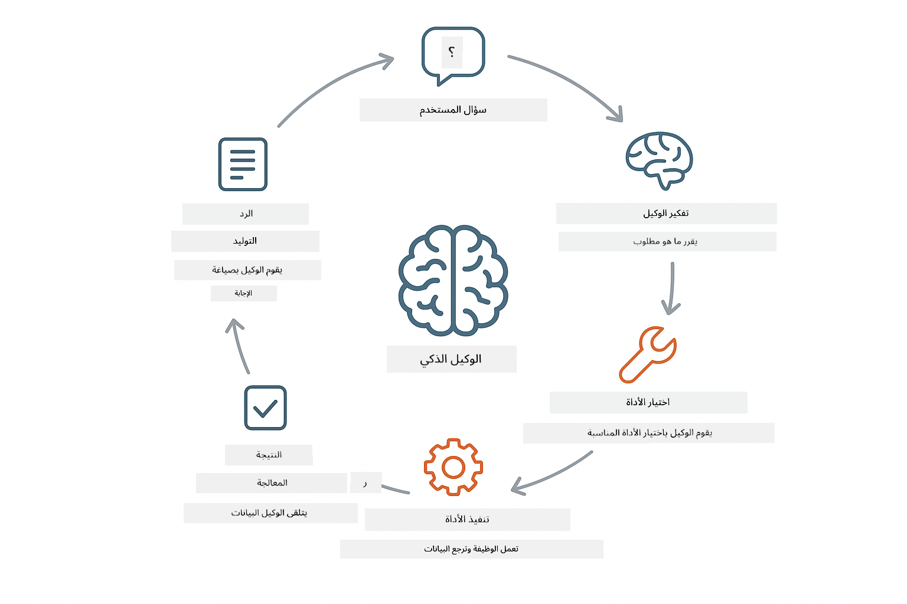
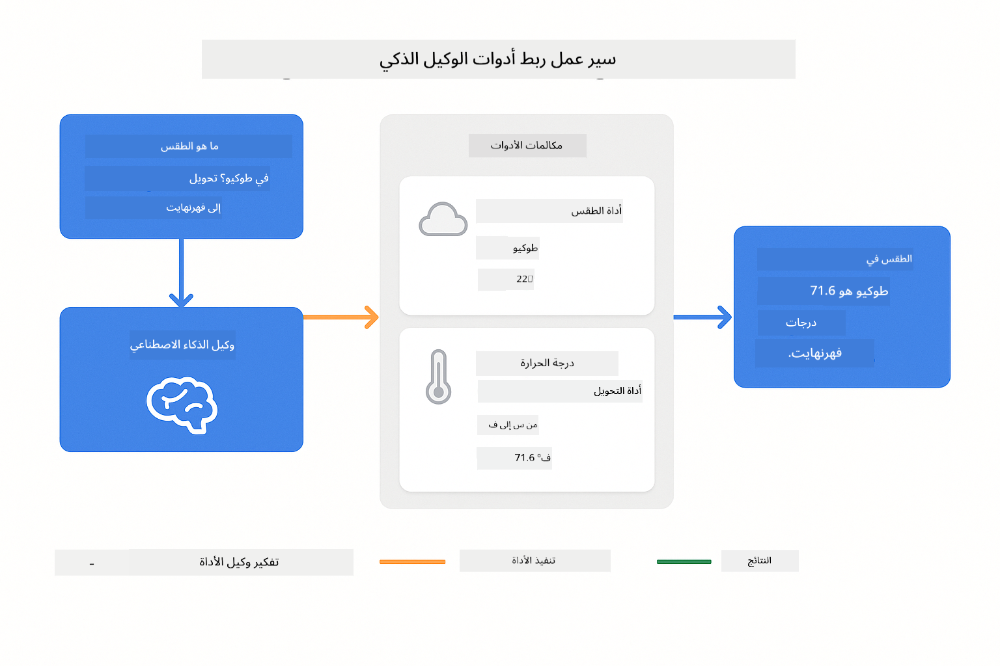

<!--
CO_OP_TRANSLATOR_METADATA:
{
  "original_hash": "13ec450c12cdd1a863baa2b778f27cd7",
  "translation_date": "2025-12-30T20:17:21+00:00",
  "source_file": "04-tools/README.md",
  "language_code": "ar"
}
-->
# Module 04: وكلاء الذكاء الاصطناعي مع أدوات

## Table of Contents

- [ماذا ستتعلم](../../../04-tools)
- [المتطلبات المسبقة](../../../04-tools)
- [فهم وكلاء الذكاء الاصطناعي مع الأدوات](../../../04-tools)
- [كيف يعمل استدعاء الأدوات](../../../04-tools)
  - [تعريفات الأدوات](../../../04-tools)
  - [اتخاذ القرار](../../../04-tools)
  - [التنفيذ](../../../04-tools)
  - [توليد الاستجابة](../../../04-tools)
- [تسلسل الأدوات](../../../04-tools)
- [تشغيل التطبيق](../../../04-tools)
- [استخدام التطبيق](../../../04-tools)
  - [جرّب استخدام أداة بسيطة](../../../04-tools)
  - [اختبر تسلسل الأدوات](../../../04-tools)
  - [شاهد تدفق المحادثة](../../../04-tools)
  - [لاحظ عملية الاستدلال](../../../04-tools)
  - [جرّب طلبات مختلفة](../../../04-tools)
- [المفاهيم الرئيسية](../../../04-tools)
  - [نمط ReAct (الاستدلال والفعل)](../../../04-tools)
  - [وصف الأدوات مهم](../../../04-tools)
  - [إدارة الجلسة](../../../04-tools)
  - [معالجة الأخطاء](../../../04-tools)
- [الأدوات المتاحة](../../../04-tools)
- [متى تستخدم وكلاء مبنيين على الأدوات](../../../04-tools)
- [الخطوات التالية](../../../04-tools)

## What You'll Learn

حتى الآن، تعلمت كيف تجري محادثات مع الذكاء الاصطناعي، وكيفية تنظيم المطالبات بفعالية، وكيفية تأطير الإجابات بناءً على مستنداتك. لكن لا يزال هناك قيد أساسي: نماذج اللغة تستطيع فقط توليد النص. لا يمكنها التحقق من الطقس، أو إجراء حسابات، أو الاستعلام في قواعد البيانات، أو التفاعل مع الأنظمة الخارجية.

الأدوات تغير هذا. بإعطاء النموذج إمكانية الوصول إلى دوال يمكنه استدعاؤها، تحولّه من مولد نصوص إلى وكيل يمكنه اتخاذ إجراءات. يقرر النموذج متى يحتاج أداة، وأي أداة يستخدمها، وما المعاملات التي يمرّرها. ينفذ كودك الدالة ويعيد النتيجة. يدمج النموذج تلك النتيجة في استجابته.

## Prerequisites

- إكمال Module 01 (موارد Azure OpenAI منشورة)
- ملف `.env` في الدليل الجذر به بيانات اعتماد Azure (تم إنشاؤه بواسطة `azd up` في Module 01)

> **ملاحظة:** إذا لم تكمل Module 01، فاتبع تعليمات النشر هناك أولاً.

## Understanding AI Agents with Tools

> **📝 ملاحظة:** مصطلح "الوكلاء" في هذه الوحدة يشير إلى مساعدين ذكاء اصطناعي محسنين بإمكانات استدعاء الأدوات. هذا يختلف عن أنماط **Agentic AI** (الوكلاء المستقلون مع التخطيط، والذاكرة، والاستدلال متعدد الخطوات) التي سنغطيها في [Module 05: MCP](../05-mcp/README.md).

وكيل الذكاء الاصطناعي المزود بأدوات يتبع نمط الاستدلال والفعل (ReAct):

1. يطرح المستخدم سؤالًا
2. يستنتج الوكيل ما الذي يحتاج إلى معرفته
3. يقرر الوكيل إذا كان يحتاج أداة للإجابة
4. إذا كان نعم، يستدعي الوكيل الأداة المناسبة بالمعاملات الصحيحة
5. تنفذ الأداة وتعيد بيانات
6. يدرج الوكيل النتيجة ويقدم الإجابة النهائية



*نمط ReAct - كيف يتبادل وكلاء الذكاء الاصطناعي بين الاستدلال والفعل لحل المشكلات*

يحدث هذا تلقائيًا. أنت تحدد الأدوات ووصفها. يتولى النموذج اتخاذ القرار بشأن متى وكيفية استخدامها.

## How Tool Calling Works

**Tool Definitions** - [WeatherTool.java](../../../04-tools/src/main/java/com/example/langchain4j/agents/tools/WeatherTool.java) | [TemperatureTool.java](../../../04-tools/src/main/java/com/example/langchain4j/agents/tools/TemperatureTool.java)

تعرّف دوالًا بوصف واضح ومواصفات للمعاملات. يرى النموذج هذه الأوصاف في موجه النظام ويفهم ما تقوم به كل أداة.

```java
@Component
public class WeatherTool {
    
    @Tool("Get the current weather for a location")
    public String getCurrentWeather(@P("Location name") String location) {
        // منطق البحث عن الطقس الخاص بك
        return "Weather in " + location + ": 22°C, cloudy";
    }
}

@AiService
public interface Assistant {
    String chat(@MemoryId String sessionId, @UserMessage String message);
}

// يتم توصيل المساعد تلقائيًا عبر Spring Boot بـ:
// - مكوّن ChatModel
// - جميع طرق @Tool من فئات @Component
// - ChatMemoryProvider لإدارة الجلسات
```

> **🤖 جرّب مع [GitHub Copilot](https://github.com/features/copilot) Chat:** افتح [`WeatherTool.java`](../../../04-tools/src/main/java/com/example/langchain4j/agents/tools/WeatherTool.java) واسأل:
> - "كيف أدمج API طقس حقيقي مثل OpenWeatherMap بدلًا من البيانات الوهمية؟"
> - "ما الذي يجعل وصف الأداة جيدًا ويساعد الذكاء الاصطناعي على استخدامها بشكل صحيح؟"
> - "كيف أتعامل مع أخطاء API وحدود المعدل في تنفيذ الأدوات؟"

**Decision Making**

عندما يسأل المستخدم "ما حالة الطقس في سياتل؟"، يتعرف النموذج أنه يحتاج أداة الطقس. ينتج استدعاء دالة مع معلمة الموقع مضبوطة على "Seattle".

**Execution** - [AgentService.java](../../../04-tools/src/main/java/com/example/langchain4j/agents/service/AgentService.java)

يقوم Spring Boot بربط واجهة `@AiService` التصريحية بكل الأدوات المسجلة تلقائيًا، وينفذ LangChain4j استدعاءات الأدوات تلقائيًا.

> **🤖 جرّب مع [GitHub Copilot](https://github.com/features/copilot) Chat:** افتح [`AgentService.java`](../../../04-tools/src/main/java/com/example/langchain4j/agents/service/AgentService.java) واسأل:
> - "كيف يعمل نمط ReAct ولماذا هو فعال لوكلاء الذكاء الاصطناعي؟"
> - "كيف يقرر الوكيل أي أداة يستخدم وبأي ترتيب؟"
> - "ماذا يحدث إذا فشل تنفيذ أداة - كيف ينبغي أن أتعامل مع الأخطاء بشكل قوي؟"

**Response Generation**

يتلقى النموذج بيانات الطقس ويهيئها في استجابة لغة طبيعية للمستخدم.

### لماذا نستخدم خدمات AI التصريحية؟

تستخدم هذه الوحدة تكامل LangChain4j مع Spring Boot عبر واجهات `@AiService` التصريحية:

- **الربط التلقائي في Spring Boot** - يتم حقن ChatModel والأدوات تلقائيًا
- **نمط @MemoryId** - إدارة ذاكرة جلسة تلقائية مبنية على المعرف
- **مثيل واحد** - يتم إنشاء المساعد مرة واحدة وإعادة استخدامه لتحسين الأداء
- **تنفيذ آمن نوعيًا** - استدعاء طرق Java مباشرة مع تحويل الأنواع
- **تنسيق متعدد الأدوار** - يتعامل مع تسلسل الأدوات تلقائيًا
- **بدون تكرار أكواد** - لا توجد استدعاءات يدوية لـ AiServices.builder() أو HashMap للذاكرة

النهج البديلة (الـ `AiServices.builder()` اليدوي) تتطلب مزيدًا من الكود وتفتقد فوائد تكامل Spring Boot.

## Tool Chaining

**تسلسل الأدوات** - قد يستدعي الذكاء الاصطناعي عدة أدوات على التوالي. اسأل "ما حالة الطقس في سياتل وهل يجب أن أحضر مظلة؟" وشاهد كيف يربط `getCurrentWeather` مع استدلال حول معدات المطر.

<a href="images/tool-chaining.png"></a>

*استدعاءات أداة متسلسلة - مخرجات أداة واحدة تغذي القرار التالي*

**فشل رشيق** - اطلب الطقس في مدينة غير موجودة في البيانات الوهمية. تُرجع الأداة رسالة خطأ، ويشرح الذكاء الاصطناعي أنه لا يستطيع المساعدة. تفشل الأدوات بأمان.

يحدث هذا في دور محادثة واحد. ينظم الوكيل استدعاءات الأدوات المتعددة بشكل ذاتي.

## Run the Application

**تحقق من النشر:**

تأكد من وجود ملف `.env` في الدليل الجذر به بيانات اعتماد Azure (تم إنشاؤه أثناء Module 01):
```bash
cat ../.env  # يجب أن يظهر AZURE_OPENAI_ENDPOINT و API_KEY و DEPLOYMENT
```

**ابدأ التطبيق:**

> **ملاحظة:** إذا كنت قد أطلقت جميع التطبيقات بالفعل باستخدام `./start-all.sh` من Module 01، فهذه الوحدة تعمل بالفعل على المنفذ 8084. يمكنك تخطي أوامر التشغيل أدناه والذهاب مباشرة إلى http://localhost:8084.

**الخيار 1: استخدام Spring Boot Dashboard (موصى به لمستخدمي VS Code)**

تتضمن حاوية التطوير امتداد Spring Boot Dashboard، الذي يوفر واجهة مرئية لإدارة جميع تطبيقات Spring Boot. يمكنك العثور عليه في شريط الأنشطة على الجانب الأيسر من VS Code (ابحث عن أيقونة Spring Boot).

من Spring Boot Dashboard، يمكنك:
- رؤية جميع تطبيقات Spring Boot المتاحة في مساحة العمل
- بدء/إيقاف التطبيقات بنقرة واحدة
- عرض سجلات التطبيق في الوقت الفعلي
- مراقبة حالة التطبيق

فقط انقر زر التشغيل بجوار "tools" لبدء هذه الوحدة، أو ابدأ كل الوحدات دفعة واحدة.


**الخيار 2: استخدام سكربتات الشل**

ابدأ جميع تطبيقات الويب (الوحدات 01-04):

**Bash:**
```bash
cd ..  # من الدليل الجذري
./start-all.sh
```

**PowerShell:**
```powershell
cd ..  # من الدليل الجذري
.\start-all.ps1
```

أو ابدأ هذه الوحدة فقط:

**Bash:**
```bash
cd 04-tools
./start.sh
```

**PowerShell:**
```powershell
cd 04-tools
.\start.ps1
```

كلا السكربتين يقومان بتحميل متغيرات البيئة تلقائيًا من ملف `.env` في الجذر وسيبنيان ملفات JAR إذا لم تكن موجودة.

> **ملاحظة:** إذا فضلت بناء كل الوحدات يدويًا قبل التشغيل:
>
> **Bash:**
> ```bash
> cd ..  # Go to root directory
> mvn clean package -DskipTests
> ```
>
> **PowerShell:**
> ```powershell
> cd ..  # Go to root directory
> mvn clean package -DskipTests
> ```

افتح http://localhost:8084 في متصفحك.

**لإيقاف التشغيل:**

**Bash:**
```bash
./stop.sh  # هذه الوحدة فقط
# أو
cd .. && ./stop-all.sh  # جميع الوحدات
```

**PowerShell:**
```powershell
.\stop.ps1  # هذه الوحدة فقط
# أو
cd ..; .\stop-all.ps1  # جميع الوحدات
```

## Using the Application

يوفر التطبيق واجهة ويب حيث يمكنك التفاعل مع وكيل ذكاء اصطناعي يمكنه الوصول إلى أدوات الطقس وتحويل درجات الحرارة.

<a href="images/tools-homepage.png"></a>

*واجهة أدوات وكيل الذكاء الاصطناعي - أمثلة سريعة وواجهة دردشة للتفاعل مع الأدوات*

**جرّب استخدام أداة بسيطة**

ابدأ بطلب بسيط: "حوّل 100 درجة فهرنهايت إلى سيليزية". يتعرّف الوكيل أنه يحتاج أداة تحويل الحرارة، يستدعيها بالمعاملات الصحيحة، ويعيد النتيجة. لاحظ كم يبدو هذا طبيعيًا - لم تُحدد أي أداة تستخدم أو كيف تستدعيها.

**اختبر تسلسل الأدوات**

جرّب الآن شيئًا أكثر تعقيدًا: "ما حالة الطقس في سياتل وحوله إلى فهرنهايت؟" راقب الوكيل وهو يعمل عبر هذه الخطوات. أولاً يحصل على الطقس (والذي يُرجع بالسيليزية)، ثم يتعرّف أنه يحتاج لتحويل إلى فهرنهايت، يستدعي أداة التحويل، ويجمع كلا النتيجتين في استجابة واحدة.

**شاهد تدفق المحادثة**

تحافظ واجهة الدردشة على سجل المحادثة، مما يتيح لك تفاعلات متعددة الأدوار. يمكنك رؤية جميع الاستفسارات والردود السابقة، مما يسهل تتبع المحادثة وفهم كيف يبني الوكيل السياق عبر تبادلات متعددة.

<a href="images/tools-conversation-demo.png"></a>

*محادثة متعددة الأدوار تُظهر تحويلات بسيطة، واستعلامات طقس، وتسلسل أدوات*

**جرّب طلبات مختلفة**

جرب مجموعات متنوعة:
- استعلامات الطقس: "ما حالة الطقس في طوكيو؟"
- تحويلات درجات الحرارة: "ما قيمة 25°C بالكلفن؟"
- استفسارات مركبة: "تحقق من الطقس في باريس وأخبرني إذا كان أعلى من 20°C"

لاحظ كيف يفسر الوكيل اللغة الطبيعية ويطابقها على استدعاءات الأدوات المناسبة.

## Key Concepts

**نمط ReAct (الاستدلال والفعل)**

يتناوب الوكيل بين الاستدلال (تحديد ما يجب فعله) والفعل (استخدام الأدوات). هذا النمط يمكّن الحل الذاتي للمشكلات بدلًا من مجرد الرد على التعليمات.

**وصف الأدوات مهم**

جودة أوصاف أدواتك تؤثر مباشرة على مدى كفاءة الوكيل في استخدامها. الأوصاف الواضحة والمحددة تساعد النموذج على فهم متى وكيفية استدعاء كل أداة.

**إدارة الجلسة**

تمكّن التعليمة `@MemoryId` إدارة ذاكرة مبنية على الجلسة تلقائيًا. كل معرف جلسة يحصل على مثيل `ChatMemory` خاص تُديره bean اسمها `ChatMemoryProvider`، مما يلغي الحاجة لتعقب الذاكرة يدويًا.

**معالجة الأخطاء**

يمكن أن تفشل الأدوات - تتوقف APIs عن الاستجابة، قد تكون المعاملات غير صالحة، الخدمات الخارجية قد تنهار. تحتاج وكلاء الإنتاج إلى معالجة أخطاء حتى يتمكن النموذج من شرح المشكلات أو تجربة بدائل.

## Available Tools

**أدوات الطقس** (بيانات وهمية للعرض):
- الحصول على الطقس الحالي لموقع
- الحصول على توقعات لعدة أيام

**أدوات تحويل درجات الحرارة**:
- سيليزية إلى فهرنهايت
- فهرنهايت إلى سيليزية
- سيليزية إلى كلفن
- كلفن إلى سيليزية
- فهرنهايت إلى كلفن
- كلفن إلى فهرنهايت

هذه أمثلة بسيطة، لكن النمط يمتد إلى أي دالة: استعلامات قواعد بيانات، استدعاءات APIs، حسابات، عمليات ملفات، أو أوامر نظام.

## When to Use Tool-Based Agents

**استخدم الأدوات عندما:**
- تتطلب الإجابة بيانات زمنية حقيقية (الطقس، أسعار الأسهم، المخزون)
- تحتاج إلى إجراء حسابات أكثر من الرياضيات البسيطة
- الوصول إلى قواعد بيانات أو APIs
- اتخاذ إجراءات (إرسال رسائل بريد إلكتروني، إنشاء تذاكر، تحديث سجلات)
- دمج مصادر بيانات متعددة

**لا تستخدم الأدوات عندما:**
- يمكن الإجابة على الأسئلة من المعرفة العامة
- الإجابة محادثية بحتة
- زمن استجابة الأداة سيجعل التجربة بطيئة جدًا

## Next Steps

**الوحدة التالية:** [05-mcp - Model Context Protocol (MCP)](../05-mcp/README.md)

---

**Navigation:** [← السابق: Module 03 - RAG](../03-rag/README.md) | [العودة إلى الرئيسي](../README.md) | [التالي: Module 05 - MCP →](../05-mcp/README.md)

---

<!-- CO-OP TRANSLATOR DISCLAIMER START -->
إخلاء المسؤولية:
تمت ترجمة هذا المستند باستخدام خدمة الترجمة الآلية Co-op Translator (https://github.com/Azure/co-op-translator). رغم سعينا للدقة، يرجى ملاحظة أن الترجمات الآلية قد تحتوي على أخطاء أو عدم دقة. ينبغي اعتبار المستند الأصلي بلغته الأصلية المصدر المعياري. للمعلومات الحرجة، يُنصح بالاستعانة بترجمة احترافية بشرية. لا نتحمل أي مسؤولية عن أي سوء فهم أو تفسير خاطئ ينشأ عن استخدام هذه الترجمة.
<!-- CO-OP TRANSLATOR DISCLAIMER END -->