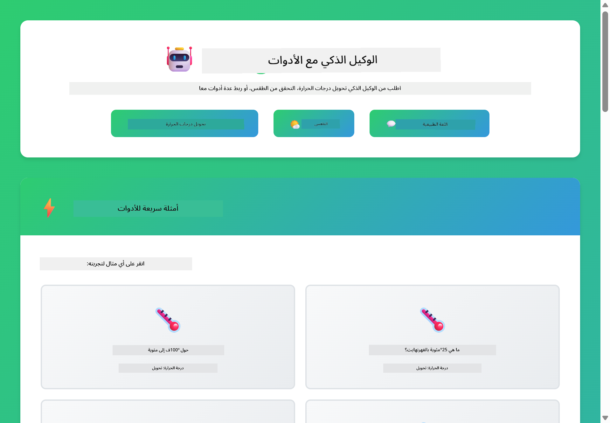
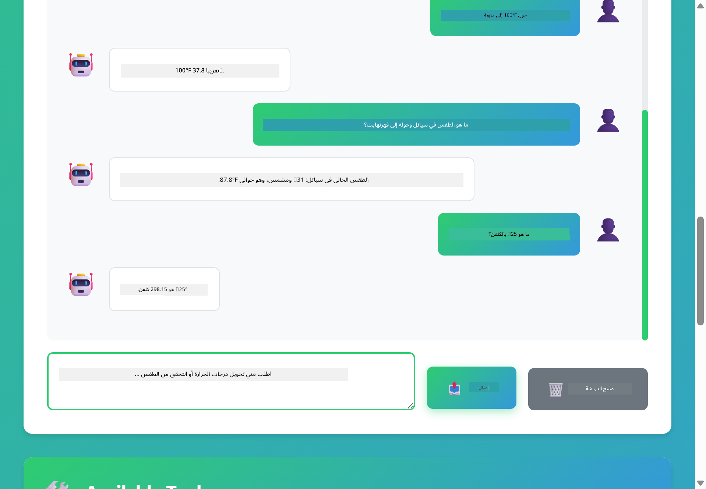

<!--
CO_OP_TRANSLATOR_METADATA:
{
  "original_hash": "aa23f106e7f53270924c9dd39c629004",
  "translation_date": "2025-12-13T18:24:05+00:00",
  "source_file": "04-tools/README.md",
  "language_code": "ar"
}
-->
# الوحدة 04: وكلاء الذكاء الاصطناعي مع الأدوات

## جدول المحتويات

- [ما ستتعلمه](../../../04-tools)
- [المتطلبات الأساسية](../../../04-tools)
- [فهم وكلاء الذكاء الاصطناعي مع الأدوات](../../../04-tools)
- [كيف يعمل استدعاء الأدوات](../../../04-tools)
  - [تعريفات الأدوات](../../../04-tools)
  - [اتخاذ القرار](../../../04-tools)
  - [التنفيذ](../../../04-tools)
  - [توليد الاستجابة](../../../04-tools)
- [تسلسل الأدوات](../../../04-tools)
- [تشغيل التطبيق](../../../04-tools)
- [استخدام التطبيق](../../../04-tools)
  - [تجربة استخدام أداة بسيطة](../../../04-tools)
  - [اختبار تسلسل الأدوات](../../../04-tools)
  - [رؤية تدفق المحادثة](../../../04-tools)
  - [ملاحظة الاستدلال](../../../04-tools)
  - [التجربة مع طلبات مختلفة](../../../04-tools)
- [المفاهيم الرئيسية](../../../04-tools)
  - [نمط ReAct (الاستدلال والفعل)](../../../04-tools)
  - [أهمية وصف الأدوات](../../../04-tools)
  - [إدارة الجلسة](../../../04-tools)
  - [معالجة الأخطاء](../../../04-tools)
- [الأدوات المتاحة](../../../04-tools)
- [متى تستخدم الوكلاء المعتمدين على الأدوات](../../../04-tools)
- [الخطوات التالية](../../../04-tools)

## ما ستتعلمه

حتى الآن، تعلمت كيفية إجراء محادثات مع الذكاء الاصطناعي، وتنظيم المطالبات بشكل فعال، وربط الردود بوثائقك. لكن هناك قيد أساسي: نماذج اللغة يمكنها فقط توليد النصوص. لا يمكنها التحقق من الطقس، أو إجراء الحسابات، أو الاستعلام من قواعد البيانات، أو التفاعل مع الأنظمة الخارجية.

الأدوات تغير هذا. من خلال منح النموذج إمكانية الوصول إلى وظائف يمكنه استدعاؤها، تحوله من مولد نصوص إلى وكيل يمكنه اتخاذ إجراءات. يقرر النموذج متى يحتاج إلى أداة، وأي أداة يستخدم، وما هي المعلمات التي يمررها. ينفذ كودك الوظيفة ويعيد النتيجة. يدمج النموذج تلك النتيجة في رده.

## المتطلبات الأساسية

- إكمال الوحدة 01 (نشر موارد Azure OpenAI)
- ملف `.env` في الدليل الجذري يحتوي على بيانات اعتماد Azure (تم إنشاؤه بواسطة `azd up` في الوحدة 01)

> **ملاحظة:** إذا لم تكمل الوحدة 01، فاتبع تعليمات النشر هناك أولاً.

## فهم وكلاء الذكاء الاصطناعي مع الأدوات

وكيل الذكاء الاصطناعي مع الأدوات يتبع نمط الاستدلال والفعل (ReAct):

1. يطرح المستخدم سؤالاً
2. يستدل الوكيل على ما يحتاج معرفته
3. يقرر الوكيل إذا كان يحتاج أداة للإجابة
4. إذا نعم، يستدعي الوكيل الأداة المناسبة بالمعلمات الصحيحة
5. تنفذ الأداة وتعيد البيانات
6. يدمج الوكيل النتيجة ويقدم الإجابة النهائية


*نمط ReAct - كيف يتناوب وكلاء الذكاء الاصطناعي بين الاستدلال والفعل لحل المشكلات*

يحدث هذا تلقائيًا. أنت تعرف الأدوات وأوصافها. النموذج يتولى اتخاذ القرار حول متى وكيف يستخدمها.

## كيف يعمل استدعاء الأدوات

**تعريفات الأدوات** - [WeatherTool.java](../../../04-tools/src/main/java/com/example/langchain4j/agents/tools/WeatherTool.java) | [TemperatureTool.java](../../../04-tools/src/main/java/com/example/langchain4j/agents/tools/TemperatureTool.java)

تعرف دوالًا مع أوصاف واضحة ومواصفات المعلمات. يرى النموذج هذه الأوصاف في مطالبه النظامية ويفهم ما تفعله كل أداة.

```java
@Component
public class WeatherTool {
    
    @Tool("Get the current weather for a location")
    public String getCurrentWeather(@P("Location name") String location) {
        // منطق البحث عن الطقس الخاص بك
        return "Weather in " + location + ": 22°C, cloudy";
    }
}

@AiService
public interface Assistant {
    String chat(@MemoryId String sessionId, @UserMessage String message);
}

// يتم توصيل المساعد تلقائيًا بواسطة Spring Boot مع:
// - مكون ChatModel
// - جميع طرق @Tool من فئات @Component
// - مزود ChatMemory لإدارة الجلسات
```

> **🤖 جرب مع دردشة [GitHub Copilot](https://github.com/features/copilot):** افتح [`WeatherTool.java`](../../../04-tools/src/main/java/com/example/langchain4j/agents/tools/WeatherTool.java) واسأل:
> - "كيف يمكنني دمج API حقيقي للطقس مثل OpenWeatherMap بدلاً من بيانات وهمية؟"
> - "ما الذي يجعل وصف الأداة جيدًا يساعد الذكاء الاصطناعي على استخدامها بشكل صحيح؟"
> - "كيف أتعامل مع أخطاء API وحدود المعدل في تنفيذ الأدوات؟"

**اتخاذ القرار**

عندما يسأل المستخدم "ما هو الطقس في سياتل؟"، يتعرف النموذج على حاجته لأداة الطقس. ينشئ استدعاء دالة مع تعيين معلمة الموقع إلى "Seattle".

**التنفيذ** - [AgentService.java](../../../04-tools/src/main/java/com/example/langchain4j/agents/service/AgentService.java)

يقوم Spring Boot بربط واجهة `@AiService` التصريحية تلقائيًا مع جميع الأدوات المسجلة، وينفذ LangChain4j استدعاءات الأدوات تلقائيًا.

> **🤖 جرب مع دردشة [GitHub Copilot](https://github.com/features/copilot):** افتح [`AgentService.java`](../../../04-tools/src/main/java/com/example/langchain4j/agents/service/AgentService.java) واسأل:
> - "كيف يعمل نمط ReAct ولماذا هو فعال لوكلاء الذكاء الاصطناعي؟"
> - "كيف يقرر الوكيل أي أداة يستخدم وبأي ترتيب؟"
> - "ماذا يحدث إذا فشل تنفيذ أداة - كيف يجب أن أتعامل مع الأخطاء بشكل قوي؟"

**توليد الاستجابة**

يتلقى النموذج بيانات الطقس ويحولها إلى رد بلغة طبيعية للمستخدم.

### لماذا تستخدم خدمات الذكاء الاصطناعي التصريحية؟

تستخدم هذه الوحدة تكامل LangChain4j مع Spring Boot عبر واجهات `@AiService` التصريحية:

- **ربط تلقائي في Spring Boot** - يتم حقن ChatModel والأدوات تلقائيًا
- **نمط @MemoryId** - إدارة الذاكرة بناءً على الجلسة تلقائيًا
- **مثيل واحد** - يتم إنشاء المساعد مرة واحدة وإعادة استخدامه لأداء أفضل
- **تنفيذ آمن نوعيًا** - استدعاء طرق جافا مباشرة مع تحويل النوع
- **تنسيق متعدد الأدوار** - يتعامل مع تسلسل الأدوات تلقائيًا
- **صفر كود روتيني** - لا حاجة لاستدعاءات يدوية لـ AiServices.builder() أو خريطة الذاكرة

الطرق البديلة (استخدام يدوي لـ AiServices.builder()) تتطلب المزيد من الكود وتفتقد فوائد تكامل Spring Boot.

## تسلسل الأدوات

**تسلسل الأدوات** - قد يستدعي الذكاء الاصطناعي عدة أدوات بالتتابع. اسأل "ما هو الطقس في سياتل وهل يجب أن أحضر مظلة؟" وشاهد كيف يربط `getCurrentWeather` مع الاستدلال حول معدات المطر.

<a href="images/tool-chaining.png"></a>

*استدعاءات الأدوات المتتابعة - مخرجات أداة تغذي القرار التالي*

**الفشل بأناقة** - اطلب الطقس في مدينة غير موجودة في البيانات الوهمية. تعيد الأداة رسالة خطأ، ويشرح الذكاء الاصطناعي أنه لا يمكنه المساعدة. الأدوات تفشل بأمان.

يحدث هذا في دورة محادثة واحدة. يدير الوكيل استدعاءات الأدوات المتعددة بشكل مستقل.

## تشغيل التطبيق

**تحقق من النشر:**

تأكد من وجود ملف `.env` في الدليل الجذري يحتوي على بيانات اعتماد Azure (تم إنشاؤه أثناء الوحدة 01):
```bash
cat ../.env  # يجب أن يعرض AZURE_OPENAI_ENDPOINT و API_KEY و DEPLOYMENT
```

**ابدأ التطبيق:**

> **ملاحظة:** إذا كنت قد بدأت جميع التطبيقات باستخدام `./start-all.sh` من الوحدة 01، فإن هذه الوحدة تعمل بالفعل على المنفذ 8084. يمكنك تخطي أوامر البدء أدناه والذهاب مباشرة إلى http://localhost:8084.

**الخيار 1: استخدام لوحة تحكم Spring Boot (موصى به لمستخدمي VS Code)**

تتضمن حاوية التطوير إضافة لوحة تحكم Spring Boot، التي توفر واجهة بصرية لإدارة جميع تطبيقات Spring Boot. يمكنك العثور عليها في شريط النشاط على الجانب الأيسر من VS Code (ابحث عن أيقونة Spring Boot).

من لوحة تحكم Spring Boot، يمكنك:
- رؤية جميع تطبيقات Spring Boot المتاحة في مساحة العمل
- بدء/إيقاف التطبيقات بنقرة واحدة
- عرض سجلات التطبيق في الوقت الحقيقي
- مراقبة حالة التطبيق

فقط انقر على زر التشغيل بجانب "tools" لبدء هذه الوحدة، أو ابدأ جميع الوحدات دفعة واحدة.


**الخيار 2: استخدام سكربتات الشل**

ابدأ جميع تطبيقات الويب (الوحدات 01-04):

**Bash:**
```bash
cd ..  # من الدليل الجذري
./start-all.sh
```

**PowerShell:**
```powershell
cd ..  # من الدليل الجذري
.\start-all.ps1
```

أو ابدأ هذه الوحدة فقط:

**Bash:**
```bash
cd 04-tools
./start.sh
```

**PowerShell:**
```powershell
cd 04-tools
.\start.ps1
```

كلا السكربتين يقومان بتحميل متغيرات البيئة تلقائيًا من ملف `.env` الجذري وسيبنيان ملفات JAR إذا لم تكن موجودة.

> **ملاحظة:** إذا كنت تفضل بناء جميع الوحدات يدويًا قبل البدء:
>
> **Bash:**
> ```bash
> cd ..  # Go to root directory
> mvn clean package -DskipTests
> ```
>
> **PowerShell:**
> ```powershell
> cd ..  # Go to root directory
> mvn clean package -DskipTests
> ```

افتح http://localhost:8084 في متصفحك.

**لإيقاف التشغيل:**

**Bash:**
```bash
./stop.sh  # هذا الوحدة فقط
# أو
cd .. && ./stop-all.sh  # جميع الوحدات
```

**PowerShell:**
```powershell
.\stop.ps1  # هذا الوحدة فقط
# أو
cd ..; .\stop-all.ps1  # جميع الوحدات
```

## استخدام التطبيق

يوفر التطبيق واجهة ويب حيث يمكنك التفاعل مع وكيل ذكاء اصطناعي لديه إمكانية الوصول إلى أدوات الطقس وتحويل درجة الحرارة.

<a href="images/tools-homepage.png"></a>

*واجهة أدوات وكيل الذكاء الاصطناعي - أمثلة سريعة وواجهة دردشة للتفاعل مع الأدوات*

**جرب استخدام أداة بسيطة**

ابدأ بطلب مباشر: "حوّل 100 درجة فهرنهايت إلى مئوية". يتعرف الوكيل على حاجته لأداة تحويل درجة الحرارة، يستدعيها بالمعلمات الصحيحة، ويعيد النتيجة. لاحظ مدى طبيعية هذا الشعور - لم تحدد أي أداة تستخدم أو كيف تستدعيها.

**اختبر تسلسل الأدوات**

جرب الآن شيئًا أكثر تعقيدًا: "ما هو الطقس في سياتل وحوّله إلى فهرنهايت؟" شاهد الوكيل يعمل على ذلك خطوة بخطوة. يحصل أولاً على الطقس (الذي يعيد مئوية)، يتعرف على حاجته للتحويل إلى فهرنهايت، يستدعي أداة التحويل، ويجمع كلا النتيجتين في رد واحد.

**رؤية تدفق المحادثة**

تحافظ واجهة الدردشة على سجل المحادثة، مما يتيح لك إجراء تفاعلات متعددة الأدوار. يمكنك رؤية جميع الاستفسارات والردود السابقة، مما يسهل تتبع المحادثة وفهم كيف يبني الوكيل السياق عبر تبادلات متعددة.

<a href="images/tools-conversation-demo.png"></a>

*محادثة متعددة الأدوار تظهر تحويلات بسيطة، استعلامات الطقس، وتسلسل الأدوات*

**جرب طلبات مختلفة**

جرب مجموعات متنوعة:
- استعلامات الطقس: "ما هو الطقس في طوكيو؟"
- تحويلات درجة الحرارة: "ما هي 25°C بالكلفن؟"
- استفسارات مركبة: "تحقق من الطقس في باريس وأخبرني إذا كان فوق 20°C"

لاحظ كيف يفسر الوكيل اللغة الطبيعية ويربطها باستدعاءات الأدوات المناسبة.

## المفاهيم الرئيسية

**نمط ReAct (الاستدلال والفعل)**

يتناوب الوكيل بين الاستدلال (تقرير ما يجب فعله) والفعل (استخدام الأدوات). هذا النمط يمكّن من حل المشكلات بشكل مستقل بدلاً من مجرد الرد على التعليمات.

**أهمية وصف الأدوات**

جودة وصف الأدوات تؤثر مباشرة على مدى استخدام الوكيل لها بشكل جيد. الأوصاف الواضحة والمحددة تساعد النموذج على فهم متى وكيف يستدعي كل أداة.

**إدارة الجلسة**

تسمح التعليمة `@MemoryId` بإدارة الذاكرة بناءً على الجلسة تلقائيًا. كل معرف جلسة يحصل على مثيل `ChatMemory` خاص به تديره مكون `ChatMemoryProvider`، مما يلغي الحاجة لتتبع الذاكرة يدويًا.

**معالجة الأخطاء**

يمكن أن تفشل الأدوات - انتهاء مهلة API، معلمات غير صالحة، تعطل الخدمات الخارجية. يحتاج الوكلاء في الإنتاج إلى معالجة الأخطاء حتى يتمكن النموذج من شرح المشاكل أو تجربة بدائل.

## الأدوات المتاحة

**أدوات الطقس** (بيانات وهمية للعرض):
- الحصول على الطقس الحالي لموقع
- الحصول على توقعات متعددة الأيام

**أدوات تحويل درجة الحرارة**:
- من مئوية إلى فهرنهايت
- من فهرنهايت إلى مئوية
- من مئوية إلى كلفن
- من كلفن إلى مئوية
- من فهرنهايت إلى كلفن
- من كلفن إلى فهرنهايت

هذه أمثلة بسيطة، لكن النمط يمتد لأي وظيفة: استعلامات قواعد البيانات، استدعاءات API، الحسابات، عمليات الملفات، أو أوامر النظام.

## متى تستخدم الوكلاء المعتمدين على الأدوات

**استخدم الأدوات عندما:**
- تتطلب الإجابة بيانات في الوقت الحقيقي (الطقس، أسعار الأسهم، المخزون)
- تحتاج إلى إجراء حسابات تتجاوز الرياضيات البسيطة
- الوصول إلى قواعد البيانات أو APIs
- اتخاذ إجراءات (إرسال بريد إلكتروني، إنشاء تذاكر، تحديث سجلات)
- دمج مصادر بيانات متعددة

**لا تستخدم الأدوات عندما:**
- يمكن الإجابة على الأسئلة من المعرفة العامة
- الرد محادثي بحت
- زمن استجابة الأداة يجعل التجربة بطيئة جدًا

## الخطوات التالية

**الوحدة التالية:** [05-mcp - بروتوكول سياق النموذج (MCP)](../05-mcp/README.md)

---

**التنقل:** [← السابق: الوحدة 03 - RAG](../03-rag/README.md) | [العودة إلى الرئيسي](../README.md) | [التالي: الوحدة 05 - MCP →](../05-mcp/README.md)

---

<!-- CO-OP TRANSLATOR DISCLAIMER START -->
**إخلاء المسؤولية**:  
تمت ترجمة هذا المستند باستخدام خدمة الترجمة الآلية [Co-op Translator](https://github.com/Azure/co-op-translator). بينما نسعى لتحقيق الدقة، يرجى العلم أن الترجمات الآلية قد تحتوي على أخطاء أو عدم دقة. يجب اعتبار المستند الأصلي بلغته الأصلية المصدر الموثوق به. للمعلومات الهامة، يُنصح بالترجمة البشرية المهنية. نحن غير مسؤولين عن أي سوء فهم أو تفسير ناتج عن استخدام هذه الترجمة.
<!-- CO-OP TRANSLATOR DISCLAIMER END -->