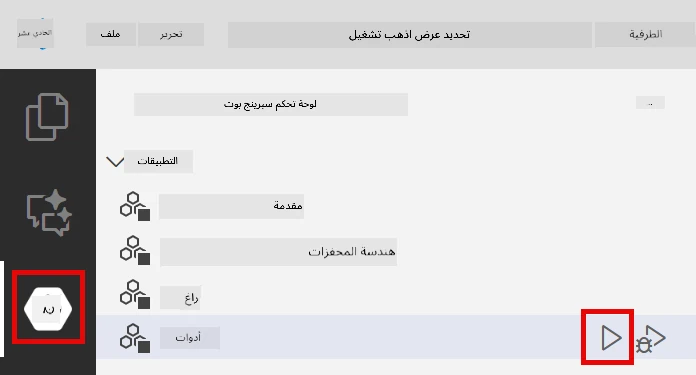
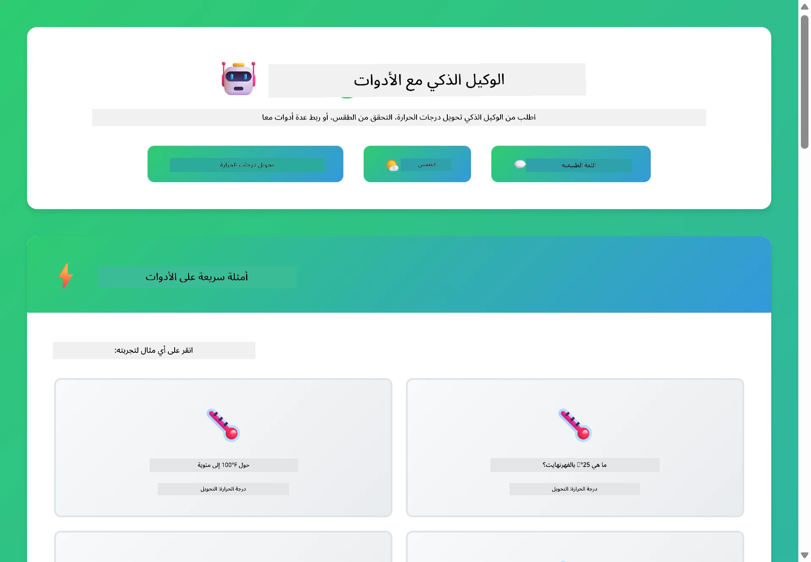
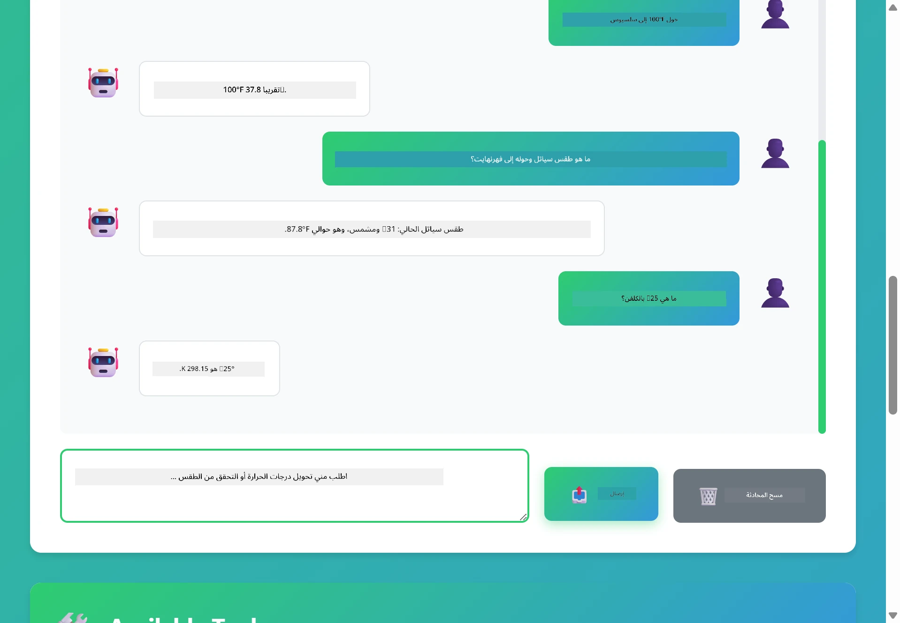

# الوحدة 04: وكلاء الذكاء الاصطناعي مع الأدوات

## جدول المحتويات

- [مرور فيديو](#video-walkthrough)
- [ما الذي ستتعلمه](#what-youll-learn)
- [المتطلبات المسبقة](#prerequisites)
- [فهم وكلاء الذكاء الاصطناعي مع الأدوات](#understanding-ai-agents-with-tools)
- [كيف يعمل استدعاء الأداة](#how-tool-calling-works)
  - [تعريفات الأدوات](#tool-definitions)
  - [اتخاذ القرار](#decision-making)
  - [التنفيذ](#execution)
  - [توليد الاستجابة](#response-generation)
  - [الهيكلية: الربط التلقائي في Spring Boot](#architecture-spring-boot-auto-wiring)
- [ربط الأدوات](#tool-chaining)
- [تشغيل التطبيق](#run-the-application)
- [استخدام التطبيق](#استخدام-التطبيق)
  - [تجربة استخدام أداة بسيطة](#جرب-استخدام-أداة-بسيطة)
  - [اختبار ربط الأدوات](#اختبر-ربط-الأدوات)
  - [رؤية تدفق المحادثة](#شاهد-سير-المحادثة)
  - [تجربة طلبات مختلفة](#جرب-طلبات-مختلفة)
- [المفاهيم الأساسية](#المفاهيم-الرئيسية)
  - [نمط ReAct (التفكير والفعل)](#نمط-react-التفكير-والعمل)
  - [أهمية أوصاف الأدوات](#وصف-الأدوات-مهم)
  - [إدارة الجلسة](#إدارة-الجلسات)
  - [التعامل مع الأخطاء](#التعامل-مع-الأخطاء)
- [الأدوات المتاحة](#الأدوات-المتاحة)
- [متى تستخدم الوكلاء المعتمدين على الأدوات](#متى-تستخدم-وكلاء-قائمين-على-الأدوات)
- [الأدوات مقابل RAG](#الأدوات-مقابل-نظام-الاسترجاع-والاستدلال-rag)
- [الخطوات التالية](#الخطوات-التالية)

## Video Walkthrough

شاهد هذا الجلسة المباشرة التي تشرح كيفية البدء مع هذه الوحدة:

<a href="https://www.youtube.com/watch?v=O_J30kZc0rw"></a>

## What You'll Learn

حتى الآن، تعلمت كيف تجري محادثات مع الذكاء الاصطناعي، وكيف تهيكل المطالبات بفعالية، وتربط الاستجابات بوثائقك. ولكن هناك قيد أساسي: نماذج اللغة يمكنها فقط توليد النصوص. لا يمكنها التحقق من الطقس، أو إجراء حسابات، أو الاستعلام في قواعد البيانات، أو التفاعل مع الأنظمة الخارجية.

الأدوات تغير هذا. من خلال منح النموذج إمكانية الوصول إلى دوال يمكنه استدعاؤها، تحول النموذج من مولد نص إلى وكيل يمكنه اتخاذ إجراءات. يقرر النموذج متى يحتاج إلى أداة، أي أداة يستخدم، وما هي المعلمات التي يمررها. ينفذ الكود الخاص بك الدالة ويعيد النتيجة. يدمج النموذج تلك النتيجة في استجابته.

## Prerequisites

- إكمال [الوحدة 01 - المقدمة](../01-introduction/README.md) (تم نشر موارد Azure OpenAI)
- إكمال الوحدات السابقة موصى به (تشير هذه الوحدة إلى [مفاهيم RAG من الوحدة 03](../03-rag/README.md) في مقارنة الأدوات مقابل RAG)
- وجود ملف `.env` في الدليل الجذري مع بيانات اعتماد Azure (تم إنشاؤه بواسطة `azd up` في الوحدة 01)

> **ملاحظة:** إذا لم تكمل الوحدة 01، فاتبع تعليمات النشر هناك أولاً.

## Understanding AI Agents with Tools

> **📝 ملاحظة:** مصطلح "وكلاء" في هذه الوحدة يشير إلى مساعدين ذكيين معززین بإمكانات استدعاء الأدوات. هذا يختلف عن أنماط **Agentic AI** (وكلاء مستقلون مع تخطيط وذاكرة وتفكير متعدد الخطوات) التي سنتناولها في [الوحدة 05: MCP](../05-mcp/README.md).

بدون أدوات، يمكن لنموذج اللغة فقط توليد النص من بيانات التدريب. اسأله عن الطقس الحالي، وعليه التخمين. زوده بالأدوات، ويمكنه استدعاء API الطقس، إجراء الحسابات، أو الاستعلام في قاعدة بيانات — ثم يدمج تلك النتائج الحقيقية في استجابته.


*بدون أدوات، النموذج يخمن فقط — مع الأدوات يمكنه استدعاء APIs، إجراء حسابات، وإرجاع بيانات في الوقت الحقيقي.*

وكيل الذكاء الاصطناعي مع الأدوات يتبع نمط **التفكير والفعل (ReAct)**. النموذج لا يكتفي بالاستجابة — بل يفكر فيما يحتاجه، يتصرف عبر استدعاء أداة، يلاحظ النتيجة، ثم يقرر ما إذا كان عليه التصرف مرة أخرى أو تقديم الإجابة النهائية:

1. **التفكير** — يحلل الوكيل سؤال المستخدم ويحدد المعلومات التي يحتاجها
2. **التصرف** — يختار الوكيل الأداة الصحيحة، يولد المعلمات الصحيحة، ويستدعيها
3. **المراقبة** — يتلقى الوكيل مخرجات الأداة ويقيّم النتيجة
4. **التكرار أو الرد** — إذا كانت هناك حاجة لمزيد من المعلومات، يعود الوكيل للحلقة؛ وإلا يؤلف إجابة بلغة طبيعية


*دورة ReAct — الوكيل يفكر في ما يجب فعله، يتصرف باستدعاء أداة، يراقب النتيجة، ويكرر حتى يستطيع تقديم الإجابة النهائية.*

يحدث هذا تلقائيًا. تقوم بتعريف الأدوات وأوصافها. النموذج يتولى اتخاذ القرار حول متى وكيف يستخدمها.

## How Tool Calling Works

### Tool Definitions

[WeatherTool.java](../../../04-tools/src/main/java/com/example/langchain4j/agents/tools/WeatherTool.java) | [TemperatureTool.java](../../../04-tools/src/main/java/com/example/langchain4j/agents/tools/TemperatureTool.java)

تعرف دوالًا بأوصاف واضحة ومواصفات المعلمات. يرى النموذج هذه الأوصاف في طلب النظام ويفهم ما تقوم به كل أداة.

```java
@Component
public class WeatherTool {
    
    @Tool("Get the current weather for a location")
    public String getCurrentWeather(@P("Location name") String location) {
        // منطق البحث عن الطقس الخاص بك
        return "Weather in " + location + ": 22°C, cloudy";
    }
}

@AiService
public interface Assistant {
    String chat(@MemoryId String sessionId, @UserMessage String message);
}

// يتم ربط المساعد تلقائيًا بواسطة Spring Boot مع:
// - مكون ChatModel
// - جميع طرق @Tool من فئات @Component
// - مزود ChatMemory لإدارة الجلسات
```
  
يوضح المخطط أدناه كل توضيح ويبيّن كيف يساعد كل جزء الذكاء الاصطناعي على معرفة متى يستدعي الأداة وأي المعلمات يمرر:


*تشريح تعريف أداة — @Tool يخبر الذكاء الاصطناعي متى يستخدمها، @P يصف كل معلمة، و @AiService يربط كل شيء معًا عند بدء التشغيل.*

> **🤖 جرّب مع [GitHub Copilot](https://github.com/features/copilot) Chat:** افتح [`WeatherTool.java`](../../../04-tools/src/main/java/com/example/langchain4j/agents/tools/WeatherTool.java) واسأل:
> - "كيف أدمج API طقس حقيقي مثل OpenWeatherMap بدلًا من بيانات وهمية؟"
> - "ما الذي يجعل وصف الأداة جيدًا ويساعد الذكاء الاصطناعي على استخدامها بشكل صحيح؟"
> - "كيف أتعامل مع أخطاء API وحدود الاستخدام في تنفيذ الأدوات؟"

### Decision Making

عندما يسأل المستخدم "ما حالة الطقس في سياتل؟"، لا يختار النموذج أداة عشوائياً. يقارن نية المستخدم مع كل وصف أداة متاح، يقيم كل واحدة من حيث الصلة، ويختار التطابق الأفضل. ثم يولد استدعاء دالة منظم مع المعلمات الصحيحة — في هذه الحالة، تعيين `location` إلى `"Seattle"`.

إذا لم يتطابق أي أداة مع طلب المستخدم، يعود النموذج ليجيب من معرفته الخاصة. إذا تطابق عدة أدوات، يختار الأكثر تحديدًا.


*النموذج يقيم كل أداة متاحة مقابل نية المستخدم ويختار أفضل تطابق — لذلك فإن كتابة أوصاف أدوات واضحة ومحددة مهمة.*

### Execution

[AgentService.java](../../../04-tools/src/main/java/com/example/langchain4j/agents/service/AgentService.java)

يقوم Spring Boot بالربط التلقائي لواجهة `@AiService` التصريحية مع كل الأدوات المسجلة، وينفذ LangChain4j استدعاءات الأدوات تلقائيًا. خلف الكواليس، يمر استدعاء الأداة بمرحلة كاملة من ست مراحل — من سؤال المستخدم بلغة طبيعية حتى الرد بلغة طبيعية:


*التدفق من البداية للنهاية — المستخدم يطرح سؤالًا، النموذج يختار أداة، LangChain4j ينفذها، والنموذج يدمج النتيجة في رد طبيعي.*

خلف الكواليس، تقوم `AiServices` بتشغيل دورة استدعاء الأداة نفسها لأي أداة — هنا موضحة بـ `Calculator` بسيطة. يوضح مخطط التسلسل أدناه بالضبط ما يحدث تحت الغطاء:


*دورة استدعاء الأداة — `AiServices` يرسل رسالتك ومخططات الأداة إلى LLM، ويرد LLM باستدعاء دالة مثل `add(42, 58)`, LangChain4j ينفذ دالة `Calculator` محليًا، ويرسل النتيجة إلى الجواب النهائي.*

> **🤖 جرّب مع [GitHub Copilot](https://github.com/features/copilot) Chat:** افتح [`AgentService.java`](../../../04-tools/src/main/java/com/example/langchain4j/agents/service/AgentService.java) واسأل:
> - "كيف يعمل نمط ReAct ولماذا هو فعال لوكلاء الذكاء الاصطناعي؟"
> - "كيف يقرر الوكيل أي أداة يستخدم وبأي ترتيب؟"
> - "ماذا يحدث إذا فشل تنفيذ أداة - كيف أتعامل مع الأخطاء بطريقة قوية؟"

### Response Generation

يستلم النموذج بيانات الطقس ويصيغها في رد بلغة طبيعية للمستخدم.

### Architecture: Spring Boot Auto-Wiring

تستخدم هذه الوحدة تكامل LangChain4j مع Spring Boot عبر واجهات `@AiService` التصريحية. عند بدء التشغيل، يكتشف Spring Boot كل `@Component` يحتوي على دوال `@Tool`، وقطعة `ChatModel`، ومزود الذاكرة `ChatMemoryProvider` — ثم يربطها جميعًا في واجهة `Assistant` واحدة بدون أي شيفرة تكرارية.


*واجهة @AiService تربط معًا ChatModel، مكونات الأدوات، ومزود الذاكرة — وSpring Boot يتولى كل الربط تلقائيًا.*

ها هي دورة حياة الطلب كاملةً في مخطط تسلسل — من طلب HTTP مرورًا بالتحكم، الخدمة، والوكيل المرتبط تلقائيًا، وحتى تنفيذ الأداة والعودة:


*دورة حياة طلب Spring Boot كاملة — طلب HTTP يمر عبر المتحكم والخدمة إلى وكيل Assistant المرتبط تلقائيًا، الذي يدير LLM واستدعاءات الأدوات تلقائيًا.*

الفوائد الرئيسية لهذا النهج:

- **الربط التلقائي في Spring Boot** — حقن ChatModel والأدوات تلقائيًا
- **نمط @MemoryId** — إدارة الذاكرة المبنية على الجلسة تلقائيًا
- **نسخة واحدة** — إنشاء Assistant مرة واحدة وإعادة استخدامها لأداء أفضل
- **تنفيذ آمن نوعيًا** — استدعاء دوال جافا مباشرة مع تحويل نوع المعطيات
- **تنسيق متعدد الجولات** — يتعامل تلقائيًا مع ربط الأدوات
- **صفر شيفرة تكرارية** — لا حاجة لاستدعاءات يدوية لـ `AiServices.builder()` أو HashMap للذاكرة

النهج البديلة (اليدوية عبر `AiServices.builder()`) تتطلب مزيدًا من الشيفرة وتفتقد فوائد تكامل Spring Boot.

## Tool Chaining

**ربط الأدوات** — القوة الحقيقية للوكلاء المعتمدين على الأدوات تظهر عندما يتطلب سؤال واحد عدة أدوات. اسأل "ما حالة الطقس في سياتل بالفهرنهايت؟" وسيقوم الوكيل تلقائيًا بربط أداتين: أولًا يستدعي `getCurrentWeather` للحصول على درجة الحرارة بالسيليزيوس، ثم يمرر تلك القيمة إلى `celsiusToFahrenheit` للتحويل — كل ذلك في جولة محادثة واحدة.


*ربط الأدوات في العمل — الوكيل يستدعي getCurrentWeather أولًا، ثم يمرر النتيجة بالسيليزي إلى celsiusToFahrenheit، ويقدم إجابة مجمعة.*

**الفشل اللطيف** — اطلب حالة الطقس في مدينة غير موجودة في بيانات النموذج الوهمية. ترجع الأداة رسالة خطأ، ويشرح الذكاء الاصطناعي أنه لا يمكنه المساعدة بدلاً من التعطل. الأدوات تفشل بأمان. يوضح المخطط أدناه المقارنتين — مع التعامل الصحيح مع الأخطاء، يلتقط الوكيل الاستثناء ويرد بشكل مفيد، بينما بدون ذلك يتعطل التطبيق بأكمله:


*عندما تفشل الأداة، يلتقط الوكيل الخطأ ويرد بشرح مفيد بدلاً من التعطل.*

يحدث هذا في جولة محادثة واحدة. الوكيل ينظم استدعاءات متعددة للأدوات بشكل مستقل.

## Run the Application

**تحقق من النشر:**

تأكد من وجود ملف `.env` في الدليل الجذري مع بيانات اعتماد Azure (تم إنشاؤه أثناء الوحدة 01). شغّل هذا من دليل الوحدة (`04-tools/`):

**Bash:**
```bash
cat ../.env  # يجب عرض AZURE_OPENAI_ENDPOINT و API_KEY و DEPLOYMENT
```
  
**PowerShell:**
```powershell
Get-Content ..\.env  # يجب عرض AZURE_OPENAI_ENDPOINT وAPI_KEY وDEPLOYMENT
```
  
**ابدأ التطبيق:**

> **ملاحظة:** إذا كنت قد بدأت جميع التطبيقات باستخدام `./start-all.sh` من الدليل الجذري (كما هو موضح في الوحدة 01)، فهذه الوحدة تعمل بالفعل على المنفذ 8084. يمكنك تخطي أوامر البدء أدناه والذهاب مباشرة إلى http://localhost:8084.

**الخيار 1: استخدام لوحة تحكم Spring Boot (مُوصى به لمستخدمي VS Code)**

تتضمن حاوية التطوير إضافة Spring Boot Dashboard، التي توفر واجهة مرئية لإدارة جميع تطبيقات Spring Boot. يمكنك العثور عليها في شريط الأنشطة على الجانب الأيسر من VS Code (ابحث عن رمز Spring Boot).

من لوحة تحكم Spring Boot، يمكنك:
- رؤية جميع تطبيقات Spring Boot المتاحة في مساحة العمل
- بدء/إيقاف التطبيقات بنقرة واحدة
- عرض سجلات التطبيق في الوقت الحقيقي
- مراقبة حالة التطبيق

فقط انقر زر التشغيل بجانب "tools" لبدء هذه الوحدة، أو ابدأ جميع الوحدات دفعة واحدة.

إليك كيف تبدو لوحة تحكم Spring Boot في VS Code:


*لوحة معلومات Spring Boot في VS Code — بدء التشغيل، الإيقاف، والمراقبة لجميع الوحدات من مكان واحد*

**الخيار 2: استخدام سكربتات الشل**

ابدأ جميع تطبيقات الويب (الوحدات 01-04):

**باش:**
```bash
cd ..  # من الدليل الجذر
./start-all.sh
```

**باورشل:**
```powershell
cd ..  # من الدليل الجذري
.\start-all.ps1
```

أو ابدأ هذه الوحدة فقط:

**باش:**
```bash
cd 04-tools
./start.sh
```

**باورشل:**
```powershell
cd 04-tools
.\start.ps1
```

يقوم كلا السكربتين بتحميل متغيرات البيئة تلقائيًا من ملف `.env` في الجذر وسيبني ملفات JAR إذا لم تكن موجودة.

> **ملاحظة:** إذا كنت تفضل بناء جميع الوحدات يدويًا قبل البدء:
>
> **باش:**
> ```bash
> cd ..  # Go to root directory
> mvn clean package -DskipTests
> ```
>
> **باورشل:**
> ```powershell
> cd ..  # Go to root directory
> mvn clean package -DskipTests
> ```

افتح http://localhost:8084 في متصفحك.

**لإيقاف التشغيل:**

**باش:**
```bash
./stop.sh  # هذا الوحدة فقط
# أو
cd .. && ./stop-all.sh  # كل الوحدات
```

**باورشل:**
```powershell
.\stop.ps1  # هذا الموديول فقط
# أو
cd ..; .\stop-all.ps1  # جميع الموديولات
```

## استخدام التطبيق

يوفر التطبيق واجهة ويب حيث يمكنك التفاعل مع وكيل ذكاء اصطناعي لديه إمكانية الوصول إلى أدوات الطقس وتحويل درجات الحرارة. هكذا تبدو الواجهة — تشمل أمثلة بداية سريعة ولوحة محادثة لإرسال الطلبات:

<a href="images/tools-homepage.png"></a>

*واجهة أدوات وكيل الذكاء الاصطناعي - أمثلة سريعة وواجهة محادثة للتفاعل مع الأدوات*

### جرب استخدام أداة بسيطة

ابدأ بطلب بسيط: "حوّل 100 درجة فهرنهايت إلى مئوية". يدرك الوكيل أنه يحتاج أداة تحويل درجة الحرارة، ويستدعيها بالمعلمات الصحيحة، ويرجع النتيجة. لاحظ كم هذا يبدو طبيعيًا - لم تحدد الأداة التي تستخدمها أو كيفية استدعائها.

### اختبر ربط الأدوات

جرب الآن شيئًا أكثر تعقيدًا: "كيف الطقس في سياتل وحول إلى فهرنهايت؟" شاهد الوكيل يعمل على ذلك خطوة بخطوة. أولًا يحصل على الطقس (الذي يرجع المئوية)، يدرك أنه يحتاج لتحويلها إلى فهرنهايت، يستدعي أداة التحويل، ويدمج النتيجتين في رد واحد.

### شاهد سير المحادثة

تحافظ واجهة المحادثة على سجل المحادثة، مما يتيح لك التفاعل على عدة جولات. يمكنك رؤية جميع الاستفسارات والردود السابقة، مما يسهل تتبع المحادثة وفهم كيف يبني الوكيل السياق عبر عدة تبادلات.

<a href="images/tools-conversation-demo.png"></a>

*محادثة متعددة الجولات تظهر تحويلات بسيطة، استعلامات الطقس، وربط الأدوات*

### جرب طلبات مختلفة

جرّب العديد من التركيبات:
- استعلامات الطقس: "كيف الطقس في طوكيو؟"
- تحويلات درجات الحرارة: "كم تساوي 25 مئوية بالكلفن؟"
- استعلامات مركبة: "تحقق من الطقس في باريس وأخبرني إذا كان فوق 20 درجة مئوية"

لاحظ كيف يفسر الوكيل اللغة الطبيعية ويربطها باستدعاءات الأدوات الملائمة.

## المفاهيم الرئيسية

### نمط ReAct (التفكير والعمل)

يتناوب الوكيل بين التفكير (تقرير ما يجب فعله) والعمل (استخدام الأدوات). هذا النمط يمكّنه من حل المشكلات بشكل مستقل بدلاً من مجرد الرد على التعليمات.

### وصف الأدوات مهم

جودة وصف الأدوات تؤثر مباشرة على كيفية استخدام الوكيل لها. أوصاف واضحة ومحددة تساعد النموذج على فهم متى وكيف يستدعي كل أداة.

### إدارة الجلسات

تُمكّن التعليمة `@MemoryId` إدارة الذاكرة القائمة على الجلسات تلقائيًا. كل معرف جلسة يحصل على مثيل خاص من `ChatMemory` تُدار بواسطة وحدة `ChatMemoryProvider`، مما يسمح بتفاعل عدة مستخدمين مع الوكيل في نفس الوقت دون اختلاط محادثاتهم. يُظهر المخطط التالي كيف يتم توجيه المستخدمين إلى مخازن ذاكرة معزولة بناءً على معرفات الجلسة:


*كل معرف جلسة يربط بسجل محادثة معزول — لا يرى المستخدمون رسائل بعضهم البعض أبدًا.*

### التعامل مع الأخطاء

قد تفشل الأدوات — انتهاء مهلة الواجهات البرمجية، معلمات خاطئة، تعطل خدمات خارجية. يحتاج الوكلاء في الإنتاج إلى التعامل مع الأخطاء حتى يتمكن النموذج من شرح المشكلات أو تجربة بدائل بدلاً من تعطل التطبيق بالكامل. عندما تُلقي أداة استثناء، يلتقطه LangChain4j ويُرسل رسالة الخطأ إلى النموذج، الذي يشرح المشكلة بعد ذلك بلغة طبيعية.

## الأدوات المتاحة

يوضح المخطط أدناه النظام البيئي الواسع للأدوات التي يمكنك بناؤها. تستعرض هذه الوحدة أدوات الطقس وحرارة الطقس، لكن نفس نمط `@Tool` يعمل مع أي طريقة جافا — من استعلامات قواعد البيانات إلى معالجة الدفع.


*أي طريقة جافا معلمة بـ @Tool تصبح متاحة للذكاء الاصطناعي — هذا النمط يمتد إلى قواعد البيانات، الواجهات البرمجية، البريد الإلكتروني، عمليات الملفات، وأكثر.*

## متى تستخدم وكلاء قائمين على الأدوات

ليست كل الطلبات تحتاج أدوات. ينبثق القرار من ما إذا كان الذكاء الاصطناعي يحتاج التفاعل مع أنظمة خارجية أو يمكنه الإجابة من معرفته الخاصة. يلخص الدليل التالي متى تضيف الأدوات قيمة ومتى تكون غير ضرورية:


*دليل قرار سريع — الأدوات للبيانات الحية، الحسابات، والإجراءات؛ المعرفة العامة والمهام الإبداعية لا تحتاجها.*

## الأدوات مقابل نظام الاسترجاع والاستدلال (RAG)

الوحدتان 03 و 04 توسعان قدرات الذكاء الاصطناعي، لكن بطرق مختلفة جوهريًا. يوفر RAG للنموذج الوصول إلى **المعرفة** عن طريق استرجاع المستندات. تمنح الأدوات النموذج القدرة على اتخاذ **إجراءات** عن طريق استدعاء الوظائف. يقارن المخطط التالي الطريقتين جنبًا إلى جنب — من كيفية تشغيل كل سير عمل إلى المقاييس بينهما:


*يسترجع RAG المعلومات من مستندات ثابتة — تنفذ الأدوات إجراءات وتجلب بيانات حية وديناميكية. تجمع العديد من أنظمة الإنتاج بينهما.*

عمليًا، تجمع العديد من أنظمة الإنتاج بين الطريقتين: RAG لتثبيت الأجوبة على وثائقك، والأدوات لجلب البيانات الحية أو تنفيذ العمليات.

## الخطوات التالية

**الوحدة التالية:** [05-mcp - بروتوكول سياق النموذج (MCP)](../05-mcp/README.md)

---

**التنقل:** [← السابق: الوحدة 03 - RAG](../03-rag/README.md) | [عودة إلى الرئيسي](../README.md) | [التالي: الوحدة 05 - MCP →](../05-mcp/README.md)

---

<!-- CO-OP TRANSLATOR DISCLAIMER START -->
**تنويه**:
تمت ترجمة هذا المستند باستخدام خدمة الترجمة بالذكاء الاصطناعي [Co-op Translator](https://github.com/Azure/co-op-translator). بينما نسعى للدقة، يرجى العلم أن الترجمات الآلية قد تحتوي على أخطاء أو عدم دقة. يجب اعتبار المستند الأصلي بلغته الأصلية المصدر الرسمي والمعتمد. للمعلومات الهامة، يُنصح بالاستعانة بترجمة بشرية محترفة. نحن غير مسؤولين عن أي سوء فهم أو تفسير ناتج عن استخدام هذه الترجمة.
<!-- CO-OP TRANSLATOR DISCLAIMER END -->