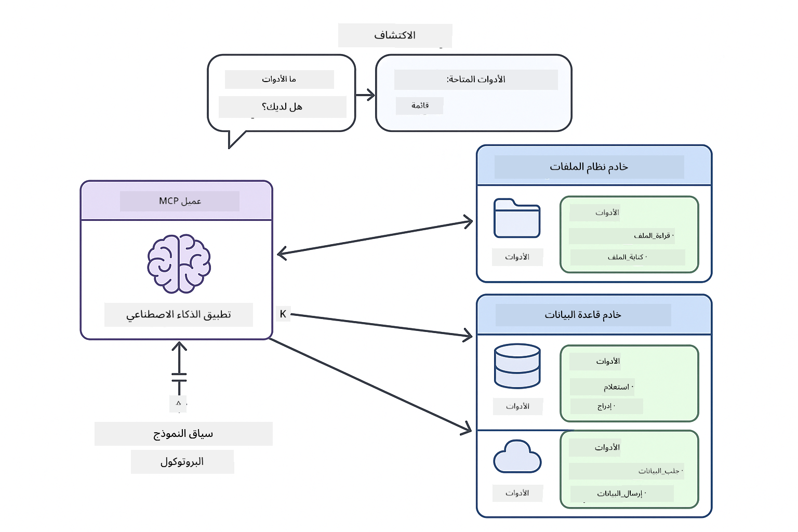

<!--
CO_OP_TRANSLATOR_METADATA:
{
  "original_hash": "c25ec1f10ef156c53e190cdf8b0711ab",
  "translation_date": "2025-12-13T17:37:31+00:00",
  "source_file": "05-mcp/README.md",
  "language_code": "ar"
}
-->
# الوحدة 05: بروتوكول سياق النموذج (MCP)

## جدول المحتويات

- [ما ستتعلمه](../../../05-mcp)
- [فهم MCP](../../../05-mcp)
- [كيف يعمل MCP](../../../05-mcp)
  - [هيكلية الخادم-العميل](../../../05-mcp)
  - [اكتشاف الأدوات](../../../05-mcp)
  - [آليات النقل](../../../05-mcp)
- [المتطلبات الأساسية](../../../05-mcp)
- [ما تغطيه هذه الوحدة](../../../05-mcp)
- [البدء السريع](../../../05-mcp)
  - [المثال 1: الحاسبة البعيدة (HTTP قابل للبث)](../../../05-mcp)
  - [المثال 2: عمليات الملفات (Stdio)](../../../05-mcp)
  - [المثال 3: تحليل Git (Docker)](../../../05-mcp)
- [المفاهيم الرئيسية](../../../05-mcp)
  - [اختيار النقل](../../../05-mcp)
  - [اكتشاف الأدوات](../../../05-mcp)
  - [إدارة الجلسات](../../../05-mcp)
  - [الاعتبارات عبر الأنظمة](../../../05-mcp)
- [متى تستخدم MCP](../../../05-mcp)
- [نظام MCP البيئي](../../../05-mcp)
- [تهانينا!](../../../05-mcp)
  - [ما التالي؟](../../../05-mcp)
- [استكشاف الأخطاء وإصلاحها](../../../05-mcp)

## ما ستتعلمه

لقد أنشأت ذكاءً اصطناعيًا محادثيًا، وأتقنت استخدام المطالبات، وربطت الردود بالوثائق، وأنشأت وكلاء مزودين بأدوات. لكن كل تلك الأدوات كانت مخصصة لتطبيقك الخاص. ماذا لو كان بإمكانك منح ذكاءك الاصطناعي وصولًا إلى نظام بيئي موحد من الأدوات يمكن لأي شخص إنشاؤه ومشاركته؟

يوفر بروتوكول سياق النموذج (MCP) ذلك بالضبط - طريقة معيارية لتطبيقات الذكاء الاصطناعي لاكتشاف واستخدام الأدوات الخارجية. بدلاً من كتابة تكاملات مخصصة لكل مصدر بيانات أو خدمة، تتصل بخوادم MCP التي تعرض قدراتها بصيغة موحدة. يمكن لوكيل الذكاء الاصطناعي الخاص بك اكتشاف هذه الأدوات واستخدامها تلقائيًا.


*قبل MCP: تكاملات معقدة نقطة إلى نقطة. بعد MCP: بروتوكول واحد، إمكانيات لا نهائية.*

## فهم MCP

يحل MCP مشكلة أساسية في تطوير الذكاء الاصطناعي: كل تكامل مخصص. هل تريد الوصول إلى GitHub؟ كود مخصص. هل تريد قراءة ملفات؟ كود مخصص. هل تريد استعلام قاعدة بيانات؟ كود مخصص. ولا تعمل أي من هذه التكاملات مع تطبيقات الذكاء الاصطناعي الأخرى.

يقوم MCP بتوحيد هذا. يعرض خادم MCP الأدوات مع أوصاف واضحة ومخططات. يمكن لأي عميل MCP الاتصال، واكتشاف الأدوات المتاحة، واستخدامها. تبني مرة واحدة، استخدم في كل مكان.



*هيكلية بروتوكول سياق النموذج - اكتشاف وتنفيذ الأدوات الموحد*

## كيف يعمل MCP

**هيكلية الخادم-العميل**

يستخدم MCP نموذج عميل-خادم. توفر الخوادم الأدوات - قراءة الملفات، استعلام قواعد البيانات، استدعاء واجهات برمجة التطبيقات. يتصل العملاء (تطبيق الذكاء الاصطناعي الخاص بك) بالخوادم ويستخدمون أدواتها.

**اكتشاف الأدوات**

عندما يتصل عميلك بخادم MCP، يسأل "ما الأدوات التي لديك؟" يرد الخادم بقائمة الأدوات المتاحة، كل منها مع أوصاف ومخططات المعلمات. يمكن لوكيل الذكاء الاصطناعي الخاص بك بعد ذلك تحديد الأدوات التي يستخدمها بناءً على طلبات المستخدم.

**آليات النقل**

يحدد MCP آليتين للنقل: HTTP للخوادم البعيدة، وStdio للعمليات المحلية (بما في ذلك حاويات Docker):


*آليات نقل MCP: HTTP للخوادم البعيدة، Stdio للعمليات المحلية (بما في ذلك حاويات Docker)*

**HTTP قابل للبث** - [StreamableHttpDemo.java](../../../05-mcp/src/main/java/com/example/langchain4j/mcp/StreamableHttpDemo.java)

لخوادم بعيدة. يقوم تطبيقك بإجراء طلبات HTTP إلى خادم يعمل في مكان ما على الشبكة. يستخدم أحداث الخادم المرسلة للتواصل في الوقت الحقيقي.

```java
McpTransport httpTransport = new StreamableHttpMcpTransport.Builder()
    .url("http://localhost:3001/mcp")
    .timeout(Duration.ofSeconds(60))
    .logRequests(true)
    .logResponses(true)
    .build();
```

> **🤖 جرب مع [GitHub Copilot](https://github.com/features/copilot) Chat:** افتح [`StreamableHttpDemo.java`](../../../05-mcp/src/main/java/com/example/langchain4j/mcp/StreamableHttpDemo.java) واسأل:
> - "كيف يختلف MCP عن التكامل المباشر للأدوات كما في الوحدة 04؟"
> - "ما فوائد استخدام MCP لمشاركة الأدوات عبر التطبيقات؟"
> - "كيف أتعامل مع فشل الاتصال أو انتهاء المهلة مع خوادم MCP؟"

**Stdio** - [StdioTransportDemo.java](../../../05-mcp/src/main/java/com/example/langchain4j/mcp/StdioTransportDemo.java)

للعمليات المحلية. يقوم تطبيقك بإنشاء خادم كعملية فرعية ويتواصل عبر الإدخال/الإخراج القياسي. مفيد للوصول إلى نظام الملفات أو أدوات سطر الأوامر.

```java
McpTransport stdioTransport = new StdioMcpTransport.Builder()
    .command(List.of(
        npmCmd, "exec",
        "@modelcontextprotocol/server-filesystem@0.6.2",
        resourcesDir
    ))
    .logEvents(false)
    .build();
```

> **🤖 جرب مع [GitHub Copilot](https://github.com/features/copilot) Chat:** افتح [`StdioTransportDemo.java`](../../../05-mcp/src/main/java/com/example/langchain4j/mcp/StdioTransportDemo.java) واسأل:
> - "كيف يعمل نقل Stdio ومتى يجب أن أستخدمه مقابل HTTP؟"
> - "كيف يدير LangChain4j دورة حياة عمليات خادم MCP المنشأة؟"
> - "ما هي تداعيات الأمان لمنح الذكاء الاصطناعي الوصول إلى نظام الملفات؟"

**Docker (يستخدم Stdio)** - [GitRepositoryAnalyzer.java](../../../05-mcp/src/main/java/com/example/langchain4j/mcp/GitRepositoryAnalyzer.java)

لخدمات الحاويات. يستخدم نقل stdio للتواصل مع حاوية Docker عبر `docker run`. جيد للاعتمادات المعقدة أو البيئات المعزولة.

```java
McpTransport dockerTransport = new StdioMcpTransport.Builder()
    .command(List.of(
        "docker", "run",
        "-e", "GITHUB_PERSONAL_ACCESS_TOKEN=" + System.getenv("GITHUB_TOKEN"),
        "-v", volumeMapping,
        "-i", "mcp/git"
    ))
    .logEvents(true)
    .build();
```

> **🤖 جرب مع [GitHub Copilot](https://github.com/features/copilot) Chat:** افتح [`GitRepositoryAnalyzer.java`](../../../05-mcp/src/main/java/com/example/langchain4j/mcp/GitRepositoryAnalyzer.java) واسأل:
> - "كيف يعزل نقل Docker خوادم MCP وما هي الفوائد؟"
> - "كيف أُعد تركيب المجلدات لمشاركة البيانات بين المضيف وحاويات MCP؟"
> - "ما هي أفضل الممارسات لإدارة دورات حياة خوادم MCP القائمة على Docker في الإنتاج؟"

## تشغيل الأمثلة

### المتطلبات الأساسية

- جافا 21+، مافن 3.9+
- Node.js 16+ و npm (لخوادم MCP)
- **Docker Desktop** - يجب أن يكون **قيد التشغيل** للمثال 3 (ليس فقط مثبتًا)
- رمز وصول شخصي لـ GitHub مكون في ملف `.env` (من الوحدة 00)

> **ملاحظة:** إذا لم تقم بإعداد رمز GitHub الخاص بك بعد، راجع [الوحدة 00 - البدء السريع](../00-quick-start/README.md) للتعليمات.

> **⚠️ مستخدمو Docker:** قبل تشغيل المثال 3، تحقق من تشغيل Docker Desktop باستخدام `docker ps`. إذا رأيت أخطاء اتصال، ابدأ Docker Desktop وانتظر حوالي 30 ثانية للتهيئة.

## البدء السريع

**باستخدام VS Code:** ببساطة انقر بزر الماوس الأيمن على أي ملف عرض توضيحي في المستكشف واختر **"تشغيل جافا"**، أو استخدم تكوينات الإطلاق من لوحة التشغيل والتصحيح (تأكد من إضافة رمزك إلى ملف `.env` أولاً).

**باستخدام Maven:** بدلاً من ذلك، يمكنك التشغيل من سطر الأوامر باستخدام الأمثلة أدناه.

**⚠️ مهم:** بعض الأمثلة لها متطلبات مسبقة (مثل بدء خادم MCP أو بناء صور Docker). تحقق من متطلبات كل مثال قبل التشغيل.

### المثال 1: الحاسبة البعيدة (HTTP قابل للبث)

يُظهر هذا التكامل القائم على الشبكة للأدوات.

**⚠️ متطلب مسبق:** تحتاج إلى بدء خادم MCP أولاً (انظر الطرفية 1 أدناه).

**الطرفية 1 - بدء خادم MCP:**

**Bash:**
```bash
git clone https://github.com/modelcontextprotocol/servers.git
cd servers/src/everything
npm install
node dist/streamableHttp.js
```

**PowerShell:**
```powershell
git clone https://github.com/modelcontextprotocol/servers.git
cd servers/src/everything
npm install
node dist/streamableHttp.js
```

**الطرفية 2 - تشغيل المثال:**

**باستخدام VS Code:** انقر بزر الماوس الأيمن على `StreamableHttpDemo.java` واختر **"تشغيل جافا"**.

**باستخدام Maven:**

**Bash:**
```bash
export GITHUB_TOKEN=your_token_here
cd 05-mcp
mvn compile exec:java -Dexec.mainClass=com.example.langchain4j.mcp.StreamableHttpDemo
```

**PowerShell:**
```powershell
$env:GITHUB_TOKEN=your_token_here
cd 05-mcp
mvn --% compile exec:java -Dexec.mainClass=com.example.langchain4j.mcp.StreamableHttpDemo
```

شاهد الوكيل يكتشف الأدوات المتاحة، ثم استخدم الحاسبة لإجراء عملية جمع.

### المثال 2: عمليات الملفات (Stdio)

يُظهر هذا الأدوات القائمة على العمليات الفرعية المحلية.

**✅ لا حاجة لمتطلبات مسبقة** - يتم إنشاء خادم MCP تلقائيًا.

**باستخدام VS Code:** انقر بزر الماوس الأيمن على `StdioTransportDemo.java` واختر **"تشغيل جافا"**.

**باستخدام Maven:**

**Bash:**
```bash
export GITHUB_TOKEN=your_token_here
cd 05-mcp
mvn compile exec:java -Dexec.mainClass=com.example.langchain4j.mcp.StdioTransportDemo
```

**PowerShell:**
```powershell
$env:GITHUB_TOKEN=your_token_here
cd 05-mcp
mvn --% compile exec:java -Dexec.mainClass=com.example.langchain4j.mcp.StdioTransportDemo
```

يقوم التطبيق بإنشاء خادم MCP لنظام الملفات تلقائيًا ويقرأ ملفًا محليًا. لاحظ كيف تتم إدارة العملية الفرعية نيابة عنك.

**الناتج المتوقع:**
```
Assistant response: The content of the file is "Kaboom!".
```

### المثال 3: تحليل Git (Docker)

يُظهر هذا خوادم أدوات محمولة في حاويات.

**⚠️ المتطلبات المسبقة:** 
1. **يجب أن يكون Docker Desktop قيد التشغيل** (ليس فقط مثبتًا)
2. **مستخدمو ويندوز:** يوصى بوضع WSL 2 (إعدادات Docker Desktop → عام → "استخدام محرك WSL 2"). وضع Hyper-V يتطلب تكوين مشاركة الملفات يدويًا.
3. تحتاج إلى بناء صورة Docker أولاً (انظر الطرفية 1 أدناه)

**تحقق من تشغيل Docker:**

**Bash:**
```bash
docker ps  # يجب أن يعرض قائمة الحاويات، وليس خطأً
```

**PowerShell:**
```powershell
docker ps  # يجب عرض قائمة الحاويات، وليس خطأ
```

إذا رأيت خطأ مثل "لا يمكن الاتصال بخادم Docker" أو "النظام لا يمكنه العثور على الملف المحدد"، ابدأ Docker Desktop وانتظر حتى يتهيأ (~30 ثانية).

**استكشاف الأخطاء وإصلاحها:**
- إذا أبلغ الذكاء الاصطناعي عن مستودع فارغ أو لا ملفات، فإن تركيب المجلد (`-v`) لا يعمل.
- **مستخدمو Windows Hyper-V:** أضف دليل المشروع إلى إعدادات Docker Desktop → الموارد → مشاركة الملفات، ثم أعد تشغيل Docker Desktop.
- **الحل الموصى به:** التبديل إلى وضع WSL 2 للمشاركة التلقائية للملفات (الإعدادات → عام → تفعيل "استخدام محرك WSL 2").

**الطرفية 1 - بناء صورة Docker:**

**Bash:**
```bash
cd servers/src/git
docker build -t mcp/git .
```

**PowerShell:**
```powershell
cd servers/src/git
docker build -t mcp/git .
```

**الطرفية 2 - تشغيل المحلل:**

**باستخدام VS Code:** انقر بزر الماوس الأيمن على `GitRepositoryAnalyzer.java` واختر **"تشغيل جافا"**.

**باستخدام Maven:**

**Bash:**
```bash
export GITHUB_TOKEN=your_token_here
cd 05-mcp
mvn compile exec:java -Dexec.mainClass=com.example.langchain4j.mcp.GitRepositoryAnalyzer
```

**PowerShell:**
```powershell
$env:GITHUB_TOKEN=your_token_here
cd 05-mcp
mvn --% compile exec:java -Dexec.mainClass=com.example.langchain4j.mcp.GitRepositoryAnalyzer
```

يقوم التطبيق بتشغيل حاوية Docker، ويركب مستودعك، ويحلل هيكل المستودع ومحتوياته من خلال وكيل الذكاء الاصطناعي.

## المفاهيم الرئيسية

**اختيار النقل**

اختر بناءً على مكان وجود أدواتك:
- الخدمات البعيدة → HTTP قابل للبث
- نظام الملفات المحلي → Stdio
- الاعتمادات المعقدة → Docker

**اكتشاف الأدوات**

يكتشف عملاء MCP الأدوات المتاحة تلقائيًا عند الاتصال. يرى وكيل الذكاء الاصطناعي أوصاف الأدوات ويقرر أيها يستخدم بناءً على طلب المستخدم.

**إدارة الجلسات**

يحافظ نقل HTTP القابل للبث على الجلسات، مما يسمح بتفاعلات حالة مع الخوادم البعيدة. عادة ما تكون نقلات Stdio وDocker بدون حالة.

**الاعتبارات عبر الأنظمة**

تتعامل الأمثلة تلقائيًا مع اختلافات الأنظمة (اختلافات أوامر ويندوز مقابل يونكس، تحويل المسارات لـ Docker). هذا مهم للنشر في بيئات مختلفة.

## متى تستخدم MCP

**استخدم MCP عندما:**
- تريد الاستفادة من أنظمة الأدوات الموجودة
- بناء أدوات ستستخدمها تطبيقات متعددة
- دمج خدمات طرف ثالث ببروتوكولات معيارية
- تحتاج إلى تبديل تنفيذ الأدوات بدون تغييرات في الكود

**استخدم الأدوات المخصصة (الوحدة 04) عندما:**
- بناء وظائف خاصة بالتطبيق
- الأداء مهم (MCP يضيف عبء)
- أدواتك بسيطة ولن تُعاد استخدامها
- تحتاج إلى تحكم كامل في التنفيذ


## نظام MCP البيئي

بروتوكول سياق النموذج هو معيار مفتوح مع نظام بيئي متنامي:

- خوادم MCP رسمية للمهام الشائعة (نظام الملفات، Git، قواعد البيانات)
- خوادم مساهمة من المجتمع لخدمات متنوعة
- أوصاف ومخططات أدوات موحدة
- توافق عبر الأُطُر (يعمل مع أي عميل MCP)

هذا التوحيد يعني أن الأدوات المبنية لتطبيق ذكاء اصطناعي واحد تعمل مع الآخرين، مما يخلق نظامًا بيئيًا مشتركًا من القدرات.

## تهانينا!

لقد أكملت دورة LangChain4j للمبتدئين. لقد تعلمت:

- كيفية بناء ذكاء اصطناعي محادثي مع ذاكرة (الوحدة 01)
- أنماط هندسة المطالبات لمهام مختلفة (الوحدة 02)
- ربط الردود بوثائقك باستخدام RAG (الوحدة 03)
- إنشاء وكلاء ذكاء اصطناعي بأدوات مخصصة (الوحدة 04)
- دمج أدوات موحدة عبر MCP (الوحدة 05)

لديك الآن الأساس لبناء تطبيقات ذكاء اصطناعي للإنتاج. المفاهيم التي تعلمتها تنطبق بغض النظر عن الأُطُر أو النماذج المحددة - إنها أنماط أساسية في هندسة الذكاء الاصطناعي.

### ما التالي؟

بعد إكمال الوحدات، استكشف [دليل الاختبار](../docs/TESTING.md) لرؤية مفاهيم اختبار LangChain4j في التطبيق.

**الموارد الرسمية:**
- [توثيق LangChain4j](https://docs.langchain4j.dev/) - أدلة شاملة ومرجع API
- [LangChain4j على GitHub](https://github.com/langchain4j/langchain4j) - الشيفرة المصدرية والأمثلة
- [دروس LangChain4j](https://docs.langchain4j.dev/tutorials/) - دروس خطوة بخطوة لحالات استخدام مختلفة

شكرًا لإكمالك هذه الدورة!

---

**التنقل:** [← السابق: الوحدة 04 - الأدوات](../04-tools/README.md) | [العودة إلى الرئيسي](../README.md)

---

## استكشاف الأخطاء وإصلاحها

### صياغة أمر Maven في PowerShell
**المشكلة**: تفشل أوامر Maven مع الخطأ `Unknown lifecycle phase ".mainClass=..."`

**السبب**: يقوم PowerShell بتفسير `=` كعامل تعيين متغير، مما يكسر بناء جملة خاصية Maven

**الحل**: استخدم عامل إيقاف التحليل `--%` قبل أمر Maven:

**PowerShell:**
```powershell
mvn --% compile exec:java -Dexec.mainClass=com.example.langchain4j.mcp.StreamableHttpDemo
```

**Bash:**
```bash
mvn compile exec:java -Dexec.mainClass=com.example.langchain4j.mcp.StreamableHttpDemo
```

يخبر عامل `--%` PowerShell بتمرير جميع الوسائط المتبقية حرفيًا إلى Maven دون تفسير.

### مشاكل الاتصال بـ Docker

**المشكلة**: تفشل أوامر Docker مع "Cannot connect to Docker daemon" أو "The system cannot find the file specified"

**السبب**: لم يتم تشغيل Docker Desktop أو لم يتم تهيئته بالكامل

**الحل**: 
1. ابدأ تشغيل Docker Desktop
2. انتظر حوالي 30 ثانية للتهيئة الكاملة
3. تحقق باستخدام `docker ps` (يجب أن يعرض قائمة الحاويات، وليس خطأ)
4. ثم نفذ المثال الخاص بك

### تركيب مجلدات Docker على ويندوز

**المشكلة**: محلل مستودع Git يبلغ عن مستودع فارغ أو لا يحتوي على ملفات

**السبب**: تركيب المجلد (`-v`) لا يعمل بسبب إعدادات مشاركة الملفات

**الحل**:
- **موصى به:** التحويل إلى وضع WSL 2 (إعدادات Docker Desktop → عام → "Use the WSL 2 based engine")
- **بديل (Hyper-V):** أضف دليل المشروع إلى إعدادات Docker Desktop → الموارد → مشاركة الملفات، ثم أعد تشغيل Docker Desktop

---

<!-- CO-OP TRANSLATOR DISCLAIMER START -->
**إخلاء المسؤولية**:  
تمت ترجمة هذا المستند باستخدام خدمة الترجمة الآلية [Co-op Translator](https://github.com/Azure/co-op-translator). بينما نسعى لتحقيق الدقة، يرجى العلم أن الترجمات الآلية قد تحتوي على أخطاء أو عدم دقة. يجب اعتبار المستند الأصلي بلغته الأصلية المصدر الموثوق به. للمعلومات الهامة، يُنصح بالاعتماد على الترجمة البشرية المهنية. نحن غير مسؤولين عن أي سوء فهم أو تفسير ناتج عن استخدام هذه الترجمة.
<!-- CO-OP TRANSLATOR DISCLAIMER END -->