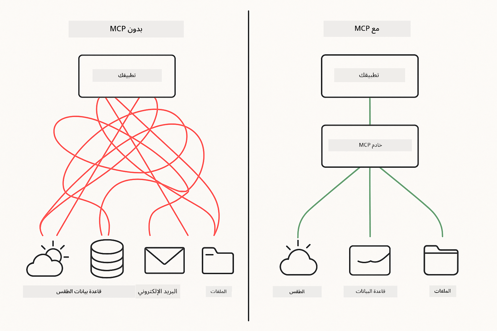
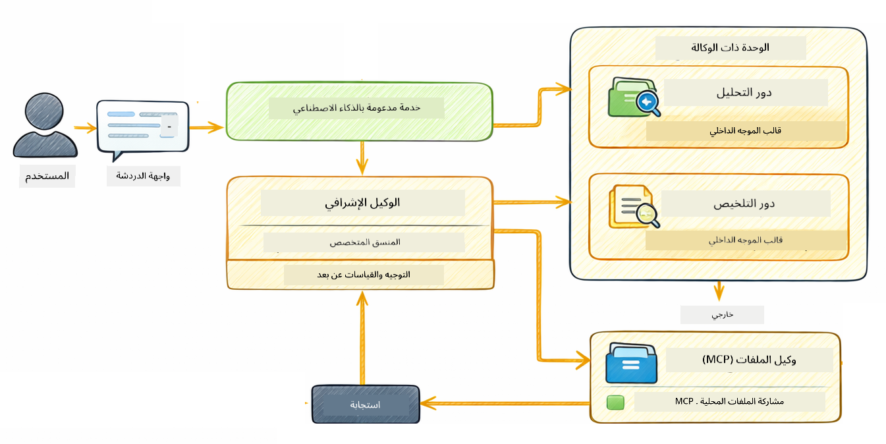

<!--
CO_OP_TRANSLATOR_METADATA:
{
  "original_hash": "f89f4c106d110e4943c055dd1a2f1dff",
  "translation_date": "2025-12-30T20:13:52+00:00",
  "source_file": "05-mcp/README.md",
  "language_code": "ar"
}
-->
# الوحدة 05: بروتوكول سياق النموذج (MCP)

## جدول المحتويات

- [ما ستتعلمونه](../../../05-mcp)
- [ما هو MCP؟](../../../05-mcp)
- [كيف يعمل MCP](../../../05-mcp)
- [الوحدة العاملية](../../../05-mcp)
- [تشغيل الأمثلة](../../../05-mcp)
  - [المتطلبات المسبقة](../../../05-mcp)
- [البدء السريع](../../../05-mcp)
  - [عمليات الملفات (Stdio)](../../../05-mcp)
  - [عميل المشرف](../../../05-mcp)
    - [فهم المخرجات](../../../05-mcp)
    - [شرح ميزات الوحدة العاملية](../../../05-mcp)
- [المفاهيم الأساسية](../../../05-mcp)
- [تهانينا!](../../../05-mcp)
  - [ما التالي؟](../../../05-mcp)

## ما ستتعلمونه

لقد أنشأت ذكاءً اصطناعياً محادثياً، وتعرفت على إتقان الصياغات، وأثبتت صحة الردود في المستندات، وأنشأت وكلاء مزودين بأدوات. لكن كل تلك الأدوات كانت مبنية حسب الطلب لتطبيقك الخاص. ماذا لو كان بإمكانك منح ذكائك الاصطناعي إمكانية الوصول إلى نظام بيئي معياري من الأدوات التي يمكن لأي شخص إنشاؤها ومشاركتها؟ في هذه الوحدة، ستتعلم كيفية القيام بذلك باستخدام بروتوكول سياق النموذج (MCP) ووحدة agentic في LangChain4j. نعرض أولاً قارئ ملفات MCP بسيطًا ثم نوضح كيف يندمج بسهولة في سير عمل وكيل متقدم باستخدام نمط عميل المشرف.

## ما هو MCP؟

يبث بروتوكول سياق النموذج (MCP) هذا بالضبط - طريقة معيارية لتطبيقات الذكاء الاصطناعي لاكتشاف واستخدام الأدوات الخارجية. بدلاً من كتابة تكاملات مخصصة لكل مصدر بيانات أو خدمة، تتصل بخوادم MCP التي تعرض إمكانياتها بصيغة متسقة. يمكن لوكيل الذكاء الاصطناعي الخاص بك بعد ذلك اكتشاف هذه الأدوات واستخدامها تلقائياً.



*قبل MCP: تكاملات معقدة نقطة بنقطة. بعد MCP: بروتوكول واحد، إمكانيات لا نهائية.*

يعالج MCP مشكلة أساسية في تطوير الذكاء الاصطناعي: كل تكامل مخصص. تريد الوصول إلى GitHub؟ كود مخصص. تريد قراءة ملفات؟ كود مخصص. تريد الاستعلام في قاعدة بيانات؟ كود مخصص. ولا تعمل أي من هذه التكاملات مع تطبيقات الذكاء الاصطناعي الأخرى.

يقوم MCP بتوحيد ذلك. يكشف خادم MCP عن أدوات مع أوصاف ومخططات معلمات واضحة. يمكن لأي عميل MCP الاتصال، واكتشاف الأدوات المتاحة، واستخدامها. ابنِ مرة، استخدم في كل مكان.


*بنية بروتوكول سياق النموذج - اكتشاف وتنفيذ الأدوات بشكل معيارى*

## كيف يعمل MCP

**بنية خادم-عميل**

يستخدم MCP نموذج خادم-عميل. يوفر الخوادم أدوات - قراءة الملفات، الاستعلام في قواعد البيانات، استدعاء واجهات برمجة التطبيقات. تتصل العملاء (تطبيق الذكاء الاصطناعي الخاص بك) بالخوادم وتستخدم أدواتها.

لاستخدام MCP مع LangChain4j، أضف هذا الاعتماد إلى Maven:

```xml
<dependency>
    <groupId>dev.langchain4j</groupId>
    <artifactId>langchain4j-mcp</artifactId>
    <version>${langchain4j.version}</version>
</dependency>
```

**اكتشاف الأدوات**

عند اتصال عميلك بخادم MCP، يسأل "ما الأدوات التي لديك؟" يرد الخادم بقائمة الأدوات المتاحة، كلٌ معها أوصاف ومخططات معلمات. يمكن لوكيل الذكاء الاصطناعي الخاص بك بعد ذلك أن يقرر أي الأدوات يستخدم بناءً على طلبات المستخدم.

**آليات النقل**

يدعم MCP آليات نقل مختلفة. توضح هذه الوحدة نقل Stdio للعمليات المحلية:


*آليات نقل MCP: HTTP للخوادم البعيدة، Stdio للعمليات المحلية*

**Stdio** - [StdioTransportDemo.java](../../../05-mcp/src/main/java/com/example/langchain4j/mcp/StdioTransportDemo.java)

للعمليات المحلية. يقوم تطبيقك بإنشاء خادم كعملية فرعية ويتواصل عبر الإدخال/الإخراج القياسيين. مفيد للوصول إلى نظام الملفات أو أدوات سطر الأوامر.

```java
McpTransport stdioTransport = new StdioMcpTransport.Builder()
    .command(List.of(
        npmCmd, "exec",
        "@modelcontextprotocol/server-filesystem@2025.12.18",
        resourcesDir
    ))
    .logEvents(false)
    .build();
```

> **🤖 جرب مع [GitHub Copilot](https://github.com/features/copilot) Chat:** افتح [`StdioTransportDemo.java`](../../../05-mcp/src/main/java/com/example/langchain4j/mcp/StdioTransportDemo.java) واسأل:
> - "كيف يعمل نقل Stdio ومتى يجب استخدامه مقابل HTTP؟"
> - "كيف يدير LangChain4j دورة حياة عمليات خادم MCP المنشأة فرعياً؟"
> - "ما الآثار الأمنية لمنح الذكاء الاصطناعي الوصول إلى نظام الملفات؟"

## الوحدة العاملية

بينما يوفر MCP أدوات معيارية، توفر وحدة **agentic** في LangChain4j طريقة إعلانية لبناء وكلاء ينظمون تلك الأدوات. تسمح التعليمة @Agent و AgenticServices بتعريف سلوك الوكيل من خلال واجهات بدلاً من الكود الإمبراطوري.

في هذه الوحدة، ستستكشف نمط **عميل المشرف** — نهج وكيل عامل متقدم حيث يقرر وكيل "المشرف" ديناميكيًا أي وكلاء فرعيين يستدعي استنادًا إلى طلبات المستخدم. سنجمع المفهومين من خلال منح أحد وكلائنا الفرعيين إمكانيات الوصول إلى ملفات مدعومة بـ MCP.

لاستخدام الوحدة العاملية، أضف هذا الاعتماد إلى Maven:

```xml
<dependency>
    <groupId>dev.langchain4j</groupId>
    <artifactId>langchain4j-agentic</artifactId>
    <version>${langchain4j.mcp.version}</version>
</dependency>
```

> **⚠️ تجريبي:** وحدة `langchain4j-agentic` هي **تجريبية** وقابلة للتغيير. الطريقة المستقرة لبناء مساعدين ذكاء اصطناعي تظل `langchain4j-core` مع أدوات مخصصة (الوحدة 04).

## تشغيل الأمثلة

### المتطلبات المسبقة

- Java 21+، Maven 3.9+
- Node.js 16+ و npm (لخوادم MCP)
- متغيرات البيئة مهيأة في ملف `.env` (من الدليل الجذري):
  - **لتشغيل StdioTransportDemo:** `GITHUB_TOKEN` (رمز وصول شخصي لـ GitHub)
  - **لتشغيل SupervisorAgentDemo:** `AZURE_OPENAI_ENDPOINT`, `AZURE_OPENAI_API_KEY`, `AZURE_OPENAI_DEPLOYMENT` (نفس ما في الوحدات 01-04)

> **ملاحظة:** إذا لم تكن قد أعددت متغيرات البيئة بعد، راجع [Module 00 - Quick Start](../00-quick-start/README.md) للحصول على إرشادات، أو انسخ `.env.example` إلى `.env` في الدليل الجذري واملأ قيمك.

## البدء السريع

**باستخدام VS Code:** ببساطة انقر بزر الماوس الأيمن على أي ملف عرض توضيحي في المستكشف واختر **"Run Java"**، أو استخدم تكوينات التشغيل من لوحة Run and Debug (تأكد من إضافة الرمز المميز إلى ملف `.env` أولاً).

**باستخدام Maven:** بدلاً من ذلك، يمكنك التشغيل من سطر الأوامر باستخدام الأمثلة أدناه.

### عمليات الملفات (Stdio)

يظهر هذا الأدوات المستندة إلى عمليات فرعية محلية.

**✅ لا حاجة لمتطلبات مسبقة** - يتم إنشاء خادم MCP تلقائيًا كعملية فرعية.

**باستخدام VS Code:** انقر بزر الماوس الأيمن على `StdioTransportDemo.java` واختر **"Run Java"**.

**باستخدام Maven:**

**Bash:**
```bash
export GITHUB_TOKEN=your_token_here
cd 05-mcp
mvn compile exec:java -Dexec.mainClass=com.example.langchain4j.mcp.StdioTransportDemo
```

**PowerShell:**
```powershell
$env:GITHUB_TOKEN=your_token_here
cd 05-mcp
mvn --% compile exec:java -Dexec.mainClass=com.example.langchain4j.mcp.StdioTransportDemo
```

يقوم التطبيق بإنشاء خادم MCP لنظام الملفات تلقائيًا ويقرأ ملفًا محليًا. لاحظ كيف يتم التعامل مع إدارة العملية الفرعية نيابة عنك.

**المخرجات المتوقعة:**
```
Assistant response: The file provides an overview of LangChain4j, an open-source Java library
for integrating Large Language Models (LLMs) into Java applications...
```

### عميل المشرف




نمط **عميل المشرف** هو شكل **مرن** من الذكاء الاصطناعي العامل. على عكس تدفقات العمل الحتمية (التسلسلية، الحلقية، المتوازية)، يستخدم المشرف نموذجًا لغويًا كبيرًا ليقرر بشكل مستقل أي وكلاء يستدعي بناءً على طلب المستخدم.

**دمج المشرف مع MCP:** في هذا المثال، نعطي `FileAgent` وصولاً إلى أدوات نظام الملفات عبر MCP من خلال `toolProvider(mcpToolProvider)`. عندما يطلب المستخدم "قراءة وتحليل ملف"، يقوم المشرف بتحليل الطلب ويولد خطة تنفيذ. ثم يقوم بتوجيه الطلب إلى `FileAgent`، الذي يستخدم أداة MCP `read_file` لاسترجاع المحتوى. ينقل المشرف ذلك المحتوى إلى `AnalysisAgent` للتفسير، وقد يستدعي اختياريًا `SummaryAgent` لتكثيف النتائج.

يوضح هذا كيف تندمج أدوات MCP بسلاسة في تدفقات العمل العاملية — لا يحتاج المشرف إلى معرفة طريقة قراءة الملفات، بل فقط أن `FileAgent` يمكنه فعل ذلك. يتكيف المشرف ديناميكيًا مع أنواع الطلبات المختلفة ويعيد إما استجابة الوكيل الأخير أو ملخصًا لكل العمليات.

**استخدام سكربتات البدء (موصى به):**

تقوم سكربتات البدء بتحميل متغيرات البيئة تلقائيًا من ملف `.env` الجذري:

**Bash:**
```bash
cd 05-mcp
chmod +x start.sh
./start.sh
```

**PowerShell:**
```powershell
cd 05-mcp
.\start.ps1
```

**باستخدام VS Code:** انقر بزر الماوس الأيمن على `SupervisorAgentDemo.java` واختر **"Run Java"** (تأكد من تهيئة ملف `.env`).

**كيف يعمل المشرف:**

```java
// تعريف عدة وكلاء بقدرات محددة
FileAgent fileAgent = AgenticServices.agentBuilder(FileAgent.class)
        .chatModel(model)
        .toolProvider(mcpToolProvider)  // يمتلك أدوات MCP لعمليات الملفات
        .build();

AnalysisAgent analysisAgent = AgenticServices.agentBuilder(AnalysisAgent.class)
        .chatModel(model)
        .build();

SummaryAgent summaryAgent = AgenticServices.agentBuilder(SummaryAgent.class)
        .chatModel(model)
        .build();

// إنشاء مشرف ينسق هؤلاء الوكلاء
SupervisorAgent supervisor = AgenticServices.supervisorBuilder()
        .chatModel(model)  // نموذج "المخطط"
        .subAgents(fileAgent, analysisAgent, summaryAgent)
        .responseStrategy(SupervisorResponseStrategy.SUMMARY)
        .build();

// المشرف يقرر بشكل مستقل أي الوكلاء يستدعي
// فقط مرّر طلبًا باللغة الطبيعية - يخطط نموذج اللغة الكبير لتنفيذها
String response = supervisor.invoke("Read the file at /path/file.txt and analyze it");
```

انظر [SupervisorAgentDemo.java](../../../05-mcp/src/main/java/com/example/langchain4j/mcp/SupervisorAgentDemo.java) للحصول على التنفيذ الكامل.

> **🤖 جرب مع [GitHub Copilot](https://github.com/features/copilot) Chat:** افتح [`SupervisorAgentDemo.java`](../../../05-mcp/src/main/java/com/example/langchain4j/mcp/SupervisorAgentDemo.java) واسأل:
> - "كيف يقرر المشرف أي وكلاء يستدعي؟"
> - "ما الفرق بين نمط المشرف ونماذج تدفق العمل التسلسلية؟"
> - "كيف يمكنني تخصيص سلوك تخطيط المشرف؟"

#### فهم المخرجات

عند تشغيل العرض التوضيحي، سترى عرضًا منسقًا لكيفية تنظيم المشرف لعدة وكلاء. هذا ما يعنيه كل قسم:

```
======================================================================
  SUPERVISOR AGENT DEMO
======================================================================

This demo shows how a Supervisor Agent orchestrates multiple specialized agents.
The Supervisor uses an LLM to decide which agent to call based on the task.
```

**العنوان** يقدم العرض التوضيحي ويشرح الفكرة الأساسية: يستخدم المشرف نموذجًا لغويًا كبيرًا (ليس قواعد مبرمجة ثابتة) ليقرر أي وكلاء يستدعي.

```
--- AVAILABLE AGENTS -------------------------------------------------
  [FILE]     FileAgent     - Reads files using MCP filesystem tools
  [ANALYZE]  AnalysisAgent - Analyzes content for structure, tone, and themes
  [SUMMARY]  SummaryAgent  - Creates concise summaries of content
```

**الوكلاء المتاحون** يظهر الوكلاء المتخصصين الثلاثة التي يمكن للمشرف الاختيار منها. كل وكيل لديه قدرة محددة:
- **FileAgent** يمكنه قراءة الملفات باستخدام أدوات MCP (قدرة خارجية)
- **AnalysisAgent** يحلل المحتوى (قدرة تعتمد على النموذج اللغوي فقط)
- **SummaryAgent** ينشئ ملخصات (قدرة تعتمد على النموذج اللغوي فقط)

```
--- USER REQUEST -----------------------------------------------------
  "Read the file at .../file.txt and analyze what it's about"
```

**طلب المستخدم** يظهر ما طُلِب. يجب على المشرف تحليل هذا وتقرير أي الوكلاء يستدعي.

```
--- SUPERVISOR ORCHESTRATION -----------------------------------------
  The Supervisor will now decide which agents to invoke and in what order...

  +-- STEP 1: Supervisor chose -> FileAgent (reading file via MCP)
  |
  |   Input: .../file.txt
  |
  |   Result: LangChain4j is an open-source Java library designed to simplify...
  +-- [OK] FileAgent (reading file via MCP) completed

  +-- STEP 2: Supervisor chose -> AnalysisAgent (analyzing content)
  |
  |   Input: LangChain4j is an open-source Java library...
  |
  |   Result: Structure: The content is organized into clear paragraphs that int...
  +-- [OK] AnalysisAgent (analyzing content) completed
```

**تنسيق المشرف** هو المكان الذي يحدث فيه السحر. راقب كيف:
1. اختار المشرف **FileAgent أولاً** لأن الطلب ذكر "قراءة الملف"
2. استخدم FileAgent أداة MCP `read_file` لاسترجاع محتويات الملف
3. ثم اختار المشرف **AnalysisAgent** ومرّر له محتويات الملف
4. حلل AnalysisAgent البنية والنبرة والموضوعات

لاحظ أن المشرف اتخذ هذه القرارات **بشكل مستقل** استنادًا إلى طلب المستخدم — لا توجد سير عمل مبرمج صلبًا!

**الاستجابة النهائية** هي إجابة المشرف المركبة، تجمع مخرجات جميع الوكلاء الذين استدعاهم. يعرض المثال نطاق الوكلاء الذي يفرغ الملخص ونتائج التحليل المخزنة بواسطة كل وكيل.

```
--- FINAL RESPONSE ---------------------------------------------------
I read the contents of the file and analyzed its structure, tone, and key themes.
The file introduces LangChain4j as an open-source Java library for integrating
large language models...

--- AGENTIC SCOPE (Shared Memory) ------------------------------------
  Agents store their results in a shared scope for other agents to use:
  * summary: LangChain4j is an open-source Java library...
  * analysis: Structure: The content is organized into clear paragraphs that in...
```

### شرح ميزات الوحدة العاملية

يوضح المثال عدة ميزات متقدمة لوحدة agentic. لنلقي نظرة أقرب على نطاق الوكلاء ومستمعي الوكلاء.

**نطاق الوكلاء** يظهر الذاكرة المشتركة حيث خزّن الوكلاء نتائجهم باستخدام `@Agent(outputKey="...")`. هذا يسمح بـ:
- وصول وكلاء لاحقين إلى مخرجات الوكلاء الأقدم
- تمكن المشرف من تركيب استجابة نهائية
- إمكانية فحص ما أنتجه كل وكيل

```java
ResultWithAgenticScope<String> result = supervisor.invokeWithAgenticScope(request);
AgenticScope scope = result.agenticScope();
String story = scope.readState("story");
List<AgentInvocation> history = scope.agentInvocations("analysisAgent");
```

**مستمعو الوكلاء** يتيحون مراقبة وتصحيح تنفيذ الوكلاء. المخرجات خطوة بخطوة التي تراها في العرض تأتي من AgentListener يتصل بكل استدعاء وكيل:
- **beforeAgentInvocation** - يستدعى عندما يختار المشرف وكيلًا، مما يتيح لك رؤية الوكيل المختار ولماذا
- **afterAgentInvocation** - يستدعى عندما يكمل الوكيل عمله، مظهرًا نتيجته
- **inheritedBySubagents** - عندما تكون true، يراقب المستمع جميع الوكلاء في التسلسل الهرمي

```java
AgentListener monitor = new AgentListener() {
    private int step = 0;
    
    @Override
    public void beforeAgentInvocation(AgentRequest request) {
        step++;
        System.out.println("  +-- STEP " + step + ": " + request.agentName());
    }
    
    @Override
    public void afterAgentInvocation(AgentResponse response) {
        System.out.println("  +-- [OK] " + response.agentName() + " completed");
    }
    
    @Override
    public boolean inheritedBySubagents() {
        return true; // نشر إلى جميع الوكلاء الفرعيين
    }
};
```

بعيدًا عن نمط المشرف، توفر وحدة `langchain4j-agentic` عدة أنماط تدفق عمل وميزات قوية:

| Pattern | Description | Use Case |
|---------|-------------|----------|
| **Sequential** | Execute agents in order, output flows to next | Pipelines: research → analyze → report |
| **Parallel** | Run agents simultaneously | Independent tasks: weather + news + stocks |
| **Loop** | Iterate until condition met | Quality scoring: refine until score ≥ 0.8 |
| **Conditional** | Route based on conditions | Classify → route to specialist agent |
| **Human-in-the-Loop** | Add human checkpoints | Approval workflows, content review |

## المفاهيم الأساسية

**MCP** مثالي عندما تريد الاستفادة من أنظمة أدوات قائمة، بناء أدوات يمكن لتطبيقات متعددة مشاركتها، دمج خدمات طرف ثالث عبر بروتوكولات معيارية، أو استبدال تنفيذات الأدوات دون تغيير الكود.

**الوحدة العاملية** تعمل بشكل أفضل عندما تريد تعريف وكلاء إعلانيًا باستخدام تعليمة @Agent، تحتاج إلى تنظيم تدفقات العمل (تسلسلي، حلقي، متوازي)، تفضل تصميم الوكلاء المعتمد على الواجهات بدلًا من الكود الإمبراطوري، أو تجمع عدة وكلاء يشاركون المخرجات عبر `outputKey`.

**نمط عميل المشرف** يتألق عندما لا يكون سير العمل قابلاً للتنبؤ مسبقًا وتريد أن يقرر النموذج اللغوي الكبير، عندما تمتلك عدة وكلاء متخصصين يحتاجون إلى تنظيم ديناميكي، عند بناء أنظمة محادثة توجه إلى قدرات مختلفة، أو عندما تريد أكثر سلوك وكيل مرن وتكيفًا.

## تهانينا!

لقد أكملت دورة LangChain4j للمبتدئين. لقد تعلمت:

- كيفية بناء ذكاء اصطناعي محادثي مع ذاكرة (الوحدة 01)
- أنماط هندسة الصياغات لمهام مختلفة (الوحدة 02)
- أسس ردود معتمدة على مستنداتك باستخدام RAG (الوحدة 03)
- إنشاء وكلاء ذكاء اصطناعي أساسيين (مساعدين) بأدوات مخصصة (الوحدة 04)
- دمج الأدوات الموحدة مع LangChain4j MCP and Agentic modules (Module 05)

### ما التالي؟

بعد إكمال الوحدات، استكشف [دليل الاختبار](../docs/TESTING.md) لرؤية مفاهيم اختبار LangChain4j قيد التنفيذ.

**الموارد الرسمية:**
- [وثائق LangChain4j](https://docs.langchain4j.dev/) - أدلة شاملة ومرجع واجهة برمجة التطبيقات
- [مستودع LangChain4j على GitHub](https://github.com/langchain4j/langchain4j) - الشيفرة المصدرية والأمثلة
- [دروس LangChain4j](https://docs.langchain4j.dev/tutorials/) - دروس إرشادية خطوة بخطوة لحالات استخدام مختلفة

شكراً لإكمالك هذه الدورة!

---

**التنقّل:** [← السابق: Module 04 - Tools](../04-tools/README.md) | [العودة إلى الصفحة الرئيسية](../README.md)

---

<!-- CO-OP TRANSLATOR DISCLAIMER START -->
إخلاء المسؤولية:
تمت ترجمة هذا المستند باستخدام خدمة الترجمة بالذكاء الاصطناعي [Co-op Translator](https://github.com/Azure/co-op-translator). بينما نسعى إلى الدقة، يرجى العلم أن الترجمات الآلية قد تحتوي على أخطاء أو عدم دقة. يجب اعتبار المستند الأصلي بلغته الأصلية المصدر المعتمد. بالنسبة للمعلومات الحساسة أو الحرجة، يُنصح بالاستعانة بترجمة بشرية محترفة. لا نتحمل أي مسؤولية عن أي سوء فهم أو تفسير خاطئ ينشأ عن استخدام هذه الترجمة.
<!-- CO-OP TRANSLATOR DISCLAIMER END -->