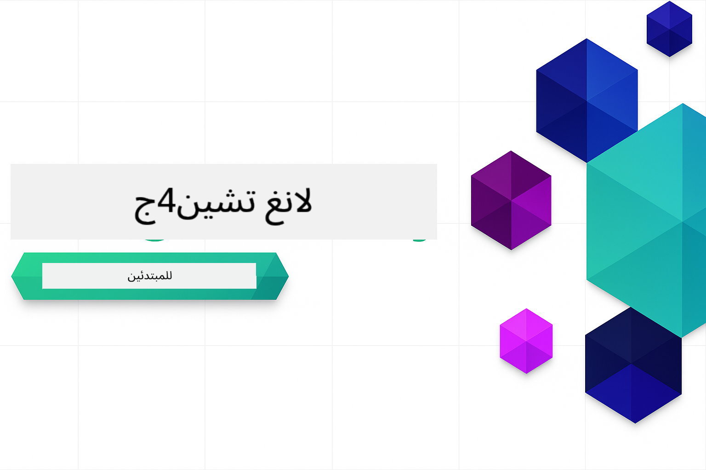
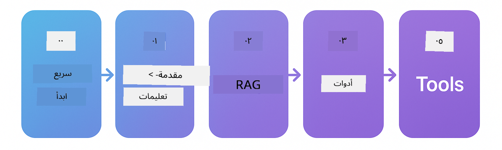

<!--
CO_OP_TRANSLATOR_METADATA:
{
  "original_hash": "1dccdb1a8e2b8ed18e6dea22e823c608",
  "translation_date": "2025-12-19T08:09:52+00:00",
  "source_file": "README.md",
  "language_code": "ar"
}
-->


### 🌐 دعم متعدد اللغات

#### مدعوم عبر GitHub Action (آلي ودائم التحديث)

<!-- CO-OP TRANSLATOR LANGUAGES TABLE START -->
[العربية](./README.md) | [البنغالية](../bn/README.md) | [البلغارية](../bg/README.md) | [البورمية (ميانمار)](../my/README.md) | [الصينية (المبسطة)](../zh/README.md) | [الصينية (التقليدية، هونغ كونغ)](../hk/README.md) | [الصينية (التقليدية، ماكاو)](../mo/README.md) | [الصينية (التقليدية، تايوان)](../tw/README.md) | [الكرواتية](../hr/README.md) | [التشيكية](../cs/README.md) | [الدنماركية](../da/README.md) | [الهولندية](../nl/README.md) | [الإستونية](../et/README.md) | [الفنلندية](../fi/README.md) | [الفرنسية](../fr/README.md) | [الألمانية](../de/README.md) | [اليونانية](../el/README.md) | [العبرية](../he/README.md) | [الهندية](../hi/README.md) | [الهنغارية](../hu/README.md) | [الإندونيسية](../id/README.md) | [الإيطالية](../it/README.md) | [اليابانية](../ja/README.md) | [الكانادا](../kn/README.md) | [الكورية](../ko/README.md) | [الليتوانية](../lt/README.md) | [الماليزية](../ms/README.md) | [المالايالامية](../ml/README.md) | [الماراثية](../mr/README.md) | [النيبالية](../ne/README.md) | [النيجيرية بيدجين](../pcm/README.md) | [النرويجية](../no/README.md) | [الفارسية (اللغة الفارسية)](../fa/README.md) | [البولندية](../pl/README.md) | [البرتغالية (البرازيل)](../br/README.md) | [البرتغالية (البرتغال)](../pt/README.md) | [البنجابية (غورموخي)](../pa/README.md) | [الرومانية](../ro/README.md) | [الروسية](../ru/README.md) | [الصربية (السيريلية)](../sr/README.md) | [السلوفاكية](../sk/README.md) | [السلوفينية](../sl/README.md) | [الإسبانية](../es/README.md) | [السواحيلية](../sw/README.md) | [السويدية](../sv/README.md) | [التاغالوغ (الفلبينية)](../tl/README.md) | [التاميلية](../ta/README.md) | [التيلجو](../te/README.md) | [التايلاندية](../th/README.md) | [التركية](../tr/README.md) | [الأوكرانية](../uk/README.md) | [الأردية](../ur/README.md) | [الفيتنامية](../vi/README.md)
<!-- CO-OP TRANSLATOR LANGUAGES TABLE END -->

# LangChain4j للمبتدئين

دورة لبناء تطبيقات الذكاء الاصطناعي باستخدام LangChain4j و Azure OpenAI GPT-5، من الدردشة الأساسية إلى وكلاء الذكاء الاصطناعي.

**جديد على LangChain4j؟** اطلع على [المصطلحات](docs/GLOSSARY.md) لتعريفات المصطلحات والمفاهيم الأساسية.

## جدول المحتويات

1. [البدء السريع](00-quick-start/README.md) - ابدأ مع LangChain4j
2. [مقدمة](01-introduction/README.md) - تعلّم أساسيات LangChain4j
3. [هندسة المطالبات](02-prompt-engineering/README.md) - اتقن تصميم المطالبات الفعالة
4. [RAG (التوليد المعزز بالاسترجاع)](03-rag/README.md) - بناء أنظمة معرفية ذكية
5. [الأدوات](04-tools/README.md) - دمج الأدوات الخارجية وواجهات برمجة التطبيقات مع وكلاء الذكاء الاصطناعي
6. [MCP (بروتوكول سياق النموذج)](05-mcp/README.md) - العمل مع بروتوكول سياق النموذج
---

## مسار التعلم

> **البدء السريع**

1. قم بعمل فورك لهذا المستودع إلى حساب GitHub الخاص بك
2. انقر على **Code** → تبويب **Codespaces** → **...** → **جديد مع خيارات...**
3. استخدم الإعدادات الافتراضية – هذا سيختار حاوية التطوير التي تم إنشاؤها لهذه الدورة
4. انقر على **إنشاء مساحة التعليمات البرمجية**
5. انتظر من 5 إلى 10 دقائق حتى يصبح البيئة جاهزة
6. انتقل مباشرة إلى [البدء السريع](./00-quick-start/README.md) للبدء!

> **تفضل الاستنساخ محليًا؟**
>
> يحتوي هذا المستودع على أكثر من 50 ترجمة للغات مما يزيد بشكل كبير من حجم التنزيل. للاستنساخ بدون الترجمات، استخدم السحب الانتقائي:
> ```bash
> git clone --filter=blob:none --sparse https://github.com/microsoft/LangChain4j-for-Beginners.git
> cd LangChain4j-for-Beginners
> git sparse-checkout set --no-cone '/*' '!translations' '!translated_images'
> ```
> هذا يمنحك كل ما تحتاجه لإكمال الدورة مع تنزيل أسرع بكثير.

ابدأ بوحدة [البدء السريع](00-quick-start/README.md) وتقدم خلال كل وحدة لبناء مهاراتك خطوة بخطوة. ستجرب أمثلة أساسية لفهم الأساسيات قبل الانتقال إلى وحدة [المقدمة](01-introduction/README.md) للغوص أعمق مع GPT-5.



بعد إكمال الوحدات، استكشف [دليل الاختبار](docs/TESTING.md) لرؤية مفاهيم اختبار LangChain4j أثناء العمل.

> **ملاحظة:** يستخدم هذا التدريب كل من نماذج GitHub و Azure OpenAI. تستخدم وحدات [البدء السريع](00-quick-start/README.md) و [MCP](05-mcp/README.md) نماذج GitHub (لا يتطلب اشتراك Azure)، بينما تستخدم الوحدات 1-4 Azure OpenAI GPT-5.


## التعلم مع GitHub Copilot

للبدء السريع في الترميز، افتح هذا المشروع في GitHub Codespace أو بيئة التطوير المحلية الخاصة بك مع devcontainer المقدم. يأتي devcontainer المستخدم في هذه الدورة مهيأ مسبقًا مع GitHub Copilot للبرمجة الزوجية بالذكاء الاصطناعي.

يتضمن كل مثال برمجي أسئلة مقترحة يمكنك طرحها على GitHub Copilot لتعميق فهمك. ابحث عن الإشارات 💡/🤖 في:

- **رؤوس ملفات جافا** - أسئلة محددة لكل مثال
- **ملفات README للوحدات** - مطالبات استكشافية بعد أمثلة الكود

**كيفية الاستخدام:** افتح أي ملف كود واطرح على Copilot الأسئلة المقترحة. لديه سياق كامل لقاعدة الكود ويمكنه الشرح، التوسيع، واقتراح البدائل.

هل تريد معرفة المزيد؟ اطلع على [Copilot للبرمجة الزوجية بالذكاء الاصطناعي](https://aka.ms/GitHubCopilotAI).


## موارد إضافية

<!-- CO-OP TRANSLATOR OTHER COURSES START -->
### LangChain
[](https://aka.ms/langchain4j-for-beginners)
[](https://aka.ms/langchainjs-for-beginners?WT.mc_id=m365-94501-dwahlin)

---

### Azure / Edge / MCP / Agents
[](https://github.com/microsoft/AZD-for-beginners?WT.mc_id=academic-105485-koreyst)
[](https://github.com/microsoft/edgeai-for-beginners?WT.mc_id=academic-105485-koreyst)
[](https://github.com/microsoft/mcp-for-beginners?WT.mc_id=academic-105485-koreyst)
[](https://github.com/microsoft/ai-agents-for-beginners?WT.mc_id=academic-105485-koreyst)

---
 
### سلسلة الذكاء الاصطناعي التوليدي
[](https://github.com/microsoft/generative-ai-for-beginners?WT.mc_id=academic-105485-koreyst)
[-9333EA?style=for-the-badge&labelColor=E5E7EB&color=9333EA)](https://github.com/microsoft/Generative-AI-for-beginners-dotnet?WT.mc_id=academic-105485-koreyst)
[-C084FC?style=for-the-badge&labelColor=E5E7EB&color=C084FC)](https://github.com/microsoft/generative-ai-for-beginners-java?WT.mc_id=academic-105485-koreyst)
[-E879F9?style=for-the-badge&labelColor=E5E7EB&color=E879F9)](https://github.com/microsoft/generative-ai-with-javascript?WT.mc_id=academic-105485-koreyst)

---
 
### التعلم الأساسي
[](https://aka.ms/ml-beginners?WT.mc_id=academic-105485-koreyst)
[](https://aka.ms/datascience-beginners?WT.mc_id=academic-105485-koreyst)
[](https://aka.ms/ai-beginners?WT.mc_id=academic-105485-koreyst)
[](https://github.com/microsoft/Security-101?WT.mc_id=academic-96948-sayoung)
[](https://aka.ms/webdev-beginners?WT.mc_id=academic-105485-koreyst)
[](https://aka.ms/iot-beginners?WT.mc_id=academic-105485-koreyst)
[](https://github.com/microsoft/xr-development-for-beginners?WT.mc_id=academic-105485-koreyst)

---
 
### سلسلة كوبيلوت
[](https://aka.ms/GitHubCopilotAI?WT.mc_id=academic-105485-koreyst)
[](https://github.com/microsoft/mastering-github-copilot-for-dotnet-csharp-developers?WT.mc_id=academic-105485-koreyst)
[](https://github.com/microsoft/CopilotAdventures?WT.mc_id=academic-105485-koreyst)
<!-- CO-OP TRANSLATOR OTHER COURSES END -->

## الحصول على المساعدة

إذا واجهت صعوبة أو كان لديك أي أسئلة حول بناء تطبيقات الذكاء الاصطناعي، انضم إلى:

[](https://aka.ms/foundry/discord)

إذا كان لديك ملاحظات على المنتج أو أخطاء أثناء البناء، قم بزيارة:

[](https://aka.ms/foundry/forum)

## الترخيص

رخصة MIT - راجع ملف [LICENSE](../../LICENSE) للتفاصيل.

---

<!-- CO-OP TRANSLATOR DISCLAIMER START -->
**إخلاء المسؤولية**:  
تمت ترجمة هذا المستند باستخدام خدمة الترجمة الآلية [Co-op Translator](https://github.com/Azure/co-op-translator). بينما نسعى لتحقيق الدقة، يرجى العلم أن الترجمات الآلية قد تحتوي على أخطاء أو عدم دقة. يجب اعتبار المستند الأصلي بلغته الأصلية المصدر الموثوق به. للمعلومات الهامة، يُنصح بالاعتماد على الترجمة البشرية المهنية. نحن غير مسؤولين عن أي سوء فهم أو تفسير ناتج عن استخدام هذه الترجمة.
<!-- CO-OP TRANSLATOR DISCLAIMER END -->