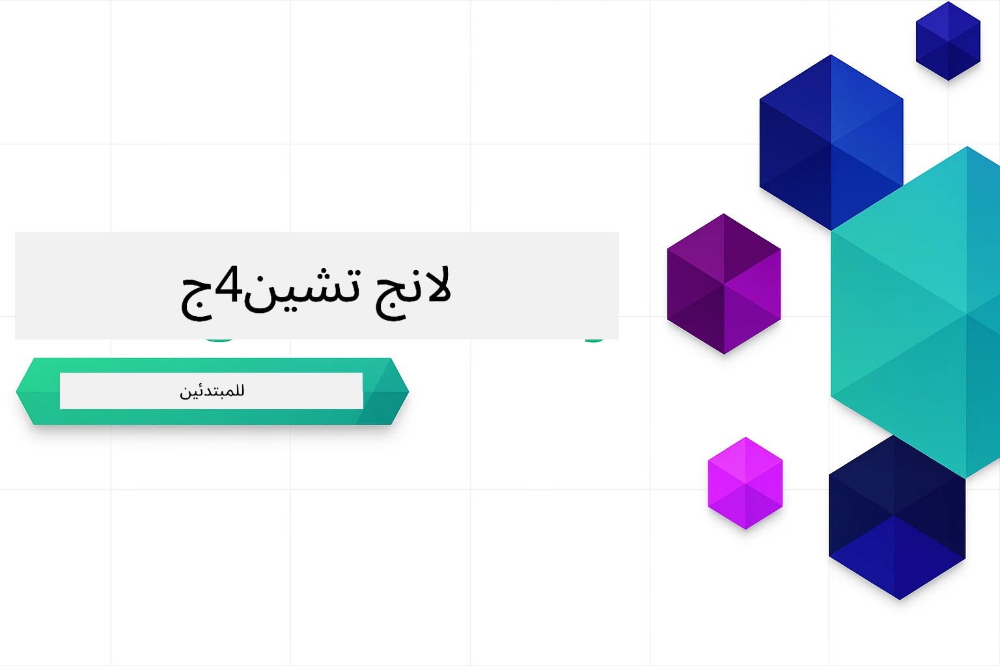

# LangChain4j للمبتدئين

دورة لبناء تطبيقات الذكاء الاصطناعي باستخدام LangChain4j و Azure OpenAI GPT-5.2، من المحادثات الأساسية إلى وكلاء الذكاء الاصطناعي.

### 🌐 دعم متعدد اللغات

#### مدعوم عبر GitHub Action (آلي ودائم التحديث)

<!-- CO-OP TRANSLATOR LANGUAGES TABLE START -->
[Arabic](./README.md) | [Bengali](../bn/README.md) | [Bulgarian](../bg/README.md) | [Burmese (Myanmar)](../my/README.md) | [Chinese (Simplified)](../zh-CN/README.md) | [Chinese (Traditional, Hong Kong)](../zh-HK/README.md) | [Chinese (Traditional, Macau)](../zh-MO/README.md) | [Chinese (Traditional, Taiwan)](../zh-TW/README.md) | [Croatian](../hr/README.md) | [Czech](../cs/README.md) | [Danish](../da/README.md) | [Dutch](../nl/README.md) | [Estonian](../et/README.md) | [Finnish](../fi/README.md) | [French](../fr/README.md) | [German](../de/README.md) | [Greek](../el/README.md) | [Hebrew](../he/README.md) | [Hindi](../hi/README.md) | [Hungarian](../hu/README.md) | [Indonesian](../id/README.md) | [Italian](../it/README.md) | [Japanese](../ja/README.md) | [Kannada](../kn/README.md) | [Khmer](../km/README.md) | [Korean](../ko/README.md) | [Lithuanian](../lt/README.md) | [Malay](../ms/README.md) | [Malayalam](../ml/README.md) | [Marathi](../mr/README.md) | [Nepali](../ne/README.md) | [Nigerian Pidgin](../pcm/README.md) | [Norwegian](../no/README.md) | [Persian (Farsi)](../fa/README.md) | [Polish](../pl/README.md) | [Portuguese (Brazil)](../pt-BR/README.md) | [Portuguese (Portugal)](../pt-PT/README.md) | [Punjabi (Gurmukhi)](../pa/README.md) | [Romanian](../ro/README.md) | [Russian](../ru/README.md) | [Serbian (Cyrillic)](../sr/README.md) | [Slovak](../sk/README.md) | [Slovenian](../sl/README.md) | [Spanish](../es/README.md) | [Swahili](../sw/README.md) | [Swedish](../sv/README.md) | [Tagalog (Filipino)](../tl/README.md) | [Tamil](../ta/README.md) | [Telugu](../te/README.md) | [Thai](../th/README.md) | [Turkish](../tr/README.md) | [Ukrainian](../uk/README.md) | [Urdu](../ur/README.md) | [Vietnamese](../vi/README.md)

> **تفضل النسخ محلياً؟**
>
> يحتوي هذا المستودع على أكثر من 50 ترجمة للغات مختلفة مما يزيد بشكل كبير من حجم التنزيل. للنسخ بدون الترجمات، استخدم sparse checkout:
>
> **Bash / macOS / Linux:**
> ```bash
> git clone --filter=blob:none --sparse https://github.com/microsoft/LangChain4j-for-Beginners.git
> cd LangChain4j-for-Beginners
> git sparse-checkout set --no-cone '/*' '!translations' '!translated_images'
> ```
>
> **CMD (Windows):**
> ```cmd
> git clone --filter=blob:none --sparse https://github.com/microsoft/LangChain4j-for-Beginners.git
> cd LangChain4j-for-Beginners
> git sparse-checkout set --no-cone "/*" "!translations" "!translated_images"
> ```
>
> هذا يمنحك كل ما تحتاجه لإكمال الدورة مع تنزيل أسرع بكثير.
<!-- CO-OP TRANSLATOR LANGUAGES TABLE END -->

## جدول المحتويات

1. [مقدمة](01-introduction/README.md) - تعلّم أساسيات LangChain4j  
2. [هندسة المُحفزات](02-prompt-engineering/README.md) - اتقن تصميم المُحفزات الفعّالة  
3. [RAG (التوليد المدعوم بالاسترجاع)](03-rag/README.md) - بناء أنظمة معرفية ذكية  
4. [الأدوات](04-tools/README.md) - دمج الأدوات الخارجية والمساعدين البسيطين  
5. [MCP (بروتوكول سياق النموذج)](05-mcp/README.md) - العمل مع بروتوكول سياق النموذج (MCP) والوحدات الوكيلّة  

### جولات فيديو إرشادية

كل وحدة تحتوي على جلسة مباشرة مصاحبة نمر خلالها على المفاهيم والكود خطوة بخطوة.

| الوحدة | الفيديو |
|--------|-------|
| 01 - المقدمة | [البدء مع LangChain4j](https://www.youtube.com/live/nl_troDm8rQ) |
| 02 - هندسة المحفزات | [هندسة المُحفز مع LangChain4j](https://www.youtube.com/live/PJ6aBaE6bog) |
| 03 - RAG | [RAG مع LangChain4j](https://www.youtube.com/watch?v=_olq75ZH_eY) |
| 04 - أدوات و 05 - MCP | [وكلاء الذكاء الاصطناعي مع الأدوات و MCP](https://www.youtube.com/watch?v=O_J30kZc0rw) |

---

## مسار التعلم

**جديد على LangChain4j؟** اطلع على [مسرد المصطلحات](docs/GLOSSARY.md) لتعريفات المصطلحات والمفاهيم الرئيسية.

> **بدء سريع**

1. قم بتفريع هذا المستودع إلى حسابك في GitHub  
2. اضغط على **Code** → تبويب **Codespaces** → **...** → **جديد مع خيارات...**  
3. استخدم الإعدادات الافتراضية – سيختار هذا حاوية التطوير المُنشأة لهذه الدورة  
4. اضغط **إنشاء مساحة تعليمات برمجية**  
5. انتظر 5-10 دقائق حتى يكون البيئة جاهزة  
6. ابدأ مباشرة من [المقدمة](./01-introduction/README.md) للبدء!  

بعد إكمال الوحدات، استكشف [دليل الاختبار](docs/TESTING.md) لرؤية مفاهيم اختبار LangChain4j في التطبيق.

> **ملاحظة:** يستخدم هذا التدريب Azure OpenAI. ابدأ باستخدام [حساب Azure مجاني](https://aka.ms/azure-free-account) إذا لم يكن لديك واحد.

## التعلم باستخدام GitHub Copilot

للبدء السريع في الترميز، افتح هذا المشروع في GitHub Codespace أو بيئة التطوير المتكاملة المحلية مع devcontainer المقدم. تأتي حاوية التطوير المستخدمة في هذه الدورة مُهيأة مسبقاً مع GitHub Copilot لبرمجة ذكاء اصطناعي مترافق.

يشمل كل مثال برمجي أسئلة مقترحة يمكنك طرحها على GitHub Copilot لتعميق فهمك. ابحث عن رموز 💡/🤖 في:

- **رؤوس ملفات Java** - أسئلة خاصة بكل مثال  
- **قراءات الوحدات** - محفزات استكشافية بعد أمثلة الكود  

**كيفية الاستخدام:** افتح أي ملف كود واطرح على Copilot الأسئلة المقترحة. لديه سياق كامل لقاعدة الكود ويمكنه الشرح والتمديد واقتراح بدائل.

هل تريد معرفة المزيد؟ اطلع على [Copilot للبرمجة التشاركية بالذكاء الاصطناعي](https://aka.ms/GitHubCopilotAI).

## مصادر إضافية

<!-- CO-OP TRANSLATOR OTHER COURSES START -->
### LangChain
[](https://aka.ms/langchain4j-for-beginners)
[](https://aka.ms/langchainjs-for-beginners?WT.mc_id=m365-94501-dwahlin)
[](https://github.com/microsoft/langchain-for-beginners?WT.mc_id=m365-94501-dwahlin)
---

### Azure / Edge / MCP / Agents
[](https://github.com/microsoft/AZD-for-beginners?WT.mc_id=academic-105485-koreyst)
[](https://github.com/microsoft/edgeai-for-beginners?WT.mc_id=academic-105485-koreyst)
[](https://github.com/microsoft/mcp-for-beginners?WT.mc_id=academic-105485-koreyst)
[](https://github.com/microsoft/ai-agents-for-beginners?WT.mc_id=academic-105485-koreyst)

---
 
### سلسلة الذكاء الاصطناعي التوليدي
[](https://github.com/microsoft/generative-ai-for-beginners?WT.mc_id=academic-105485-koreyst)
[-9333EA?style=for-the-badge&labelColor=E5E7EB&color=9333EA)](https://github.com/microsoft/Generative-AI-for-beginners-dotnet?WT.mc_id=academic-105485-koreyst)
[-C084FC?style=for-the-badge&labelColor=E5E7EB&color=C084FC)](https://github.com/microsoft/generative-ai-for-beginners-java?WT.mc_id=academic-105485-koreyst)
[-E879F9?style=for-the-badge&labelColor=E5E7EB&color=E879F9)](https://github.com/microsoft/generative-ai-with-javascript?WT.mc_id=academic-105485-koreyst)

---
 
### التعلم الأساسي
[](https://aka.ms/ml-beginners?WT.mc_id=academic-105485-koreyst)
[](https://aka.ms/datascience-beginners?WT.mc_id=academic-105485-koreyst)
[](https://aka.ms/ai-beginners?WT.mc_id=academic-105485-koreyst)
[](https://github.com/microsoft/Security-101?WT.mc_id=academic-96948-sayoung)
[](https://aka.ms/webdev-beginners?WT.mc_id=academic-105485-koreyst)
[](https://aka.ms/iot-beginners?WT.mc_id=academic-105485-koreyst)
[](https://github.com/microsoft/xr-development-for-beginners?WT.mc_id=academic-105485-koreyst)

---
 
### سلسلة كوبيلوت
[](https://aka.ms/GitHubCopilotAI?WT.mc_id=academic-105485-koreyst)
[](https://github.com/microsoft/mastering-github-copilot-for-dotnet-csharp-developers?WT.mc_id=academic-105485-koreyst)
[](https://github.com/microsoft/CopilotAdventures?WT.mc_id=academic-105485-koreyst)
<!-- CO-OP TRANSLATOR OTHER COURSES END -->

## الحصول على المساعدة

إذا واجهت مشكلة أو كان لديك أي أسئلة حول بناء تطبيقات الذكاء الاصطناعي، انضم إلى:

[](https://aka.ms/foundry/discord)

إذا كان لديك ملاحظات على المنتج أو أخطاء أثناء البناء قم بزيارة:

[](https://aka.ms/foundry/forum)

## الترخيص

رخصة MIT - راجع ملف [LICENSE](../../LICENSE) للتفاصيل.

---

<!-- CO-OP TRANSLATOR DISCLAIMER START -->
**تنويه**:
تمت ترجمة هذا المستند باستخدام خدمة الترجمة بالذكاء الاصطناعي [Co-op Translator](https://github.com/Azure/co-op-translator). بينما نسعى للدقة، يرجى العلم أن الترجمات الآلية قد تحتوي على أخطاء أو عدم دقة. يجب اعتبار المستند الأصلي بلغته الأصلية المصدر الرسمي والمعتمد. للمعلومات الهامة، يُنصح بالاستعانة بترجمة بشرية محترفة. نحن غير مسؤولين عن أي سوء فهم أو تفسير ناتج عن استخدام هذه الترجمة.
<!-- CO-OP TRANSLATOR DISCLAIMER END -->