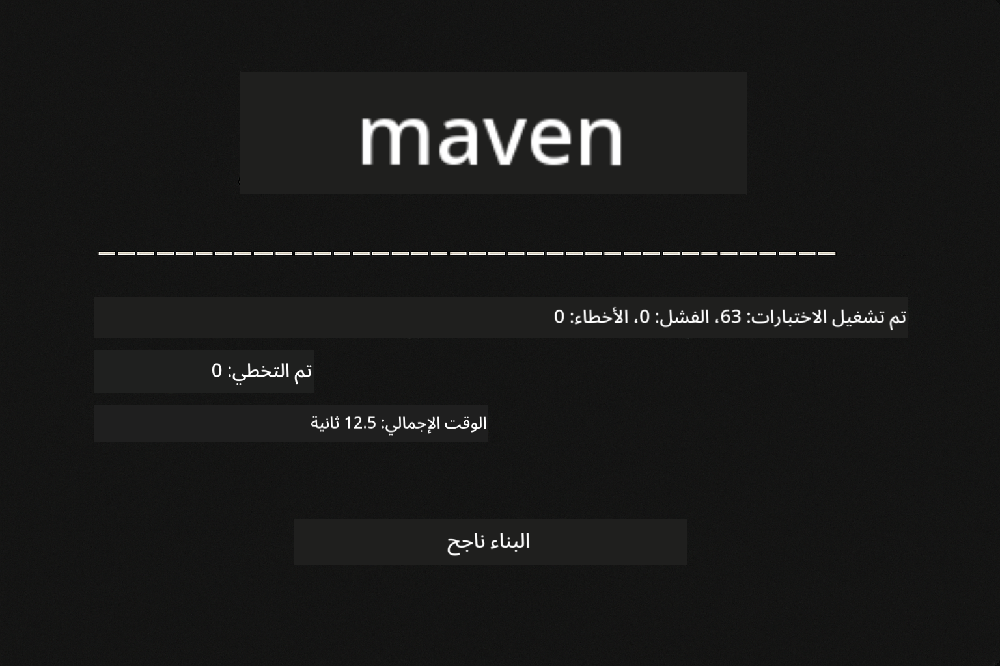
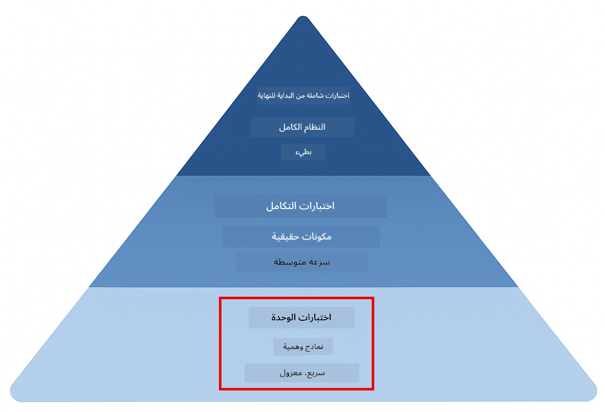
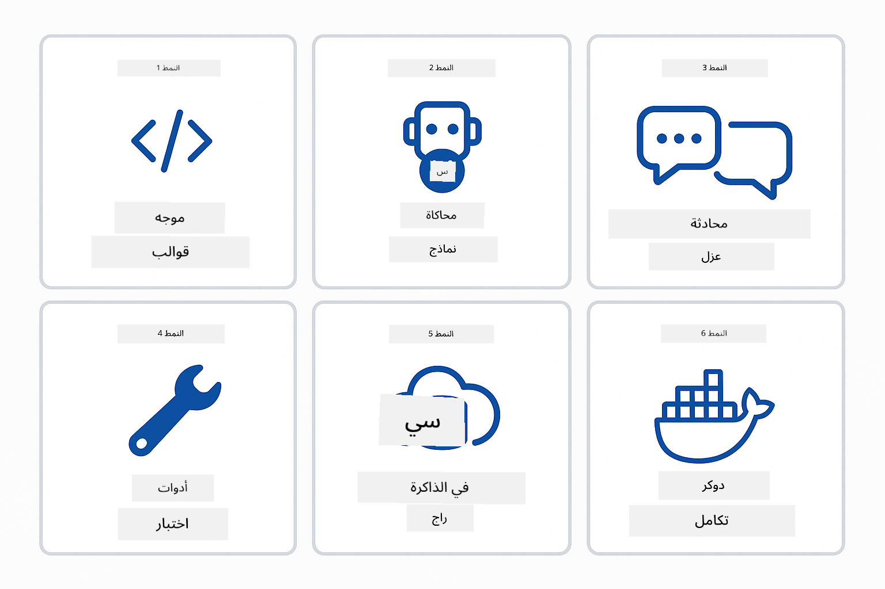
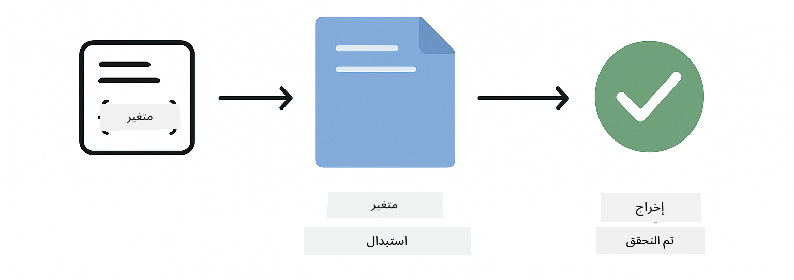
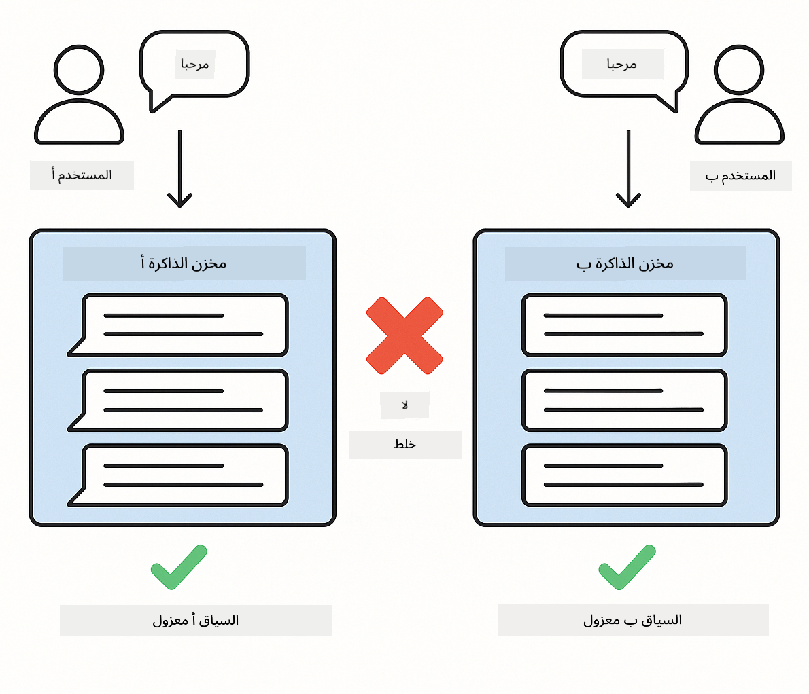
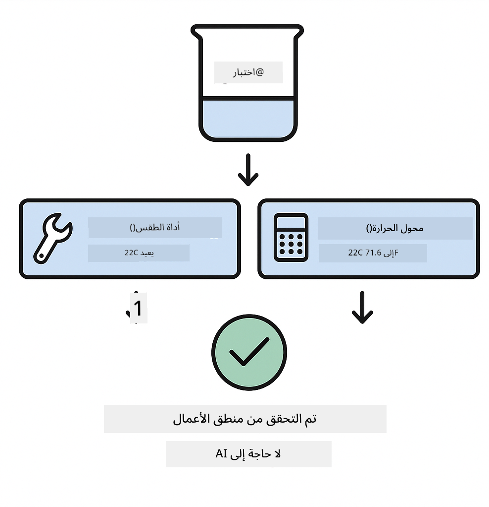
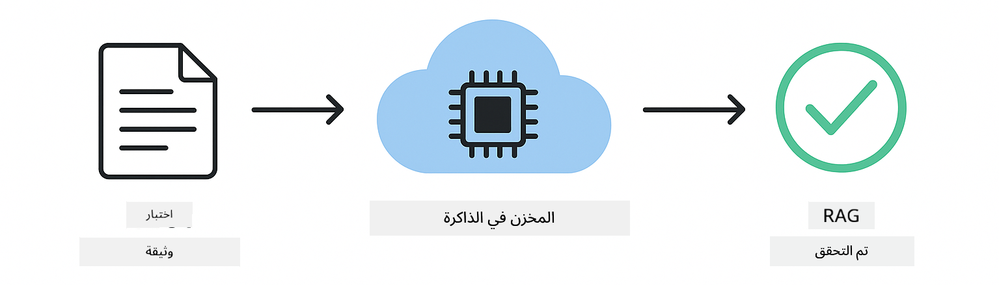
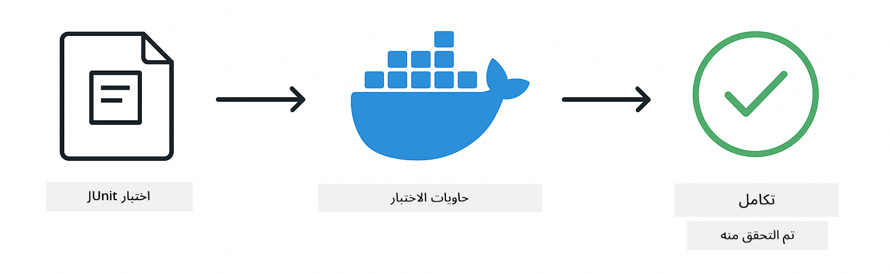

<!--
CO_OP_TRANSLATOR_METADATA:
{
  "original_hash": "b975537560c404d5f254331832811e78",
  "translation_date": "2025-12-13T20:37:03+00:00",
  "source_file": "docs/TESTING.md",
  "language_code": "ar"
}
-->
# اختبار تطبيقات LangChain4j

## جدول المحتويات

- [البدء السريع](../../../docs)
- [ما تغطيه الاختبارات](../../../docs)
- [تشغيل الاختبارات](../../../docs)
- [تشغيل الاختبارات في VS Code](../../../docs)
- [أنماط الاختبار](../../../docs)
- [فلسفة الاختبار](../../../docs)
- [الخطوات التالية](../../../docs)

يرشدك هذا الدليل خلال الاختبارات التي توضح كيفية اختبار تطبيقات الذكاء الاصطناعي دون الحاجة إلى مفاتيح API أو خدمات خارجية.

## البدء السريع

شغّل جميع الاختبارات بأمر واحد:

**Bash:**
```bash
mvn test
```

**PowerShell:**
```powershell
mvn --% test
```



*تنفيذ اختبار ناجح يظهر جميع الاختبارات ناجحة بدون أي فشل*

## ما تغطيه الاختبارات

يركز هذا المساق على **اختبارات الوحدة** التي تُشغّل محليًا. كل اختبار يوضح مفهومًا محددًا من LangChain4j بشكل معزول.



*هرم الاختبار يوضح التوازن بين اختبارات الوحدة (سريعة، معزولة)، اختبارات التكامل (مكونات حقيقية)، واختبارات النهاية إلى النهاية (النظام الكامل مع Docker). يغطي هذا التدريب اختبار الوحدة.*

| الوحدة | الاختبارات | التركيز | الملفات الرئيسية |
|--------|-------------|---------|------------------|
| **00 - البدء السريع** | 6 | قوالب المطالبات واستبدال المتغيرات | `SimpleQuickStartTest.java` |
| **01 - المقدمة** | 8 | ذاكرة المحادثة والدردشة الحالة | `SimpleConversationTest.java` |
| **02 - هندسة المطالبات** | 12 | أنماط GPT-5، مستويات الحماس، المخرجات المنظمة | `SimpleGpt5PromptTest.java` |
| **03 - RAG** | 10 | استيعاب الوثائق، التضمينات، البحث بالتشابه | `DocumentServiceTest.java` |
| **04 - الأدوات** | 12 | استدعاء الدوال وربط الأدوات | `SimpleToolsTest.java` |
| **05 - MCP** | 15 | بروتوكول سياق النموذج مع Docker | `SimpleMcpTest.java`, `McpDockerTransportTest.java` |

## تشغيل الاختبارات

**تشغيل جميع الاختبارات من الجذر:**

**Bash:**
```bash
mvn test
```

**PowerShell:**
```powershell
mvn --% test
```

**تشغيل اختبارات وحدة محددة:**

**Bash:**
```bash
cd 01-introduction && mvn test
# أو من الجذر
mvn test -pl 01-introduction
```

**PowerShell:**
```powershell
cd 01-introduction; mvn --% test
# أو من الجذر
mvn --% test -pl 01-introduction
```

**تشغيل فئة اختبار واحدة:**

**Bash:**
```bash
mvn test -Dtest=SimpleConversationTest
```

**PowerShell:**
```powershell
mvn --% test -Dtest=SimpleConversationTest
```

**تشغيل طريقة اختبار محددة:**

**Bash:**
```bash
mvn test -Dtest=SimpleConversationTest#يجب_الحفاظ_على_تاريخ_المحادثة
```

**PowerShell:**
```powershell
mvn --% test -Dtest=SimpleConversationTest#يجب_الحفاظ_على_تاريخ_المحادثة
```

## تشغيل الاختبارات في VS Code

إذا كنت تستخدم Visual Studio Code، يوفر مستكشف الاختبارات واجهة رسومية لتشغيل وتصحيح الاختبارات.


*مستكشف اختبارات VS Code يعرض شجرة الاختبارات مع جميع فئات اختبار جافا وطرق الاختبار الفردية*

**لتشغيل الاختبارات في VS Code:**

1. افتح مستكشف الاختبارات بالنقر على أيقونة القارورة في شريط النشاط
2. وسّع شجرة الاختبارات لرؤية جميع الوحدات وفئات الاختبار
3. انقر زر التشغيل بجانب أي اختبار لتشغيله بشكل فردي
4. انقر "تشغيل جميع الاختبارات" لتنفيذ المجموعة كاملة
5. انقر بزر الماوس الأيمن على أي اختبار واختر "تصحيح الاختبار" لتعيين نقاط توقف والتنقل في الكود

يعرض مستكشف الاختبارات علامات صح خضراء للاختبارات الناجحة ويوفر رسائل فشل مفصلة عند فشل الاختبارات.

## أنماط الاختبار



*ستة أنماط اختبار لتطبيقات LangChain4j: قوالب المطالبات، محاكاة النماذج، عزل المحادثة، اختبار الأدوات، RAG في الذاكرة، وتكامل Docker*

### النمط 1: اختبار قوالب المطالبات

النمط الأبسط يختبر قوالب المطالبات دون استدعاء أي نموذج ذكاء اصطناعي. تتحقق من أن استبدال المتغيرات يعمل بشكل صحيح وأن المطالبات منسقة كما هو متوقع.



*اختبار قوالب المطالبات يظهر تدفق استبدال المتغيرات: القالب مع أماكن الحجز → تطبيق القيم → التحقق من المخرجات المنسقة*

```java
@Test
@DisplayName("Should format prompt template with variables")
void testPromptTemplateFormatting() {
    PromptTemplate template = PromptTemplate.from(
        "Best time to visit {{destination}} for {{activity}}?"
    );
    
    Prompt prompt = template.apply(Map.of(
        "destination", "Paris",
        "activity", "sightseeing"
    ));
    
    assertThat(prompt.text()).isEqualTo("Best time to visit Paris for sightseeing?");
}
```

يعيش هذا الاختبار في `00-quick-start/src/test/java/com/example/langchain4j/quickstart/SimpleQuickStartTest.java`.

**شغّله:**

**Bash:**
```bash
cd 00-quick-start && mvn test -Dtest=SimpleQuickStartTest#اختبار تنسيق قالب الموجه
```

**PowerShell:**
```powershell
cd 00-quick-start; mvn --% test -Dtest=SimpleQuickStartTest#اختبار تنسيق قالب الموجه
```

### النمط 2: محاكاة نماذج اللغة

عند اختبار منطق المحادثة، استخدم Mockito لإنشاء نماذج وهمية تعيد ردودًا محددة مسبقًا. هذا يجعل الاختبارات سريعة ومجانية وحتمية.


*مقارنة توضح لماذا تفضل المحاكاة للاختبار: سريعة، مجانية، حتمية، ولا تحتاج مفاتيح API*

```java
@ExtendWith(MockitoExtension.class)
class SimpleConversationTest {
    
    private ConversationService conversationService;
    
    @Mock
    private OpenAiOfficialChatModel mockChatModel;
    
    @BeforeEach
    void setUp() {
        ChatResponse mockResponse = ChatResponse.builder()
            .aiMessage(AiMessage.from("This is a test response"))
            .build();
        when(mockChatModel.chat(anyList())).thenReturn(mockResponse);
        
        conversationService = new ConversationService(mockChatModel);
    }
    
    @Test
    void shouldMaintainConversationHistory() {
        String conversationId = conversationService.startConversation();
        
        ChatResponse mockResponse1 = ChatResponse.builder()
            .aiMessage(AiMessage.from("Response 1"))
            .build();
        ChatResponse mockResponse2 = ChatResponse.builder()
            .aiMessage(AiMessage.from("Response 2"))
            .build();
        ChatResponse mockResponse3 = ChatResponse.builder()
            .aiMessage(AiMessage.from("Response 3"))
            .build();
        
        when(mockChatModel.chat(anyList()))
            .thenReturn(mockResponse1)
            .thenReturn(mockResponse2)
            .thenReturn(mockResponse3);

        conversationService.chat(conversationId, "First message");
        conversationService.chat(conversationId, "Second message");
        conversationService.chat(conversationId, "Third message");

        List<ChatMessage> history = conversationService.getHistory(conversationId);
        assertThat(history).hasSize(6); // ٣ رسائل من المستخدم + ٣ رسائل من الذكاء الاصطناعي
    }
}
```

يظهر هذا النمط في `01-introduction/src/test/java/com/example/langchain4j/service/SimpleConversationTest.java`. تضمن المحاكاة سلوكًا ثابتًا حتى تتمكن من التحقق من أن إدارة الذاكرة تعمل بشكل صحيح.

### النمط 3: اختبار عزل المحادثة

يجب أن تحافظ ذاكرة المحادثة على فصل المستخدمين المتعددين. يتحقق هذا الاختبار من أن المحادثات لا تخلط السياقات.



*اختبار عزل المحادثة يظهر مخازن ذاكرة منفصلة لمستخدمين مختلفين لمنع خلط السياق*

```java
@Test
void shouldIsolateConversationsByid() {
    String conv1 = conversationService.startConversation();
    String conv2 = conversationService.startConversation();
    
    ChatResponse mockResponse = ChatResponse.builder()
        .aiMessage(AiMessage.from("Response"))
        .build();
    when(mockChatModel.chat(anyList())).thenReturn(mockResponse);

    conversationService.chat(conv1, "Message for conversation 1");
    conversationService.chat(conv2, "Message for conversation 2");

    List<ChatMessage> history1 = conversationService.getHistory(conv1);
    List<ChatMessage> history2 = conversationService.getHistory(conv2);
    
    assertThat(history1).hasSize(2);
    assertThat(history2).hasSize(2);
}
```

تحافظ كل محادثة على تاريخها المستقل الخاص بها. في أنظمة الإنتاج، هذا العزل ضروري لتطبيقات متعددة المستخدمين.

### النمط 4: اختبار الأدوات بشكل مستقل

الأدوات هي دوال يمكن للذكاء الاصطناعي استدعاؤها. اختبرها مباشرة لضمان عملها بشكل صحيح بغض النظر عن قرارات الذكاء الاصطناعي.



*اختبار الأدوات بشكل مستقل يظهر تنفيذ أداة وهمية بدون استدعاءات ذكاء اصطناعي للتحقق من منطق الأعمال*

```java
@Test
void shouldConvertCelsiusToFahrenheit() {
    TemperatureTool tempTool = new TemperatureTool();
    String result = tempTool.celsiusToFahrenheit(25.0);
    assertThat(result).containsPattern("77[.,]0°F");
}

@Test
void shouldDemonstrateToolChaining() {
    WeatherTool weatherTool = new WeatherTool();
    TemperatureTool tempTool = new TemperatureTool();

    String weatherResult = weatherTool.getCurrentWeather("Seattle");
    assertThat(weatherResult).containsPattern("\\d+°C");

    String conversionResult = tempTool.celsiusToFahrenheit(22.0);
    assertThat(conversionResult).containsPattern("71[.,]6°F");
}
```

تتحقق هذه الاختبارات من `04-tools/src/test/java/com/example/langchain4j/agents/tools/SimpleToolsTest.java` من منطق الأدوات بدون تدخل الذكاء الاصطناعي. يظهر مثال الربط كيف تغذي مخرجات أداة واحدة مدخلات أخرى.

### النمط 5: اختبار RAG في الذاكرة

تتطلب أنظمة RAG تقليديًا قواعد بيانات متجهات وخدمات تضمين. يسمح نمط الذاكرة باختبار كامل خط الأنابيب بدون تبعيات خارجية.



*تدفق عمل اختبار RAG في الذاكرة يظهر تحليل الوثائق، تخزين التضمينات، والبحث بالتشابه بدون الحاجة إلى قاعدة بيانات*

```java
@Test
void testProcessTextDocument() {
    String content = "This is a test document.\nIt has multiple lines.";
    InputStream inputStream = new ByteArrayInputStream(content.getBytes(StandardCharsets.UTF_8));
    
    DocumentService.ProcessedDocument result = 
        documentService.processDocument(inputStream, "test.txt");

    assertNotNull(result);
    assertTrue(result.segments().size() > 0);
    assertEquals("test.txt", result.segments().get(0).metadata().getString("filename"));
}
```

ينشئ هذا الاختبار من `03-rag/src/test/java/com/example/langchain4j/rag/service/DocumentServiceTest.java` وثيقة في الذاكرة ويتحقق من التجزئة والتعامل مع البيانات الوصفية.

### النمط 6: اختبار التكامل مع Docker

تحتاج بعض الميزات إلى بنية تحتية حقيقية. تستخدم وحدة MCP Testcontainers لتشغيل حاويات Docker لاختبارات التكامل. تتحقق هذه من أن الكود يعمل مع خدمات فعلية مع الحفاظ على عزل الاختبار.



*اختبار تكامل MCP مع Testcontainers يظهر دورة حياة الحاوية الآلية: بدء، تنفيذ الاختبار، إيقاف، وتنظيف*

تتطلب الاختبارات في `05-mcp/src/test/java/com/example/langchain4j/mcp/McpDockerTransportTest.java` تشغيل Docker.

**شغّلها:**

**Bash:**
```bash
cd 05-mcp && mvn test
```

**PowerShell:**
```powershell
cd 05-mcp; mvn --% test
```

## فلسفة الاختبار

اختبر كودك، لا الذكاء الاصطناعي. يجب أن تتحقق اختباراتك من الكود الذي تكتبه بفحص كيفية بناء المطالبات، كيفية إدارة الذاكرة، وكيفية تنفيذ الأدوات. تختلف ردود الذكاء الاصطناعي ولا يجب أن تكون جزءًا من تأكيدات الاختبار. اسأل نفسك ما إذا كان قالب المطالبة يستبدل المتغيرات بشكل صحيح، وليس ما إذا كان الذكاء الاصطناعي يعطي الإجابة الصحيحة.

استخدم المحاكاة لنماذج اللغة. فهي تبعيات خارجية بطيئة ومكلفة وغير حتمية. تجعل المحاكاة الاختبارات سريعة بالمللي ثانية بدلًا من الثواني، مجانية بدون تكاليف API، وحتمية بنفس النتيجة في كل مرة.

حافظ على استقلالية الاختبارات. يجب أن يهيئ كل اختبار بياناته الخاصة، لا يعتمد على اختبارات أخرى، وينظف بعد نفسه. يجب أن تنجح الاختبارات بغض النظر عن ترتيب التنفيذ.

اختبر الحالات الحدية خارج المسار السعيد. جرب المدخلات الفارغة، المدخلات الكبيرة جدًا، الأحرف الخاصة، المعلمات غير الصالحة، وظروف الحدود. غالبًا ما تكشف هذه عن أخطاء لا تظهر في الاستخدام العادي.

استخدم أسماء وصفية. قارن `shouldMaintainConversationHistoryAcrossMultipleMessages()` مع `test1()`. الأول يخبرك بالضبط ما يتم اختباره، مما يسهل تصحيح الأخطاء عند الفشل.

## الخطوات التالية

الآن بعد أن فهمت أنماط الاختبار، تعمق في كل وحدة:

- **[00 - البدء السريع](../00-quick-start/README.md)** - ابدأ بأساسيات قوالب المطالبات
- **[01 - المقدمة](../01-introduction/README.md)** - تعلّم إدارة ذاكرة المحادثة
- **[02 - هندسة المطالبات](../02-prompt-engineering/README.md)** - اتقن أنماط مطالبة GPT-5
- **[03 - RAG](../03-rag/README.md)** - بناء أنظمة التوليد المعززة بالاسترجاع
- **[04 - الأدوات](../04-tools/README.md)** - تنفيذ استدعاء الدوال وربط الأدوات
- **[05 - MCP](../05-mcp/README.md)** - دمج بروتوكول سياق النموذج مع Docker

يوفر README لكل وحدة شروحات مفصلة للمفاهيم المختبرة هنا.

---

**التنقل:** [← العودة إلى الرئيسي](../README.md)

---

<!-- CO-OP TRANSLATOR DISCLAIMER START -->
**إخلاء المسؤولية**:  
تمت ترجمة هذا المستند باستخدام خدمة الترجمة الآلية [Co-op Translator](https://github.com/Azure/co-op-translator). بينما نسعى لتحقيق الدقة، يرجى العلم أن الترجمات الآلية قد تحتوي على أخطاء أو عدم دقة. يجب اعتبار المستند الأصلي بلغته الأصلية المصدر الموثوق به. للمعلومات الهامة، يُنصح بالترجمة البشرية المهنية. نحن غير مسؤولين عن أي سوء فهم أو تفسير ناتج عن استخدام هذه الترجمة.
<!-- CO-OP TRANSLATOR DISCLAIMER END -->