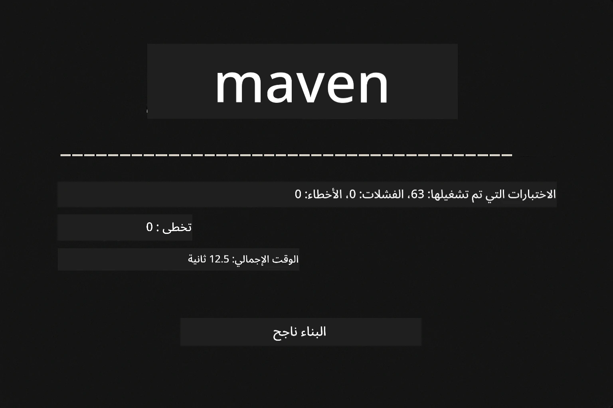
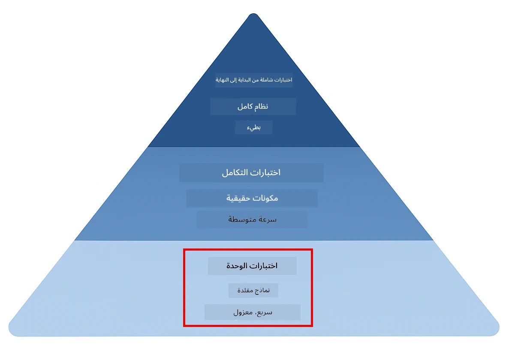
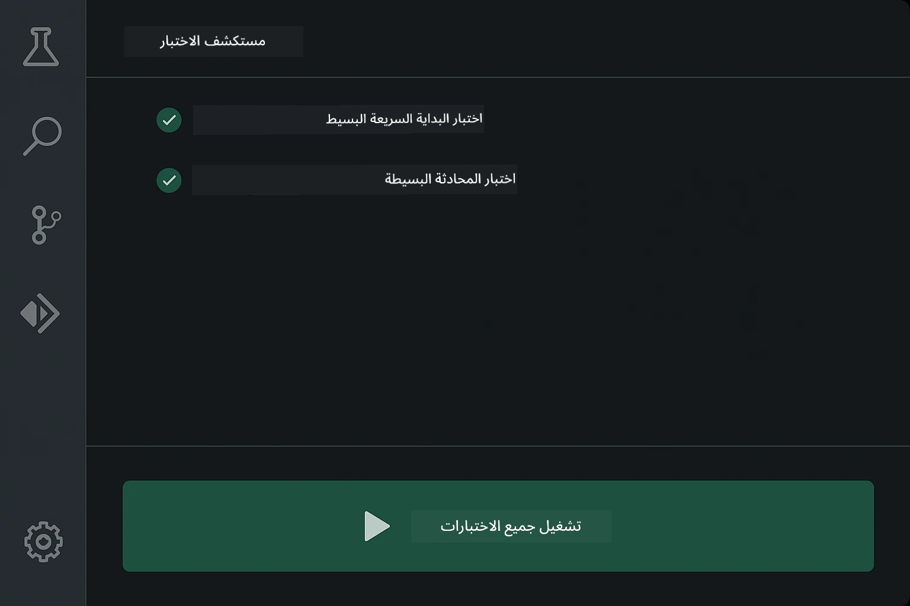
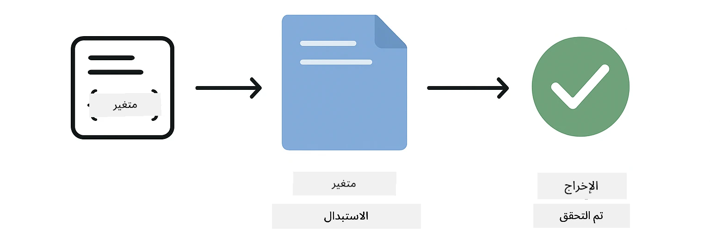
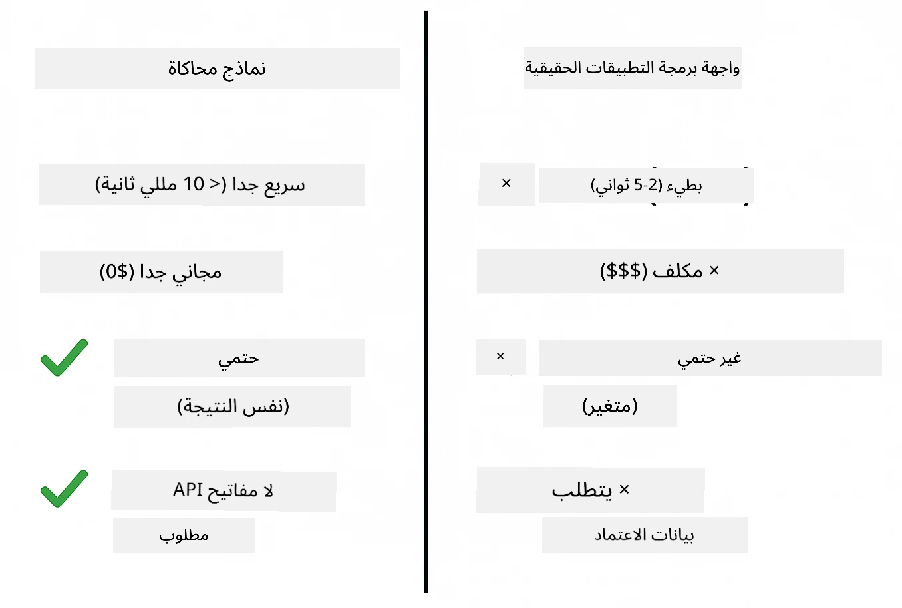
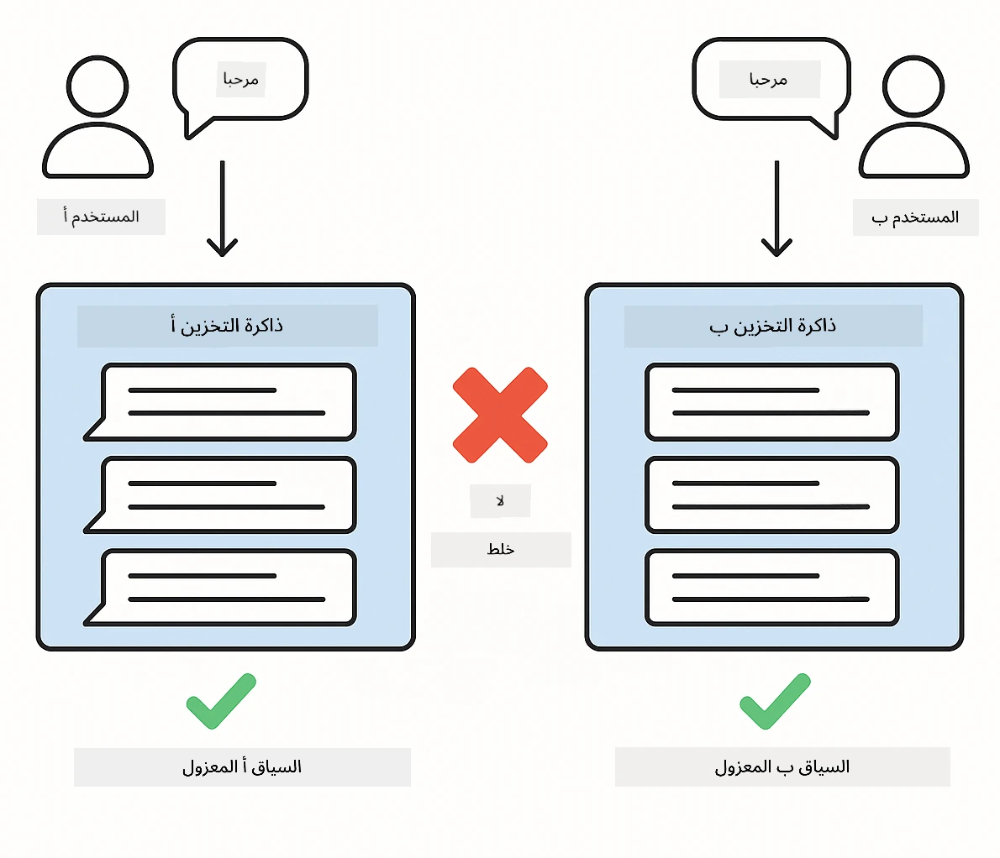
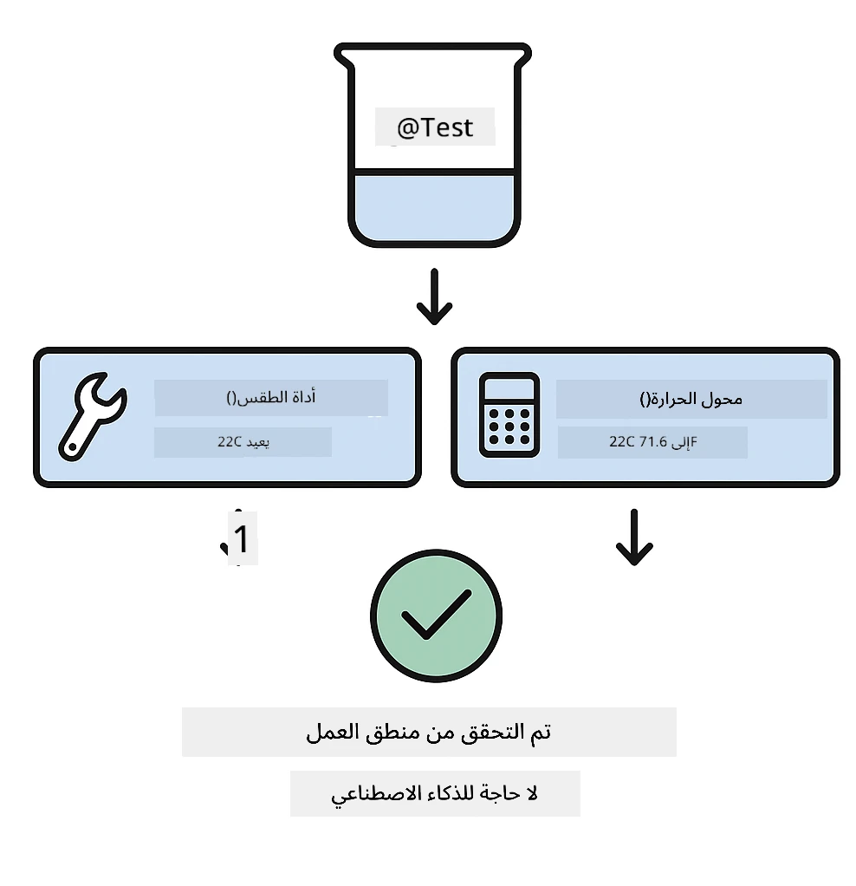
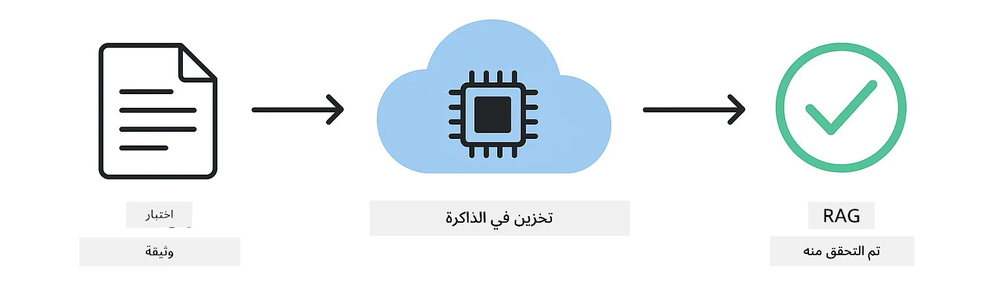

# اختبار تطبيقات LangChain4j

## جدول المحتويات

- [البدء السريع](#البدء-السريع)
- [ما تغطيه الاختبارات](#ما-تغطيه-الاختبارات)
- [تشغيل الاختبارات](#تشغيل-الاختبارات)
- [تشغيل الاختبارات في VS Code](#تشغيل-الاختبارات-في-vs-code)
- [أنماط الاختبار](#أنماط-الاختبار)
- [فلسفة الاختبار](#فلسفة-الاختبار)
- [الخطوات التالية](#الخطوات-التالية)

هذا الدليل يشرح لك الاختبارات التي توضح كيفية اختبار تطبيقات الذكاء الاصطناعي دون الحاجة إلى مفاتيح API أو خدمات خارجية.

## البدء السريع

شغّل جميع الاختبارات بأمر واحد:

**Bash:**
```bash
mvn test
```

**PowerShell:**
```powershell
mvn --% test
```

عند نجاح جميع الاختبارات، يجب أن ترى مخرجات تشبه لقطة الشاشة أدناه — الاختبارات تُشغّل بدون أي فشل.



*تنفيذ اختبار ناجح يعرض اجتياز جميع الاختبارات دون أخطاء*

## ما تغطيه الاختبارات

يركز هذا المقرر على **اختبارات الوحدة** التي تُشغل محليًا. كل اختبار يعرض مفهومًا محددًا من LangChain4j بشكل معزول. تعرض الهرمية الاختبارية أدناه مكان اختبارات الوحدة — فهي تشكل الأساس السريع والموثوق الذي يبني عليه بقية استراتيجية الاختبار الخاصة بك.



*هرمية الاختبار توضح التوازن بين اختبارات الوحدة (سريعة، معزولة)، اختبارات التكامل (مكونات حقيقية)، والاختبارات الشاملة. هذا التدريب يغطي اختبار الوحدة.*

| الوحدة | الاختبارات | التركيز | الملفات الرئيسية |
|--------|------------|---------|------------------|
| **01 - المقدمة** | 8 | ذاكرة المحادثة والدردشة بحالة مستمرة | `SimpleConversationTest.java` |
| **02 - هندسة الموجهات** | 12 | أنماط GPT-5.2، مستويات الحماس، المخرجات المهيكلة | `SimpleGpt5PromptTest.java` |
| **03 - RAG** | 10 | إدخال المستندات، التضمين، البحث في التشابه | `DocumentServiceTest.java` |
| **04 - الأدوات** | 12 | استدعاء الدوال وتسلسل الأدوات | `SimpleToolsTest.java` |
| **05 - MCP** | 8 | بروتوكول سياق النموذج باستخدام نقل stdio | `SimpleMcpTest.java` |

## تشغيل الاختبارات

**شغل جميع الاختبارات من الجذر:**

**Bash:**
```bash
mvn test
```

**PowerShell:**
```powershell
mvn --% test
```

**شغل اختبارات وحدة معينة:**

**Bash:**
```bash
cd 01-introduction && mvn test
# أو من الجذر
mvn test -pl 01-introduction
```

**PowerShell:**
```powershell
cd 01-introduction; mvn --% test
# أو من الجذر
mvn --% test -pl 01-introduction
```

**شغل فئة اختبار واحدة:**

**Bash:**
```bash
mvn test -Dtest=SimpleConversationTest
```

**PowerShell:**
```powershell
mvn --% test -Dtest=SimpleConversationTest
```

**شغل طريقة اختبار معينة:**

**Bash:**
```bash
mvn test -Dtest=SimpleConversationTest#يجب_الحفاظ_على_تاريخ_المحادثة
```

**PowerShell:**
```powershell
mvn --% test -Dtest=SimpleConversationTest#يجب_الحفاظ_على_تاريخ_المحادثة
```

## تشغيل الاختبارات في VS Code

إذا كنت تستخدم Visual Studio Code، يوفر مستكشف الاختبارات واجهة رسومية لتشغيل وتصحيح الاختبارات.



*مستكشف اختبار VS Code يعرض شجرة الاختبارات مع جميع فئات اختبار Java والطرق الفردية*

**لتشغيل الاختبارات في VS Code:**

1. افتح مستكشف الاختبارات بالنقر على أيقونة الإناء في شريط النشاط
2. وسع شجرة الاختبارات لرؤية جميع الوحدات وفئات الاختبار
3. انقر على زر التشغيل بجانب أي اختبار لتشغيله بشكل فردي
4. انقر على "Run All Tests" لتشغيل المجموعة كاملة
5. انقر بزر الماوس الأيمن على أي اختبار واختر "Debug Test" لتهيئة نقاط التوقف والتنقل خلال الكود

يظهر مستكشف الاختبارات علامات تحقق خضراء للاختبارات الناجحة ويوفر رسائل فشل مفصلة عند فشل الاختبارات.

## أنماط الاختبار

### النمط 1: اختبار قوالب الموجهات

أبسط نمط يختبر قوالب الموجهات دون استدعاء أي نموذج ذكاء اصطناعي. تتحقق من أن استبدال المتغيرات يعمل بشكل صحيح وأن الموجهات منسقة كما هو متوقع.



*اختبار قوالب الموجهات يبين تدفق استبدال المتغيرات: القالب مع أماكن الحجز → تطبيق القيم → التحقق من المخرجات المنسقة*

```java
@Test
@DisplayName("Should format prompt template with variables")
void testPromptTemplateFormatting() {
    PromptTemplate template = PromptTemplate.from(
        "Best time to visit {{destination}} for {{activity}}?"
    );
    
    Prompt prompt = template.apply(Map.of(
        "destination", "Paris",
        "activity", "sightseeing"
    ));
    
    assertThat(prompt.text()).isEqualTo("Best time to visit Paris for sightseeing?");
}
```

هذا النمط يتحقق من أن استبدال المتغير يعمل بشكل صحيح وأن الموجهات منسقة كما هو متوقع — دون الحاجة إلى مفتاح API أو استدعاء نموذج.

### النمط 2: تمثيل نماذج اللغة المزيفة

عند اختبار منطق المحادثة، استخدم Mockito لإنشاء نماذج مزيفة تعيد استجابات محددة مسبقًا. هذا يجعل الاختبارات سريعة ومجانية وحتمية.



*مقارنة توضح لماذا يُفضّل استخدام النماذج المزيفة للاختبار: فهي سريعة، مجانية، حتمية، ولا تتطلب مفاتيح API*

```java
@ExtendWith(MockitoExtension.class)
class SimpleConversationTest {
    
    private ConversationService conversationService;
    
    @Mock
    private OpenAiOfficialChatModel mockChatModel;
    
    @BeforeEach
    void setUp() {
        ChatResponse mockResponse = ChatResponse.builder()
            .aiMessage(AiMessage.from("This is a test response"))
            .build();
        when(mockChatModel.chat(anyList())).thenReturn(mockResponse);
        
        conversationService = new ConversationService(mockChatModel);
    }
    
    @Test
    void shouldMaintainConversationHistory() {
        String conversationId = conversationService.startConversation();
        
        ChatResponse mockResponse1 = ChatResponse.builder()
            .aiMessage(AiMessage.from("Response 1"))
            .build();
        ChatResponse mockResponse2 = ChatResponse.builder()
            .aiMessage(AiMessage.from("Response 2"))
            .build();
        ChatResponse mockResponse3 = ChatResponse.builder()
            .aiMessage(AiMessage.from("Response 3"))
            .build();
        
        when(mockChatModel.chat(anyList()))
            .thenReturn(mockResponse1)
            .thenReturn(mockResponse2)
            .thenReturn(mockResponse3);

        conversationService.chat(conversationId, "First message");
        conversationService.chat(conversationId, "Second message");
        conversationService.chat(conversationId, "Third message");

        List<ChatMessage> history = conversationService.getHistory(conversationId);
        assertThat(history).hasSize(6); // ٣ رسائل من المستخدم + ٣ رسائل من الذكاء الاصطناعي
    }
}
```

هذا النمط يظهر في `01-introduction/src/test/java/com/example/langchain4j/service/SimpleConversationTest.java`. النموذج المزيف يضمن سلوكًا متسقًا لكي تتحقق من أن إدارة الذاكرة تعمل بشكل صحيح.

### النمط 3: اختبار عزل المحادثة

يجب أن تحافظ ذاكرة المحادثة على فصل المستخدمين المتعددين. هذا الاختبار يتحقق من أن المحادثات لا تخلط السياقات.



*اختبار عزل المحادثة يظهر تخزينات ذاكرة منفصلة لمستخدمين مختلفين لمنع خلط السياق*

```java
@Test
void shouldIsolateConversationsByid() {
    String conv1 = conversationService.startConversation();
    String conv2 = conversationService.startConversation();
    
    ChatResponse mockResponse = ChatResponse.builder()
        .aiMessage(AiMessage.from("Response"))
        .build();
    when(mockChatModel.chat(anyList())).thenReturn(mockResponse);

    conversationService.chat(conv1, "Message for conversation 1");
    conversationService.chat(conv2, "Message for conversation 2");

    List<ChatMessage> history1 = conversationService.getHistory(conv1);
    List<ChatMessage> history2 = conversationService.getHistory(conv2);
    
    assertThat(history1).hasSize(2);
    assertThat(history2).hasSize(2);
}
```

تحافظ كل محادثة على سجل مستقل خاص بها. في أنظمة الإنتاج، هذا العزل مهم جدًا لتطبيقات متعددة المستخدمين.

### النمط 4: اختبار الأدوات بشكل مستقل

الأدوات هي دوال يمكن للذكاء الاصطناعي استدعاؤها. اختبرها مباشرة للتأكد من أنها تعمل بشكل صحيح بغض النظر عن قرارات AI.



*اختبار الأدوات بشكل مستقل يوضح تنفيذ الأداة المزيفة دون استدعاء AI للتحقق من منطق العمل*

```java
@Test
void shouldConvertCelsiusToFahrenheit() {
    TemperatureTool tempTool = new TemperatureTool();
    String result = tempTool.celsiusToFahrenheit(25.0);
    assertThat(result).containsPattern("77[.,]0°F");
}

@Test
void shouldDemonstrateToolChaining() {
    WeatherTool weatherTool = new WeatherTool();
    TemperatureTool tempTool = new TemperatureTool();

    String weatherResult = weatherTool.getCurrentWeather("Seattle");
    assertThat(weatherResult).containsPattern("\\d+°C");

    String conversionResult = tempTool.celsiusToFahrenheit(22.0);
    assertThat(conversionResult).containsPattern("71[.,]6°F");
}
```

هذه الاختبارات من `04-tools/src/test/java/com/example/langchain4j/agents/tools/SimpleToolsTest.java` تتحقق من منطق الأدوات دون تدخل AI. يظهر مثال التسلسل كيف تُستخدم مخرجات أداة كمدخل لأخرى.

### النمط 5: اختبار RAG في الذاكرة

تتطلب أنظمة RAG تقليديًا قواعد بيانات متجه وتضمين خدمات التضمين. يسمح نمط الذاكرة باختبار كامل الخط بدون تبعيات خارجية.



*سير عمل اختبار RAG داخل الذاكرة يوضح تحليل المستندات، تخزين التضمين، والبحث في التشابه دون الحاجة لقاعدة بيانات*

```java
@Test
void testProcessTextDocument() {
    String content = "This is a test document.\nIt has multiple lines.";
    InputStream inputStream = new ByteArrayInputStream(content.getBytes(StandardCharsets.UTF_8));
    
    DocumentService.ProcessedDocument result = 
        documentService.processDocument(inputStream, "test.txt");

    assertNotNull(result);
    assertTrue(result.segments().size() > 0);
    assertEquals("test.txt", result.segments().get(0).metadata().getString("filename"));
}
```

هذا الاختبار من `03-rag/src/test/java/com/example/langchain4j/rag/service/DocumentServiceTest.java` ينشئ مستندًا في الذاكرة ويتحقق من التقطيع والتعامل مع البيانات الوصفية.

### النمط 6: اختبار تكامل MCP

تختبر وحدة MCP تكامل بروتوكول سياق النموذج باستخدام نقل stdio. تتحقق هذه الاختبارات من أن تطبيقك يمكنه تشغيل خوادم MCP والتواصل معها كعمليات فرعية.

تتحقق الاختبارات في `05-mcp/src/test/java/com/example/langchain4j/mcp/SimpleMcpTest.java` من سلوك عميل MCP.

**شغلها:**

**Bash:**
```bash
cd 05-mcp && mvn test
```

**PowerShell:**
```powershell
cd 05-mcp; mvn --% test
```

## فلسفة الاختبار

اختبر الكود الخاص بك، وليس الذكاء الاصطناعي. يجب أن تتحقق اختباراتك من الكود الذي تكتبه بفحص كيفية بناء الموجهات، وإدارة الذاكرة، وتنفيذ الأدوات. استجابات AI متغيرة ولا ينبغي أن تكون جزءًا من تأكيدات الاختبار. اسأل نفسك هل قالب الموجه يستبدل المتغيرات بالشكل الصحيح، وليس ما إذا كان AI يعطي الإجابة الصحيحة.

استخدم النماذج المزيفة لنماذج اللغة. فهي تبعيات خارجية بطيئة، مكلفة، وغير حتمية. يجعل التمثيل المزيف الاختبارات سريعة بآلاف الأضعاف، مجانية دون تكاليف API، وحتمية بذات النتيجة في كل مرة.

اجعل الاختبارات مستقلة. يجب أن يُعد كل اختبار بياناته الخاصة، ولا يعتمد على اختبارات أخرى، وينظف بعد نفسه. يجب أن تنجح الاختبارات بغض النظر عن ترتيب التنفيذ.

اختبر الحالات الحدية خارج المسار السعيد. جرّب مدخلات فارغة، مدخلات كبيرة جدًا، حروف خاصة، معلمات غير صالحة، وظروف الحدود. غالبًا ما تكشف هذه عن أخطاء لا يكشفها الاستخدام العادي.

استخدم أسماء وصفية. قارن بين `shouldMaintainConversationHistoryAcrossMultipleMessages()` و `test1()`. يوضح الأول بالضبط ما الذي يُختبر، مما يسهل تتبع الأخطاء كثيرًا.

## الخطوات التالية

الآن بعد أن فهمت أنماط الاختبار، تعمق أكثر في كل وحدة:

- **[01 - المقدمة](../01-introduction/README.md)** - تعلّم إدارة ذاكرة المحادثة
- **[02 - هندسة الموجهات](../02-prompt-engineering/README.md)** - اتقن أنماط توجيه GPT-5.2
- **[03 - RAG](../03-rag/README.md)** - بناء أنظمة توليد معززة بالاسترجاع
- **[04 - الأدوات](../04-tools/README.md)** - تنفيذ استدعاء الدوال وتسلسل الأدوات
- **[05 - MCP](../05-mcp/README.md)** - دمج بروتوكول سياق النموذج

كل ملف README للوحدة يقدم شروحات مفصلة للمفاهيم التي تم اختبارها هنا.

---

**التنقل:** [← العودة للرئيسية](../README.md)

---

<!-- CO-OP TRANSLATOR DISCLAIMER START -->
**تنويه**:
تمت ترجمة هذا المستند باستخدام خدمة الترجمة بالذكاء الاصطناعي [Co-op Translator](https://github.com/Azure/co-op-translator). بينما نسعى للدقة، يرجى العلم أن الترجمات الآلية قد تحتوي على أخطاء أو عدم دقة. يجب اعتبار المستند الأصلي بلغته الأصلية المصدر الرسمي والمعتمد. للمعلومات الهامة، يُنصح بالاستعانة بترجمة بشرية محترفة. نحن غير مسؤولين عن أي سوء فهم أو تفسير ناتج عن استخدام هذه الترجمة.
<!-- CO-OP TRANSLATOR DISCLAIMER END -->