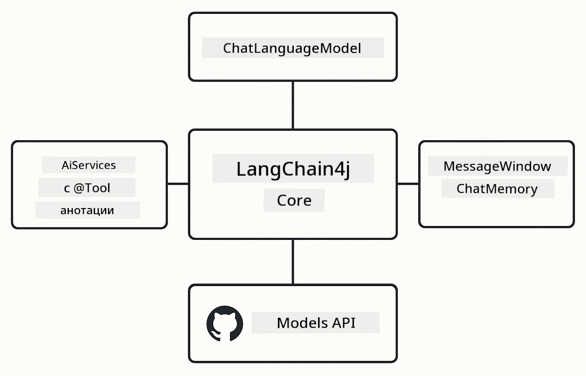

<!--
CO_OP_TRANSLATOR_METADATA:
{
  "original_hash": "377b3e3e6f8d02965bf0fbbc9ccb45c5",
  "translation_date": "2025-12-13T15:17:51+00:00",
  "source_file": "00-quick-start/README.md",
  "language_code": "bg"
}
-->
# Module 00: Бърз старт

## Съдържание

- [Въведение](../../../00-quick-start)
- [Какво е LangChain4j?](../../../00-quick-start)
- [Зависимости на LangChain4j](../../../00-quick-start)
- [Изисквания](../../../00-quick-start)
- [Настройка](../../../00-quick-start)
  - [1. Вземете своя GitHub токен](../../../00-quick-start)
  - [2. Задайте своя токен](../../../00-quick-start)
- [Стартиране на примерите](../../../00-quick-start)
  - [1. Основен чат](../../../00-quick-start)
  - [2. Шаблони за подсказки](../../../00-quick-start)
  - [3. Извикване на функции](../../../00-quick-start)
  - [4. Въпроси и отговори по документи (RAG)](../../../00-quick-start)
- [Какво показва всеки пример](../../../00-quick-start)
- [Следващи стъпки](../../../00-quick-start)
- [Отстраняване на проблеми](../../../00-quick-start)

## Въведение

Този бърз старт е предназначен да ви помогне да започнете работа с LangChain4j възможно най-бързо. Той покрива абсолютните основи на изграждането на AI приложения с LangChain4j и GitHub модели. В следващите модули ще използвате Azure OpenAI с LangChain4j за създаване на по-сложни приложения.

## Какво е LangChain4j?

LangChain4j е Java библиотека, която опростява изграждането на AI-задвижвани приложения. Вместо да се занимавате с HTTP клиенти и парсване на JSON, работите с чисти Java API-та.

„Верижката“ в LangChain се отнася до свързването на множество компоненти – може да свържете подсказка към модел, към парсър, или да свържете няколко AI извиквания, където изходът от едно се подава като вход на следващото. Този бърз старт се фокусира върху основите, преди да разгледа по-сложни вериги.


*Свързване на компоненти в LangChain4j – строителни блокове, които се свързват, за да създадат мощни AI работни потоци*

Ще използваме три основни компонента:

**ChatLanguageModel** – интерфейс за взаимодействие с AI моделите. Извиквате `model.chat("prompt")` и получавате отговор като низ. Използваме `OpenAiOfficialChatModel`, който работи с OpenAI-съвместими крайни точки като GitHub модели.

**AiServices** – създава тип-безопасни AI интерфейси за услуги. Дефинирате методи, анотирате ги с `@Tool` и LangChain4j се грижи за оркестрацията. AI автоматично извиква вашите Java методи, когато е необходимо.

**MessageWindowChatMemory** – поддържа история на разговора. Без него всяка заявка е независима. С него AI помни предишните съобщения и поддържа контекст през няколко хода.



*Архитектура на LangChain4j – основни компоненти, работещи заедно, за да захранват вашите AI приложения*

## Зависимости на LangChain4j

Този бърз старт използва две Maven зависимости в [`pom.xml`](../../../00-quick-start/pom.xml):

```xml
<!-- Core LangChain4j library -->
<dependency>
    <groupId>dev.langchain4j</groupId>
    <artifactId>langchain4j</artifactId> <!-- Inherited from BOM in root pom.xml -->
</dependency>

<!-- OpenAI integration (works with GitHub Models) -->
<dependency>
    <groupId>dev.langchain4j</groupId>
    <artifactId>langchain4j-open-ai-official</artifactId> <!-- Inherited from BOM in root pom.xml -->
</dependency>
```

Модулът `langchain4j-open-ai-official` предоставя класа `OpenAiOfficialChatModel`, който се свързва с OpenAI-съвместими API-та. GitHub Models използва същия API формат, така че не е необходим специален адаптер – просто насочете базовия URL към `https://models.github.ai/inference`.

## Изисквания

**Използвате ли Dev Container?** Java и Maven вече са инсталирани. Нужно ви е само GitHub Personal Access Token.

**Локална разработка:**
- Java 21+, Maven 3.9+
- GitHub Personal Access Token (инструкции по-долу)

> **Забележка:** Този модул използва `gpt-4.1-nano` от GitHub Models. Не променяйте името на модела в кода – той е конфигуриран да работи с наличните модели на GitHub.

## Настройка

### 1. Вземете своя GitHub токен

1. Отидете на [GitHub Settings → Personal Access Tokens](https://github.com/settings/personal-access-tokens)
2. Кликнете „Generate new token“
3. Задайте описателно име (например „LangChain4j Demo“)
4. Задайте срок на валидност (препоръчително 7 дни)
5. Под „Account permissions“ намерете „Models“ и задайте „Read-only“
6. Кликнете „Generate token“
7. Копирайте и запазете токена – няма да го видите отново

### 2. Задайте своя токен

**Опция 1: Използване на VS Code (препоръчително)**

Ако използвате VS Code, добавете токена си във файла `.env` в корена на проекта:

Ако файлът `.env` не съществува, копирайте `.env.example` като `.env` или създайте нов `.env` файл в корена на проекта.

**Примерен `.env` файл:**
```bash
# В /workspaces/LangChain4j-for-Beginners/.env
GITHUB_TOKEN=your_token_here
```

След това просто кликнете с десен бутон върху някой демо файл (например `BasicChatDemo.java`) в Explorer и изберете **"Run Java"** или използвайте конфигурациите за стартиране от панела Run and Debug.

**Опция 2: Използване на терминал**

Задайте токена като променлива на средата:

**Bash:**
```bash
export GITHUB_TOKEN=your_token_here
```

**PowerShell:**
```powershell
$env:GITHUB_TOKEN=your_token_here
```

## Стартиране на примерите

**Използване на VS Code:** Просто кликнете с десен бутон върху някой демо файл в Explorer и изберете **"Run Java"**, или използвайте конфигурациите за стартиране от панела Run and Debug (уверете се, че сте добавили токена си във файла `.env` първо).

**Използване на Maven:** Алтернативно, можете да стартирате от командния ред:

### 1. Основен чат

**Bash:**
```bash
mvn compile exec:java -Dexec.mainClass=com.example.langchain4j.quickstart.BasicChatDemo
```

**PowerShell:**
```powershell
mvn --% compile exec:java -Dexec.mainClass=com.example.langchain4j.quickstart.BasicChatDemo
```

### 2. Шаблони за подсказки

**Bash:**
```bash
mvn compile exec:java -Dexec.mainClass=com.example.langchain4j.quickstart.PromptEngineeringDemo
```

**PowerShell:**
```powershell
mvn --% compile exec:java -Dexec.mainClass=com.example.langchain4j.quickstart.PromptEngineeringDemo
```

Показва zero-shot, few-shot, chain-of-thought и role-based подсказки.

### 3. Извикване на функции

**Bash:**
```bash
mvn compile exec:java -Dexec.mainClass=com.example.langchain4j.quickstart.ToolIntegrationDemo
```

**PowerShell:**
```powershell
mvn --% compile exec:java -Dexec.mainClass=com.example.langchain4j.quickstart.ToolIntegrationDemo
```

AI автоматично извиква вашите Java методи, когато е необходимо.

### 4. Въпроси и отговори по документи (RAG)

**Bash:**
```bash
mvn compile exec:java -Dexec.mainClass=com.example.langchain4j.quickstart.SimpleReaderDemo
```

**PowerShell:**
```powershell
mvn --% compile exec:java -Dexec.mainClass=com.example.langchain4j.quickstart.SimpleReaderDemo
```

Задавайте въпроси за съдържанието в `document.txt`.

## Какво показва всеки пример

**Основен чат** - [BasicChatDemo.java](../../../00-quick-start/src/main/java/com/example/langchain4j/quickstart/BasicChatDemo.java)

Започнете тук, за да видите LangChain4j в най-простия му вид. Ще създадете `OpenAiOfficialChatModel`, ще изпратите подсказка с `.chat()` и ще получите отговор. Това демонстрира основата: как да инициализирате модели с персонализирани крайни точки и API ключове. След като разберете този модел, всичко останало се изгражда върху него.

```java
ChatLanguageModel model = OpenAiOfficialChatModel.builder()
    .baseUrl("https://models.github.ai/inference")
    .apiKey(System.getenv("GITHUB_TOKEN"))
    .modelName("gpt-4.1-nano")
    .build();

String response = model.chat("What is LangChain4j?");
System.out.println(response);
```

> **🤖 Опитайте с [GitHub Copilot](https://github.com/features/copilot) Chat:** Отворете [`BasicChatDemo.java`](../../../00-quick-start/src/main/java/com/example/langchain4j/quickstart/BasicChatDemo.java) и попитайте:
> - "Как да премина от GitHub Models към Azure OpenAI в този код?"
> - "Какви други параметри мога да конфигурирам в OpenAiOfficialChatModel.builder()?"
> - "Как да добавя стрийминг на отговори вместо да чакам пълния отговор?"

**Инженеринг на подсказки** - [PromptEngineeringDemo.java](../../../00-quick-start/src/main/java/com/example/langchain4j/quickstart/PromptEngineeringDemo.java)

Сега, когато знаете как да говорите с модел, нека разгледаме какво му казвате. Това демо използва същата настройка на модела, но показва четири различни шаблона за подсказки. Опитайте zero-shot подсказки за директни инструкции, few-shot подсказки, които учат от примери, chain-of-thought подсказки, които разкриват стъпки на разсъждение, и role-based подсказки, които задават контекст. Ще видите как един и същ модел дава драстично различни резултати в зависимост от това как формулирате заявката си.

```java
PromptTemplate template = PromptTemplate.from(
    "What's the best time to visit {{destination}} for {{activity}}?"
);

Prompt prompt = template.apply(Map.of(
    "destination", "Paris",
    "activity", "sightseeing"
));

String response = model.chat(prompt.text());
```

> **🤖 Опитайте с [GitHub Copilot](https://github.com/features/copilot) Chat:** Отворете [`PromptEngineeringDemo.java`](../../../00-quick-start/src/main/java/com/example/langchain4j/quickstart/PromptEngineeringDemo.java) и попитайте:
> - "Каква е разликата между zero-shot и few-shot подсказки и кога да използвам всяка?"
> - "Как параметърът температура влияе на отговорите на модела?"
> - "Какви са някои техники за предотвратяване на атаки с инжектиране на подсказки в продукция?"
> - "Как мога да създам многократно използваеми обекти PromptTemplate за общи шаблони?"

**Интеграция на инструменти** - [ToolIntegrationDemo.java](../../../00-quick-start/src/main/java/com/example/langchain4j/quickstart/ToolIntegrationDemo.java)

Тук LangChain4j става мощен. Ще използвате `AiServices`, за да създадете AI асистент, който може да извиква вашите Java методи. Просто анотирайте методите с `@Tool("описание")` и LangChain4j се грижи за останалото – AI автоматично решава кога да използва всеки инструмент според това, което потребителят пита. Това демонстрира извикване на функции, ключова техника за изграждане на AI, който може да предприема действия, а не само да отговаря на въпроси.

```java
@Tool("Performs addition of two numeric values")
public double add(double a, double b) {
    return a + b;
}

MathAssistant assistant = AiServices.create(MathAssistant.class, model);
String response = assistant.chat("What is 25 plus 17?");
```

> **🤖 Опитайте с [GitHub Copilot](https://github.com/features/copilot) Chat:** Отворете [`ToolIntegrationDemo.java`](../../../00-quick-start/src/main/java/com/example/langchain4j/quickstart/ToolIntegrationDemo.java) и попитайте:
> - "Как работи анотацията @Tool и какво прави LangChain4j с нея зад кулисите?"
> - "Може ли AI да извиква няколко инструмента последователно, за да решава сложни проблеми?"
> - "Какво се случва, ако инструмент хвърли изключение – как да обработвам грешки?"
> - "Как бих интегрирал реално API вместо този пример с калкулатор?"

**Въпроси и отговори по документи (RAG)** - [SimpleReaderDemo.java](../../../00-quick-start/src/main/java/com/example/langchain4j/quickstart/SimpleReaderDemo.java)

Тук ще видите основата на RAG (retrieval-augmented generation). Вместо да разчитате на обучителните данни на модела, зареждате съдържание от [`document.txt`](../../../00-quick-start/document.txt) и го включвате в подсказката. AI отговаря въз основа на вашия документ, а не на общите си знания. Това е първата стъпка към изграждане на системи, които могат да работят с ваши собствени данни.

```java
Document document = FileSystemDocumentLoader.loadDocument("document.txt");
String content = document.text();

String prompt = "Based on this document: " + content + 
                "\nQuestion: What is the main topic?";
String response = model.chat(prompt);
```

> **Забележка:** Този прост подход зарежда целия документ в подсказката. За големи файлове (>10KB) ще надвишите лимитите на контекста. Модул 03 разглежда разделяне на части и векторно търсене за продукционни RAG системи.

> **🤖 Опитайте с [GitHub Copilot](https://github.com/features/copilot) Chat:** Отворете [`SimpleReaderDemo.java`](../../../00-quick-start/src/main/java/com/example/langchain4j/quickstart/SimpleReaderDemo.java) и попитайте:
> - "Как RAG предотвратява халюцинациите на AI в сравнение с използването на обучителните данни на модела?"
> - "Каква е разликата между този прост подход и използването на векторни вграждания за извличане?"
> - "Как бих мащабирал това, за да обработвам множество документи или по-големи бази знания?"
> - "Кои са най-добрите практики за структуриране на подсказката, за да се гарантира, че AI използва само предоставения контекст?"

## Отстраняване на грешки

Примерите включват `.logRequests(true)` и `.logResponses(true)`, за да показват API извиквания в конзолата. Това помага при отстраняване на грешки с автентикация, ограничения на скоростта или неочаквани отговори. Премахнете тези флагове в продукция, за да намалите шума в логовете.

## Следващи стъпки

**Следващ модул:** [01-introduction - Започване с LangChain4j и gpt-5 в Azure](../01-introduction/README.md)

---

**Навигация:** [← Обратно към Основното](../README.md) | [Напред: Модул 01 - Въведение →](../01-introduction/README.md)

---

## Отстраняване на проблеми

### Първо компилиране с Maven

**Проблем:** Първоначалното `mvn clean compile` или `mvn package` отнема много време (10-15 минути)

**Причина:** Maven трябва да изтегли всички зависимости на проекта (Spring Boot, LangChain4j библиотеки, Azure SDK и др.) при първото компилиране.

**Решение:** Това е нормално поведение. Следващите компилации ще са много по-бързи, тъй като зависимостите се кешират локално. Времето за изтегляне зависи от скоростта на вашата мрежа.

### Синтаксис на Maven команди в PowerShell

**Проблем:** Maven командите се провалят с грешка `Unknown lifecycle phase ".mainClass=..."`

**Причина:** PowerShell интерпретира `=` като оператор за задаване на променлива, което нарушава синтаксиса на Maven свойствата

**Решение:** Използвайте оператора за спиране на парсване `--%` преди Maven командата:

**PowerShell:**
```powershell
mvn --% compile exec:java -Dexec.mainClass=com.example.langchain4j.quickstart.BasicChatDemo
```

**Bash:**
```bash
mvn compile exec:java -Dexec.mainClass=com.example.langchain4j.quickstart.BasicChatDemo
```

Операторът `--%` казва на PowerShell да предаде всички останали аргументи буквално на Maven без интерпретация.

### Показване на емоджита в Windows PowerShell

**Проблем:** AI отговорите показват неразбираеми символи (например `????` или `â??`) вместо емоджита в PowerShell

**Причина:** По подразбиране PowerShell не поддържа UTF-8 емоджита

**Решение:** Изпълнете тази команда преди стартиране на Java приложения:
```cmd
chcp 65001
```

Това принуждава терминала да използва UTF-8 кодиране. Алтернативно, използвайте Windows Terminal, който има по-добра поддръжка на Unicode.

---

<!-- CO-OP TRANSLATOR DISCLAIMER START -->
**Отказ от отговорност**:  
Този документ е преведен с помощта на AI преводаческа услуга [Co-op Translator](https://github.com/Azure/co-op-translator). Въпреки че се стремим към точност, моля, имайте предвид, че автоматизираните преводи могат да съдържат грешки или неточности. Оригиналният документ на неговия роден език трябва да се счита за авторитетен източник. За критична информация се препоръчва професионален човешки превод. Ние не носим отговорност за каквито и да е недоразумения или неправилни тълкувания, произтичащи от използването на този превод.
<!-- CO-OP TRANSLATOR DISCLAIMER END -->