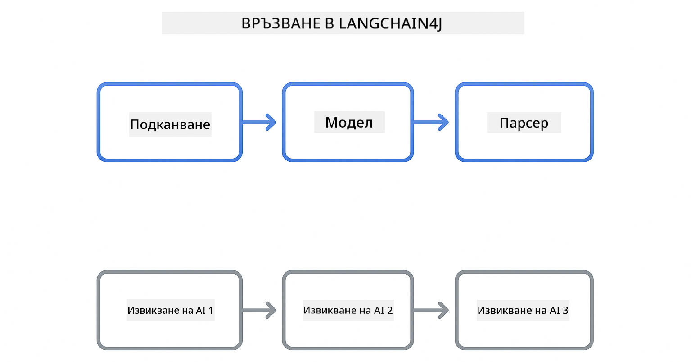

<!--
CO_OP_TRANSLATOR_METADATA:
{
  "original_hash": "22b5d7c8d7585325e38b37fd29eafe25",
  "translation_date": "2026-01-06T01:08:56+00:00",
  "source_file": "00-quick-start/README.md",
  "language_code": "bg"
}
-->
# Модул 00: Бърз старт

## Съдържание

- [Въведение](../../../00-quick-start)
- [Какво е LangChain4j?](../../../00-quick-start)
- [Зависимости на LangChain4j](../../../00-quick-start)
- [Предварителни изисквания](../../../00-quick-start)
- [Настройка](../../../00-quick-start)
  - [1. Вземете вашия GitHub токен](../../../00-quick-start)
  - [2. Задайте вашия токен](../../../00-quick-start)
- [Изпълнение на примерите](../../../00-quick-start)
  - [1. Основен чат](../../../00-quick-start)
  - [2. Шаблони за подкана](../../../00-quick-start)
  - [3. Извикване на функции](../../../00-quick-start)
  - [4. Въпроси и отговори по документ (RAG)](../../../00-quick-start)
  - [5. Отговорен AI](../../../00-quick-start)
- [Какво показва всеки пример](../../../00-quick-start)
- [Следващи стъпки](../../../00-quick-start)
- [Отстраняване на проблеми](../../../00-quick-start)

## Въведение

Този бърз старт е предназначен да ви помогне да започнете работа с LangChain4j възможно най-бързо. Той обхваща абсолютните основи на изграждане на AI приложения с LangChain4j и GitHub модели. В следващите модули ще използвате Azure OpenAI с LangChain4j, за да изградите по-сложни приложения.

## Какво е LangChain4j?

LangChain4j е Java библиотека, която опростява създаването на приложения с изкуствен интелект. Вместо да се занимавате с HTTP клиенти и парсване на JSON, работите с чисти Java API-та.

„Цепната верига“ (chain) в LangChain се отнася до свързване на множество компоненти - може да свържете подкана с модел, с парсър или да свържете няколко AI извиквания, при които един изход влиза като вход към следващото. Този бърз старт се фокусира върху основите, преди да изследва по-сложни вериги.



*Свързване на компоненти в LangChain4j – строителни блокове, свързващи се, за да създадат мощни AI работни потоци*

Ще използваме три основни компонента:

**ChatLanguageModel** – интерфейс за взаимодействия с AI модел. Извиквате `model.chat("prompt")` и получавате отговор като стринг. Използваме `OpenAiOfficialChatModel`, който работи с OpenAI-съвместими крайни точки като GitHub модели.

**AiServices** – създава типово безопасни AI сервизни интерфейси. Дефинирате методи, анотирате ги с `@Tool` и LangChain4j управлява оркестрацията. AI автоматично извиква Java методите ви когато е нужно.

**MessageWindowChatMemory** – поддържа история на разговора. Без него всяка заявка е независима. С него AI помни предишни съобщения и поддържа контекст през няколко ходове.


*Архитектура на LangChain4j – основни компоненти, работещи заедно, за да захранват вашите AI приложения*

## Зависимости на LangChain4j

Този бърз старт използва две зависимости Maven в [`pom.xml`](../../../00-quick-start/pom.xml):

```xml
<!-- Core LangChain4j library -->
<dependency>
    <groupId>dev.langchain4j</groupId>
    <artifactId>langchain4j</artifactId> <!-- Inherited from BOM in root pom.xml -->
</dependency>

<!-- OpenAI integration (works with GitHub Models) -->
<dependency>
    <groupId>dev.langchain4j</groupId>
    <artifactId>langchain4j-open-ai-official</artifactId> <!-- Inherited from BOM in root pom.xml -->
</dependency>
```

Модулът `langchain4j-open-ai-official` предоставя класа `OpenAiOfficialChatModel`, който се свързва с OpenAI-съвместими API-та. GitHub Models използва същия API формат, така че не е необходим специален адаптер – просто посочете базовия URL към `https://models.github.ai/inference`.

## Предварителни изисквания

**Използвате ли Dev Container?** Java и Maven вече са инсталирани. Необходим ви е само GitHub Personal Access Token.

**Локална разработка:**
- Java 21+, Maven 3.9+
- GitHub Personal Access Token (инструкции по-долу)

> **Забележка:** Този модул използва `gpt-4.1-nano` от GitHub Models. Не променяйте името на модела в кода – той е конфигуриран да работи с наличните модели на GitHub.

## Настройка

### 1. Вземете вашия GitHub токен

1. Отидете в [GitHub Settings → Personal Access Tokens](https://github.com/settings/personal-access-tokens)
2. Кликнете "Generate new token"
3. Задайте описателно име (например "LangChain4j Demo")
4. Изберете срок на валидност (препоръчително 7 дни)
5. Под "Account permissions" намерете "Models" и изберете "Read-only"
6. Кликнете "Generate token"
7. Копирайте и запазете токена си – няма да го видите повторно

### 2. Задайте вашия токен

**Вариант 1: Използване на VS Code (препоръчително)**

Ако използвате VS Code, добавете токена в `.env` файл в корена на проекта:

Ако `.env` файлът не съществува, копирайте `.env.example` като `.env` или създайте нов `.env` файл в корена на проекта.

**Примерен `.env` файл:**
```bash
# В /workspaces/LangChain4j-for-Beginners/.env
GITHUB_TOKEN=your_token_here
```

След това просто кликнете с десния бутон върху който и да е демонстрационен файл (напр. `BasicChatDemo.java`) в Explorer и изберете **"Run Java"** или използвайте конфигурациите за стартиране от панела Run and Debug.

**Вариант 2: Използване на терминал**

Задайте токена като променлива на средата:

**Bash:**
```bash
export GITHUB_TOKEN=your_token_here
```

**PowerShell:**
```powershell
$env:GITHUB_TOKEN=your_token_here
```

## Изпълнение на примерите

**Използване на VS Code:** Просто кликнете с десния бутон върху който и да е демонстрационен файл в Explorer и изберете **"Run Java"** или използвайте конфигурациите за стартиране от панела Run and Debug (уверете се, че сте добавили токена в `.env` файла първо).

**Използване на Maven:** Алтернативно, може да стартирате от командния ред:

### 1. Основен чат

**Bash:**
```bash
mvn compile exec:java -Dexec.mainClass=com.example.langchain4j.quickstart.BasicChatDemo
```

**PowerShell:**
```powershell
mvn --% compile exec:java -Dexec.mainClass=com.example.langchain4j.quickstart.BasicChatDemo
```

### 2. Шаблони за подкана

**Bash:**
```bash
mvn compile exec:java -Dexec.mainClass=com.example.langchain4j.quickstart.PromptEngineeringDemo
```

**PowerShell:**
```powershell
mvn --% compile exec:java -Dexec.mainClass=com.example.langchain4j.quickstart.PromptEngineeringDemo
```

Показва zero-shot, few-shot, chain-of-thought и role-based подкани.

### 3. Извикване на функции

**Bash:**
```bash
mvn compile exec:java -Dexec.mainClass=com.example.langchain4j.quickstart.ToolIntegrationDemo
```

**PowerShell:**
```powershell
mvn --% compile exec:java -Dexec.mainClass=com.example.langchain4j.quickstart.ToolIntegrationDemo
```

AI автоматично извиква вашите Java методи когато е необходимо.

### 4. Въпроси и отговори по документ (RAG)

**Bash:**
```bash
mvn compile exec:java -Dexec.mainClass=com.example.langchain4j.quickstart.SimpleReaderDemo
```

**PowerShell:**
```powershell
mvn --% compile exec:java -Dexec.mainClass=com.example.langchain4j.quickstart.SimpleReaderDemo
```

Задавайте въпроси относно съдържанието на `document.txt`.

### 5. Отговорен AI

**Bash:**
```bash
mvn compile exec:java -Dexec.mainClass=com.example.langchain4j.quickstart.ResponsibleAIDemo
```

**PowerShell:**
```powershell
mvn --% compile exec:java -Dexec.mainClass=com.example.langchain4j.quickstart.ResponsibleAIDemo
```

Вижте как филтрите за безопасност на AI блокират вредно съдържание.

## Какво показва всеки пример

**Основен чат** - [BasicChatDemo.java](../../../00-quick-start/src/main/java/com/example/langchain4j/quickstart/BasicChatDemo.java)

Започнете тук, за да видите LangChain4j в най-простата му форма. Ще създадете `OpenAiOfficialChatModel`, ще изпратите подкана с `.chat()` и ще получите отговор. Това демонстрира основата: как да инициализирате модели с потребителски крайни точки и API ключове. След като разберете този модел, всичко останало се изгражда върху него.

```java
ChatLanguageModel model = OpenAiOfficialChatModel.builder()
    .baseUrl("https://models.github.ai/inference")
    .apiKey(System.getenv("GITHUB_TOKEN"))
    .modelName("gpt-4.1-nano")
    .build();

String response = model.chat("What is LangChain4j?");
System.out.println(response);
```

> **🤖 Опитайте с [GitHub Copilot](https://github.com/features/copilot) Chat:** Отворете [`BasicChatDemo.java`](../../../00-quick-start/src/main/java/com/example/langchain4j/quickstart/BasicChatDemo.java) и попитайте:
> - "Как да премина от GitHub Models към Azure OpenAI в този код?"
> - "Кои други параметри мога да конфигурирам в OpenAiOfficialChatModel.builder()?"
> - "Как да добавя стрийминг отговори вместо да чакам пълния отговор?"

**Инженеринг на подкани** - [PromptEngineeringDemo.java](../../../00-quick-start/src/main/java/com/example/langchain4j/quickstart/PromptEngineeringDemo.java)

Сега, когато знаете как да говорите с модел, да разгледаме какво му казвате. Този пример използва същата настройка на модела, но показва четири различни шаблона за подкана. Опитайте zero-shot подкани за директни инструкции, few-shot подкани, които учат от примери, chain-of-thought подкани, които разкриват логически стъпки, и role-based подкани, които задават контекст. Ще видите как един и същ модел дава драматично различни резултати в зависимост от начина на формулиране на заявката.

```java
PromptTemplate template = PromptTemplate.from(
    "What's the best time to visit {{destination}} for {{activity}}?"
);

Prompt prompt = template.apply(Map.of(
    "destination", "Paris",
    "activity", "sightseeing"
));

String response = model.chat(prompt.text());
```

> **🤖 Опитайте с [GitHub Copilot](https://github.com/features/copilot) Chat:** Отворете [`PromptEngineeringDemo.java`](../../../00-quick-start/src/main/java/com/example/langchain4j/quickstart/PromptEngineeringDemo.java) и попитайте:
> - "Каква е разликата между zero-shot и few-shot подкани и кога да използвам всяка от тях?"
> - "Как параметърът температура влияе върху отговорите на модела?"
> - "Какви техники има за предотвратяване на нападения чрез инжектиране на подкани в продукция?"
> - "Как да създам многократно използваеми обекти PromptTemplate за общи шаблони?"

**Интеграция на инструменти** - [ToolIntegrationDemo.java](../../../00-quick-start/src/main/java/com/example/langchain4j/quickstart/ToolIntegrationDemo.java)

Тук LangChain4j става мощен. Ще използвате `AiServices`, за да създадете AI асистент, който може да извиква вашите Java методи. Просто анотирайте методите с `@Tool("описание")` и LangChain4j се грижи за останалото – AI автоматично решава кога да използва всеки инструмент според това, което потребителят задава. Това демонстрира извикването на функции, ключова техника за изграждане на AI, който може да предприема действия, а не само да отговаря на въпроси.

```java
@Tool("Performs addition of two numeric values")
public double add(double a, double b) {
    return a + b;
}

MathAssistant assistant = AiServices.create(MathAssistant.class, model);
String response = assistant.chat("What is 25 plus 17?");
```

> **🤖 Опитайте с [GitHub Copilot](https://github.com/features/copilot) Chat:** Отворете [`ToolIntegrationDemo.java`](../../../00-quick-start/src/main/java/com/example/langchain4j/quickstart/ToolIntegrationDemo.java) и попитайте:
> - "Как работи анотацията @Tool и какво прави LangChain4j с нея зад кулисите?"
> - "Може ли AI да извиква няколко инструмента последователно, за да решава сложни проблеми?"
> - "Какво се случва, ако инструмент хвърли изключение – как трябва да обработвам грешки?"
> - "Как бих интегрирал реално API вместо този пример с калкулатор?"

**Въпроси и отговори по документ (RAG)** - [SimpleReaderDemo.java](../../../00-quick-start/src/main/java/com/example/langchain4j/quickstart/SimpleReaderDemo.java)

Тук ще видите основите на RAG (retrieval-augmented generation). Вместо да разчитате на данните за обучение на модела, зареждате съдържание от [`document.txt`](../../../00-quick-start/document.txt) и го включвате в подкана. AI отговаря въз основа на вашия документ, а не на общите си знания. Това е първата стъпка към изграждане на системи, които могат да работят с ваши собствени данни.

```java
Document document = FileSystemDocumentLoader.loadDocument("document.txt");
String content = document.text();

String prompt = "Based on this document: " + content + 
                "\nQuestion: What is the main topic?";
String response = model.chat(prompt);
```

> **Забележка:** Този прост подход зарежда целия документ в подкана. За големи файлове (>10KB) ще надхвърлите ограниченията на контекста. Модул 03 разглежда нарязване на парчета и векторно търсене за продукционни RAG системи.

> **🤖 Опитайте с [GitHub Copilot](https://github.com/features/copilot) Chat:** Отворете [`SimpleReaderDemo.java`](../../../00-quick-start/src/main/java/com/example/langchain4j/quickstart/SimpleReaderDemo.java) и попитайте:
> - "Как RAG предотвратява халюцинациите на AI в сравнение с използване на тренировъчните данни на модела?"
> - "Каква е разликата между този прост подход и използването на векторни вграждания за извличане?"
> - "Как бих мащабирал това, за да обработвам множество документи или по-големи бази знания?"
> - "Какви са най-добрите практики за структурирането на подкана, за да се уверя, че AI използва само предоставения контекст?"

**Отговорен AI** - [ResponsibleAIDemo.java](../../../00-quick-start/src/main/java/com/example/langchain4j/quickstart/ResponsibleAIDemo.java)

Изградете безопасност на AI с многостепенна защита. Този пример показва два слоя защита, работещи заедно:

**Част 1: LangChain4j входни предпазители** – Блокират опасни подкани преди да достигнат LLM. Създайте персонализирани предпазители, които проверяват за забранени ключови думи или шаблони. Те се изпълняват във вашия код, което е бързо и безплатно.

```java
class DangerousContentGuardrail implements InputGuardrail {
    @Override
    public InputGuardrailResult validate(UserMessage userMessage) {
        String text = userMessage.singleText().toLowerCase();
        if (text.contains("explosives")) {
            return fatal("Blocked: contains prohibited keyword");
        }
        return success();
    }
}
```

**Част 2: Филтри за безопасност на доставчика** – GitHub Models има вградени филтри, които хващат това, което вашите предпазители могат да пропуснат. Ще видите твърди блокирания (HTTP 400 грешки) за сериозни нарушения и меки откази, където AI любезно отхвърля.

> **🤖 Опитайте с [GitHub Copilot](https://github.com/features/copilot) Chat:** Отворете [`ResponsibleAIDemo.java`](../../../00-quick-start/src/main/java/com/example/langchain4j/quickstart/ResponsibleAIDemo.java) и попитайте:
> - "Какво е InputGuardrail и как да създам свой собствен?"
> - "Каква е разликата между твърд блок и мек отказ?"
> - "Защо да използваме и предпазители, и филтри на доставчика заедно?"

## Следващи стъпки

**Следващ модул:** [01-introduction - Започване с LangChain4j и gpt-5 на Azure](../01-introduction/README.md)

---

**Навигация:** [← Обратно към основната страница](../README.md) | [Следващ: Модул 01 - Въведение →](../01-introduction/README.md)

---

## Отстраняване на проблеми

### Първо компилиране с Maven

**Проблем:** Първоначалното `mvn clean compile` или `mvn package` отнема много време (10-15 минути)

**Причина:** Maven трябва да изтегли всички зависимости на проекта (Spring Boot, LangChain4j библиотеки, Azure SDK и др.) при първото компилиране.

**Решение:** Това е нормално поведение. Следващите компилации ще бъдат много по-бързи, тъй като зависимостите се кешират локално. Времето за изтегляне зависи от скоростта на вашата мрежа.

### Синтаксис на Maven команди в PowerShell

**Проблем:** Maven командите се провалят с грешка `Unknown lifecycle phase ".mainClass=..."`

**Причина:** PowerShell интерпретира `=` като оператор за задаване на променлива, което нарушава синтаксиса на Maven свойствата.
**Решение**: Използвайте оператора за спиране на анализа `--%` преди командата Maven:

**PowerShell:**
```powershell
mvn --% compile exec:java -Dexec.mainClass=com.example.langchain4j.quickstart.BasicChatDemo
```

**Bash:**
```bash
mvn compile exec:java -Dexec.mainClass=com.example.langchain4j.quickstart.BasicChatDemo
```

Операторът `--%` казва на PowerShell да предаде всички останали аргументи буквално на Maven без тълкуване.

### Отображение на емоджита в Windows PowerShell

**Проблем**: Отговорите на AI показват неразбираеми символи (напр. `????` или `â??`) вместо емоджита в PowerShell

**Причина**: По подразбиране PowerShell не използва UTF-8 кодировка, която поддържа емоджита

**Решение**: Изпълнете тази команда преди стартиране на Java приложения:
```cmd
chcp 65001
```

Това принуждава използване на UTF-8 кодировка в терминала. Алтернативно, използвайте Windows Terminal, който има по-добра поддръжка на Unicode.

### Отстраняване на грешки при API повиквания

**Проблем**: Грешки при удостоверяване, ограничения на скоростта или неочаквани отговори от AI модела

**Решение**: Примерите включват `.logRequests(true)` и `.logResponses(true)`, за да показват API повикванията в конзолата. Това помага при отстраняване на грешки с удостоверяването, ограниченията на скоростта или неочакваните отговори. Премахнете тези флагове в продукционна среда, за да намалите шума в логовете.

---

<!-- CO-OP TRANSLATOR DISCLAIMER START -->
**Отказ от отговорност**:
Този документ е преведен с помощта на AI преводаческия сервиз [Co-op Translator](https://github.com/Azure/co-op-translator). Въпреки че се стремим към точност, моля имайте предвид, че автоматизираните преводи могат да съдържат грешки или неточности. Оригиналният документ на първичния му език трябва да се счита за авторитетен източник. За критична информация се препоръчва професионален превод от човек. Ние не носим отговорност за каквито и да е недоразумения или неправилни тълкувания, произтичащи от използването на този превод.
<!-- CO-OP TRANSLATOR DISCLAIMER END -->