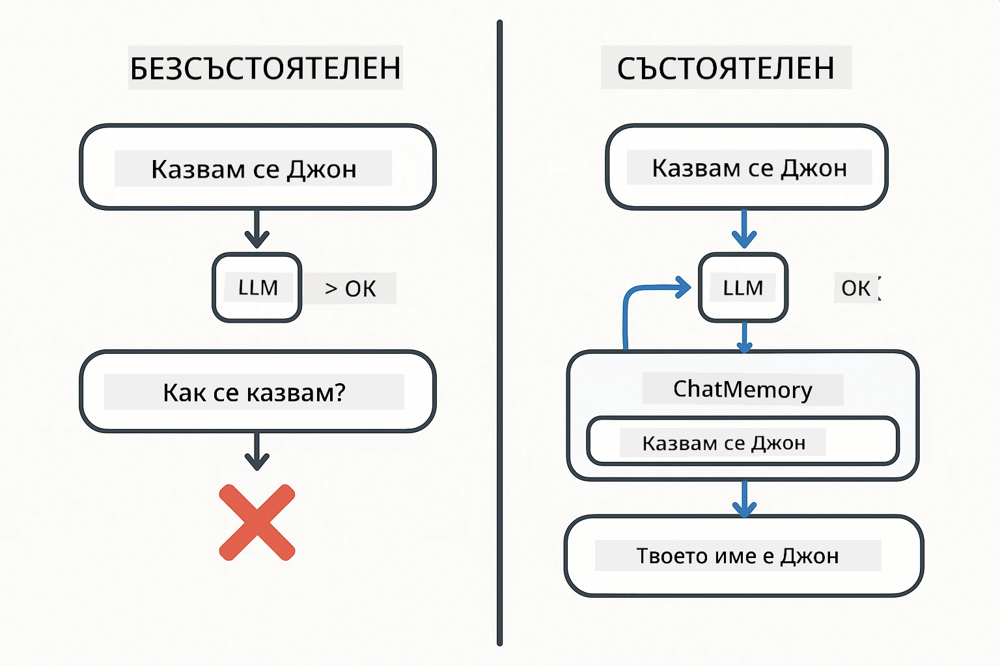
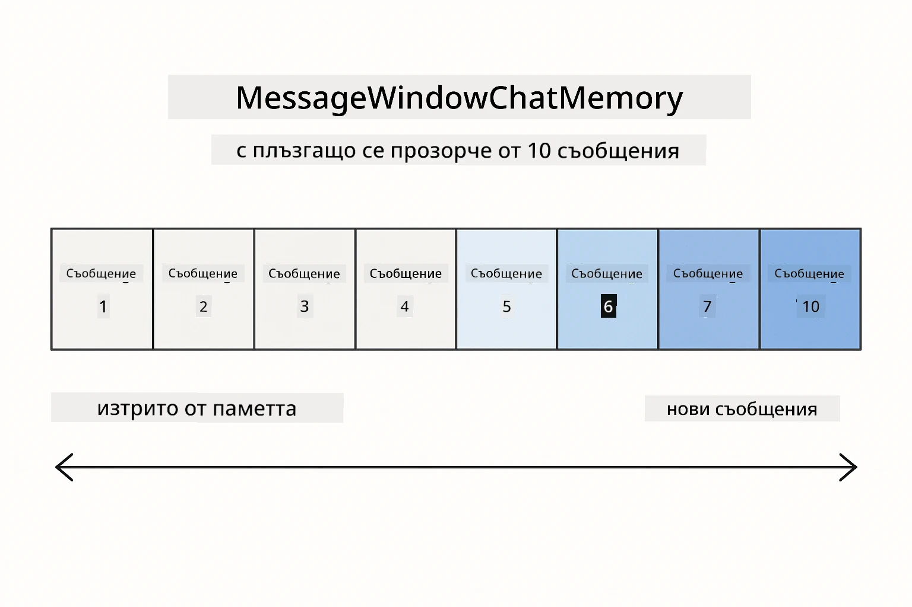
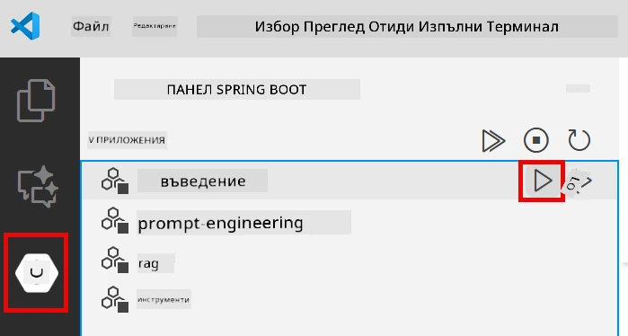
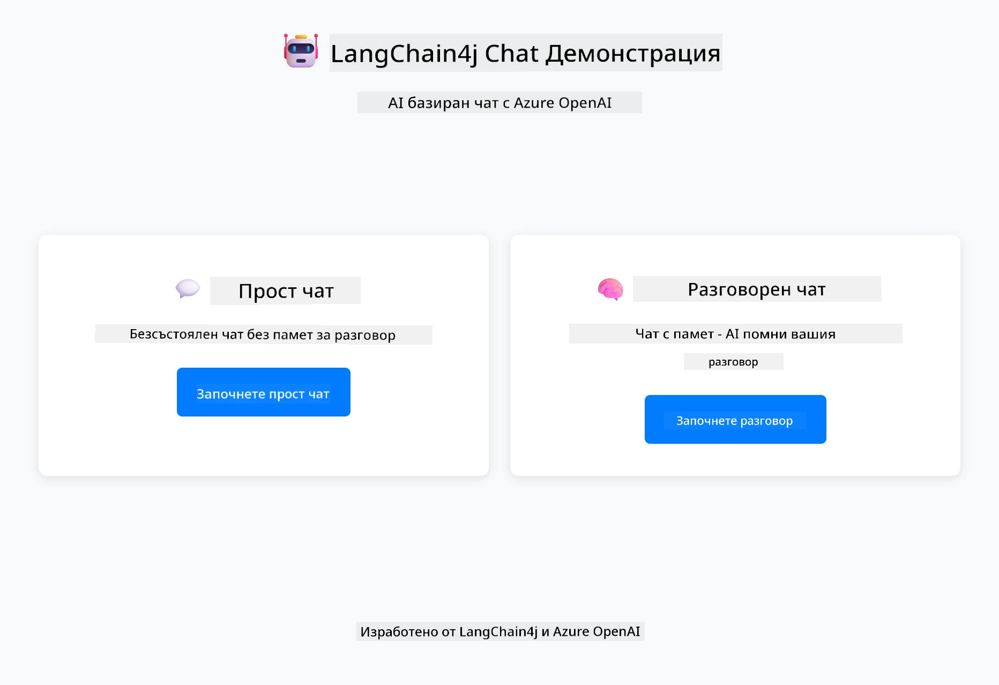
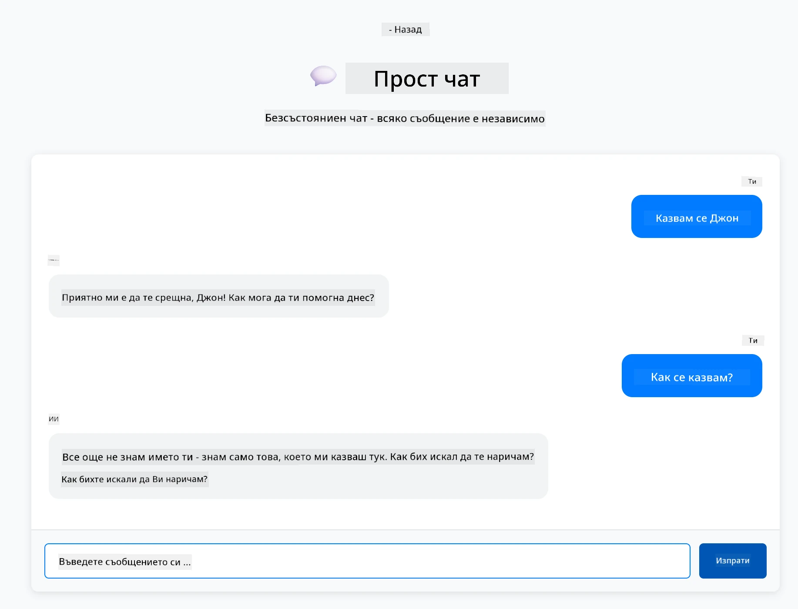
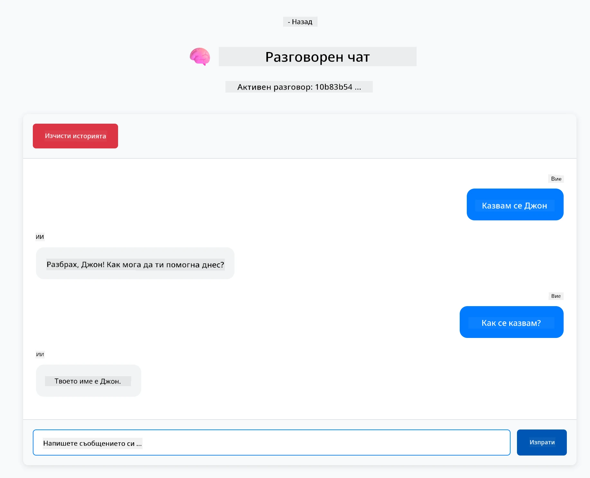

# Модул 01: Започване с LangChain4j

## Съдържание

- [Какво ще научите](../../../01-introduction)
- [Предварителни изисквания](../../../01-introduction)
- [Разбиране на основния проблем](../../../01-introduction)
- [Разбиране на токените](../../../01-introduction)
- [Как работи паметта](../../../01-introduction)
- [Как това използва LangChain4j](../../../01-introduction)
- [Деплой на Azure OpenAI инфраструктура](../../../01-introduction)
- [Стартиране на приложението локално](../../../01-introduction)
- [Използване на приложението](../../../01-introduction)
  - [Безсъстоянен чат (ляв панел)](../../../01-introduction)
  - [Състоянен чат (десен панел)](../../../01-introduction)
- [Следващи стъпки](../../../01-introduction)

## Какво ще научите

Ако сте завършили бързия старт, видяхте как да изпращате заявки и да получавате отговори. Това е основата, но реалните приложения изискват повече. Този модул ви учи как да изградите разговорен AI, който помни контекста и поддържа състояние - разликата между еднократно демо и приложение готово за продукция.

Ще използваме GPT-5 на Azure OpenAI през цялото ръководство, защото неговите усъвършенствани способности за разсъждение правят поведението на различните модели по-ясно. Когато добавите памет, ще видите разликата ясно. Това улеснява разбирането какво носи всеки компонент на вашето приложение.

Ще изградите едно приложение, което демонстрира и двата модела:

**Безсъстоянен чат** - Всяка заявка е независима. Моделът няма памет за предишни съобщения. Това е моделът, който използвахте в бързия старт.

**Състоянен разговор** - Всяка заявка включва история на разговора. Моделът поддържа контекст през няколко хода. Това е необходимо за продукционни приложения.

## Предварителни изисквания

- Абонамент за Azure с достъп до Azure OpenAI
- Java 21, Maven 3.9+
- Azure CLI (https://learn.microsoft.com/en-us/cli/azure/install-azure-cli)
- Azure Developer CLI (azd) (https://learn.microsoft.com/en-us/azure/developer/azure-developer-cli/install-azd)

> **Забележка:** Java, Maven, Azure CLI и Azure Developer CLI (azd) са предварително инсталирани в предоставения devcontainer.

> **Забележка:** Този модул използва GPT-5 на Azure OpenAI. Деплоймънтът се конфигурира автоматично чрез `azd up` - не променяйте името на модела в кода.

## Разбиране на основния проблем

Езиковите модели са безсъстояни. Всяко API повикване е независимо. Ако изпратите "Казвам се Джон" и след това попитате "Как се казвам?", моделът няма представа, че току-що се представихте. Той третира всяка заявка сякаш е първият ви разговор.

Това е добре за прости въпроси и отговори, но безполезно за реални приложения. Ботовете за обслужване на клиенти трябва да помнят какво сте им казали. Личните асистенти се нуждаят от контекст. Всеки разговор с няколко хода изисква памет.



*Разликата между безсъстояни (независими повиквания) и състояни (съобразени с контекста) разговори*

## Разбиране на токените

Преди да се потопите в разговорите, важно е да разберете токените - основните единици текст, които езиковите модели обработват:


*Пример как текстът се разбива на токени - "Обичам AI!" става 4 отделни единици за обработка*

Токените са начинът, по който AI моделите измерват и обработват текст. Думи, пунктуация и дори интервали могат да бъдат токени. Вашият модел има лимит колко токени може да обработва наведнъж (400 000 за GPT-5, с до 272 000 входни токени и 128 000 изходни токени). Разбирането на токените помага да управлявате дължината на разговора и разходите.

## Как работи паметта

Чат паметта решава проблема с безсъстояността, като поддържа история на разговора. Преди да изпратите заявката към модела, рамката добавя предишни релевантни съобщения. Когато попитате "Как се казвам?", системата всъщност изпраща цялата история на разговора, позволявайки на модела да види, че преди това сте казали "Казвам се Джон."

LangChain4j предоставя реализации на памет, които се грижат за това автоматично. Вие избирате колко съобщения да се запазят, а рамката управлява контекстния прозорец.



*MessageWindowChatMemory поддържа плъзгащ се прозорец с последните съобщения, автоматично премахвайки старите*

## Как това използва LangChain4j

Този модул разширява бързия старт чрез интеграция със Spring Boot и добавяне на памет за разговори. Ето как се свързват частите:

**Зависимости** - Добавете две библиотеки LangChain4j:

```xml
<dependency>
    <groupId>dev.langchain4j</groupId>
    <artifactId>langchain4j</artifactId> <!-- Inherited from BOM in root pom.xml -->
</dependency>
<dependency>
    <groupId>dev.langchain4j</groupId>
    <artifactId>langchain4j-open-ai-official</artifactId> <!-- Inherited from BOM in root pom.xml -->
</dependency>
```

**Чат модел** - Конфигурирайте Azure OpenAI като Spring bean ([LangChainConfig.java](../../../01-introduction/src/main/java/com/example/langchain4j/config/LangChainConfig.java)):

```java
@Bean
public OpenAiOfficialChatModel openAiOfficialChatModel() {
    return OpenAiOfficialChatModel.builder()
            .baseUrl(azureEndpoint)
            .apiKey(azureApiKey)
            .modelName(deploymentName)
            .timeout(Duration.ofMinutes(5))
            .maxRetries(3)
            .build();
}
```

Builder-ът чете идентификационни данни от променливи на средата, зададени от `azd up`. Задаването на `baseUrl` към вашия Azure endpoint прави OpenAI клиента съвместим с Azure OpenAI.

**Памет за разговори** - Следете историята на чата с MessageWindowChatMemory ([ConversationService.java](../../../01-introduction/src/main/java/com/example/langchain4j/service/ConversationService.java)):

```java
ChatMemory memory = MessageWindowChatMemory.withMaxMessages(10);

memory.add(UserMessage.from("My name is John"));
memory.add(AiMessage.from("Nice to meet you, John!"));

memory.add(UserMessage.from("What's my name?"));
AiMessage aiMessage = chatModel.chat(memory.messages()).aiMessage();
memory.add(aiMessage);
```

Създайте памет с `withMaxMessages(10)`, за да запазите последните 10 съобщения. Добавяйте съобщения от потребителя и AI с типизирани обвивки: `UserMessage.from(text)` и `AiMessage.from(text)`. Вземете историята с `memory.messages()` и я изпратете към модела. Сървисът съхранява отделни инстанции на памет за всеки ID на разговор, позволявайки множество потребители да чатят едновременно.

> **🤖 Опитайте с [GitHub Copilot](https://github.com/features/copilot) Chat:** Отворете [`ConversationService.java`](../../../01-introduction/src/main/java/com/example/langchain4j/service/ConversationService.java) и попитайте:
> - "Как MessageWindowChatMemory решава кои съобщения да изтрие, когато прозорецът е пълен?"
> - "Мога ли да имплементирам персонализирано съхранение на памет, използвайки база данни вместо в паметта?"
> - "Как бих добавил обобщение за компресиране на старата история на разговора?"

Безсъстояният чат endpoint пропуска паметта изцяло - просто `chatModel.chat(prompt)` както в бързия старт. Състояният endpoint добавя съобщения към паметта, извлича история и включва този контекст с всяка заявка. Същата конфигурация на модела, различни модели.

## Деплой на Azure OpenAI инфраструктура

**Bash:**
```bash
cd 01-introduction
azd up  # Изберете абонамент и местоположение (препоръчва се eastus2)
```

**PowerShell:**
```powershell
cd 01-introduction
azd up  # Изберете абонамент и местоположение (препоръчва се eastus2)
```

> **Забележка:** Ако получите грешка за изтичане на време (`RequestConflict: Cannot modify resource ... provisioning state is not terminal`), просто стартирайте `azd up` отново. Azure ресурсите може все още да се настройват на заден план, и повторното изпълнение позволява деплоймънтът да завърши, когато ресурсите достигнат терминално състояние.

Това ще:
1. Деплойне Azure OpenAI ресурс с GPT-5 и модели text-embedding-3-small
2. Автоматично генерира `.env` файл в корена на проекта с идентификационни данни
3. Настрои всички необходими променливи на средата

**Имате проблеми с деплоймънта?** Вижте [Infrastructure README](infra/README.md) за подробни инструкции за отстраняване на проблеми, включително конфликти с имена на поддомейни, ръчно деплойване през Azure Portal и насоки за конфигурация на моделите.

**Проверете дали деплоймънтът е успешен:**

**Bash:**
```bash
cat ../.env  # Трябва да показва AZURE_OPENAI_ENDPOINT, API_KEY и др.
```

**PowerShell:**
```powershell
Get-Content ..\.env  # Трябва да показва AZURE_OPENAI_ENDPOINT, API_KEY и др.
```

> **Забележка:** Командата `azd up` автоматично генерира `.env` файла. Ако трябва да го обновите по-късно, можете или да редактирате `.env` файла ръчно, или да го регенерирате чрез:
>
> **Bash:**
> ```bash
> cd ..
> bash .azd-env.sh
> ```
>
> **PowerShell:**
> ```powershell
> cd ..
> .\.azd-env.ps1
> ```

## Стартиране на приложението локално

**Проверете деплоймънта:**

Уверете се, че `.env` файлът съществува в коренната директория с Azure идентификационни данни:

**Bash:**
```bash
cat ../.env  # Трябва да показва AZURE_OPENAI_ENDPOINT, API_KEY, DEPLOYMENT
```

**PowerShell:**
```powershell
Get-Content ..\.env  # Трябва да показва AZURE_OPENAI_ENDPOINT, API_KEY, DEPLOYMENT
```

**Стартирайте приложенията:**

**Опция 1: Използване на Spring Boot Dashboard (Препоръчително за потребители на VS Code)**

Dev контейнерът включва разширението Spring Boot Dashboard, което предоставя визуален интерфейс за управление на всички Spring Boot приложения. Можете да го намерите в Activity Bar отляво във VS Code (потърсете иконата на Spring Boot).

От Spring Boot Dashboard можете:
- Да видите всички налични Spring Boot приложения в работната област
- Да стартирате/спирате приложения с един клик
- Да преглеждате логове на приложението в реално време
- Да следите статуса на приложението

Просто кликнете бутона за пускане до "introduction", за да стартирате този модул, или стартирайте всички модули наведнъж.



**Опция 2: Използване на shell скриптове**

Стартирайте всички уеб приложения (модули 01-04):

**Bash:**
```bash
cd ..  # От коренната директория
./start-all.sh
```

**PowerShell:**
```powershell
cd ..  # От коренната директория
.\start-all.ps1
```

Или стартирайте само този модул:

**Bash:**
```bash
cd 01-introduction
./start.sh
```

**PowerShell:**
```powershell
cd 01-introduction
.\start.ps1
```

Двата скрипта автоматично зареждат променливите на средата от коренния `.env` файл и ще компилират JAR файловете, ако не съществуват.

> **Забележка:** Ако предпочитате да компилирате всички модули ръчно преди стартиране:
>
> **Bash:**
> ```bash
> cd ..  # Go to root directory
> mvn clean package -DskipTests
> ```
>
> **PowerShell:**
> ```powershell
> cd ..  # Go to root directory
> mvn clean package -DskipTests
> ```

Отворете http://localhost:8080 в браузъра си.

**За спиране:**

**Bash:**
```bash
./stop.sh  # Само този модул
# Или
cd .. && ./stop-all.sh  # Всички модули
```

**PowerShell:**
```powershell
.\stop.ps1  # Само този модул
# Или
cd ..; .\stop-all.ps1  # Всички модули
```

## Използване на приложението

Приложението предоставя уеб интерфейс с две реализации на чат една до друга.



*Табло, показващо опции за Прост чат (безсъстоянен) и Разговорен чат (състоянен)*

### Безсъстоянен чат (ляв панел)

Опитайте първо това. Попитайте "Казвам се Джон" и веднага след това "Как се казвам?" Моделът няма да запомни, защото всяко съобщение е независимо. Това демонстрира основния проблем при базовата интеграция на езиков модел - липса на контекст на разговора.



*AI не помни името ви от предишното съобщение*

### Състоянен чат (десен панел)

Сега опитайте същата последователност тук. Попитайте "Казвам се Джон" и след това "Как се казвам?" Този път помни. Разликата е MessageWindowChatMemory - той поддържа история на разговора и я включва с всяка заявка. Така работи продукционният разговорен AI.



*AI помни името ви от по-рано в разговора*

Двата панела използват един и същ GPT-5 модел. Единствената разлика е паметта. Това ясно показва какво носи паметта на вашето приложение и защо е съществена за реални случаи.

## Следващи стъпки

**Следващ модул:** [02-prompt-engineering - Проектиране на заявки с GPT-5](../02-prompt-engineering/README.md)

---

**Навигация:** [← Предишен: Модул 00 - Бърз старт](../00-quick-start/README.md) | [Обратно към Основното](../README.md) | [Следващ: Модул 02 - Проектиране на заявки →](../02-prompt-engineering/README.md)

---

<!-- CO-OP TRANSLATOR DISCLAIMER START -->
**Отказ от отговорност**:  
Този документ е преведен с помощта на AI преводаческа услуга [Co-op Translator](https://github.com/Azure/co-op-translator). Въпреки че се стремим към точност, моля, имайте предвид, че автоматизираните преводи могат да съдържат грешки или неточности. Оригиналният документ на неговия роден език трябва да се счита за авторитетен източник. За критична информация се препоръчва професионален човешки превод. Ние не носим отговорност за каквито и да е недоразумения или неправилни тълкувания, произтичащи от използването на този превод.
<!-- CO-OP TRANSLATOR DISCLAIMER END -->