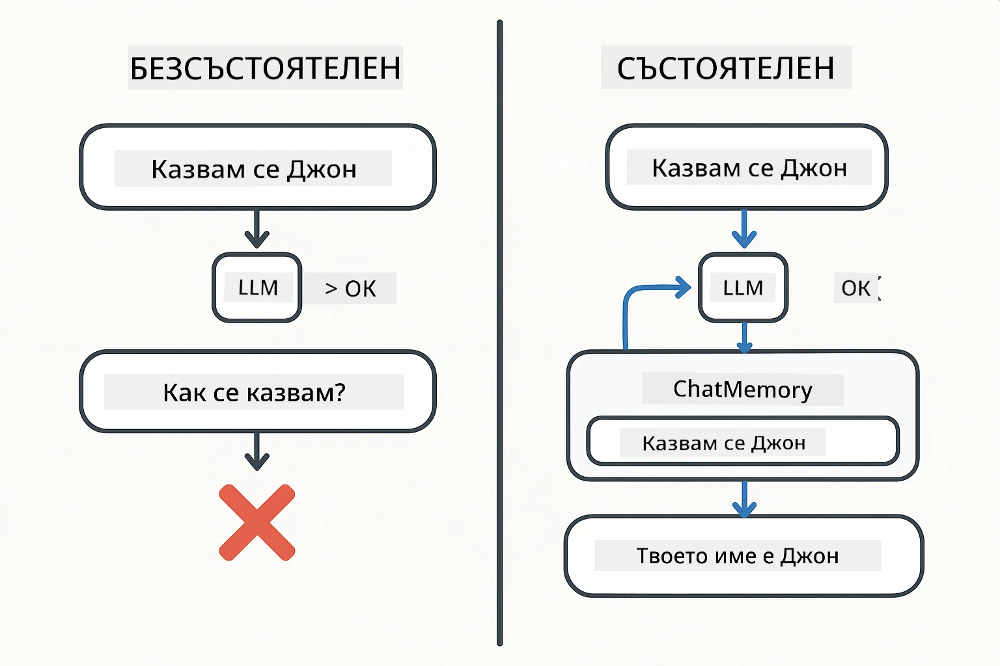
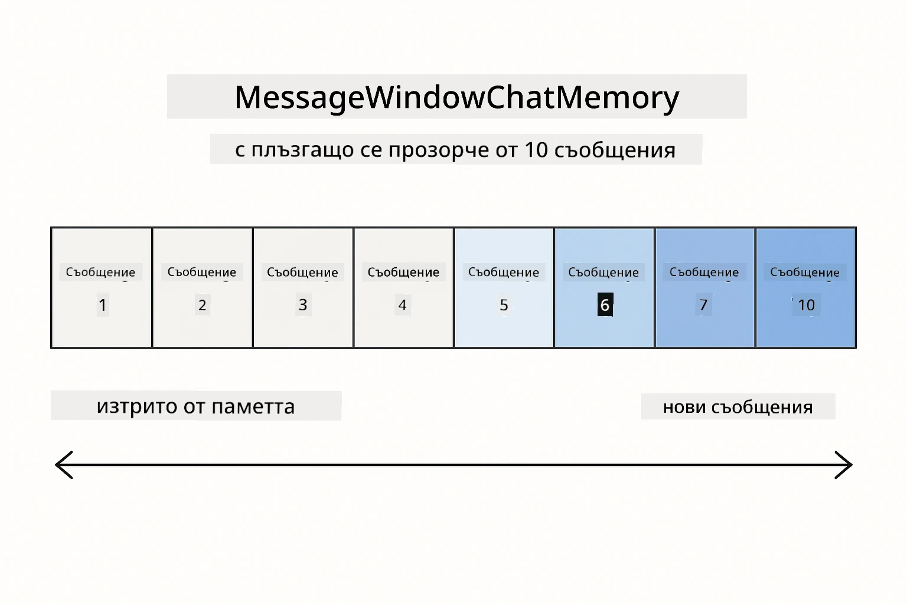
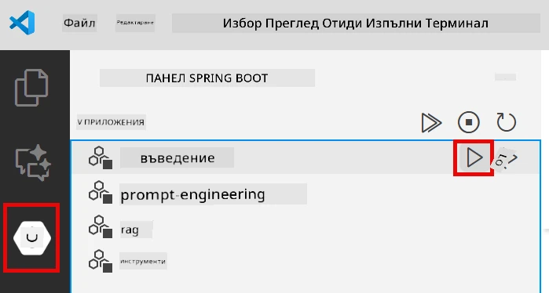
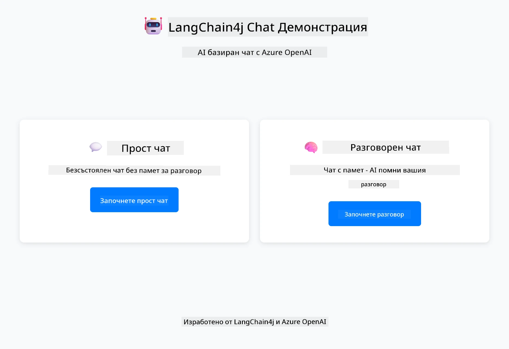
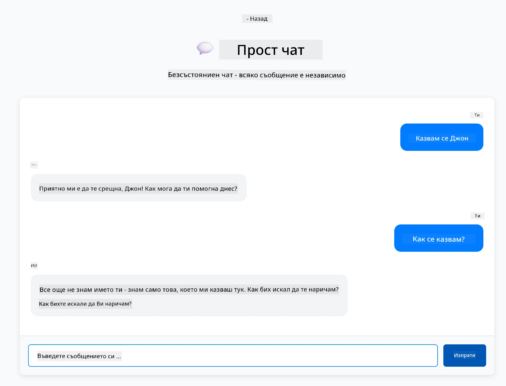
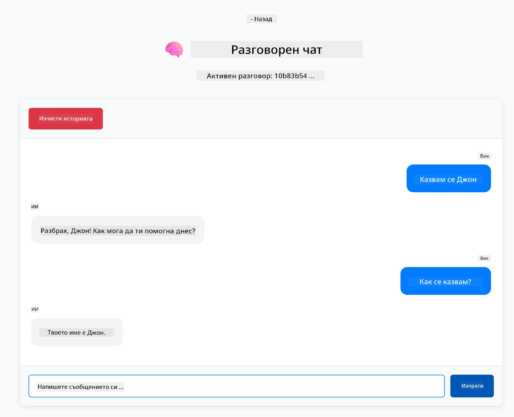

# Модул 01: Започване с LangChain4j

## Съдържание

- [Видео обхождане](#видео-обхождане)
- [Какво ще научите](#какво-ще-научите)
- [Предварителни изисквания](#предварителни-изисквания)
- [Разбиране на основния проблем](#разбиране-на-основния-проблем)
- [Разбиране на токените](#разбиране-на-токените)
- [Как работи паметта](#как-работи-паметта)
- [Как това използва LangChain4j](#как-това-използва-langchain4j)
- [Деплойване на Azure OpenAI инфраструктура](#деплойване-на-azure-openai-инфраструктура)
- [Стартиране на приложението локално](#стартиране-на-приложението-локално)
- [Използване на приложението](#използване-на-приложението)
  - [Чат без състояние (ляв панел)](#чат-без-състояние-ляв-панел)
  - [Чат със състояние (десен панел)](#чат-със-състояние-десен-панел)
- [Следващи стъпки](#следващи-стъпки)

## Видео обхождане

Гледайте тази сесия на живо, която обяснява как да започнете с този модул:

<a href="https://www.youtube.com/live/nl_troDm8rQ?si=6b85S8xGjWnT2fX9"></a>

## Какво ще научите

Това е вашата начална точка с LangChain4j и Azure OpenAI. Започваме с основите и започваме да изграждаме приложения в стил продукция. Този модул се фокусира върху разговорен ИИ, който помни контекста и поддържа състояние — основните концепции, върху които стъпва всеки следващ модул.

Ще използваме Azure OpenAI GPT-5.2 през цялото ръководство, защото неговите усъвършенствани възможности за разсъждение правят поведението на различните модели по-ясно. Когато добавите памет, разликата се вижда ясно. Това улеснява разбирането какво всяка част носи на вашето приложение.

Ще изградите едно приложение, което демонстрира и двата модела:

**Чат без състояние** - Всяка заявка е независима. Моделът няма памет за предишни съобщения. Това е най-простото начало.

**Чат със състояние** - Всяка заявка включва история на разговора. Моделът поддържа контекст през няколко реплики. Това е необходимо за продукционни приложения.

## Предварителни изисквания

- Абонамент за Azure с достъп до Azure OpenAI
- Java 21, Maven 3.9+
- Azure CLI (https://learn.microsoft.com/en-us/cli/azure/install-azure-cli)
- Azure Developer CLI (azd) (https://learn.microsoft.com/en-us/azure/developer/azure-developer-cli/install-azd)

> **Забележка:** Java, Maven, Azure CLI и Azure Developer CLI (azd) са предварително инсталирани в предоставения devcontainer.

> **Забележка:** Този модул използва GPT-5.2 на Azure OpenAI. Деплойването се конфигурира автоматично чрез `azd up` - не променяйте името на модела в кода.

## Разбиране на основния проблем

Езиковите модели са без състояние. Всяко API обаждане е независимо. Ако изпратите „Казвам се Джон“ и след това попитате „Как се казвам?“, моделът няма представа, че току-що сте се представили. Той третира всяка заявка сякаш е първият ви разговор.

Това е приемливо за прости въпроси и отговори, но не е полезно за реални приложения. Ботовете за обслужване на клиенти трябва да помнят какво сте им казали. Личните асистенти се нуждаят от контекст. Всеки многоходов разговор изисква памет.

Следната диаграма противопоставя двата подхода — от ляво, разговор без състояние, който забравя името ви; от дясно, разговор със състояние подкрепен от ChatMemory, който го помни.



*Разликата между разговорите без състояние (независими обаждания) и със състояние (запознати с контекста)*

## Разбиране на токените

Преди да се потопите в разговори, важно е да разберете токените - основните единици текст, които езиковите модели обработват:


*Пример за това как текстът се разбива на токени - "Обичам ИИ!" става 4 отделни единици за обработка*

Токените са начинът, по който ИИ моделите измерват и обработват текст. Думи, пунктуация и дори интервали могат да бъдат токени. Вашият модел има лимит за колко токени може да обработва наведнъж (400 000 за GPT-5.2, с до 272 000 входни токена и 128 000 изходни токена). Разбирането на токените помага да управлявате дължината на разговора и разходите.

## Как работи паметта

Чат паметта решава проблема без състояние, като поддържа историята на разговора. Преди да изпратите заявката към модела, фреймуъркът прибавя релевантни предишни съобщения. Когато питате „Как се казвам?“, системата всъщност изпраща цялата история на разговора, позволявайки на модела да види, че преди сте казали „Казвам се Джон“.

LangChain4j предоставя имплементации на паметта, които го правят автоматично. Вие избирате колко съобщения да съхранявате и фреймуъркът управлява прозореца на контекста. Диаграмата по-долу показва как MessageWindowChatMemory поддържа приплъзващ се прозорец от последните съобщения.



*MessageWindowChatMemory поддържа приплъзващ се прозорец от последните съобщения, автоматично премахвайки старите*

## Как това използва LangChain4j

Този модул интегрира Spring Boot и добавя памет за разговори. Ето как частите се съчетават:

**Зависимости** - Добавете два LangChain4j библиотеки:

```xml
<dependency>
    <groupId>dev.langchain4j</groupId>
    <artifactId>langchain4j</artifactId> <!-- Inherited from BOM in root pom.xml -->
</dependency>
<dependency>
    <groupId>dev.langchain4j</groupId>
    <artifactId>langchain4j-open-ai-official</artifactId> <!-- Inherited from BOM in root pom.xml -->
</dependency>
```

**Чат модел** - Конфигурирайте Azure OpenAI като Spring bean ([LangChainConfig.java](../../../01-introduction/src/main/java/com/example/langchain4j/config/LangChainConfig.java)):

```java
@Bean
public OpenAiOfficialChatModel openAiOfficialChatModel() {
    return OpenAiOfficialChatModel.builder()
            .baseUrl(azureEndpoint)
            .apiKey(azureApiKey)
            .modelName(deploymentName)
            .timeout(Duration.ofMinutes(5))
            .maxRetries(3)
            .build();
}
```

Билдърът чете креденшъли от променливи на средата, зададени от `azd up`. Задаването на `baseUrl` към вашия Azure endpoint прави OpenAI клиента да работи с Azure OpenAI.

**Памет за разговор** - Следете историята на чата с MessageWindowChatMemory ([ConversationService.java](../../../01-introduction/src/main/java/com/example/langchain4j/service/ConversationService.java)):

```java
ChatMemory memory = MessageWindowChatMemory.withMaxMessages(10);

memory.add(UserMessage.from("My name is John"));
memory.add(AiMessage.from("Nice to meet you, John!"));

memory.add(UserMessage.from("What's my name?"));
AiMessage aiMessage = chatModel.chat(memory.messages()).aiMessage();
memory.add(aiMessage);
```

Създайте памет с `withMaxMessages(10)`, за да запазите последните 10 съобщения. Добавят се съобщения от потребител и ИИ с типовете обвивки: `UserMessage.from(text)` и `AiMessage.from(text)`. Историята се извлича с `memory.messages()` и се изпраща на модела. Сървисът съхранява отделни екземпляри памет по ID на разговора, което позволява множество потребители да чатят едновременно.

> **🤖 Опитайте с [GitHub Copilot](https://github.com/features/copilot) Chat:** Отворете [`ConversationService.java`](../../../01-introduction/src/main/java/com/example/langchain4j/service/ConversationService.java) и питайте:
> - "Как MessageWindowChatMemory решава кои съобщения да отпаднат, когато прозорецът е пълен?"
> - "Мога ли да имплементирам собствено съхранение на паметта, използвайки база данни вместо памет в RAM?"
> - "Как бих добавил обобщение за компресиране на старата история на разговора?"

Чат без състояние изцяло пропуска паметта - просто `chatModel.chat(prompt)`, както при бързия старт. Чат със състояние добавя съобщения към паметта, извлича история и включва този контекст при всяка заявка. Същата конфигурация на модела, различни модели на взаимодействие.

## Деплойване на Azure OpenAI инфраструктура

**Bash:**
```bash
cd 01-introduction
azd up  # Изберете абонамент и местоположение (препоръчва се eastus2)
```

**PowerShell:**
```powershell
cd 01-introduction
azd up  # Изберете абонамент и локация (препоръчително eastus2)
```

> **Забележка:** Ако получите грешка за timeout (`RequestConflict: Cannot modify resource ... provisioning state is not terminal`), просто стартирайте `azd up` отново. Възможно е Azure ресурсите все още да се подготвят във фонов режим, а повторното стартиране позволява деплойването да завърши, когато ресурсите достигнат крайнo състояние.

Това ще:
1. Деплойне Azure OpenAI ресурс с GPT-5.2 и модели text-embedding-3-small
2. Автоматично генерира `.env` файл в главната папка на проекта с креденшъли
3. Настрои всички необходими променливи на средата

**Имате проблеми с деплойването?** Вижте [README за инфраструктура](infra/README.md) за подробна помощ при отстраняване на конфликти с имена на подпапки, ръчни стъпки през Azure Portal и насоки за конфигурация на модела.

**Потвърдете успешното деплойване:**

**Bash:**
```bash
cat ../.env  # Трябва да покаже AZURE_OPENAI_ENDPOINT, API_KEY и т.н.
```

**PowerShell:**
```powershell
Get-Content ..\.env  # Трябва да показва AZURE_OPENAI_ENDPOINT, API_KEY и др.
```

> **Забележка:** Командата `azd up` автоматично генерира `.env` файла. Ако искате да го актуализирате по-късно, може да го редактирате ръчно или да го регенерирате като изпълните:
>
> **Bash:**
> ```bash
> cd ..
> bash .azd-env.sh
> ```
>
> **PowerShell:**
> ```powershell
> cd ..
> .\.azd-env.ps1
> ```

## Стартиране на приложението локално

**Потвърдете деплойването:**

Уверете се, че файлът `.env` съществува в главната директория и съдържа Azure креденшъли. Стартирайте това от директорията на модула (`01-introduction/`):

**Bash:**
```bash
cat ../.env  # Трябва да показва AZURE_OPENAI_ENDPOINT, API_KEY, DEPLOYMENT
```

**PowerShell:**
```powershell
Get-Content ..\.env  # Трябва да показва AZURE_OPENAI_ENDPOINT, API_KEY, DEPLOYMENT
```

**Стартирайте приложенията:**

**Опция 1: Използване на Spring Boot Dashboard (Препоръчва се за потребители на VS Code)**

Dev контейнерът включва разширението Spring Boot Dashboard, което предоставя визуален интерфейс за управление на всички Spring Boot приложения. Можете да го намерите в Activity Bar отляво във VS Code (погледнете за иконата на Spring Boot).

От Spring Boot Dashboard можете:
- Да видите всички налични Spring Boot приложения в работното пространство
- Да стартирате/спирате приложения с един клик
- Да виждате логовете на приложенията в реално време
- Да наблюдавате състоянието на приложенията

Просто натиснете бутона за пускане до „introduction“, за да стартирате този модул, или стартирайте всички модули наведнъж.



*Spring Boot Dashboard във VS Code — стартирайте, спирайте и наблюдавайте всички модули от едно място*

**Опция 2: Използване на shell скриптове**

Стартирайте всички уеб приложения (модули 01-04):

**Bash:**
```bash
cd ..  # От главната директория
./start-all.sh
```

**PowerShell:**
```powershell
cd ..  # От кореновата директория
.\start-all.ps1
```

Или стартирайте само този модул:

**Bash:**
```bash
cd 01-introduction
./start.sh
```

**PowerShell:**
```powershell
cd 01-introduction
.\start.ps1
```

И двата скрипта автоматично зареждат променливите на средата от файла `.env` в главната папка и ще компилират JAR файловете, ако ги няма.

> **Забележка:** Ако предпочитате да компилирате всички модули ръчно преди стартиране:
>
> **Bash:**
> ```bash
> cd ..  # Go to root directory
> mvn clean package -DskipTests
> ```
>
> **PowerShell:**
> ```powershell
> cd ..  # Go to root directory
> mvn clean package -DskipTests
> ```

Отворете http://localhost:8080 в браузъра си.

**За да спрете:**

**Bash:**
```bash
./stop.sh  # Само този модул
# Или
cd .. && ./stop-all.sh  # Всички модули
```

**PowerShell:**
```powershell
.\stop.ps1  # Само този модул
# Или
cd ..; .\stop-all.ps1  # Всички модули
```

## Използване на приложението

Приложението предоставя уеб интерфейс с две имплементации на чат, разположени една до друга.



*Табло, показващо както Simple Chat (без състояние), така и Conversational Chat (със състояние)*

### Чат без състояние (ляв панел)

Опитайте първо това. Попитайте "Казвам се Джон" и веднага след това "Как се казвам?" Моделът няма да запомни, тъй като всяко съобщение е независимо. Това демонстрира основния проблем при базовата интеграция на езиков модел - липса на контекст в разговора.



*ИИ не помни името ви от предишното съобщение*

### Чат със състояние (десен панел)

Сега опитайте същата последователност тук. Попитайте "Казвам се Джон" и после "Как се казвам?" Този път моделът помни. Разликата е MessageWindowChatMemory - той поддържа историята на разговора и я включва във всяка заявка. Така работи продукционният разговорен ИИ.



*ИИ помни името ви от по-рано в разговора*

Двата панела използват един и същ модел GPT-5.2. Единствената разлика е паметта. Това ясно показва какво носи паметта на вашето приложение и защо е критична за реални случаи.

## Следващи стъпки

**Следващ модул:** [02-prompt-engineering - Проектиране на подсказки с GPT-5.2](../02-prompt-engineering/README.md)

---

**Навигация:** [← Обратно към Началото](../README.md) | [Напред: Модул 02 - Проектиране на подсказки →](../02-prompt-engineering/README.md)

---

<!-- CO-OP TRANSLATOR DISCLAIMER START -->
**Отказ от отговорност**:
Този документ е преведен с помощта на AI преводачески услуга [Co-op Translator](https://github.com/Azure/co-op-translator). Въпреки че се стремим към точност, моля имайте предвид, че автоматизираните преводи могат да съдържат грешки или неточности. Оригиналният документ на неговия роден език трябва да се счита за авторитетен източник. За критична информация се препоръчва професионален човешки превод. Ние не носим отговорност за каквито и да е недоразумения или неправилни тълкувания, произтичащи от използването на този превод.
<!-- CO-OP TRANSLATOR DISCLAIMER END -->