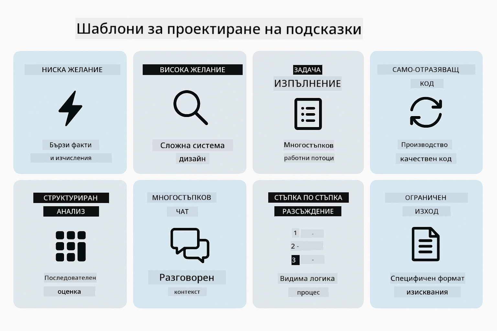
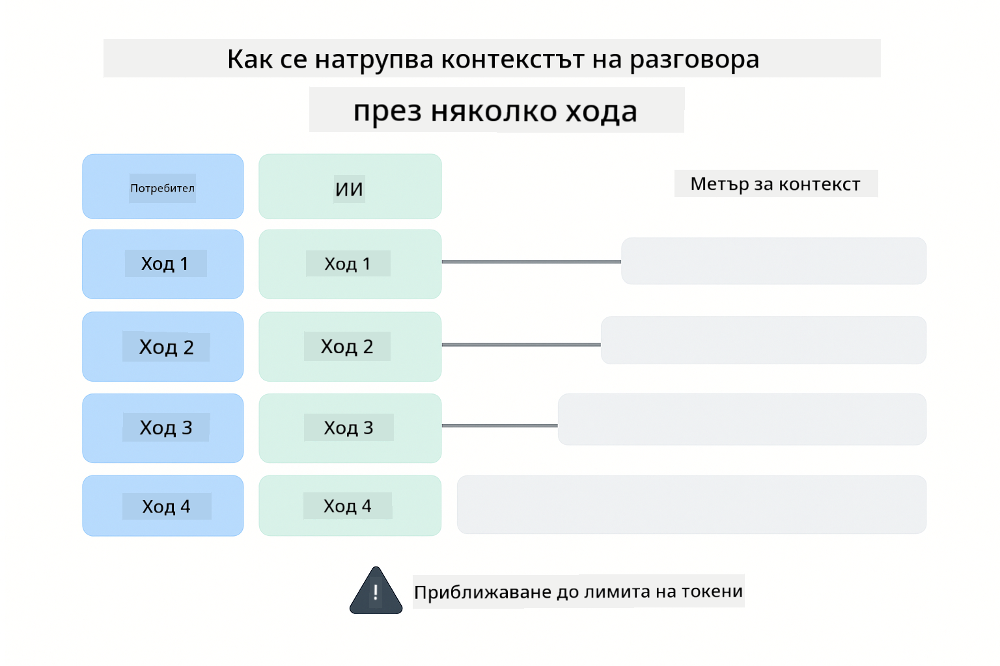
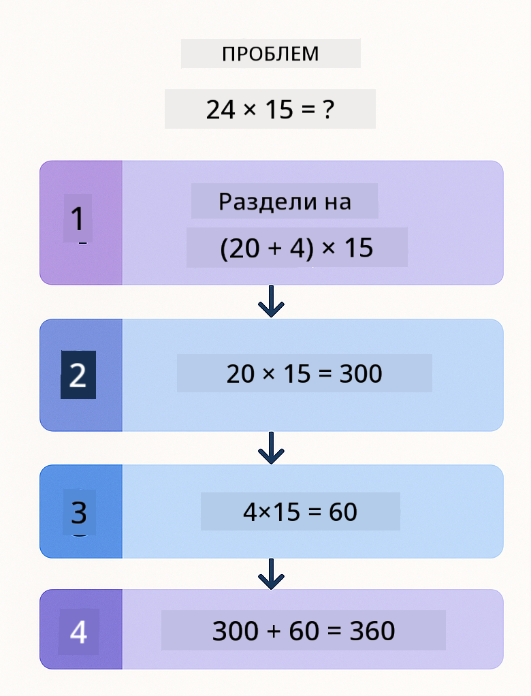
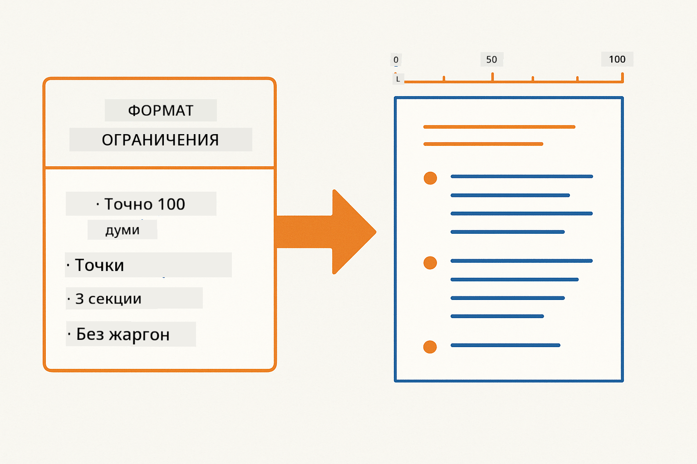
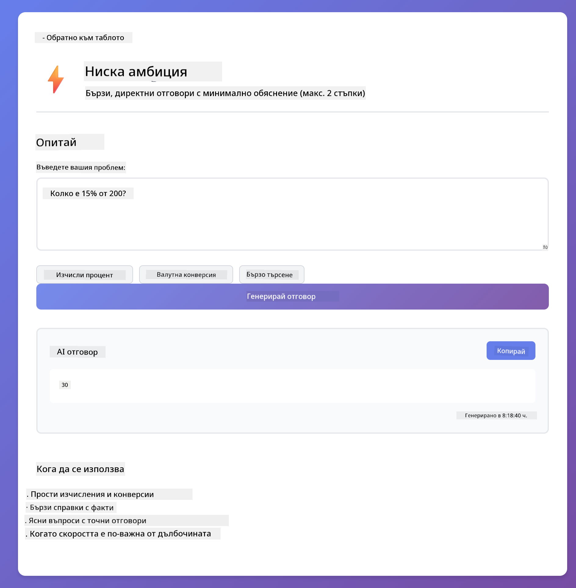
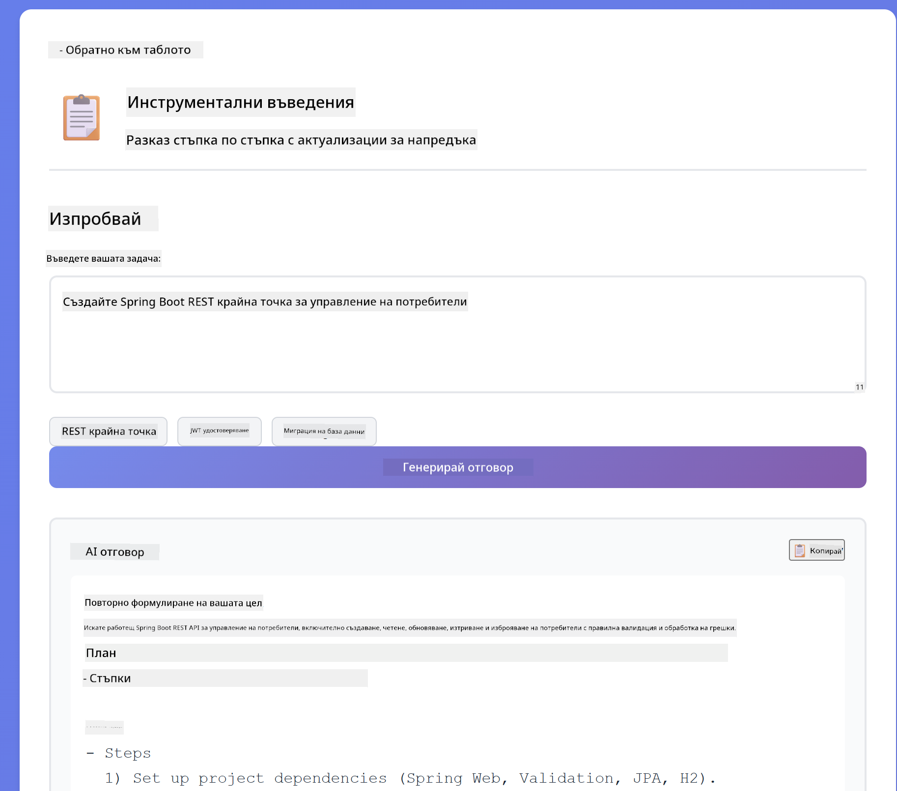
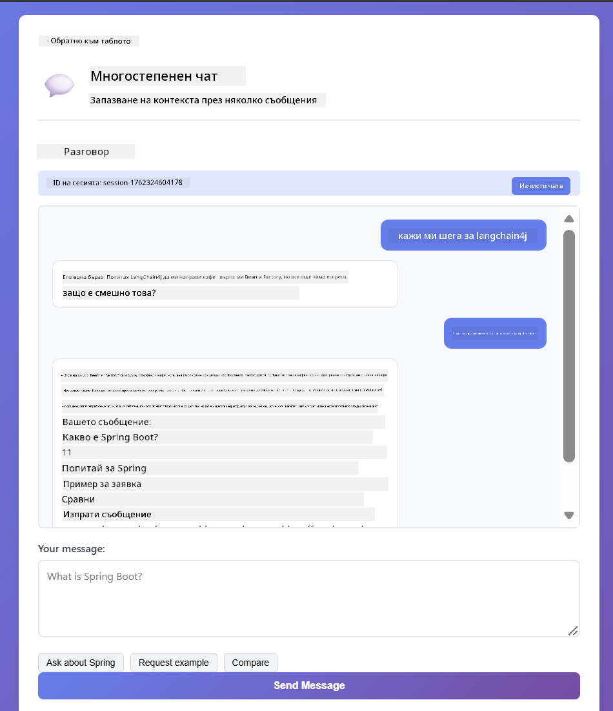
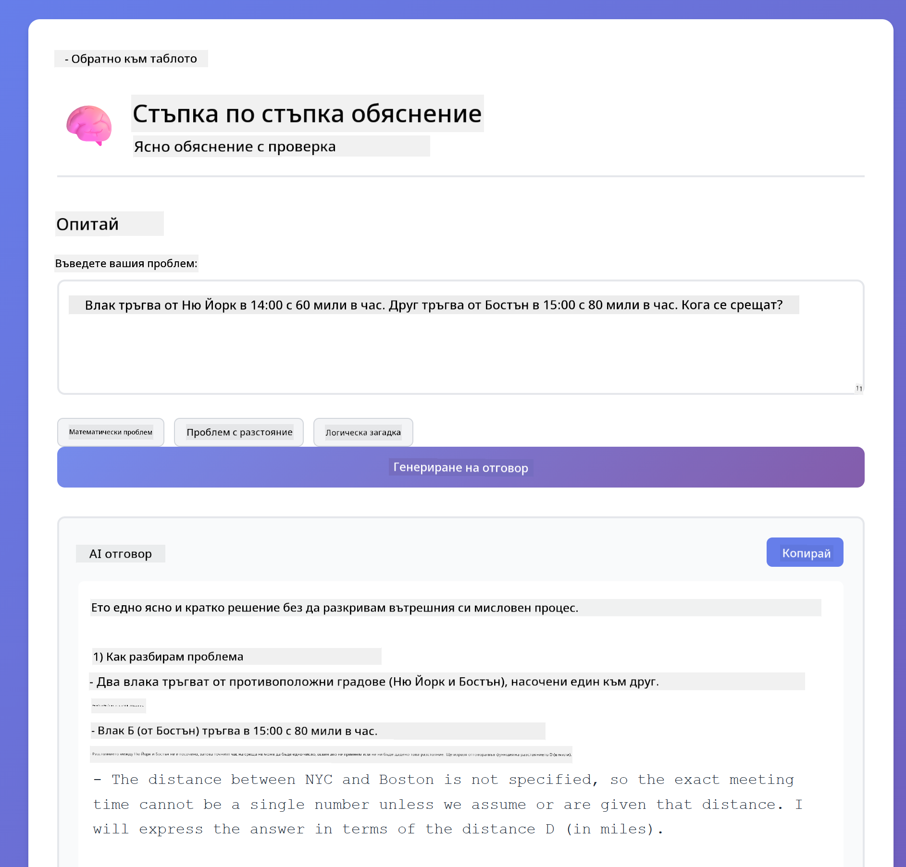

<!--
CO_OP_TRANSLATOR_METADATA:
{
  "original_hash": "8d787826cad7e92bf5cdbd116b1e6116",
  "translation_date": "2025-12-13T16:26:08+00:00",
  "source_file": "02-prompt-engineering/README.md",
  "language_code": "bg"
}
-->
# Модул 02: Проектиране на заявки с GPT-5

## Съдържание

- [Какво ще научите](../../../02-prompt-engineering)
- [Предварителни изисквания](../../../02-prompt-engineering)
- [Разбиране на проектирането на заявки](../../../02-prompt-engineering)
- [Как това използва LangChain4j](../../../02-prompt-engineering)
- [Основните модели](../../../02-prompt-engineering)
- [Използване на съществуващи Azure ресурси](../../../02-prompt-engineering)
- [Екранни снимки на приложението](../../../02-prompt-engineering)
- [Изследване на моделите](../../../02-prompt-engineering)
  - [Ниска срещу висока настойчивост](../../../02-prompt-engineering)
  - [Изпълнение на задачи (встъпителни текстове за инструменти)](../../../02-prompt-engineering)
  - [Саморефлектиращ код](../../../02-prompt-engineering)
  - [Структуриран анализ](../../../02-prompt-engineering)
  - [Многоходов чат](../../../02-prompt-engineering)
  - [Стъпка по стъпка разсъждение](../../../02-prompt-engineering)
  - [Ограничен изход](../../../02-prompt-engineering)
- [Какво наистина учите](../../../02-prompt-engineering)
- [Следващи стъпки](../../../02-prompt-engineering)

## Какво ще научите

В предишния модул видяхте как паметта позволява разговорен AI и използвахте GitHub модели за основни взаимодействия. Сега ще се фокусираме върху това как задавате въпроси - самите заявки - използвайки GPT-5 на Azure OpenAI. Начинът, по който структурирате заявките си, драматично влияе върху качеството на получените отговори.

Ще използваме GPT-5, защото той въвежда контрол върху разсъжденията - можете да кажете на модела колко мислене да направи преди да отговори. Това прави различните стратегии за заявки по-очевидни и ви помага да разберете кога да използвате всеки подход. Също така ще се възползваме от по-малко ограничения на скоростта в Azure за GPT-5 в сравнение с GitHub модели.

## Предварителни изисквания

- Завършен Модул 01 (разположени Azure OpenAI ресурси)
- Файл `.env` в коренната директория с Azure идентификационни данни (създаден от `azd up` в Модул 01)

> **Забележка:** Ако не сте завършили Модул 01, първо следвайте инструкциите за разполагане там.

## Разбиране на проектирането на заявки

Проектирането на заявки е за създаване на входен текст, който последователно ви дава нужните резултати. Не става въпрос само за задаване на въпроси - а за структуриране на исканията така, че моделът да разбере точно какво искате и как да го предостави.

Помислете за това като даване на инструкции на колега. "Поправи грешката" е неясно. "Поправи изключението null pointer в UserService.java ред 45 като добавиш проверка за null" е конкретно. Езиковите модели работят по същия начин - конкретиката и структурата имат значение.

## Как това използва LangChain4j

Този модул демонстрира напреднали модели за заявки, използвайки същата основа LangChain4j от предишните модули, с фокус върху структурата на заявките и контрола на разсъжденията.


*Как LangChain4j свързва вашите заявки с Azure OpenAI GPT-5*

**Зависимости** - Модул 02 използва следните зависимости на langchain4j, дефинирани в `pom.xml`:
```xml
<dependency>
    <groupId>dev.langchain4j</groupId>
    <artifactId>langchain4j</artifactId> <!-- Inherited from BOM in root pom.xml -->
</dependency>
<dependency>
    <groupId>dev.langchain4j</groupId>
    <artifactId>langchain4j-open-ai-official</artifactId> <!-- Inherited from BOM in root pom.xml -->
</dependency>
```

**Конфигурация на OpenAiOfficialChatModel** - [LangChainConfig.java](../../../02-prompt-engineering/src/main/java/com/example/langchain4j/prompts/config/LangChainConfig.java)

Чат моделът е ръчно конфигуриран като Spring bean, използвайки официалния OpenAI клиент, който поддържа Azure OpenAI крайни точки. Ключовата разлика от Модул 01 е как структурираме заявките, изпращани към `chatModel.chat()`, а не самата настройка на модела.

**Системни и потребителски съобщения** - [Gpt5PromptService.java](../../../02-prompt-engineering/src/main/java/com/example/langchain4j/prompts/service/Gpt5PromptService.java)

LangChain4j разделя типовете съобщения за яснота. `SystemMessage` задава поведението и контекста на AI (като "Ти си преглеждащ код"), докато `UserMessage` съдържа самото искане. Това разделение ви позволява да поддържате последователно поведение на AI при различни потребителски заявки.

```java
SystemMessage systemMsg = SystemMessage.from(
    "You are a helpful Java programming expert."
);

UserMessage userMsg = UserMessage.from(
    "Explain what a List is in Java"
);

String response = chatModel.chat(systemMsg, userMsg);
```


*SystemMessage осигурява постоянен контекст, докато UserMessages съдържат отделни заявки*

**MessageWindowChatMemory за многоходови разговори** - За модела с много ходове използваме повторно `MessageWindowChatMemory` от Модул 01. Всяка сесия получава собствена инстанция на памет, съхранявана в `Map<String, ChatMemory>`, което позволява множество паралелни разговори без смесване на контекста.

**Шаблони за заявки** - Истинският фокус тук е проектирането на заявки, а не нови API-та на LangChain4j. Всеки модел (ниска настойчивост, висока настойчивост, изпълнение на задачи и др.) използва същия метод `chatModel.chat(prompt)`, но с внимателно структурирани низове за заявки. XML таговете, инструкциите и форматирането са част от текста на заявката, а не функции на LangChain4j.

**Контрол на разсъжденията** - Усилието за разсъждение на GPT-5 се контролира чрез инструкции в заявките като "максимум 2 стъпки на разсъждение" или "проучи подробно". Това са техники за проектиране на заявки, а не конфигурации на LangChain4j. Библиотеката просто доставя вашите заявки до модела.

Основният извод: LangChain4j осигурява инфраструктурата (връзка с модела чрез [LangChainConfig.java](../../../02-prompt-engineering/src/main/java/com/example/langchain4j/prompts/config/LangChainConfig.java), памет, обработка на съобщения чрез [Gpt5PromptService.java](../../../02-prompt-engineering/src/main/java/com/example/langchain4j/prompts/service/Gpt5PromptService.java)), докато този модул ви учи как да създавате ефективни заявки в тази инфраструктура.

## Основните модели

Не всички проблеми изискват един и същ подход. Някои въпроси се нуждаят от бързи отговори, други - от дълбоко мислене. Някои изискват видими разсъждения, други - само резултати. Този модул обхваща осем модела за заявки - всеки оптимизиран за различни сценарии. Ще експериментирате с всички, за да научите кога кой подход работи най-добре.



*Преглед на осемте модела за проектиране на заявки и техните случаи на употреба*


*Ниска настойчивост (бързо, директно) срещу висока настойчивост (задълбочено, изследователско) подходи за разсъждение*

**Ниска настойчивост (Бързо и фокусирано)** - За прости въпроси, където искате бързи, директни отговори. Моделът прави минимални разсъждения - максимум 2 стъпки. Използвайте това за изчисления, справки или ясни въпроси.

```java
String prompt = """
    <reasoning_effort>low</reasoning_effort>
    <instruction>maximum 2 reasoning steps</instruction>
    
    What is 15% of 200?
    """;

String response = chatModel.chat(prompt);
```

> 💡 **Изследвайте с GitHub Copilot:** Отворете [`Gpt5PromptService.java`](../../../02-prompt-engineering/src/main/java/com/example/langchain4j/prompts/service/Gpt5PromptService.java) и попитайте:
> - "Каква е разликата между моделите за ниска и висока настойчивост?"
> - "Как XML таговете в заявките помагат за структуриране на отговора на AI?"
> - "Кога да използвам модели за саморефлексия срещу директни инструкции?"

**Висока настойчивост (Дълбоко и задълбочено)** - За сложни проблеми, където искате цялостен анализ. Моделът изследва подробно и показва детайлни разсъждения. Използвайте това за системен дизайн, архитектурни решения или сложни изследвания.

```java
String prompt = """
    <reasoning_effort>high</reasoning_effort>
    <instruction>explore thoroughly, show detailed reasoning</instruction>
    
    Design a caching strategy for a high-traffic REST API.
    """;

String response = chatModel.chat(prompt);
```

**Изпълнение на задачи (Напредък стъпка по стъпка)** - За многостъпкови работни потоци. Моделът предоставя предварителен план, разказва всяка стъпка докато работи, след което дава обобщение. Използвайте това за миграции, реализации или всеки многостъпков процес.

```java
String prompt = """
    <task>Create a REST endpoint for user registration</task>
    <preamble>Provide an upfront plan</preamble>
    <narration>Narrate each step as you work</narration>
    <summary>Summarize what was accomplished</summary>
    """;

String response = chatModel.chat(prompt);
```

Chain-of-Thought (верига на мисли) заявките изрично искат от модела да покаже процеса на разсъждение, подобрявайки точността при сложни задачи. Разбивката стъпка по стъпка помага както на хора, така и на AI да разберат логиката.

> **🤖 Опитайте с [GitHub Copilot](https://github.com/features/copilot) Chat:** Попитайте за този модел:
> - "Как бих адаптирал модела за изпълнение на задачи за дългосрочни операции?"
> - "Кои са най-добрите практики за структуриране на встъпителни текстове за инструменти в продукционни приложения?"
> - "Как мога да улавям и показвам междинни актуализации на напредъка в UI?"


*Планиране → Изпълнение → Обобщение на работния поток за многостъпкови задачи*

**Саморефлектиращ код** - За генериране на код с продукционно качество. Моделът генерира код, проверява го спрямо критерии за качество и го подобрява итеративно. Използвайте това при изграждане на нови функции или услуги.

```java
String prompt = """
    <task>Create an email validation service</task>
    <quality_criteria>
    - Correct logic and error handling
    - Best practices (clean code, proper naming)
    - Performance optimization
    - Security considerations
    </quality_criteria>
    <instruction>Generate code, evaluate against criteria, improve iteratively</instruction>
    """;

String response = chatModel.chat(prompt);
```


*Итеративен цикъл на подобрение - генериране, оценка, идентифициране на проблеми, подобрение, повторение*

**Структуриран анализ** - За последователна оценка. Моделът преглежда кода, използвайки фиксирана рамка (коректност, практики, производителност, сигурност). Използвайте това за прегледи на код или оценки на качеството.

```java
String prompt = """
    <code>
    public List getUsers() {
        return database.query("SELECT * FROM users");
    }
    </code>
    
    <framework>
    Evaluate using these categories:
    1. Correctness - Logic and functionality
    2. Best Practices - Code quality
    3. Performance - Efficiency concerns
    4. Security - Vulnerabilities
    </framework>
    """;

String response = chatModel.chat(prompt);
```

> **🤖 Опитайте с [GitHub Copilot](https://github.com/features/copilot) Chat:** Попитайте за структуриран анализ:
> - "Как мога да персонализирам рамката за анализ за различни видове прегледи на код?"
> - "Кой е най-добрият начин за програмен парсинг и действие върху структуриран изход?"
> - "Как да осигуря последователни нива на сериозност в различни сесии на преглед?"


*Рамка с четири категории за последователни прегледи на код с нива на сериозност*

**Многоходов чат** - За разговори, които изискват контекст. Моделът помни предишни съобщения и надгражда върху тях. Използвайте това за интерактивни помощни сесии или сложни въпроси и отговори.

```java
ChatMemory memory = MessageWindowChatMemory.withMaxMessages(10);

memory.add(UserMessage.from("What is Spring Boot?"));
AiMessage aiMessage1 = chatModel.chat(memory.messages()).aiMessage();
memory.add(aiMessage1);

memory.add(UserMessage.from("Show me an example"));
AiMessage aiMessage2 = chatModel.chat(memory.messages()).aiMessage();
memory.add(aiMessage2);
```



*Как контекстът на разговора се натрупва през множество ходове до достигане на лимита на токени*

**Стъпка по стъпка разсъждение** - За проблеми, изискващи видима логика. Моделът показва изрично разсъждение за всяка стъпка. Използвайте това за математически задачи, логически пъзели или когато трябва да разберете мисловния процес.

```java
String prompt = """
    <instruction>Show your reasoning step-by-step</instruction>
    
    If a train travels 120 km in 2 hours, then stops for 30 minutes,
    then travels another 90 km in 1.5 hours, what is the average speed
    for the entire journey including the stop?
    """;

String response = chatModel.chat(prompt);
```



*Разбиване на проблемите на изрични логически стъпки*

**Ограничен изход** - За отговори със специфични изисквания за формат. Моделът строго следва правилата за формат и дължина. Използвайте това за обобщения или когато ви трябва прецизна структура на изхода.

```java
String prompt = """
    <constraints>
    - Exactly 100 words
    - Bullet point format
    - Technical terms only
    </constraints>
    
    Summarize the key concepts of machine learning.
    """;

String response = chatModel.chat(prompt);
```



*Налагане на специфични изисквания за формат, дължина и структура*

## Използване на съществуващи Azure ресурси

**Проверете разполагането:**

Уверете се, че файлът `.env` съществува в коренната директория с Azure идентификационни данни (създаден по време на Модул 01):
```bash
cat ../.env  # Трябва да показва AZURE_OPENAI_ENDPOINT, API_KEY, DEPLOYMENT
```

**Стартирайте приложението:**

> **Забележка:** Ако вече сте стартирали всички приложения с `./start-all.sh` от Модул 01, този модул вече работи на порт 8083. Можете да пропуснете командите за стартиране по-долу и да отидете директно на http://localhost:8083.

**Опция 1: Използване на Spring Boot Dashboard (Препоръчително за потребители на VS Code)**

Dev контейнерът включва разширението Spring Boot Dashboard, което предоставя визуален интерфейс за управление на всички Spring Boot приложения. Можете да го намерите в лентата с дейности вляво във VS Code (потърсете иконата на Spring Boot).

От Spring Boot Dashboard можете:
- Да видите всички налични Spring Boot приложения в работната област
- Да стартирате/спирате приложения с един клик
- Да преглеждате логове на приложенията в реално време
- Да следите състоянието на приложенията

Просто кликнете върху бутона за пускане до "prompt-engineering", за да стартирате този модул, или стартирайте всички модули наведнъж.


**Опция 2: Използване на shell скриптове**

Стартирайте всички уеб приложения (модули 01-04):

**Bash:**
```bash
cd ..  # От коренната директория
./start-all.sh
```

**PowerShell:**
```powershell
cd ..  # От коренната директория
.\start-all.ps1
```

Или стартирайте само този модул:

**Bash:**
```bash
cd 02-prompt-engineering
./start.sh
```

**PowerShell:**
```powershell
cd 02-prompt-engineering
.\start.ps1
```

И двата скрипта автоматично зареждат променливите на средата от коренния `.env` файл и ще компилират JAR файловете, ако не съществуват.

> **Забележка:** Ако предпочитате да компилирате всички модули ръчно преди стартиране:
>
> **Bash:**
> ```bash
> cd ..  # Go to root directory
> mvn clean package -DskipTests
> ```
>
> **PowerShell:**
> ```powershell
> cd ..  # Go to root directory
> mvn clean package -DskipTests
> ```

Отворете http://localhost:8083 в браузъра си.

**За спиране:**

**Bash:**
```bash
./stop.sh  # Само този модул
# Или
cd .. && ./stop-all.sh  # Всички модули
```

**PowerShell:**
```powershell
.\stop.ps1  # Само този модул
# Или
cd ..; .\stop-all.ps1  # Всички модули
```

## Екранни снимки на приложението


*Основното табло, показващо всички 8 модела за проектиране на заявки с техните характеристики и случаи на употреба*

## Изследване на моделите

Уеб интерфейсът ви позволява да експериментирате с различни стратегии за заявки. Всеки модел решава различни проблеми - опитайте ги, за да видите кога кой подход блести.

### Ниска срещу висока настойчивост

Задайте прост въпрос като "Колко е 15% от 200?" с Ниска настойчивост. Ще получите мигновен, директен отговор. Сега задайте нещо сложно като "Проектирайте стратегия за кеширане за API с висок трафик" с Висока настойчивост. Наблюдавайте как моделът забавя темпото и предоставя детайлни разсъждения. Същият модел, същата структура на въпроса - но заявката му казва колко мислене да направи.


*Бързо изчисление с минимално разсъждение*


*Изчерпателна стратегия за кеширане (2.8MB)*

### Изпълнение на задача (Въведение в инструментите)

Многостъпковите работни потоци се възползват от предварително планиране и разказване на напредъка. Моделът очертава какво ще направи, разказва всяка стъпка и след това обобщава резултатите.



*Създаване на REST крайна точка с разказване стъпка по стъпка (3.9MB)*

### Саморефлектиращ се код

Опитайте "Създай услуга за валидиране на имейл". Вместо просто да генерира код и да спре, моделът генерира, оценява спрямо критерии за качество, идентифицира слабости и подобрява. Ще видите как итеративно подобрява кода, докато отговаря на производствените стандарти.


*Пълна услуга за валидиране на имейл (5.2MB)*

### Структуриран анализ

Прегледите на код изискват последователни рамки за оценка. Моделът анализира кода, използвайки фиксирани категории (коректност, практики, производителност, сигурност) с нива на тежест.


*Преглед на код, базиран на рамка*

### Многостепенен чат

Попитайте "Какво е Spring Boot?" и веднага след това "Покажи ми пример". Моделът помни първия ви въпрос и ви дава конкретен пример за Spring Boot. Без памет вторият въпрос би бил твърде общ.



*Запазване на контекста между въпросите*

### Разсъждение стъпка по стъпка

Изберете математически проблем и го опитайте както с Разсъждение стъпка по стъпка, така и с Ниска настойчивост. Ниската настойчивост просто ви дава отговора - бързо, но непрозрачно. Разсъждението стъпка по стъпка ви показва всяко изчисление и решение.



*Математически проблем с изрични стъпки*

### Ограничен изход

Когато имате нужда от специфични формати или брой думи, този модел налага стриктно спазване. Опитайте да генерирате резюме с точно 100 думи във формат на точки.


*Резюме за машинно обучение с контрол на формата*

## Какво наистина учите

**Усилието за разсъждение променя всичко**

GPT-5 ви позволява да контролирате изчислителното усилие чрез вашите подсказки. Ниското усилие означава бързи отговори с минимално изследване. Високото усилие означава, че моделът отделя време да мисли дълбоко. Вие се учите да съобразявате усилието с комплексността на задачата - не губете време с прости въпроси, но и не бързайте с комплексни решения.

**Структурата насочва поведението**

Забелязвате ли XML таговете в подсказките? Те не са декоративни. Моделите следват структурирани инструкции по-надеждно от свободен текст. Когато имате нужда от многостъпкови процеси или сложна логика, структурата помага на модела да следи къде се намира и какво следва.


*Анатомия на добре структурирана подсказка с ясни секции и организация в XML стил*

**Качество чрез самооценка**

Саморефлектиращите се модели работят като правят критериите за качество явни. Вместо да се надявате моделът "да го направи правилно", вие му казвате точно какво означава "правилно": коректна логика, обработка на грешки, производителност, сигурност. Моделът може да оцени собственото си изходно съдържание и да се подобри. Това превръща генерирането на код от лотария в процес.

**Контекстът е ограничен**

Многостепенните разговори работят чрез включване на историята на съобщенията с всяка заявка. Но има лимит - всеки модел има максимален брой токени. С нарастването на разговорите ще ви трябват стратегии за запазване на релевантния контекст без да достигате този лимит. Този модул ви показва как работи паметта; по-късно ще научите кога да обобщавате, кога да забравяте и кога да извличате.

## Следващи стъпки

**Следващ модул:** [03-rag - RAG (Генериране с допълнително извличане)](../03-rag/README.md)

---

**Навигация:** [← Предишен: Модул 01 - Въведение](../01-introduction/README.md) | [Обратно към началото](../README.md) | [Следващ: Модул 03 - RAG →](../03-rag/README.md)

---

<!-- CO-OP TRANSLATOR DISCLAIMER START -->
**Отказ от отговорност**:
Този документ е преведен с помощта на AI преводаческа услуга [Co-op Translator](https://github.com/Azure/co-op-translator). Въпреки че се стремим към точност, моля, имайте предвид, че автоматизираните преводи могат да съдържат грешки или неточности. Оригиналният документ на неговия роден език трябва да се счита за авторитетен източник. За критична информация се препоръчва професионален човешки превод. Ние не носим отговорност за каквито и да е недоразумения или неправилни тълкувания, произтичащи от използването на този превод.
<!-- CO-OP TRANSLATOR DISCLAIMER END -->