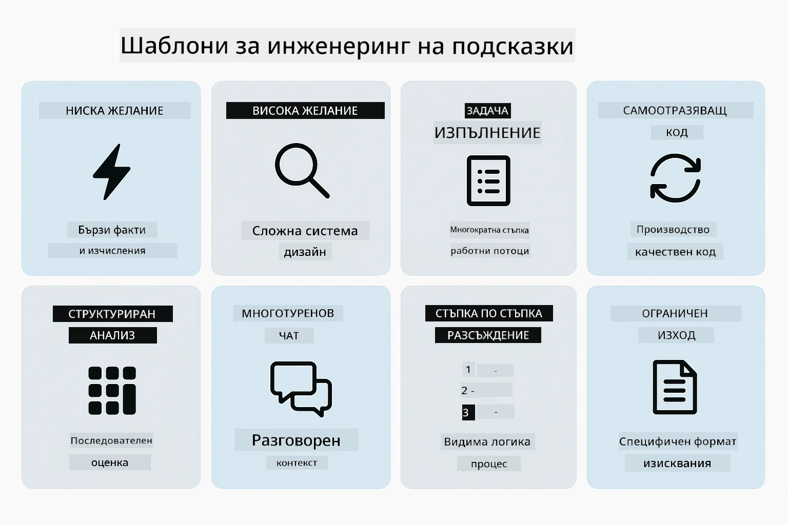
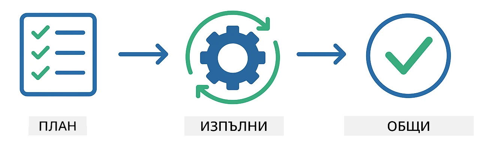
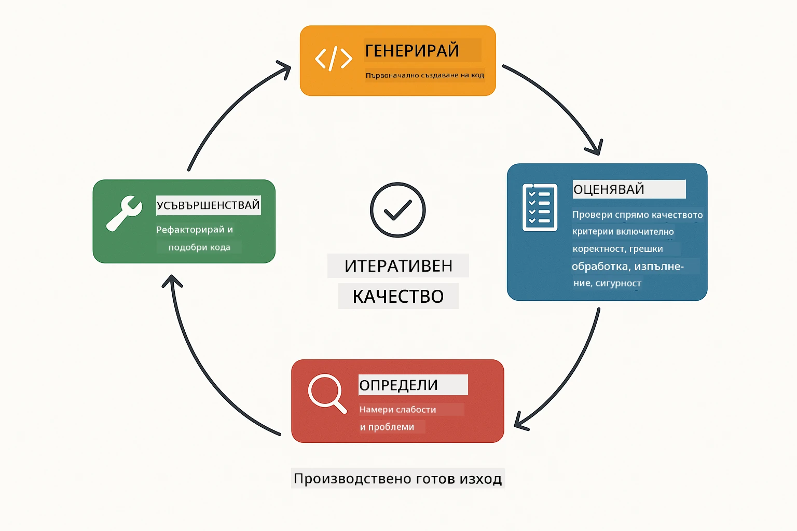
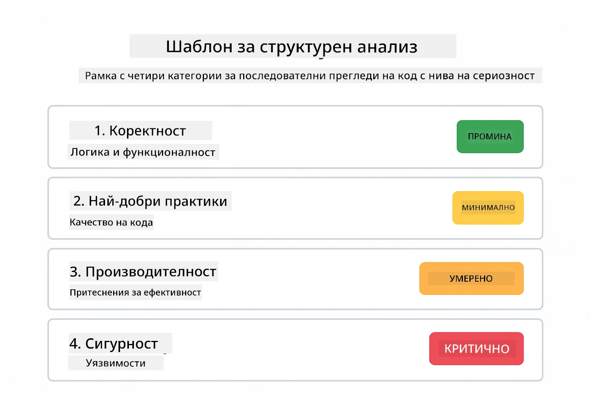
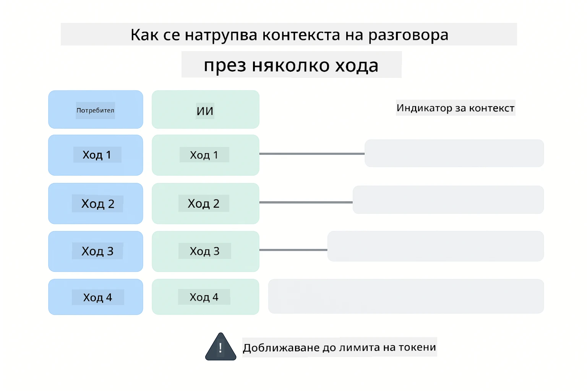
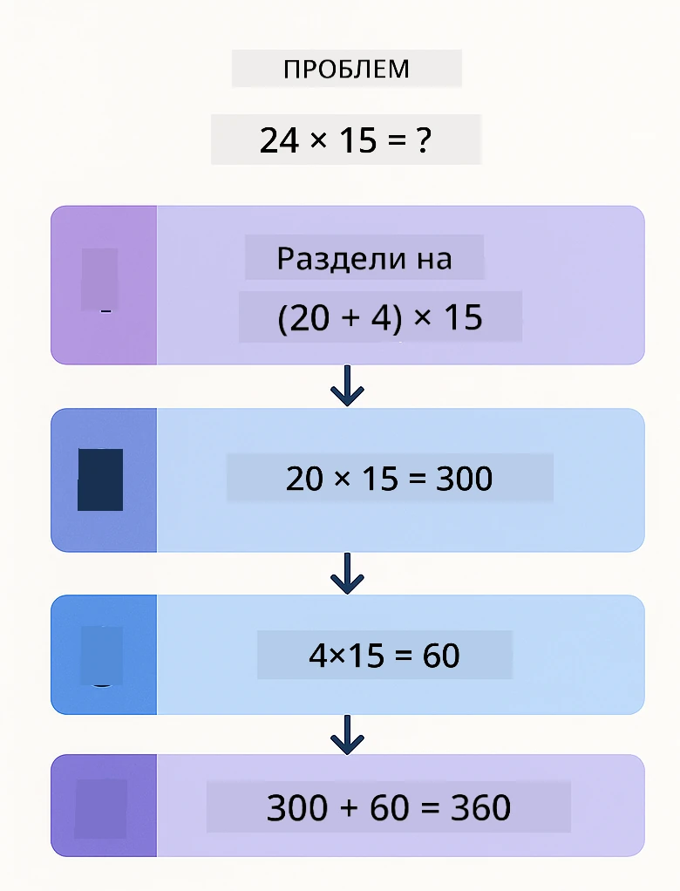
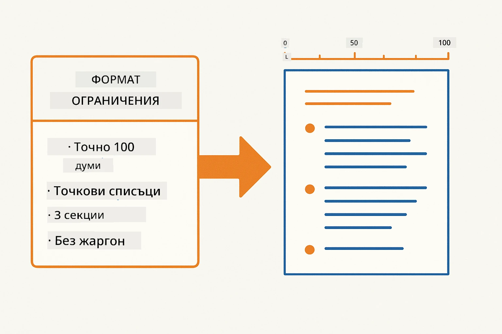
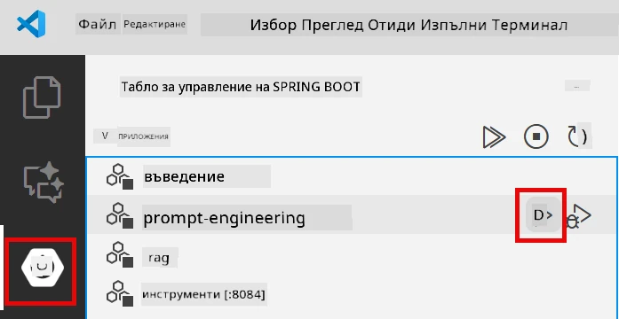
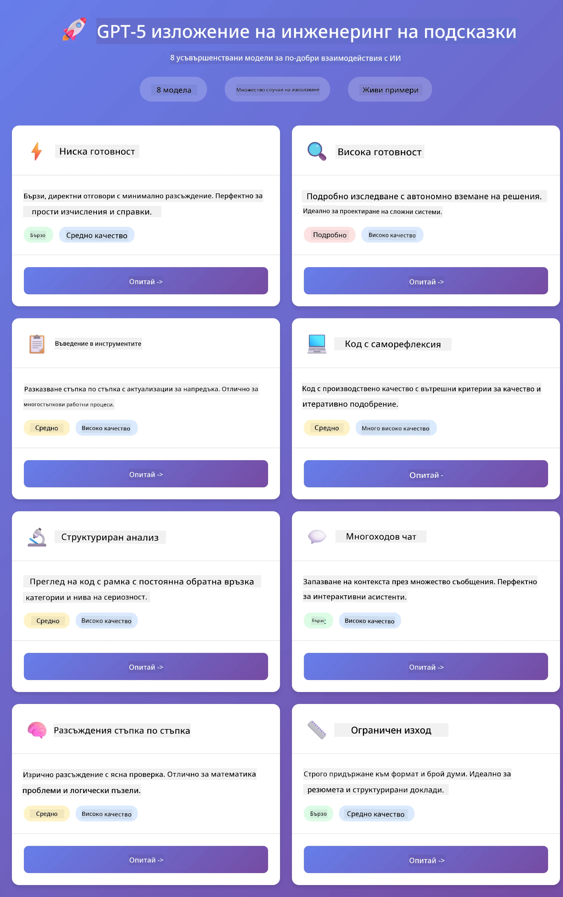
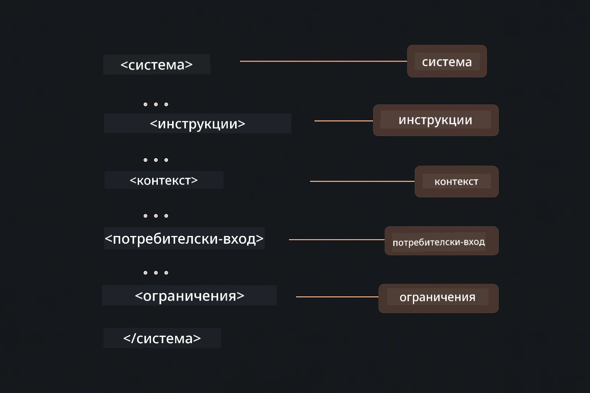

# Модул 02: Инженерство на подсказки с GPT-5.2

## Съдържание

- [Видеопреглед](#видеопреглед)
- [Какво ще научите](#какво-ще-научите)
- [Изисквания](#изисквания)
- [Разбиране на инженерството на подсказки](#разбиране-на-инженерството-на-подсказки)
- [Основи на инженерството на подсказки](#основи-на-инженерството-на-подсказки)
  - [Подсказване с нулев опит](#подсказване-с-нулев-опит)
  - [Подсказване с няколко примера](#подсказване-с-няколко-примера)
  - [Верига на мисълта](#верига-на-мисълта)
  - [Подсказване на база роля](#подсказване-на-база-роля)
  - [Шаблони за подсказки](#шаблони-за-подсказки)
- [Разширени модели](#разширени-модели)
- [Стартиране на приложението](#стартирайте-приложението)
- [Екранни снимки на приложението](#скриншотове-на-приложението)
- [Изследване на моделите](#изследване-на-шаблоните)
  - [Ниско срещу високо желание](#ниска-срещу-висока-активност-eagerness)
  - [Изпълнение на задачи (първоначални съобщения за инструменти)](#изпълнение-на-задачи-въведение-на-инструменти)
  - [Саморефлектиращ код](#саморефлектиращ-се-код)
  - [Структуриран анализ](#структуриран-анализ)
  - [Многоходов чат](#разговор-с-много-ходове)
  - [Разсъждение стъпка по стъпка](#разсъждение-стъпка-по-стъпка)
  - [Ограничен изход](#ограничен-изход)
- [Какво всъщност научавате](#какво-всъщност-учите)
- [Следващи стъпки](#следващи-стъпки)

## Видеопреглед

Гледайте тази сесия на живо, която обяснява как да започнете с този модул:

<a href="https://www.youtube.com/live/PJ6aBaE6bog?si=LDshyBrTRodP-wke"></a>

## Какво ще научите

Следната диаграма предоставя преглед на ключовите теми и умения, които ще развиете в този модул — от техники за усъвършенстване на подсказките до стъпковия работен процес, който ще следвате.


В предишния модул видяхте как паметта позволява разговорния AI с Azure OpenAI. Сега ще се фокусираме върху начина, по който задавате въпроси — самите подсказки — използвайки GPT-5.2 на Azure OpenAI. Начинът, по който структурирате подсказките си, драстично влияе върху качеството на отговорите, които получавате. Започваме с преглед на основните техники за подсказване, след което преминаваме към осем разширени модела, които използват пълноценно възможностите на GPT-5.2.

Ще използваме GPT-5.2, защото той въвежда контрол на разсъжденията - можете да указвате на модела колко мислене да направи преди отговора. Това прави различните стратегии за подсказване по-ясни и ви помага да разберете кога да използвате кой подход.

## Изисквания

- Завършен Модул 01 (разположени ресурси на Azure OpenAI)
- Файл `.env` в основната директория с Azure идентификационни данни (създаден чрез `azd up` в Модул 01)

> **Забележка:** Ако не сте завършили Модул 01, следвайте първо инструкциите за разполагане там.

## Разбиране на инженерството на подсказки

В основата си, инженерството на подсказки е разликата между неясни и точни инструкции, както илюстрира следното сравнение.


Инженерството на подсказки е за проектиране на входен текст, който постоянно ви дава нужните резултати. Не става въпрос само за задаване на въпроси - става дума за структуриране на заявки така, че моделът да разбере точно какво искате и как да го достави.

Представете си, че давате инструкции на колега. „Поправи бъга“ е неясно. „Поправи изключението null pointer в UserService.java ред 45 чрез добавяне на проверка за null“ е конкретно. Езиковите модели работят по същия начин - специфичността и структурата имат значение.

Диаграмата по-долу показва как LangChain4j се вписва в тази картина — свързвайки вашите шаблони за подсказки с модела чрез блоковете SystemMessage и UserMessage.


LangChain4j осигурява инфраструктурата — връзки с модел, памет и типове съобщения — докато шаблоните за подсказки са просто внимателно структурирани текстове, които изпращате през тази инфраструктура. Ключовите градивни елементи са `SystemMessage` (който задава поведението и ролята на AI) и `UserMessage` (който носи вашата актуална заявка).

## Основи на инженерството на подсказки

Петте основни техники, показани по-долу, формират базата на ефективното инженерство на подсказки. Всяка от тях адресира различен аспект на това как комуникирате с езиковите модели.


Преди да преминем към разширените модели в този модул, нека прегледаме пет основни техники за подсказване. Те са градивните блокове, които всеки инженер на подсказки трябва да знае.

### Подсказване с нулев опит

Най-простият подход: дайте на модела директна инструкция без примери. Моделът разчита изцяло на обучението си, за да разбере и изпълни задачата. Това работи добре за прости заявки, където очакваното поведение е очевидно.


*Директна инструкция без примери — моделът извежда задачата само от инструкцията*

```java
String prompt = "Classify this sentiment: 'I absolutely loved the movie!'";
String response = model.chat(prompt);
// Отговор: "Позитивно"
```

**Кога се използва:** Прости класификации, директни въпроси, преводи или всяка задача, която моделът може да изпълни без допълнителни насоки.

### Подсказване с няколко примера

Предоставете примери, които демонстрират модела да следва желания шаблон. Моделът научава очаквания вход-изход формат от вашите примери и го прилага към нови входове. Това значително подобрява последователността при задачи, където желаният формат или поведение не е явен.


*Обучаване от примери — моделът идентифицира шаблона и го прилага към нови входове*

```java
String prompt = """
    Classify the sentiment as positive, negative, or neutral.
    
    Examples:
    Text: "This product exceeded my expectations!" → Positive
    Text: "It's okay, nothing special." → Neutral
    Text: "Waste of money, very disappointed." → Negative
    
    Now classify this:
    Text: "Best purchase I've made all year!"
    """;
String response = model.chat(prompt);
```

**Кога се използва:** Персонализирани класификации, последователно форматиране, задачи в специфични области или когато резултатите с нулев опит са непоследователни.

### Верига на мисълта

Помолете модела да покаже мисловния си процес стъпка по стъпка. Вместо да скача направо към отговор, моделът разгражда проблема и преминава през всяка част експлицитно. Това подобрява точността при задачи, свързани с математика, логика и многостъпкови разсъждения.


*Разсъждение стъпка по стъпка — разделяне на сложни проблеми на явни логични стъпки*

```java
String prompt = """
    Problem: A store has 15 apples. They sell 8 apples and then 
    receive a shipment of 12 more apples. How many apples do they have now?
    
    Let's solve this step-by-step:
    """;
String response = model.chat(prompt);
// Моделът показва: 15 - 8 = 7, след това 7 + 12 = 19 ябълки
```

**Кога се използва:** Математически задачи, логически пъзели, дебъгване или каквато и да е задача, при която показването на процеса на мислене подобрява точността и доверието.

### Подсказване на база роля

Задайте персона или роля на AI преди да зададете въпроса си. Това осигурява контекст, който оформя тона, дълбочината и фокуса на отговора. „Софтуерен архитект“ дава различни съвети от „младши разработчик“ или „одитор по сигурността“.


*Задаване на контекст и персона — един и същ въпрос получава различен отговор в зависимост от присвоената роля*

```java
String prompt = """
    You are an experienced software architect reviewing code.
    Provide a brief code review for this function:
    
    def calculate_total(items):
        total = 0
        for item in items:
            total = total + item['price']
        return total
    """;
String response = model.chat(prompt);
```

**Кога се използва:** Прегледи на код, обучение, анализ в специфични области или когато ви трябват отговори, пригодени за определено ниво на експертиза или перспектива.

### Шаблони за подсказки

Създавайте многократно използваеми подсказки с променливи плейсхолдъри. Вместо да пишете нова подсказка всеки път, дефинирайте шаблон веднъж и попълвайте различни стойности. Класът `PromptTemplate` на LangChain4j улеснява това с синтаксис `{{variable}}`.


*Многократно използваеми подсказки с променливи плейсхолдъри — един шаблон, много приложения*

```java
PromptTemplate template = PromptTemplate.from(
    "What's the best time to visit {{destination}} for {{activity}}?"
);

Prompt prompt = template.apply(Map.of(
    "destination", "Paris",
    "activity", "sightseeing"
));

String response = model.chat(prompt.text());
```

**Кога се използва:** Повтарящи се заявки с различни входове, пакетна обработка, изграждане на многократно използваеми AI работни потоци или всякакъв сценарий, в който структурата на подсказката остава същата, но данните се променят.

---

Тези пет основи ви осигуряват здрава база за повечето задачи с подсказки. Останалата част от този модул ги разширява с **осем разширени модела**, които използват контрола на разсъжденията, самостоятелната оценка и възможностите за структурирани изходни данни на GPT-5.2.

## Разширени модели

С покрити основи, нека преминем към осемте разширени модела, които правят този модул уникален. Не всички проблеми изискват един и същи подход. Някои въпроси се нуждаят от бързи отговори, други от дълбоко обмисляне. Някои изискват видими разсъждения, други само резултати. Всеки модел по-долу е оптимизиран за различен сценарий — и контролът на разсъжденията на GPT-5.2 прави различията още по-очевидни.



*Преглед на осемте модела за инженерство на подсказки и техните приложения*

GPT-5.2 добавя още едно измерение към тези модели: *контрол на разсъжденията*. Плъзгачът по-долу показва как можете да регулирате усилието на мислене на модела — от бързи, директни отговори до дълбок, щателен анализ.


*Контролът на разсъжденията в GPT-5.2 ви позволява да укажете колко мислене трябва да направи моделът — от бързи директни отговори до дълбоко изследване*

**Ниско желание (бързо и фокусирано)** - За прости въпроси, където искате бързи, директни отговори. Моделът прави минимални разсъждения - максимум 2 стъпки. Използвайте това за изчисления, справки или прости въпроси.

```java
String prompt = """
    <context_gathering>
    - Search depth: very low
    - Bias strongly towards providing a correct answer as quickly as possible
    - Usually, this means an absolute maximum of 2 reasoning steps
    - If you think you need more time, state what you know and what's uncertain
    </context_gathering>
    
    Problem: What is 15% of 200?
    
    Provide your answer:
    """;

String response = chatModel.chat(prompt);
```

> 💡 **Изследвайте с GitHub Copilot:** Отворете [`Gpt5PromptService.java`](../../../02-prompt-engineering/src/main/java/com/example/langchain4j/prompts/service/Gpt5PromptService.java) и попитайте:
> - "Каква е разликата между ниско и високо желание в моделите за подсказване?"
> - "Как XML таговете в подсказките помагат за структуриране на отговора на AI?"
> - "Кога трябва да използвам модели за саморефлексия срещу директна инструкция?"

**Високо желание (дълбоко и щателно)** - За сложни проблеми, където искате всеобхватен анализ. Моделът изследва задълбочено и показва подробни разсъждения. Използвайте това за системен дизайн, архитектурни решения или сложни изследвания.

```java
String prompt = """
    Analyze this problem thoroughly and provide a comprehensive solution.
    Consider multiple approaches, trade-offs, and important details.
    Show your analysis and reasoning in your response.
    
    Problem: Design a caching strategy for a high-traffic REST API.
    """;

String response = chatModel.chat(prompt);
```

**Изпълнение на задача (стъпка по стъпка напредък)** - За многостъпкови работни потоци. Моделът предоставя предварителен план, разказва всяка стъпка докато я изпълнява, след което дава резюме. Използвайте това за миграции, реализации или всеки многостъпков процес.

```java
String prompt = """
    <task_execution>
    1. First, briefly restate the user's goal in a friendly way
    
    2. Create a step-by-step plan:
       - List all steps needed
       - Identify potential challenges
       - Outline success criteria
    
    3. Execute each step:
       - Narrate what you're doing
       - Show progress clearly
       - Handle any issues that arise
    
    4. Summarize:
       - What was completed
       - Any important notes
       - Next steps if applicable
    </task_execution>
    
    <tool_preambles>
    - Always begin by rephrasing the user's goal clearly
    - Outline your plan before executing
    - Narrate each step as you go
    - Finish with a distinct summary
    </tool_preambles>
    
    Task: Create a REST endpoint for user registration
    
    Begin execution:
    """;

String response = chatModel.chat(prompt);
```

Подсказването във веригата на мисълта изрично изисква от модела да покаже процеса на разсъждение, което подобрява точността при сложни задачи. Разбивката стъпка по стъпка помага както на хората, така и на AI да разберат логиката.

> **🤖 Опитайте с чат на [GitHub Copilot](https://github.com/features/copilot):** Попитайте за този модел:
> - "Как бих адаптирал модела за изпълнение на задача за дългосрочни операции?"
> - "Кои са добрите практики за структуриране на първоначални съобщения за инструменти в продукционни приложения?"
> - "Как мога да улавям и показвам междинни актуализации за напредък в UI?"

Диаграмата по-долу илюстрира тази последователност План → Изпълнение → Обобщение.



*Работен процес План → Изпълнение → Обобщение за многостъпкови задачи*

**Саморефлектиращ код** - За генериране на код с качество за продукция. Моделът генерира код според продукционни стандарти с правилно обработване на грешки. Използвайте това при разработването на нови функции или услуги.

```java
String prompt = """
    Generate Java code with production-quality standards: Create an email validation service
    Keep it simple and include basic error handling.
    """;

String response = chatModel.chat(prompt);
```

Диаграмата по-долу показва този итеративен цикъл на подобрение — генериране, оценка, идентифициране на слабости и усъвършенстване докато кодът отговаря на продукционните стандарти.



*Итеративен цикъл на подобрение - генериране, оценка, идентифициране на проблеми, усъвършенстване, повторение*

**Структуриран анализ** - За последователна оценка. Моделът преглежда кода, използвайки фиксирана рамка (коректност, практики, производителност, сигурност, поддържливост). Използвайте това за прегледи на код или оценки на качеството.

```java
String prompt = """
    <analysis_framework>
    You are an expert code reviewer. Analyze the code for:
    
    1. Correctness
       - Does it work as intended?
       - Are there logical errors?
    
    2. Best Practices
       - Follows language conventions?
       - Appropriate design patterns?
    
    3. Performance
       - Any inefficiencies?
       - Scalability concerns?
    
    4. Security
       - Potential vulnerabilities?
       - Input validation?
    
    5. Maintainability
       - Code clarity?
       - Documentation?
    
    <output_format>
    Provide your analysis in this structure:
    - Summary: One-sentence overall assessment
    - Strengths: 2-3 positive points
    - Issues: List any problems found with severity (High/Medium/Low)
    - Recommendations: Specific improvements
    </output_format>
    </analysis_framework>
    
    Code to analyze:
    ```
    public List getUsers() {
        return database.query("SELECT * FROM users");
    }
    ```
    Provide your structured analysis:
    """;

String response = chatModel.chat(prompt);
```

> **🤖 Опитайте с чат на [GitHub Copilot](https://github.com/features/copilot):** Попитайте за структурирания анализ:
> - "Как мога да персонализирам рамката за анализ за различни типове прегледи на код?"
> - "Кой е най-добрият начин да парсна и обработя структурирания изход програмно?"
> - "Как да осигуря последователни нива на тежест в различните сесии за преглед?"

Следната диаграма показва как тази структурирана рамка организира прегледа на код в последователни категории с нива на тежест.



*Рамка за последователни прегледи на код с нива на тежест*

**Многоходов чат** - За разговори, които се нуждаят от контекст. Моделът помни предишни съобщения и надгражда върху тях. Използвайте това за интерактивни сесии за помощ или сложни въпроси и отговори.

```java
ChatMemory memory = MessageWindowChatMemory.withMaxMessages(10);

memory.add(UserMessage.from("What is Spring Boot?"));
AiMessage aiMessage1 = chatModel.chat(memory.messages()).aiMessage();
memory.add(aiMessage1);

memory.add(UserMessage.from("Show me an example"));
AiMessage aiMessage2 = chatModel.chat(memory.messages()).aiMessage();
memory.add(aiMessage2);
```

Диаграмата по-долу визуализира как контекстът на разговора се акумулира с всяка стъпка и как се отнася към лимита на токени на модела.



*Как контекстът на разговора се натрупва през множество ходове до достигане на лимита на токени*

**Разсъждение стъпка по стъпка** - За проблеми, изискващи видима логика. Моделът показва явни разсъждения за всяка стъпка. Използвайте това за математически задачи, логически пъзели или когато трябва да разберете процеса на мислене.

```java
String prompt = """
    <instruction>Show your reasoning step-by-step</instruction>
    
    If a train travels 120 km in 2 hours, then stops for 30 minutes,
    then travels another 90 km in 1.5 hours, what is the average speed
    for the entire journey including the stop?
    """;

String response = chatModel.chat(prompt);
```

Диаграмата по-долу илюстрира как моделът разбива проблемите на явни, номерирани логични стъпки.


*Разчленяване на проблемите на явни логически стъпки*

**Ограничен изход** - За отговори със специфични изисквания за формат. Моделът стриктно спазва правилата за формат и дължина. Използвайте това за резюмета или когато имате нужда от прецизна структура на изхода.

```java
String prompt = """
    <constraints>
    - Exactly 100 words
    - Bullet point format
    - Technical terms only
    </constraints>
    
    Summarize the key concepts of machine learning.
    """;

String response = chatModel.chat(prompt);
```

Следната диаграма показва как ограниченията насочват модела да произвежда изход, който строго се придържа към вашите изисквания за формат и дължина.



*Прилагане на специфични изисквания за формат, дължина и структура*

## Стартирайте приложението

**Проверете разгръщането:**

Уверете се, че файлът `.env` съществува в кореновата директория с Azure идентификационни данни (създаден по време на Модул 01). Стартирайте това от директорията на модула (`02-prompt-engineering/`):

**Bash:**
```bash
cat ../.env  # Трябва да показва AZURE_OPENAI_ENDPOINT, API_KEY, DEPLOYMENT
```

**PowerShell:**
```powershell
Get-Content ..\.env  # Трябва да показва AZURE_OPENAI_ENDPOINT, API_KEY, DEPLOYMENT
```

**Стартирайте приложението:**

> **Забележка:** Ако вече стартирахте всички приложения с `./start-all.sh` от кореновата директория (както е описано в Модул 01), този модул вече работи на порт 8083. Можете да пропуснете командите за стартиране по-долу и директно да отидете на http://localhost:8083.

**Вариант 1: Използване на Spring Boot Dashboard (Препоръчително за потребители на VS Code)**

Разработващият контейнер включва разширението Spring Boot Dashboard, което осигурява визуален интерфейс за управление на всички Spring Boot приложения. Можете да го намерите в лентата с инструменти вляво във VS Code (потърсете иконата на Spring Boot).

От Spring Boot Dashboard можете:
- Да видите всички налични Spring Boot приложения в работната област
- Да стартирате/спирате приложения с едно кликване
- Да разглеждате логовете на приложението в реално време
- Да наблюдавате статусa на приложението

Просто кликнете бутона за пускане до "prompt-engineering", за да стартирате този модул, или стартирайте всички модули наведнъж.



*Spring Boot Dashboard във VS Code — стартирайте, спирайте и наблюдавайте всички модули от едно място*

**Вариант 2: Използване на shell скриптове**

Стартирайте всички уеб приложения (модули 01-04):

**Bash:**
```bash
cd ..  # От главната директория
./start-all.sh
```

**PowerShell:**
```powershell
cd ..  # От коренната директория
.\start-all.ps1
```

Или стартирайте само този модул:

**Bash:**
```bash
cd 02-prompt-engineering
./start.sh
```

**PowerShell:**
```powershell
cd 02-prompt-engineering
.\start.ps1
```

И двата скрипта автоматично зареждат променливи на средата от кореновия файл `.env` и ще изградят JAR файловете, ако те не съществуват.

> **Забележка:** Ако предпочитате да изградите всички модули ръчно преди стартиране:
>
> **Bash:**
> ```bash
> cd ..  # Go to root directory
> mvn clean package -DskipTests
> ```
>
> **PowerShell:**
> ```powershell
> cd ..  # Go to root directory
> mvn clean package -DskipTests
> ```

Отворете http://localhost:8083 в браузъра си.

**За спиране:**

**Bash:**
```bash
./stop.sh  # Само този модул
# Или
cd .. && ./stop-all.sh  # Всички модули
```

**PowerShell:**
```powershell
.\stop.ps1  # Само този модул
# Или
cd ..; .\stop-all.ps1  # Всички модули
```

## Скриншотове на приложението

Ето основният интерфейс на модула за prompt engineering, където можете да експериментирате с всички осем шаблона един до друг.



*Основното табло показва всички 8 шаблона за prompt engineering с техните характеристики и случаи на употреба*

## Изследване на шаблоните

Уеб интерфейсът ви позволява да експериментирате с различни стратегии за подаване на заявки. Всеки шаблон решава различни проблеми – пробвайте ги, за да видите кога кой подход блести.

> **Забележка: Поточно предаване срещу без поточно предаване** — Всяка страница на шаблона предлага два бутона: **🔴 Stream Response (Live)** и опция за **Не потоково предаване**. Поточното предаване използва Server-Sent Events (SSE), за да показва токени в реално време, докато моделът ги генерира, така че виждате напредъка веднага. Опцията за не потоково предаване изчаква цялата отговор преди да я покаже. За заявки, които изискват дълбоко разсъждение (например High Eagerness, Self-Reflecting Code), не потоковото извикване може да отнеме много време – понякога минути – без видима обратна връзка. **Използвайте поточното при експерименти с комплексни заявки**, за да видите модела в действие и да избегнете впечатлението, че заявката е изтекла.
>
> **Забележка: Изискване за браузър** — Функцията за поточно предаване използва Fetch Streams API (`response.body.getReader()`), който изисква пълен браузър (Chrome, Edge, Firefox, Safari). Той **не работи** в Simple Browser на VS Code, тъй като неговият webview не поддържа ReadableStream API. Ако използвате Simple Browser, бутоните за не потоково ще работят нормално — засегнати са само бутоните за поточно предаване. Отворете `http://localhost:8083` в външен браузър за пълен опит.

### Ниска срещу висока активност (Eagerness)

Задайте прост въпрос като "Какво е 15% от 200?" с Ниска активност. Ще получите мигновен, директен отговор. Сега задайте нещо сложно като "Проектирайте стратегия за кеширане за API с голям трафик" с Висока активност. Кликнете **🔴 Stream Response (Live)** и наблюдавайте подробните разсъждения на модела, изписани токен по токен. Същият модел, същата структура на въпроса - но подканата указва колко мислене да използва.

### Изпълнение на задачи (въведение на инструменти)

Работните потоци с много стъпки печелят от предварително планиране и разказ за напредъка. Моделът очертава какво ще прави, разказва за всяка стъпка, след което обобщава резултатите.

### Саморефлектиращ се код

Опитайте "Създайте услуга за валидация на имейл". Вместо просто да генерира код и да спре, моделът създава, оценява по критерии за качество, идентифицира слабости и подобрява. Ще видите итерации докато кодът отговаря на производствените стандарти.

### Структуриран анализ

Прегледите на код изискват последователни критерии за оценка. Моделът анализира кода с фиксирани категории (коректност, практики, производителност, сигурност) с нива на тежест.

### Разговор с много ходове

Попитайте "Какво е Spring Boot?" и веднага след това "Покажи ми пример". Моделът помни първия ви въпрос и дава пример за Spring Boot специално за вас. Без памет вторият въпрос щеше да е твърде общ.

### Разсъждение стъпка по стъпка

Изберете математическа задача и опитайте както с Разсъждение стъпка по стъпка, така и с Ниска активност. Ниската активност просто ви дава отговор - бързо, но неясно. Разсъждението стъпка по стъпка показва всяко изчисление и решение.

### Ограничен изход

Когато имате нужда от специфични формати или брой думи, този шаблон налага строго спазване. Опитайте да генерирате резюме с точно 100 думи във формат на точки.

## Какво всъщност учите

**Усилието в разсъждението променя всичко**

GPT-5.2 ви позволява да контролирате изчислителното усилие чрез вашите заявки. Ниско усилие означава бързи отговори с минимално изследване. Високото усилие означава, че моделът отделя време за дълбоко мислене. Вие се учите да съчетавате усилието с комплексността на задачата – не губете време с лесни въпроси, но не бързайте и с комплексни решения.

**Структурата насочва поведението**

Забелязвате XML таговете в заявките? Те не са декоративни. Моделите следват структурирани инструкции по-надеждно от свободен текст. Когато имате нужда от многостъпкови процеси или сложна логика, структурата помага на модела да следи къде е и какво следва. Диаграмата по-долу разглобява добре структуриран запрос, показвайки как тагове като `<system>`, `<instructions>`, `<context>`, `<user-input>` и `<constraints>` организират вашите инструкции в ясни секции.



*Анатомия на добре структуриран запрос с ясни раздели и XML стил организация*

**Качество чрез самооценка**

Шаблоните за саморефлексия работят като правят критериите за качество явни. Вместо да се надявате, че моделът "прави правилно", вие му казвате точно какво означава "правилно": коректна логика, обработка на грешки, производителност, сигурност. След това моделът може да оцени собствения си изход и да го подобри. Така генерацията на код става процес, а не лотария.

**Контекстът е ограничен**

Разговорите с много ходове работят, като включват история на съобщенията с всяка заявка. Но има лимит – всеки модел има максимален брой токени. С нарастването на разговорите ще трябва да разработвате стратегии за поддържане на релевантен контекст без да достигате тавана. Този модул показва как работи паметта; по-късно ще научите кога да обобщавате, кога да забравяте и кога да извличате.

## Следващи стъпки

**Следващ модул:** [03-rag - RAG (Retrieval-Augmented Generation)](../03-rag/README.md)

---

**Навигация:** [← Предишен: Модул 01 - Въведение](../01-introduction/README.md) | [Обратно към началната страница](../README.md) | [Следващ: Модул 03 - RAG →](../03-rag/README.md)

---

<!-- CO-OP TRANSLATOR DISCLAIMER START -->
**Отказ от отговорност**:
Този документ е преведен с помощта на AI преводачески услуга [Co-op Translator](https://github.com/Azure/co-op-translator). Въпреки че се стремим към точност, моля имайте предвид, че автоматизираните преводи могат да съдържат грешки или неточности. Оригиналният документ на неговия роден език трябва да се счита за авторитетен източник. За критична информация се препоръчва професионален човешки превод. Ние не носим отговорност за каквито и да е недоразумения или неправилни тълкувания, произтичащи от използването на този превод.
<!-- CO-OP TRANSLATOR DISCLAIMER END -->