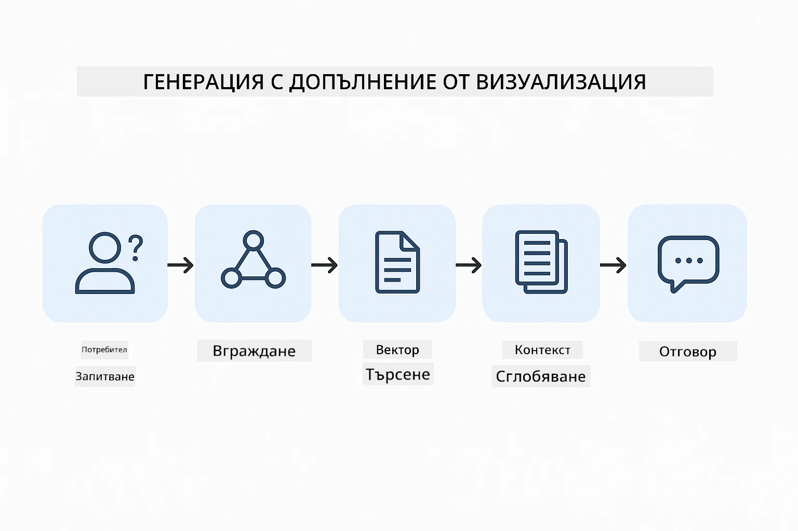
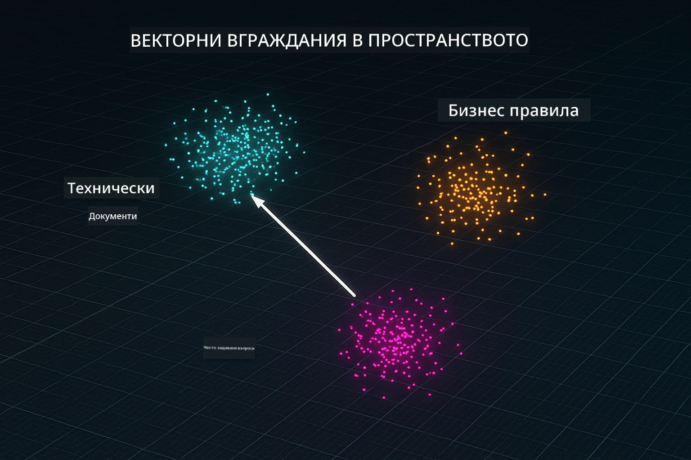
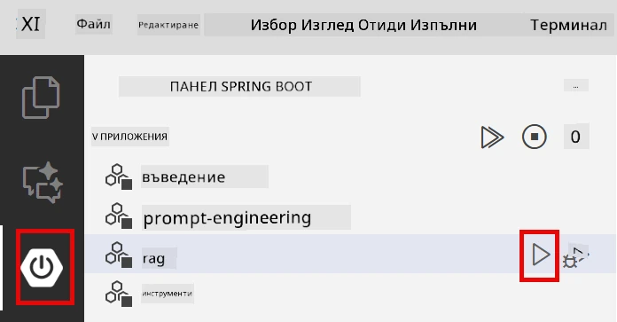
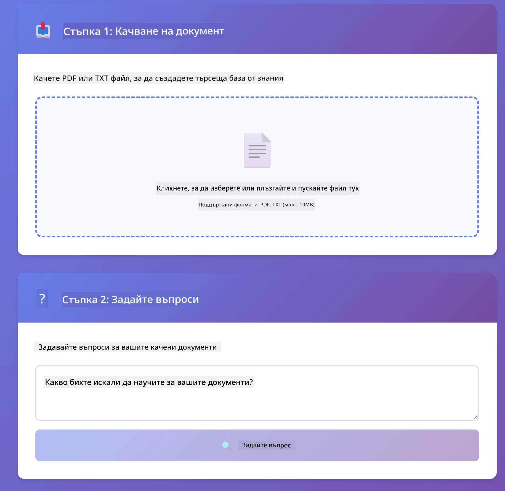
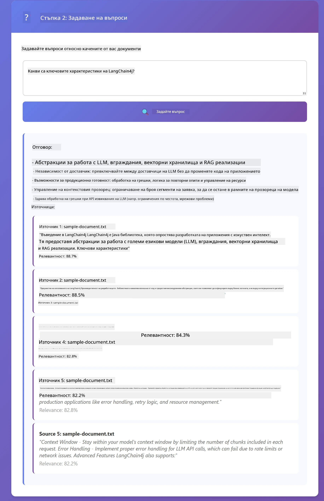

<!--
CO_OP_TRANSLATOR_METADATA:
{
  "original_hash": "81d087662fb3dd7b7124bce1a9c9ec86",
  "translation_date": "2026-01-06T01:10:27+00:00",
  "source_file": "03-rag/README.md",
  "language_code": "bg"
}
-->
# Модул 03: RAG (Извличане с подсилена генерация)

## Съдържание

- [Какво ще научите](../../../03-rag)
- [Предварителни изисквания](../../../03-rag)
- [Разбиране на RAG](../../../03-rag)
- [Как работи](../../../03-rag)
  - [Обработка на документи](../../../03-rag)
  - [Създаване на ембединг](../../../03-rag)
  - [Семантично търсене](../../../03-rag)
  - [Генериране на отговори](../../../03-rag)
- [Стартиране на приложението](../../../03-rag)
- [Използване на приложението](../../../03-rag)
  - [Качване на документ](../../../03-rag)
  - [Задаване на въпроси](../../../03-rag)
  - [Проверка на източниците](../../../03-rag)
  - [Експериментиране с въпроси](../../../03-rag)
- [Ключови концепции](../../../03-rag)
  - [Стратегия за разделяне на части](../../../03-rag)
  - [Оценки за сходство](../../../03-rag)
  - [Съхранение в памет](../../../03-rag)
  - [Управление на контекстния прозорец](../../../03-rag)
- [Кога RAG е важен](../../../03-rag)
- [Следващи стъпки](../../../03-rag)

## Какво ще научите

В предишните модули научихте как да водите разговори с изкуствен интелект и как ефективно да структурирате подкани. Но има фундаментално ограничение: езиковите модели знаят само това, което са научили по време на обучението. Те не могат да отговарят на въпроси за политиките на вашата компания, документацията на вашия проект или за информация, на която не са били обучавани.

RAG (Извличане с подсилена генерация) решава този проблем. Вместо да се опитвате да обучите модела с вашата информация (което е скъпо и непрактично), му давате възможност да търси в документите ви. Когато някой зададе въпрос, системата намира релевантна информация и я включва в подкана. Моделът след това отговаря въз основа на този извлечен контекст.

Представете си RAG като предоставяне на модел библиотеки с референции. Когато зададете въпрос, системата:

1. **Потребителски въпрос** - Вие задавате въпрос
2. **Ембединг** - Превръща въпроса ви във вектор
3. **Векторно търсене** - Намира сходни части от документи
4. **Сглобяване на контекст** - Добавя релевантни части към подкана
5. **Отговор** - LLM генерира отговор въз основа на контекста

Това основава отговорите на модела върху вашите реални данни вместо да разчита на обучителните си знания или да измисля отговори.



*Работен процес на RAG - от потребителски въпрос до семантично търсене и генериране на отговор с контекст*

## Предварителни изисквания

- Завършен Модул 01 (разположени Azure OpenAI ресурси)
- Файл `.env` в кореновата директория с Azure креденшъли (създаден от `azd up` в Модул 01)

> **Забележка:** Ако не сте завършили Модул 01, първо следвайте инструкциите за внедряване там.


## Как работи

### Обработка на документи

[DocumentService.java](../../../03-rag/src/main/java/com/example/langchain4j/rag/service/DocumentService.java)

Когато качите документ, системата го разбива на части – по-малки сегменти, които се побират удобно в контекстния прозорец на модела. Тези части се припокриват леко, за да не се загуби контекст на границите.

```java
Document document = FileSystemDocumentLoader.loadDocument("sample-document.txt");

DocumentSplitter splitter = DocumentSplitters
    .recursive(300, 30, new OpenAiTokenizer());

List<TextSegment> segments = splitter.split(document);
```

> **🤖 Опитайте с [GitHub Copilot](https://github.com/features/copilot) Chat:** Отворете [`DocumentService.java`](../../../03-rag/src/main/java/com/example/langchain4j/rag/service/DocumentService.java) и попитайте:
> - "Как LangChain4j разделя документите на части и защо припокриването е важно?"
> - "Какъв е оптималният размер на частите за различни типове документи и защо?"
> - "Как да обработвам документи на няколко езика или с особен формат?"

### Създаване на ембединг

[LangChainRagConfig.java](../../../03-rag/src/main/java/com/example/langchain4j/rag/config/LangChainRagConfig.java)

Всяка част се преобразува в числово представяне, наречено ембединг – по същество математически отпечатък, който улавя значението на текста. Подобен текст произвежда подобни ембединги.

```java
@Bean
public EmbeddingModel embeddingModel() {
    return OpenAiOfficialEmbeddingModel.builder()
        .baseUrl(azureOpenAiEndpoint)
        .apiKey(azureOpenAiKey)
        .modelName(azureEmbeddingDeploymentName)
        .build();
}

EmbeddingStore<TextSegment> embeddingStore = 
    new InMemoryEmbeddingStore<>();
```



*Документи, представени като вектори в пространството на ембединги – сходно съдържание се групира*

### Семантично търсене

[RagService.java](../../../03-rag/src/main/java/com/example/langchain4j/rag/service/RagService.java)

Когато зададете въпрос, той също се превръща в ембединг. Системата сравнява ембединга на вашия въпрос с ембединги на всички части от документи. Намира частите с най-близко значение – не само съвпадение на ключови думи, а истинско семантично сходство.

```java
Embedding queryEmbedding = embeddingModel.embed(question).content();

List<EmbeddingMatch<TextSegment>> matches = 
    embeddingStore.findRelevant(queryEmbedding, 5, 0.7);

for (EmbeddingMatch<TextSegment> match : matches) {
    String relevantText = match.embedded().text();
    double score = match.score();
}
```

> **🤖 Опитайте с [GitHub Copilot](https://github.com/features/copilot) Chat:** Отворете [`RagService.java`](../../../03-rag/src/main/java/com/example/langchain4j/rag/service/RagService.java) и попитайте:
> - "Как работи търсенето по сходство с ембединги и как се определя оценката?"
> - "Какъв праг на сходство трябва да използвам и как това влияе на резултатите?"
> - "Какво правя, ако не се намерят релевантни документи?"

### Генериране на отговори

[RagService.java](../../../03-rag/src/main/java/com/example/langchain4j/rag/service/RagService.java)

Най-релевантните части се включват в подкана към модела. Моделът чете тези конкретни части и отговаря на въпроса въз основа на тяхната информация. Това предотвратява халюцинации – моделът може да отговаря само от наличната пред него информация.

## Стартиране на приложението

**Проверете внедряването:**

Уверете се, че файлът `.env` съществува в кореновата директория с Azure креденшъли (създаден по време на Модул 01):
```bash
cat ../.env  # Трябва да покаже AZURE_OPENAI_ENDPOINT, API_KEY, DEPLOYMENT
```

**Стартирайте приложението:**

> **Забележка:** Ако вече сте стартирали всички приложения с `./start-all.sh` от Модул 01, този модул вече работи на порт 8081. Можете да пропуснете стартиращите команди по-долу и да отидете директно на http://localhost:8081.

**Вариант 1: Използване на Spring Boot Dashboard (Препоръчително за VS Code потребители)**

Dev контейнерът включва разширението Spring Boot Dashboard, което осигурява визуален интерфейс за управление на всички Spring Boot приложения. Можете да го намерите в Activity Bar отляво във VS Code (потърсете иконата на Spring Boot).

От Spring Boot Dashboard можете да:
- Видите всички налични Spring Boot приложения в работното пространство
- Стартирате/спирате приложения с един клик
- Гледате логовете на приложенията в реално време
- Следите състоянието на приложенията

Просто натиснете бутона за пускане до "rag", за да стартирате този модул, или стартирайте всички модули наведнъж.



**Вариант 2: Използване на shell скриптове**

Стартирайте всички уеб приложения (модул 01-04):

**Bash:**
```bash
cd ..  # От коренната директория
./start-all.sh
```

**PowerShell:**
```powershell
cd ..  # От кореновата директория
.\start-all.ps1
```

Или стартирайте само този модул:

**Bash:**
```bash
cd 03-rag
./start.sh
```

**PowerShell:**
```powershell
cd 03-rag
.\start.ps1
```

Двата скрипта автоматично зареждат променливите на средата от кореновия `.env` файл и ще компилират JAR файловете, ако не съществуват.

> **Забележка:** Ако предпочитате да компилирате всичките модули ръчно преди стартиране:
>
> **Bash:**
> ```bash
> cd ..  # Go to root directory
> mvn clean package -DskipTests
> ```
>
> **PowerShell:**
> ```powershell
> cd ..  # Go to root directory
> mvn clean package -DskipTests
> ```

Отворете http://localhost:8081 във вашия браузър.

**За спиране:**

**Bash:**
```bash
./stop.sh  # Само този модул
# Или
cd .. && ./stop-all.sh  # Всички модули
```

**PowerShell:**
```powershell
.\stop.ps1  # Само този модул
# Или
cd ..; .\stop-all.ps1  # Всички модули
```

## Използване на приложението

Приложението предоставя уеб интерфейс за качване на документи и задаване на въпроси.

<a href="images/rag-homepage.png"></a>

*Интерфейс на RAG приложението - качвайте документи и задавайте въпроси*

### Качване на документ

Започнете с качване на документ – TXT файлове са най-подходящи за тестване. Предоставен е `sample-document.txt` в тази директория, който съдържа информация за функциите на LangChain4j, реализацията на RAG и добри практики – идеален за тестване на системата.

Системата обработва документа, разбива го на части и създава ембединги за всяка част. Това се случва автоматично при качване.

### Задаване на въпроси

Сега задайте конкретни въпроси относно съдържанието на документа. Опитайте нещо фактически, което е ясно посочено в документа. Системата търси релевантни части, включва ги в подкана и генерира отговор.

### Проверка на източниците

Забележете, че всеки отговор включва източници с оценки за сходство. Тези оценки (от 0 до 1) показват колко релевантна е била всяка част към вашия въпрос. По-високите оценки означават по-добри съвпадения. Това ви позволява да проверите отговора спрямо изходния материал.

<a href="images/rag-query-results.png"></a>

*Резултати от заявка, показващи отговор с източници и оценки за релевантност*

### Експериментиране с въпроси

Пробвайте различни типове въпроси:
- Специфични факти: "Коя е основната тема?"
- Сравнения: "Каква е разликата между X и Y?"
- Обобщения: "Обобщи ключовите точки за Z"

Наблюдавайте как оценките за релевантност се променят в зависимост от това колко добре въпросът ви съвпада с съдържанието на документа.

## Ключови концепции

### Стратегия за разделяне на части

Документите се разделят на части от 300 токена с препокриване от 30 токена. Този баланс осигурява достатъчно контекст във всяка част, за да е смислена, като същевременно остава достатъчно малка за включване на няколко части в една подкана.

### Оценки за сходство

Оценките варират от 0 до 1:
- 0.7-1.0: Много релевантно, точно съвпадение
- 0.5-0.7: Релевантно, добър контекст
- Под 0.5: Филтрира се, твърде различно

Системата извлича само части над минималния праг, за да гарантира качество.

### Съхранение в памет

Този модул използва съхранение в памет за опростяване. При рестартиране на приложението качените документи се губят. Производствените системи използват постоянни векторни бази данни като Qdrant или Azure AI Search.

### Управление на контекстния прозорец

Всеки модел има максимален контекстен прозорец. Не можете да включите всички части от голям документ. Системата извлича топ N най-релевантни части (по подразбиране 5), за да остане в ограниченията, като същевременно осигури достатъчно контекст за точни отговори.

## Кога RAG е важен

**Използвайте RAG когато:**
- Отговаряте на въпроси за търговски документи
- Информацията се променя често (политики, цени, спецификации)
- Точността изисква атрибуция на източника
- Съдържанието е твърде голямо за единствена подкана
- Трябват ви проверими, обосновани отговори

**Не използвайте RAG когато:**
- Въпросите изискват общи знания, които моделът вече има
- Необходима е информация в реално време (RAG работи с качени документи)
- Съдържанието е достатъчно малко, за да бъде включено директно в подкана

## Следващи стъпки

**Следващ модул:** [04-инструменти - AI агенти с инструменти](../04-tools/README.md)

---

**Навигация:** [← Предишен: Модул 02 - Проектиране на подкани](../02-prompt-engineering/README.md) | [Обратно към основното](../README.md) | [Следващ: Модул 04 - Инструменти →](../04-tools/README.md)

---

<!-- CO-OP TRANSLATOR DISCLAIMER START -->
**Отказ от отговорност**:  
Този документ е преведен с помощта на AI преводаческа услуга [Co-op Translator](https://github.com/Azure/co-op-translator). Въпреки че се стремим към точност, моля, имайте предвид, че автоматизираните преводи могат да съдържат грешки или неточности. Оригиналният документ на неговия роден език трябва да се счита за авторитетен източник. За важна информация се препоръчва професионален превод от човек. Ние не носим отговорност за недоразумения или неправилни тълкувания, произтичащи от използването на този превод.
<!-- CO-OP TRANSLATOR DISCLAIMER END -->