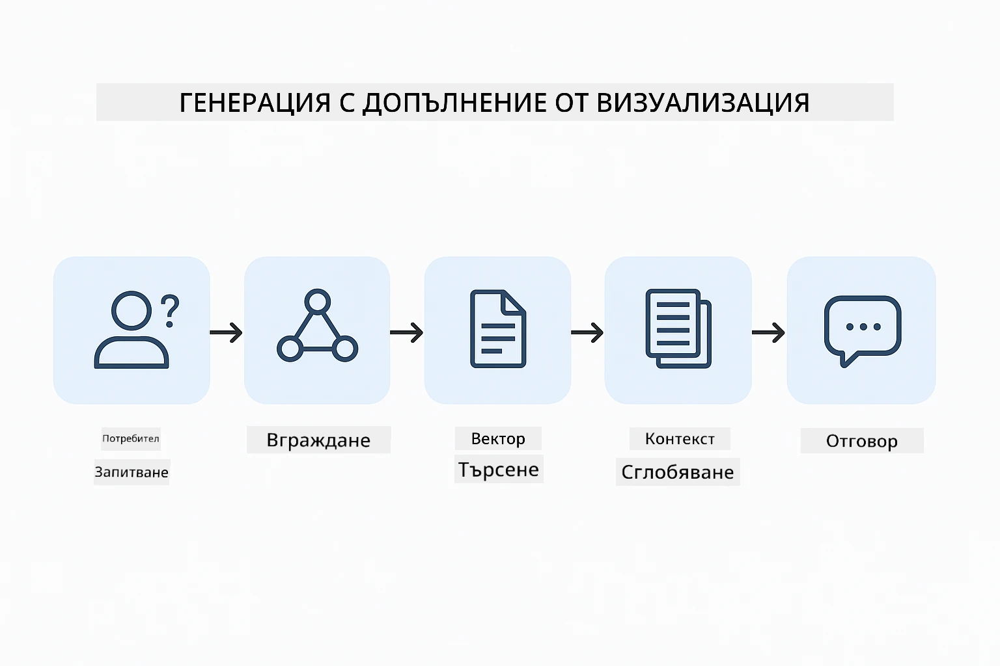
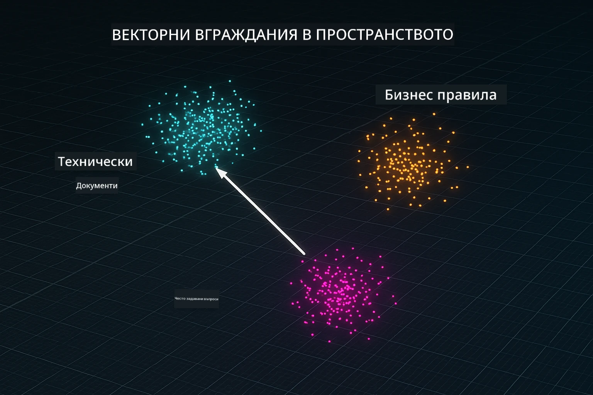
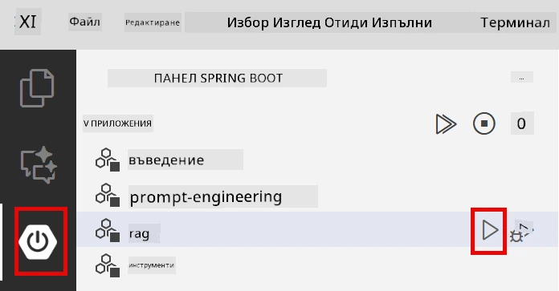
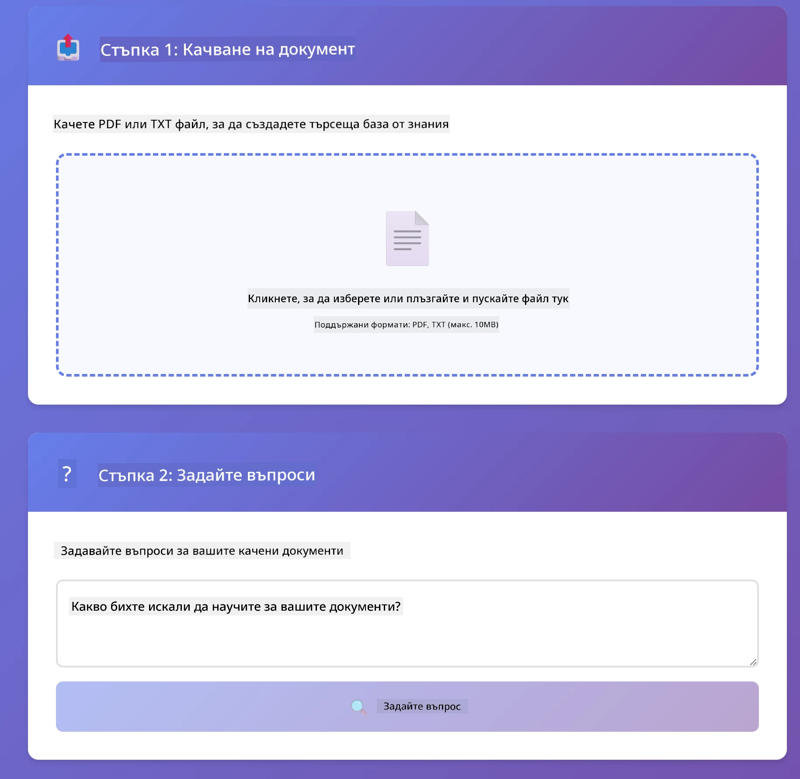
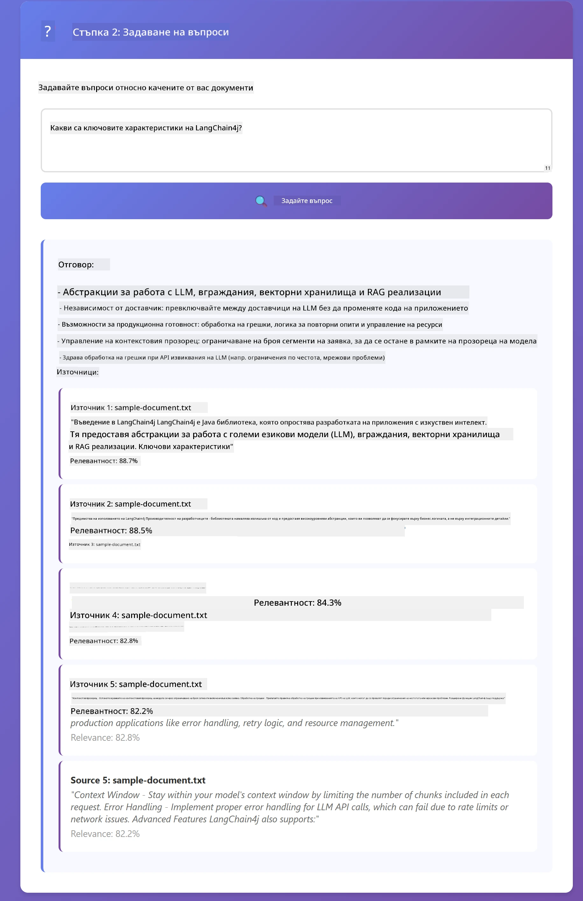

# Модул 03: RAG (Генериране с подобряване чрез извличане)

## Съдържание

- [Видео ръководство](#видео-ръководство)
- [Какво ще научите](#какво-ще-научите)
- [Предварителни изисквания](#предварителни-изисквания)
- [Разбиране на RAG](#разбиране-на-rag)
  - [Кой RAG подход използва това ръководство?](#кой-rag-подход-използва-това-ръководство)
- [Как работи](#как-работи)
  - [Обработка на документи](#обработка-на-документи)
  - [Създаване на вложения](#създаване-на-вложения)
  - [Семантично търсене](#семантично-търсене)
  - [Генериране на отговори](#генериране-на-отговор)
- [Стартиране на приложението](#стартиране-на-приложението)
- [Използване на приложението](#използване-на-приложението)
  - [Качване на документ](#качване-на-документ)
  - [Задаване на въпроси](#задаване-на-въпроси)
  - [Проверка на източниците](#проверка-на-изходните-препратки)
  - [Експериментиране с въпроси](#експериментирайте-с-въпроси)
- [Ключови концепции](#ключови-понятия)
  - [Стратегия за разбиване на части](#стратегия-за-разделяне-на-части)
  - [Оценки за подобие](#оценки-за-прилика)
  - [Съхранение в паметта](#съхранение-в-памет)
  - [Управление на контекстния прозорец](#управление-на-контекстния-прозорец)
- [Кога RAG е важен](#кога-rag-има-значение)
- [Следващи стъпки](#следващи-стъпки)

## Видео ръководство

Гледайте тази сесия наживо, която обяснява как да започнете с този модул:

<a href="https://www.youtube.com/watch?v=_olq75ZH_eY"></a>

## Какво ще научите

В предишните модули научихте как да водите разговори с AI и как ефективно да структурирате заявките си. Но има основно ограничение: езиковите модели знаят само това, което са научили по време на обучението си. Те не могат да отговарят на въпроси за политиките на вашата компания, документацията на проекта или друга информация, която не е била включена в тяхното обучение.

RAG (Генериране с подобряване чрез извличане) решава този проблем. Вместо да се опитвате да научите модела на вашата информация (което е скъпо и непрактично), вие му давате възможността да търси във вашите документи. Когато някой зададе въпрос, системата намира релевантна информация и я включва в заявката. След това моделът отговаря въз основа на този извлечен контекст.

Мислете за RAG като за предоставяне на модела на справочна библиотека. Когато зададете въпрос, системата прави следното:

1. **Потребителски въпрос** – Вие задавате въпрос
2. **Вложение** – Преобразува въпроса в вектор
3. **Векторно търсене** – Намира подобни части от документи
4. **Събиране на контекст** – Добавя релевантни части към заявката
5. **Отговор** – LLM генерира отговор въз основа на контекста

Това оснoва отговорите на модела на вашите действителни данни, вместо да разчита само на обучителната си информация или да измисля отговори.

## Предварителни изисквания

- Завършен [Модул 01 - Въведение](../01-introduction/README.md) (разположени Azure OpenAI ресурси, включително модел за вложение `text-embedding-3-small`)
- Файл `.env` в главната директория с Azure данни за достъп (създаден от `azd up` в Модул 01)

> **Бележка:** Ако не сте завършили Модул 01, първо следвайте инструкциите за разполагане там. Командата `azd up` разполага както GPT чат модела, така и модела за вложения, използван в този модул.

## Разбиране на RAG

Диаграмата по-долу илюстрира основната концепция: вместо да разчита само на данните от обучението на модела, RAG му предоставя справочната библиотека с вашите документи, които да преглежда преди да генерира всеки отговор.


*Тази диаграма показва разликата между стандартен LLM (който гадае от обучителни данни) и LLM с RAG подобрение (който първо преглежда вашите документи).*

Ето как частите се свързват от край до край. Въпросът на потребителя преминава през четири етапа — вграждане, векторно търсене, събиране на контекст и генериране на отговор — като всеки етап надгражда предишния:



*Тази диаграма показва край до край RAG процеса — въпросът на потребителя преминава през вграждане, векторно търсене, събиране на контекст и генериране на отговор.*

Останалата част от този модул разглежда всеки етап подробно, с код, който можете да стартирате и модифицирате.

### Кой RAG подход използва това ръководство?

LangChain4j предлага три начина за реализиране на RAG, всеки с различно ниво на абстракция. Диаграмата по-долу ги сравнява един до друг:


*Тази диаграма сравнява трите подхода RAG в LangChain4j — Easy, Native и Advanced — показвайки ключовите им компоненти и кога да се използват.*

| Подход | Какво прави | Компромис |
|---|---|---|
| **Easy RAG** | Свързва всичко автоматично чрез `AiServices` и `ContentRetriever`. Аннотирате интерфейс, прикачвате търсачка, а LangChain4j се грижи за вграждане, търсене и събиране на заявка на заден план. | Минимален код, но не виждате какво се случва на всеки етап. |
| **Native RAG** | Вие извиквате модела за вграждане, търсите в хранилището, изграждате заявката и генерирате отговора сами — една изрична стъпка наведнъж. | Повече код, но всеки етап е видим и модифицируем. |
| **Advanced RAG** | Използва `RetrievalAugmentor` рамка с плъгин трансформъри на заявки, маршрутизатори, пренареждачи и инжектори на съдържание за продукционни решения. | Максимална гъвкавост, но значително по-сложна. |

**Това ръководство използва Native подхода.** Всеки етап от RAG процеса — вложение на заявката, търсене в векторното хранилище, събиране на контекста и генериране на отговор — е изрично написан в [`RagService.java`](../../../03-rag/src/main/java/com/example/langchain4j/rag/service/RagService.java). Това е умишлено: като учебен ресурс е по-важно да виждате и разбирате всеки етап, отколкото кодът да е максимално съкратен. Когато се почувствате уверени как работят частите, можете да преминете към Easy RAG за бързи прототипи или Advanced RAG за продукционни системи.

> **💡 Любопитни за Easy RAG?** LangChain4j също предлага *Easy RAG* подход, при който `AiServices` и `ContentRetriever` автоматично се грижат за вграждането, търсенето и събирането на заявка. Този модул тръгва по по-изричния път — разкъсва този процес така, че да виждате и контролирате всеки етап сами.

Диаграмата по-долу показва Easy RAG процеса. Забележете как `AiServices` и `EmbeddingStoreContentRetriever` скриват цялата сложност — зареждате документ, прикачвате търсачка и получавате отговори. Native подходът в този модул разкрива всички тези скрити стъпки:


*Тази диаграма показва Easy RAG процеса. Сравнете го с Native подхода, използван в този модул: Easy RAG скрива вграждането, извличането и събирането на заявка зад `AiServices` и `ContentRetriever` — зареждате документ, прикачвате търсачка и получавате отговори. Native подходът в този модул разкрива този процес, така че сами да извиквате всеки етап (вграждане, търсене, събиране на контекст, генериране) и да имате пълен контрол и видимост.*

## Как работи

RAG процесът в този модул се разбива на четири етапа, които се изпълняват последователно всеки път, когато потребител зададе въпрос. Първо, каченият документ се **парсира и разбива на части** по размер, удобен за модела. Тези части се преобразуват в **векторни вграждания** и се съхраняват, за да могат да се сравняват математически. Когато пристигне заявка, системата извършва **семантично търсене**, за да намери най-релевантните части, и накрая ги подава като контекст към LLM за **генериране на отговор**. По-долу разглеждаме всеки етап с код и диаграми. Нека започнем с първата стъпка.

### Обработка на документи

[DocumentService.java](../../../03-rag/src/main/java/com/example/langchain4j/rag/service/DocumentService.java)

Когато качите документ, системата го парсира (PDF или обикновен текст), прикачва метаданни като име на файл и след това го разбива на части — по-малки сегменти, които се побират удобно в контекстния прозорец на модела. Тези части се припокриват леко, за да не се загуби контекст на границите.

```java
// Анализирайте качения файл и го опаковайте в LangChain4j Документ
Document document = Document.from(content, metadata);

// Разделете на парчета от 300 токена с припокриване от 30 токена
DocumentSplitter splitter = DocumentSplitters
    .recursive(300, 30);

List<TextSegment> segments = splitter.split(document);
```
  
Диаграмата по-долу показва как това работи визуално. Забележете как всяка част споделя някои токени със съседните — припокриването от 30 токена гарантира, че няма да се загуби важна информация между частите:


*Тази диаграма показва разбиване на документ на 300-токенови части с припокриване от 30 токена, което запазва контекста на границите между частите.*

> **🤖 Опитайте с [GitHub Copilot](https://github.com/features/copilot) Chat:** Отворете [`DocumentService.java`](../../../03-rag/src/main/java/com/example/langchain4j/rag/service/DocumentService.java) и задайте:
> - "Как LangChain4j разбива документи на части и защо припокриването е важно?"
> - "Какъв е оптималният размер на частите за различни типове документи и защо?"
> - "Как да обработвам документи на различни езици или със специално форматиране?"

### Създаване на вложения

[LangChainRagConfig.java](../../../03-rag/src/main/java/com/example/langchain4j/rag/config/LangChainRagConfig.java)

Всяка част се преобразува в числово представяне, наречено вложение — същността на конвертор от значение в числа. Моделът за вграждане не е "умен" по начина, по който е чат моделът; той не следва инструкции, не разсъждава и не отговаря на въпроси. Това, което може да направи, е да превърне текст в математическо пространство, където сходните значения се групират близо едно до друго — "кола" близо до "автомобил," "политика за възстановяване" близо до "върнете ми парите." Мислете за чат модела като за човек, с когото можете да разговаряте; моделът за вграждане е ненадмината система за подреждане на файлове.

Диаграмата по-долу визуализира тази концепция — текстът влиза, излизат числови вектори, а сходните значения създават близки вектори:


*Тази диаграма показва как моделът за вграждане преобразува текст в числови вектори, като поставя сходни значения — като "кола" и "автомобил" — близо в пространството на векторите.*

```java
@Bean
public EmbeddingModel embeddingModel() {
    return OpenAiOfficialEmbeddingModel.builder()
        .baseUrl(azureOpenAiEndpoint)
        .apiKey(azureOpenAiKey)
        .modelName(azureEmbeddingDeploymentName)
        .build();
}

EmbeddingStore<TextSegment> embeddingStore = 
    new InMemoryEmbeddingStore<>();
```
  
Диаграмата на класовете по-долу показва двата отделни потока в RAG процеса и класовете на LangChain4j, които ги реализират. **Потокът на вграждане** (изпълнява се веднъж при качване) разбива документа, вгражда частите и ги съхранява чрез `.addAll()`. **Потокът на заявка** (изпълнява се всеки път, когато потребител зададе въпрос) вгражда въпроса, търси в хранилището чрез `.search()`, и предава съответния контекст към чат модела. Двата потока се срещат в споделения интерфейс `EmbeddingStore<TextSegment>`:


*Тази диаграма показва двата потока в RAG процеса — вграждане и заявка — и как те се свързват през споделен EmbeddingStore.*

След като вградените части се съхранят, сходното съдържание естествено се групира заедно в векторното пространство. Визуализацията по-долу показва как документи с близки теми се групират като съседни точки, което прави възможно семантичното търсене:



*Тази визуализация показва как свързаните документи се групират заедно в 3D векторното пространство, като теми като Техническа документация, Бизнес правила и Често задавани въпроси формират отделни групи.*

Когато потребител търси, системата следва четири стъпки: вгражда документите веднъж, вгражда заявката при всяко търсене, сравнява вектора на заявката с всички съхранени вектори чрез косинусна прилика, и връща топ-K частите с най-висок резултат. Диаграмата по-долу преминава през всяка стъпка и свързаните LangChain4j класове:


*Тази диаграма показва четиристъпковия процес на вграждане за търсене: вграждане на документи, вграждане на заявка, сравнение на вектори чрез косинусна прилика и връщане на топ-K резултати.*

### Семантично търсене

[RagService.java](../../../03-rag/src/main/java/com/example/langchain4j/rag/service/RagService.java)

Когато зададете въпрос, той също се преобразува във векторна форма. Системата сравнява вграждането на вашия въпрос с тези на всички части от документите. Намира частите със сходно значение - не само съвпадащи ключови думи, а реална семантична прилика.

```java
Embedding queryEmbedding = embeddingModel.embed(question).content();

EmbeddingSearchRequest searchRequest = EmbeddingSearchRequest.builder()
    .queryEmbedding(queryEmbedding)
    .maxResults(5)
    .minScore(0.5)
    .build();

EmbeddingSearchResult<TextSegment> searchResult = embeddingStore.search(searchRequest);
List<EmbeddingMatch<TextSegment>> matches = searchResult.matches();

for (EmbeddingMatch<TextSegment> match : matches) {
    String relevantText = match.embedded().text();
    double score = match.score();
}
```
  
Диаграмата по-долу противопоставя семантичното търсене на традиционното търсене по ключови думи. Търсенето по ключова дума за "превозно средство" пропуска част за "коли и камиони", но семантичното търсене разбира, че те значат едно и също нещо и го връща като високорейтингов резултат:


*Тази диаграма сравнява търсенето по ключови думи със семантичното търсене, показвайки как семантичното извлича концептуално свързано съдържание, дори когато точните ключови думи се различават.*

Под капака приличието се измерва чрез косинусна прилика — основно, питаме се дали "две стрелки сочат в една и съща посока?" Две части могат да използват напълно различни думи, но ако значат едно и също, техните вектори сочат в същата посока и оценката им е близка до 1.0:


*Тази диаграма илюстрира косинусната прилика като ъгъл между векторите на вградените представяния — по-успоредни вектори имат резултат, по-близък до 1.0, което показва по-висока семантична прилика.*

> **🤖 Опитайте с [GitHub Copilot](https://github.com/features/copilot) Chat:** Отворете [`RagService.java`](../../../03-rag/src/main/java/com/example/langchain4j/rag/service/RagService.java) и попитайте:
> - "Как работи търсенето по прилика с вградени представяния и какво определя резултата?"
> - "Какъв праг за прилика трябва да използвам и как това влияе на резултатите?"
> - "Как да постъпя, когато не бъдат намерени релевантни документи?"

### Генериране на отговор

[RagService.java](../../../03-rag/src/main/java/com/example/langchain4j/rag/service/RagService.java)

Най-релевантните частички се събират в структуриран подкана, която включва явни инструкции, извлечения контекст и въпроса на потребителя. Моделът чете точно тези частички и отговаря въз основа на тази информация — може да използва само това, което е пред него, което предотвратява халюцинации.

```java
String context = matches.stream()
    .map(match -> match.embedded().text())
    .collect(Collectors.joining("\n\n"));

String prompt = String.format("""
    Answer the question based on the following context.
    If the answer cannot be found in the context, say so.

    Context:
    %s

    Question: %s

    Answer:""", context, request.question());

String answer = chatModel.chat(prompt);
```

Диаграмата по-долу показва този процес в действие — топ резултатните частички от стъпката на търсене се вмъкват в шаблона на подкана, а `OpenAiOfficialChatModel` генерира обоснован отговор:


*Тази диаграма показва как топ резултатните частички се събират в структуриран подкана, позволявайки на модела да генерира обоснован отговор от вашите данни.*

## Стартиране на приложението

**Проверете разгръщането:**

Уверете се, че файлът `.env` съществува в основната директория с Azure креденшъли (създадени по време на Модул 01). Стартирайте това от директорията на модула (`03-rag/`):

**Bash:**
```bash
cat ../.env  # Трябва да показва AZURE_OPENAI_ENDPOINT, API_KEY, DEPLOYMENT
```

**PowerShell:**
```powershell
Get-Content ..\.env  # Трябва да показва AZURE_OPENAI_ENDPOINT, API_KEY, DEPLOYMENT
```

**Стартирайте приложението:**

> **Забележка:** Ако вече сте стартирали всички приложения чрез `./start-all.sh` от основната директория (както е описано в Модул 01), този модул вече работи на порт 8081. Можете да пропуснете долните команди за стартиране и директно да отворите http://localhost:8081.

**Вариант 1: Използване на Spring Boot Dashboard (Препоръчително за потребители на VS Code)**

Dev контейнерът включва разширение Spring Boot Dashboard, което осигурява визуален интерфейс за управление на всички Spring Boot приложения. Можете да го намерите в Activity Bar вляво на VS Code (потърсете иконата на Spring Boot).

От Spring Boot Dashboard можете да:
- видите всички достъпни Spring Boot приложения в работното пространство
- стартирате/спирате приложения с едно кликване
- разглеждате логове на приложенията в реално време
- следите статус на приложенията

Просто натиснете бутона за пускане до "rag", за да стартирате този модул, или стартирайте всички модули наведнъж.



*Този скрийншот показва Spring Boot Dashboard в VS Code, където можете визуално да стартирате, спирате и следите приложения.*

**Вариант 2: Използване на shell скриптове**

Стартирайте всички уеб приложения (модули 01-04):

**Bash:**
```bash
cd ..  # От коренната директория
./start-all.sh
```

**PowerShell:**
```powershell
cd ..  # От коренната директория
.\start-all.ps1
```

Или стартирайте само този модул:

**Bash:**
```bash
cd 03-rag
./start.sh
```

**PowerShell:**
```powershell
cd 03-rag
.\start.ps1
```

Двата скрипта автоматично зареждат променливи на средата от основния `.env` файл и ще компилират JAR файловете, ако не съществуват.

> **Забележка:** Ако предпочитате да изградите всички модули ръчно преди стартиране:
>
> **Bash:**
> ```bash
> cd ..  # Go to root directory
> mvn clean package -DskipTests
> ```
>
> **PowerShell:**
> ```powershell
> cd ..  # Go to root directory
> mvn clean package -DskipTests
> ```

Отворете http://localhost:8081 във вашия браузър.

**За спиране:**

**Bash:**
```bash
./stop.sh  # Само този модул
# Или
cd .. && ./stop-all.sh  # Всички модули
```

**PowerShell:**
```powershell
.\stop.ps1  # Само този модул
# Или
cd ..; .\stop-all.ps1  # Всички модули
```

## Използване на приложението

Приложението предоставя уеб интерфейс за качване на документи и задаване на въпроси.

<a href="images/rag-homepage.png"></a>

*Този скрийншот показва интерфейса на RAG приложението, където качвате документи и задавате въпроси.*

### Качване на документ

Започнете с качване на документ - най-добре работят TXT файлове за тестване. Предоставен е файл `sample-document.txt` в тази директория, който съдържа информация за функциите на LangChain4j, имплементацията на RAG и добри практики - идеален за тестване на системата.

Системата обработва документа, разбива го на части и създава вградени представяния за всяка част. Това се случва автоматично при качване.

### Задаване на въпроси

Сега задайте конкретни въпроси относно съдържанието на документа. Опитайте с фактическа информация, която е ясно изразена в документа. Системата търси релевантни части, включва ги в подкана и генерира отговор.

### Проверка на изходните препратки

Забележете, че всеки отговор включва изходни препратки с оценки за прилика. Тези оценки (от 0 до 1) показват колко релевантна е била всяка част към вашия въпрос. По-високите оценки означават по-добри съвпадения. Това ви позволява да проверите отговора спрямо изходния материал.

<a href="images/rag-query-results.png"></a>

*Този скрийншот показва резултатите от заявка с генерирания отговор, източниците и оценките за релевантност на всяка извлечена част.*

### Експериментирайте с въпроси

Опитайте различни типове въпроси:
- Конкретни факти: "Каква е основната тема?"
- Сравнения: "Каква е разликата между X и Y?"
- Резюмета: "Обобщете ключовите точки за Z"

Наблюдавайте как се променят оценките за релевантност в зависимост от това колко добре въпросът ви съответства на съдържанието на документа.

## Ключови понятия

### Стратегия за разделяне на части

Документите се разделят на части по 300 токена с припокриване от 30 токена. Този баланс осигурява достатъчно контекст във всяка част, за да бъде смислена, като същевременно остава достатъчно малка, за да се включат няколко части в една подкана.

### Оценки за прилика

Всяка извлечена част идва с оценка за прилика между 0 и 1, която показва колко близо съответства на въпроса на потребителя. Диаграмата по-долу визуализира диапазоните на оценките и как системата ги използва за филтриране на резултатите:


*Тази диаграма показва диапазоните на оценките от 0 до 1, с минимален праг от 0.5, който филтрира нелевантните части.*

Оценките са в диапазон от 0 до 1:
- 0.7-1.0: Много релевантно, точно съвпадение
- 0.5-0.7: Релевантно, добър контекст
- Под 0.5: Филтрирано, твърде различно

Системата извлича само части над минималния праг, за да осигури качество.

Вградените представяния работят добре, когато смисълът се кластеризира ясно, но имат слепи зони. Диаграмата по-долу показва често срещани случаи на неуспех — части, които са твърде големи, създават неясни вектори, части, които са твърде малки, нямат контекст, многозначни термини сочат към множество групи, а точните търсения по идентификатори (№ на части и др.) не работят със вградени представяния изобщо:


*Тази диаграма показва често срещани случаи на неуспех при вградените представяния: части твърде големи, части твърде малки, двусмислени термини, сочещи към няколко групи, и точни търсения като по идентификатори.*

### Съхранение в памет

Този модул използва съхранение в памет за простота. При рестарт на приложението качените документи се губят. Продукционните системи използват постоянни векторни бази данни като Qdrant или Azure AI Search.

### Управление на контекстния прозорец

Всяка модел има максимален контекстен прозорец. Не можете да включите всички части от голям документ. Системата извлича топ N най-релевантни части (по подразбиране 5), за да се вмести в ограниченията, като осигурява достатъчно контекст за точни отговори.

## Кога RAG има значение

RAG не винаги е правилният подход. Наръчникът за решения по-долу ви помага да определите кога RAG добавя стойност и кога по-прости подходи — като включване на съдържание директно в подкана или разчитане на вградените знания на модела — са достатъчни:


*Тази диаграма показва наръчник за решения кога RAG добавя стойност и кога по-простите подходи са достатъчни.*

## Следващи стъпки

**Следващ модул:** [04-tools - AI агенти с инструменти](../04-tools/README.md)

---

**Навигация:** [← Предишен: Модул 02 - Prompt Engineering](../02-prompt-engineering/README.md) | [Обратно към Основното](../README.md) | [Следващ: Модул 04 - Инструменти →](../04-tools/README.md)

---

<!-- CO-OP TRANSLATOR DISCLAIMER START -->
**Отказ от отговорност**:
Този документ е преведен с помощта на AI преводачески услуга [Co-op Translator](https://github.com/Azure/co-op-translator). Въпреки че се стремим към точност, моля имайте предвид, че автоматизираните преводи могат да съдържат грешки или неточности. Оригиналният документ на неговия роден език трябва да се счита за авторитетен източник. За критична информация се препоръчва професионален човешки превод. Ние не носим отговорност за каквито и да е недоразумения или неправилни тълкувания, произтичащи от използването на този превод.
<!-- CO-OP TRANSLATOR DISCLAIMER END -->