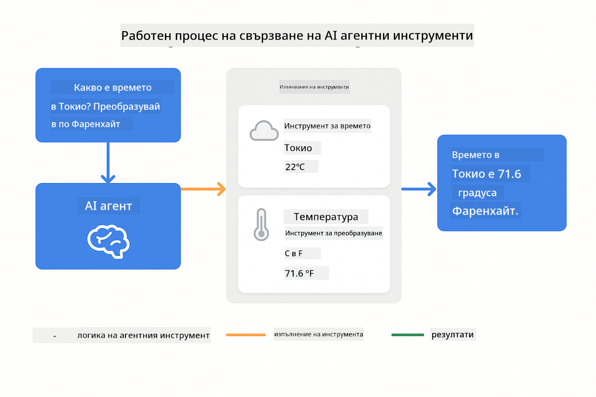
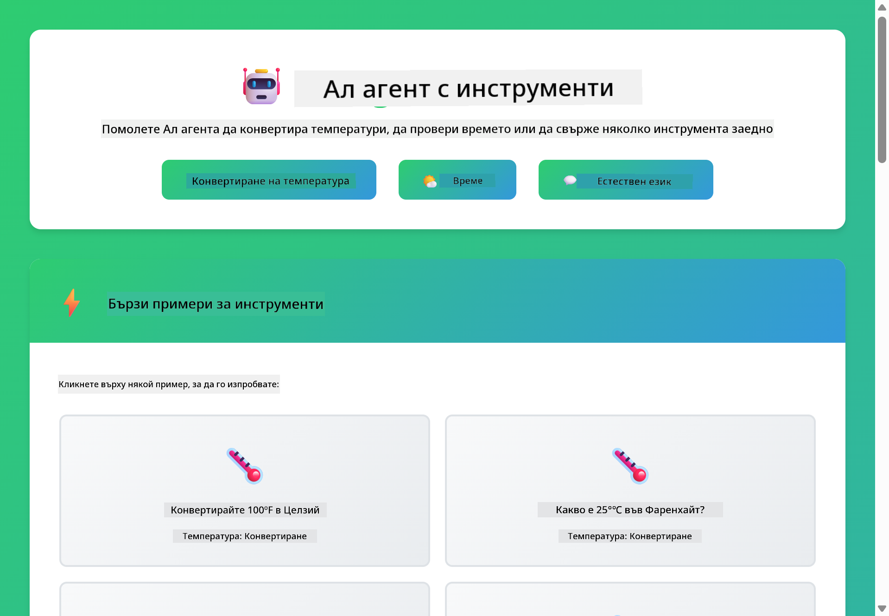
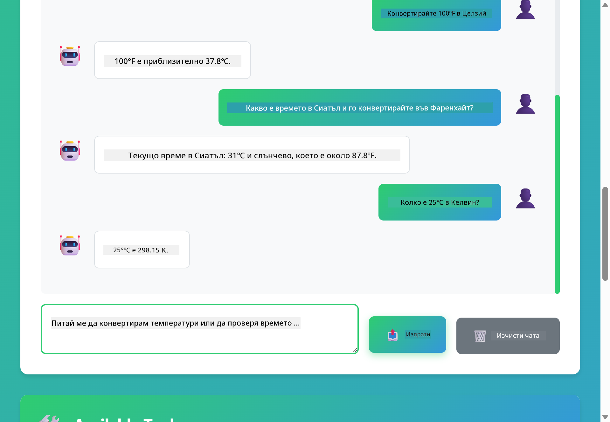

<!--
CO_OP_TRANSLATOR_METADATA:
{
  "original_hash": "aa23f106e7f53270924c9dd39c629004",
  "translation_date": "2025-12-13T19:23:06+00:00",
  "source_file": "04-tools/README.md",
  "language_code": "bg"
}
-->
# Модул 04: AI агенти с инструменти

## Съдържание

- [Какво ще научите](../../../04-tools)
- [Предварителни изисквания](../../../04-tools)
- [Разбиране на AI агенти с инструменти](../../../04-tools)
- [Как работи извикването на инструменти](../../../04-tools)
  - [Дефиниции на инструменти](../../../04-tools)
  - [Вземане на решения](../../../04-tools)
  - [Изпълнение](../../../04-tools)
  - [Генериране на отговор](../../../04-tools)
- [Свързване на инструменти](../../../04-tools)
- [Стартиране на приложението](../../../04-tools)
- [Използване на приложението](../../../04-tools)
  - [Опитайте просто използване на инструмент](../../../04-tools)
  - [Тествайте свързване на инструменти](../../../04-tools)
  - [Вижте потока на разговора](../../../04-tools)
  - [Наблюдавайте разсъжденията](../../../04-tools)
  - [Експериментирайте с различни заявки](../../../04-tools)
- [Ключови концепции](../../../04-tools)
  - [ReAct модел (Разсъждаване и действие)](../../../04-tools)
  - [Значение на описанията на инструментите](../../../04-tools)
  - [Управление на сесии](../../../04-tools)
  - [Обработка на грешки](../../../04-tools)
- [Налични инструменти](../../../04-tools)
- [Кога да използваме агенти с инструменти](../../../04-tools)
- [Следващи стъпки](../../../04-tools)

## Какво ще научите

Досега научихте как да водите разговори с AI, как да структурирате ефективно подканите и как да обвързвате отговорите с вашите документи. Но все още има основно ограничение: езиковите модели могат само да генерират текст. Те не могат да проверят времето, да извършват изчисления, да правят заявки към бази данни или да взаимодействат с външни системи.

Инструментите променят това. Като дадете на модела достъп до функции, които може да извиква, вие го превръщате от генератор на текст в агент, който може да предприема действия. Моделът решава кога му трябва инструмент, кой инструмент да използва и какви параметри да подаде. Вашият код изпълнява функцията и връща резултата. Моделът включва този резултат в своя отговор.

## Предварителни изисквания

- Завършен Модул 01 (разположени Azure OpenAI ресурси)
- Файл `.env` в коренната директория с Azure идентификационни данни (създаден от `azd up` в Модул 01)

> **Забележка:** Ако не сте завършили Модул 01, първо следвайте инструкциите за разполагане там.

## Разбиране на AI агенти с инструменти

AI агент с инструменти следва модел на разсъждаване и действие (ReAct):

1. Потребителят задава въпрос  
2. Агентът разсъждава какво трябва да знае  
3. Агентът решава дали му трябва инструмент, за да отговори  
4. Ако да, агентът извиква подходящия инструмент с правилните параметри  
5. Инструментът изпълнява и връща данни  
6. Агентът включва резултата и предоставя окончателния отговор  


*Моделът ReAct - как AI агентите редуват разсъждаване и действие за решаване на проблеми*

Това се случва автоматично. Вие дефинирате инструментите и техните описания. Моделът се грижи за вземането на решения кога и как да ги използва.

## Как работи извикването на инструменти

**Дефиниции на инструменти** - [WeatherTool.java](../../../04-tools/src/main/java/com/example/langchain4j/agents/tools/WeatherTool.java) | [TemperatureTool.java](../../../04-tools/src/main/java/com/example/langchain4j/agents/tools/TemperatureTool.java)

Вие дефинирате функции с ясни описания и спецификации на параметрите. Моделът вижда тези описания в системната си подканваща фраза и разбира какво прави всеки инструмент.

```java
@Component
public class WeatherTool {
    
    @Tool("Get the current weather for a location")
    public String getCurrentWeather(@P("Location name") String location) {
        // Вашата логика за търсене на времето
        return "Weather in " + location + ": 22°C, cloudy";
    }
}

@AiService
public interface Assistant {
    String chat(@MemoryId String sessionId, @UserMessage String message);
}

// Асистентът е автоматично свързан от Spring Boot с:
// - ChatModel bean
// - Всички @Tool методи от @Component класове
// - ChatMemoryProvider за управление на сесии
```

> **🤖 Опитайте с [GitHub Copilot](https://github.com/features/copilot) Chat:** Отворете [`WeatherTool.java`](../../../04-tools/src/main/java/com/example/langchain4j/agents/tools/WeatherTool.java) и попитайте:  
> - "Как бих интегрирал реално API за времето като OpenWeatherMap вместо фиктивни данни?"  
> - "Какво прави едно добро описание на инструмент, което помага на AI да го използва правилно?"  
> - "Как да обработвам грешки от API и ограничения на честотата в имплементациите на инструменти?"

**Вземане на решения**

Когато потребителят пита "Какво е времето в Сиатъл?", моделът разпознава, че му трябва инструментът за времето. Той генерира извикване на функция с параметър локация "Seattle".

**Изпълнение** - [AgentService.java](../../../04-tools/src/main/java/com/example/langchain4j/agents/service/AgentService.java)

Spring Boot автоматично свързва декларативния интерфейс `@AiService` с всички регистрирани инструменти, а LangChain4j изпълнява извикванията на инструментите автоматично.

> **🤖 Опитайте с [GitHub Copilot](https://github.com/features/copilot) Chat:** Отворете [`AgentService.java`](../../../04-tools/src/main/java/com/example/langchain4j/agents/service/AgentService.java) и попитайте:  
> - "Как работи моделът ReAct и защо е ефективен за AI агенти?"  
> - "Как агентът решава кой инструмент да използва и в какъв ред?"  
> - "Какво се случва, ако изпълнението на инструмент се провали - как да обработвам грешки надеждно?"

**Генериране на отговор**

Моделът получава данните за времето и ги форматира в естествен език за потребителя.

### Защо да използваме декларативни AI услуги?

Този модул използва интеграцията на LangChain4j със Spring Boot с декларативни интерфейси `@AiService`:

- **Автоматично свързване в Spring Boot** - ChatModel и инструментите се инжектират автоматично  
- **Патерн @MemoryId** - Автоматично управление на паметта на сесията  
- **Единствен екземпляр** - Асистентът се създава веднъж и се използва повторно за по-добра производителност  
- **Типобезопасно изпълнение** - Java методи се извикват директно с конверсия на типове  
- **Оркестрация на множество ходове** - Автоматично обработва свързване на инструменти  
- **Нулев шаблонен код** - Без ръчни извиквания на AiServices.builder() или HashMap за памет  

Алтернативните подходи (ръчно `AiServices.builder()`) изискват повече код и пропускат предимствата на интеграцията със Spring Boot.

## Свързване на инструменти

**Свързване на инструменти** - AI може да извика няколко инструмента последователно. Попитайте "Какво е времето в Сиатъл и трябва ли да взема чадър?" и наблюдавайте как свързва `getCurrentWeather` с разсъждения за дъждобран.

<a href="images/tool-chaining.png"></a>

*Последователни извиквания на инструменти - изходът на един инструмент се подава към следващото решение*

**Грациозни провали** - Попитайте за времето в град, който не е в фиктивните данни. Инструментът връща съобщение за грешка, а AI обяснява, че не може да помогне. Инструментите се провалят безопасно.

Това се случва в един ход на разговора. Агентът оркестрира множество извиквания на инструменти автономно.

## Стартиране на приложението

**Проверете разполагането:**

Уверете се, че файлът `.env` съществува в коренната директория с Azure идентификационни данни (създаден по време на Модул 01):  
```bash
cat ../.env  # Трябва да показва AZURE_OPENAI_ENDPOINT, API_KEY, DEPLOYMENT
```
  
**Стартирайте приложението:**

> **Забележка:** Ако вече сте стартирали всички приложения с `./start-all.sh` от Модул 01, този модул вече работи на порт 8084. Можете да пропуснете командите за стартиране по-долу и да отидете директно на http://localhost:8084.

**Опция 1: Използване на Spring Boot Dashboard (Препоръчително за потребители на VS Code)**

Развойната среда включва разширението Spring Boot Dashboard, което предоставя визуален интерфейс за управление на всички Spring Boot приложения. Можете да го намерите в лентата с дейности вляво във VS Code (потърсете иконата на Spring Boot).

От Spring Boot Dashboard можете:  
- Да видите всички налични Spring Boot приложения в работната област  
- Да стартирате/спирате приложения с един клик  
- Да преглеждате логовете на приложенията в реално време  
- Да следите състоянието на приложенията  

Просто кликнете върху бутона за пускане до "tools", за да стартирате този модул, или стартирайте всички модули наведнъж.


**Опция 2: Използване на shell скриптове**

Стартирайте всички уеб приложения (модули 01-04):

**Bash:**  
```bash
cd ..  # От коренната директория
./start-all.sh
```
  
**PowerShell:**  
```powershell
cd ..  # От коренната директория
.\start-all.ps1
```
  
Или стартирайте само този модул:

**Bash:**  
```bash
cd 04-tools
./start.sh
```
  
**PowerShell:**  
```powershell
cd 04-tools
.\start.ps1
```
  
И двата скрипта автоматично зареждат променливите на средата от коренния `.env` файл и ще компилират JAR файловете, ако не съществуват.

> **Забележка:** Ако предпочитате да компилирате всички модули ръчно преди стартиране:  
>  
> **Bash:**  
> ```bash
> cd ..  # Go to root directory
> mvn clean package -DskipTests
> ```
>  
> **PowerShell:**  
> ```powershell
> cd ..  # Go to root directory
> mvn clean package -DskipTests
> ```
  
Отворете http://localhost:8084 в браузъра си.

**За спиране:**

**Bash:**  
```bash
./stop.sh  # Само този модул
# Или
cd .. && ./stop-all.sh  # Всички модули
```
  
**PowerShell:**  
```powershell
.\stop.ps1  # Само този модул
# Или
cd ..; .\stop-all.ps1  # Всички модули
```
  
## Използване на приложението

Приложението предоставя уеб интерфейс, където можете да взаимодействате с AI агент, който има достъп до инструменти за времето и конвертиране на температура.

<a href="images/tools-homepage.png"></a>

*Интерфейсът на AI Agent Tools - бързи примери и чат интерфейс за взаимодействие с инструменти*

**Опитайте просто използване на инструмент**

Започнете с проста заявка: "Конвертирай 100 градуса по Фаренхайт в Целзий". Агентът разпознава, че му трябва инструментът за конвертиране на температура, извиква го с правилните параметри и връща резултата. Забележете колко естествено се усеща това - вие не посочихте кой инструмент да използва или как да го извика.

**Тествайте свързване на инструменти**

Сега опитайте нещо по-сложно: "Какво е времето в Сиатъл и го конвертирай във Фаренхайт?" Наблюдавайте как агентът работи стъпка по стъпка. Първо получава времето (което е в Целзий), разпознава, че трябва да конвертира във Фаренхайт, извиква инструмента за конверсия и комбинира двата резултата в един отговор.

**Вижте потока на разговора**

Чат интерфейсът поддържа история на разговора, позволявайки ви да водите многократни взаимодействия. Можете да видите всички предишни заявки и отговори, което улеснява проследяването на разговора и разбирането как агентът изгражда контекст през множество обмена.

<a href="images/tools-conversation-demo.png"></a>

*Многократен разговор, показващ прости конверсии, търсения на времето и свързване на инструменти*

**Експериментирайте с различни заявки**

Опитайте различни комбинации:  
- Търсения на времето: "Какво е времето в Токио?"  
- Конверсии на температура: "Колко е 25°C в Келвин?"  
- Комбинирани заявки: "Провери времето в Париж и ми кажи дали е над 20°C"  

Забележете как агентът интерпретира естествения език и го превръща в подходящи извиквания на инструменти.

## Ключови концепции

**ReAct модел (Разсъждаване и действие)**

Агентът редува разсъждаване (решаване какво да прави) и действие (използване на инструменти). Този модел позволява автономно решаване на проблеми, а не просто отговаряне на инструкции.

**Значение на описанията на инструментите**

Качеството на описанията на вашите инструменти пряко влияе на това колко добре агентът ги използва. Ясните, конкретни описания помагат на модела да разбере кога и как да извика всеки инструмент.

**Управление на сесии**

Анотацията `@MemoryId` позволява автоматично управление на паметта на базата на сесия. Всеки идентификатор на сесия получава собствен екземпляр `ChatMemory`, управляван от бина `ChatMemoryProvider`, което премахва нуждата от ръчно проследяване на паметта.

**Обработка на грешки**

Инструментите могат да се провалят - API-та изтичат, параметрите може да са невалидни, външни услуги могат да спрат. Продукционните агенти се нуждаят от обработка на грешки, за да може моделът да обяснява проблемите или да опитва алтернативи.

## Налични инструменти

**Инструменти за времето** (фиктивни данни за демонстрация):  
- Получаване на текущото време за локация  
- Получаване на прогноза за няколко дни  

**Инструменти за конвертиране на температура:**  
- Целзий към Фаренхайт  
- Фаренхайт към Целзий  
- Целзий към Келвин  
- Келвин към Целзий  
- Фаренхайт към Келвин  
- Келвин към Фаренхайт  

Това са прости примери, но моделът се разширява до всяка функция: заявки към бази данни, API извиквания, изчисления, операции с файлове или системни команди.

## Кога да използваме агенти с инструменти

**Използвайте инструменти когато:**  
- Отговорът изисква данни в реално време (време, цени на акции, наличности)  
- Трябва да извършите изчисления извън проста математика  
- Достъпвате бази данни или API-та  
- Извършвате действия (изпращане на имейли, създаване на тикети, обновяване на записи)  
- Комбинирате множество източници на данни  

**Не използвайте инструменти когато:**  
- Въпросите могат да се отговорят с общи знания  
- Отговорът е изцяло разговорен  
- Закъснението на инструмента би направило преживяването твърде бавно  

## Следващи стъпки

**Следващ модул:** [05-mcp - Model Context Protocol (MCP)](../05-mcp/README.md)

---

**Навигация:** [← Предишен: Модул 03 - RAG](../03-rag/README.md) | [Обратно към основното](../README.md) | [Следващ: Модул 05 - MCP →](../05-mcp/README.md)

---

<!-- CO-OP TRANSLATOR DISCLAIMER START -->
**Отказ от отговорност**:
Този документ е преведен с помощта на AI преводаческа услуга [Co-op Translator](https://github.com/Azure/co-op-translator). Въпреки че се стремим към точност, моля, имайте предвид, че автоматизираните преводи могат да съдържат грешки или неточности. Оригиналният документ на неговия роден език трябва да се счита за авторитетен източник. За критична информация се препоръчва професионален човешки превод. Ние не носим отговорност за каквито и да е недоразумения или неправилни тълкувания, произтичащи от използването на този превод.
<!-- CO-OP TRANSLATOR DISCLAIMER END -->