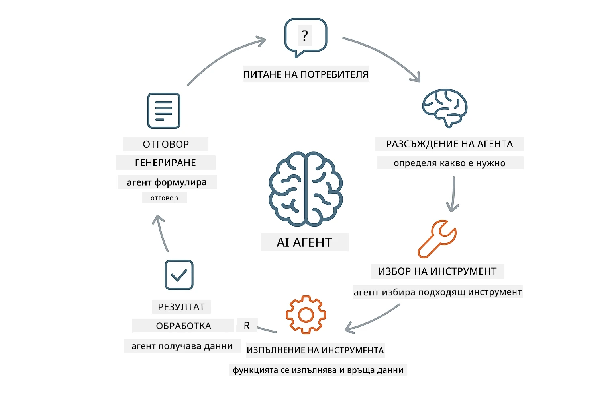
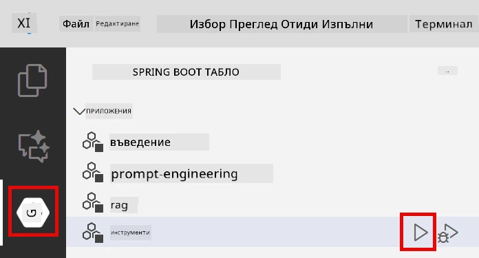

# Модул 04: AI Агенти с Инструменти

## Съдържание

- [Какво ще научите](../../../04-tools)
- [Предварителни изисквания](../../../04-tools)
- [Разбиране на AI агенти с инструменти](../../../04-tools)
- [Как работи извикването на инструменти](../../../04-tools)
  - [Дефиниции на инструменти](../../../04-tools)
  - [Вземане на решения](../../../04-tools)
  - [Изпълнение](../../../04-tools)
  - [Генериране на отговор](../../../04-tools)
- [Свързване на инструменти](../../../04-tools)
- [Стартиране на приложението](../../../04-tools)
- [Използване на приложението](../../../04-tools)
  - [Опитайте просто използване на инструмент](../../../04-tools)
  - [Тествайте свързване на инструменти](../../../04-tools)
  - [Вижте потока на разговор](../../../04-tools)
  - [Експериментирайте с различни заявки](../../../04-tools)
- [Ключови концепции](../../../04-tools)
  - [Патерн ReAct (Разсъждаване и действие)](../../../04-tools)
  - [Описанията на инструментите имат значение](../../../04-tools)
  - [Управление на сесии](../../../04-tools)
  - [Обработка на грешки](../../../04-tools)
- [Налични инструменти](../../../04-tools)
- [Кога да използвате агенти, базирани на инструменти](../../../04-tools)
- [Следващи стъпки](../../../04-tools)

## Какво ще научите

Досега научихте как да водите разговори с AI, как да структурирате ефективно подсказки и как да обвързвате отговорите с вашите документи. Но има една фундаментална ограниченост: езиковите модели могат само да генерират текст. Те не могат да проверяват времето, да извършват изчисления, да правят заявки към бази данни или да взаимодействат с външни системи.

Инструментите променят това. Като дадете на модела достъп до функции, които може да извиква, вие го трансформирате от генератор на текст в агент, който може да предприема действия. Моделът решава кога му трябва инструмент, кой инструмент да използва и какви параметри да подаде. Вашият код изпълнява функцията и връща резултата. Моделът включва този резултат в своя отговор.

## Предварителни изисквания

- Изпълнен Модул 01 (разположени Azure OpenAI ресурси)
- `.env` файл в коренната директория с Azure идентификационни данни (създаден от `azd up` в Модул 01)

> **Бележка:** Ако не сте завършили Модул 01, първо следвайте инструкциите за разполагане там.

## Разбиране на AI агенти с инструменти

> **📝 Бележка:** Терминът "агенти" в този модул се отнася до AI асистенти, подобрени с възможности за извикване на инструменти. Това е различно от патерните **Agentic AI** (автономни агенти с планиране, памет и многостъпкови размисли), които ще разгледаме в [Модул 05: MCP](../05-mcp/README.md).

AI агент с инструменти следва патерн на разсъждаване и действие (ReAct):

1. Потребителят задава въпрос  
2. Агентът размишлява какво трябва да знае  
3. Агентът решава дали му трябва инструмент за отговора  
4. Ако да, агентът извиква съответния инструмент с правилните параметри  
5. Инструментът се изпълнява и връща данни  
6. Агентът включва резултата и дава окончателния отговор  



*Патернът ReAct – как AI агентите редуват разсъждаване и действия за решаване на проблеми*

Това се случва автоматично. Вие дефинирате инструментите и техните описания. Моделът обработва вземането на решения кога и как да ги използва.

## Как работи извикването на инструменти

### Дефиниции на инструменти

[WeatherTool.java](../../../04-tools/src/main/java/com/example/langchain4j/agents/tools/WeatherTool.java) | [TemperatureTool.java](../../../04-tools/src/main/java/com/example/langchain4j/agents/tools/TemperatureTool.java)

Вие дефинирате функции с ясни описания и спецификации на параметрите. Моделът вижда тези описания в системната си подсказка и разбира за какво служи всеки инструмент.

```java
@Component
public class WeatherTool {
    
    @Tool("Get the current weather for a location")
    public String getCurrentWeather(@P("Location name") String location) {
        // Вашата логика за търсене на времето
        return "Weather in " + location + ": 22°C, cloudy";
    }
}

@AiService
public interface Assistant {
    String chat(@MemoryId String sessionId, @UserMessage String message);
}

// Асистентът е автоматично свързан от Spring Boot с:
// - ChatModel bean
// - Всички @Tool методи от @Component класове
// - ChatMemoryProvider за управление на сесията
```

> **🤖 Опитайте с [GitHub Copilot](https://github.com/features/copilot) Chat:** Отворете [`WeatherTool.java`](../../../04-tools/src/main/java/com/example/langchain4j/agents/tools/WeatherTool.java) и попитайте:
> - "Как бих интегрирал реален API за времето като OpenWeatherMap вместо фиктивни данни?"
> - "Какво прави едно описание на инструмент добро, така че AI да го използва правилно?"
> - "Как да се справя с грешки в API и ограничения за брой заявки в имплементациите на инструментите?"

### Вземане на решения

Когато потребителят попита "Какво е времето в Сиатъл?", моделът разбира, че му трябва инструментът за времето. Той генерира извикване на функция с параметъра локация зададен на "Сиатъл".

### Изпълнение

[AgentService.java](../../../04-tools/src/main/java/com/example/langchain4j/agents/service/AgentService.java)

Spring Boot автоматично свързва декларативния интерфейс `@AiService` с всички регистрирани инструменти, а LangChain4j изпълнява извикванията на инструментите автоматично.

> **🤖 Опитайте с [GitHub Copilot](https://github.com/features/copilot) Chat:** Отворете [`AgentService.java`](../../../04-tools/src/main/java/com/example/langchain4j/agents/service/AgentService.java) и попитайте:
> - "Как работи патернът ReAct и защо е ефективен за AI агенти?"
> - "Как агентът решава кой инструмент да използва и в какъв ред?"
> - "Какво става, ако изпълнението на инструмент се провали – как трябва да обработвам грешките надеждно?"

### Генериране на отговор

Моделът получава данните за времето и ги форматира в естествен език за потребителя.

### Защо да използваме декларативни AI услуги?

Този модул използва интеграцията на LangChain4j със Spring Boot и декларативни интерфейси `@AiService`:

- **Автоматично свързване на Spring Boot** – ChatModel и инструментите се инжектират автоматично  
- **Патерн @MemoryId** – Автоматично управление на памет за сесии  
- **Единствена инстанция** – Асистентът се създава веднъж и се използва отново за по-добра производителност  
- **Типо-безопасно изпълнение** – Java методи се извикват директно с преобразуване на типове  
- **Оркестрация на множество стъпки** – Автоматично управлява свързване на инструменти  
- **Никакъв излишен код** – Без ръчни повиквания на AiServices.builder() или HashMap за памет  

Алтернативни подходи (ръчно използване на `AiServices.builder()`) изискват повече код и пропускат предимствата на интеграцията със Spring Boot.

## Свързване на инструменти

**Свързване на инструменти** – AI може да извика няколко инструмента последователно. Попитайте "Какво е времето в Сиатъл и трябва ли да нося чадър?" и наблюдавайте как свързва `getCurrentWeather` с разсъждения за дъждовно облекло.

<a href="images/tool-chaining.png"></a>

*Последователни извиквания на инструменти – изходът от един инструмент се подава към следващото решение*

**Гладки грешки** – Попитайте за времето в град, който не е в тестовите данни. Инструментът връща съобщение за грешка, а AI обяснява, че не може да помогне. Инструментите се провалят безопасно.

Това става в един и същ цикъл на разговора. Агентът самостоятелно управлява множество извиквания на инструменти.

## Стартиране на приложението

**Потвърдете разполагането:**

Уверете се, че файлът `.env` съществува в коренната директория с Azure идентификационни данни (създаден по време на Модул 01):
```bash
cat ../.env  # Трябва да покаже AZURE_OPENAI_ENDPOINT, API_KEY, DEPLOYMENT
```

**Стартирайте приложението:**

> **Бележка:** Ако вече сте стартирали всички приложения с `./start-all.sh` от Модул 01, този модул вече работи на порт 8084. Можете да пропуснете командите за стартиране по-долу и директно да отидете на http://localhost:8084.

**Опция 1: Използване на Spring Boot Dashboard (Препоръчително за потребители на VS Code)**

Дев контейнера включва разширението Spring Boot Dashboard, което предоставя визуален интерфейс за управление на всички Spring Boot приложения. Можете да го намерите в Activity Bar вляво във VS Code (потърсете иконата на Spring Boot).

От Spring Boot Dashboard можете да:  
- Виждате всички налични Spring Boot приложения в работното пространство  
- Стартирате/спирате приложения с един клик  
- Преглеждате журналите на приложения в реално време  
- Следите състоянието на приложенията  

Просто натиснете бутона за стартиране до "tools", за да стартирате този модул, или стартирайте всички модули наведнъж.



**Опция 2: Използване на shell скриптове**

Стартирайте всички уеб приложения (модули 01-04):

**Bash:**  
```bash
cd ..  # От главната директория
./start-all.sh
```
  
**PowerShell:**  
```powershell
cd ..  # От главната директория
.\start-all.ps1
```
  
Или стартирайте само този модул:

**Bash:**  
```bash
cd 04-tools
./start.sh
```
  
**PowerShell:**  
```powershell
cd 04-tools
.\start.ps1
```
  
И двата скрипта автоматично зареждат променливите на средата от коренния `.env` файл и ще компилират JAR файловете ако не съществуват.

> **Бележка:** Ако предпочитате да компилирате всички модули ръчно преди стартирането:  
>  
> **Bash:**  
> ```bash
> cd ..  # Go to root directory
> mvn clean package -DskipTests
> ```
>  
> **PowerShell:**  
> ```powershell
> cd ..  # Go to root directory
> mvn clean package -DskipTests
> ```
  
Отворете http://localhost:8084 в браузъра си.

**За спиране:**

**Bash:**  
```bash
./stop.sh  # Само този модул
# Или
cd .. && ./stop-all.sh  # Всички модули
```
  
**PowerShell:**  
```powershell
.\stop.ps1  # Само този модул
# Или
cd ..; .\stop-all.ps1  # Всички модули
```
  
## Използване на приложението

Приложението предоставя уеб интерфейс, чрез който можете да взаимодействате с AI агент, който има достъп до инструменти за времето и температурни преобразувания.

<a href="images/tools-homepage.png"></a>

*Интерфейс за AI агент с инструменти – бързи примери и чат интерфейс за взаимодействие с инструменти*

### Опитайте просто използване на инструмент

Започнете с проста заявка: "Преобразувай 100 градуса по Фаренхайт в Целзий". Агентът разпознава, че му трябва инструментът за температурно преобразуване, извиква го с правилните параметри и връща резултата. Забележете колко естествено изглежда това – вие не указахте кой инструмент да се използва или как да се извика.

### Тествайте свързване на инструменти

Сега опитайте нещо по-сложно: "Какво е времето в Сиатъл и го преобразувай във Фаренхайт?" Наблюдавайте как агентът работи стъпка по стъпка. Първо взема времето (в Целзий), разбира, че трябва да го преобразува във Фаренхайт, извиква инструмента за преобразуване и комбинира двата резултата в един отговор.

### Вижте потока на разговор

Чат интерфейсът запазва историята на разговора, позволявайки ви да водите многостъпкови взаимодействия. Можете да видите всички предишни въпроси и отговори, което улеснява проследяването на разговора и разбирането как агентът изгражда контекст през множество обмена.

<a href="images/tools-conversation-demo.png"></a>

*Многостъпков разговор, показващ прости преобразувания, справки за времето и свързване на инструменти*

### Експериментирайте с различни заявки

Опитайте различни комбинации:  
- Запитвания за времето: "Какво е времето в Токио?"  
- Температурни преобразувания: "Колко са 25°C в Келвин?"  
- Комбинирани заявки: "Провери времето в Париж и ми кажи дали е над 20°C"  

Обърнете внимание как агентът интерпретира естествения език и го свързва с подходящи извиквания на инструменти.

## Ключови концепции

### Патерн ReAct (Разсъждаване и действие)

Агентът редува разсъждаване (решава какво да направи) и действие (използва инструменти). Този патерн позволява автономно решаване на проблеми, вместо просто да отговаря на инструкции.

### Описанията на инструментите имат значение

Качеството на описанията на вашите инструменти пряко влияе на това колко добре агентът ги използва. Ясните и конкретни описания помагат на модела да разбере кога и как да извика всеки инструмент.

### Управление на сесии

Анотацията `@MemoryId` позволява автоматично управление на памет за сесии. Всеки ID на сесия получава собствена инстанция `ChatMemory`, управлявана от бина `ChatMemoryProvider`, като отпада нуждата от ръчно проследяване на паметта.

### Обработка на грешки

Инструментите могат да се провалят – API-та изтичат във времето, параметрите може да са невалидни, външни услуги могат да спрат. Продуктовите агенти се нуждаят от обработка на грешки, за да може моделът да обясни проблемите или да опита алтернативи.

## Налични инструменти

**Инструменти за времето** (фиктивни данни за демонстрация):  
- Вземане на текущото време за дадена локация  
- Вземане на прогноза за няколко дни  

**Инструменти за температурни преобразувания**:  
- Целзий към Фаренхайт  
- Фаренхайт към Целзий  
- Целзий към Келвин  
- Келвин към Целзий  
- Фаренхайт към Келвин  
- Келвин към Фаренхайт  

Това са прости примери, но патернът може да се разшири за всяка функция: заявки към бази данни, API повиквания, изчисления, файлови операции или системни команди.

## Кога да използвате агенти, базирани на инструменти

**Използвайте инструменти, когато:**  
- Отговорът изисква данни в реално време (време, борсови цени, наличности)  
- Трябва да правите изчисления извън простата математика  
- Достъпвате бази данни или API-та  
- Извършвате действия (изпращане на имейли, създаване на билети, обновяване на записи)  
- Комбинирате множество източници на данни  

**Не използвайте инструменти, когато:**  
- Въпросите могат да се отговорят от общи знания  
- Отговорът е изцяло разговорен  
- Закъснението при използване на инструмента би направило преживяването твърде бавно  

## Следващи стъпки

**Следващ модул:** [05-mcp - Протокол за контекст на модела (MCP)](../05-mcp/README.md)

---

**Навигация:** [← Предишен: Модул 03 - RAG](../03-rag/README.md) | [Обратно към Основното](../README.md) | [Следващ: Модул 05 - MCP →](../05-mcp/README.md)

---

<!-- CO-OP TRANSLATOR DISCLAIMER START -->
**Отказ от отговорност**:
Този документ е преведен с помощта на AI преводаческа услуга [Co-op Translator](https://github.com/Azure/co-op-translator). Въпреки че се стремим към точност, моля, имайте предвид, че автоматизираните преводи може да съдържат грешки или неточности. Оригиналният документ на неговия изначален език трябва да се счита за отправна и авторитетна версия. За критична информация се препоръчва професионален човешки превод. Не носим отговорност за каквито и да е недоразумения или неправилни тълкувания, произтичащи от използването на този превод.
<!-- CO-OP TRANSLATOR DISCLAIMER END -->