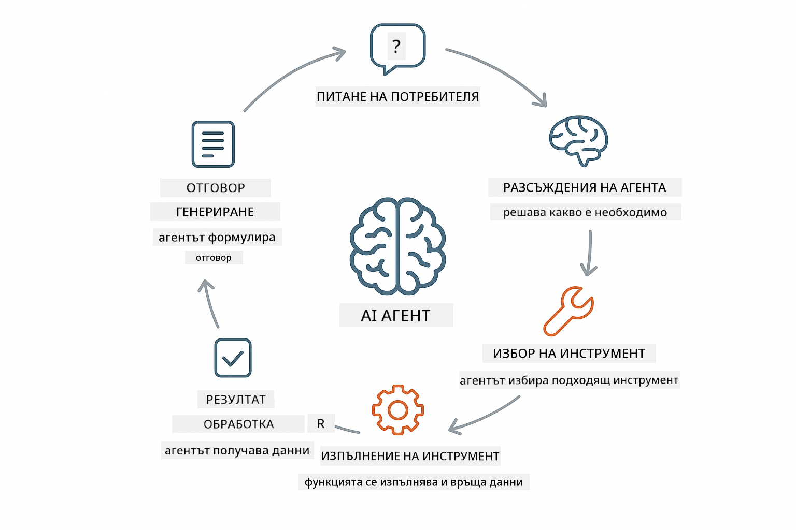
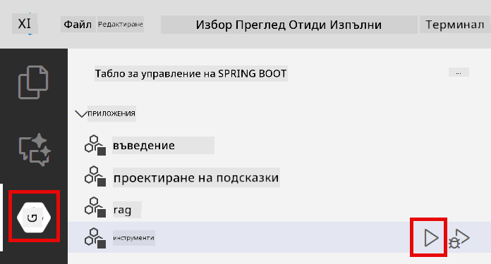

<!--
CO_OP_TRANSLATOR_METADATA:
{
  "original_hash": "13ec450c12cdd1a863baa2b778f27cd7",
  "translation_date": "2025-12-31T05:06:17+00:00",
  "source_file": "04-tools/README.md",
  "language_code": "bg"
}
-->
# Модул 04: AI агенти с инструменти

## Съдържание

- [Какво ще научите](../../../04-tools)
- [Предпоставки](../../../04-tools)
- [Разбиране на AI агенти с инструменти](../../../04-tools)
- [Как работи извикването на инструменти](../../../04-tools)
  - [Дефиниции на инструменти](../../../04-tools)
  - [Вземане на решения](../../../04-tools)
  - [Изпълнение](../../../04-tools)
  - [Генериране на отговор](../../../04-tools)
- [Свързване на инструменти](../../../04-tools)
- [Стартиране на приложението](../../../04-tools)
- [Използване на приложението](../../../04-tools)
  - [Изпробвайте просто използване на инструмент](../../../04-tools)
  - [Тествайте свързване на инструменти](../../../04-tools)
  - [Вижте потокът на разговора](../../../04-tools)
  - [Наблюдавайте разсъжденията](../../../04-tools)
  - [Експериментирайте с различни заявки](../../../04-tools)
- [Ключови концепции](../../../04-tools)
  - [ReAct модел (Разсъждения и Действие)](../../../04-tools)
  - [Описанията на инструментите са важни](../../../04-tools)
  - [Управление на сесии](../../../04-tools)
  - [Обработка на грешки](../../../04-tools)
- [Налични инструменти](../../../04-tools)
- [Кога да използвате агенти, базирани на инструменти](../../../04-tools)
- [Следващи стъпки](../../../04-tools)

## Какво ще научите

Досега научихте как да водите разговори с AI, да структурирате подсказки ефективно и да обосновавате отговорите си в документите. Но все още има основно ограничение: езиковите модели могат само да генерират текст. Те не могат да проверяват времето, да правят изчисления, да заявяват бази данни или да взаимодействат с външни системи.

Инструментите променят това. Като дадете на модела достъп до функции, които може да извиква, вие го превръщате от генератор на текст в агент, който може да предприема действия. Моделът решава кога му е нужен инструмент, кой инструмент да използва и какви параметри да предаде. Вашият код изпълнява функцията и връща резултата. Моделът включва този резултат в своя отговор.

## Предпоставки

- Приключен Модул 01 (ресурсите Azure OpenAI са развернати)
- Файл `.env` в главната директория с Azure креденшъли (създаден от `azd up` в Модул 01)

> **Забележка:** Ако не сте завършили Модул 01, първо следвайте инструкциите за деплой в него.

## Разбиране на AI агенти с инструменти

> **📝 Забележка:** Терминът "агенти" в този модул се отнася до AI асистенти, разширени с възможности за извикване на инструменти. Това е различно от моделите за **Agentic AI** (автономни агенти с планиране, памет и многоетапни разсъждения), които ще разгледаме в [Module 05: MCP](../05-mcp/README.md).

AI агент с инструменти следва модел на разсъждение и действие (ReAct):

1. Потребителят задава въпрос
2. Агентът разсъждава какво трябва да знае
3. Агентът решава дали му е нужен инструмент, за да отговори
4. Ако да, агентът извиква подходящия инструмент с точните параметри
5. Инструментът изпълнява и връща данни
6. Агентът включва резултата и предоставя окончателния отговор



*ReAct моделът - как AI агентите редуват разсъждение и действие, за да решават проблеми*

Това се случва автоматично. Вие дефинирате инструментите и техните описания. Моделът се грижи за вземането на решения кога и как да ги използва.

## Как работи извикването на инструменти

**Дефиниции на инструменти** - [WeatherTool.java](../../../04-tools/src/main/java/com/example/langchain4j/agents/tools/WeatherTool.java) | [TemperatureTool.java](../../../04-tools/src/main/java/com/example/langchain4j/agents/tools/TemperatureTool.java)

Вие дефинирате функции с ясни описания и спецификации на параметрите. Моделът вижда тези описания в своя системен подсказ и разбира какво прави всеки инструмент.

```java
@Component
public class WeatherTool {
    
    @Tool("Get the current weather for a location")
    public String getCurrentWeather(@P("Location name") String location) {
        // Вашата логика за търсене на времето
        return "Weather in " + location + ": 22°C, cloudy";
    }
}

@AiService
public interface Assistant {
    String chat(@MemoryId String sessionId, @UserMessage String message);
}

// Асистентът е автоматично свързан от Spring Boot със:
// - ChatModel bean
// - Всички @Tool методи от @Component класове
// - ChatMemoryProvider за управление на сесиите
```

> **🤖 Опитайте с [GitHub Copilot](https://github.com/features/copilot) чат:** Отворете [`WeatherTool.java`](../../../04-tools/src/main/java/com/example/langchain4j/agents/tools/WeatherTool.java) и попитайте:
> - "Как бих интегрирал реално weather API като OpenWeatherMap вместо мок данни?"
> - "Какво прави едно добро описание на инструмент, което помага на AI да го използва правилно?"
> - "Как да обработвам грешки от API и ограничения на rate limit в имплементации на инструменти?"

**Вземане на решения**

Когато потребителят попита "Какво е времето в Seattle?", моделът разпознава, че му е нужен weather инструмент. Той генерира извикване на функция с параметъра location зададен на "Seattle".

**Изпълнение** - [AgentService.java](../../../04-tools/src/main/java/com/example/langchain4j/agents/service/AgentService.java)

Spring Boot автоматично вкарва декларативния интерфейс `@AiService` с всички регистрирани инструменти, и LangChain4j изпълнява извикванията на инструменти автоматично.

> **🤖 Опитайте с [GitHub Copilot](https://github.com/features/copilot) чат:** Отворете [`AgentService.java`](../../../04-tools/src/main/java/com/example/langchain4j/agents/service/AgentService.java) и попитайте:
> - "Как работи ReAct моделът и защо е ефективен за AI агенти?"
> - "Как агентът решава кой инструмент да използва и в какъв ред?"
> - "Какво става ако изпълнението на инструмент се провали - как трябва да обработвам грешки надеждно?"

**Генериране на отговор**

Моделът получава данните за времето и ги форматира в естествен език като отговор за потребителя.

### Защо да използвате декларативни AI услуги?

Този модул използва интеграцията на LangChain4j със Spring Boot чрез декларативни интерфейси `@AiService`:

- **Spring Boot auto-wiring** - ChatModel и инструментите се инжектират автоматично
- **@MemoryId шаблон** - Автоматично управление на паметта базирана на сесии
- **Един екземпляр** - Асистентът се създава веднъж и се преизползва за по-добра производителност
- **Изпълнение със сигурност на типове** - Java методи се извикват директно с преобразуване на типове
- **Оркестрация в множество завъртания** - Обработва свързване на инструменти автоматично
- **Нулев boilerplate** - Няма ръчни извиквания на AiServices.builder() или HashMap за памет

Алтернативните подходи (ръчно `AiServices.builder()`) изискват повече код и пропускат предимствата на интеграцията със Spring Boot.

## Свързване на инструменти

**Свързване на инструменти** - AI може да извика няколко инструмента последователно. Попитайте "Какво е времето в Seattle и да нося ли чадър?" и наблюдавайте как верижно извиква `getCurrentWeather` с разсъждения за дъждовно облекло.

<a href="images/tool-chaining.png"></a>

*Последователни извиквания на инструменти - изходът на един инструмент се подава към следващото решение*

**Грациозни провали** - Попитайте за времето в град, който не е в мок данните. Инструментът връща съобщение за грешка и AI обяснява, че не може да помогне. Инструментите се провалят безопасно.

Това се случва в един разговорен ход. Агентът оркестрира множество извиквания на инструменти автономно.

## Стартиране на приложението

**Проверете деплоймента:**

Уверете се, че файлът `.env` съществува в главната директория с Azure креденшъли (създаден по време на Модул 01):
```bash
cat ../.env  # Трябва да показва AZURE_OPENAI_ENDPOINT, API_KEY, DEPLOYMENT
```

**Стартирайте приложението:**

> **Забележка:** Ако вече сте стартирали всички приложения с `./start-all.sh` от Модул 01, този модул вече работи на порт 8084. Можете да пропуснете командите за стартиране по-долу и да отидете директно на http://localhost:8084.

**Опция 1: Използване на Spring Boot Dashboard (Препоръчително за VS Code потребители)**

Dev контейнерът включва разширението Spring Boot Dashboard, което предоставя визуален интерфейс за управление на всички Spring Boot приложения. Можете да го намерите в Activity Bar в лявата страна на VS Code (потърсете иконата на Spring Boot).

От Spring Boot Dashboard можете да:
- Видите всички налични Spring Boot приложения в работното пространство
- Стартирате/спирате приложения с един клик
- Преглеждате логовете на приложението в реално време
- Наблюдавате статуса на приложението

Просто кликнете бутона за пускане до "tools", за да стартирате този модул, или стартирайте всички модули едновременно.



**Опция 2: Използване на shell скриптове**

Стартирайте всички уеб приложения (модулите 01-04):

**Bash:**
```bash
cd ..  # От коренната директория
./start-all.sh
```

**PowerShell:**
```powershell
cd ..  # От кореновата директория
.\start-all.ps1
```

Или стартирайте само този модул:

**Bash:**
```bash
cd 04-tools
./start.sh
```

**PowerShell:**
```powershell
cd 04-tools
.\start.ps1
```

И двата скрипта автоматично зареждат променливите на средата от коренния файл `.env` и ще компилират JAR-овете, ако не съществуват.

> **Забележка:** Ако предпочитате да изградите всички модули ръчно преди стартиране:
>
> **Bash:**
> ```bash
> cd ..  # Go to root directory
> mvn clean package -DskipTests
> ```
>
> **PowerShell:**
> ```powershell
> cd ..  # Go to root directory
> mvn clean package -DskipTests
> ```

Отворете http://localhost:8084 в браузъра си.

**За спиране:**

**Bash:**
```bash
./stop.sh  # Само този модул
# Или
cd .. && ./stop-all.sh  # Всички модули
```

**PowerShell:**
```powershell
.\stop.ps1  # Само този модул
# Или
cd ..; .\stop-all.ps1  # Всички модули
```

## Използване на приложението

Приложението предоставя уеб интерфейс, където можете да взаимодействате с AI агент, който има достъп до инструменти за времето и конвертиране на температура.

<a href="images/tools-homepage.png"></a>

*Интерфейсът AI Agent Tools - бързи примери и чат интерфейс за взаимодействие с инструменти*

**Изпробвайте просто използване на инструмент**

Започнете с директна заявка: "Convert 100 degrees Fahrenheit to Celsius". Агентът разпознава, че му е нужен инструмент за преобразуване на температура, извиква го с правилните параметри и връща резултата. Обърнете внимание колко естествено изглежда това - вие не указахте кой инструмент да се използва или как да бъде извикан.

**Тествайте свързване на инструменти**

Сега опитайте нещо по-сложно: "What's the weather in Seattle and convert it to Fahrenheit?" Наблюдавайте как агентът преминава през стъпките. Първо получава времето (което връща в Целзий), разпознава, че трябва да конвертира във Фаренхайт, извиква инструмента за конверсия и комбинира двата резултата в един отговор.

**Вижте потокът на разговора**

Чат интерфейсът запазва историята на разговора, което ви позволява да имате многократни взаимодействия. Можете да видите всички предишни заявки и отговори, което прави лесно проследяването на разговора и разбирането как агентът изгражда контекст през няколко обмена.

<a href="images/tools-conversation-demo.png"></a>

*Многоходов разговор показва прости конверсии, търсения на времето и свързване на инструменти*

**Експериментирайте с различни заявки**

Опитайте различни комбинации:
- Търсения за времето: "What's the weather in Tokyo?"
- Конверсии на температура: "What is 25°C in Kelvin?"
- Комбинирани заявки: "Check the weather in Paris and tell me if it's above 20°C"

Обърнете внимание как агентът интерпретира естествения език и го свързва към подходящи извиквания на инструменти.

## Ключови концепции

**ReAct модел (Разсъждения и Действие)**

Агентът редува разсъждение (решава какво да направи) и действие (използване на инструменти). Този модел позволява автономно решаване на проблеми, а не просто изпълнение на инструкции.

**Описанията на инструментите са важни**

Качеството на описанията на инструментите директно влияе върху това колко добре агентът ги използва. Ясните, специфични описания помагат на модела да разбере кога и как да извика всеки инструмент.

**Управление на сесии**

Анотацията `@MemoryId` позволява автоматично управление на паметта на база сесии. Всеки session ID получава своя `ChatMemory` инстанция, управлявана от `ChatMemoryProvider` bean, което премахва нуждата от ръчно проследяване на паметта.

**Обработка на грешки**

Инструментите могат да се провалят - API-та могат да таймаутват, параметрите да са невалидни, външни услуги да спрат. Производствените агенти се нуждаят от обработка на грешки, така че моделът да може да обясни проблемите или да опита алтернативи.

## Налични инструменти

**Инструменти за времето** (мок данни за демонстрация):
- Вземане на текущото време за локация
- Вземане на прогноза за няколко дни

**Инструменти за конвертиране на температура**:
- Целзий в Фаренхайт
- Фаренхайт в Целзий
- Целзий в Келвин
- Келвин в Целзий
- Фаренхайт в Келвин
- Келвин в Фаренхайт

Това са прости примери, но моделът се разширява до всяка функция: заявки към бази данни, API извиквания, изчисления, файлови операции или системни команди.

## Кога да използвате агенти, базирани на инструменти

**Използвайте инструменти когато:**
- Отговорът изисква данни в реално време (време, цени на акции, наличности)
- Трябва да извършите изчисления извън простата аритметика
- Достъп до бази данни или API-та
- Предприемане на действия (изпращане на имейли, създаване на тикети, актуализиране на записи)
- Комбиниране на множество източници на данни

**Не използвайте инструменти когато:**
- Въпросите могат да бъдат отговорени от общи знания
- Отговорът е чисто разговорен
- Латентността на инструмента прави преживяването прекалено бавно

## Следващи стъпки

**Следващ модул:** [05-mcp - Model Context Protocol (MCP)](../05-mcp/README.md)

---

**Навигация:** [← Предишен: Module 03 - RAG](../03-rag/README.md) | [Обратно към Главната](../README.md) | [Напред: Module 05 - MCP →](../05-mcp/README.md)

---

<!-- CO-OP TRANSLATOR DISCLAIMER START -->
**Отказ от отговорност**:
Този документ е преведен с помощта на услуга за превод с изкуствен интелект [Co-op Translator](https://github.com/Azure/co-op-translator). Въпреки че се стремим към точност, имайте предвид, че автоматизираните преводи могат да съдържат грешки или неточности. Оригиналният документ на първичния език трябва да се счита за авторитетен източник. За критична информация се препоръчва професионален човешки превод. Не носим отговорност за каквито и да е недоразумения или погрешни тълкувания, произтичащи от използването на този превод.
<!-- CO-OP TRANSLATOR DISCLAIMER END -->