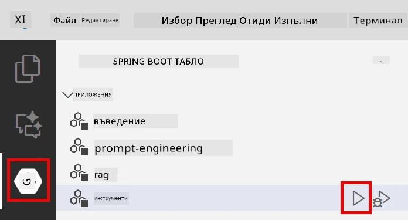
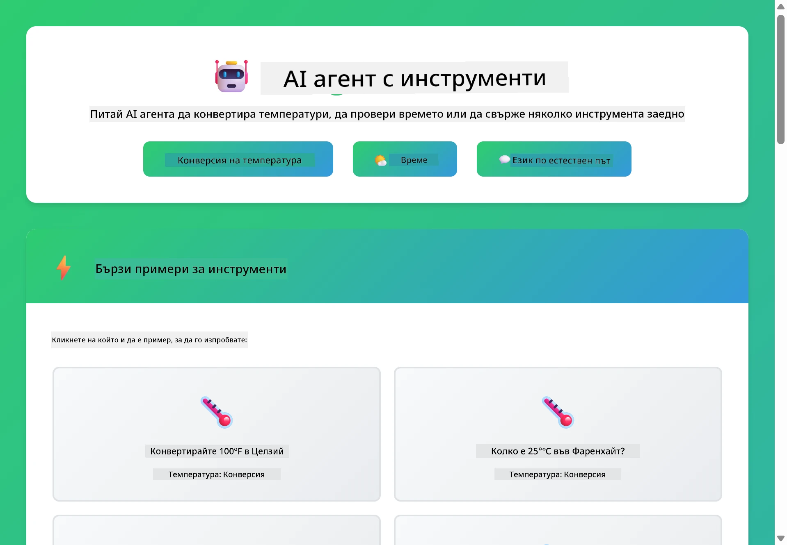
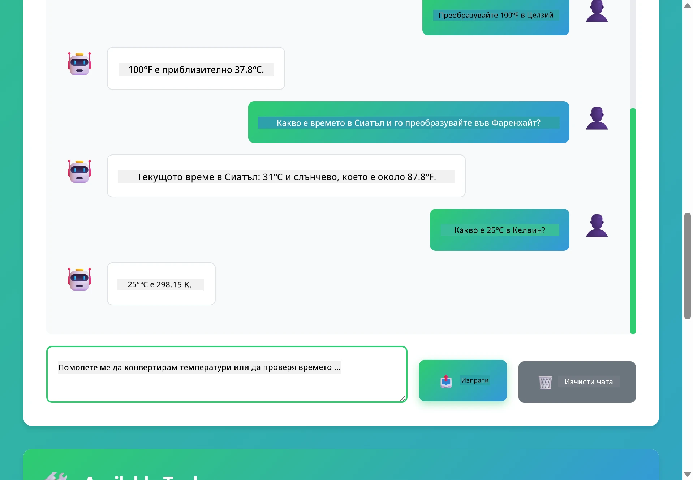

# Модул 04: AI агенти с инструменти

## Съдържание

- [Видео урок](#видео-урок)
- [Какво ще научите](#какво-ще-научите)
- [Предварителни изисквания](#предварителни-изисквания)
- [Разбиране на AI агенти с инструменти](#разбиране-на-ai-агенти-с-инструменти)
- [Как работи извикването на инструменти](#как-работи-извикването-на-инструменти)
  - [Дефиниции на инструменти](#дефиниции-на-инструменти)
  - [Вземане на решения](#вземане-на-решения)
  - [Изпълнение](#изпълнение)
  - [Генериране на отговор](#генериране-на-отговор)
  - [Архитектура: Spring Boot автосвързване](#архитектура-spring-boot-автосвързване)
- [Свързване на инструменти](#свързване-на-инструменти)
- [Стартиране на приложението](#стартиране-на-приложението)
- [Използване на приложението](#използване-на-приложението)
  - [Опитайте просто използване на инструмент](#изпробвайте-просто-използване-на-инструменти)
  - [Тествайте свързване на инструменти](#тествайте-веригата-от-инструменти)
  - [Вижте потока на разговора](#вижте-хода-на-разговора)
  - [Експериментирайте с различни заявки](#експериментирайте-с-различни-заявки)
- [Ключови концепции](#основни-понятия)
  - [ReAct модел (Разсъждаване и действие)](#react-модел-разсъждение-и-действие)
  - [Значение на описанията на инструментите](#описанията-на-инструментите-са-важни)
  - [Управление на сесии](#управление-на-сесии)
  - [Обработка на грешки](#обработка-на-грешки)
- [Налични инструменти](#налични-инструменти)
- [Кога да използваме агенти с инструменти](#кога-да-използваме-агенти-с-инструменти)
- [Инструменти срещу RAG](#инструменти-срещу-rag)
- [Следващи стъпки](#следващи-стъпки)

## Видео урок

Гледайте тази жива сесия, която обяснява как да започнете с този модул:

<a href="https://www.youtube.com/watch?v=O_J30kZc0rw"></a>

## Какво ще научите

До момента научихте как да водите разговори с AI, как да структурирате подканите ефективно и как да обвързвате отговорите с вашите документи. Но все още има основно ограничение: езиковите модели могат само да генерират текст. Те не могат да проверяват времето, да извършват изчисления, да правят заявки към бази данни или да взаимодействат с външни системи.

Инструментите променят това. Като дадете на модела достъп до функции, които може да извиква, го превръщате от генератор на текст в агент, който може да предприема действия. Моделът решава кога му трябва инструмент, кой инструмент да използва и какви параметри да подаде. Вашият код изпълнява функцията и връща резултата. Моделът включва този резултат в своя отговор.

## Предварителни изисквания

- Изпълнен [Модул 01 - Въведение](../01-introduction/README.md) (разположени Azure OpenAI ресурси)
- Препоръчително да сте преминали предишните модули (този модул препраща към [RAG концепции от Модул 03](../03-rag/README.md) в сравнение с Инструменти срещу RAG)
- Файл `.env` в коренната директория с Azure идентификационни данни (създаден чрез `azd up` в Модул 01)

> **Забележка:** Ако не сте изпълнили Модул 01, първо следвайте инструкциите за разполагане там.

## Разбиране на AI агенти с инструменти

> **📝 Забележка:** Терминът „агенти“ в този модул се отнася до AI асистенти, подобрени с възможности за извикване на инструменти. Това е различно от **Agentic AI** патерните (автономни агенти с планиране, памет и многократно разсъждение), които ще разгледаме в [Модул 05: MCP](../05-mcp/README.md).

Без инструменти езиков модел може само да генерира текст от обучаващите данни. Попитайте го за текущото време и ще трябва да гадае. Дайте му инструменти и той може да извика API за времето, да извърши изчисления или да направи заявка към база данни — след което да вплете тези реални резултати в отговора си.


*Без инструменти моделът само гадае — с инструменти може да извиква API-та, да извършва изчисления и връща данни в реално време.*

AI агент с инструменти следва модел **Разсъждаване и действие (ReAct)**. Моделът не просто отговаря — той мисли какво му трябва, действа чрез извикване на инструмент, наблюдава резултата и решава дали да действа отново или да предостави крайния отговор:

1. **Разсъждава** — агентът анализира въпроса на потребителя и определя каква информация му трябва
2. **Действа** — агентът избира правилния инструмент, генерира правилните параметри и го извиква
3. **Наблюдава** — агентът получава изхода на инструмента и оценява резултата
4. **Повтаря или Отговаря** — ако са нужни още данни, агентът се връща обратно; иначе съставя отговор на естествен език


*Цикълът ReAct — агентът разсъждава какво да направи, действа чрез извикване на инструмент, наблюдава резултата и повтаря, докато може да предостави финалния отговор.*

Това се случва автоматично. Вие дефинирате инструментите и техните описания. Моделът управлява взимането на решения кога и как да ги използва.

## Как работи извикването на инструменти

### Дефиниции на инструменти

[WeatherTool.java](../../../04-tools/src/main/java/com/example/langchain4j/agents/tools/WeatherTool.java) | [TemperatureTool.java](../../../04-tools/src/main/java/com/example/langchain4j/agents/tools/TemperatureTool.java)

Вие дефинирате функции с ясни описания и спецификации на параметрите. Моделът вижда тези описания в своята системна подсказка и разбира какво прави всеки инструмент.

```java
@Component
public class WeatherTool {
    
    @Tool("Get the current weather for a location")
    public String getCurrentWeather(@P("Location name") String location) {
        // Вашата логика за търсене на времето
        return "Weather in " + location + ": 22°C, cloudy";
    }
}

@AiService
public interface Assistant {
    String chat(@MemoryId String sessionId, @UserMessage String message);
}

// Асистентът е автоматично свързан от Spring Boot с:
// - ChatModel bean
// - Всички @Tool методи от @Component класове
// - ChatMemoryProvider за управление на сесии
```
  
Диаграмата по-долу разглежда всяка анотация и показва как всяка част помага на AI да разбере кога да извика инструмента и какви аргументи да подаде:


*Анатомия на дефиниция на инструмент — @Tool казва на AI кога да го използва, @P описва всеки параметър, а @AiService свързва всичко заедно при стартиране.*

> **🤖 Опитайте с [GitHub Copilot](https://github.com/features/copilot) Chat:** Отворете [`WeatherTool.java`](../../../04-tools/src/main/java/com/example/langchain4j/agents/tools/WeatherTool.java) и попитайте:
> - "Как бих интегрирал реално API за времето като OpenWeatherMap вместо тестови данни?"
> - "Какво прави едно описание на инструмент добро и помага на AI да го използва правилно?"
> - "Как да управлявам грешки и ограничения на скоростта в реализацията на инструментите?"

### Вземане на решения

Когато потребителят пита „Какво е времето в Сиатъл?“, моделът не избира произволно инструмент. Той сравнява намерението на потребителя спрямо описанията на всички инструменти, които има достъп, оценява тяхната релевантност и избира най-подходящия. След това генерира структуриран извикване на функция с правилните параметри — в този случай задава `location` на `"Seattle"`.

Ако няма инструмент, който съвпада с желанията на потребителя, моделът отговаря с базирана на знанието си информация. Ако няколко инструмента съвпадат, избира най-специфичния.


*Моделът оценява всеки наличен инструмент спрямо намерението на потребителя и избира най-подходящия — затова е важно да пишете ясни и конкретни описания на инструментите.*

### Изпълнение

[AgentService.java](../../../04-tools/src/main/java/com/example/langchain4j/agents/service/AgentService.java)

Spring Boot автоматично свързва декларативния интерфейс `@AiService` с всички регистрирани инструменти, а LangChain4j автоматично изпълнява извикванията на инструменти. Зад кулисите, пълното извикване на инструмент преминава през шест етапа — от въпроса на потребителя на естествен език до отговора на естествен език:


*Цялостният процес — потребителят задава въпрос, моделът избира инструмент, LangChain4j го изпълнява и моделът вплита резултата в естествен отговор.*

Зад кулисите, `AiServices` изпълнява същия цикъл на извикване на инструменти за всеки инструмент — тук илюстрирано с прост `Calculator`. Диаграмата на последователността по-долу показва точно какво се случва под капака:


*Цикълът на извикване на инструмент — `AiServices` изпраща вашето съобщение и схеми на инструменти към LLM, LLM отговаря с извикване на функция като `add(42, 58)`, LangChain4j локално изпълнява метода `Calculator` и връща резултата за окончателния отговор.*

> **🤖 Опитайте с [GitHub Copilot](https://github.com/features/copilot) Chat:** Отворете [`AgentService.java`](../../../04-tools/src/main/java/com/example/langchain4j/agents/service/AgentService.java) и попитайте:
> - "Как работи моделът ReAct и защо е ефективен за AI агенти?"
> - "Как агентът решава кой инструмент да използва и в какъв ред?"
> - "Какво се случва, ако изпълнението на инструмент се провали - как да управлявам грешки надеждно?"

### Генериране на отговор

Моделът получава данните за времето и ги форматира в отговор на естествен език за потребителя.

### Архитектура: Spring Boot автосвързване

Този модул използва интеграцията на LangChain4j със Spring Boot и декларативни интерфейси `@AiService`. При стартиране Spring Boot открива всеки `@Component`, който съдържа методи с `@Tool`, вашия ChatModel bean и ChatMemoryProvider — след което ги свързва всички в един интерфейс Assistant без излишен шаблонен код.


*Интерфейсът @AiService свързва заедно ChatModel, компонентите на инструментите и доставчика на памет — Spring Boot управлява всичко за вас автоматично.*

Ето целия жизнен цикъл на заявката като диаграма на последователността — от HTTP заявката през контролера, услугата и авто-свързания прокси, чак до изпълнението на инструмента и връщане обратно:


*Пълният жизнен цикъл на заявката в Spring Boot — HTTP заявката преминава през контролер и услуга до авто-свързания Assistant прокси, който управлява LLM и извикванията на инструменти автоматично.*

Ключови предимства на този подход:

- **Spring Boot автосвързване** — ChatModel и инструментите се инжектират автоматично
- **Патерн @MemoryId** — Автоматично управление на паметта на базата на сесии
- **Единствен екземпляр** — Assistant се създава веднъж и се използва многократно за по-добра производителност
- **Изпълнение тип-безопасно** — Java методите се извикват директно с преобразуване на типове
- **Управление на множество стъпки** — Автоматично обслужва свързване на инструменти
- **Без излишен шаблонен код** — Няма нужда от ръчни `AiServices.builder()` извиквания или работа с паметен HashMap

Алтернативните подходи (ръчни `AiServices.builder()`) изискват повече код и не използват предимствата на Spring Boot интеграцията.

## Свързване на инструменти

**Свързване на инструменти** — Истинската сила на агентите с инструменти се проявява, когато един въпрос изисква използването на множество инструменти. Попитайте "Какво е времето в Сиатъл във Фаренхайт?" и агентът автоматично свързва два инструмента: първо извиква `getCurrentWeather`, за да получи температурата в Целзий, след това подава тази стойност на `celsiusToFahrenheit` за преобразуване — всичко в един разговорен ход.


*Свързване на инструменти в действие — агентът първо извиква getCurrentWeather, след това подава резултата в Целзий на celsiusToFahrenheit и връща комбиниран отговор.*

**Грациозни повреди** — Попитайте за времето в град, който не е в тестовите данни. Инструментът връща съобщение за грешка, а AI обяснява, че не може да помогне, вместо да се срине. Инструментите се провалят безопасно. Диаграмата по-долу противопоставя двата подхода — с правилна обработка на грешки агентът хваща изключението и отговаря полезно, а без нея цялото приложение спира да работи:


*Когато инструмент се провали, агентът хваща грешката и отговаря с полезно обяснение, вместо да се срине.*

Това се случва в един разговорен ход. Агентът управлява множество извиквания на инструменти автономно.

## Стартиране на приложението

**Проверете разполагането:**

Осигурете, че файл `.env` съществува в коренната директория с Azure идентификационни данни (създаден по време на Модул 01). Стартирайте това от директорията на модула (`04-tools/`):

**Bash:**
```bash
cat ../.env  # Трябва да показва AZURE_OPENAI_ENDPOINT, API_KEY, DEPLOYMENT
```
  
**PowerShell:**
```powershell
Get-Content ..\.env  # Трябва да показва AZURE_OPENAI_ENDPOINT, API_KEY, DEPLOYMENT
```
  
**Стартирайте приложението:**

> **Забележка:** Ако вече сте стартирали всички приложения чрез `./start-all.sh` от коренната директория (както е описано в Модул 01), този модул вече работи на порт 8084. Можете да прескочите командите за стартиране по-долу и да отидете директно на http://localhost:8084.

**Опция 1: Използване на Spring Boot Dashboard (Препоръчително за потребители на VS Code)**

Разработчическият контейнер включва разширение Spring Boot Dashboard, което предоставя визуален интерфейс за управление на всички Spring Boot приложения. Можете да го намерите в лентата с активности вляво на VS Code (потърсете иконата на Spring Boot).

От Spring Boot Dashboard можете:
- Да видите всички налични Spring Boot приложения в работната среда
- Да стартирате/спирате приложения с един клик
- Да преглеждате логове на приложенията в реално време
- Да наблюдавате състоянието на приложенията

Просто кликнете върху бутона за пускане до „tools“, за да стартирате този модул, или стартирайте всички модули наведнъж.

Ето как изглежда Spring Boot Dashboard в VS Code:


*Таблото за управление Spring Boot в VS Code — стартирайте, спирайте и наблюдавайте всички модули от едно място*

**Опция 2: Използване на shell скриптове**

Стартирайте всички уеб приложения (модули 01-04):

**Bash:**
```bash
cd ..  # От коренната директория
./start-all.sh
```

**PowerShell:**
```powershell
cd ..  # От главната директория
.\start-all.ps1
```

Или стартирайте само този модул:

**Bash:**
```bash
cd 04-tools
./start.sh
```

**PowerShell:**
```powershell
cd 04-tools
.\start.ps1
```

И двата скрипта автоматично зареждат променливите на средата от основния `.env` файл и ще компилират JAR файловете, ако те не съществуват.

> **Забележка:** Ако предпочитате да компилирате всички модули ръчно преди стартиране:
>
> **Bash:**
> ```bash
> cd ..  # Go to root directory
> mvn clean package -DskipTests
> ```
>
> **PowerShell:**
> ```powershell
> cd ..  # Go to root directory
> mvn clean package -DskipTests
> ```

Отворете http://localhost:8084 в браузъра си.

**За спиране:**

**Bash:**
```bash
./stop.sh  # Само този модул
# Или
cd .. && ./stop-all.sh  # Всички модули
```

**PowerShell:**
```powershell
.\stop.ps1  # Само този модул
# Или
cd ..; .\stop-all.ps1  # Всички модули
```

## Използване на приложението

Приложението предоставя уеб интерфейс, където можете да взаимодействате с AI агент, който има достъп до инструменти за прогноза за времето и конвертиране на температура. Ето как изглежда интерфейсът — включва бързи примери и панел за чат за изпращане на заявки:

<a href="images/tools-homepage.png"></a>

*Интерфейсът на AI Agent Tools - бързи примери и чат интерфейс за взаимодействие с инструментите*

### Изпробвайте просто използване на инструменти

Започнете с една ясна заявка: "Convert 100 degrees Fahrenheit to Celsius" (Конвертирай 100 градуса по Фаренхайт в Целзий). Агентът разпознава, че му е необходим инструмент за конвертиране на температура, извиква го с правилните параметри и връща резултата. Забележете колко естествено изглежда това – не сте указали кой инструмент да използва или как да го извика.

### Тествайте веригата от инструменти

Сега опитайте нещо по-сложно: "What's the weather in Seattle and convert it to Fahrenheit?" (Какво е времето в Сиатъл и го конвертирай във Фаренхайт?) Вижте как агентът преминава през стъпките. Първо получава прогнозата (която връща по Целзий), разпознава, че трябва да конвертира във Фаренхайт, извиква инструмента за конверсия и комбинира двата резултата в един отговор.

### Вижте хода на разговора

Чат интерфейсът запазва историята на разговора, позволявайки ви да водите многоповторни взаимодействия. Можете да видите всички предишни заявки и отговори, което прави лесно проследяването на разговора и разбирането как агентът изгражда контекст през няколко обмена.

<a href="images/tools-conversation-demo.png"></a>

*Многоповторен разговор показващ прости конверсии, проверка на времето и вериги от инструменти*

### Експериментирайте с различни заявки

Опитайте различни комбинации:
- Проверка на времето: "What's the weather in Tokyo?" (Какво е времето в Токио?)
- Конверсии на температура: "What is 25°C in Kelvin?" (Колко е 25°C в Келвин?)
- Комбинирани заявки: "Check the weather in Paris and tell me if it's above 20°C" (Провери времето в Париж и ми кажи дали е над 20°C)

Забележете как агентът интерпретира естествения език и го съпоставя с подходящи извиквания на инструменти.

## Основни понятия

### ReAct модел (Разсъждение и Действие)

Агентът редува разсъждение (решаване какво да прави) и действие (използване на инструменти). Този модел позволява автономно решаване на проблеми, а не само отговор на инструкции.

### Описанията на инструментите са важни

Качеството на описанията на вашите инструменти влияе директно колко добре агентът ги използва. Ясните и конкретни описания помагат на модела да разбира кога и как да извика всеки инструмент.

### Управление на сесии

Анотацията `@MemoryId` позволява автоматично управление на памет на базата на сесия. Всеки идентификатор на сесия получава свой собствен инстанс на `ChatMemory`, управляван от bean-а `ChatMemoryProvider`, така че множество потребители могат да взаимодействат с агента едновременно без да се смесват разговорите им. Следната диаграма показва как множество потребители се насочват към изолирани паметови хранилища на базата на своите идентификатори на сесия:


*Всеки идентификатор на сесия съответства на изолирана история на разговора — потребителите никога не виждат съобщенията на другите.*

### Обработка на грешки

Инструментите могат да се провалят — API-тата могат да изтекат, параметрите да са невалидни, външни услуги да спрат. Производствените агенти се нуждаят от обработка на грешки, така че моделът да може да обяснява проблемите или да пробва алтернативи, вместо приложението да се срива. Когато инструмент хвърли изключение, LangChain4j го улавя и предава съобщението за грешка обратно на модела, който после може да обясни проблема на естествен език.

## Налични инструменти

Диаграмата по-долу показва широката екосистема от инструменти, които можете да изградите. Този модул демонстрира инструменти за времето и температурата, но същият `@Tool` модел работи за всеки Java метод — от заявки към база данни до обработка на плащания.


*Всеки Java метод, анотиран с @Tool, става достъпен за AI — моделът се разширява към бази данни, API, имейл, файлови операции и други.*

## Кога да използваме агенти с инструменти

Не всяка заявка се нуждае от инструменти. Решението зависи от това дали AI трябва да взаимодейства с външни системи или може да отговори от собствените си знания. Следващото ръководство обобщава кога инструментите добавят стойност и кога не са необходими:


*Бързо ръководство за решение — инструментите са за данни в реално време, изчисления и действия; общите знания и творческите задачи не ги изискват.*

## Инструменти срещу RAG

Модулите 03 и 04 разширяват възможностите на AI, но по съществено различни начини. RAG дава на модела достъп до **знания** чрез извличане на документи. Инструментите дават на модела способността да извършва **действия** чрез извикване на функции. Диаграмата по-долу сравнява тези два подхода един до друг — от начина на работа на всеки процес до компромисите между тях:


*RAG извлича информация от статични документи — Инструментите изпълняват действия и взимат динамични, в реално време данни. Много производствени системи комбинират и двата подхода.*

На практика много производствени системи комбинират двата подхода: RAG за основа на отговорите в документацията ви и Инструменти за взимане на живи данни или изпълнение на операции.

## Следващи стъпки

**Следващ модул:** [05-mcp - Model Context Protocol (MCP)](../05-mcp/README.md)

---

**Навигация:** [← Предишен: Модул 03 - RAG](../03-rag/README.md) | [Обратно към началото](../README.md) | [Следващ: Модул 05 - MCP →](../05-mcp/README.md)

---

<!-- CO-OP TRANSLATOR DISCLAIMER START -->
**Отказ от отговорност**:
Този документ е преведен с помощта на AI преводачески услуга [Co-op Translator](https://github.com/Azure/co-op-translator). Въпреки че се стремим към точност, моля имайте предвид, че автоматизираните преводи могат да съдържат грешки или неточности. Оригиналният документ на неговия роден език трябва да се счита за авторитетен източник. За критична информация се препоръчва професионален човешки превод. Ние не носим отговорност за каквито и да е недоразумения или неправилни тълкувания, произтичащи от използването на този превод.
<!-- CO-OP TRANSLATOR DISCLAIMER END -->