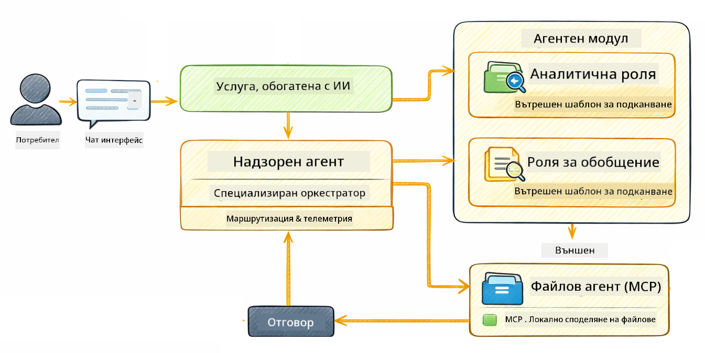

<!--
CO_OP_TRANSLATOR_METADATA:
{
  "original_hash": "f89f4c106d110e4943c055dd1a2f1dff",
  "translation_date": "2025-12-31T05:02:57+00:00",
  "source_file": "05-mcp/README.md",
  "language_code": "bg"
}
-->
# Модул 05: Протокол за контекст на модела (MCP)

## Съдържание

- [Какво ще научите](../../../05-mcp)
- [Какво е MCP?](../../../05-mcp)
- [Как работи MCP](../../../05-mcp)
- [Agentic модулът](../../../05-mcp)
- [Изпълнение на примерите](../../../05-mcp)
  - [Предварителни условия](../../../05-mcp)
- [Бърз старт](../../../05-mcp)
  - [Операции с файлове (Stdio)](../../../05-mcp)
  - [Supervisor Agent](../../../05-mcp)
    - [Разбиране на изхода](../../../05-mcp)
    - [Обяснение на функциите на Agentic модула](../../../05-mcp)
- [Ключови концепции](../../../05-mcp)
- [Поздравления!](../../../05-mcp)
  - [Какво следва?](../../../05-mcp)

## Какво ще научите

Вече сте изградили разговорен AI, овладяли сте промпти, заземили сте отговори в документи и създали агенти с инструменти. Но всички тези инструменти бяха създадени специално за вашето приложение. Ами ако можехте да дадете на вашия AI достъп до стандартизиран екосистем от инструменти, които всеки може да създава и споделя? В този модул ще научите точно това с Протокола за контекст на модела (MCP) и agentic модула на LangChain4j. Първо показваме прост MCP четец на файлове и след това демонстрираме как лесно се интегрира в напреднали agentic работни процеси, използвайки модела Supervisor Agent.

## Какво е MCP?

Model Context Protocol (MCP) предоставя точно това - стандартен начин за AI приложения да откриват и използват външни инструменти. Вместо да пишете персонализирани интеграции за всеки източник на данни или услуга, вие се свързвате със MCP сървъри, които излагат възможностите си в последователен формат. Вашият AI агент може след това автоматично да открива и използва тези инструменти.


*Преди MCP: сложни точка-към-точка интеграции. След MCP: един протокол, безкрайни възможности.*

MCP решава фундаментален проблем в развитието на AI: всяка интеграция е персонализирана. Искате достъп до GitHub? Персонализиран код. Искате да четете файлове? Персонализиран код. Искате да задавате заявки към база данни? Персонализиран код. И нито една от тези интеграции не работи с други AI приложения.

MCP стандартизира това. MCP сървър излага инструменти с ясни описания и схеми за параметрите. Всеки MCP клиент може да се свърже, да открие наличните инструменти и да ги използва. Изградете веднъж, използвайте навсякъде.


*Архитектура на Model Context Protocol - стандартизирано откриване и изпълнение на инструменти*

## Как работи MCP

**Сървър-клиент архитектура**

MCP използва модел сървър-клиент. Сървърите предоставят инструменти - четене на файлове, заявки към бази данни, извикване на API-та. Клиентите (вашето AI приложение) се свързват със сървърите и използват техните инструменти.

За да използвате MCP с LangChain4j, добавете тази Maven зависимост:

```xml
<dependency>
    <groupId>dev.langchain4j</groupId>
    <artifactId>langchain4j-mcp</artifactId>
    <version>${langchain4j.version}</version>
</dependency>
```

**Откриване на инструменти**

Когато вашият клиент се свърже със MCP сървър, той пита "Какви инструменти имате?" Сървърът отговаря с списък от налични инструменти, всеки с описания и схеми за параметрите. Вашият AI агент след това може да реши кои инструменти да използва въз основа на заявките на потребителя.

**Механизми на трансфер**

MCP поддържа различни механизми за трансфер. Този модул демонстрира Stdio транспорта за локални процеси:


*MCP механизми за трансфер: HTTP за отдалечени сървъри, Stdio за локални процеси*

**Stdio** - [StdioTransportDemo.java](../../../05-mcp/src/main/java/com/example/langchain4j/mcp/StdioTransportDemo.java)

За локални процеси. Вашето приложение стартира сървър като подпроцес и комуникира чрез стандартен вход/изход. Полезно за достъп до файловата система или командни инструменти.

```java
McpTransport stdioTransport = new StdioMcpTransport.Builder()
    .command(List.of(
        npmCmd, "exec",
        "@modelcontextprotocol/server-filesystem@2025.12.18",
        resourcesDir
    ))
    .logEvents(false)
    .build();
```

> **🤖 Опитайте с [GitHub Copilot](https://github.com/features/copilot) Chat:** Отворете [`StdioTransportDemo.java`](../../../05-mcp/src/main/java/com/example/langchain4j/mcp/StdioTransportDemo.java) и попитайте:
> - "Как работи Stdio транспорта и кога да го използвам вместо HTTP?"
> - "Как LangChain4j управлява жизнения цикъл на стартираните MCP сървърни процеси?"
> - "Какви са рисковете за сигурността, когато даваме на AI достъп до файловата система?"

## Agentic модулът

Докато MCP предоставя стандартизирани инструменти, agentic модулът на LangChain4j предлага декларативен начин за изграждане на агенти, които оркестрират тези инструменти. Анотацията `@Agent` и `AgenticServices` ви позволяват да дефинирате поведението на агента чрез интерфейси, вместо посредством императивен код.

В този модул ще разгледате модела **Supervisor Agent** — напреднал agentic подход, при който "супервайзор" агент динамично решава кои подагенти да извика въз основа на заявките на потребителя. Съчетаваме и двете концепции, като даваме на един от нашите подагенти възможности за достъп до файлове чрез MCP.

За да използвате agentic модула, добавете тази Maven зависимост:

```xml
<dependency>
    <groupId>dev.langchain4j</groupId>
    <artifactId>langchain4j-agentic</artifactId>
    <version>${langchain4j.mcp.version}</version>
</dependency>
```

> **⚠️ Експериментално:** модулът `langchain4j-agentic` е **експериментален** и подлежи на промени. Стабилният начин за изграждане на AI асистенти остава `langchain4j-core` с персонализирани инструменти (Модул 04).

## Изпълнение на примерите

### Предварителни условия

- Java 21+, Maven 3.9+
- Node.js 16+ и npm (за MCP сървъри)
- Променливи на средата конфигурирани в `.env` файл (от коренната директория):
  - **За StdioTransportDemo:** `GITHUB_TOKEN` (GitHub Personal Access Token)
  - **За SupervisorAgentDemo:** `AZURE_OPENAI_ENDPOINT`, `AZURE_OPENAI_API_KEY`, `AZURE_OPENAI_DEPLOYMENT` (същите като в Модули 01-04)

> **Забележка:** Ако все още не сте настроили променливите на средата, вижте [Module 00 - Quick Start](../00-quick-start/README.md) за инструкции, или копирайте `.env.example` в `.env` в коренната директория и попълнете вашите стойности.

## Бърз старт

**Използване на VS Code:** Просто кликнете с десния бутон върху който и да е демо файл в Explorer и изберете **"Run Java"**, или използвайте конфигурациите за пускане от панела Run and Debug (уверете се, че първо сте добавили токена си в `.env` файла).

**Използване на Maven:** Като алтернатива, можете да стартирате от командния ред с примерите по-долу.

### Операции с файлове (Stdio)

Това демонстрира локални инструменти, базирани на подпроцеси.

**✅ Няма нужда от предварителни условия** - MCP сървърът се стартира автоматично.

**Използване на VS Code:** Кликнете с десния бутон върху `StdioTransportDemo.java` и изберете **"Run Java"**.

**Използване на Maven:**

**Bash:**
```bash
export GITHUB_TOKEN=your_token_here
cd 05-mcp
mvn compile exec:java -Dexec.mainClass=com.example.langchain4j.mcp.StdioTransportDemo
```

**PowerShell:**
```powershell
$env:GITHUB_TOKEN=your_token_here
cd 05-mcp
mvn --% compile exec:java -Dexec.mainClass=com.example.langchain4j.mcp.StdioTransportDemo
```

Приложението стартира MCP сървър за файловата система автоматично и чете локален файл. Обърнете внимание как управлението на подпроцесите е поето за вас.

**Очакван изход:**
```
Assistant response: The file provides an overview of LangChain4j, an open-source Java library
for integrating Large Language Models (LLMs) into Java applications...
```

### Supervisor Agent




Моделът **Supervisor Agent** е **гъвкава** форма на agentic AI. За разлика от детерминистични работни потоци (последователни, цикъл, паралелни), Супервайзорът използва LLM, за да решава автономно кои агенти да извика въз основа на заявката на потребителя.

**Съчетаване на Supervisor с MCP:** В този пример даваме на `FileAgent` достъп до MCP инструменти за файловата система чрез `toolProvider(mcpToolProvider)`. Когато потребителят поиска "да прочетете и анализирате файл", Супервайзорът анализира заявката и генерира план за изпълнение. След това маршрутизира заявката към `FileAgent`, който използва MCP инструмента `read_file`, за да извлече съдържанието. Супервайзорът предава това съдържание на `AnalysisAgent` за тълкуване и по желание извиква `SummaryAgent`, за да съкрати резултатите.

Това демонстрира как MCP инструментите се интегрират безпроблемно в agentic работни потоци — Супервайзорът не трябва да знае *как* се четат файловете, само че `FileAgent` може да го направи. Супервайзорът се адаптира динамично към различни типове заявки и връща или отговора на последния агент, или резюме на всички операции.

**Използване на стартовите скриптове (препоръчително):**

Стартовите скриптове автоматично зареждат променливите на средата от коренния `.env` файл:

**Bash:**
```bash
cd 05-mcp
chmod +x start.sh
./start.sh
```

**PowerShell:**
```powershell
cd 05-mcp
.\start.ps1
```

**Използване на VS Code:** Кликнете с десния бутон върху `SupervisorAgentDemo.java` и изберете **"Run Java"** (уверете се, че вашият `.env` файл е конфигуриран).

**Как работи Супервайзорът:**

```java
// Дефинирайте няколко агента с конкретни възможности
FileAgent fileAgent = AgenticServices.agentBuilder(FileAgent.class)
        .chatModel(model)
        .toolProvider(mcpToolProvider)  // Разполага с MCP инструменти за файлови операции
        .build();

AnalysisAgent analysisAgent = AgenticServices.agentBuilder(AnalysisAgent.class)
        .chatModel(model)
        .build();

SummaryAgent summaryAgent = AgenticServices.agentBuilder(SummaryAgent.class)
        .chatModel(model)
        .build();

// Създайте Супервайзор, който оркестрира тези агенти
SupervisorAgent supervisor = AgenticServices.supervisorBuilder()
        .chatModel(model)  // Моделът „planner”
        .subAgents(fileAgent, analysisAgent, summaryAgent)
        .responseStrategy(SupervisorResponseStrategy.SUMMARY)
        .build();

// Супервайзорът автономно решава кои агенти да извика
// Просто подайте заявка на естествен език — LLM планира изпълнението
String response = supervisor.invoke("Read the file at /path/file.txt and analyze it");
```

Вижте [SupervisorAgentDemo.java](../../../05-mcp/src/main/java/com/example/langchain4j/mcp/SupervisorAgentDemo.java) за пълната реализация.

> **🤖 Опитайте с [GitHub Copilot](https://github.com/features/copilot) Chat:** Отворете [`SupervisorAgentDemo.java`](../../../05-mcp/src/main/java/com/example/langchain4j/mcp/SupervisorAgentDemo.java) и попитайте:
> - "Как Супервайзорът решава кои агенти да извика?"
> - "Каква е разликата между Supervisor и последователните (Sequential) работни модели?"
> - "Как мога да персонализирам поведението на планиране на Супервайзора?"

#### Разбиране на изхода

Когато стартирате демонстрацията, ще видите структуриран преглед на това как Супервайзорът оркестрира множество агенти. Ето какво означава всяка секция:

```
======================================================================
  SUPERVISOR AGENT DEMO
======================================================================

This demo shows how a Supervisor Agent orchestrates multiple specialized agents.
The Supervisor uses an LLM to decide which agent to call based on the task.
```

**Хедърът** въвежда демото и обяснява основната концепция: Супервайзорът използва LLM (не предварително зададени правила), за да реши кои агенти да повика.

```
--- AVAILABLE AGENTS -------------------------------------------------
  [FILE]     FileAgent     - Reads files using MCP filesystem tools
  [ANALYZE]  AnalysisAgent - Analyzes content for structure, tone, and themes
  [SUMMARY]  SummaryAgent  - Creates concise summaries of content
```

**Налични агенти** показва трите специализирани агента, от които Супервайзорът може да избира. Всеки агент има специфична възможност:
- **FileAgent** може да чете файлове, използвайки MCP инструменти (външна възможност)
- **AnalysisAgent** анализира съдържание (чиста LLM възможност)
- **SummaryAgent** създава обобщения (чиста LLM възможност)

```
--- USER REQUEST -----------------------------------------------------
  "Read the file at .../file.txt and analyze what it's about"
```

**Заявка от потребителя** показва какво е било поискано. Супервайзорът трябва да го парсне и да реши кои агенти да извика.

```
--- SUPERVISOR ORCHESTRATION -----------------------------------------
  The Supervisor will now decide which agents to invoke and in what order...

  +-- STEP 1: Supervisor chose -> FileAgent (reading file via MCP)
  |
  |   Input: .../file.txt
  |
  |   Result: LangChain4j is an open-source Java library designed to simplify...
  +-- [OK] FileAgent (reading file via MCP) completed

  +-- STEP 2: Supervisor chose -> AnalysisAgent (analyzing content)
  |
  |   Input: LangChain4j is an open-source Java library...
  |
  |   Result: Structure: The content is organized into clear paragraphs that int...
  +-- [OK] AnalysisAgent (analyzing content) completed
```

**Оrкестрация от Супервайзор** е мястото, където се случва магията. Наблюдавайте как:
1. Супервайзорът **избра FileAgent първо**, защото заявката спомена "прочетете файла"
2. FileAgent използва MCP инструмента `read_file`, за да извлече съдържанието на файла
3. След това Супервайзорът **избра AnalysisAgent** и предаде съдържанието на файла на него
4. AnalysisAgent анализира структурата, тона и темите

Обърнете внимание, че Супервайзорът е взел тези решения **автономно** въз основа на заявката на потребителя — без твърдо закодирани работни потоци!

**Краен отговор** е синтезираният отговор на Супервайзора, комбиниращ изходите от всички агенти, които е извикал. Примерът отпечатва agentic обхвата, показвайки резюме и резултати от анализа, съхранени от всеки агент.

```
--- FINAL RESPONSE ---------------------------------------------------
I read the contents of the file and analyzed its structure, tone, and key themes.
The file introduces LangChain4j as an open-source Java library for integrating
large language models...

--- AGENTIC SCOPE (Shared Memory) ------------------------------------
  Agents store their results in a shared scope for other agents to use:
  * summary: LangChain4j is an open-source Java library...
  * analysis: Structure: The content is organized into clear paragraphs that in...
```

### Обяснение на функциите на Agentic модула

Примерът демонстрира няколко напреднали функции на agentic модула. Нека разгледаме по-отблизо Agentic Scope и Agent Listeners.

**Agentic Scope** показва споделената памет, където агентите записват своите резултати, използвайки `@Agent(outputKey="...")`. Това позволява:
- По-късните агенти да достъпват изходите на предходните агенти
- Супервайзорът да синтезира краен отговор
- Вие да инспектирате какво е произвел всеки агент

```java
ResultWithAgenticScope<String> result = supervisor.invokeWithAgenticScope(request);
AgenticScope scope = result.agenticScope();
String story = scope.readState("story");
List<AgentInvocation> history = scope.agentInvocations("analysisAgent");
```

**Agent Listeners** позволяват наблюдение и отстраняване на грешки при изпълнение на агенти. Стъпка по стъпка изходът, който виждате в демото, идва от AgentListener, който се закача във всяко извикване на агент:
- **beforeAgentInvocation** - Извиква се когато Супервайзорът избере агент, позволявайки ви да видите кой агент е избран и защо
- **afterAgentInvocation** - Извиква се когато агентът завърши, показвайки резултата му
- **inheritedBySubagents** - Когато е true, слушателят наблюдава всички агенти в йерархията

```java
AgentListener monitor = new AgentListener() {
    private int step = 0;
    
    @Override
    public void beforeAgentInvocation(AgentRequest request) {
        step++;
        System.out.println("  +-- STEP " + step + ": " + request.agentName());
    }
    
    @Override
    public void afterAgentInvocation(AgentResponse response) {
        System.out.println("  +-- [OK] " + response.agentName() + " completed");
    }
    
    @Override
    public boolean inheritedBySubagents() {
        return true; // Разпространете до всички подагенти
    }
};
```

Освен модела Supervisor, модулът `langchain4j-agentic` предоставя няколко силни работни модела и функции:

| Pattern | Description | Use Case |
|---------|-------------|----------|
| **Sequential** | Execute agents in order, output flows to next | Pipelines: research → analyze → report |
| **Parallel** | Run agents simultaneously | Independent tasks: weather + news + stocks |
| **Loop** | Iterate until condition met | Quality scoring: refine until score ≥ 0.8 |
| **Conditional** | Route based on conditions | Classify → route to specialist agent |
| **Human-in-the-Loop** | Add human checkpoints | Approval workflows, content review |

## Ключови концепции

**MCP** е идеален, когато искате да използвате съществуващи екосистеми от инструменти, да изграждате инструменти, които множество приложения могат да споделят, да интегрирате услуги на трети страни със стандартни протоколи или да сменяте реализации на инструменти без да променяте кода.

**Agentic модулът** работи най-добре, когато искате декларативни дефиниции на агенти с анотации `@Agent`, имате нужда от оркестрация на работни потоци (последователни, цикъл, паралелни), предпочитате дизайн на агенти базиран на интерфейси пред императивен код, или когато комбинирате множество агенти, които споделят изходи чрез `outputKey`.

**Моделът Supervisor Agent** изпъква, когато работният процес не е предсказуем предварително и искате LLM да решава, когато имате множество специализирани агенти, които изискват динамична оркестрация, когато изграждате разговорни системи, които маршрутизират към различни възможности, или когато искате най-гъвкавото, адаптивно поведение на агента.

## Поздравления!

Вие завършихте курса LangChain4j за начинаещи. Научихте:

- Как да изграждате разговорен AI с памет (Модул 01)
- Патерни за инженерство на промпти за различни задачи (Модул 02)
- Заземяване на отговори в документи с RAG (Модул 03)
- Създаване на базови AI агенти (асистенти) с персонализирани инструменти (Модул 04)
- Интегриране на стандартизирани инструменти с LangChain4j MCP и Agentic модулите (Модул 05)

### Какво следва?

След като завършите модулите, разгледайте [Ръководството за тестване](../docs/TESTING.md), за да видите концепциите за тестване на LangChain4j в действие.

**Официални ресурси:**
- [Документация на LangChain4j](https://docs.langchain4j.dev/) - Изчерпателни ръководства и API справочник
- [GitHub на LangChain4j](https://github.com/langchain4j/langchain4j) - Изходен код и примери
- [Уроци на LangChain4j](https://docs.langchain4j.dev/tutorials/) - Ръководства стъпка по стъпка за различни случаи на употреба

Благодарим ви, че завършихте този курс!

---

**Навигация:** [← Предишен: Модул 04 - Инструменти](../04-tools/README.md) | [Обратно към началната страница](../README.md)

---

<!-- CO-OP TRANSLATOR DISCLAIMER START -->
Отказ от отговорност:
Този документ е преведен с помощта на услуга за превод с изкуствен интелект [Co-op Translator] (https://github.com/Azure/co-op-translator). Въпреки че се стремим към точност, имайте предвид, че автоматичните преводи могат да съдържат грешки или неточности. Оригиналният документ на неговия оригинален език трябва да се счита за авторитетен източник. За критична информация се препоръчва професионален човешки превод. Не носим отговорност за каквито и да е недоразумения или погрешни тълкувания, произтичащи от използването на този превод.
<!-- CO-OP TRANSLATOR DISCLAIMER END -->