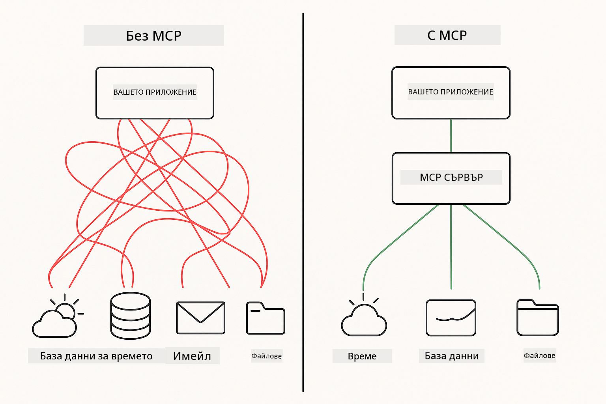
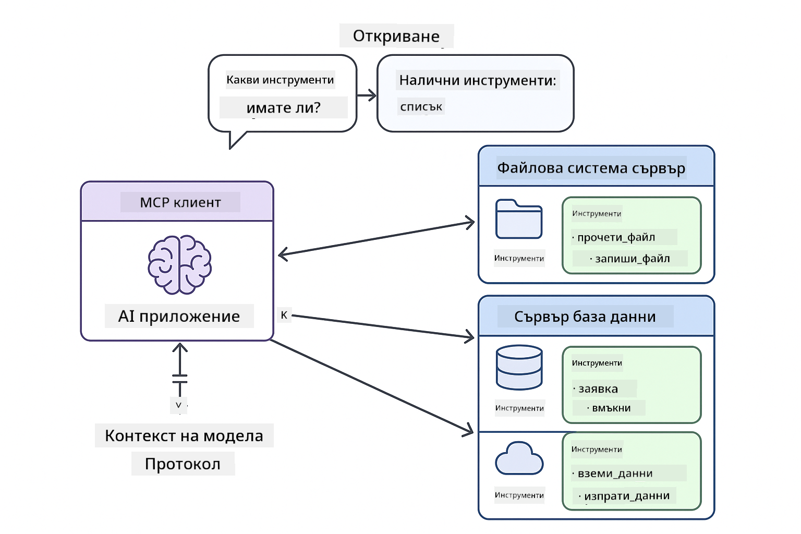

<!--
CO_OP_TRANSLATOR_METADATA:
{
  "original_hash": "c25ec1f10ef156c53e190cdf8b0711ab",
  "translation_date": "2025-12-13T18:05:43+00:00",
  "source_file": "05-mcp/README.md",
  "language_code": "bg"
}
-->
# Модул 05: Протокол за контекст на модела (MCP)

## Съдържание

- [Какво ще научите](../../../05-mcp)
- [Разбиране на MCP](../../../05-mcp)
- [Как работи MCP](../../../05-mcp)
  - [Архитектура клиент-сървър](../../../05-mcp)
  - [Откриване на инструменти](../../../05-mcp)
  - [Механизми за трансфер](../../../05-mcp)
- [Предварителни изисквания](../../../05-mcp)
- [Какво покрива този модул](../../../05-mcp)
- [Бърз старт](../../../05-mcp)
  - [Пример 1: Отдалечен калкулатор (Streamable HTTP)](../../../05-mcp)
  - [Пример 2: Операции с файлове (Stdio)](../../../05-mcp)
  - [Пример 3: Анализ на Git (Docker)](../../../05-mcp)
- [Ключови концепции](../../../05-mcp)
  - [Избор на трансфер](../../../05-mcp)
  - [Откриване на инструменти](../../../05-mcp)
  - [Управление на сесии](../../../05-mcp)
  - [Съображения за кросплатформеност](../../../05-mcp)
- [Кога да използвате MCP](../../../05-mcp)
- [Екосистема на MCP](../../../05-mcp)
- [Поздравления!](../../../05-mcp)
  - [Какво следва?](../../../05-mcp)
- [Отстраняване на проблеми](../../../05-mcp)

## Какво ще научите

Вече сте изградили разговорен AI, овладяли сте подсказките, основали сте отговорите в документи и сте създали агенти с инструменти. Но всички тези инструменти бяха специално създадени за вашето конкретно приложение. Ами ако можете да дадете на вашия AI достъп до стандартизиран екосистем от инструменти, които всеки може да създава и споделя?

Протоколът за контекст на модела (MCP) предоставя точно това - стандартен начин за AI приложения да откриват и използват външни инструменти. Вместо да пишете персонализирани интеграции за всеки източник на данни или услуга, вие се свързвате със сървъри MCP, които излагат своите възможности в последователен формат. Вашият AI агент може автоматично да открива и използва тези инструменти.



*Преди MCP: Сложни точкови интеграции. След MCP: Един протокол, безкрайни възможности.*

## Разбиране на MCP

MCP решава фундаментален проблем в разработката на AI: всяка интеграция е персонализирана. Искате достъп до GitHub? Персонализиран код. Искате да четете файлове? Персонализиран код. Искате да правите заявки към база данни? Персонализиран код. И нито една от тези интеграции не работи с други AI приложения.

MCP стандартизира това. MCP сървър излага инструменти с ясни описания и схеми. Всеки MCP клиент може да се свърже, да открие наличните инструменти и да ги използва. Създайте веднъж, използвайте навсякъде.



*Архитектура на Протокола за контекст на модела - стандартизирано откриване и изпълнение на инструменти*

## Как работи MCP

**Архитектура клиент-сървър**

MCP използва модел клиент-сървър. Сървърите предоставят инструменти - четене на файлове, заявки към бази данни, извикване на API. Клиентите (вашето AI приложение) се свързват със сървърите и използват техните инструменти.

**Откриване на инструменти**

Когато вашият клиент се свърже с MCP сървър, той пита "Какви инструменти имате?" Сървърът отговаря със списък на наличните инструменти, всеки с описания и схеми на параметрите. Вашият AI агент може да реши кои инструменти да използва въз основа на заявките на потребителя.

**Механизми за трансфер**

MCP дефинира два механизма за трансфер: HTTP за отдалечени сървъри, Stdio за локални процеси (включително Docker контейнери):


*Механизми за трансфер на MCP: HTTP за отдалечени сървъри, Stdio за локални процеси (включително Docker контейнери)*

**Streamable HTTP** - [StreamableHttpDemo.java](../../../05-mcp/src/main/java/com/example/langchain4j/mcp/StreamableHttpDemo.java)

За отдалечени сървъри. Вашето приложение прави HTTP заявки към сървър, работещ някъде в мрежата. Използва Server-Sent Events за комуникация в реално време.

```java
McpTransport httpTransport = new StreamableHttpMcpTransport.Builder()
    .url("http://localhost:3001/mcp")
    .timeout(Duration.ofSeconds(60))
    .logRequests(true)
    .logResponses(true)
    .build();
```

> **🤖 Опитайте с [GitHub Copilot](https://github.com/features/copilot) Chat:** Отворете [`StreamableHttpDemo.java`](../../../05-mcp/src/main/java/com/example/langchain4j/mcp/StreamableHttpDemo.java) и попитайте:
> - "Как MCP се различава от директната интеграция на инструменти като в Модул 04?"
> - "Какви са ползите от използването на MCP за споделяне на инструменти между приложения?"
> - "Как да се справя с прекъсвания на връзката или таймаути към MCP сървъри?"

**Stdio** - [StdioTransportDemo.java](../../../05-mcp/src/main/java/com/example/langchain4j/mcp/StdioTransportDemo.java)

За локални процеси. Вашето приложение стартира сървър като подпроцес и комуникира чрез стандартен вход/изход. Полезно за достъп до файловата система или командни инструменти.

```java
McpTransport stdioTransport = new StdioMcpTransport.Builder()
    .command(List.of(
        npmCmd, "exec",
        "@modelcontextprotocol/server-filesystem@0.6.2",
        resourcesDir
    ))
    .logEvents(false)
    .build();
```

> **🤖 Опитайте с [GitHub Copilot](https://github.com/features/copilot) Chat:** Отворете [`StdioTransportDemo.java`](../../../05-mcp/src/main/java/com/example/langchain4j/mcp/StdioTransportDemo.java) и попитайте:
> - "Как работи Stdio трансферът и кога да го използвам вместо HTTP?"
> - "Как LangChain4j управлява жизнения цикъл на стартираните MCP сървърни процеси?"
> - "Какви са рисковете за сигурността при даване на AI достъп до файловата система?"

**Docker (използва Stdio)** - [GitRepositoryAnalyzer.java](../../../05-mcp/src/main/java/com/example/langchain4j/mcp/GitRepositoryAnalyzer.java)

За контейнеризирани услуги. Използва stdio трансфер за комуникация с Docker контейнер чрез `docker run`. Подходящо за сложни зависимости или изолирани среди.

```java
McpTransport dockerTransport = new StdioMcpTransport.Builder()
    .command(List.of(
        "docker", "run",
        "-e", "GITHUB_PERSONAL_ACCESS_TOKEN=" + System.getenv("GITHUB_TOKEN"),
        "-v", volumeMapping,
        "-i", "mcp/git"
    ))
    .logEvents(true)
    .build();
```

> **🤖 Опитайте с [GitHub Copilot](https://github.com/features/copilot) Chat:** Отворете [`GitRepositoryAnalyzer.java`](../../../05-mcp/src/main/java/com/example/langchain4j/mcp/GitRepositoryAnalyzer.java) и попитайте:
> - "Как Docker трансферът изолира MCP сървърите и какви са ползите?"
> - "Как да конфигурирам монтиране на томове за споделяне на данни между хоста и MCP контейнерите?"
> - "Кои са най-добрите практики за управление на жизнения цикъл на Docker-базирани MCP сървъри в продукция?"

## Стартиране на примерите

### Предварителни изисквания

- Java 21+, Maven 3.9+
- Node.js 16+ и npm (за MCP сървъри)
- **Docker Desktop** - Трябва да е **Стартиран** за Пример 3 (не само инсталиран)
- Личен достъп до GitHub токен, конфигуриран в `.env` файл (от Модул 00)

> **Забележка:** Ако все още не сте настроили вашия GitHub токен, вижте [Модул 00 - Бърз старт](../00-quick-start/README.md) за инструкции.

> **⚠️ Потребители на Docker:** Преди да стартирате Пример 3, проверете дали Docker Desktop работи с `docker ps`. Ако виждате грешки за връзка, стартирайте Docker Desktop и изчакайте около 30 секунди за инициализация.

## Бърз старт

**Използване на VS Code:** Просто кликнете с десен бутон върху някой демо файл в Explorer и изберете **"Run Java"**, или използвайте конфигурациите за стартиране от панела Run and Debug (уверете се, че сте добавили токена си в `.env` файла първо).

**Използване на Maven:** Алтернативно, можете да стартирате от командния ред с примерите по-долу.

**⚠️ Важно:** Някои примери имат предварителни изисквания (като стартиране на MCP сървър или изграждане на Docker образи). Проверете изискванията на всеки пример преди стартиране.

### Пример 1: Отдалечен калкулатор (Streamable HTTP)

Това демонстрира интеграция на инструменти през мрежата.

**⚠️ Предварително изискване:** Трябва първо да стартирате MCP сървъра (виж Терминал 1 по-долу).

**Терминал 1 - Стартиране на MCP сървъра:**

**Bash:**
```bash
git clone https://github.com/modelcontextprotocol/servers.git
cd servers/src/everything
npm install
node dist/streamableHttp.js
```

**PowerShell:**
```powershell
git clone https://github.com/modelcontextprotocol/servers.git
cd servers/src/everything
npm install
node dist/streamableHttp.js
```

**Терминал 2 - Стартиране на примера:**

**Използване на VS Code:** Кликнете с десен бутон върху `StreamableHttpDemo.java` и изберете **"Run Java"**.

**Използване на Maven:**

**Bash:**
```bash
export GITHUB_TOKEN=your_token_here
cd 05-mcp
mvn compile exec:java -Dexec.mainClass=com.example.langchain4j.mcp.StreamableHttpDemo
```

**PowerShell:**
```powershell
$env:GITHUB_TOKEN=your_token_here
cd 05-mcp
mvn --% compile exec:java -Dexec.mainClass=com.example.langchain4j.mcp.StreamableHttpDemo
```

Наблюдавайте как агентът открива наличните инструменти, след което използвайте калкулатора за извършване на събиране.

### Пример 2: Операции с файлове (Stdio)

Това демонстрира инструменти, базирани на локални подпроцеси.

**✅ Няма нужда от предварителни изисквания** - MCP сървърът се стартира автоматично.

**Използване на VS Code:** Кликнете с десен бутон върху `StdioTransportDemo.java` и изберете **"Run Java"**.

**Използване на Maven:**

**Bash:**
```bash
export GITHUB_TOKEN=your_token_here
cd 05-mcp
mvn compile exec:java -Dexec.mainClass=com.example.langchain4j.mcp.StdioTransportDemo
```

**PowerShell:**
```powershell
$env:GITHUB_TOKEN=your_token_here
cd 05-mcp
mvn --% compile exec:java -Dexec.mainClass=com.example.langchain4j.mcp.StdioTransportDemo
```

Приложението автоматично стартира MCP сървър за файловата система и чете локален файл. Обърнете внимание как се управлява подпроцесът вместо вас.

**Очакван изход:**
```
Assistant response: The content of the file is "Kaboom!".
```

### Пример 3: Анализ на Git (Docker)

Това демонстрира сървъри на инструменти в контейнери.

**⚠️ Предварителни изисквания:** 
1. **Docker Desktop трябва да е СТАРТИРАН** (не само инсталиран)
2. **Потребители на Windows:** Препоръчва се режим WSL 2 (Настройки на Docker Desktop → General → "Use the WSL 2 based engine"). Режим Hyper-V изисква ръчна конфигурация на споделяне на файлове.
3. Трябва първо да изградите Docker образа (виж Терминал 1 по-долу)

**Проверете дали Docker работи:**

**Bash:**
```bash
docker ps  # Трябва да показва списък с контейнери, а не грешка
```

**PowerShell:**
```powershell
docker ps  # Трябва да показва списък с контейнери, а не грешка
```

Ако видите грешка като "Cannot connect to Docker daemon" или "The system cannot find the file specified", стартирайте Docker Desktop и изчакайте да се инициализира (~30 секунди).

**Отстраняване на проблеми:**
- Ако AI докладва празно хранилище или липса на файлове, монтирането на тома (`-v`) не работи.
- **Потребители на Windows с Hyper-V:** Добавете директорията на проекта в Docker Desktop Settings → Resources → File sharing, след което рестартирайте Docker Desktop.
- **Препоръчително решение:** Превключете на режим WSL 2 за автоматично споделяне на файлове (Настройки → General → активирайте "Use the WSL 2 based engine").

**Терминал 1 - Изграждане на Docker образа:**

**Bash:**
```bash
cd servers/src/git
docker build -t mcp/git .
```

**PowerShell:**
```powershell
cd servers/src/git
docker build -t mcp/git .
```

**Терминал 2 - Стартиране на анализатора:**

**Използване на VS Code:** Кликнете с десен бутон върху `GitRepositoryAnalyzer.java` и изберете **"Run Java"**.

**Използване на Maven:**

**Bash:**
```bash
export GITHUB_TOKEN=your_token_here
cd 05-mcp
mvn compile exec:java -Dexec.mainClass=com.example.langchain4j.mcp.GitRepositoryAnalyzer
```

**PowerShell:**
```powershell
$env:GITHUB_TOKEN=your_token_here
cd 05-mcp
mvn --% compile exec:java -Dexec.mainClass=com.example.langchain4j.mcp.GitRepositoryAnalyzer
```

Приложението стартира Docker контейнер, монтира вашето хранилище и анализира структурата и съдържанието на хранилището чрез AI агента.

## Ключови концепции

**Избор на трансфер**

Изберете според това къде се намират вашите инструменти:
- Отдалечени услуги → Streamable HTTP
- Локална файлова система → Stdio
- Сложни зависимости → Docker

**Откриване на инструменти**

MCP клиентите автоматично откриват наличните инструменти при свързване. Вашият AI агент вижда описанията на инструментите и решава кои да използва според заявката на потребителя.

**Управление на сесии**

Streamable HTTP трансферът поддържа сесии, позволяващи състояниеви взаимодействия с отдалечени сървъри. Stdio и Docker трансферите обикновено са безсъстояниеви.

**Съображения за кросплатформеност**

Примерите автоматично обработват разликите между платформи (разлики в команди за Windows и Unix, конвертиране на пътища за Docker). Това е важно за продукционни внедрявания в различни среди.

## Кога да използвате MCP

**Използвайте MCP когато:**
- Искате да използвате съществуващи екосистеми от инструменти
- Създавате инструменти, които ще се използват от множество приложения
- Интегрирате услуги на трети страни със стандартни протоколи
- Искате да сменяте реализации на инструменти без промяна на кода

**Използвайте персонализирани инструменти (Модул 04) когато:**
- Създавате функционалност, специфична за приложението
- Производителността е критична (MCP добавя допълнителна сложност)
- Вашите инструменти са прости и няма да се използват повторно
- Искате пълен контрол върху изпълнението

## Екосистема на MCP

Протоколът за контекст на модела е отворен стандарт с растяща екосистема:

- Официални MCP сървъри за често срещани задачи (файлова система, Git, бази данни)
- Сървъри, предоставени от общността за различни услуги
- Стандартизирани описания и схеми на инструменти
- Съвместимост между различни рамки (работи с всеки MCP клиент)

Тази стандартизация означава, че инструментите, създадени за едно AI приложение, работят и с други, създавайки споделена екосистема от възможности.

## Поздравления!

Завършихте курса LangChain4j за начинаещи. Научихте:

- Как да изграждате разговорен AI с памет (Модул 01)
- Шаблони за инженеринг на подсказки за различни задачи (Модул 02)
- Основаване на отговори в документи с RAG (Модул 03)
- Създаване на AI агенти с персонализирани инструменти (Модул 04)
- Интегриране на стандартизирани инструменти чрез MCP (Модул 05)

Сега имате основата за изграждане на продукционни AI приложения. Концепциите, които научихте, важат независимо от конкретни рамки или модели - те са фундаментални модели в AI инженерството.

### Какво следва?

След като завършите модулите, разгледайте [Ръководството за тестване](../docs/TESTING.md), за да видите концепциите за тестване в LangChain4j в действие.

**Официални ресурси:**
- [Документация на LangChain4j](https://docs.langchain4j.dev/) - Подробни ръководства и API справочник
- [LangChain4j GitHub](https://github.com/langchain4j/langchain4j) - Изходен код и примери
- [Уроци на LangChain4j](https://docs.langchain4j.dev/tutorials/) - Стъпка по стъпка уроци за различни случаи на употреба

Благодарим ви, че завършихте този курс!

---

**Навигация:** [← Предишен: Модул 04 - Инструменти](../04-tools/README.md) | [Обратно към началото](../README.md)

---

## Отстраняване на проблеми

### Синтаксис на PowerShell команда за Maven
**Проблем**: Maven командите се провалят с грешка `Unknown lifecycle phase ".mainClass=..."`

**Причина**: PowerShell интерпретира `=` като оператор за присвояване на променлива, което нарушава синтаксиса на Maven свойствата

**Решение**: Използвайте оператора за спиране на парсването `--%` преди Maven командата:

**PowerShell:**
```powershell
mvn --% compile exec:java -Dexec.mainClass=com.example.langchain4j.mcp.StreamableHttpDemo
```

**Bash:**
```bash
mvn compile exec:java -Dexec.mainClass=com.example.langchain4j.mcp.StreamableHttpDemo
```

Операторът `--%` казва на PowerShell да предаде всички останали аргументи буквално на Maven без интерпретация.

### Проблеми с връзката към Docker

**Проблем**: Docker командите се провалят с "Cannot connect to Docker daemon" или "The system cannot find the file specified"

**Причина**: Docker Desktop не работи или не е напълно инициализиран

**Решение**: 
1. Стартирайте Docker Desktop
2. Изчакайте около 30 секунди за пълна инициализация
3. Проверете с `docker ps` (трябва да покаже списък с контейнери, а не грешка)
4. След това изпълнете вашия пример

### Монтиране на Docker томове в Windows

**Проблем**: Анализаторът на Git хранилища отчита празно хранилище или липса на файлове

**Причина**: Монтирането на том (`-v`) не работи поради конфигурация на споделяне на файлове

**Решение**:
- **Препоръчително:** Превключете в режим WSL 2 (Настройки на Docker Desktop → General → "Use the WSL 2 based engine")
- **Алтернатива (Hyper-V):** Добавете директорията на проекта в Docker Desktop Settings → Resources → File sharing, след което рестартирайте Docker Desktop

---

<!-- CO-OP TRANSLATOR DISCLAIMER START -->
**Отказ от отговорност**:  
Този документ е преведен с помощта на AI преводаческа услуга [Co-op Translator](https://github.com/Azure/co-op-translator). Въпреки че се стремим към точност, моля, имайте предвид, че автоматизираните преводи могат да съдържат грешки или неточности. Оригиналният документ на неговия роден език трябва да се счита за авторитетен източник. За критична информация се препоръчва професионален човешки превод. Ние не носим отговорност за каквито и да е недоразумения или неправилни тълкувания, произтичащи от използването на този превод.
<!-- CO-OP TRANSLATOR DISCLAIMER END -->