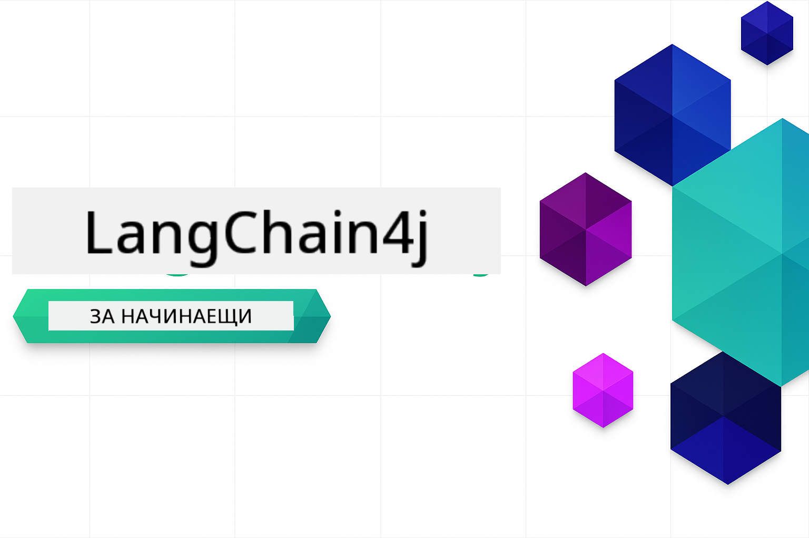

<!--
CO_OP_TRANSLATOR_METADATA:
{
  "original_hash": "d61ab6c245562094cc3dddecf08b50d3",
  "translation_date": "2025-12-31T04:59:18+00:00",
  "source_file": "README.md",
  "language_code": "bg"
}
-->


### 🌐 Многоезична поддръжка

#### Поддържа се чрез GitHub Action (Автоматизирано и винаги актуално)

<!-- CO-OP TRANSLATOR LANGUAGES TABLE START -->
[Арабски](../ar/README.md) | [Бенгалски](../bn/README.md) | [Български](./README.md) | [Бирмански (Мианмар)](../my/README.md) | [Китайски (опростен)](../zh/README.md) | [Китайски (традиционен, Хонконг)](../hk/README.md) | [Китайски (традиционен, Макао)](../mo/README.md) | [Китайски (традиционен, Тайван)](../tw/README.md) | [Хърватски](../hr/README.md) | [Чешки](../cs/README.md) | [Датски](../da/README.md) | [Холандски](../nl/README.md) | [Естонски](../et/README.md) | [Фински](../fi/README.md) | [Френски](../fr/README.md) | [Немски](../de/README.md) | [Гръцки](../el/README.md) | [Иврит](../he/README.md) | [Хинди](../hi/README.md) | [Унгарски](../hu/README.md) | [Индонезийски](../id/README.md) | [Италиански](../it/README.md) | [Японски](../ja/README.md) | [Каннада](../kn/README.md) | [Корейски](../ko/README.md) | [Литовски](../lt/README.md) | [Малайски](../ms/README.md) | [Малаялам](../ml/README.md) | [Маратхи](../mr/README.md) | [Непалски](../ne/README.md) | [Нигерийски пиджин](../pcm/README.md) | [Норвежки](../no/README.md) | [Персийски (фарси)](../fa/README.md) | [Полски](../pl/README.md) | [Португалски (Бразилия)](../br/README.md) | [Португалски (Португалия)](../pt/README.md) | [Пенджабски (Гурмукхи)](../pa/README.md) | [Румънски](../ro/README.md) | [Руски](../ru/README.md) | [Сръбски (кирилица)](../sr/README.md) | [Словашки](../sk/README.md) | [Словенски](../sl/README.md) | [Испански](../es/README.md) | [Свахили](../sw/README.md) | [Шведски](../sv/README.md) | [Тагалог (Филипински)](../tl/README.md) | [Тамилски](../ta/README.md) | [Телугу](../te/README.md) | [Тайски](../th/README.md) | [Турски](../tr/README.md) | [Украински](../uk/README.md) | [Урду](../ur/README.md) | [Виетнамски](../vi/README.md)
<!-- CO-OP TRANSLATOR LANGUAGES TABLE END -->

# LangChain4j за начинаещи

Курс за изграждане на AI приложения с LangChain4j и Azure OpenAI GPT-5, от основен чат до AI агенти.

**Нов в LangChain4j?** Разгледайте [Глосар](docs/GLOSSARY.md) за дефиниции на ключови термини и концепции.

## Table of Contents

1. [Бърз старт](00-quick-start/README.md) - Започнете с LangChain4j
2. [Въведение](01-introduction/README.md) - Научете основите на LangChain4j
3. [Проектиране на подсказки](02-prompt-engineering/README.md) - Овладейте ефективното проектиране на подсказки
4. [RAG (Retrieval-Augmented Generation)](03-rag/README.md) - Създайте интелигентни системи, базирани на знание
5. [Инструменти](04-tools/README.md) - Интегрирайте външни инструменти и прости асистенти
6. [MCP (Model Context Protocol)](05-mcp/README.md) - Работете с Model Context Protocol (MCP) и агентни модули
---

##  Път на обучение

> **Бърз старт**

1. Форкнете това хранилище в своя GitHub акаунт
2. Кликнете **Code** → раздела **Codespaces** → **...** → **New with options...**
3. Използвайте настройките по подразбиране – това ще избере Development контейнера, създаден за този курс
4. Кликнете **Create codespace**
5. Изчакайте 5–10 минути, докато средата стане готова
6. Отидете директно на [Бърз старт](./00-quick-start/README.md), за да започнете!

> **Предпочитате да клонирате локално?**
>
> This repository includes 50+ language translations which significantly increases the download size. To clone without translations, use sparse checkout:
> ```bash
> git clone --filter=blob:none --sparse https://github.com/microsoft/LangChain4j-for-Beginners.git
> cd LangChain4j-for-Beginners
> git sparse-checkout set --no-cone '/*' '!translations' '!translated_images'
> ```
> Това ви дава всичко, от което се нуждаете, за да завършите курса с много по-бързо изтегляне.

След като завършите модулите, разгледайте [Ръководството за тестване](docs/TESTING.md), за да видите концепциите за тестване на LangChain4j в действие.

> **Забележка:** Тренингът използва както GitHub Models, така и Azure OpenAI. Модулите [Бърз старт](00-quick-start/README.md) и [MCP](05-mcp/README.md) използват GitHub Models (не е необходим абонамент за Azure), докато модулите 1-4 използват Azure OpenAI GPT-5.


## Обучение с GitHub Copilot

За бърз старт с кодирането, отворете този проект в GitHub Codespace или във вашето локално IDE с предоставения devcontainer. Devcontainer-ът, използван в този курс, е предварително конфигуриран с GitHub Copilot за AI-партньорско програмиране.

Всеки пример с код включва предложени въпроси, които можете да зададете на GitHub Copilot, за да задълбочите разбирането си. Потърсете подсказките 💡/🤖 в:

- **Заглавки на Java файловете** - Въпроси, специфични за всеки пример
- **README файлове на модулите** - Подсказки за разглеждане след примерите с код

**Как да използвате:** Отворете всеки кодов файл и задайте на Copilot предложените въпроси. Той има пълен контекст на кода и може да обяснява, разширява и предлага алтернативи.

Искате да научите повече? Вижте [Copilot за AI-партньорско програмиране](https://aka.ms/GitHubCopilotAI).


## Допълнителни ресурси

<!-- CO-OP TRANSLATOR OTHER COURSES START -->
### LangChain
[](https://aka.ms/langchain4j-for-beginners)
[](https://aka.ms/langchainjs-for-beginners?WT.mc_id=m365-94501-dwahlin)

---

### Azure / Edge / MCP / Agents
[](https://github.com/microsoft/AZD-for-beginners?WT.mc_id=academic-105485-koreyst)
[](https://github.com/microsoft/edgeai-for-beginners?WT.mc_id=academic-105485-koreyst)
[](https://github.com/microsoft/mcp-for-beginners?WT.mc_id=academic-105485-koreyst)
[](https://github.com/microsoft/ai-agents-for-beginners?WT.mc_id=academic-105485-koreyst)

---
 
### Generative AI Series
[](https://github.com/microsoft/generative-ai-for-beginners?WT.mc_id=academic-105485-koreyst)
[-9333EA?style=for-the-badge&labelColor=E5E7EB&color=9333EA)](https://github.com/microsoft/Generative-AI-for-beginners-dotnet?WT.mc_id=academic-105485-koreyst)
[-C084FC?style=for-the-badge&labelColor=E5E7EB&color=C084FC)](https://github.com/microsoft/generative-ai-for-beginners-java?WT.mc_id=academic-105485-koreyst)
[-E879F9?style=for-the-badge&labelColor=E5E7EB&color=E879F9)](https://github.com/microsoft/generative-ai-with-javascript?WT.mc_id=academic-105485-koreyst)

---
 
### Core Learning
[](https://aka.ms/ml-beginners?WT.mc_id=academic-105485-koreyst)
[](https://aka.ms/datascience-beginners?WT.mc_id=academic-105485-koreyst)
[](https://aka.ms/ai-beginners?WT.mc_id=academic-105485-koreyst)
[](https://github.com/microsoft/Security-101?WT.mc_id=academic-96948-sayoung)
[](https://aka.ms/webdev-beginners?WT.mc_id=academic-105485-koreyst)
[](https://aka.ms/iot-beginners?WT.mc_id=academic-105485-koreyst)
[](https://github.com/microsoft/xr-development-for-beginners?WT.mc_id=academic-105485-koreyst)

---
 
### Серия Copilot
[](https://aka.ms/GitHubCopilotAI?WT.mc_id=academic-105485-koreyst)
[](https://github.com/microsoft/mastering-github-copilot-for-dotnet-csharp-developers?WT.mc_id=academic-105485-koreyst)
[](https://github.com/microsoft/CopilotAdventures?WT.mc_id=academic-105485-koreyst)
<!-- CO-OP TRANSLATOR OTHER COURSES END -->

## Получаване на помощ

Ако заседнете или имате въпроси относно разработването на приложения с ИИ, присъединете се към:

[](https://aka.ms/foundry/discord)

Ако имате обратна връзка за продукта или срещнете грешки по време на разработката, посетете:

[](https://aka.ms/foundry/forum)

## Лиценз

MIT лиценз - Вижте файла [LICENSE](../../LICENSE) за подробности.

---

<!-- CO-OP TRANSLATOR DISCLAIMER START -->
**Отказ от отговорност**:
Този документ е преведен с помощта на услуга за превод с изкуствен интелект [Co-op Translator](https://github.com/Azure/co-op-translator). Въпреки че се стремим към точност, имайте предвид, че автоматизираните преводи могат да съдържат грешки или неточности. Оригиналният документ на езика, на който е написан, трябва да се счита за авторитетен източник. За критична информация се препоръчва професионален човешки превод. Не носим отговорност за каквито и да е недоразумения или погрешни тълкувания, произтичащи от използването на този превод.
<!-- CO-OP TRANSLATOR DISCLAIMER END -->