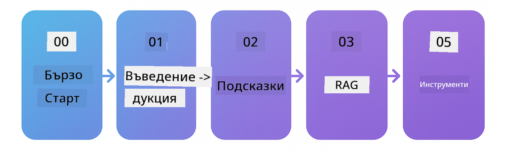

<!--
CO_OP_TRANSLATOR_METADATA:
{
  "original_hash": "e137234b4d3a7fcbbfc93bf17ae8a621",
  "translation_date": "2025-12-19T10:44:14+00:00",
  "source_file": "README.md",
  "language_code": "bg"
}
-->


### 🌐 Поддръжка на множество езици

#### Поддържа се чрез GitHub Action (Автоматизирано и винаги актуално)

<!-- CO-OP TRANSLATOR LANGUAGES TABLE START -->
[Arabic](../ar/README.md) | [Bengali](../bn/README.md) | [Bulgarian](./README.md) | [Burmese (Myanmar)](../my/README.md) | [Chinese (Simplified)](../zh/README.md) | [Chinese (Traditional, Hong Kong)](../hk/README.md) | [Chinese (Traditional, Macau)](../mo/README.md) | [Chinese (Traditional, Taiwan)](../tw/README.md) | [Croatian](../hr/README.md) | [Czech](../cs/README.md) | [Danish](../da/README.md) | [Dutch](../nl/README.md) | [Estonian](../et/README.md) | [Finnish](../fi/README.md) | [French](../fr/README.md) | [German](../de/README.md) | [Greek](../el/README.md) | [Hebrew](../he/README.md) | [Hindi](../hi/README.md) | [Hungarian](../hu/README.md) | [Indonesian](../id/README.md) | [Italian](../it/README.md) | [Japanese](../ja/README.md) | [Kannada](../kn/README.md) | [Korean](../ko/README.md) | [Lithuanian](../lt/README.md) | [Malay](../ms/README.md) | [Malayalam](../ml/README.md) | [Marathi](../mr/README.md) | [Nepali](../ne/README.md) | [Nigerian Pidgin](../pcm/README.md) | [Norwegian](../no/README.md) | [Persian (Farsi)](../fa/README.md) | [Polish](../pl/README.md) | [Portuguese (Brazil)](../br/README.md) | [Portuguese (Portugal)](../pt/README.md) | [Punjabi (Gurmukhi)](../pa/README.md) | [Romanian](../ro/README.md) | [Russian](../ru/README.md) | [Serbian (Cyrillic)](../sr/README.md) | [Slovak](../sk/README.md) | [Slovenian](../sl/README.md) | [Spanish](../es/README.md) | [Swahili](../sw/README.md) | [Swedish](../sv/README.md) | [Tagalog (Filipino)](../tl/README.md) | [Tamil](../ta/README.md) | [Telugu](../te/README.md) | [Thai](../th/README.md) | [Turkish](../tr/README.md) | [Ukrainian](../uk/README.md) | [Urdu](../ur/README.md) | [Vietnamese](../vi/README.md)
<!-- CO-OP TRANSLATOR LANGUAGES TABLE END -->

# LangChain4j за начинаещи

Курс за изграждане на AI приложения с LangChain4j и Azure OpenAI GPT-5, от основен чат до AI агенти.

**Нов в LangChain4j?** Разгледайте [Глосария](docs/GLOSSARY.md) за определения на ключови термини и концепции.

## Съдържание

1. [Бърз старт](00-quick-start/README.md) - Започнете с LangChain4j
2. [Въведение](01-introduction/README.md) - Научете основите на LangChain4j
3. [Проектиране на заявки](02-prompt-engineering/README.md) - Овладейте ефективното проектиране на заявки
4. [RAG (Генериране с допълнително извличане)](03-rag/README.md) - Изградете интелигентни системи, базирани на знания
5. [Инструменти](04-tools/README.md) - Интегрирайте външни инструменти и API с AI агенти
6. [MCP (Протокол за контекст на модела)](05-mcp/README.md) - Работа с Протокола за контекст на модела
---

## Обучителен път

> **Бърз старт**

1. Форкнете това хранилище в своя GitHub акаунт
2. Кликнете **Code** → раздел **Codespaces** → **...** → **New with options...**
3. Използвайте подразбиращите се настройки – това ще избере контейнера за разработка, създаден за този курс
4. Кликнете **Create codespace**
5. Изчакайте 5-10 минути за готовност на средата
6. Отидете директно на [Бърз старт](./00-quick-start/README.md), за да започнете!

> **Предпочитате да клонирате локално?**
>
> Това хранилище включва над 50 езикови превода, което значително увеличава размера на изтегляне. За да клонирате без преводи, използвайте sparse checkout:
> ```bash
> git clone --filter=blob:none --sparse https://github.com/microsoft/LangChain4j-for-Beginners.git
> cd LangChain4j-for-Beginners
> git sparse-checkout set --no-cone '/*' '!translations' '!translated_images'
> ```
> Това ви дава всичко необходимо за завършване на курса с много по-бързо изтегляне.

Започнете с модула [Бърз старт](00-quick-start/README.md) и преминавайте през всеки модул, за да изградите уменията си стъпка по стъпка. Ще изпробвате основни примери, за да разберете основите, преди да преминете към модула [Въведение](01-introduction/README.md) за по-задълбочено изучаване с GPT-5.



След завършване на модулите, разгледайте [Ръководството за тестване](docs/TESTING.md), за да видите концепциите за тестване на LangChain4j в действие.

> **Забележка:** Това обучение използва както GitHub модели, така и Azure OpenAI. Модулите [Бърз старт](00-quick-start/README.md) и [MCP](05-mcp/README.md) използват GitHub модели (не е необходим абонамент за Azure), докато модулите 1-4 използват Azure OpenAI GPT-5.


## Обучение с GitHub Copilot

За бърз старт на кодирането, отворете този проект в GitHub Codespace или в локалната си IDE с предоставения devcontainer. Devcontainer-ът, използван в този курс, е предварително конфигуриран с GitHub Copilot за AI съвместно програмиране.

Всеки примерен код включва предложени въпроси, които можете да зададете на GitHub Copilot, за да задълбочите разбирането си. Потърсете подсказките 💡/🤖 в:

- **Java заглавия на файлове** - Въпроси, специфични за всеки пример
- **README файлове на модулите** - Подсказки за изследване след примерите с код

**Как да използвате:** Отворете всеки кодов файл и задайте на Copilot предложените въпроси. Той има пълен контекст на кода и може да обяснява, разширява и предлага алтернативи.

Искате да научите повече? Разгледайте [Copilot за AI съвместно програмиране](https://aka.ms/GitHubCopilotAI).


## Допълнителни ресурси

<!-- CO-OP TRANSLATOR OTHER COURSES START -->
### LangChain
[](https://aka.ms/langchain4j-for-beginners)
[](https://aka.ms/langchainjs-for-beginners?WT.mc_id=m365-94501-dwahlin)

---

### Azure / Edge / MCP / Агенти
[](https://github.com/microsoft/AZD-for-beginners?WT.mc_id=academic-105485-koreyst)
[](https://github.com/microsoft/edgeai-for-beginners?WT.mc_id=academic-105485-koreyst)
[](https://github.com/microsoft/mcp-for-beginners?WT.mc_id=academic-105485-koreyst)
[](https://github.com/microsoft/ai-agents-for-beginners?WT.mc_id=academic-105485-koreyst)

---
 
### Серия за генеративен AI
[](https://github.com/microsoft/generative-ai-for-beginners?WT.mc_id=academic-105485-koreyst)
[-9333EA?style=for-the-badge&labelColor=E5E7EB&color=9333EA)](https://github.com/microsoft/Generative-AI-for-beginners-dotnet?WT.mc_id=academic-105485-koreyst)
[-C084FC?style=for-the-badge&labelColor=E5E7EB&color=C084FC)](https://github.com/microsoft/generative-ai-for-beginners-java?WT.mc_id=academic-105485-koreyst)
[-E879F9?style=for-the-badge&labelColor=E5E7EB&color=E879F9)](https://github.com/microsoft/generative-ai-with-javascript?WT.mc_id=academic-105485-koreyst)

---
 
### Основно обучение
[](https://aka.ms/ml-beginners?WT.mc_id=academic-105485-koreyst)
[](https://aka.ms/datascience-beginners?WT.mc_id=academic-105485-koreyst)
[](https://aka.ms/ai-beginners?WT.mc_id=academic-105485-koreyst)
[](https://github.com/microsoft/Security-101?WT.mc_id=academic-96948-sayoung)
[](https://aka.ms/webdev-beginners?WT.mc_id=academic-105485-koreyst)
[](https://aka.ms/iot-beginners?WT.mc_id=academic-105485-koreyst)
[](https://github.com/microsoft/xr-development-for-beginners?WT.mc_id=academic-105485-koreyst)

---
 
### Серия Copilot
[](https://aka.ms/GitHubCopilotAI?WT.mc_id=academic-105485-koreyst)
[](https://github.com/microsoft/mastering-github-copilot-for-dotnet-csharp-developers?WT.mc_id=academic-105485-koreyst)
[](https://github.com/microsoft/CopilotAdventures?WT.mc_id=academic-105485-koreyst)
<!-- CO-OP TRANSLATOR OTHER COURSES END -->

## Получаване на помощ

Ако заседнете или имате въпроси относно създаването на AI приложения, присъединете се към:

[](https://aka.ms/foundry/discord)

Ако имате обратна връзка за продукта или грешки по време на разработка, посетете:

[](https://aka.ms/foundry/forum)

## Лиценз

Лиценз MIT - Вижте файла [LICENSE](../../LICENSE) за подробности.

---

<!-- CO-OP TRANSLATOR DISCLAIMER START -->
**Отказ от отговорност**:
Този документ е преведен с помощта на AI преводаческа услуга [Co-op Translator](https://github.com/Azure/co-op-translator). Въпреки че се стремим към точност, моля, имайте предвид, че автоматизираните преводи могат да съдържат грешки или неточности. Оригиналният документ на неговия роден език трябва да се счита за авторитетен източник. За критична информация се препоръчва професионален човешки превод. Ние не носим отговорност за каквито и да е недоразумения или неправилни тълкувания, произтичащи от използването на този превод.
<!-- CO-OP TRANSLATOR DISCLAIMER END -->