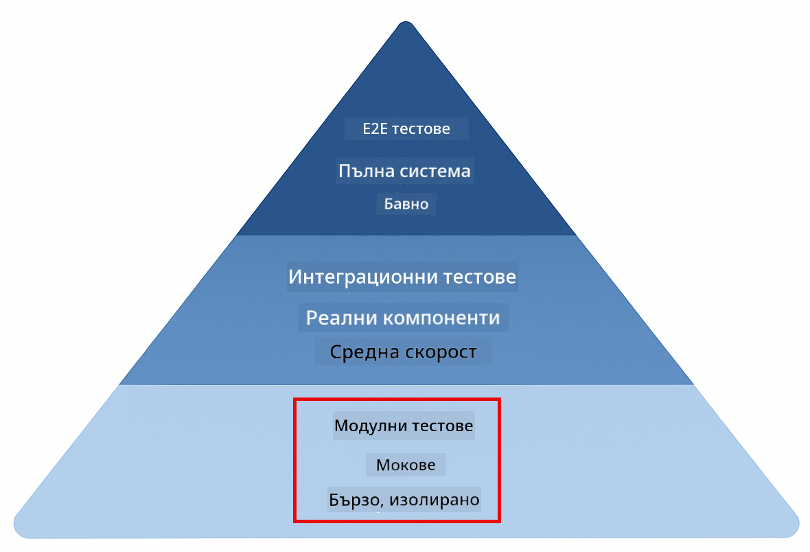
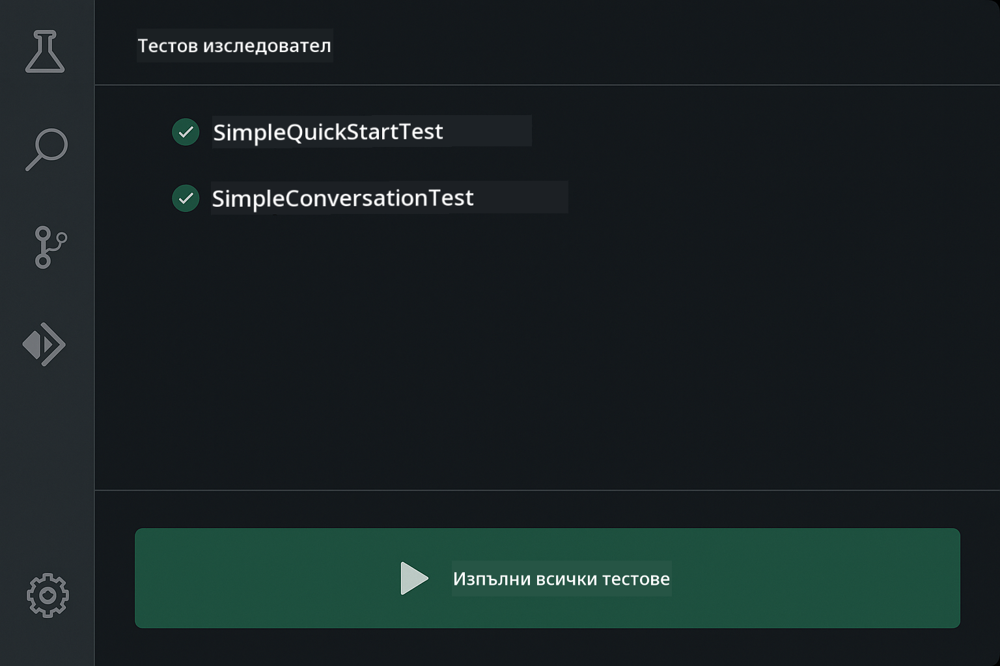
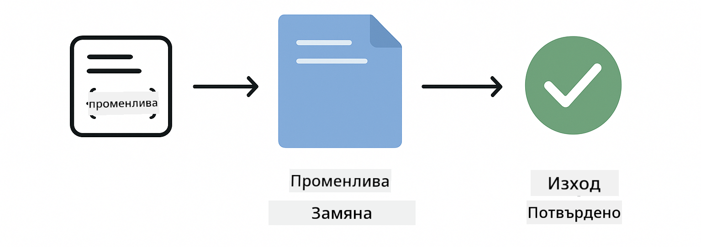
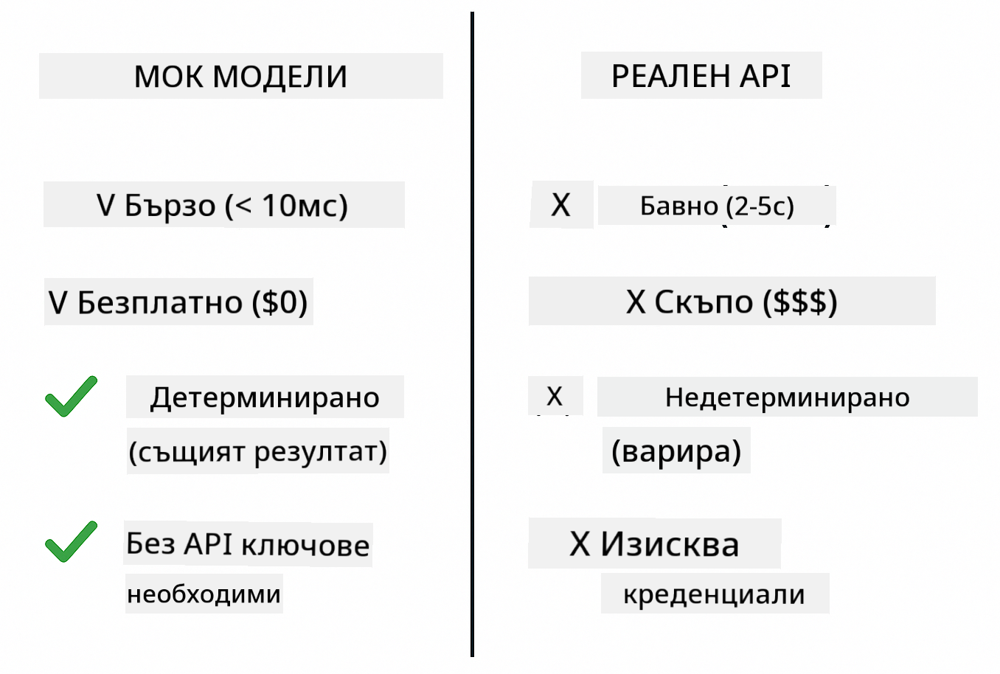
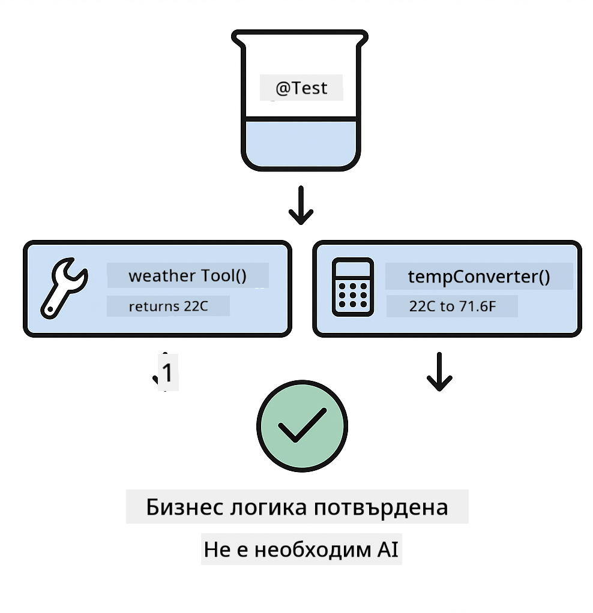
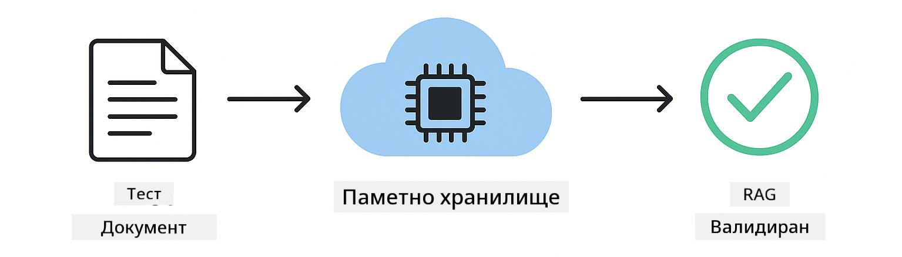

<!--
CO_OP_TRANSLATOR_METADATA:
{
  "original_hash": "ed93b3c14d58734ac10162967da958c1",
  "translation_date": "2025-12-31T05:11:20+00:00",
  "source_file": "docs/TESTING.md",
  "language_code": "bg"
}
-->
# Тестване на приложения LangChain4j

## Съдържание

- [Бърз старт](../../../docs)
- [Какво покриват тестовете](../../../docs)
- [Изпълнение на тестовете](../../../docs)
- [Изпълнение на тестове в VS Code](../../../docs)
- [Шаблони за тестване](../../../docs)
- [Философия на тестването](../../../docs)
- [Следващи стъпки](../../../docs)

Този наръчник ви води през тестовете, които демонстрират как да тествате AI приложения без да са необходими API ключове или външни услуги.

## Quick Start

Изпълнете всички тестове с една команда:

**Bash:**
```bash
mvn test
```

**PowerShell:**
```powershell
mvn --% test
```


*Успешно изпълнение на тестовете, показващо всички преминали тестове без нито една грешка*

## What the Tests Cover

Този курс се фокусира върху **модулни тестове** които се изпълняват локално. Всеки тест демонстрира специфична концепция на LangChain4j в изолация.



*Пирамида на тестването, показваща баланса между модулните тестове (бързи, изолирани), интеграционните тестове (реални компоненти) и end-to-end тестовете. Това обучение покрива модулното тестване.*

| Модул | Тестове | Фокус | Основни файлове |
|--------|-------|-------|-----------|
| **00 - Бърз старт** | 6 | Шаблони на подсказки и заместване на променливи | `SimpleQuickStartTest.java` |
| **01 - Въведение** | 8 | Памет на разговора и чат със състояние | `SimpleConversationTest.java` |
| **02 - Създаване на подсказки** | 12 | Шаблони за GPT-5, нива на инициативност, структурирани изходи | `SimpleGpt5PromptTest.java` |
| **03 - RAG** | 10 | Въвеждане на документи, вграждания (embeddings), търсене по сходство | `DocumentServiceTest.java` |
| **04 - Инструменти** | 12 | Извикване на функции и свързване на инструменти | `SimpleToolsTest.java` |
| **05 - MCP** | 8 | Model Context Protocol с транспорт чрез stdio | `SimpleMcpTest.java` |

## Изпълнение на тестовете

**Стартирайте всички тестове от кореновата директория:**

**Bash:**
```bash
mvn test
```

**PowerShell:**
```powershell
mvn --% test
```

**Стартирайте тестове за конкретен модул:**

**Bash:**
```bash
cd 01-introduction && mvn test
# Или от root
mvn test -pl 01-introduction
```

**PowerShell:**
```powershell
cd 01-introduction; mvn --% test
# Или от root
mvn --% test -pl 01-introduction
```

**Стартирайте един клас тестове:**

**Bash:**
```bash
mvn test -Dtest=SimpleConversationTest
```

**PowerShell:**
```powershell
mvn --% test -Dtest=SimpleConversationTest
```

**Стартирайте конкретен метод на тест:**

**Bash:**
```bash
mvn test -Dtest=SimpleConversationTest#трябва да запазва историята на разговора
```

**PowerShell:**
```powershell
mvn --% test -Dtest=SimpleConversationTest#трябва да поддържа историята на разговора
```

## Изпълнение на тестове в VS Code

Ако използвате Visual Studio Code, Test Explorer предоставя графичен интерфейс за стартиране и дебъгване на тестове.



*VS Code Test Explorer показва дървото с тестовете с всички Java тестови класове и индивидуални тестови методи*

**За да стартирате тестове в VS Code:**

1. Отворете Test Explorer като кликнете върху иконата с колба в Activity Bar
2. Разширете дървото на тестовете, за да видите всички модули и тестови класове
3. Кликнете върху бутона за изпълнение до всеки тест, за да го стартирате поотделно
4. Кликнете "Run All Tests" за да изпълните целия набор
5. Десен клик върху всеки тест и изберете "Debug Test", за да зададете прекъсвания и да стъпите през кода

Test Explorer показва зелени отметки за преминали тестове и предоставя подробни съобщения за грешки при провали.

## Шаблони за тестване

### Патерн 1: Тестване на шаблони за подсказки

Най-простият шаблон тества шаблоните за подсказки без да извиква какъвто и да е AI модел. Проверявате, че заместването на променливи работи правилно и подсказките са форматирани както се очаква.



*Тестване на шаблони за подсказки, показващо поток на заместване на променливи: шаблон с плейсхолдери → прилагане на стойности → проверка на форматирания изход*

```java
@Test
@DisplayName("Should format prompt template with variables")
void testPromptTemplateFormatting() {
    PromptTemplate template = PromptTemplate.from(
        "Best time to visit {{destination}} for {{activity}}?"
    );
    
    Prompt prompt = template.apply(Map.of(
        "destination", "Paris",
        "activity", "sightseeing"
    ));
    
    assertThat(prompt.text()).isEqualTo("Best time to visit Paris for sightseeing?");
}
```

Този тест се намира в `00-quick-start/src/test/java/com/example/langchain4j/quickstart/SimpleQuickStartTest.java`.

**Стартирайте го:**

**Bash:**
```bash
cd 00-quick-start && mvn test -Dtest=SimpleQuickStartTest#тест на форматирането на шаблона за промпт
```

**PowerShell:**
```powershell
cd 00-quick-start; mvn --% test -Dtest=SimpleQuickStartTest#Тест на форматирането на шаблона за подсказки
```

### Патерн 2: Мокване на езикови модели

Когато тествате логиката на разговора, използвайте Mockito за създаване на фалшиви модели, които връщат предварително зададени отговори. Това прави тестовете бързи, безплатни и детерминирани.



*Сравнение, показващо защо моковете са предпочитани за тестване: те са бързи, безплатни, детерминирани и не изискват API ключове*

```java
@ExtendWith(MockitoExtension.class)
class SimpleConversationTest {
    
    private ConversationService conversationService;
    
    @Mock
    private OpenAiOfficialChatModel mockChatModel;
    
    @BeforeEach
    void setUp() {
        ChatResponse mockResponse = ChatResponse.builder()
            .aiMessage(AiMessage.from("This is a test response"))
            .build();
        when(mockChatModel.chat(anyList())).thenReturn(mockResponse);
        
        conversationService = new ConversationService(mockChatModel);
    }
    
    @Test
    void shouldMaintainConversationHistory() {
        String conversationId = conversationService.startConversation();
        
        ChatResponse mockResponse1 = ChatResponse.builder()
            .aiMessage(AiMessage.from("Response 1"))
            .build();
        ChatResponse mockResponse2 = ChatResponse.builder()
            .aiMessage(AiMessage.from("Response 2"))
            .build();
        ChatResponse mockResponse3 = ChatResponse.builder()
            .aiMessage(AiMessage.from("Response 3"))
            .build();
        
        when(mockChatModel.chat(anyList()))
            .thenReturn(mockResponse1)
            .thenReturn(mockResponse2)
            .thenReturn(mockResponse3);

        conversationService.chat(conversationId, "First message");
        conversationService.chat(conversationId, "Second message");
        conversationService.chat(conversationId, "Third message");

        List<ChatMessage> history = conversationService.getHistory(conversationId);
        assertThat(history).hasSize(6); // 3 съобщения от потребителя + 3 съобщения от ИИ
    }
}
```

Този шаблон се появява в `01-introduction/src/test/java/com/example/langchain4j/service/SimpleConversationTest.java`. Мокът осигурява последователно поведение, така че да можете да проверите правилното управление на паметта.

### Патерн 3: Тестване на изолация на разговори

Паметта на разговорите трябва да държи множество потребители разделени. Този тест проверява, че разговорите не смесват контекстите.


*Тестване на изолация на разговори, показващо отделни хранилища за памет за различни потребители, за да се предотврати смесване на контекстите*

```java
@Test
void shouldIsolateConversationsByid() {
    String conv1 = conversationService.startConversation();
    String conv2 = conversationService.startConversation();
    
    ChatResponse mockResponse = ChatResponse.builder()
        .aiMessage(AiMessage.from("Response"))
        .build();
    when(mockChatModel.chat(anyList())).thenReturn(mockResponse);

    conversationService.chat(conv1, "Message for conversation 1");
    conversationService.chat(conv2, "Message for conversation 2");

    List<ChatMessage> history1 = conversationService.getHistory(conv1);
    List<ChatMessage> history2 = conversationService.getHistory(conv2);
    
    assertThat(history1).hasSize(2);
    assertThat(history2).hasSize(2);
}
```

Всеки разговор поддържа собствена независима история. В производствени системи тази изолация е критична за много-потребителски приложения.

### Патерн 4: Тестване на инструменти независимо

Инструментите са функции, които AI може да извика. Тествайте ги директно, за да се уверите, че работят правилно независимо от решенията на AI.



*Тестване на инструменти независимо, показващо мок изпълнение на инструмент без повиквания към AI за проверка на бизнес логиката*

```java
@Test
void shouldConvertCelsiusToFahrenheit() {
    TemperatureTool tempTool = new TemperatureTool();
    String result = tempTool.celsiusToFahrenheit(25.0);
    assertThat(result).containsPattern("77[.,]0°F");
}

@Test
void shouldDemonstrateToolChaining() {
    WeatherTool weatherTool = new WeatherTool();
    TemperatureTool tempTool = new TemperatureTool();

    String weatherResult = weatherTool.getCurrentWeather("Seattle");
    assertThat(weatherResult).containsPattern("\\d+°C");

    String conversionResult = tempTool.celsiusToFahrenheit(22.0);
    assertThat(conversionResult).containsPattern("71[.,]6°F");
}
```

Тези тестове от `04-tools/src/test/java/com/example/langchain4j/agents/tools/SimpleToolsTest.java` валидират логиката на инструментите без намеса на AI. Примерът със свързване показва как изходът от един инструмент се подава като вход към друг.

### Патерн 5: In-Memory RAG тестване

RAG системите традиционно изискват векторни бази данни и embedding услуги. In-memory шаблонът ви позволява да тествате целия пайплайн без външни зависимости.



*In-memory RAG тестване, показващо парсване на документи, съхранение на вграждания и търсене по сходство без нужда от база данни*

```java
@Test
void testProcessTextDocument() {
    String content = "This is a test document.\nIt has multiple lines.";
    InputStream inputStream = new ByteArrayInputStream(content.getBytes(StandardCharsets.UTF_8));
    
    DocumentService.ProcessedDocument result = 
        documentService.processDocument(inputStream, "test.txt");

    assertNotNull(result);
    assertTrue(result.segments().size() > 0);
    assertEquals("test.txt", result.segments().get(0).metadata().getString("filename"));
}
```

Този тест от `03-rag/src/test/java/com/example/langchain4j/rag/service/DocumentServiceTest.java` създава документ в паметта и проверява чънкинг и обработка на метаданни.

### Патерн 6: MCP интеграционно тестване

MCP модулът тества интеграцията на Model Context Protocol, използвайки stdio транспорт. Тези тестове проверяват, че вашето приложение може да стартира и да комуникира с MCP сървъри като подпроцеси.

Тестовете в `05-mcp/src/test/java/com/example/langchain4j/mcp/SimpleMcpTest.java` валидират поведението на MCP клиента.

**Стартирайте ги:**

**Bash:**
```bash
cd 05-mcp && mvn test
```

**PowerShell:**
```powershell
cd 05-mcp; mvn --% test
```

## Философия на тестването

Тествайте кода си, а не AI-то. Вашите тестове трябва да валидират кода, който пишете, като проверяват как са конструирани подсказките, как се управлява паметта и как се изпълняват инструментите. Отговорите на AI варират и не би трябвало да бъдат част от твърденията в тестовете. Попитайте себе си дали шаблонът на подсказката правилно замества променливите, а не дали AI дава правилния отговор.

Използвайте мокове за езиковите модели. Те са външни зависимости, които са бавни, скъпи и недетерминирани. Мокването прави тестовете бързи (милисекунди вместо секунди), безплатни (без API разходи) и детерминирани (със същия резултат всеки път).

Дръжте тестовете независими. Всеки тест трябва да създава собствените си данни, да не разчита на други тестове и да почиства след себе си. Тестовете трябва да преминават независимо от реда на изпълнение.

Тествайте крайни случаи, а не само успешните пътища. Опитайте празни входове, много големи входове, специални символи, невалидни параметри и гранични условия. Те често разкриват бъгове, които нормалната употреба не изважда наяве.

Използвайте описателни имена. Сравнете `shouldMaintainConversationHistoryAcrossMultipleMessages()` с `test1()`. Първото ви казва точно какво се тества, което прави отстраняването на грешки много по-лесно.

## Следващи стъпки

Сега, когато разбирате шаблоните за тестване, вникнете по-задълбочено във всеки модул:

- **[00 - Бърз старт](../00-quick-start/README.md)** - Започнете с основите на шаблоните за подсказки
- **[01 - Въведение](../01-introduction/README.md)** - Научете управление на паметта на разговори
- **[02 - Създаване на подсказки](../02-prompt-engineering/README.md)** - Усвоете шаблоните за GPT-5
- **[03 - RAG](../03-rag/README.md)** - Сградете системи за retrieval-augmented generation
- **[04 - Инструменти](../04-tools/README.md)** - Реализирайте извикване на функции и вериги от инструменти
- **[05 - MCP](../05-mcp/README.md)** - Интегрирайте Model Context Protocol

README файловете на всеки модул предоставят подробни обяснения на концепциите, тествани тук.

---

**Navigation:** [← Обратно към основното](../README.md)

---

<!-- CO-OP TRANSLATOR DISCLAIMER START -->
Отказ от отговорност:
Този документ е преведен с помощта на услуга за превод с изкуствен интелект [Co-op Translator](https://github.com/Azure/co-op-translator). Въпреки че се стремим към точност, моля, имайте предвид, че автоматичните преводи могат да съдържат грешки или неточности. Оригиналният документ на оригиналния език трябва да се счита за авторитетен източник. За критична информация се препоръчва професионален човешки превод. Не носим отговорност за никакви недоразумения или погрешни тълкувания, възникнали вследствие на използването на този превод.
<!-- CO-OP TRANSLATOR DISCLAIMER END -->