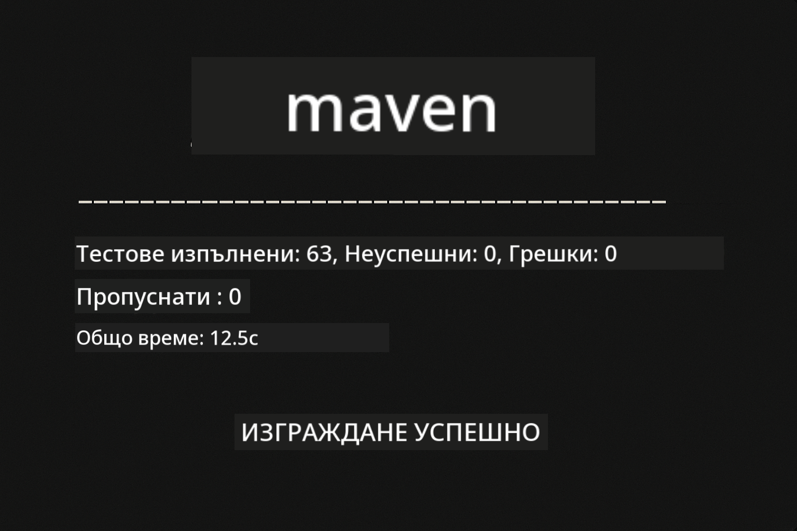
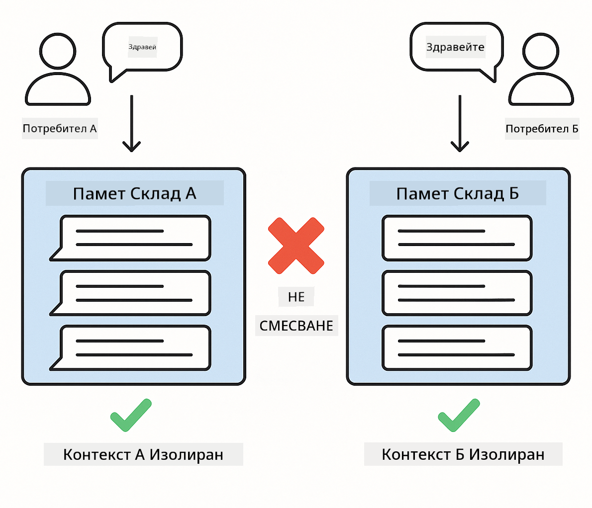
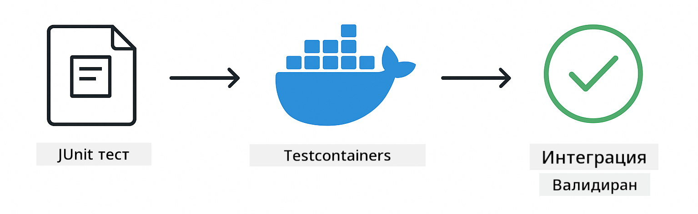

<!--
CO_OP_TRANSLATOR_METADATA:
{
  "original_hash": "b975537560c404d5f254331832811e78",
  "translation_date": "2025-12-13T21:24:12+00:00",
  "source_file": "docs/TESTING.md",
  "language_code": "bg"
}
-->
# Тестване на LangChain4j приложения

## Съдържание

- [Бърз старт](../../../docs)
- [Какво покриват тестовете](../../../docs)
- [Стартиране на тестовете](../../../docs)
- [Стартиране на тестове във VS Code](../../../docs)
- [Тестови модели](../../../docs)
- [Философия на тестването](../../../docs)
- [Следващи стъпки](../../../docs)

Това ръководство ви превежда през тестовете, които демонстрират как да тествате AI приложения без да са необходими API ключове или външни услуги.

## Бърз старт

Стартирайте всички тестове с една команда:

**Bash:**
```bash
mvn test
```

**PowerShell:**
```powershell
mvn --% test
```



*Успешно изпълнение на тестове, показващо всички тестове преминават без грешки*

## Какво покриват тестовете

Този курс се фокусира върху **unit тестове**, които се изпълняват локално. Всеки тест демонстрира конкретна концепция на LangChain4j в изолация.


*Пирамида на тестването, показваща баланса между unit тестове (бързи, изолирани), интеграционни тестове (реални компоненти) и end-to-end тестове (пълна система с Docker). Това обучение покрива unit тестване.*

| Модул | Тестове | Фокус | Ключови файлове |
|--------|-------|-------|-----------|
| **00 - Бърз старт** | 6 | Шаблони за подканване и заместване на променливи | `SimpleQuickStartTest.java` |
| **01 - Въведение** | 8 | Памет на разговор и състояние на чат | `SimpleConversationTest.java` |
| **02 - Проектиране на подканване** | 12 | GPT-5 модели, нива на ентусиазъм, структурирано изходно съдържание | `SimpleGpt5PromptTest.java` |
| **03 - RAG** | 10 | Въвеждане на документи, вграждания, търсене по сходство | `DocumentServiceTest.java` |
| **04 - Инструменти** | 12 | Извикване на функции и свързване на инструменти | `SimpleToolsTest.java` |
| **05 - MCP** | 15 | Model Context Protocol с Docker | `SimpleMcpTest.java`, `McpDockerTransportTest.java` |

## Стартиране на тестовете

**Стартирайте всички тестове от корена:**

**Bash:**
```bash
mvn test
```

**PowerShell:**
```powershell
mvn --% test
```

**Стартиране на тестове за конкретен модул:**

**Bash:**
```bash
cd 01-introduction && mvn test
# Или от корена
mvn test -pl 01-introduction
```

**PowerShell:**
```powershell
cd 01-introduction; mvn --% test
# Или от корена
mvn --% test -pl 01-introduction
```

**Стартиране на един тест клас:**

**Bash:**
```bash
mvn test -Dtest=SimpleConversationTest
```

**PowerShell:**
```powershell
mvn --% test -Dtest=SimpleConversationTest
```

**Стартиране на конкретен тест метод:**

**Bash:**
```bash
mvn test -Dtest=SimpleConversationTest#трябва да се поддържа история на разговора
```

**PowerShell:**
```powershell
mvn --% test -Dtest=SimpleConversationTest#трябва да се поддържа история на разговора
```

## Стартиране на тестове във VS Code

Ако използвате Visual Studio Code, Test Explorer предоставя графичен интерфейс за стартиране и отстраняване на грешки на тестове.


*Test Explorer във VS Code показва дървото на тестовете с всички Java тест класове и отделни тест методи*

**За да стартирате тестове във VS Code:**

1. Отворете Test Explorer, като кликнете върху иконата с мензура в Activity Bar
2. Разгънете дървото на тестовете, за да видите всички модули и тест класове
3. Кликнете върху бутона за пускане до всеки тест, за да го стартирате индивидуално
4. Кликнете "Run All Tests", за да изпълните целия набор
5. Кликнете с десен бутон върху тест и изберете "Debug Test", за да зададете точки на прекъсване и да стъпвате през кода

Test Explorer показва зелени отметки за преминали тестове и предоставя подробни съобщения за грешки при провал.

## Тестови модели


*Шест тестови модела за LangChain4j приложения: шаблони за подканване, мокиране на модели, изолация на разговор, тестване на инструменти, in-memory RAG и интеграция с Docker*

### Модел 1: Тестване на шаблони за подканване

Най-простият модел тества шаблони за подканване без да извиква AI модел. Проверявате дали заместването на променливи работи правилно и подканите са форматирани както се очаква.


*Тестване на шаблони за подканване, показващо поток на заместване на променливи: шаблон с плейсхолдъри → приложени стойности → проверен форматиран изход*

```java
@Test
@DisplayName("Should format prompt template with variables")
void testPromptTemplateFormatting() {
    PromptTemplate template = PromptTemplate.from(
        "Best time to visit {{destination}} for {{activity}}?"
    );
    
    Prompt prompt = template.apply(Map.of(
        "destination", "Paris",
        "activity", "sightseeing"
    ));
    
    assertThat(prompt.text()).isEqualTo("Best time to visit Paris for sightseeing?");
}
```

Този тест се намира в `00-quick-start/src/test/java/com/example/langchain4j/quickstart/SimpleQuickStartTest.java`.

**Стартирайте го:**

**Bash:**
```bash
cd 00-quick-start && mvn test -Dtest=SimpleQuickStartTest#тестване на форматирането на шаблона за подканване
```

**PowerShell:**
```powershell
cd 00-quick-start; mvn --% test -Dtest=SimpleQuickStartTest#тестване на форматирането на шаблона за подканване
```

### Модел 2: Мокиране на езикови модели

При тестване на логиката на разговор използвайте Mockito за създаване на фалшиви модели, които връщат предварително зададени отговори. Това прави тестовете бързи, безплатни и детерминирани.


*Сравнение, показващо защо моковете са предпочитани за тестване: те са бързи, безплатни, детерминирани и не изискват API ключове*

```java
@ExtendWith(MockitoExtension.class)
class SimpleConversationTest {
    
    private ConversationService conversationService;
    
    @Mock
    private OpenAiOfficialChatModel mockChatModel;
    
    @BeforeEach
    void setUp() {
        ChatResponse mockResponse = ChatResponse.builder()
            .aiMessage(AiMessage.from("This is a test response"))
            .build();
        when(mockChatModel.chat(anyList())).thenReturn(mockResponse);
        
        conversationService = new ConversationService(mockChatModel);
    }
    
    @Test
    void shouldMaintainConversationHistory() {
        String conversationId = conversationService.startConversation();
        
        ChatResponse mockResponse1 = ChatResponse.builder()
            .aiMessage(AiMessage.from("Response 1"))
            .build();
        ChatResponse mockResponse2 = ChatResponse.builder()
            .aiMessage(AiMessage.from("Response 2"))
            .build();
        ChatResponse mockResponse3 = ChatResponse.builder()
            .aiMessage(AiMessage.from("Response 3"))
            .build();
        
        when(mockChatModel.chat(anyList()))
            .thenReturn(mockResponse1)
            .thenReturn(mockResponse2)
            .thenReturn(mockResponse3);

        conversationService.chat(conversationId, "First message");
        conversationService.chat(conversationId, "Second message");
        conversationService.chat(conversationId, "Third message");

        List<ChatMessage> history = conversationService.getHistory(conversationId);
        assertThat(history).hasSize(6); // 3 съобщения от потребител + 3 съобщения от AI
    }
}
```

Този модел се появява в `01-introduction/src/test/java/com/example/langchain4j/service/SimpleConversationTest.java`. Мокът осигурява последователно поведение, за да можете да проверите дали управлението на паметта работи правилно.

### Модел 3: Тестване на изолация на разговор

Паметта на разговора трябва да държи отделни потребители разделени. Този тест проверява, че разговорите не смесват контексти.



*Тестване на изолация на разговор, показващо отделни хранилища на памет за различни потребители, за да се предотврати смесване на контексти*

```java
@Test
void shouldIsolateConversationsByid() {
    String conv1 = conversationService.startConversation();
    String conv2 = conversationService.startConversation();
    
    ChatResponse mockResponse = ChatResponse.builder()
        .aiMessage(AiMessage.from("Response"))
        .build();
    when(mockChatModel.chat(anyList())).thenReturn(mockResponse);

    conversationService.chat(conv1, "Message for conversation 1");
    conversationService.chat(conv2, "Message for conversation 2");

    List<ChatMessage> history1 = conversationService.getHistory(conv1);
    List<ChatMessage> history2 = conversationService.getHistory(conv2);
    
    assertThat(history1).hasSize(2);
    assertThat(history2).hasSize(2);
}
```

Всеки разговор поддържа своя независима история. В производствени системи тази изолация е критична за мултипотребителски приложения.

### Модел 4: Тестване на инструменти независимо

Инструментите са функции, които AI може да извиква. Тествайте ги директно, за да сте сигурни, че работят правилно независимо от решенията на AI.


*Тестване на инструменти независимо, показващо изпълнение на мок инструмент без AI извиквания, за да се провери бизнес логиката*

```java
@Test
void shouldConvertCelsiusToFahrenheit() {
    TemperatureTool tempTool = new TemperatureTool();
    String result = tempTool.celsiusToFahrenheit(25.0);
    assertThat(result).containsPattern("77[.,]0°F");
}

@Test
void shouldDemonstrateToolChaining() {
    WeatherTool weatherTool = new WeatherTool();
    TemperatureTool tempTool = new TemperatureTool();

    String weatherResult = weatherTool.getCurrentWeather("Seattle");
    assertThat(weatherResult).containsPattern("\\d+°C");

    String conversionResult = tempTool.celsiusToFahrenheit(22.0);
    assertThat(conversionResult).containsPattern("71[.,]6°F");
}
```

Тези тестове от `04-tools/src/test/java/com/example/langchain4j/agents/tools/SimpleToolsTest.java` валидират логиката на инструментите без намесата на AI. Примерът с веригата показва как изходът на един инструмент се подава като вход на друг.

### Модел 5: Тестване на in-memory RAG

RAG системите традиционно изискват векторни бази данни и embedding услуги. Моделът in-memory ви позволява да тествате целия процес без външни зависимости.


*Работен процес на in-memory RAG тестване, показващ парсване на документи, съхранение на embedding и търсене по сходство без нужда от база данни*

```java
@Test
void testProcessTextDocument() {
    String content = "This is a test document.\nIt has multiple lines.";
    InputStream inputStream = new ByteArrayInputStream(content.getBytes(StandardCharsets.UTF_8));
    
    DocumentService.ProcessedDocument result = 
        documentService.processDocument(inputStream, "test.txt");

    assertNotNull(result);
    assertTrue(result.segments().size() > 0);
    assertEquals("test.txt", result.segments().get(0).metadata().getString("filename"));
}
```

Този тест от `03-rag/src/test/java/com/example/langchain4j/rag/service/DocumentServiceTest.java` създава документ в паметта и проверява разделянето на части и обработката на метаданни.

### Модел 6: Интеграционно тестване с Docker

Някои функции изискват реална инфраструктура. MCP модулът използва Testcontainers за стартиране на Docker контейнери за интеграционни тестове. Те валидират, че кодът ви работи с реални услуги, като същевременно поддържат изолация на тестовете.



*Интеграционно тестване на MCP с Testcontainers, показващо автоматизиран жизнен цикъл на контейнера: стартиране, изпълнение на тестове, спиране и почистване*

Тестовете в `05-mcp/src/test/java/com/example/langchain4j/mcp/McpDockerTransportTest.java` изискват Docker да е стартиран.

**Стартирайте ги:**

**Bash:**
```bash
cd 05-mcp && mvn test
```

**PowerShell:**
```powershell
cd 05-mcp; mvn --% test
```

## Философия на тестването

Тествайте вашия код, не AI. Вашите тестове трябва да валидират кода, който пишете, като проверяват как се конструират подканите, как се управлява паметта и как се изпълняват инструментите. Отговорите на AI варират и не трябва да са част от твърденията в тестовете. Попитайте се дали вашият шаблон за подканване правилно замества променливите, а не дали AI дава правилния отговор.

Използвайте мокове за езикови модели. Те са външни зависимости, които са бавни, скъпи и недетерминирани. Мокирането прави тестовете бързи с милисекунди вместо секунди, безплатни без разходи за API и детерминирани с един и същ резултат всеки път.

Дръжте тестовете независими. Всеки тест трябва да създава собствените си данни, да не разчита на други тестове и да почиства след себе си. Тестовете трябва да преминават независимо от реда на изпълнение.

Тествайте гранични случаи извън щастливия път. Опитайте празни входове, много големи входове, специални символи, невалидни параметри и гранични условия. Те често разкриват бъгове, които нормалната употреба не показва.

Използвайте описателни имена. Сравнете `shouldMaintainConversationHistoryAcrossMultipleMessages()` с `test1()`. Първото ви казва точно какво се тества, което прави отстраняването на грешки много по-лесно.

## Следващи стъпки

Сега, когато разбирате тестовите модели, навлезте по-дълбоко във всеки модул:

- **[00 - Бърз старт](../00-quick-start/README.md)** - Започнете с основите на шаблоните за подканване
- **[01 - Въведение](../01-introduction/README.md)** - Научете управление на паметта на разговорите
- **[02 - Проектиране на подканване](../02-prompt-engineering/README.md)** - Овладейте GPT-5 модели за подканване
- **[03 - RAG](../03-rag/README.md)** - Изградете системи за генериране с обогатяване чрез извличане
- **[04 - Инструменти](../04-tools/README.md)** - Имплементирайте извикване на функции и вериги от инструменти
- **[05 - MCP](../05-mcp/README.md)** - Интегрирайте Model Context Protocol с Docker

README файловете на всеки модул предоставят подробни обяснения на концепциите, тествани тук.

---

**Навигация:** [← Обратно към Основното](../README.md)

---

<!-- CO-OP TRANSLATOR DISCLAIMER START -->
**Отказ от отговорност**:
Този документ е преведен с помощта на AI преводаческа услуга [Co-op Translator](https://github.com/Azure/co-op-translator). Въпреки че се стремим към точност, моля, имайте предвид, че автоматизираните преводи могат да съдържат грешки или неточности. Оригиналният документ на неговия роден език трябва да се счита за авторитетен източник. За критична информация се препоръчва професионален човешки превод. Ние не носим отговорност за каквито и да е недоразумения или неправилни тълкувания, произтичащи от използването на този превод.
<!-- CO-OP TRANSLATOR DISCLAIMER END -->