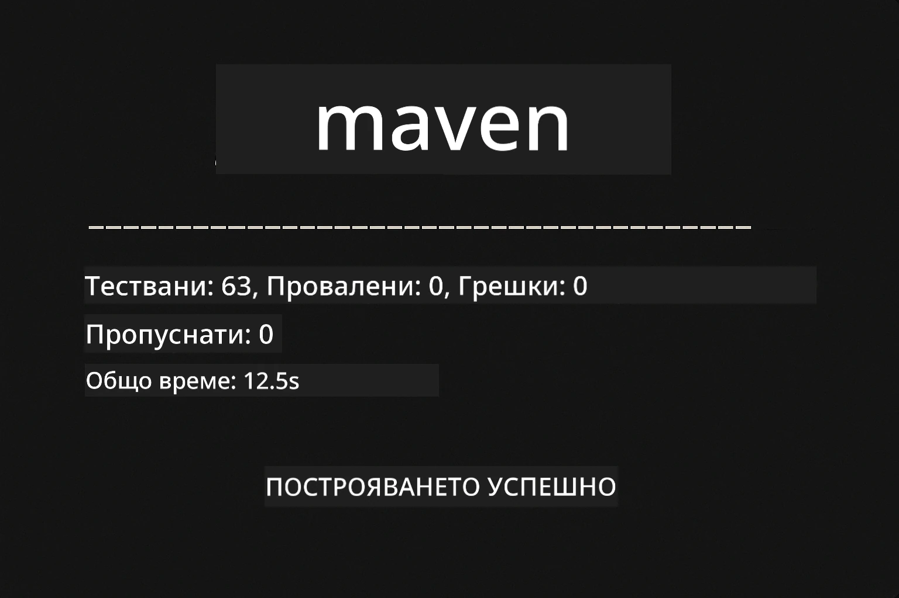
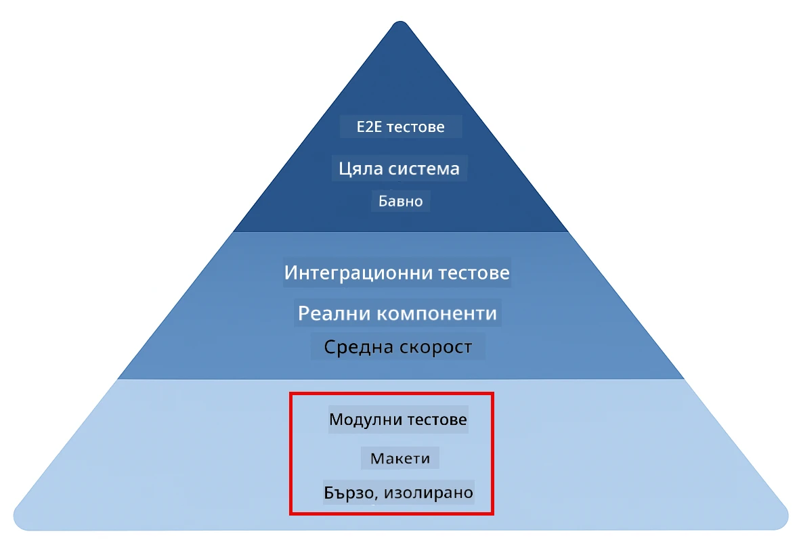
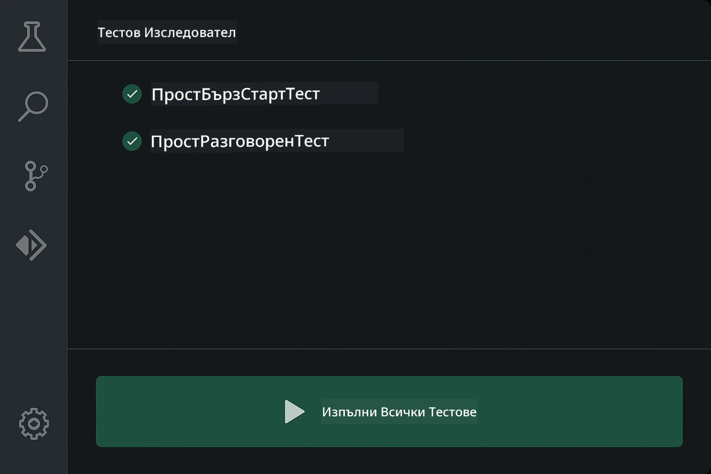
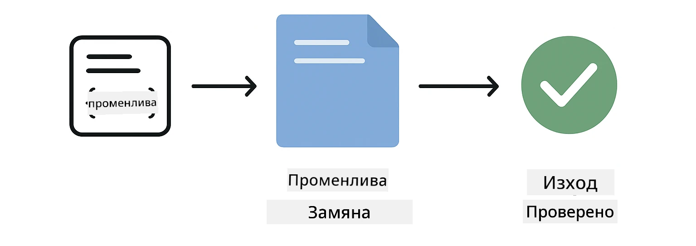
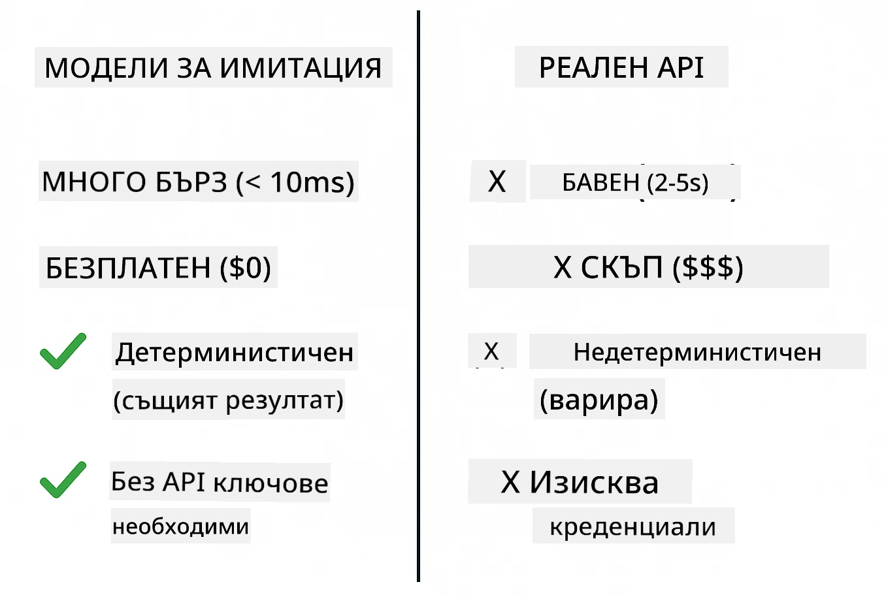
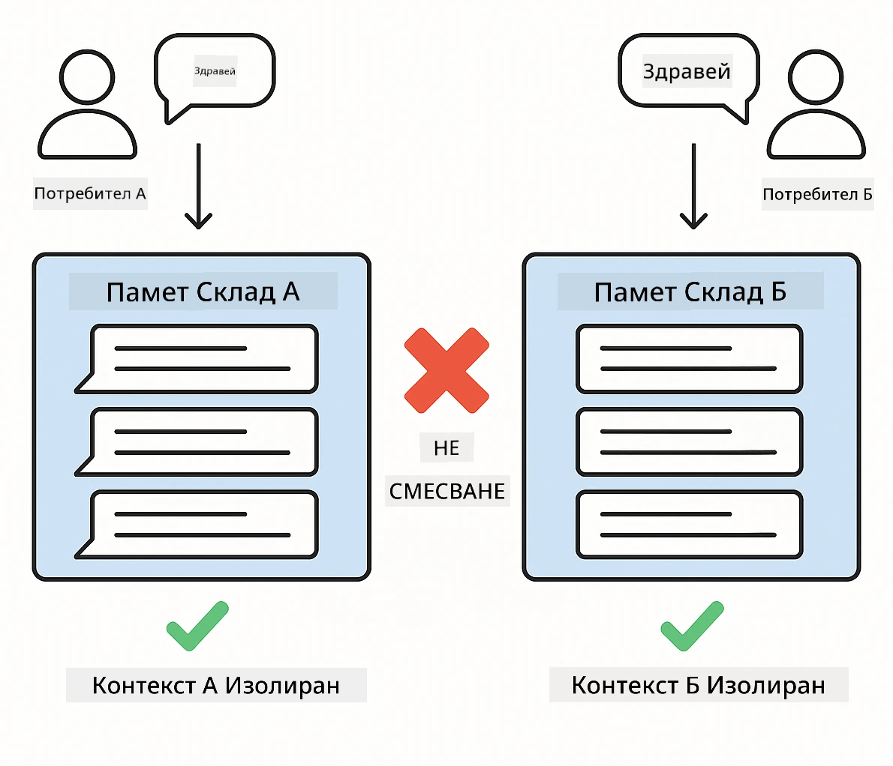
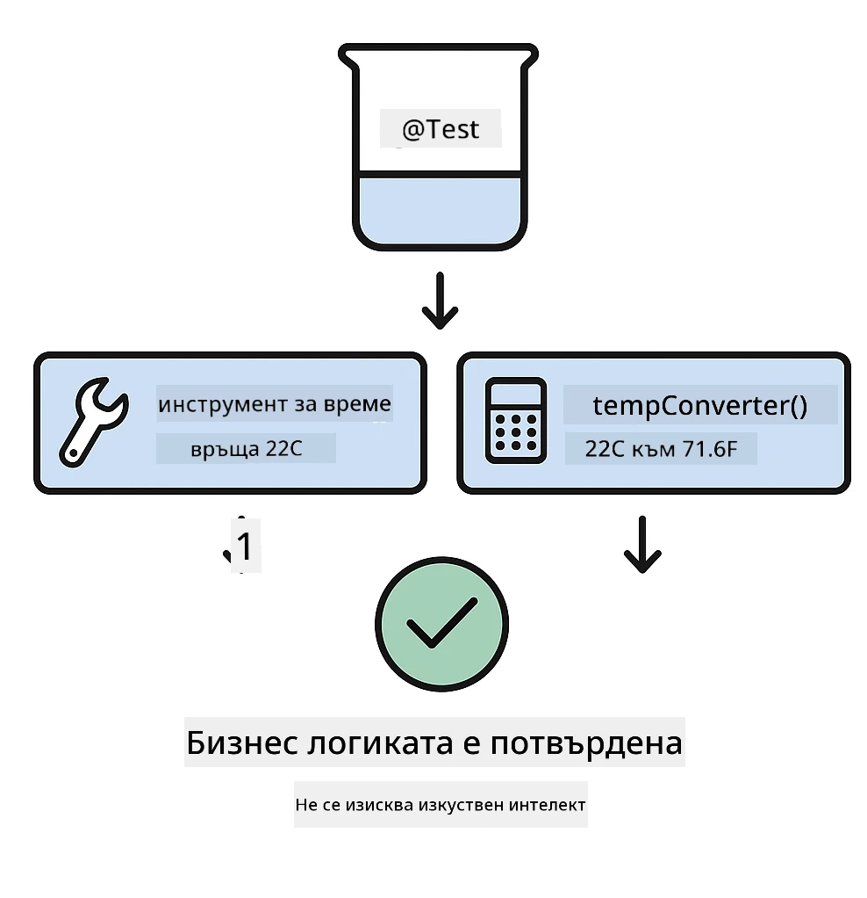
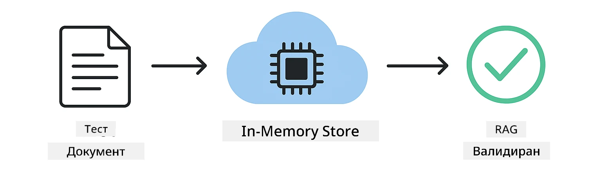

# Тестване на приложения LangChain4j

## Съдържание

- [Бърз старт](#бърз-старт)
- [Какво покриват тестовете](#какво-покриват-тестовете)
- [Стартиране на тестовете](#стартиране-на-тестовете)
- [Стартиране на тестове в VS Code](#стартиране-на-тестове-в-vs-code)
- [Патерни за тестване](#патерни-за-тестване)
- [Философия на тестването](#философия-на-тестването)
- [Следващи стъпки](#следващи-стъпки)

Този наръчник ви води през тестовете, които демонстрират как да тествате AI приложения без нужда от API ключове или външни услуги.

## Бърз старт

Стартирайте всички тестове с една команда:

**Bash:**
```bash
mvn test
```

**PowerShell:**
```powershell
mvn --% test
```

Когато всички тестове преминат, трябва да видите изход подобен на екрана по-долу – тестовете се изпълняват без грешки.



*Успешно изпълнение на тестовете показва всички тестове с нулеви грешки*

## Какво покриват тестовете

Този курс се фокусира върху **юнит тестове**, които се изпълняват локално. Всеки тест демонстрира конкретна концепция на LangChain4j изолирано. Пирамидата на тестване по-долу показва къде се вписват юнит тестовете — те образуват бързата и надеждна основа, върху която се гради останалата част от стратегията за тестване.



*Пирамида на тестването показва баланса между юнит тестове (бързи, изолирани), интеграционни тестове (реални компоненти) и end-to-end тестове. Това обучение покрива юнит тестване.*

| Модул | Тестове | Фокус | Ключови файлове |
|--------|-------|-------|-----------|
| **01 - Въведение** | 8 | Памет за разговор и състояние на чат | `SimpleConversationTest.java` |
| **02 - Проектиране на подсказки** | 12 | GPT-5.2 патерни, нива на желаност, структурирано изходно съдържание | `SimpleGpt5PromptTest.java` |
| **03 - RAG** | 10 | Въвеждане на документи, embeddings, търсене по сходство | `DocumentServiceTest.java` |
| **04 - Инструменти** | 12 | Извикване на функции и свързване на инструменти | `SimpleToolsTest.java` |
| **05 - MCP** | 8 | Протокол за контекст на модел с Stdio транспорт | `SimpleMcpTest.java` |

## Стартиране на тестовете

**Стартирайте всички тестове от основната директория:**

**Bash:**
```bash
mvn test
```

**PowerShell:**
```powershell
mvn --% test
```

**Стартиране на тестове за конкретен модул:**

**Bash:**
```bash
cd 01-introduction && mvn test
# Или от корена
mvn test -pl 01-introduction
```

**PowerShell:**
```powershell
cd 01-introduction; mvn --% test
# Или от корена
mvn --% test -pl 01-introduction
```

**Стартиране на единичен тестов клас:**

**Bash:**
```bash
mvn test -Dtest=SimpleConversationTest
```

**PowerShell:**
```powershell
mvn --% test -Dtest=SimpleConversationTest
```

**Стартиране на конкретен тестов метод:**

**Bash:**
```bash
mvn test -Dtest=SimpleConversationTest#трябваДаСеПоддържаИсторияНаРазговорите
```

**PowerShell:**
```powershell
mvn --% test -Dtest=SimpleConversationTest#трябва да се поддържа история на разговора
```

## Стартиране на тестове в VS Code

Ако използвате Visual Studio Code, Test Explorer предоставя графичен интерфейс за стартиране и отстраняване на грешки в тестовете.



*Test Explorer на VS Code показва дървото на тестовете с всички Java тестови класове и индивидуални тестови методи*

**За да стартирате тестове в VS Code:**

1. Отворете Test Explorer, като кликнете върху иконата на химикалка в лентата с активности
2. Разгънете дървото с тестове, за да видите всички модули и тестови класове
3. Кликнете бутона за пускане до всеки тест, за да го стартирате индивидуално
4. Кликнете "Run All Tests", за да изпълните всички тестове
5. Щракнете с десен бутон върху тест и изберете "Debug Test", за да зададете прекъсвания и да стъпвате през кода

Test Explorer показва зелени отметки за преминали тестове и дава подробни съобщения за грешки при неуспешни тестове.

## Патерни за тестване

### Патерн 1: Тестване на шаблони за подсказки

Най-простият патерн тества шаблони за подсказки, без да извиква AI модел. Потвърждавате, че заместването на променливи работи правилно и подсказките са форматирани както се очаква.



*Тестване на шаблони за подсказки показва поток на заместване на променливи: шаблон с плейсхолдъри → приложени стойности → проверен форматиран изход*

```java
@Test
@DisplayName("Should format prompt template with variables")
void testPromptTemplateFormatting() {
    PromptTemplate template = PromptTemplate.from(
        "Best time to visit {{destination}} for {{activity}}?"
    );
    
    Prompt prompt = template.apply(Map.of(
        "destination", "Paris",
        "activity", "sightseeing"
    ));
    
    assertThat(prompt.text()).isEqualTo("Best time to visit Paris for sightseeing?");
}
```

Този патерн потвърждава, че заместването на променливи работи правилно и подсказките са форматирани както се очаква — не се изисква API ключ или извикване на модел.

### Патерн 2: Мокване на езикови модели

При тестване на логиката на разговор използвайте Mockito за създаване на фалшиви модели, които връщат предварително зададени отговори. Това прави тестовете бързи, безплатни и детерминистични.



*Сравнение показва защо моковете са предпочитани за тестване: те са бързи, безплатни, детерминистични и не изискват API ключове*

```java
@ExtendWith(MockitoExtension.class)
class SimpleConversationTest {
    
    private ConversationService conversationService;
    
    @Mock
    private OpenAiOfficialChatModel mockChatModel;
    
    @BeforeEach
    void setUp() {
        ChatResponse mockResponse = ChatResponse.builder()
            .aiMessage(AiMessage.from("This is a test response"))
            .build();
        when(mockChatModel.chat(anyList())).thenReturn(mockResponse);
        
        conversationService = new ConversationService(mockChatModel);
    }
    
    @Test
    void shouldMaintainConversationHistory() {
        String conversationId = conversationService.startConversation();
        
        ChatResponse mockResponse1 = ChatResponse.builder()
            .aiMessage(AiMessage.from("Response 1"))
            .build();
        ChatResponse mockResponse2 = ChatResponse.builder()
            .aiMessage(AiMessage.from("Response 2"))
            .build();
        ChatResponse mockResponse3 = ChatResponse.builder()
            .aiMessage(AiMessage.from("Response 3"))
            .build();
        
        when(mockChatModel.chat(anyList()))
            .thenReturn(mockResponse1)
            .thenReturn(mockResponse2)
            .thenReturn(mockResponse3);

        conversationService.chat(conversationId, "First message");
        conversationService.chat(conversationId, "Second message");
        conversationService.chat(conversationId, "Third message");

        List<ChatMessage> history = conversationService.getHistory(conversationId);
        assertThat(history).hasSize(6); // 3 съобщения от потребител + 3 съобщения от AI
    }
}
```

Този патерн се среща в `01-introduction/src/test/java/com/example/langchain4j/service/SimpleConversationTest.java`. Мокът гарантира последователно поведение, за да може да проверите, че управлението на паметта работи правилно.

### Патерн 3: Тестване на изолацията на разговора

Паметта за разговор трябва да поддържа отделни масиви за множество потребители. Този тест потвърждава, че разговорите не смесват контексти.



*Тестване на изолацията на разговора показва отделни хранилища за памет за различни потребители, за да се предотврати смесването на контексти*

```java
@Test
void shouldIsolateConversationsByid() {
    String conv1 = conversationService.startConversation();
    String conv2 = conversationService.startConversation();
    
    ChatResponse mockResponse = ChatResponse.builder()
        .aiMessage(AiMessage.from("Response"))
        .build();
    when(mockChatModel.chat(anyList())).thenReturn(mockResponse);

    conversationService.chat(conv1, "Message for conversation 1");
    conversationService.chat(conv2, "Message for conversation 2");

    List<ChatMessage> history1 = conversationService.getHistory(conv1);
    List<ChatMessage> history2 = conversationService.getHistory(conv2);
    
    assertThat(history1).hasSize(2);
    assertThat(history2).hasSize(2);
}
```

Всеки разговор поддържа собствена независима история. В производствени системи тази изолация е критична за многопотребителски приложения.

### Патерн 4: Самостоятелно тестване на инструменти

Инструментите са функции, които AI може да извика. Тествайте ги директно, за да сте сигурни, че работят правилно независимо от решенията на AI.



*Самостоятелно тестване на инструменти показва изпълнение на мок инструменти без AI извиквания, за да се валидира бизнес логиката*

```java
@Test
void shouldConvertCelsiusToFahrenheit() {
    TemperatureTool tempTool = new TemperatureTool();
    String result = tempTool.celsiusToFahrenheit(25.0);
    assertThat(result).containsPattern("77[.,]0°F");
}

@Test
void shouldDemonstrateToolChaining() {
    WeatherTool weatherTool = new WeatherTool();
    TemperatureTool tempTool = new TemperatureTool();

    String weatherResult = weatherTool.getCurrentWeather("Seattle");
    assertThat(weatherResult).containsPattern("\\d+°C");

    String conversionResult = tempTool.celsiusToFahrenheit(22.0);
    assertThat(conversionResult).containsPattern("71[.,]6°F");
}
```

Тези тестове от `04-tools/src/test/java/com/example/langchain4j/agents/tools/SimpleToolsTest.java` валидират логиката на инструментите без AI включване. Примерът с веригата показва как изходът на един инструмент се подава като вход на друг.

### Патерн 5: Тестване на RAG в паметта

Системите RAG обикновено изискват векторни бази данни и embedding услуги. Патернът в паметта ви позволява да тествате цялата верига без външни зависимости.



*Работен процес на тестване на RAG в паметта, показващ парсване на документи, съхранение на embeddings и търсене по сходство без нужда от база данни*

```java
@Test
void testProcessTextDocument() {
    String content = "This is a test document.\nIt has multiple lines.";
    InputStream inputStream = new ByteArrayInputStream(content.getBytes(StandardCharsets.UTF_8));
    
    DocumentService.ProcessedDocument result = 
        documentService.processDocument(inputStream, "test.txt");

    assertNotNull(result);
    assertTrue(result.segments().size() > 0);
    assertEquals("test.txt", result.segments().get(0).metadata().getString("filename"));
}
```

Този тест от `03-rag/src/test/java/com/example/langchain4j/rag/service/DocumentServiceTest.java` създава документ в паметта и проверява разбиването на части и обработката на метаданни.

### Патерн 6: Интеграционно тестване на MCP

Модулът MCP тества интеграцията на Протокола за контекст на модел с помощта на stdio транспорт. Тези тестове потвърждават, че вашето приложение може да стартира и комуникира с MCP сървъри като подпроцеси.

Тестовете в `05-mcp/src/test/java/com/example/langchain4j/mcp/SimpleMcpTest.java` валидират поведението на MCP клиента.

**Стартирайте ги:**

**Bash:**
```bash
cd 05-mcp && mvn test
```

**PowerShell:**
```powershell
cd 05-mcp; mvn --% test
```

## Философия на тестването

Тествайте вашия код, не AI. Вашите тестове трябва да валидират кода, който пишете, като проверяват как са конструирани подсказките, как се управлява паметта и как се изпълняват инструментите. Отговорите на AI варират и не трябва да бъдат част от твърденията в тестовете. Попитайте се дали вашият шаблон за подсказка правилно замества променливите, а не дали AI дава правилния отговор.

Използвайте мокове за езиковите модели. Те са външни зависимости, които са бавни, скъпи и недетерминистични. Мокването прави тестовете бързи с милисекунди вместо секунди, безплатни без разходи за API и детерминистични с един и същ резултат всеки път.

Дръжте тестовете независими. Всеки тест трябва да създава собствените си данни, да не разчита на други тестове и да се почиства след себе си. Тестовете трябва да минават независимо от реда на изпълнение.

Тествайте крайни случаи извън успешния път. Пробвайте празни входове, много големи входове, специални символи, невалидни параметри и гранични условия. Те често разкриват бъгове, които нормалната употреба не показва.

Използвайте описателни имена. Сравнете `shouldMaintainConversationHistoryAcrossMultipleMessages()` с `test1()`. Първото ви казва точно какво се тества, което прави отстраняването на грешки много по-лесно.

## Следващи стъпки

Сега, когато разбирате патерните за тестване, навлезте по-дълбоко във всеки модул:

- **[01 - Въведение](../01-introduction/README.md)** - Научете управление на паметта за разговори
- **[02 - Проектиране на подсказки](../02/prompt-engineering/README.md)** - Овладейте патерните за подсказки на GPT-5.2
- **[03 - RAG](../03-rag/README.md)** - Строите системи за генериране с помощта на извличане
- **[04 - Инструменти](../04-tools/README.md)** - Имплементирайте извикване на функции и вериги от инструменти
- **[05 - MCP](../05-mcp/README.md)** - Интегрирайте Протокола за контекст на модел

README файловете на всеки модул предоставят подробни обяснения на концепциите, тестващи се тук.

---

**Навигация:** [← Обратно към Основната страница](../README.md)

---

<!-- CO-OP TRANSLATOR DISCLAIMER START -->
**Отказ от отговорност**:
Този документ е преведен с помощта на AI преводачески услуга [Co-op Translator](https://github.com/Azure/co-op-translator). Въпреки че се стремим към точност, моля имайте предвид, че автоматизираните преводи могат да съдържат грешки или неточности. Оригиналният документ на неговия роден език трябва да се счита за авторитетен източник. За критична информация се препоръчва професионален човешки превод. Ние не носим отговорност за каквито и да е недоразумения или неправилни тълкувания, произтичащи от използването на този превод.
<!-- CO-OP TRANSLATOR DISCLAIMER END -->