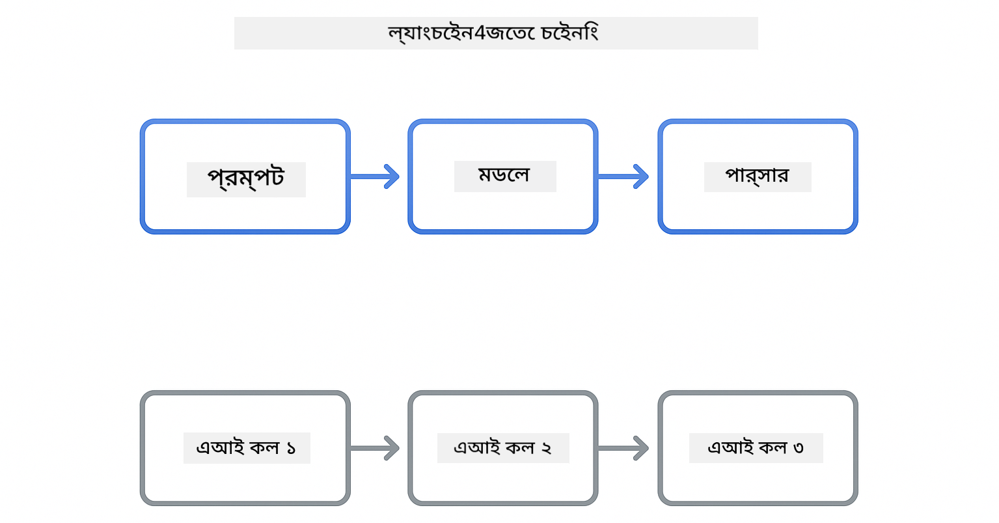
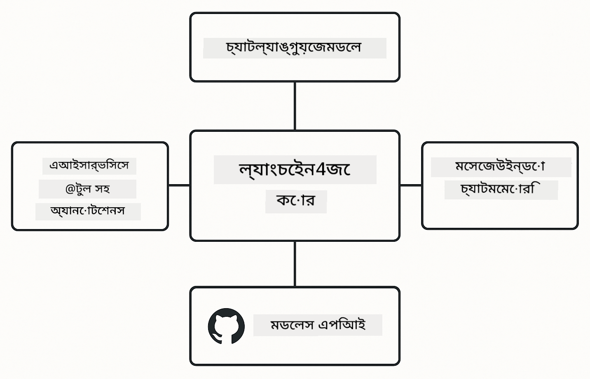

<!--
CO_OP_TRANSLATOR_METADATA:
{
  "original_hash": "377b3e3e6f8d02965bf0fbbc9ccb45c5",
  "translation_date": "2025-12-13T14:44:40+00:00",
  "source_file": "00-quick-start/README.md",
  "language_code": "bn"
}
-->
# Module 00: দ্রুত শুরু

## বিষয়বস্তু সূচি

- [পরিচিতি](../../../00-quick-start)
- [LangChain4j কী?](../../../00-quick-start)
- [LangChain4j নির্ভরশীলতা](../../../00-quick-start)
- [প্রয়োজনীয়তা](../../../00-quick-start)
- [সেটআপ](../../../00-quick-start)
  - [1. আপনার GitHub টোকেন পান](../../../00-quick-start)
  - [2. আপনার টোকেন সেট করুন](../../../00-quick-start)
- [উদাহরণগুলি চালান](../../../00-quick-start)
  - [1. বেসিক চ্যাট](../../../00-quick-start)
  - [2. প্রম্পট প্যাটার্ন](../../../00-quick-start)
  - [3. ফাংশন কলিং](../../../00-quick-start)
  - [4. ডকুমেন্ট প্রশ্নোত্তর (RAG)](../../../00-quick-start)
- [প্রতিটি উদাহরণ কী দেখায়](../../../00-quick-start)
- [পরবর্তী ধাপ](../../../00-quick-start)
- [সমস্যা সমাধান](../../../00-quick-start)

## পরিচিতি

এই দ্রুত শুরু আপনাকে LangChain4j দিয়ে যত দ্রুত সম্ভব কাজ শুরু করতে সাহায্য করার জন্য তৈরি। এটি LangChain4j এবং GitHub মডেল ব্যবহার করে AI অ্যাপ্লিকেশন তৈরি করার মৌলিক বিষয়গুলি কভার করে। পরবর্তী মডিউলগুলোতে আপনি Azure OpenAI ব্যবহার করে LangChain4j দিয়ে আরও উন্নত অ্যাপ্লিকেশন তৈরি করবেন।

## LangChain4j কী?

LangChain4j একটি জাভা লাইব্রেরি যা AI-চালিত অ্যাপ্লিকেশন তৈরি করা সহজ করে তোলে। HTTP ক্লায়েন্ট এবং JSON পার্সিং নিয়ে কাজ করার পরিবর্তে, আপনি পরিষ্কার জাভা API দিয়ে কাজ করেন।

LangChain এর "চেইন" মানে একাধিক উপাদান একসাথে যুক্ত করা - আপনি একটি প্রম্পটকে একটি মডেল, তারপর একটি পার্সারে চেইন করতে পারেন, অথবা একাধিক AI কল একসাথে চেইন করতে পারেন যেখানে একটি আউটপুট পরবর্তী ইনপুটে যায়। এই দ্রুত শুরু মৌলিক বিষয়গুলোর উপর ফোকাস করে, জটিল চেইনগুলো অনুসন্ধানের আগে।



*LangChain4j-তে উপাদান চেইনিং - বিল্ডিং ব্লকগুলো সংযুক্ত হয়ে শক্তিশালী AI ওয়ার্কফ্লো তৈরি করে*

আমরা তিনটি মূল উপাদান ব্যবহার করব:

**ChatLanguageModel** - AI মডেল ইন্টারঅ্যাকশনের জন্য ইন্টারফেস। `model.chat("prompt")` কল করুন এবং একটি রেসপন্স স্ট্রিং পান। আমরা `OpenAiOfficialChatModel` ব্যবহার করি যা OpenAI-সঙ্গত এন্ডপয়েন্ট যেমন GitHub মডেলের সাথে কাজ করে।

**AiServices** - টাইপ-সেফ AI সার্ভিস ইন্টারফেস তৈরি করে। মেথড ডিফাইন করুন, সেগুলোকে `@Tool` দিয়ে অ্যানোটেট করুন, এবং LangChain4j অর্কেস্ট্রেশন পরিচালনা করে। AI স্বয়ংক্রিয়ভাবে আপনার জাভা মেথডগুলো প্রয়োজন অনুযায়ী কল করে।

**MessageWindowChatMemory** - কথোপকথনের ইতিহাস সংরক্ষণ করে। এটি ছাড়া প্রতিটি অনুরোধ স্বাধীন। এটি থাকলে AI পূর্বের মেসেজ মনে রাখে এবং একাধিক টার্ন জুড়ে প্রসঙ্গ বজায় রাখে।



*LangChain4j আর্কিটেকচার - মূল উপাদানগুলো একসাথে কাজ করে আপনার AI অ্যাপ্লিকেশন চালায়*

## LangChain4j নির্ভরশীলতা

এই দ্রুত শুরুতে [`pom.xml`](../../../00-quick-start/pom.xml) এ দুইটি Maven নির্ভরশীলতা ব্যবহার করা হয়েছে:

```xml
<!-- Core LangChain4j library -->
<dependency>
    <groupId>dev.langchain4j</groupId>
    <artifactId>langchain4j</artifactId> <!-- Inherited from BOM in root pom.xml -->
</dependency>

<!-- OpenAI integration (works with GitHub Models) -->
<dependency>
    <groupId>dev.langchain4j</groupId>
    <artifactId>langchain4j-open-ai-official</artifactId> <!-- Inherited from BOM in root pom.xml -->
</dependency>
```

`langchain4j-open-ai-official` মডিউলটি `OpenAiOfficialChatModel` ক্লাস প্রদান করে যা OpenAI-সঙ্গত API-র সাথে সংযোগ করে। GitHub মডেল একই API ফরম্যাট ব্যবহার করে, তাই কোনো বিশেষ অ্যাডাপ্টার দরকার নেই - শুধু বেস URL `https://models.github.ai/inference` এ নির্দেশ করুন।

## প্রয়োজনীয়তা

**ডেভ কন্টেইনার ব্যবহার করছেন?** জাভা এবং মেভেন ইতিমধ্যে ইনস্টল করা আছে। আপনার শুধু একটি GitHub পার্সোনাল অ্যাক্সেস টোকেন দরকার।

**লোকাল ডেভেলপমেন্ট:**
- জাভা ২১+, মেভেন ৩.৯+
- GitHub পার্সোনাল অ্যাক্সেস টোকেন (নির্দেশনাগুলো নিচে)

> **দ্রষ্টব্য:** এই মডিউল GitHub মডেলের `gpt-4.1-nano` ব্যবহার করে। কোডে মডেল নাম পরিবর্তন করবেন না - এটি GitHub এর উপলব্ধ মডেলের সাথে কাজ করার জন্য কনফিগার করা হয়েছে।

## সেটআপ

### 1. আপনার GitHub টোকেন পান

1. যান [GitHub Settings → Personal Access Tokens](https://github.com/settings/personal-access-tokens)
2. "Generate new token" ক্লিক করুন
3. একটি বর্ণনামূলক নাম দিন (যেমন, "LangChain4j Demo")
4. মেয়াদ নির্ধারণ করুন (৭ দিন সুপারিশকৃত)
5. "Account permissions" এর মধ্যে "Models" খুঁজে সেট করুন "Read-only"
6. "Generate token" ক্লিক করুন
7. আপনার টোকেন কপি করে সংরক্ষণ করুন - এটি আর দেখানো হবে না

### 2. আপনার টোকেন সেট করুন

**অপশন ১: VS Code ব্যবহার (সুপারিশকৃত)**

যদি আপনি VS Code ব্যবহার করেন, আপনার টোকেন প্রজেক্ট রুটে `.env` ফাইলে যোগ করুন:

যদি `.env` ফাইল না থাকে, `.env.example` থেকে `.env` কপি করুন অথবা নতুন `.env` ফাইল তৈরি করুন।

**উদাহরণ `.env` ফাইল:**
```bash
# /workspaces/LangChain4j-for-Beginners/.env এ
GITHUB_TOKEN=your_token_here
```

তারপর আপনি সহজেই এক্সপ্লোরারে যেকোনো ডেমো ফাইলে (যেমন, `BasicChatDemo.java`) রাইট-ক্লিক করে **"Run Java"** নির্বাচন করতে পারেন অথবা রান এবং ডিবাগ প্যানেল থেকে লঞ্চ কনফিগারেশন ব্যবহার করতে পারেন।

**অপশন ২: টার্মিনাল ব্যবহার**

টোকেনকে পরিবেশ ভেরিয়েবল হিসেবে সেট করুন:

**Bash:**
```bash
export GITHUB_TOKEN=your_token_here
```

**PowerShell:**
```powershell
$env:GITHUB_TOKEN=your_token_here
```

## উদাহরণগুলি চালান

**VS Code ব্যবহার:** এক্সপ্লোরারে যেকোনো ডেমো ফাইলে রাইট-ক্লিক করে **"Run Java"** নির্বাচন করুন, অথবা রান এবং ডিবাগ প্যানেল থেকে লঞ্চ কনফিগারেশন ব্যবহার করুন (প্রথমে `.env` ফাইলে টোকেন যোগ করা নিশ্চিত করুন)।

**Maven ব্যবহার:** বিকল্পভাবে, কমান্ড লাইনে চালাতে পারেন:

### 1. বেসিক চ্যাট

**Bash:**
```bash
mvn compile exec:java -Dexec.mainClass=com.example.langchain4j.quickstart.BasicChatDemo
```

**PowerShell:**
```powershell
mvn --% compile exec:java -Dexec.mainClass=com.example.langchain4j.quickstart.BasicChatDemo
```

### 2. প্রম্পট প্যাটার্ন

**Bash:**
```bash
mvn compile exec:java -Dexec.mainClass=com.example.langchain4j.quickstart.PromptEngineeringDemo
```

**PowerShell:**
```powershell
mvn --% compile exec:java -Dexec.mainClass=com.example.langchain4j.quickstart.PromptEngineeringDemo
```

জিরো-শট, ফিউ-শট, চেইন-অফ-থট, এবং রোল-ভিত্তিক প্রম্পটিং দেখায়।

### 3. ফাংশন কলিং

**Bash:**
```bash
mvn compile exec:java -Dexec.mainClass=com.example.langchain4j.quickstart.ToolIntegrationDemo
```

**PowerShell:**
```powershell
mvn --% compile exec:java -Dexec.mainClass=com.example.langchain4j.quickstart.ToolIntegrationDemo
```

AI স্বয়ংক্রিয়ভাবে আপনার জাভা মেথডগুলো প্রয়োজন অনুযায়ী কল করে।

### 4. ডকুমেন্ট প্রশ্নোত্তর (RAG)

**Bash:**
```bash
mvn compile exec:java -Dexec.mainClass=com.example.langchain4j.quickstart.SimpleReaderDemo
```

**PowerShell:**
```powershell
mvn --% compile exec:java -Dexec.mainClass=com.example.langchain4j.quickstart.SimpleReaderDemo
```

`document.txt` এর বিষয়বস্তু সম্পর্কে প্রশ্ন করুন।

## প্রতিটি উদাহরণ কী দেখায়

**বেসিক চ্যাট** - [BasicChatDemo.java](../../../00-quick-start/src/main/java/com/example/langchain4j/quickstart/BasicChatDemo.java)

এখান থেকে শুরু করুন LangChain4j এর সবচেয়ে সহজ রূপ দেখতে। আপনি একটি `OpenAiOfficialChatModel` তৈরি করবেন, `.chat()` দিয়ে প্রম্পট পাঠাবেন, এবং একটি রেসপন্স পাবেন। এটি দেখায় কিভাবে কাস্টম এন্ডপয়েন্ট এবং API কী দিয়ে মডেল ইনিশিয়ালাইজ করতে হয়। একবার এই প্যাটার্ন বুঝে গেলে, বাকিটা তার উপর ভিত্তি করে তৈরি হয়।

```java
ChatLanguageModel model = OpenAiOfficialChatModel.builder()
    .baseUrl("https://models.github.ai/inference")
    .apiKey(System.getenv("GITHUB_TOKEN"))
    .modelName("gpt-4.1-nano")
    .build();

String response = model.chat("What is LangChain4j?");
System.out.println(response);
```

> **🤖 [GitHub Copilot](https://github.com/features/copilot) চ্যাট দিয়ে চেষ্টা করুন:** খুলুন [`BasicChatDemo.java`](../../../00-quick-start/src/main/java/com/example/langchain4j/quickstart/BasicChatDemo.java) এবং জিজ্ঞাসা করুন:
> - "কোডে GitHub মডেল থেকে Azure OpenAI তে কিভাবে সুইচ করব?"
> - "OpenAiOfficialChatModel.builder() এ আর কি কি প্যারামিটার কনফিগার করা যায়?"
> - "সম্পূর্ণ রেসপন্সের জন্য অপেক্ষা না করে স্ট্রিমিং রেসপন্স কিভাবে যোগ করব?"

**প্রম্পট ইঞ্জিনিয়ারিং** - [PromptEngineeringDemo.java](../../../00-quick-start/src/main/java/com/example/langchain4j/quickstart/PromptEngineeringDemo.java)

এখন আপনি জানেন কিভাবে মডেলের সাথে কথা বলতে হয়, চলুন দেখি আপনি মডেলকে কী বলেন। এই ডেমো একই মডেল সেটআপ ব্যবহার করে কিন্তু চারটি ভিন্ন প্রম্পট প্যাটার্ন দেখায়। সরাসরি নির্দেশনার জন্য জিরো-শট প্রম্পট, উদাহরণ থেকে শেখার জন্য ফিউ-শট, যুক্তি ধাপ প্রকাশের জন্য চেইন-অফ-থট, এবং প্রসঙ্গ নির্ধারণের জন্য রোল-ভিত্তিক প্রম্পট চেষ্টা করুন। আপনি দেখবেন একই মডেল কীভাবে আপনার অনুরোধের ফ্রেমিং অনুযায়ী নাটকীয়ভাবে ভিন্ন ফলাফল দেয়।

```java
PromptTemplate template = PromptTemplate.from(
    "What's the best time to visit {{destination}} for {{activity}}?"
);

Prompt prompt = template.apply(Map.of(
    "destination", "Paris",
    "activity", "sightseeing"
));

String response = model.chat(prompt.text());
```

> **🤖 [GitHub Copilot](https://github.com/features/copilot) চ্যাট দিয়ে চেষ্টা করুন:** খুলুন [`PromptEngineeringDemo.java`](../../../00-quick-start/src/main/java/com/example/langchain4j/quickstart/PromptEngineeringDemo.java) এবং জিজ্ঞাসা করুন:
> - "জিরো-শট এবং ফিউ-শট প্রম্পটিং এর মধ্যে পার্থক্য কী, এবং কখন কোনটি ব্যবহার করব?"
> - "তাপমাত্রা প্যারামিটার মডেলের রেসপন্সে কীভাবে প্রভাব ফেলে?"
> - "প্রোডাকশনে প্রম্পট ইনজেকশন আক্রমণ প্রতিরোধের কিছু কৌশল কী?"
> - "সাধারণ প্যাটার্নের জন্য পুনঃব্যবহারযোগ্য PromptTemplate অবজেক্ট কিভাবে তৈরি করব?"

**টুল ইন্টিগ্রেশন** - [ToolIntegrationDemo.java](../../../00-quick-start/src/main/java/com/example/langchain4j/quickstart/ToolIntegrationDemo.java)

এখানেই LangChain4j শক্তিশালী হয়। আপনি `AiServices` ব্যবহার করে একটি AI সহকারী তৈরি করবেন যা আপনার জাভা মেথডগুলো কল করতে পারে। শুধু মেথডগুলোকে `@Tool("বর্ণনা")` দিয়ে অ্যানোটেট করুন এবং LangChain4j বাকিটা পরিচালনা করবে - AI স্বয়ংক্রিয়ভাবে ব্যবহারকারীর প্রশ্ন অনুযায়ী কোন টুল ব্যবহার করতে হবে তা নির্ধারণ করে। এটি ফাংশন কলিং দেখায়, যা AI কে শুধু প্রশ্নের উত্তর দেওয়ার পরিবর্তে কাজ করার ক্ষমতা দেয়।

```java
@Tool("Performs addition of two numeric values")
public double add(double a, double b) {
    return a + b;
}

MathAssistant assistant = AiServices.create(MathAssistant.class, model);
String response = assistant.chat("What is 25 plus 17?");
```

> **🤖 [GitHub Copilot](https://github.com/features/copilot) চ্যাট দিয়ে চেষ্টা করুন:** খুলুন [`ToolIntegrationDemo.java`](../../../00-quick-start/src/main/java/com/example/langchain4j/quickstart/ToolIntegrationDemo.java) এবং জিজ্ঞাসা করুন:
> - "@Tool অ্যানোটেশন কীভাবে কাজ করে এবং LangChain4j এর পেছনে এটি কী করে?"
> - "AI কি জটিল সমস্যা সমাধানের জন্য একাধিক টুল ক্রমান্বয়ে কল করতে পারে?"
> - "যদি কোনো টুল এক্সসেপশন ছুড়ে দেয়, তাহলে আমি কীভাবে এরর হ্যান্ডেল করব?"
> - "এই ক্যালকুলেটর উদাহরণের পরিবর্তে বাস্তব API কিভাবে ইন্টিগ্রেট করব?"

**ডকুমেন্ট প্রশ্নোত্তর (RAG)** - [SimpleReaderDemo.java](../../../00-quick-start/src/main/java/com/example/langchain4j/quickstart/SimpleReaderDemo.java)

এখানে আপনি RAG (রিট্রিভাল-অগমেন্টেড জেনারেশন) এর ভিত্তি দেখবেন। মডেলের ট্রেনিং ডেটার উপর নির্ভর করার পরিবর্তে, আপনি [`document.txt`](../../../00-quick-start/document.txt) থেকে বিষয়বস্তু লোড করে প্রম্পটে অন্তর্ভুক্ত করেন। AI আপনার ডকুমেন্টের ভিত্তিতে উত্তর দেয়, তার সাধারণ জ্ঞানের উপর নয়। এটি আপনার নিজস্ব ডেটা দিয়ে কাজ করার জন্য সিস্টেম তৈরি করার প্রথম ধাপ।

```java
Document document = FileSystemDocumentLoader.loadDocument("document.txt");
String content = document.text();

String prompt = "Based on this document: " + content + 
                "\nQuestion: What is the main topic?";
String response = model.chat(prompt);
```

> **দ্রষ্টব্য:** এই সহজ পদ্ধতিতে পুরো ডকুমেন্ট প্রম্পটে লোড হয়। বড় ফাইল (>10KB) এর জন্য আপনি প্রসঙ্গ সীমা অতিক্রম করবেন। মডিউল 03 এ প্রোডাকশন RAG সিস্টেমের জন্য চাঙ্কিং এবং ভেক্টর সার্চ কভার করা হয়েছে।

> **🤖 [GitHub Copilot](https://github.com/features/copilot) চ্যাট দিয়ে চেষ্টা করুন:** খুলুন [`SimpleReaderDemo.java`](../../../00-quick-start/src/main/java/com/example/langchain4j/quickstart/SimpleReaderDemo.java) এবং জিজ্ঞাসা করুন:
> - "RAG কিভাবে AI হ্যালুসিনেশন প্রতিরোধ করে মডেলের ট্রেনিং ডেটার তুলনায়?"
> - "এই সহজ পদ্ধতির এবং রিট্রিভালের জন্য ভেক্টর এমবেডিং ব্যবহারের মধ্যে পার্থক্য কী?"
> - "আমি কিভাবে একাধিক ডকুমেন্ট বা বড় জ্ঞানভিত্তিক ডাটাবেস পরিচালনা করার জন্য এটি স্কেল করব?"
> - "AI শুধুমাত্র প্রদত্ত প্রসঙ্গ ব্যবহার করার জন্য প্রম্পট গঠন করার সেরা পদ্ধতি কী?"

## ডিবাগিং

উদাহরণগুলোতে `.logRequests(true)` এবং `.logResponses(true)` আছে যা কনসোলে API কল দেখায়। এটি অথেনটিকেশন এরর, রেট লিমিট, বা অপ্রত্যাশিত রেসপন্স সমস্যা সমাধানে সাহায্য করে। প্রোডাকশনে লগ শব্দ কমাতে এগুলো সরিয়ে দিন।

## পরবর্তী ধাপ

**পরবর্তী মডিউল:** [01-introduction - LangChain4j এবং gpt-5 এর সাথে Azure এ শুরু](../01-introduction/README.md)

---

**নেভিগেশন:** [← প্রধান পৃষ্ঠায় ফিরে যান](../README.md) | [পরবর্তী: মডিউল 01 - পরিচিতি →](../01-introduction/README.md)

---

## সমস্যা সমাধান

### প্রথমবার Maven বিল্ড

**সমস্যা:** প্রথম `mvn clean compile` বা `mvn package` অনেক সময় নেয় (১০-১৫ মিনিট)

**কারণ:** Maven প্রথম বিল্ডে সব প্রজেক্ট নির্ভরশীলতা (Spring Boot, LangChain4j লাইব্রেরি, Azure SDK ইত্যাদি) ডাউনলোড করে।

**সমাধান:** এটি স্বাভাবিক। পরবর্তী বিল্ডগুলো অনেক দ্রুত হবে কারণ নির্ভরশীলতাগুলো লোকালি ক্যাশ হয়ে যাবে। ডাউনলোড সময় আপনার নেটওয়ার্ক স্পিডের উপর নির্ভর করে।

### PowerShell Maven কমান্ড সিনট্যাক্স

**সমস্যা:** Maven কমান্ডে `Unknown lifecycle phase ".mainClass=..."` এরর হয়

**কারণ:** PowerShell `=` কে ভেরিয়েবল অ্যাসাইনমেন্ট অপারেটর হিসেবে ব্যাখ্যা করে, Maven প্রপার্টি সিনট্যাক্স ভেঙে যায়

**সমাধান:** Maven কমান্ডের আগে স্টপ-পার্সিং অপারেটর `--%` ব্যবহার করুন:

**PowerShell:**
```powershell
mvn --% compile exec:java -Dexec.mainClass=com.example.langchain4j.quickstart.BasicChatDemo
```

**Bash:**
```bash
mvn compile exec:java -Dexec.mainClass=com.example.langchain4j.quickstart.BasicChatDemo
```

`--%` অপারেটর PowerShell কে বাকী আর্গুমেন্টগুলো Maven-এ লিটারালি পাঠাতে বলে, কোনো ব্যাখ্যা ছাড়াই।

### Windows PowerShell ইমোজি প্রদর্শন

**সমস্যা:** PowerShell এ AI রেসপন্সে ইমোজির পরিবর্তে গারবেজ ক্যারেক্টার (যেমন `????` বা `â??`) দেখায়

**কারণ:** PowerShell এর ডিফল্ট এনকোডিং UTF-8 ইমোজি সাপোর্ট করে না

**সমাধান:** জাভা অ্যাপ্লিকেশন চালানোর আগে এই কমান্ডটি চালান:
```cmd
chcp 65001
```

এটি টার্মিনালে UTF-8 এনকোডিং বাধ্যতামূলক করে। বিকল্প হিসেবে Windows Terminal ব্যবহার করুন যা ইউনিকোড সাপোর্ট ভালো।

---

<!-- CO-OP TRANSLATOR DISCLAIMER START -->
**অস্বীকৃতি**:  
এই নথিটি AI অনুবাদ সেবা [Co-op Translator](https://github.com/Azure/co-op-translator) ব্যবহার করে অনূদিত হয়েছে। আমরা যথাসাধ্য সঠিকতার চেষ্টা করি, তবে স্বয়ংক্রিয় অনুবাদে ত্রুটি বা অসঙ্গতি থাকতে পারে। মূল নথিটি তার নিজস্ব ভাষায়ই কর্তৃত্বপূর্ণ উৎস হিসেবে বিবেচিত হওয়া উচিত। গুরুত্বপূর্ণ তথ্যের জন্য পেশাদার মানব অনুবাদ গ্রহণ করার পরামর্শ দেওয়া হয়। এই অনুবাদের ব্যবহারে সৃষ্ট কোনো ভুল বোঝাবুঝি বা ভুল ব্যাখ্যার জন্য আমরা দায়ী নই।
<!-- CO-OP TRANSLATOR DISCLAIMER END -->