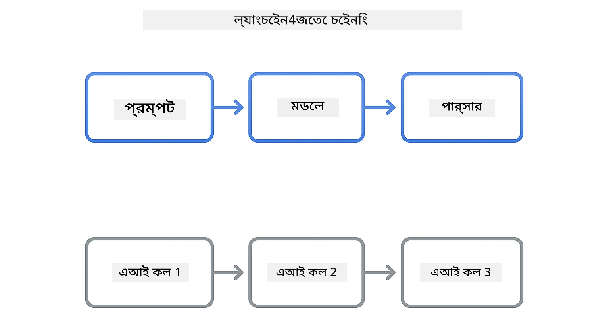
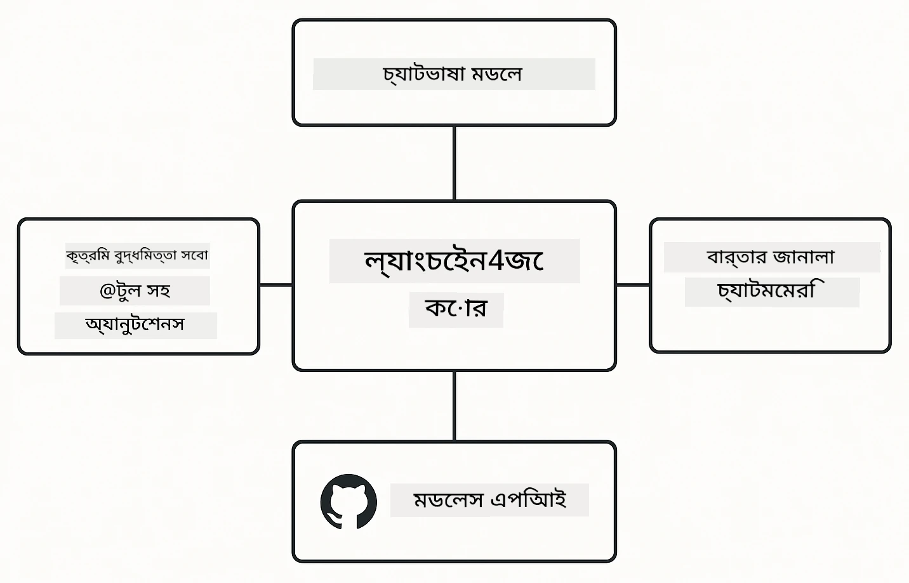

# মডিউল ০০: দ্রুত শুরু

## বিষয়সূচি

- [পরিচিতি](#পরিচিতি)
- [LangChain4j কী?](#langchain4j-কী)
- [LangChain4j নির্ভরশীলতা](#langchain4j-নির্ভরশীলতা)
- [প্রয়োজনীয়তা](#প্রয়োজনীয়তা)
- [সেটআপ](#সেটআপ)
  - [১. আপনার GitHub টোকেন পান](#১-আপনার-github-টোকেন-পান)
  - [২. আপনার টোকেন সেট করুন](#২-আপনার-টোকেন-সেট-করুন)
- [উদাহরণ চালান](#উদাহরণ-চালান)
  - [১. বেসিক চ্যাট](#১-বেসিক-চ্যাট)
  - [২. প্রম্পট প্যাটার্ন](#২-প্রম্পট-প্যাটার্ন)
  - [৩. ফাংশন কলিং](#৩-ফাংশন-কলিং)
  - [৪. ডকুমেন্ট প্রশ্নোত্তর (সহজ RAG)](#৪-ডকুমেন্ট-প্রশ্নোত্তর-সহজ-rag)
  - [৫. দায়িত্বশীল AI](#৫-দায়িত্বশীল-ai)
- [প্রতিটি উদাহরণ কী দেখায়](#প্রতিটি-উদাহরণ-কী-দেখায়)
- [পরবর্তী ধাপ](#পরবর্তী-ধাপ)
- [সমস্যা সমাধান](#সমস্যা-সমাধান)

## পরিচিতি

এই দ্রুতশুরুর উদ্দেশ্য হল LangChain4j দিয়ে যত দ্রুত সম্ভব শুরু করতে সাহায্য করা। এটি LangChain4j এবং GitHub মডেল ব্যবহার করে AI অ্যাপ্লিকেশন তৈরির মৌলিক বিষয়গুলো কভার করে। পরবর্তী মডিউলগুলোতে আপনি Azure OpenAI এবং GPT-5.2 এ বদল করবেন এবং প্রতিটি ধারণায় আরও গভীরভাবে প্রবেশ করবেন।

## LangChain4j কী?

LangChain4j একটি জাভা লাইব্রেরি যা AI চালিত অ্যাপ্লিকেশন তৈরি করা সহজ করে তোলে। HTTP ক্লায়েন্ট এবং JSON পার্সিং নিয়ে কাজ করার পরিবর্তে আপনি পরিষ্কার জাভা API ব্যবহার করেন।

LangChain এ "চেইন" বলতে একাধিক কম্পোনেন্ট একসাথে যুক্ত করা বোঝায় - আপনি একটি প্রম্পটকে একটি মডেল বা পার্সারের সাথে চেইন করতে পারেন, অথবা একাধিক AI কল একত্র করে একটির আউটপুট অন্যটির ইনপুট হিসেবে ব্যবহার করতে পারেন। এই দ্রুতশুরু মৌলিক বিষয়গুলোর উপর গুরুত্ব দেয়, জটিল চেইনগুলো অনুসন্ধানের আগে।



*LangChain4j-এর কম্পোনেন্ট চেইনিং - ব্লকগুলো যুক্ত হয়ে শক্তিশালী AI ওয়ার্কফ্লো নির্মাণ করে*

আমরা তিনটি প্রধান কম্পোনেন্ট ব্যবহার করব:

**ChatModel** - AI মডেল ইন্টারঅ্যাকশনের ইন্টারফেস। `model.chat("prompt")` কল করুন এবং একটি রেসপন্স স্ট্রিং পান। আমরা `OpenAiOfficialChatModel` ব্যবহার করি যা OpenAI-সঙ্গতিপূর্ণ এন্ডপয়েন্ট যেমন GitHub মডেলগুলোর সাথে কাজ করে।

**AiServices** - টাইপ-সেফ AI সার্ভিস ইন্টারফেস তৈরি করে। মেথডগুলো ডিফাইন করুন, `@Tool` দিয়ে অ্যানোটেট করুন, LangChain4j সংগঠন পরিচালনা করে। AI প্রয়োজন হলে আপনার জাভা মেথডগুলো স্বয়ংক্রিয়ভাবে কল করে।

**MessageWindowChatMemory** - কথোপকথনের ইতিহাস সংরক্ষণ করে। এটা না থাকলে প্রতিটি অনুরোধ স্বতন্ত্র থাকে। এটা থাকলে AI পূর্ববর্তী মেসেজ মনে রাখে এবং একাধিক রাউন্ডের মধ্যে প্রসঙ্গ বজায় রাখে।



*LangChain4j আর্কিটেকচার - মূল কম্পোনেন্টগুলো একসাথে কাজ করে আপনার AI অ্যাপ্লিকেশন চালায়*

## LangChain4j নির্ভরশীলতা

এই দ্রুতশুরুতে তিনটি Maven নির্ভরশীলতা ব্যবহার করা হয়েছে [`pom.xml`](../../../00-quick-start/pom.xml) এ:

```xml
<!-- Core LangChain4j library -->
<dependency>
    <groupId>dev.langchain4j</groupId>
    <artifactId>langchain4j</artifactId> <!-- Inherited from BOM in root pom.xml -->
</dependency>

<!-- OpenAI integration (works with GitHub Models) -->
<dependency>
    <groupId>dev.langchain4j</groupId>
    <artifactId>langchain4j-open-ai-official</artifactId> <!-- Inherited from BOM in root pom.xml -->
</dependency>

<!-- Easy RAG: automatic splitting, embedding, and retrieval -->
<dependency>
    <groupId>dev.langchain4j</groupId>
    <artifactId>langchain4j-easy-rag</artifactId> <!-- Inherited from BOM in root pom.xml -->
</dependency>
```

`langchain4j-open-ai-official` মডিউলটি `OpenAiOfficialChatModel` ক্লাস সরবরাহ করে যা OpenAI-সঙ্গতিপূর্ণ API-তে সংযোগ করে। GitHub মডেল একই API ফরম্যাট ব্যবহার করে, তাই কোনো বিশেষ অ্যাডাপ্টারের দরকার নেই - শুধু বেস URL `https://models.github.ai/inference` এ পয়েন্ট করুন।

`langchain4j-easy-rag` মডিউলটি স্বয়ংক্রিয় ডকুমেন্ট বিভাজন, এমবেডিং এবং অনুসন্ধান সরবরাহ করে যাতে আপনি ম্যানুয়ালি প্রতিটি ধাপ কনফিগার না করেই RAG অ্যাপ্লিকেশন তৈরি করতে পারেন।

## প্রয়োজনীয়তা

**ডেভ কন্টেনার ব্যবহার করছেন?** Java এবং Maven আগ থেকেই ইনস্টল করা আছে। শুধু একটি GitHub পার্সোনাল অ্যাক্সেস টোকেনের দরকার।

**লোকাল ডেভেলপমেন্ট:**
- Java 21+, Maven 3.9+
- GitHub পার্সোনাল অ্যাক্সেস টোকেন (নির্দেশনা নিচে)

> **বি:দ্রঃ** এই মডিউল GitHub মডেলের `gpt-4.1-nano` ব্যবহার করে। কোডে মডেল নাম পরিবর্তন করবেন না - এটি GitHub-এর উপলব্ধ মডেলের সাথে কাজ করার জন্য কনফিগার করা হয়েছে।

## সেটআপ

### ১. আপনার GitHub টোকেন পান

1. যান [GitHub Settings → Personal Access Tokens](https://github.com/settings/personal-access-tokens)
2. "Generate new token" ক্লিক করুন
3. বর্ণনামূলক নাম দিন (যেমন, "LangChain4j Demo")
4. মেয়াদ নির্ধারণ করুন (৭ দিন সুপারিশ করা হয়)
5. "Account permissions" এর নিচে "Models" খুঁজে সেট করুন "Read-only"
6. "Generate token" ক্লিক করুন
7. আপনার টোকেন কপি করে সংরক্ষণ করুন - এটি আবার দেখা যাবে না

### ২. আপনার টোকেন সেট করুন

**অপশন ১: VS Code ব্যবহার (সর্বোত্তম)**

আপনি যদি VS Code ব্যবহার করেন, তাহলে প্রকল্পের মূল ফোল্ডারে `.env` ফাইলে আপনার টোকেন যোগ করুন:

যদি `.env` ফাইল না থাকে, `.env.example` থেকে কপি করে `.env` তৈরি করুন অথবা নতুন `.env` ফাইল তৈরি করুন।

**উদাহরণ `.env` ফাইল:**
```bash
# /workspaces/LangChain4j-for-Beginners/.env এ
GITHUB_TOKEN=your_token_here
```

এরপর ব্যবসেব হালকা ডেমো ফাইল (যেমন `BasicChatDemo.java`) এর উপর রাইট-ক্লিক করে **"Run Java"** নির্বাচন করুন অথবা Run and Debug প্যানেল থেকে লঞ্চ কনফিগারেশন ব্যবহার করুন।

**অপশন ২: টার্মিনাল ব্যবহার করুন**

টোকেনকে পরিবেশ ভেরিয়েবল হিসেবে সেট করুন:

**Bash:**
```bash
export GITHUB_TOKEN=your_token_here
```

**PowerShell:**
```powershell
$env:GITHUB_TOKEN=your_token_here
```

## উদাহরণ চালান

**VS Code ব্যবহার:** ব্যবসেব হালকা ডেমো ফাইলের ওপর রাইট-ক্লিক করে **"Run Java"** নির্বাচন করুন অথবা Run and Debug প্যানেল থেকে লঞ্চ কনফিগারেশন ব্যবহার করুন (আদ্যপর্যন্ত আপনার টোকেন `.env` ফাইলে যোগ করা রয়েছে কিনা নিশ্চিত করুন)।

**Maven ব্যবহার:** বিকল্প হিসেবে, কমান্ড লাইন থেকে চালাতে পারেন:

### ১. বেসিক চ্যাট

**Bash:**
```bash
mvn compile exec:java -Dexec.mainClass=com.example.langchain4j.quickstart.BasicChatDemo
```

**PowerShell:**
```powershell
mvn --% compile exec:java -Dexec.mainClass=com.example.langchain4j.quickstart.BasicChatDemo
```

### ২. প্রম্পট প্যাটার্ন

**Bash:**
```bash
mvn compile exec:java -Dexec.mainClass=com.example.langchain4j.quickstart.PromptEngineeringDemo
```

**PowerShell:**
```powershell
mvn --% compile exec:java -Dexec.mainClass=com.example.langchain4j.quickstart.PromptEngineeringDemo
```

জিরো-শট, ফিউ-শট, চেইন-অফ-থট এবং রোল-ভিত্তিক প্রম্পটিং দেখানো হয়েছে।

### ৩. ফাংশন কলিং

**Bash:**
```bash
mvn compile exec:java -Dexec.mainClass=com.example.langchain4j.quickstart.ToolIntegrationDemo
```

**PowerShell:**
```powershell
mvn --% compile exec:java -Dexec.mainClass=com.example.langchain4j.quickstart.ToolIntegrationDemo
```

AI যেকোনো সময় আপনার জাভা মেথডগুলো স্বয়ংক্রিয়ভাবে কল করে।

### ৪. ডকুমেন্ট প্রশ্নোত্তর (সহজ RAG)

**Bash:**
```bash
mvn compile exec:java -Dexec.mainClass=com.example.langchain4j.quickstart.SimpleReaderDemo
```

**PowerShell:**
```powershell
mvn --% compile exec:java -Dexec.mainClass=com.example.langchain4j.quickstart.SimpleReaderDemo
```

সহজ RAG ব্যবহার করে স্বয়ংক্রিয় এমবেডিং এবং পুনরুদ্ধারের মাধ্যমে আপনার ডকুমেন্ট সম্পর্কে প্রশ্ন করুন।

### ৫. দায়িত্বশীল AI

**Bash:**
```bash
mvn compile exec:java -Dexec.mainClass=com.example.langchain4j.quickstart.ResponsibleAIDemo
```

**PowerShell:**
```powershell
mvn --% compile exec:java -Dexec.mainClass=com.example.langchain4j.quickstart.ResponsibleAIDemo
```

কীভাবে AI নিরাপত্তা ফিল্টার ক্ষতিকর সামগ্রী ব্লক করে দেখুন।

## প্রতিটি উদাহরণ কী দেখায়

**বেসিক চ্যাট** - [BasicChatDemo.java](../../../00-quick-start/src/main/java/com/example/langchain4j/quickstart/BasicChatDemo.java)

এখান থেকেই LangChain4j এর সবচেয়ে সহজ রূপ দেখুন। আপনি `OpenAiOfficialChatModel` তৈরি করবেন, `.chat()` দিয়ে একটি প্রম্পট পাঠাবেন, এবং উত্তর পাবেন। এটি দেখায় কিভাবে কাস্টম এন্ডপয়েন্ট এবং API কী দিয়ে মডেল ইনিশিয়ালাইজ করবেন। যখন আপনি এই প্যাটার্ন বুঝবেন, তখন বাকিটা সহজ।

```java
OpenAiOfficialChatModel model = OpenAiOfficialChatModel.builder()
    .baseUrl("https://models.github.ai/inference")
    .apiKey(System.getenv("GITHUB_TOKEN"))
    .modelName("gpt-4.1-nano")
    .build();

String response = model.chat("What is LangChain4j?");
System.out.println(response);
```

> **🤖 GitHub Copilot-এর সাথে চেষ্টা করুন:** [`BasicChatDemo.java`](../../../00-quick-start/src/main/java/com/example/langchain4j/quickstart/BasicChatDemo.java) খুলুন এবং জিজ্ঞাসা করুন:
> - "এই কোডে GitHub মডেল থেকে Azure OpenAI কিভাবে সুইচ করবো?"
> - "OpenAiOfficialChatModel.builder() এ আর কোন প্যারামিটার কনফিগার করা যায়?"
> - "কিভাবে সম্পূর্ণ রেসপন্সের অপেক্ষায় না থেকে স্ট্রিমিং রেসপন্স যোগ করব?"

**প্রম্পট ইঞ্জিনিয়ারিং** - [PromptEngineeringDemo.java](../../../00-quick-start/src/main/java/com/example/langchain4j/quickstart/PromptEngineeringDemo.java)

এখন আপনি জানেন কিভাবে মডেলের সাথে কথা বলতে হয়, দেখা যাক কীভাবে প্রম্পট দিন। এই ডেমো একই মডেল সেটআপ ব্যবহার করে কিন্তু পাঁচটি ভিন্ন প্রম্পট প্যাটার্ন দেখায়। জিরো-শট সরাসরি নির্দেশনার জন্য, কয়েকটি উদাহরণ থেকে শেখার জন্য ফিউ-শট, যুক্তি-ধারা প্রকাশ করার জন্য চেইন-অফ-থট, এবং প্রসঙ্গ নির্ধারণের জন্য রোল-ভিত্তিক প্রম্পট ব্যবহার করুন। একই মডেল কীভাবে প্রম্পট ফ্রেমিং অনুসারে আলাদা ফলাফল দেয় আপনি দেখবেন।

ডেমোটিতে প্রম্পট টেমপ্লেটও দেখানো হয়েছে, যা ভ্যারিয়েবলসহ পুনঃব্যবহারযোগ্য প্রম্পট তৈরির শক্তিশালী উপায়।

নিচের উদাহরণে LangChain4j `PromptTemplate` ব্যবহার করে ভ্যারিয়েবল পূরণ করা হয়েছে। AI প্রদত্ত গন্তব্য এবং কার্যক্রমের ভিত্তিতে উত্তর দেবে।

```java
PromptTemplate template = PromptTemplate.from(
    "What's the best time to visit {{destination}} for {{activity}}?"
);

Prompt prompt = template.apply(Map.of(
    "destination", "Paris",
    "activity", "sightseeing"
));

String response = model.chat(prompt.text());
```

> **🤖 GitHub Copilot-এর সাথে চেষ্টা করুন:** [`PromptEngineeringDemo.java`](../../../00-quick-start/src/main/java/com/example/langchain4j/quickstart/PromptEngineeringDemo.java) খুলুন এবং জিজ্ঞাসা করুন:
> - "জিরো-শট এবং ফিউ-শট প্রম্পটের পার্থক্য কী, এবং কখন কোনটি ব্যবহার করব?"
> - "মডেলের রেসপন্সে তাপমাত্রা প্যারামিটার কীভাবে প্রভাব ফেলে?"
> - "প্রম্পট ইনজেকশন আক্রমণ প্রতিরোধে কী কী প্রযুক্তি প্রয়োগ করা যায়?"
> - "সাধারণ প্যাটার্নের জন্য কিভাবে পুনঃব্যবহারযোগ্য PromptTemplate অবজেক্ট তৈরি করবো?"

**টুল ইন্টিগ্রেশন** - [ToolIntegrationDemo.java](../../../00-quick-start/src/main/java/com/example/langchain4j/quickstart/ToolIntegrationDemo.java)

এখানেই LangChain4j শক্তিশালী হয়। আপনি `AiServices` ব্যবহার করে একটি AI সহকারী তৈরি করবেন যা আপনার জাভা মেথডগুলো কল করতে পারে। মেথডগুলোকে `@Tool("description")` দিয়ে অ্যানোটেট করুন এবং বাকিটা LangChain4j পরিচালনা করবে - AI স্বয়ংক্রিয়ভাবে সিদ্ধান্ত নেবে কখন কোন টুল ব্যবহার করতে হবে। এটি ফাংশন কলিং এর প্রমাণ, যা AI কে শুধু প্রশ্নের উত্তর দেয়ার পাশাপাশি কাজ করার জন্য সক্ষম করে।

```java
@Tool("Performs addition of two numeric values")
public double add(double a, double b) {
    return a + b;
}

MathAssistant assistant = AiServices.builder(MathAssistant.class)
    .chatModel(model)
    .tools(new Calculator())
    .chatMemory(MessageWindowChatMemory.withMaxMessages(10))
    .build();
String response = assistant.chat("What is 25 plus 17?");
```

> **🤖 GitHub Copilot-এর সাথে চেষ্টা করুন:** [`ToolIntegrationDemo.java`](../../../00-quick-start/src/main/java/com/example/langchain4j/quickstart/ToolIntegrationDemo.java) খুলুন এবং জিজ্ঞাসা করুন:
> - "@Tool অ্যানোটেশন কিভাবে কাজ করে এবং LangChain4j এর ভিতরে এই বিষয়টি কিভাবে পরিচালিত হয়?"
> - "AI কি জটিল সমস্যার সমাধানে একাধিক টুল ক্রমশ কল করতে পারে?"
> - "যদি কোনো টুল এক্সসেপশন দেয়, তাহলে কীভাবে এরর হ্যান্ডেল করবো?"
> - "এই ক্যালকুলেটর উদাহরণের পরিবর্তে কিভাবে বাস্তব API ইন্টিগ্রেট করবো?"

**ডকুমেন্ট প্রশ্নোত্তর (সহজ RAG)** - [SimpleReaderDemo.java](../../../00-quick-start/src/main/java/com/example/langchain4j/quickstart/SimpleReaderDemo.java)

এখানে LangChain4j-এর "সহজ RAG" পদ্ধতি ব্যবহার করে RAG (রিট্রিভাল-অগমেন্টেড জেনারেশন) দেখতে পারবেন। ডকুমেন্টগুলো লোড হয়, স্বয়ংক্রিয়ভাবে বিভক্ত ও এমবেড করে ইন-মেমোরি স্টোরে রাখা হয়, তারপর একটি কনটেন্ট রিট্রিভার AI-কে প্রশ্নের সময় উপযুক্ত অংশ সরবরাহ করে। AI আপনার ডকুমেন্টের ভিত্তিতে উত্তর দেয়, তার সাধারণ জ্ঞানের ভিত্তিতে নয়।

```java
Document document = loadDocument(Paths.get("document.txt"));

InMemoryEmbeddingStore<TextSegment> embeddingStore = new InMemoryEmbeddingStore<>();
EmbeddingStoreIngestor.ingest(List.of(document), embeddingStore);

Assistant assistant = AiServices.builder(Assistant.class)
        .chatModel(chatModel)
        .chatMemory(MessageWindowChatMemory.withMaxMessages(10))
        .contentRetriever(EmbeddingStoreContentRetriever.from(embeddingStore))
        .build();

String answer = assistant.chat("What is the main topic?");
```

> **🤖 GitHub Copilot-এর সাথে চেষ্টা করুন:** [`SimpleReaderDemo.java`](../../../00-quick-start/src/main/java/com/example/langchain4j/quickstart/SimpleReaderDemo.java) খুলুন এবং জিজ্ঞাসা করুন:
> - "RAG কিভাবে AI হলুসিনেশনের প্রতিরোধ করে মডেলের প্রশিক্ষণ ডেটার তুলনায়?"
> - "এই সহজ পদ্ধতি আর একটি কাস্টম RAG পাইপলাইনের মধ্যে পার্থক্য কী?"
> - "কিভাবে আমি একাধিক ডকুমেন্ট বা বড় জ্ঞানভিত্তি পরিচালনা করতে এটি স্কেল করবো?"

**দায়িত্বশীল AI** - [ResponsibleAIDemo.java](../../../00-quick-start/src/main/java/com/example/langchain4j/quickstart/ResponsibleAIDemo.java)

গভীর ডিফেন্স নিয়ে AI নিরাপত্তা তৈরি করুন। এই ডেমো দুটি পর্যায়ের সুরক্ষা একসাথে কাজ করে দেখায়:

**অংশ ১: LangChain4j ইনপুট গার্ডরেলস** - LLM-এ পৌঁছানোর আগে বিপজ্জনক প্রম্পট ব্লক করে। নিজের কাস্টম গার্ডরেলস তৈরি করুন যা নিষিদ্ধ কীওয়ার্ড বা প্যাটার্ন পরীক্ষা করে। এগুলো আপনার কোডে চলে, তাই দ্রুত এবং বিনামূল্যে।

```java
class DangerousContentGuardrail implements InputGuardrail {
    @Override
    public InputGuardrailResult validate(UserMessage userMessage) {
        String text = userMessage.singleText().toLowerCase();
        if (text.contains("explosives")) {
            return fatal("Blocked: contains prohibited keyword");
        }
        return success();
    }
}
```

**অংশ ২: প্রদানকারী নিরাপত্তা ফিল্টার** - GitHub মডেল বিল্ট-ইন ফিল্টার আছে যা আপনার গার্ডরেলস মিস করতে পারে এমন বিষয়গুলো খোঁজে। কঠোর ব্লক (HTTP 400 এরর) ও মৃদু প্রত্যাখ্যান যেখানে AI ভদ্রভাবে প্রত্যাখ্যান করে, উভয়ই দেখবেন।

> **🤖 GitHub Copilot-এর সাথে চেষ্টা করুন:** [`ResponsibleAIDemo.java`](../../../00-quick-start/src/main/java/com/example/langchain4j/quickstart/ResponsibleAIDemo.java) খুলুন এবং জিজ্ঞাসা করুন:
> - "InputGuardrail কী এবং নিজস্ব কিভাবে তৈরি করব?"
> - "কঠোর ব্লক আর মৃদু প্রত্যাখ্যানের পার্থক্য কী?"
> - "কেন গার্ডরেলস ও প্রদানকারী ফিল্টার একসঙ্গে ব্যবহার করা উচিৎ?"

## পরবর্তী ধাপ

**পরবর্তী মডিউল:** [০১-পরিচিতি - LangChain4j ব্যবহার শুরু করা](../01-introduction/README.md)

---

**নেভিগেশন:** [← প্রধান পৃষ্ঠায় ফিরে যান](../README.md) | [পরবর্তী: মডিউল ০১ - পরিচিতি →](../01-introduction/README.md)

---

## সমস্যা সমাধান

### প্রথমবার Maven বিল্ড

**সমস্যা:** প্রথমবারের `mvn clean compile` বা `mvn package` অনেক সময় নেয় (১০-১৫ মিনিট)

**কারণ:** Maven প্রথম বিল্ডে সমস্ত প্রজেক্ট নির্ভরশীলতা (Spring Boot, LangChain4j লাইব্রেরি, Azure SDK ইত্যাদি) ডাউনলোড করে।

**সমাধান:** এটি স্বাভাবিক। পরবর্তী বিল্ডগুলি দ্রুত হবে কারণ নির্ভরশীলতাগুলো লোকাল ক্যাশে থাকে। ডাউনলোডের সময় আপনার নেটওয়ার্ক স্পিডের ওপর নির্ভর করে।

### PowerShell Maven কমান্ড সিনট্যাক্স

**সমস্যা:** Maven কমান্ডে `Unknown lifecycle phase ".mainClass=..."` এরর আসে।
**কারণ**: PowerShell `=` কে ভেরিয়েবল এসাইনমেন্ট অপারেটর হিসাবে ব্যাখ্যা করে, যা Maven প্রপার্টি সিনট্যাক্স ভঙ্গ করে

**সমাধান**: Maven কমান্ডের আগে স্টপ-পার্সিং অপারেটর `--%` ব্যবহার করুন:

**PowerShell:**
```powershell
mvn --% compile exec:java -Dexec.mainClass=com.example.langchain4j.quickstart.BasicChatDemo
```

**Bash:**
```bash
mvn compile exec:java -Dexec.mainClass=com.example.langchain4j.quickstart.BasicChatDemo
```

`--%` অপারেটর PowerShell কে নির্দেশ দেয় বাকি সমস্ত আর্গুমেন্ট গুলো Maven এ লিটারালি পাঠাতে, ব্যাখ্যা না করেই।

### Windows PowerShell Emoji প্রদর্শন

**সমস্যা**: PowerShell এ AI রেসপন্সে ইমোজির পরিবর্তে কোলাহল চরিত্র (যেমন `????` বা `â??`) দেখানো হয়

**কারণ**: PowerShell এর ডিফল্ট এনকোডিং UTF-8 ইমোজি সমর্থন করে না

**সমাধান**: Java অ্যাপ্লিকেশন চালানোর আগে এই কমান্ডটি রান করুন:
```cmd
chcp 65001
```

এটি টার্মিনালে UTF-8 এনকোডিং বাধ্যতামূলক করে। বিকল্পভাবে, Windows Terminal ব্যবহার করুন যেটি উন্নত ইউনিকোড সমর্থন করে।

### API কল ডিবাগিং

**সমস্যা**: অথেনটিকেশন ত্রুটি, রেট লিমিট, বা AI মডেল থেকে অনাকাঙ্ক্ষিত রেসপন্স

**সমাধান**: উদাহরণগুলোতে `.logRequests(true)` এবং `.logResponses(true)` রয়েছে যা কনসোলে API কলগুলো প্রদর্শন করে। এটি অথেনটিকেশন ত্রুটি, রেট লিমিট, বা অনাকাঙ্ক্ষিত রেসপন্স ডিবাগ করতে সহায়তা করে। লগ জট কমানোর জন্য প্রোডাকশনে এই ফ্ল্যাগগুলো সরিয়ে ফেলুন।

---

<!-- CO-OP TRANSLATOR DISCLAIMER START -->
**অস্বীকৃতি**:
এই নথিটি AI অনুবাদ পরিষেবা [Co-op Translator](https://github.com/Azure/co-op-translator) ব্যবহার করে অনূদিত হয়েছে। যদিও আমরা শুদ্ধতার জন্য চেষ্টা করি, অনুগ্রহ করে মনে রাখবেন যে স্বয়ংক্রিয় অনুবাদে ত্রুটি বা অসঙ্গতি থাকতে পারে। মূল নথিটি তার স্বভাষায় কর্তৃত্বপূর্ণ উৎস হিসেবে বিবেচিত হওয়া উচিত। গুরুত্বপূর্ণ তথ্যের জন্য পেশাদার মানব অনুবাদ সুপারিশ করা হয়। এই অনুবাদের ব্যবহারে প্রয়োজনীয় ভুল বোঝাবুঝি বা ভুল ব্যাখ্যার জন্য আমরা দায়বদ্ধ নই।
<!-- CO-OP TRANSLATOR DISCLAIMER END -->