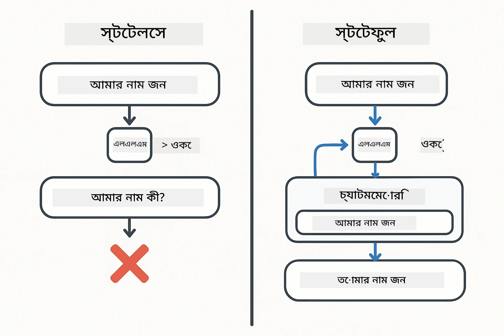
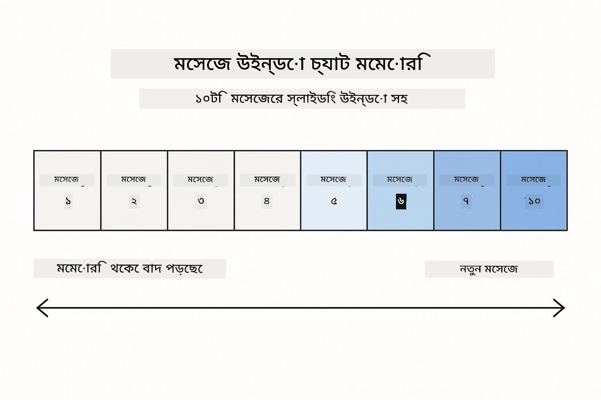
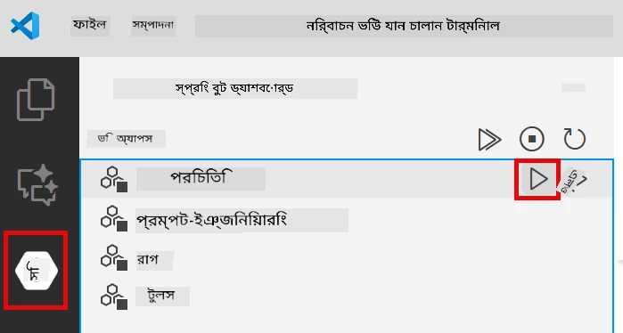
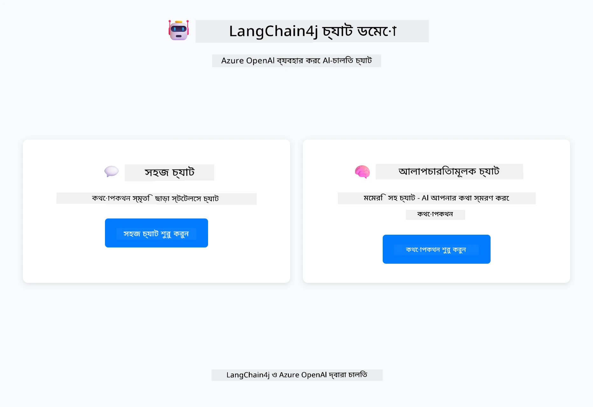
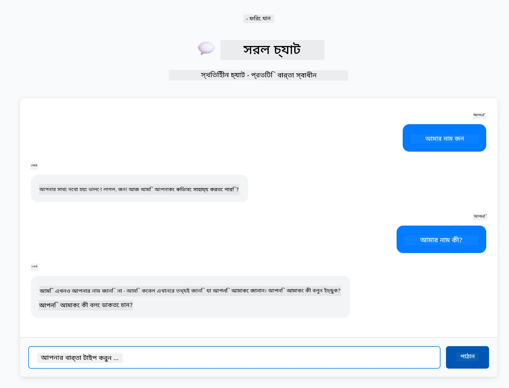
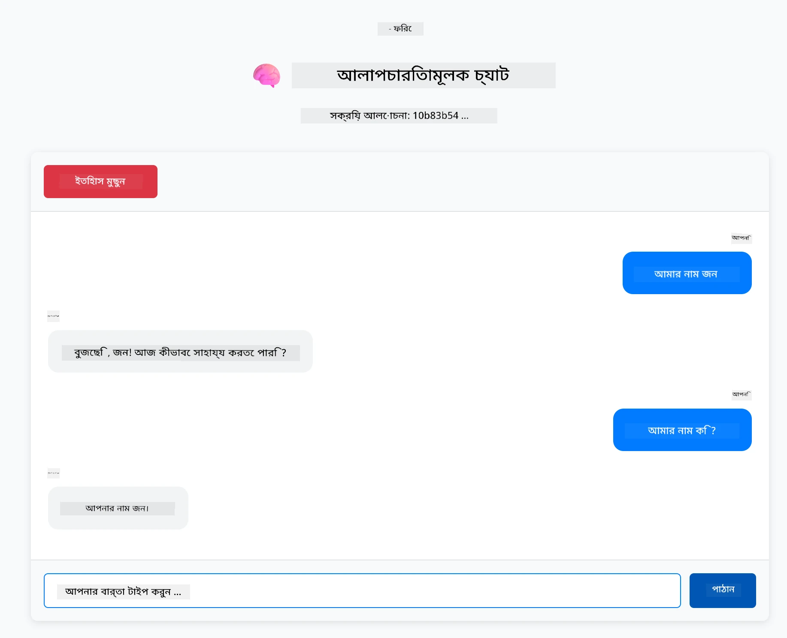

# মডিউল ০১: LangChain4j দিয়ে শুরু করা

## বিষয়বস্তু সূচি

- [আপনি যা শিখবেন](../../../01-introduction)
- [প্রয়োজনীয়তা](../../../01-introduction)
- [মূল সমস্যাটি বোঝা](../../../01-introduction)
- [টোকেন বোঝা](../../../01-introduction)
- [মেমোরি কিভাবে কাজ করে](../../../01-introduction)
- [কিভাবে এটি LangChain4j ব্যবহার করে](../../../01-introduction)
- [Azure OpenAI অবকাঠামো স্থাপন](../../../01-introduction)
- [অ্যাপ্লিকেশন লোকালি চালানো](../../../01-introduction)
- [অ্যাপ্লিকেশন ব্যবহার](../../../01-introduction)
  - [স্টেটলেস চ্যাট (বাম প্যানেল)](../../../01-introduction)
  - [স্টেটফুল চ্যাট (ডান প্যানেল)](../../../01-introduction)
- [পরবর্তী ধাপ](../../../01-introduction)

## আপনি যা শিখবেন

যদি আপনি দ্রুত শুরু সম্পন্ন করে থাকেন, আপনি দেখেছেন কিভাবে প্রম্পট পাঠাতে হয় এবং প্রতিক্রিয়া পেতে হয়। সেটাই ভিত্তি, কিন্তু বাস্তব অ্যাপ্লিকেশনগুলোর জন্য আরও কিছু দরকার। এই মডিউলটি আপনাকে শেখাবে কিভাবে এমন কথোপকথনমূলক AI তৈরি করবেন যা প্রসঙ্গ মনে রাখে এবং অবস্থা বজায় রাখে - যা এককালীন ডেমো এবং উৎপাদন-সক্ষম অ্যাপ্লিকেশনের মধ্যে পার্থক্য।

আমরা এই গাইডে Azure OpenAI এর GPT-5 ব্যবহার করব কারণ এর উন্নত যুক্তি ক্ষমতা বিভিন্ন প্যাটার্নের আচরণ স্পষ্ট করে তোলে। যখন আপনি মেমোরি যোগ করবেন, তখন পার্থক্য স্পষ্ট দেখতে পাবেন। এটি বুঝতে সহজ করে তোলে প্রতিটি উপাদান আপনার অ্যাপ্লিকেশনে কী নিয়ে আসে।

আপনি একটি অ্যাপ্লিকেশন তৈরি করবেন যা উভয় প্যাটার্ন প্রদর্শন করে:

**স্টেটলেস চ্যাট** - প্রতিটি অনুরোধ স্বাধীন। মডেলের পূর্বের বার্তার কোনো স্মৃতি নেই। এটি সেই প্যাটার্ন যা আপনি দ্রুত শুরুতে ব্যবহার করেছিলেন।

**স্টেটফুল কথোপকথন** - প্রতিটি অনুরোধে কথোপকথনের ইতিহাস থাকে। মডেল একাধিক ধাপে প্রসঙ্গ বজায় রাখে। এটি উৎপাদন অ্যাপ্লিকেশনগুলোর জন্য প্রয়োজন।

## প্রয়োজনীয়তা

- Azure সাবস্ক্রিপশন যার সাথে Azure OpenAI অ্যাক্সেস আছে
- Java 21, Maven 3.9+
- Azure CLI (https://learn.microsoft.com/en-us/cli/azure/install-azure-cli)
- Azure Developer CLI (azd) (https://learn.microsoft.com/en-us/azure/developer/azure-developer-cli/install-azd)

> **নোট:** Java, Maven, Azure CLI এবং Azure Developer CLI (azd) প্রদানকৃত devcontainer এ পূর্বে ইনস্টল করা আছে।

> **নোট:** এই মডিউলটি Azure OpenAI তে GPT-5 ব্যবহার করে। ডিপ্লয়মেন্ট স্বয়ংক্রিয়ভাবে `azd up` এর মাধ্যমে কনফিগার করা হয় - কোডে মডেল নাম পরিবর্তন করবেন না।

## মূল সমস্যাটি বোঝা

ভাষা মডেলগুলি স্টেটলেস। প্রতিটি API কল স্বাধীন। আপনি যদি "আমার নাম জন" পাঠান এবং তারপর "আমার নাম কী?" জিজ্ঞাসা করেন, মডেল জানে না আপনি সম্প্রতি পরিচয় দিয়েছেন। এটি প্রতিটি অনুরোধকে মনে করে যেন এটি আপনার প্রথম কথোপকথন।

এটি সাধারণ প্রশ্নোত্তরের জন্য ঠিক আছে কিন্তু বাস্তব অ্যাপ্লিকেশনের জন্য অকার্যকর। গ্রাহক সেবা বটদের যা আপনি বলেছিলেন তা মনে রাখতে হয়। ব্যক্তিগত সহায়কদের প্রসঙ্গ দরকার। যেকোনো বহু-ধাপ কথোপকথনের জন্য মেমোরি প্রয়োজন।



*স্টেটলেস (স্বাধীন কল) এবং স্টেটফুল (প্রসঙ্গ-সচেতন) কথোপকথনের মধ্যে পার্থক্য*

## টোকেন বোঝা

কথোপকথনে প্রবেশ করার আগে, টোকেন বোঝা গুরুত্বপূর্ণ - ভাষা মডেলগুলি যেসব মৌলিক টেক্সট ইউনিট প্রক্রিয়া করে:


*কিভাবে টেক্সট টোকেনে বিভক্ত হয় - "I love AI!" চারটি পৃথক প্রক্রিয়াকরণ ইউনিটে পরিণত হয়*

টোকেন হল AI মডেলগুলি টেক্সট পরিমাপ এবং প্রক্রিয়া করার উপায়। শব্দ, বিরামচিহ্ন, এমনকি স্পেসও টোকেন হতে পারে। আপনার মডেলের একটি সীমা আছে কতগুলি টোকেন একবারে প্রক্রিয়া করতে পারে (GPT-5 এর জন্য ৪০০,০০০, যার মধ্যে ২৭২,০০০ ইনপুট টোকেন এবং ১২৮,০০০ আউটপুট টোকেন)। টোকেন বোঝা কথোপকথনের দৈর্ঘ্য এবং খরচ নিয়ন্ত্রণে সাহায্য করে।

## মেমোরি কিভাবে কাজ করে

চ্যাট মেমোরি স্টেটলেস সমস্যার সমাধান করে কথোপকথনের ইতিহাস বজায় রেখে। মডেলে অনুরোধ পাঠানোর আগে, ফ্রেমওয়ার্ক প্রাসঙ্গিক পূর্ববর্তী বার্তাগুলো যুক্ত করে। যখন আপনি "আমার নাম কী?" জিজ্ঞাসা করেন, সিস্টেম আসলে পুরো কথোপকথনের ইতিহাস পাঠায়, যা মডেলকে দেখায় আপনি আগে বলেছিলেন "আমার নাম জন।"

LangChain4j মেমোরি ইমপ্লিমেন্টেশন সরবরাহ করে যা এটি স্বয়ংক্রিয়ভাবে পরিচালনা করে। আপনি নির্ধারণ করেন কতগুলি বার্তা রাখতে চান এবং ফ্রেমওয়ার্ক প্রসঙ্গ উইন্ডো পরিচালনা করে।



*MessageWindowChatMemory সাম্প্রতিক বার্তাগুলোর একটি স্লাইডিং উইন্ডো বজায় রাখে, পুরানো বার্তাগুলো স্বয়ংক্রিয়ভাবে ফেলে দেয়*

## কিভাবে এটি LangChain4j ব্যবহার করে

এই মডিউলটি দ্রুত শুরুকে সম্প্রসারিত করে Spring Boot ইন্টিগ্রেট করে এবং কথোপকথন মেমোরি যোগ করে। উপাদানগুলো কিভাবে একসাথে ফিট করে:

**ডিপেন্ডেন্সি** - দুটি LangChain4j লাইব্রেরি যোগ করুন:

```xml
<dependency>
    <groupId>dev.langchain4j</groupId>
    <artifactId>langchain4j</artifactId> <!-- Inherited from BOM in root pom.xml -->
</dependency>
<dependency>
    <groupId>dev.langchain4j</groupId>
    <artifactId>langchain4j-open-ai-official</artifactId> <!-- Inherited from BOM in root pom.xml -->
</dependency>
```

**চ্যাট মডেল** - Azure OpenAI কে Spring bean হিসেবে কনফিগার করুন ([LangChainConfig.java](../../../01-introduction/src/main/java/com/example/langchain4j/config/LangChainConfig.java)):

```java
@Bean
public OpenAiOfficialChatModel openAiOfficialChatModel() {
    return OpenAiOfficialChatModel.builder()
            .baseUrl(azureEndpoint)
            .apiKey(azureApiKey)
            .modelName(deploymentName)
            .timeout(Duration.ofMinutes(5))
            .maxRetries(3)
            .build();
}
```

বিল্ডার `azd up` দ্বারা সেট করা পরিবেশ ভেরিয়েবল থেকে ক্রেডেনশিয়াল পড়ে। `baseUrl` আপনার Azure এন্ডপয়েন্টে সেট করলে OpenAI ক্লায়েন্ট Azure OpenAI এর সাথে কাজ করে।

**কথোপকথন মেমোরি** - MessageWindowChatMemory দিয়ে চ্যাট ইতিহাস ট্র্যাক করুন ([ConversationService.java](../../../01-introduction/src/main/java/com/example/langchain4j/service/ConversationService.java)):

```java
ChatMemory memory = MessageWindowChatMemory.withMaxMessages(10);

memory.add(UserMessage.from("My name is John"));
memory.add(AiMessage.from("Nice to meet you, John!"));

memory.add(UserMessage.from("What's my name?"));
AiMessage aiMessage = chatModel.chat(memory.messages()).aiMessage();
memory.add(aiMessage);
```

`withMaxMessages(10)` দিয়ে মেমোরি তৈরি করুন যাতে সর্বশেষ ১০টি বার্তা রাখা হয়। ব্যবহারকারী এবং AI বার্তা টাইপ করা র‍্যাপার দিয়ে যোগ করুন: `UserMessage.from(text)` এবং `AiMessage.from(text)`। ইতিহাস `memory.messages()` দিয়ে পুনরুদ্ধার করুন এবং মডেলে পাঠান। সার্ভিসটি আলাদা আলাদা কথোপকথন আইডি অনুযায়ী মেমোরি ইনস্ট্যান্স সংরক্ষণ করে, যা একাধিক ব্যবহারকারীকে একসাথে চ্যাট করার সুযোগ দেয়।

> **🤖 GitHub Copilot Chat দিয়ে চেষ্টা করুন:** [`ConversationService.java`](../../../01-introduction/src/main/java/com/example/langchain4j/service/ConversationService.java) খুলে জিজ্ঞাসা করুন:
> - "MessageWindowChatMemory উইন্ডো পূর্ণ হলে কোন বার্তাগুলো ফেলে দেয় কিভাবে সিদ্ধান্ত নেয়?"
> - "আমি কি ইন-মেমোরির পরিবর্তে ডাটাবেস ব্যবহার করে কাস্টম মেমোরি স্টোরেজ ইমপ্লিমেন্ট করতে পারি?"
> - "পুরানো কথোপকথন ইতিহাস সংক্ষিপ্ত করতে আমি কিভাবে সারাংশ যোগ করব?"

স্টেটলেস চ্যাট এন্ডপয়েন্ট মেমোরি সম্পূর্ণ এড়িয়ে চলে - শুধু `chatModel.chat(prompt)` যেমন দ্রুত শুরুতে ছিল। স্টেটফুল এন্ডপয়েন্ট বার্তাগুলো মেমোরিতে যোগ করে, ইতিহাস পুনরুদ্ধার করে এবং প্রতিটি অনুরোধের সাথে প্রসঙ্গ অন্তর্ভুক্ত করে। একই মডেল কনফিগারেশন, ভিন্ন প্যাটার্ন।

## Azure OpenAI অবকাঠামো স্থাপন

**Bash:**
```bash
cd 01-introduction
azd up  # সাবস্ক্রিপশন এবং অবস্থান নির্বাচন করুন (eastus2 সুপারিশ করা হয়েছে)
```

**PowerShell:**
```powershell
cd 01-introduction
azd up  # সাবস্ক্রিপশন এবং অবস্থান নির্বাচন করুন (eastus2 সুপারিশ করা হয়েছে)
```

> **নোট:** যদি আপনি টাইমআউট ত্রুটি পান (`RequestConflict: Cannot modify resource ... provisioning state is not terminal`), শুধু আবার `azd up` চালান। Azure রিসোর্সগুলি পেছনে এখনও প্রোভিশনিং হতে পারে, পুনরায় চেষ্টা করলে রিসোর্সগুলি টার্মিনাল অবস্থায় পৌঁছালে ডিপ্লয়মেন্ট সম্পন্ন হবে।

এটি করবে:
1. GPT-5 এবং text-embedding-3-small মডেল সহ Azure OpenAI রিসোর্স ডিপ্লয়
2. প্রকল্পের রুটে স্বয়ংক্রিয়ভাবে `.env` ফাইল তৈরি করবে ক্রেডেনশিয়াল সহ
3. প্রয়োজনীয় সব পরিবেশ ভেরিয়েবল সেট করবে

**ডিপ্লয়মেন্টে সমস্যা?** বিস্তারিত সমস্যার সমাধানের জন্য [Infrastructure README](infra/README.md) দেখুন, যার মধ্যে সাবডোমেইন নাম সংঘর্ষ, ম্যানুয়াল Azure Portal ডিপ্লয়মেন্ট ধাপ এবং মডেল কনফিগারেশন নির্দেশনা রয়েছে।

**ডিপ্লয়মেন্ট সফল হয়েছে কিনা যাচাই করুন:**

**Bash:**
```bash
cat ../.env  # AZURE_OPENAI_ENDPOINT, API_KEY, ইত্যাদি দেখানো উচিত।
```

**PowerShell:**
```powershell
Get-Content ..\.env  # AZURE_OPENAI_ENDPOINT, API_KEY, ইত্যাদি দেখানো উচিত।
```

> **নোট:** `azd up` কমান্ড স্বয়ংক্রিয়ভাবে `.env` ফাইল তৈরি করে। পরে এটি আপডেট করতে চাইলে, আপনি ম্যানুয়ালি `.env` ফাইল সম্পাদনা করতে পারেন অথবা পুনরায় তৈরি করতে পারেন:
>
> **Bash:**
> ```bash
> cd ..
> bash .azd-env.sh
> ```
>
> **PowerShell:**
> ```powershell
> cd ..
> .\.azd-env.ps1
> ```

## অ্যাপ্লিকেশন লোকালি চালানো

**ডিপ্লয়মেন্ট যাচাই করুন:**

রুট ডিরেক্টরিতে `.env` ফাইল আছে এবং Azure ক্রেডেনশিয়াল রয়েছে তা নিশ্চিত করুন:

**Bash:**
```bash
cat ../.env  # AZURE_OPENAI_ENDPOINT, API_KEY, DEPLOYMENT দেখানো উচিত
```

**PowerShell:**
```powershell
Get-Content ..\.env  # AZURE_OPENAI_ENDPOINT, API_KEY, DEPLOYMENT দেখানো উচিত
```

**অ্যাপ্লিকেশন শুরু করুন:**

**বিকল্প ১: Spring Boot ড্যাশবোর্ড ব্যবহার (VS Code ব্যবহারকারীদের জন্য সুপারিশকৃত)**

ডেভ কন্টেইনারে Spring Boot ড্যাশবোর্ড এক্সটেনশন অন্তর্ভুক্ত আছে, যা সব Spring Boot অ্যাপ্লিকেশন পরিচালনার জন্য ভিজ্যুয়াল ইন্টারফেস দেয়। এটি VS Code এর বাম পাশে অ্যাক্টিভিটি বারে পাওয়া যাবে (Spring Boot আইকন দেখুন)।

Spring Boot ড্যাশবোর্ড থেকে আপনি:
- ওয়ার্কস্পেসের সব Spring Boot অ্যাপ্লিকেশন দেখতে পারবেন
- এক ক্লিকে অ্যাপ্লিকেশন শুরু/বন্ধ করতে পারবেন
- রিয়েল-টাইমে অ্যাপ্লিকেশন লগ দেখতে পারবেন
- অ্যাপ্লিকেশন স্ট্যাটাস মনিটর করতে পারবেন

শুধু "introduction" এর পাশে প্লে বাটনে ক্লিক করুন এই মডিউল শুরু করতে, অথবা সব মডিউল একসাথে শুরু করুন।



**বিকল্প ২: শেল স্ক্রিপ্ট ব্যবহার**

সব ওয়েব অ্যাপ্লিকেশন (মডিউল ০১-০৪) শুরু করুন:

**Bash:**
```bash
cd ..  # রুট ডিরেক্টরি থেকে
./start-all.sh
```

**PowerShell:**
```powershell
cd ..  # রুট ডিরেক্টরি থেকে
.\start-all.ps1
```

অথবা শুধু এই মডিউল শুরু করুন:

**Bash:**
```bash
cd 01-introduction
./start.sh
```

**PowerShell:**
```powershell
cd 01-introduction
.\start.ps1
```

উভয় স্ক্রিপ্ট স্বয়ংক্রিয়ভাবে রুট `.env` ফাইল থেকে পরিবেশ ভেরিয়েবল লোড করে এবং যদি JAR না থাকে তবে তৈরি করবে।

> **নোট:** আপনি যদি শুরু করার আগে সব মডিউল ম্যানুয়ালি তৈরি করতে চান:
>
> **Bash:**
> ```bash
> cd ..  # Go to root directory
> mvn clean package -DskipTests
> ```
>
> **PowerShell:**
> ```powershell
> cd ..  # Go to root directory
> mvn clean package -DskipTests
> ```

আপনার ব্রাউজারে http://localhost:8080 খুলুন।

**বন্ধ করতে:**

**Bash:**
```bash
./stop.sh  # শুধুমাত্র এই মডিউল
# অথবা
cd .. && ./stop-all.sh  # সমস্ত মডিউলগুলি
```

**PowerShell:**
```powershell
.\stop.ps1  # শুধুমাত্র এই মডিউল
# অথবা
cd ..; .\stop-all.ps1  # সমস্ত মডিউলগুলি
```

## অ্যাপ্লিকেশন ব্যবহার

অ্যাপ্লিকেশনটি একটি ওয়েব ইন্টারফেস প্রদান করে যেখানে দুইটি চ্যাট ইমপ্লিমেন্টেশন পাশাপাশি রয়েছে।



*ড্যাশবোর্ডে Simple Chat (স্টেটলেস) এবং Conversational Chat (স্টেটফুল) অপশন উভয়ই দেখানো হয়েছে*

### স্টেটলেস চ্যাট (বাম প্যানেল)

প্রথমে এটি চেষ্টা করুন। "আমার নাম জন" বলুন এবং তারপর সাথে সাথে "আমার নাম কী?" জিজ্ঞাসা করুন। মডেল মনে রাখবে না কারণ প্রতিটি বার্তা স্বাধীন। এটি মৌলিক ভাষা মডেল ইন্টিগ্রেশনের মূল সমস্যাটি প্রদর্শন করে - কোনো কথোপকথন প্রসঙ্গ নেই।



*AI পূর্বের বার্তা থেকে আপনার নাম মনে রাখে না*

### স্টেটফুল চ্যাট (ডান প্যানেল)

এখন একই ক্রম এখানে চেষ্টা করুন। "আমার নাম জন" বলুন এবং তারপর "আমার নাম কী?" এবার এটি মনে রাখে। পার্থক্য হল MessageWindowChatMemory - এটি কথোপকথনের ইতিহাস বজায় রাখে এবং প্রতিটি অনুরোধের সাথে অন্তর্ভুক্ত করে। এভাবেই উৎপাদন কথোপকথন AI কাজ করে।



*AI কথোপকথনের আগের অংশ থেকে আপনার নাম মনে রাখে*

উভয় প্যানেল একই GPT-5 মডেল ব্যবহার করে। একমাত্র পার্থক্য হল মেমোরি। এটি স্পষ্ট করে তোলে মেমোরি আপনার অ্যাপ্লিকেশনে কী নিয়ে আসে এবং কেন এটি বাস্তব ব্যবহারের জন্য অপরিহার্য।

## পরবর্তী ধাপ

**পরবর্তী মডিউল:** [০২-প্রম্পট-ইঞ্জিনিয়ারিং - GPT-5 দিয়ে প্রম্পট ইঞ্জিনিয়ারিং](../02-prompt-engineering/README.md)

---

**নেভিগেশন:** [← পূর্ববর্তী: মডিউল ০০ - দ্রুত শুরু](../00-quick-start/README.md) | [প্রধান পৃষ্ঠায় ফিরে যান](../README.md) | [পরবর্তী: মডিউল ০২ - প্রম্পট ইঞ্জিনিয়ারিং →](../02-prompt-engineering/README.md)

---

<!-- CO-OP TRANSLATOR DISCLAIMER START -->
**অস্বীকৃতি**:  
এই নথিটি AI অনুবাদ সেবা [Co-op Translator](https://github.com/Azure/co-op-translator) ব্যবহার করে অনূদিত হয়েছে। আমরা যথাসাধ্য সঠিকতার চেষ্টা করি, তবে স্বয়ংক্রিয় অনুবাদে ত্রুটি বা অসঙ্গতি থাকতে পারে। মূল নথিটি তার নিজস্ব ভাষায়ই কর্তৃত্বপূর্ণ উৎস হিসেবে বিবেচনা করা উচিত। গুরুত্বপূর্ণ তথ্যের জন্য পেশাদার মানব অনুবাদ গ্রহণ করার পরামর্শ দেওয়া হয়। এই অনুবাদের ব্যবহারে সৃষ্ট কোনো ভুল বোঝাবুঝি বা ভুল ব্যাখ্যার জন্য আমরা দায়ী নই।
<!-- CO-OP TRANSLATOR DISCLAIMER END -->