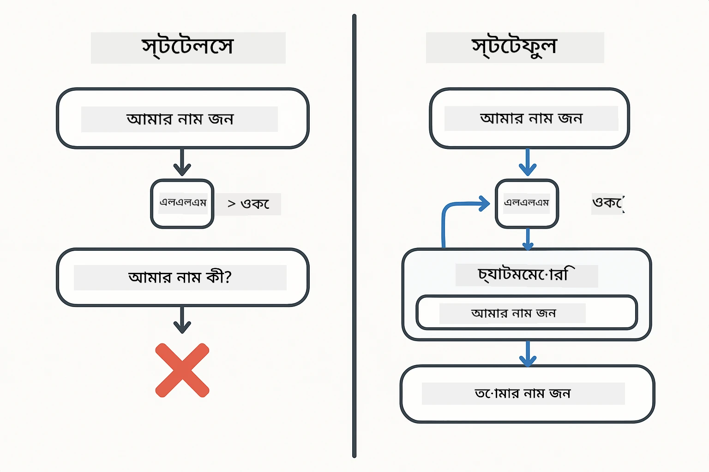
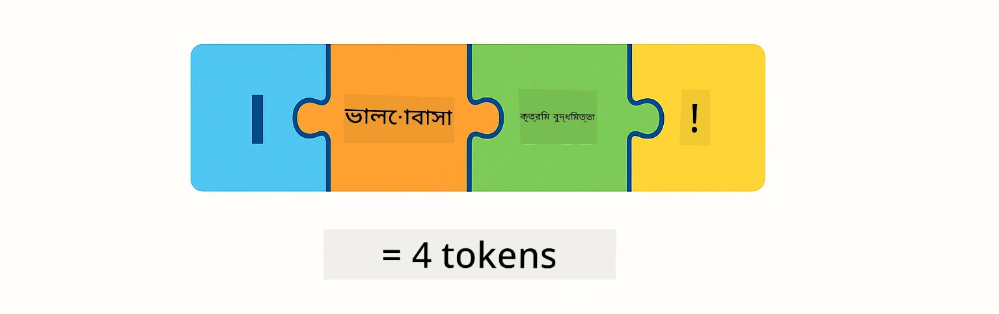
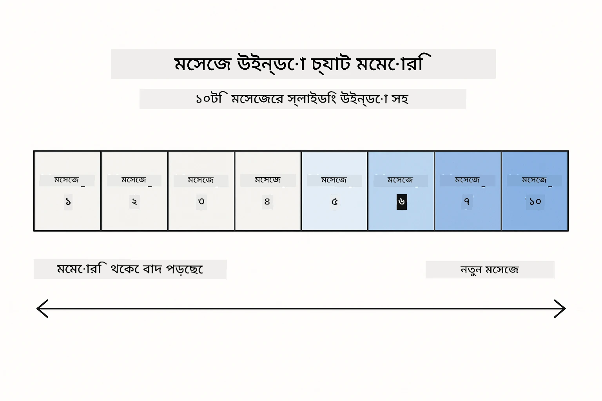
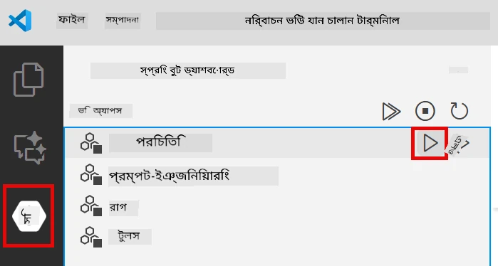
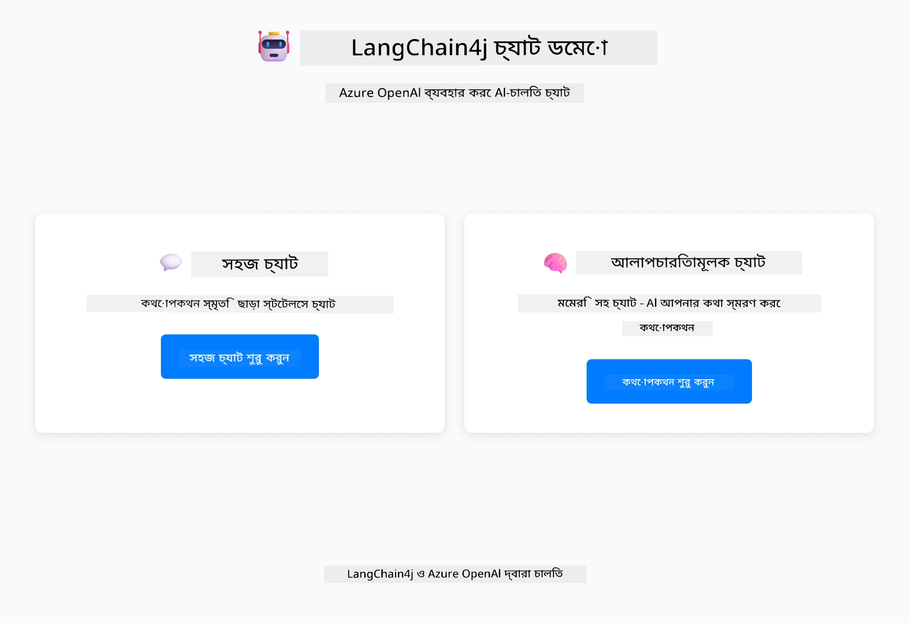
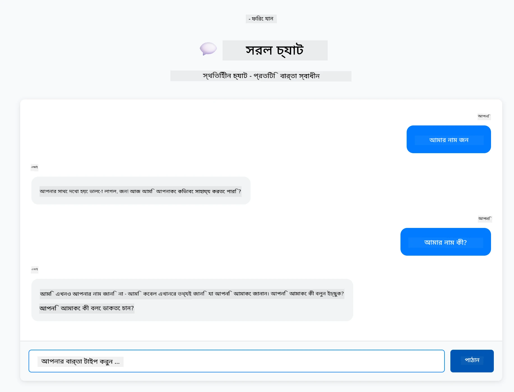
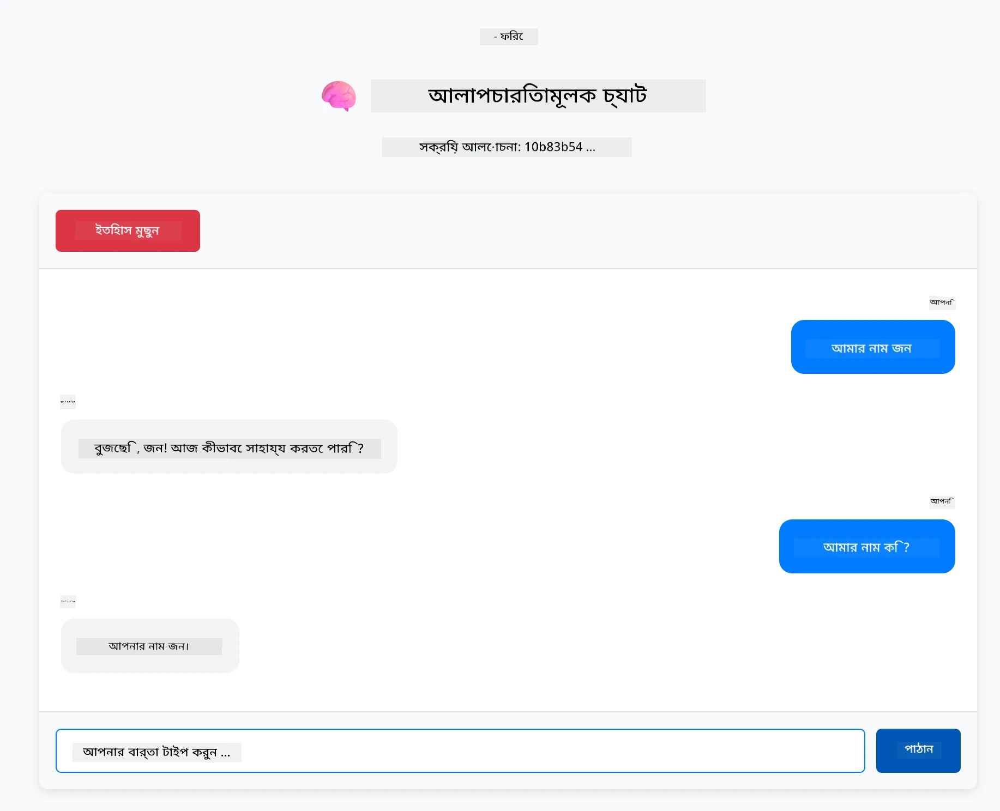

# মডিউল ০১: LangChain4j দিয়ে শুরু করা

## বিষয়সূচি

- [ভিডিও ওয়াকথ্রু](#ভিডিও-ওয়াকথ্রু)
- [আপনি কী শিখবেন](#আপনি-কী-শিখবেন)
- [প্রয়োজনীয়তা](#প্রয়োজনীয়তা)
- [মূল সমস্যা বোঝা](#মূল-সমস্যা-বোঝা)
- [টোকেন বোঝা](#টোকেন-বোঝা)
- [মেমোরি কীভাবে কাজ করে](#মেমোরি-কীভাবে-কাজ-করে)
- [এটি কীভাবে LangChain4j ব্যবহার করে](#এটি-কীভাবে-langchain4j-ব্যবহার-করে)
- [Azure OpenAI ইনফ্রাস্ট্রাকচার ডিপ্লয় করুন](#azure-openai-ইনফ্রাস্ট্রাকচার-ডিপ্লয়-করুন)
- [অ্যাপ্লিকেশন লোকালি চালান](#অ্যাপ্লিকেশন-লোকালি-চালান)
- [অ্যাপ্লিকেশন ব্যবহার করা](#অ্যাপ্লিকেশন-ব্যবহার-করা)
  - [স্টেটলেস চ্যাট (বাম প্যানেল)](#স্টেটলেস-চ্যাট-বাম-প্যানেল)
  - [স্টেটফুল চ্যাট (ডান প্যানেল)](#স্টেটফুল-চ্যাট-ডান-প্যানেল)
- [পরবর্তী ধাপসমূহ](#পরবর্তী-ধাপসমূহ)

## ভিডিও ওয়াকথ্রু

এই লাইভ সেশনটি দেখুন যা কিভাবে এই মডিউল দিয়ে শুরু করবেন তা ব্যাখ্যা করে:

<a href="https://www.youtube.com/live/nl_troDm8rQ?si=6b85S8xGjWnT2fX9"></a>

## আপনি কী শিখবেন

এটি আপনার LangChain4j এবং Azure OpenAI দিয়ে শুরু করার পয়েন্ট। আমরা মৌলিক বিষয়গুলি দিয়ে শুরু করব এবং প্রোডাকশন-স্টাইল অ্যাপ্লিকেশন তৈরি শুরু করব। এই মডিউলটি কথোপকথনমূলক AI-তে ফোকাস করে যা প্রসঙ্গ মনে রাখে এবং স্টেট বজায় রাখে — এগুলো মৌলিক ধারণা যেগুলোর উপর পরবর্তী প্রতিটি মডিউল গড়ে উঠবে।

আমরা এই গাইড জুড়ে Azure OpenAI-এর GPT-5.2 ব্যবহার করবো কারণ এর উন্নত যুক্তি ক্ষমতাগুলি বিভিন্ন প্যাটার্নের আচরণ আরও স্পষ্ট করে তোলে। যখন আপনি মেমোরি যোগ করবেন, তখন আপনি স্পষ্টভাবে পার্থক্য দেখতে পাবেন। এটি সহজ করে তোলে বুঝতে যে প্রতিটি উপাদান আপনার অ্যাপ্লিকেশনে কী নিয়ে আসে।

আপনি একটি অ্যাপ্লিকেশন তৈরি করবেন যা দুটি প্যাটার্নই প্রদর্শন করে:

**স্টেটলেস চ্যাট** - প্রতিটি অনুরোধ স্বাধীন। মডেলের পূর্বের বার্তার কোনো স্মৃতি নেই। এটি সবচেয়ে সহজ শুরু।

**স্টেটফুল কথোপকথন** - প্রতিটি অনুরোধে কথোপকথনের ইতিহাস থাকে। মডেল একাধিক ধাপে প্রসঙ্গ বজায় রাখে। প্রোডাকশন অ্যাপ্লিকেশনগুলির জন্য এটি দরকার।

## প্রয়োজনীয়তা

- Azure সাবস্ক্রিপশন এবং Azure OpenAI অ্যাক্সেস
- Java 21, Maven 3.9+
- Azure CLI (https://learn.microsoft.com/en-us/cli/azure/install-azure-cli)
- Azure Developer CLI (azd) (https://learn.microsoft.com/en-us/azure/developer/azure-developer-cli/install-azd)

> **দ্রষ্টব্য:** Java, Maven, Azure CLI এবং Azure Developer CLI (azd) প্রদান করা devcontainer-এ আগেই ইনস্টল করা আছে।

> **দ্রষ্টব্য:** এই মডিউল Azure OpenAI-র GPT-5.2 ব্যবহার করে। ডিপ্লয়মেন্ট স্বয়ংক্রিয়ভাবে `azd up` দ্বারা কনফিগার করা হয় — কোডে মডেল নাম পরিবর্তন করবেন না।

## মূল সমস্যা বোঝা

ভাষা মডেলগুলো স্টেটলেস। প্রতিটি API কল স্বাধীন। আপনি যদি "আমার নাম জন" লেখেন এবং পরে জিজ্ঞেস করেন "আমার নাম কী?", মডেলটির কোন ধারণা নেই যে আপনি আপনার পরিচয় দিয়েছেন। এটি প্রতিটি অনুরোধ প্রথম কথোপকথনের মতো বিবেচনা করে।

এটি সাধারণ প্রশ্নোত্তরের জন্য ঠিক আছে কিন্তু বাস্তব অ্যাপ্লিকেশন জন্য অকার্যকর। কাস্টমার সার্ভিস বটকে আপনাকে যা বলেছিলেন তা মনে রাখতে হবে। ব্যক্তিগত সহকারীকে প্রসঙ্গ দরকার। যে কোনো বহু-ধাপে কথোপকথনের জন্য মেমোরি প্রয়োজন।

নিম্নলিখিত ডায়াগ্রামটি দুই পদ্ধতির পার্থক্য দেখায় — বামে, একটি স্টেটলেস কল যা আপনার নাম ভুলে যায়; ডানে, ChatMemory দ্বারা সমর্থিত স্টেটফুল কল যা নাম মনে রাখে।



*স্টেটলেস (স্বাধীন কল) এবং স্টেটফুল (প্রসঙ্গ-বিবেচনাযুক্ত) কথোপকথনের পার্থক্য*

## টোকেন বোঝা

কথোপকথনে প্রবেশ করার আগে, টোকেন বোঝা গুরুত্বপূর্ণ — টোকেন হলো মৌলিক লেখ্য একক যা ভাষা মডেল প্রক্রিয়া করে:



*কিভাবে লেখা টোকেনে ভাগ হয় - "I love AI!" চারটি পৃথক প্রসেসিং ইউনিটে পরিণত হয়*

টোকেন হল কিভাবে AI মডেল টেক্সট পরিমাপ এবং প্রক্রিয়া করে। শব্দ, বিরামচিহ্ন, এমনকি স্পেসও টোকেন হতে পারে। আপনার মডেলের একটি সীমা আছে কতটি টোকেন একবারে প্রক্রিয়া করা যায় (GPT-5.2-র জন্য ৪০০,০০০, যেখানে ইনপুট টোকেন সর্বোচ্চ ২৭২,০০০ এবং আউটপুট ১২৮,০০০)। টোকেন বুঝলে কথোপকথনের দৈর্ঘ্য এবং খরচ নিয়ন্ত্রণ সহজ হয়।

## মেমোরি কীভাবে কাজ করে

চ্যাট মেমোরি স্টেটলেস সমস্যার সমাধান করে কথোপকথনের ইতিহাস রক্ষা করে। মডেলে আপনার অনুরোধ পাঠানোর আগে ফ্রেমওয়ার্ক পূর্বের প্রাসঙ্গিক বার্তাগুলো যুক্ত করে। যখন আপনি জিজ্ঞেস করেন "আমার নাম কী?", সিস্টেম পুরো কথোপকথনের ইতিহাস মডেলে পাঠায়, যাতে মডেল দেখতে পারে আপনি আগে বলেছেন "আমার নাম জন।"

LangChain4j মেমোরি বাস্তবায়ন সরবরাহ করে যা এটি স্বয়ংক্রিয়ভাবে পরিচালনা করে। আপনি কতজন বার্তা রাখা হবে বেছে নেন এবং ফ্রেমওয়ার্ক প্রসঙ্গ উইন্ডো ম্যানেজ করে। নিচের ডায়াগ্রামটি দেখায় কিভাবে MessageWindowChatMemory সাম্প্রতিক বার্তাগুলোর স্লাইডিং উইন্ডো বজায় রাখে।



*MessageWindowChatMemory সাম্প্রতিক বার্তাগুলোর স্লাইডিং উইন্ডো বজায় রাখে, পুরানো বার্তাগুলো স্বয়ংক্রিয়ভাবে ফেলে দেয়*

## এটি কীভাবে LangChain4j ব্যবহার করে

এই মডিউলটি Spring Boot-কে একত্রিত করে এবং কথোপকথন মেমোরি যোগ করে। এখানে উপাদানগুলি কীভাবে একসাথে কাজ করে:

**ডিপেন্ডেন্সি** - দুটি LangChain4j লাইব্রেরি যোগ করুন:

```xml
<dependency>
    <groupId>dev.langchain4j</groupId>
    <artifactId>langchain4j</artifactId> <!-- Inherited from BOM in root pom.xml -->
</dependency>
<dependency>
    <groupId>dev.langchain4j</groupId>
    <artifactId>langchain4j-open-ai-official</artifactId> <!-- Inherited from BOM in root pom.xml -->
</dependency>
```

**চ্যাট মডেল** - Azure OpenAI কে Spring bean হিসেবে কনফিগার করুন ([LangChainConfig.java](../../../01-introduction/src/main/java/com/example/langchain4j/config/LangChainConfig.java)):

```java
@Bean
public OpenAiOfficialChatModel openAiOfficialChatModel() {
    return OpenAiOfficialChatModel.builder()
            .baseUrl(azureEndpoint)
            .apiKey(azureApiKey)
            .modelName(deploymentName)
            .timeout(Duration.ofMinutes(5))
            .maxRetries(3)
            .build();
}
```

বিল্ডারটি পরিবেশ ভেরিয়েবল থেকে `azd up` দ্বারা সেট করা ক্রেডেনশিয়াল পড়ে। আপনার Azure এন্ডপয়েন্ট দিয়ে `baseUrl` সেট করলে OpenAI ক্লায়েন্ট Azure OpenAI-এর সাথে কাজ করে।

**কথোপকথন মেমোরি** - MessageWindowChatMemory দিয়ে চ্যাট ইতিহাস ট্র্যাক করুন ([ConversationService.java](../../../01-introduction/src/main/java/com/example/langchain4j/service/ConversationService.java)):

```java
ChatMemory memory = MessageWindowChatMemory.withMaxMessages(10);

memory.add(UserMessage.from("My name is John"));
memory.add(AiMessage.from("Nice to meet you, John!"));

memory.add(UserMessage.from("What's my name?"));
AiMessage aiMessage = chatModel.chat(memory.messages()).aiMessage();
memory.add(aiMessage);
```

`withMaxMessages(10)` দিয়ে মেমোরি তৈরি করুন যাতে শেষ ১০ টা বার্তা থাকে। ব্যবহারকারী এবং AI বার্তাগুলো typed wrappers দিয়ে যোগ করুন: `UserMessage.from(text)` এবং `AiMessage.from(text)`। ইতিহাস পাওয়ার জন্য `memory.messages()` ব্যবহার করুন এবং এটি মডেলে পাঠান। সার্ভিস পৃথক কথোপকথন আইডি অনুসারে পৃথক মেমোরি ইনস্ট্যান্স সংরক্ষণ করে, ফলে অনেক ব্যবহারকারী একই সাথে চ্যাট করতে পারে।

> **🤖 GitHub Copilot [চ্যাট](https://github.com/features/copilot) এর সাথে চেষ্টা করুন:** খুলুন [`ConversationService.java`](../../../01-introduction/src/main/java/com/example/langchain4j/service/ConversationService.java) এবং জিজ্ঞাসা করুন:
> - "MessageWindowChatMemory উইন্ডো পূর্ণ হলে কোন বার্তাগুলো ফেলে দেওয়ার সিদ্ধান্ত কীভাবে নেয়?"
> - "আমি কি মেমোরির জন্য ইন-মেমোরির পরিবর্তে ডাটাবেজ ব্যবহার করে কাস্টম স্টোরেজ তৈরি করতে পারি?"
> - "পুরানো কথোপকথনের সারাংশ সংকলন যোগ করার জন্য কীভাবে কাজ করব?"

স্টেটলেস চ্যাট এন্ডপয়েন্ট সম্পূর্ণ মেমোরি এড়িয়ে চলে — যেমন দ্রুত শুরুতে `chatModel.chat(prompt)`। স্টেটফুল এন্ডপয়েন্ট বার্তাগুলো মেমোরিতে যোগ করে, ইতিহাস রিট্রিভ করে এবং প্রতিটি অনুরোধে প্রসঙ্গ সহ পাঠায়। একই মডেল কনফিগারেশন, ভিন্ন প্যাটার্ন।

## Azure OpenAI ইনফ্রাস্ট্রাকচার ডিপ্লয় করুন

**Bash:**
```bash
cd 01-introduction
azd up  # সাবস্ক্রিপশন এবং অবস্থান নির্বাচন করুন (eastus2 পরামর্শ দেওয়া হয়)
```

**PowerShell:**
```powershell
cd 01-introduction
azd up  # সাবস্ক্রিপশন এবং অবস্থান নির্বাচন করুন (eastus2 প্রস্তাবিত)
```

> **দ্রষ্টব্য:** যদি টাইমআউট ত্রুটি (`RequestConflict: Cannot modify resource ... provisioning state is not terminal`) পাওয়া যায়, তবে আবার `azd up` চালান। Azure রিসোর্সগুলি পেছনে এখনও প্রস্তুত হচ্ছে, পুনরায় চেষ্টা করলে রিসোর্সসমূহ চূড়ান্ত অবস্থায় পৌঁছালে ডিপ্লয়মেন্ট সম্পন্ন হবে।

এটি করবে:
1. GPT-5.2 এবং text-embedding-3-small মডেলসহ Azure OpenAI রিসোর্স ডিপ্লয় করবে
2. প্রকল্প মূল ডিরেক্টরিতে স্বয়ংক্রিয় `.env` ফাইল জেনারেট করবে ক্রেডেনশিয়ালসহ
3. সমস্ত প্রয়োজনীয় পরিবেশ ভেরিয়েবল সেট করবে

**ডিপ্লয়মেন্টে সমস্যা হচ্ছে?** বিস্তারিত সমস্যার সমাধানের জন্য [Infrastructure README](infra/README.md) দেখুন — সাবডোমেইন নাম দ্বন্দ্ব, ম্যানুয়াল Azure Portal ডিপ্লয়মেন্ট পদক্ষেপ, এবং মডেল কনফিগারেশন নির্দেশিকা সহ।

**ডিপ্লয়মেন্ট সফল হয়েছে কী না যাচাই করুন:**

**Bash:**
```bash
cat ../.env  # AZURE_OPENAI_ENDPOINT, API_KEY, ইত্যাদি দেখানো উচিত।
```

**PowerShell:**
```powershell
Get-Content ..\.env  # AZURE_OPENAI_ENDPOINT, API_KEY, ইত্যাদি দেখানো উচিত।
```

> **দ্রষ্টব্য:** `azd up` কমান্ড স্বয়ংক্রিয়ভাবে `.env` ফাইল তৈরি করে। পরে আপডেট করতে চাইলে `.env` ফাইল ম্যানুয়ালি সম্পাদনা করুন অথবা পুনরায় তৈরি করতে চালান:
>
> **Bash:**
> ```bash
> cd ..
> bash .azd-env.sh
> ```
>
> **PowerShell:**
> ```powershell
> cd ..
> .\.azd-env.ps1
> ```

## অ্যাপ্লিকেশন লোকালি চালান

**ডিপ্লয়মেন্ট যাচাই করুন:**

মূল ডিরেক্টরিতে `.env` ফাইল আছে এবং Azure ক্রেডেনশিয়াল সেট আছে নিশ্চিত করুন। মডিউল ডিরেক্টরিতে (`01-introduction/`) থেকে এটি চালান:

**Bash:**
```bash
cat ../.env  # AZURE_OPENAI_ENDPOINT, API_KEY, DEPLOYMENT দেখানো উচিত
```

**PowerShell:**
```powershell
Get-Content ..\.env  # AZURE_OPENAI_ENDPOINT, API_KEY, DEPLOYMENT দেখানো উচিত
```

**অ্যাপ্লিকেশন শুরু করুন:**

**অপশন ১: Spring Boot ড্যাশবোর্ড ব্যবহার (VS Code ব্যবহারকারীদের জন্য সুপারিশ)**

devcontainer-এ Spring Boot ড্যাশবোর্ড এক্সটেনশন অন্তর্ভুক্ত আছে, যা সব Spring Boot অ্যাপ্লিকেশন ম্যানেজ করার ভিজ্যুয়াল ইন্টারফেস দেয়। VS Code-এর বামে Activity Bar-এ Spring Boot আইকন দেখতে পাবেন।

Spring Boot ড্যাশবোর্ড থেকে আপনি:
- ওয়ার্কস্পেসের সব Spring Boot অ্যাপ্লিকেশন দেখতে পারেন
- এক ক্লিকে অ্যাপ্লিকেশন শুরু/বন্ধ করতে পারেন
- রিয়েল-টাইমে অ্যাপ্লিকেশন লগ দেখতে পারেন
- অ্যাপ্লিকেশন স্থিতি পর্যবেক্ষণ করতে পারেন

শুধুমাত্র "introduction" পাশে প্লে বাটনে ক্লিক করে এই মডিউল শুরু করুন, অথবা একবারে সব মডিউল শুরু করুন।



*VS Code-এ Spring Boot ড্যাশবোর্ড — এক জায়গা থেকে সব মডিউল শুরু, বন্ধ, পর্যবেক্ষণ করুন*

**অপশন ২: শেল স্ক্রিপ্ট ব্যবহার**

সব ওয়েব অ্যাপ্লিকেশন (মডিউল ০১-০৪) শুরু করুন:

**Bash:**
```bash
cd ..  # রুট ডিরেক্টরি থেকে
./start-all.sh
```

**PowerShell:**
```powershell
cd ..  # রুট ডিরেক্টরি থেকে
.\start-all.ps1
```

অথবা কেবল এই মডিউল শুরু করুন:

**Bash:**
```bash
cd 01-introduction
./start.sh
```

**PowerShell:**
```powershell
cd 01-introduction
.\start.ps1
```

উভয় স্ক্রিপ্ট মূল `.env` ফাইল থেকে পরিবেশ ভেরিয়েবলগুলি স্বয়ংক্রিয়ভাবে লোড করে এবং JAR না থাকলে এটি তৈরি করবে।

> **দ্রষ্টব্য:** আপনি যদি হাতে হাতে সব মডিউল তৈরি করতে চান তারপর শুরু করতে চান:
>
> **Bash:**
> ```bash
> cd ..  # Go to root directory
> mvn clean package -DskipTests
> ```
>
> **PowerShell:**
> ```powershell
> cd ..  # Go to root directory
> mvn clean package -DskipTests
> ```

আপনার ব্রাউজারে http://localhost:8080 খুলুন।

**বন্ধ করতে:**

**Bash:**
```bash
./stop.sh  # এই মডিউল শুধুমাত্র
# অথবা
cd .. && ./stop-all.sh  # সমস্ত মডিউলগুলি
```

**PowerShell:**
```powershell
.\stop.ps1  # শুধুমাত্র এই মডিউল
# অথবা
cd ..; .\stop-all.ps1  # সমস্ত মডিউল
```

## অ্যাপ্লিকেশন ব্যবহার করা

অ্যাপ্লিকেশনটি দুইটি পার্শ্বের পাশে পার্শ্ববর্তী দুটি চ্যাট ইমপ্লিমেন্টেশনসহ একটি ওয়েব ইন্টারফেস দেয়।



*ড্যাশবোর্ড যা Simple Chat (স্টেটলেস) এবং Conversational Chat (স্টেটফুল) অপশন উভয় দেখায়*

### স্টেটলেস চ্যাট (বাম প্যানেল)

প্রথমে এটি চেষ্টা করুন। বলুন "আমার নাম জন" এবং তাৎক্ষণিক "আমার নাম কী?" জিজ্ঞাসা করুন। মডেল মনে রাখবে না কারণ প্রতিটি বার্তা স্বাধীন। এটি মৌলিক ভাষা মডেল সংযুক্তির মূল সমস্যাটি দেখায় — কোনো কথোপকথন প্রসঙ্গ নেই।



*AI আপনার আগের বার্তা থেকে নাম মনে রাখে না*

### স্টেটফুল চ্যাট (ডান প্যানেল)

এখন একই সিকোয়েন্স এখানে চেষ্টা করুন। বলুন "আমার নাম জন" এবং পরে "আমার নাম কী?" এইবার এটি স্মরণ রাখে। পার্থক্য হল MessageWindowChatMemory - এটি কথোপকথন ইতিহাস বজায় রাখে এবং প্রতিটি অনুরোধে এটি অন্তর্ভুক্ত করে। এভাবেই প্রোডাকশন কথোপকথনমূলক AI কাজ করে।



*AI কথোপকথনের আগে আপনার নাম মনে রাখে*

উভয় প্যানেল একই GPT-5.2 মডেল ব্যবহার করে। একমাত্র পার্থক্য হলো মেমোরি। এটি স্পষ্ট করে তোলে মেমোরি কীভাবে আপনার অ্যাপ্লিকেশনকে উপকৃত করে এবং কেন বাস্তব ব্যবহারের জন্য এটি অপরিহার্য।

## পরবর্তী ধাপসমূহ

**পরবর্তী মডিউল:** [০২-প্রম্পট ইঞ্জিনিয়ারিং - GPT-5.2 দিয়ে প্রম্পট ইঞ্জিনিয়ারিং](../02-prompt-engineering/README.md)

---

**নেভিগেশন:** [← মূল পৃষ্ঠায় ফিরে যান](../README.md) | [পরবর্তী: মডিউল ০২ - প্রম্পট ইঞ্জিনিয়ারিং →](../02-prompt-engineering/README.md)

---

<!-- CO-OP TRANSLATOR DISCLAIMER START -->
**অস্বীকৃতি**:
এই নথিটি AI অনুবাদ পরিষেবা [Co-op Translator](https://github.com/Azure/co-op-translator) ব্যবহার করে অনূদিত হয়েছে। যদিও আমরা শুদ্ধতার জন্য চেষ্টা করি, অনুগ্রহ করে মনে রাখবেন যে স্বয়ংক্রিয় অনুবাদে ত্রুটি বা অসঙ্গতি থাকতে পারে। মূল নথিটি তার স্বভাষায় কর্তৃত্বপূর্ণ উৎস হিসেবে বিবেচিত হওয়া উচিত। গুরুত্বপূর্ণ তথ্যের জন্য পেশাদার মানব অনুবাদ সুপারিশ করা হয়। এই অনুবাদের ব্যবহারে প্রয়োজনীয় ভুল বোঝাবুঝি বা ভুল ব্যাখ্যার জন্য আমরা দায়বদ্ধ নই।
<!-- CO-OP TRANSLATOR DISCLAIMER END -->