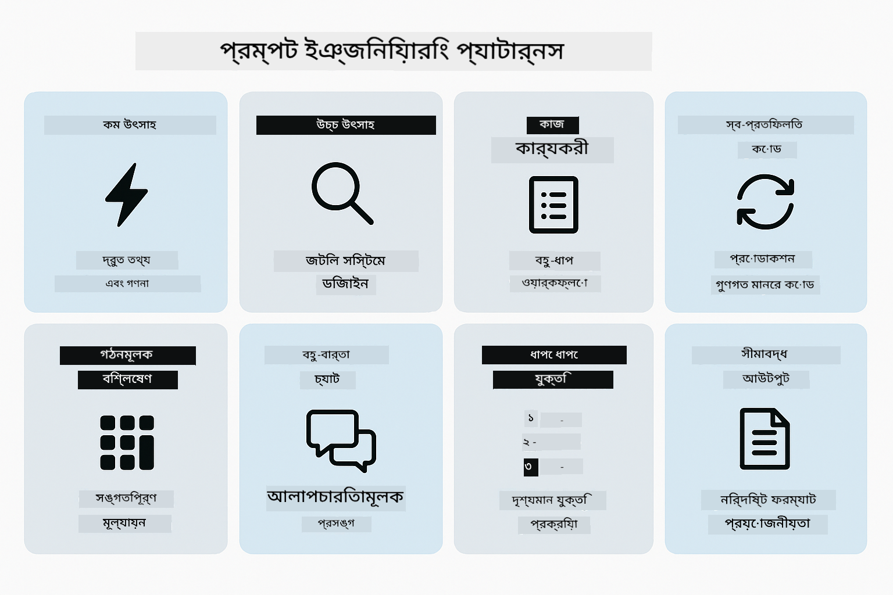
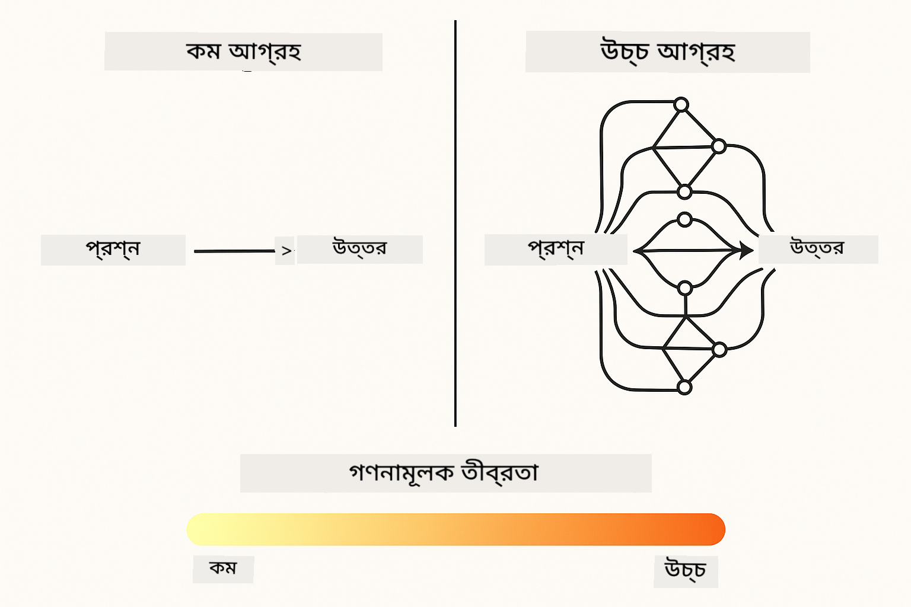
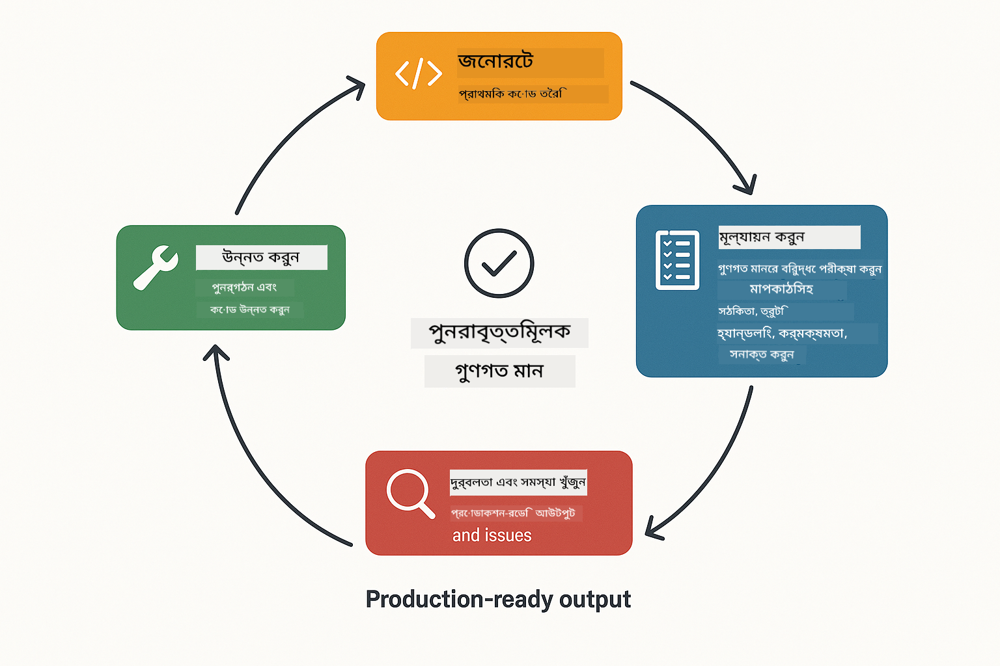
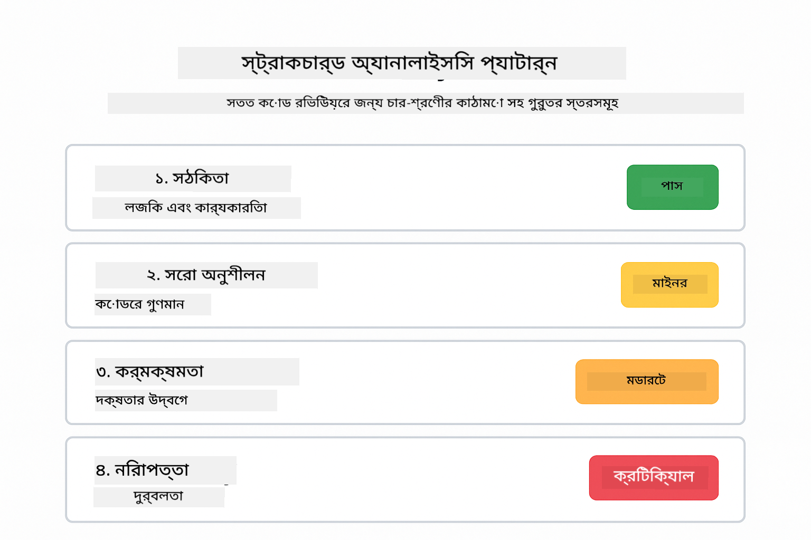
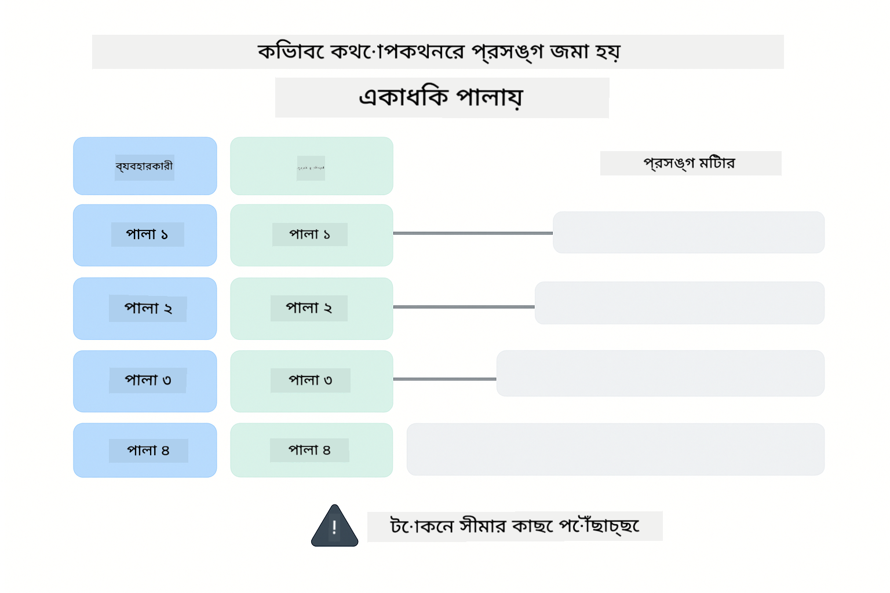
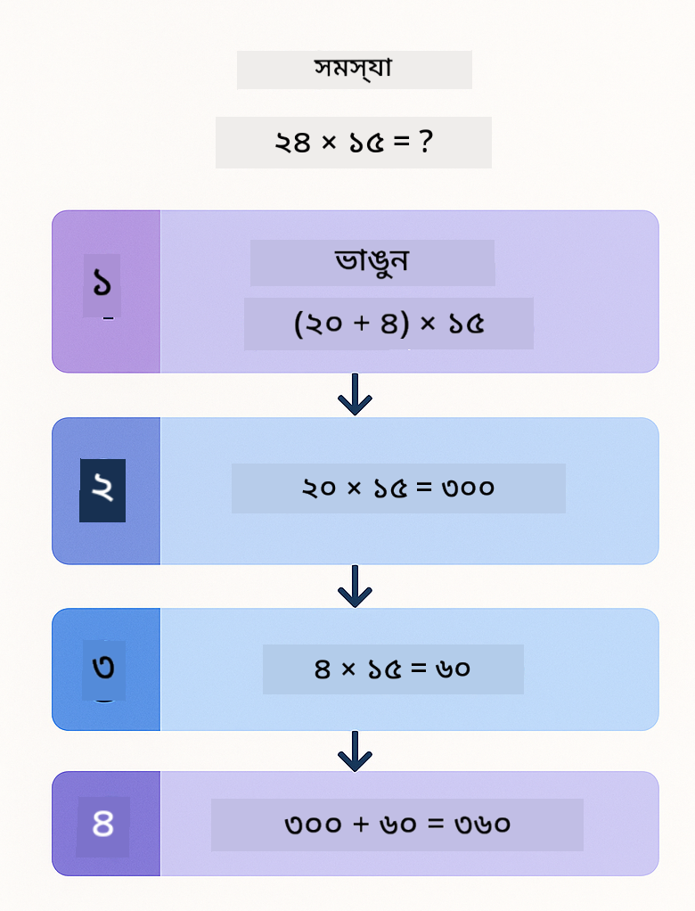
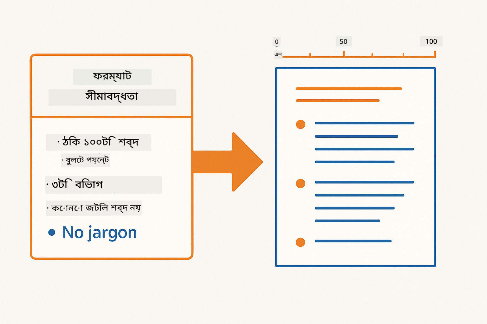
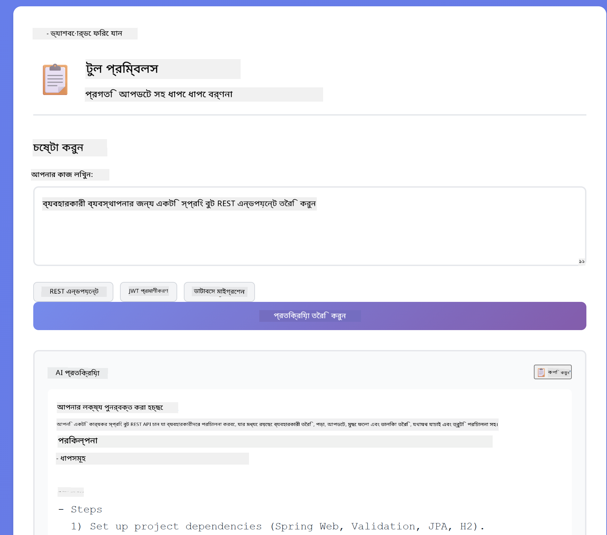
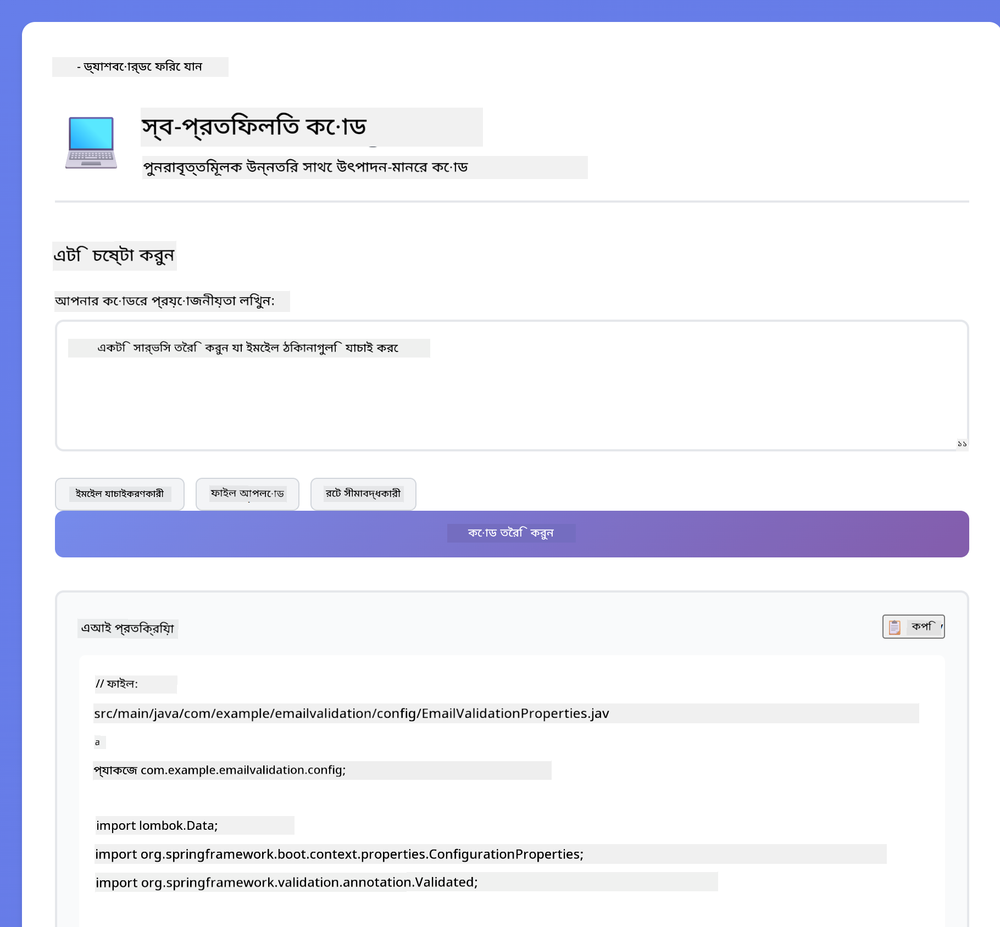
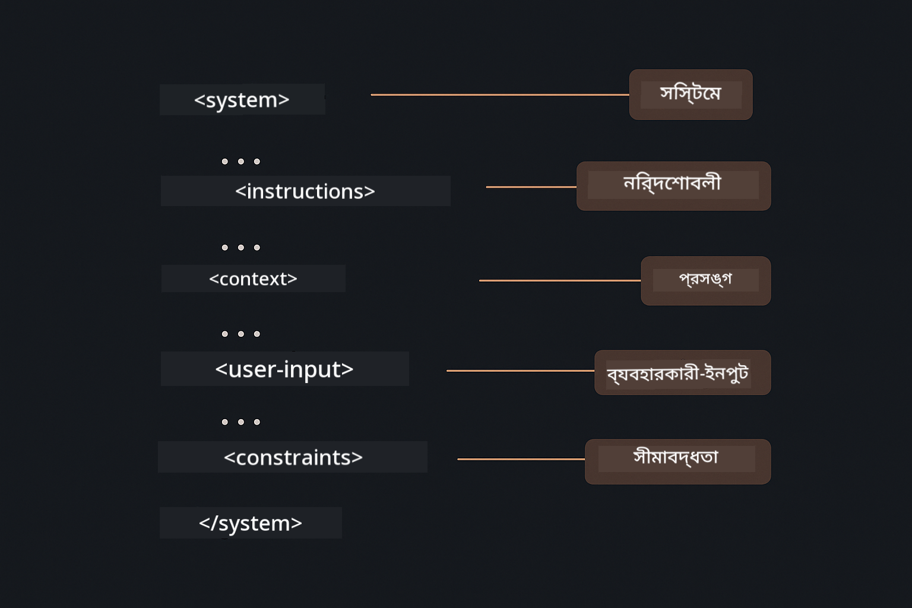

<!--
CO_OP_TRANSLATOR_METADATA:
{
  "original_hash": "8d787826cad7e92bf5cdbd116b1e6116",
  "translation_date": "2025-12-13T15:58:31+00:00",
  "source_file": "02-prompt-engineering/README.md",
  "language_code": "bn"
}
-->
# মডিউল ০২: GPT-5 এর সাথে প্রম্পট ইঞ্জিনিয়ারিং

## বিষয়বস্তু সূচি

- [আপনি যা শিখবেন](../../../02-prompt-engineering)
- [প্রয়োজনীয়তা](../../../02-prompt-engineering)
- [প্রম্পট ইঞ্জিনিয়ারিং বোঝা](../../../02-prompt-engineering)
- [কিভাবে এটি LangChain4j ব্যবহার করে](../../../02-prompt-engineering)
- [মূল প্যাটার্নসমূহ](../../../02-prompt-engineering)
- [বিদ্যমান Azure রিসোর্স ব্যবহার](../../../02-prompt-engineering)
- [অ্যাপ্লিকেশন স্ক্রিনশট](../../../02-prompt-engineering)
- [প্যাটার্নসমূহ অন্বেষণ](../../../02-prompt-engineering)
  - [কম বনাম উচ্চ আগ্রহ](../../../02-prompt-engineering)
  - [টাস্ক এক্সিকিউশন (টুল প্রিমেবলস)](../../../02-prompt-engineering)
  - [স্ব-প্রতিফলিত কোড](../../../02-prompt-engineering)
  - [গঠনমূলক বিশ্লেষণ](../../../02-prompt-engineering)
  - [মাল্টি-টার্ন চ্যাট](../../../02-prompt-engineering)
  - [ধাপে ধাপে যুক্তি](../../../02-prompt-engineering)
  - [সীমাবদ্ধ আউটপুট](../../../02-prompt-engineering)
- [আপনি আসলে যা শিখছেন](../../../02-prompt-engineering)
- [পরবর্তী ধাপসমূহ](../../../02-prompt-engineering)

## আপনি যা শিখবেন

পূর্ববর্তী মডিউলে, আপনি দেখেছেন কিভাবে মেমোরি কথোপকথনমূলক AI সক্ষম করে এবং GitHub মডেল ব্যবহার করে মৌলিক ইন্টারঅ্যাকশন করা যায়। এখন আমরা ফোকাস করব আপনি কিভাবে প্রশ্ন করেন - প্রম্পটগুলো নিজেই - Azure OpenAI এর GPT-5 ব্যবহার করে। আপনি যেভাবে প্রম্পট গঠন করবেন তা আপনার প্রাপ্ত উত্তরগুলোর গুণগত মানে ব্যাপক প্রভাব ফেলে।

আমরা GPT-5 ব্যবহার করব কারণ এটি যুক্তি নিয়ন্ত্রণ পরিচয় করায় - আপনি মডেলকে বলতে পারেন উত্তর দেওয়ার আগে কতটা চিন্তা করতে হবে। এটি বিভিন্ন প্রম্পটিং কৌশলকে আরও স্পষ্ট করে তোলে এবং আপনাকে বুঝতে সাহায্য করে কখন কোন পদ্ধতি ব্যবহার করবেন। এছাড়াও, Azure এর GPT-5 এর জন্য কম রেট লিমিট GitHub মডেলের তুলনায় সুবিধাজনক।

## প্রয়োজনীয়তা

- মডিউল ০১ সম্পন্ন (Azure OpenAI রিসোর্স ডিপ্লয় করা হয়েছে)
- রুট ডিরেক্টরিতে `.env` ফাইল যা Azure ক্রেডেনশিয়াল ধারণ করে (মডিউল ০১ এ `azd up` দ্বারা তৈরি)

> **নোট:** যদি আপনি মডিউল ০১ সম্পন্ন না করে থাকেন, প্রথমে সেখানে ডিপ্লয়মেন্ট নির্দেশনা অনুসরণ করুন।

## প্রম্পট ইঞ্জিনিয়ারিং বোঝা

প্রম্পট ইঞ্জিনিয়ারিং হল এমন ইনপুট টেক্সট ডিজাইন করা যা ধারাবাহিকভাবে আপনার প্রয়োজনীয় ফলাফল দেয়। এটি শুধু প্রশ্ন করা নয় - এটি এমনভাবে অনুরোধ গঠন করা যাতে মডেল ঠিক বুঝতে পারে আপনি কী চান এবং কিভাবে তা সরবরাহ করতে হবে।

এটি ভাবুন যেন আপনি একজন সহকর্মীকে নির্দেশনা দিচ্ছেন। "বাগ ঠিক করো" অস্পষ্ট। "UserService.java এর লাইন ৪৫ এ null pointer exception ঠিক করো null চেক যোগ করে" স্পষ্ট। ভাষা মডেলও একইভাবে কাজ করে - স্পষ্টতা এবং গঠন গুরুত্বপূর্ণ।

## কিভাবে এটি LangChain4j ব্যবহার করে

এই মডিউলটি পূর্ববর্তী মডিউলগুলোর মতো একই LangChain4j ভিত্তি ব্যবহার করে উন্নত প্রম্পটিং প্যাটার্ন প্রদর্শন করে, যেখানে ফোকাস প্রম্পট গঠন এবং যুক্তি নিয়ন্ত্রণে।


*কিভাবে LangChain4j আপনার প্রম্পটগুলোকে Azure OpenAI GPT-5 এর সাথে সংযুক্ত করে*

**ডিপেন্ডেন্সি** - মডিউল ০২ `pom.xml` এ সংজ্ঞায়িত নিম্নলিখিত langchain4j ডিপেন্ডেন্সি ব্যবহার করে:
```xml
<dependency>
    <groupId>dev.langchain4j</groupId>
    <artifactId>langchain4j</artifactId> <!-- Inherited from BOM in root pom.xml -->
</dependency>
<dependency>
    <groupId>dev.langchain4j</groupId>
    <artifactId>langchain4j-open-ai-official</artifactId> <!-- Inherited from BOM in root pom.xml -->
</dependency>
```

**OpenAiOfficialChatModel কনফিগারেশন** - [LangChainConfig.java](../../../02-prompt-engineering/src/main/java/com/example/langchain4j/prompts/config/LangChainConfig.java)

চ্যাট মডেলটি স্প্রিং বিন হিসেবে ম্যানুয়ালি কনফিগার করা হয়েছে OpenAI অফিসিয়াল ক্লায়েন্ট ব্যবহার করে, যা Azure OpenAI এন্ডপয়েন্ট সমর্থন করে। মডিউল ০১ থেকে মূল পার্থক্য হল আমরা কিভাবে `chatModel.chat()` এ প্রম্পট পাঠাই, মডেল সেটআপ নয়।

**সিস্টেম এবং ইউজার মেসেজ** - [Gpt5PromptService.java](../../../02-prompt-engineering/src/main/java/com/example/langchain4j/prompts/service/Gpt5PromptService.java)

LangChain4j স্পষ্টতার জন্য মেসেজ টাইপ আলাদা করে। `SystemMessage` AI এর আচরণ এবং প্রসঙ্গ নির্ধারণ করে (যেমন "আপনি একজন কোড রিভিউয়ার"), আর `UserMessage` আসল অনুরোধ ধারণ করে। এই বিভাজন আপনাকে বিভিন্ন ইউজার প্রশ্নে ধারাবাহিক AI আচরণ বজায় রাখতে দেয়।

```java
SystemMessage systemMsg = SystemMessage.from(
    "You are a helpful Java programming expert."
);

UserMessage userMsg = UserMessage.from(
    "Explain what a List is in Java"
);

String response = chatModel.chat(systemMsg, userMsg);
```


*SystemMessage স্থায়ী প্রসঙ্গ প্রদান করে, UserMessages পৃথক অনুরোধ ধারণ করে*

**MessageWindowChatMemory মাল্টি-টার্নের জন্য** - মাল্টি-টার্ন কথোপকথন প্যাটার্নের জন্য, আমরা মডিউল ০১ থেকে `MessageWindowChatMemory` পুনরায় ব্যবহার করি। প্রতিটি সেশনের জন্য একটি নিজস্ব মেমোরি ইনস্ট্যান্স `Map<String, ChatMemory>` এ সংরক্ষিত থাকে, যা একাধিক সমান্তরাল কথোপকথনকে প্রসঙ্গ মিশ্রণ ছাড়াই পরিচালনা করে।

**প্রম্পট টেমপ্লেট** - আসল ফোকাস এখানে প্রম্পট ইঞ্জিনিয়ারিং, নতুন LangChain4j API নয়। প্রতিটি প্যাটার্ন (কম আগ্রহ, উচ্চ আগ্রহ, টাস্ক এক্সিকিউশন ইত্যাদি) একই `chatModel.chat(prompt)` পদ্ধতি ব্যবহার করে কিন্তু সাবধানে গঠিত প্রম্পট স্ট্রিং সহ। XML ট্যাগ, নির্দেশনা, এবং ফরম্যাটিং সব প্রম্পট টেক্সটের অংশ, LangChain4j ফিচার নয়।

**যুক্তি নিয়ন্ত্রণ** - GPT-5 এর যুক্তি প্রচেষ্টা প্রম্পট নির্দেশনার মাধ্যমে নিয়ন্ত্রিত হয় যেমন "সর্বোচ্চ ২ ধাপ যুক্তি" বা "সম্পূর্ণভাবে অনুসন্ধান করো"। এগুলো প্রম্পট ইঞ্জিনিয়ারিং কৌশল, LangChain4j কনফিগারেশন নয়। লাইব্রেরি শুধু আপনার প্রম্পট মডেলে পৌঁছে দেয়।

মূল কথা: LangChain4j অবকাঠামো প্রদান করে (মডেল সংযোগ [LangChainConfig.java](../../../02-prompt-engineering/src/main/java/com/example/langchain4j/prompts/config/LangChainConfig.java) এর মাধ্যমে, মেমোরি, মেসেজ হ্যান্ডলিং [Gpt5PromptService.java](../../../02-prompt-engineering/src/main/java/com/example/langchain4j/prompts/service/Gpt5PromptService.java) এর মাধ্যমে), আর এই মডিউল আপনাকে শেখায় কিভাবে সেই অবকাঠামোর মধ্যে কার্যকর প্রম্পট তৈরি করবেন।

## মূল প্যাটার্নসমূহ

সব সমস্যার জন্য একই পদ্ধতি দরকার হয় না। কিছু প্রশ্ন দ্রুত উত্তর চায়, অন্যগুলো গভীর চিন্তা চায়। কিছু দৃশ্যমান যুক্তি চায়, অন্যগুলো শুধু ফলাফল চায়। এই মডিউল আটটি প্রম্পটিং প্যাটার্ন কভার করে - প্রতিটি বিভিন্ন পরিস্থিতির জন্য অপ্টিমাইজড। আপনি সবগুলো পরীক্ষা করবেন বুঝতে কখন কোন পদ্ধতি সবচেয়ে ভালো কাজ করে।



*আটটি প্রম্পট ইঞ্জিনিয়ারিং প্যাটার্ন এবং তাদের ব্যবহারের সংক্ষিপ্ত বিবরণ*



*কম আগ্রহ (দ্রুত, সরাসরি) বনাম উচ্চ আগ্রহ (গভীর, অনুসন্ধানমূলক) যুক্তি পদ্ধতি*

**কম আগ্রহ (দ্রুত ও ফোকাসড)** - সহজ প্রশ্নের জন্য যেখানে আপনি দ্রুত, সরাসরি উত্তর চান। মডেল সর্বোচ্চ ২ ধাপ যুক্তি করে। গণনা, লুকআপ বা সরল প্রশ্নের জন্য ব্যবহার করুন।

```java
String prompt = """
    <reasoning_effort>low</reasoning_effort>
    <instruction>maximum 2 reasoning steps</instruction>
    
    What is 15% of 200?
    """;

String response = chatModel.chat(prompt);
```

> 💡 **GitHub Copilot দিয়ে অনুসন্ধান করুন:** [`Gpt5PromptService.java`](../../../02-prompt-engineering/src/main/java/com/example/langchain4j/prompts/service/Gpt5PromptService.java) খুলে জিজ্ঞাসা করুন:
> - "কম আগ্রহ এবং উচ্চ আগ্রহ প্রম্পটিং প্যাটার্নের মধ্যে পার্থক্য কী?"
> - "প্রম্পটে XML ট্যাগগুলো কিভাবে AI এর উত্তর গঠন করতে সাহায্য করে?"
> - "কখন স্ব-প্রতিফলন প্যাটার্ন ব্যবহার করব বনাম সরাসরি নির্দেশনা?"

**উচ্চ আগ্রহ (গভীর ও বিস্তারিত)** - জটিল সমস্যার জন্য যেখানে আপনি বিস্তৃত বিশ্লেষণ চান। মডেল গভীরভাবে অনুসন্ধান করে এবং বিস্তারিত যুক্তি দেখায়। সিস্টেম ডিজাইন, আর্কিটেকচার সিদ্ধান্ত বা জটিল গবেষণার জন্য ব্যবহার করুন।

```java
String prompt = """
    <reasoning_effort>high</reasoning_effort>
    <instruction>explore thoroughly, show detailed reasoning</instruction>
    
    Design a caching strategy for a high-traffic REST API.
    """;

String response = chatModel.chat(prompt);
```

**টাস্ক এক্সিকিউশন (ধাপে ধাপে অগ্রগতি)** - বহু-ধাপের ওয়ার্কফ্লোর জন্য। মডেল একটি পরিকল্পনা দেয়, প্রতিটি ধাপ বর্ণনা করে, তারপর সারাংশ দেয়। মাইগ্রেশন, ইমপ্লিমেন্টেশন বা যেকোনো বহু-ধাপ প্রক্রিয়ার জন্য ব্যবহার করুন।

```java
String prompt = """
    <task>Create a REST endpoint for user registration</task>
    <preamble>Provide an upfront plan</preamble>
    <narration>Narrate each step as you work</narration>
    <summary>Summarize what was accomplished</summary>
    """;

String response = chatModel.chat(prompt);
```

চেইন-অফ-থট প্রম্পটিং মডেলকে তার যুক্তি প্রক্রিয়া দেখাতে বলে, যা জটিল কাজের জন্য নির্ভুলতা বাড়ায়। ধাপে ধাপে বিশ্লেষণ মানুষ এবং AI উভয়ের জন্য লজিক বোঝা সহজ করে।

> **🤖 [GitHub Copilot](https://github.com/features/copilot) চ্যাট দিয়ে চেষ্টা করুন:** এই প্যাটার্ন সম্পর্কে জিজ্ঞাসা করুন:
> - "দীর্ঘমেয়াদী অপারেশনের জন্য টাস্ক এক্সিকিউশন প্যাটার্ন কিভাবে অভিযোজিত করব?"
> - "প্রোডাকশন অ্যাপ্লিকেশনে টুল প্রিমেবল গঠন করার সেরা পদ্ধতি কী?"
> - "UI তে মধ্যবর্তী অগ্রগতি আপডেট ক্যাপচার ও প্রদর্শন কিভাবে করব?"


*পরিকল্পনা → কার্যকর → সারাংশ ওয়ার্কফ্লো বহু-ধাপের কাজের জন্য*

**স্ব-প্রতিফলিত কোড** - প্রোডাকশন-মানের কোড তৈরি করার জন্য। মডেল কোড তৈরি করে, গুণগত মান যাচাই করে, এবং পুনরাবৃত্তিমূলক উন্নতি করে। নতুন ফিচার বা সার্ভিস তৈরি করার সময় ব্যবহার করুন।

```java
String prompt = """
    <task>Create an email validation service</task>
    <quality_criteria>
    - Correct logic and error handling
    - Best practices (clean code, proper naming)
    - Performance optimization
    - Security considerations
    </quality_criteria>
    <instruction>Generate code, evaluate against criteria, improve iteratively</instruction>
    """;

String response = chatModel.chat(prompt);
```



*পুনরাবৃত্তিমূলক উন্নতি চক্র - তৈরি, মূল্যায়ন, সমস্যা সনাক্তকরণ, উন্নতি, পুনরাবৃত্তি*

**গঠনমূলক বিশ্লেষণ** - ধারাবাহিক মূল্যায়নের জন্য। মডেল একটি নির্দিষ্ট ফ্রেমওয়ার্ক (সঠিকতা, অনুশীলন, কর্মক্ষমতা, নিরাপত্তা) ব্যবহার করে কোড পর্যালোচনা করে। কোড রিভিউ বা গুণগত মূল্যায়নের জন্য ব্যবহার করুন।

```java
String prompt = """
    <code>
    public List getUsers() {
        return database.query("SELECT * FROM users");
    }
    </code>
    
    <framework>
    Evaluate using these categories:
    1. Correctness - Logic and functionality
    2. Best Practices - Code quality
    3. Performance - Efficiency concerns
    4. Security - Vulnerabilities
    </framework>
    """;

String response = chatModel.chat(prompt);
```

> **🤖 [GitHub Copilot](https://github.com/features/copilot) চ্যাট দিয়ে চেষ্টা করুন:** গঠনমূলক বিশ্লেষণ সম্পর্কে জিজ্ঞাসা করুন:
> - "বিভিন্ন ধরনের কোড রিভিউয়ের জন্য বিশ্লেষণ ফ্রেমওয়ার্ক কিভাবে কাস্টমাইজ করব?"
> - "গঠনমূলক আউটপুট প্রোগ্রাম্যাটিকভাবে পার্স ও কার্যকর করার সেরা উপায় কী?"
> - "বিভিন্ন রিভিউ সেশনে ধারাবাহিক সেভারিটি লেভেল কিভাবে নিশ্চিত করব?"



*চার-শ্রেণীর ফ্রেমওয়ার্ক ধারাবাহিক কোড রিভিউ এবং সেভারিটি লেভেলের জন্য*

**মাল্টি-টার্ন চ্যাট** - প্রসঙ্গ প্রয়োজন এমন কথোপকথনের জন্য। মডেল পূর্ববর্তী মেসেজ মনে রাখে এবং তার উপর ভিত্তি করে উত্তর দেয়। ইন্টারেক্টিভ হেল্প সেশন বা জটিল প্রশ্নোত্তরের জন্য ব্যবহার করুন।

```java
ChatMemory memory = MessageWindowChatMemory.withMaxMessages(10);

memory.add(UserMessage.from("What is Spring Boot?"));
AiMessage aiMessage1 = chatModel.chat(memory.messages()).aiMessage();
memory.add(aiMessage1);

memory.add(UserMessage.from("Show me an example"));
AiMessage aiMessage2 = chatModel.chat(memory.messages()).aiMessage();
memory.add(aiMessage2);
```



*কথোপকথনের প্রসঙ্গ একাধিক টার্ন ধরে জমা হয় যতক্ষণ না টোকেন সীমা পৌঁছায়*

**ধাপে ধাপে যুক্তি** - দৃশ্যমান লজিক প্রয়োজন এমন সমস্যার জন্য। মডেল প্রতিটি ধাপের স্পষ্ট যুক্তি দেখায়। গণিত সমস্যা, লজিক পাজল বা চিন্তার প্রক্রিয়া বোঝার জন্য ব্যবহার করুন।

```java
String prompt = """
    <instruction>Show your reasoning step-by-step</instruction>
    
    If a train travels 120 km in 2 hours, then stops for 30 minutes,
    then travels another 90 km in 1.5 hours, what is the average speed
    for the entire journey including the stop?
    """;

String response = chatModel.chat(prompt);
```



*সমস্যাগুলোকে স্পষ্ট যুক্তিসঙ্গত ধাপে ভাঙ্গা*

**সীমাবদ্ধ আউটপুট** - নির্দিষ্ট ফরম্যাটের প্রয়োজন এমন উত্তরগুলোর জন্য। মডেল কঠোরভাবে ফরম্যাট এবং দৈর্ঘ্যের নিয়ম অনুসরণ করে। সারাংশ বা সুনির্দিষ্ট আউটপুট গঠনের জন্য ব্যবহার করুন।

```java
String prompt = """
    <constraints>
    - Exactly 100 words
    - Bullet point format
    - Technical terms only
    </constraints>
    
    Summarize the key concepts of machine learning.
    """;

String response = chatModel.chat(prompt);
```



*নির্দিষ্ট ফরম্যাট, দৈর্ঘ্য এবং গঠনগত নিয়ম প্রয়োগ*

## বিদ্যমান Azure রিসোর্স ব্যবহার

**ডিপ্লয়মেন্ট যাচাই করুন:**

রুট ডিরেক্টরিতে `.env` ফাইল আছে কিনা নিশ্চিত করুন যা Azure ক্রেডেনশিয়াল ধারণ করে (মডিউল ০১ এ তৈরি):
```bash
cat ../.env  # AZURE_OPENAI_ENDPOINT, API_KEY, DEPLOYMENT দেখানো উচিত
```

**অ্যাপ্লিকেশন শুরু করুন:**

> **নোট:** যদি আপনি মডিউল ০১ থেকে `./start-all.sh` ব্যবহার করে সব অ্যাপ্লিকেশন ইতিমধ্যে শুরু করে থাকেন, এই মডিউলটি ইতিমধ্যে পোর্ট ৮০৮৩ এ চলছে। নিচের শুরু কমান্ডগুলো এড়িয়ে সরাসরি http://localhost:8083 এ যেতে পারেন।

**অপশন ১: স্প্রিং বুট ড্যাশবোর্ড ব্যবহার (VS Code ব্যবহারকারীদের জন্য সুপারিশকৃত)**

ডেভ কন্টেইনারে স্প্রিং বুট ড্যাশবোর্ড এক্সটেনশন অন্তর্ভুক্ত, যা সব স্প্রিং বুট অ্যাপ্লিকেশন পরিচালনার জন্য ভিজ্যুয়াল ইন্টারফেস দেয়। VS Code এর বাম পাশে অ্যাক্টিভিটি বারে (স্প্রিং বুট আইকন দেখুন) এটি পাওয়া যাবে।

স্প্রিং বুট ড্যাশবোর্ড থেকে আপনি:
- ওয়ার্কস্পেসের সব স্প্রিং বুট অ্যাপ্লিকেশন দেখতে পারবেন
- এক ক্লিকে অ্যাপ্লিকেশন শুরু/বন্ধ করতে পারবেন
- রিয়েল-টাইমে লগ দেখতে পারবেন
- অ্যাপ্লিকেশন স্ট্যাটাস মনিটর করতে পারবেন

শুধু "prompt-engineering" এর পাশে প্লে বাটনে ক্লিক করে এই মডিউল শুরু করুন, অথবা সব মডিউল একসাথে শুরু করুন।


**অপশন ২: শেল স্ক্রিপ্ট ব্যবহার**

সব ওয়েব অ্যাপ্লিকেশন (মডিউল ০১-০৪) শুরু করুন:

**Bash:**
```bash
cd ..  # রুট ডিরেক্টরি থেকে
./start-all.sh
```

**PowerShell:**
```powershell
cd ..  # রুট ডিরেক্টরি থেকে
.\start-all.ps1
```

অথবা শুধু এই মডিউল শুরু করুন:

**Bash:**
```bash
cd 02-prompt-engineering
./start.sh
```

**PowerShell:**
```powershell
cd 02-prompt-engineering
.\start.ps1
```

উভয় স্ক্রিপ্ট স্বয়ংক্রিয়ভাবে রুট `.env` ফাইল থেকে পরিবেশ ভেরিয়েবল লোড করে এবং যদি JAR না থাকে তবে বিল্ড করবে।

> **নোট:** আপনি যদি শুরু করার আগে সব মডিউল ম্যানুয়ালি বিল্ড করতে চান:
>
> **Bash:**
> ```bash
> cd ..  # Go to root directory
> mvn clean package -DskipTests
> ```
>
> **PowerShell:**
> ```powershell
> cd ..  # Go to root directory
> mvn clean package -DskipTests
> ```

আপনার ব্রাউজারে http://localhost:8083 খুলুন।

**বন্ধ করতে:**

**Bash:**
```bash
./stop.sh  # শুধুমাত্র এই মডিউল
# অথবা
cd .. && ./stop-all.sh  # সমস্ত মডিউলগুলি
```

**PowerShell:**
```powershell
.\stop.ps1  # শুধুমাত্র এই মডিউল
# অথবা
cd ..; .\stop-all.ps1  # সমস্ত মডিউলগুলি
```

## অ্যাপ্লিকেশন স্ক্রিনশট


*মূল ড্যাশবোর্ড যা আটটি প্রম্পট ইঞ্জিনিয়ারিং প্যাটার্ন এবং তাদের বৈশিষ্ট্য ও ব্যবহারের ক্ষেত্র দেখায়*

## প্যাটার্নসমূহ অন্বেষণ

ওয়েব ইন্টারফেস আপনাকে বিভিন্ন প্রম্পটিং কৌশল পরীক্ষা করার সুযোগ দেয়। প্রতিটি প্যাটার্ন বিভিন্ন সমস্যা সমাধান করে - চেষ্টা করে দেখুন কখন কোন পদ্ধতি সবচেয়ে ভালো কাজ করে।

### কম বনাম উচ্চ আগ্রহ

কম আগ্রহ ব্যবহার করে একটি সহজ প্রশ্ন করুন যেমন "২০০ এর ১৫% কত?" আপনি পাবেন তাৎক্ষণিক, সরাসরি উত্তর। এখন উচ্চ আগ্রহ ব্যবহার করে কিছু জটিল প্রশ্ন করুন যেমন "একটি উচ্চ-ট্রাফিক API এর জন্য ক্যাশিং কৌশল ডিজাইন করুন"। দেখুন কিভাবে মডেল ধীরে ধীরে বিশদ যুক্তি প্রদান করে। একই মডেল, একই প্রশ্ন কাঠামো - কিন্তু প্রম্পট বলে দেয় কতটা চিন্তা করতে হবে।


*সর্বনিম্ন যুক্তি সহ দ্রুত গণনা*


*ব্যাপক ক্যাশিং কৌশল (২.৮এমবি)*

### টাস্ক এক্সিকিউশন (টুল প্রিমেবলস)

বহু-ধাপের ওয়ার্কফ্লো পূর্ব পরিকল্পনা এবং অগ্রগতি বর্ণনা থেকে উপকৃত হয়। মডেল কী করবে তা রূপরেখা দেয়, প্রতিটি ধাপ বর্ণনা করে, তারপর ফলাফল সারাংশ করে।



*ধাপে ধাপে বর্ণনা সহ একটি REST এন্ডপয়েন্ট তৈরি করা (৩.৯এমবি)*

### স্ব-প্রতিফলিত কোড

"একটি ইমেইল যাচাইকরণ সেবা তৈরি করুন" চেষ্টা করুন। শুধু কোড তৈরি করে থেমে না থেকে, মডেল তৈরি করে, গুণগত মানের বিরুদ্ধে মূল্যায়ন করে, দুর্বলতা চিহ্নিত করে এবং উন্নতি করে। আপনি দেখতে পাবেন এটি পুনরাবৃত্তি করে যতক্ষণ না কোড উৎপাদন মান পূরণ করে।



*সম্পূর্ণ ইমেইল যাচাইকরণ সেবা (৫.২এমবি)*

### কাঠামোবদ্ধ বিশ্লেষণ

কোড পর্যালোচনার জন্য ধারাবাহিক মূল্যায়ন কাঠামো প্রয়োজন। মডেল নির্দিষ্ট বিভাগ (সঠিকতা, অনুশীলন, কর্মক্ষমতা, নিরাপত্তা) এবং তীব্রতা স্তর ব্যবহার করে কোড বিশ্লেষণ করে।


*ফ্রেমওয়ার্ক-ভিত্তিক কোড পর্যালোচনা*

### বহু-টান কথোপকথন

"স্প্রিং বুট কী?" জিজ্ঞাসা করুন তারপর সঙ্গে সঙ্গে "আমাকে একটি উদাহরণ দেখাও" বলুন। মডেল আপনার প্রথম প্রশ্ন মনে রাখে এবং আপনাকে স্প্রিং বুটের একটি নির্দিষ্ট উদাহরণ দেয়। স্মৃতি ছাড়া, দ্বিতীয় প্রশ্নটি খুব অস্পষ্ট হত।


*প্রশ্নের মধ্যে প্রসঙ্গ সংরক্ষণ*

### ধাপে ধাপে যুক্তি

একটি গণিত সমস্যা বেছে নিন এবং এটি ধাপে ধাপে যুক্তি এবং কম উৎসাহের সাথে চেষ্টা করুন। কম উৎসাহ কেবল উত্তর দেয় - দ্রুত কিন্তু অস্পষ্ট। ধাপে ধাপে আপনাকে প্রতিটি গণনা এবং সিদ্ধান্ত দেখায়।


*স্পষ্ট ধাপ সহ গণিত সমস্যা*

### সীমাবদ্ধ আউটপুট

যখন নির্দিষ্ট ফরম্যাট বা শব্দ সংখ্যা প্রয়োজন, এই প্যাটার্ন কঠোরভাবে অনুসরণ নিশ্চিত করে। ঠিক ১০০ শব্দের বুলেট পয়েন্ট ফরম্যাটে একটি সারাংশ তৈরি করার চেষ্টা করুন।


*ফরম্যাট নিয়ন্ত্রণ সহ মেশিন লার্নিং সারাংশ*

## আপনি আসলে কী শিখছেন

**যুক্তি প্রচেষ্টা সবকিছু পরিবর্তন করে**

GPT-5 আপনাকে আপনার প্রম্পটের মাধ্যমে গণনামূলক প্রচেষ্টা নিয়ন্ত্রণ করতে দেয়। কম প্রচেষ্টা মানে দ্রুত উত্তর যা কম অনুসন্ধান করে। উচ্চ প্রচেষ্টা মানে মডেল গভীরভাবে চিন্তা করতে সময় নেয়। আপনি শিখছেন কাজের জটিলতার সাথে প্রচেষ্টা মিলিয়ে নিতে - সহজ প্রশ্নে সময় নষ্ট করবেন না, কিন্তু জটিল সিদ্ধান্তে তাড়াহুড়ো করবেন না।

**কাঠামো আচরণ নির্দেশ করে**

প্রম্পটে XML ট্যাগ লক্ষ্য করেছেন? এগুলো সাজসজ্জা নয়। মডেলগুলি কাঠামোবদ্ধ নির্দেশাবলী ফ্রি-ফর্ম টেক্সটের চেয়ে বেশি নির্ভরযোগ্যভাবে অনুসরণ করে। যখন বহু-ধাপ প্রক্রিয়া বা জটিল লজিক প্রয়োজন, কাঠামো মডেলকে ট্র্যাক করতে সাহায্য করে এটি কোথায় আছে এবং পরবর্তী কী।



*পরিষ্কার বিভাগ এবং XML-শৈলী সংগঠনের সাথে একটি ভাল কাঠামোবদ্ধ প্রম্পটের গঠন*

**স্ব-মূল্যায়নের মাধ্যমে গুণগত মান**

স্ব-প্রতিফলিত প্যাটার্নগুলি গুণগত মানের মানদণ্ড স্পষ্ট করে কাজ করে। মডেল "ঠিক করছে" আশা করার পরিবর্তে, আপনি এটাকে ঠিক কী মানে "ঠিক" তা বলেন: সঠিক লজিক, ত্রুটি পরিচালনা, কর্মক্ষমতা, নিরাপত্তা। মডেল তার নিজস্ব আউটপুট মূল্যায়ন করতে পারে এবং উন্নতি করতে পারে। এটি কোড তৈরি লটারি থেকে একটি প্রক্রিয়ায় পরিণত করে।

**প্রসঙ্গ সীমিত**

বহু-টান কথোপকথন প্রতিটি অনুরোধের সাথে বার্তা ইতিহাস অন্তর্ভুক্ত করে কাজ করে। কিন্তু একটি সীমা আছে - প্রতিটি মডেলের সর্বোচ্চ টোকেন সংখ্যা থাকে। কথোপকথন বাড়ার সাথে সাথে, আপনাকে প্রাসঙ্গিক প্রসঙ্গ বজায় রাখার কৌশল প্রয়োজন হবে যাতে সেই সীমা ছোঁয়া না হয়। এই মডিউল আপনাকে স্মৃতির কাজ শেখায়; পরে আপনি শিখবেন কখন সারাংশ করতে হবে, কখন ভুলে যেতে হবে, এবং কখন পুনরুদ্ধার করতে হবে।

## পরবর্তী ধাপ

**পরবর্তী মডিউল:** [03-rag - RAG (Retrieval-Augmented Generation)](../03-rag/README.md)

---

**নেভিগেশন:** [← পূর্ববর্তী: মডিউল 01 - পরিচিতি](../01-introduction/README.md) | [প্রধান পৃষ্ঠায় ফিরে যান](../README.md) | [পরবর্তী: মডিউল 03 - RAG →](../03-rag/README.md)

---

<!-- CO-OP TRANSLATOR DISCLAIMER START -->
**অস্বীকৃতি**:  
এই নথিটি AI অনুবাদ সেবা [Co-op Translator](https://github.com/Azure/co-op-translator) ব্যবহার করে অনূদিত হয়েছে। আমরা যথাসাধ্য সঠিকতার চেষ্টা করি, তবে স্বয়ংক্রিয় অনুবাদে ত্রুটি বা অসঙ্গতি থাকতে পারে। মূল নথিটি তার নিজস্ব ভাষায়ই কর্তৃত্বপূর্ণ উৎস হিসেবে বিবেচিত হওয়া উচিত। গুরুত্বপূর্ণ তথ্যের জন্য পেশাদার মানব অনুবাদ গ্রহণ করার পরামর্শ দেওয়া হয়। এই অনুবাদের ব্যবহারে সৃষ্ট কোনো ভুল বোঝাবুঝি বা ভুল ব্যাখ্যার জন্য আমরা দায়ী নই।
<!-- CO-OP TRANSLATOR DISCLAIMER END -->