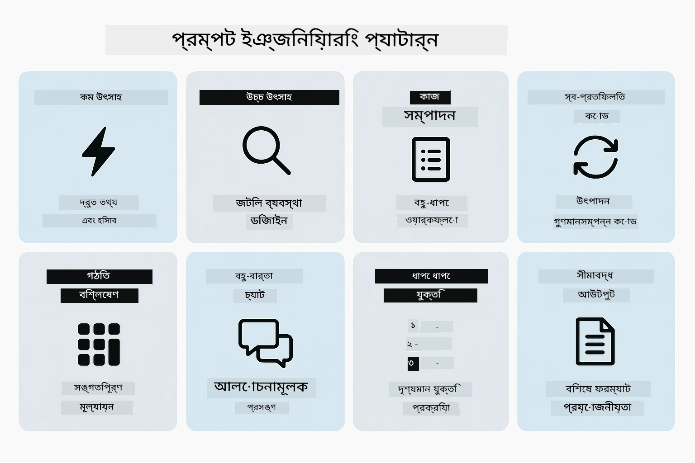
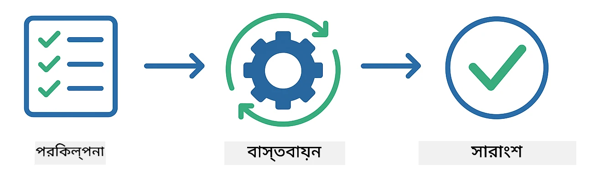
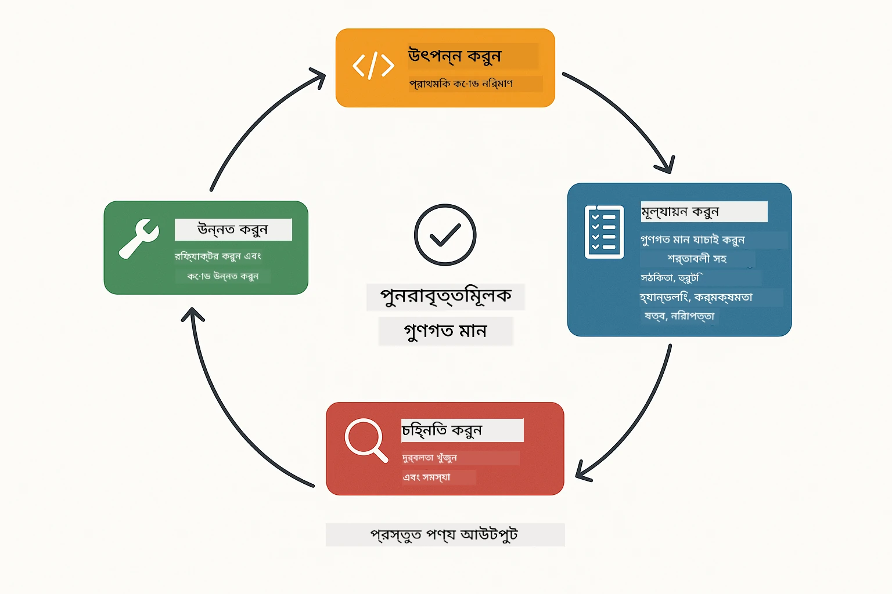
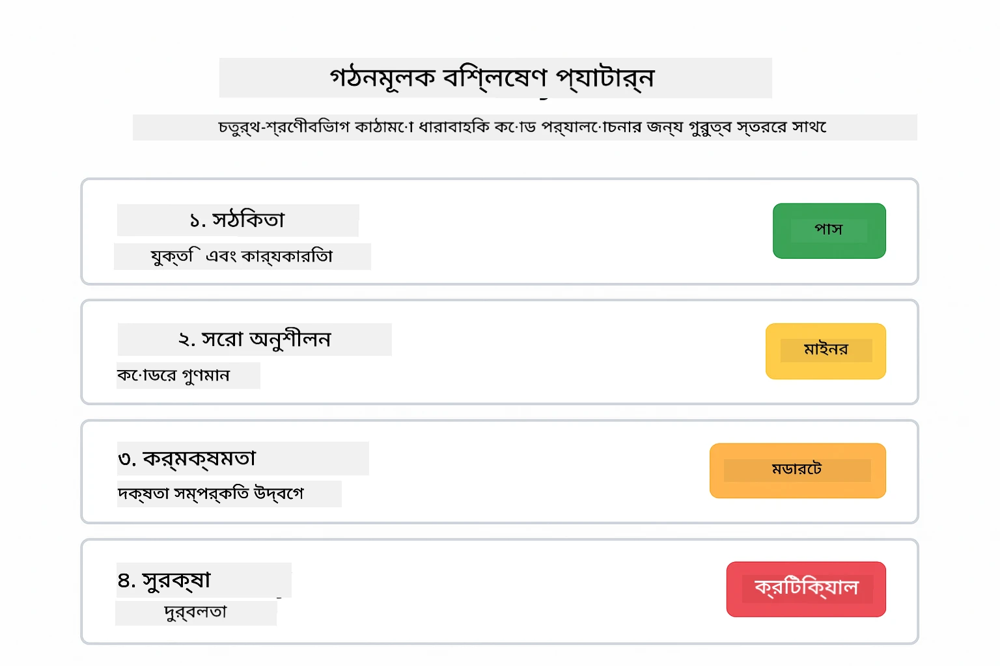
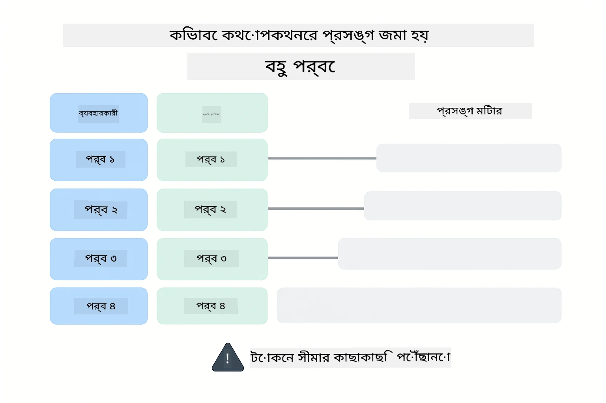
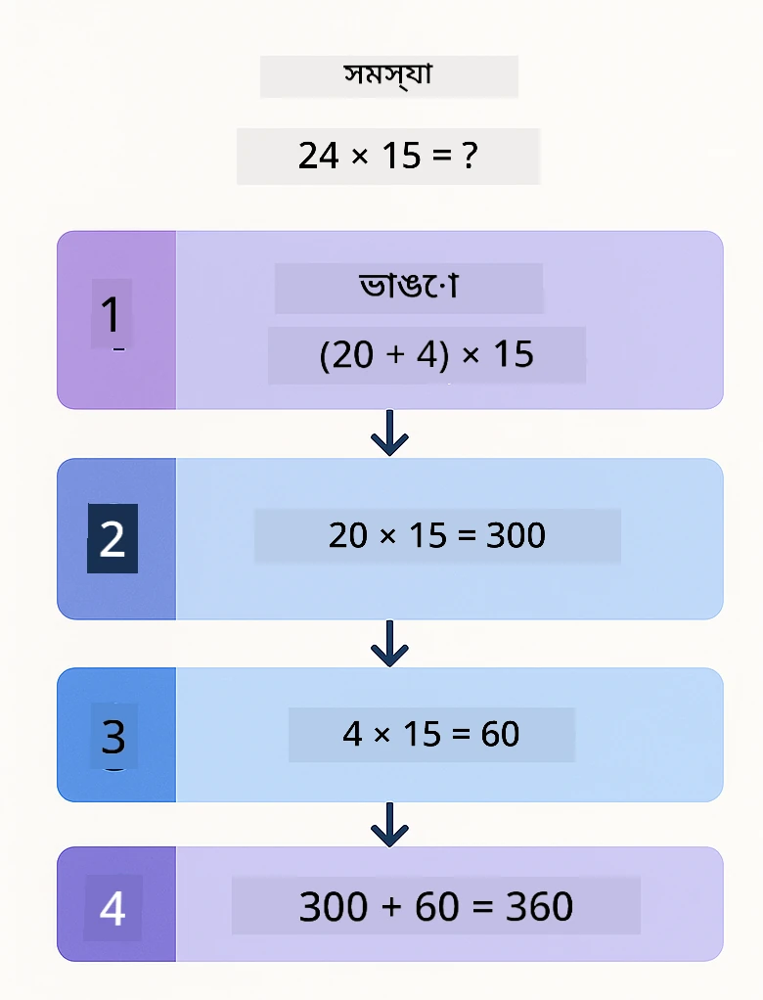
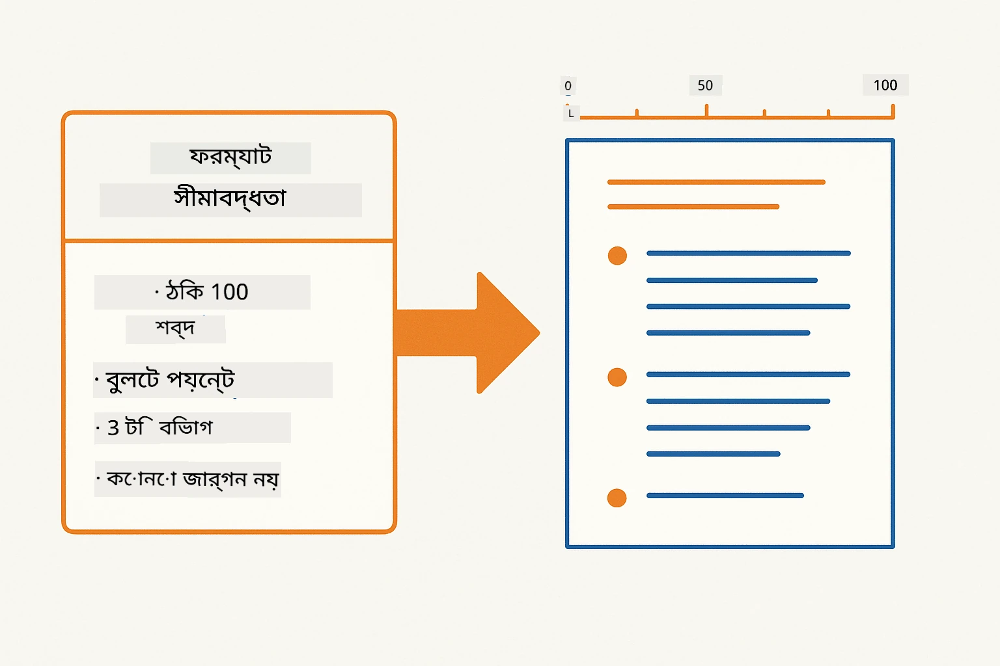
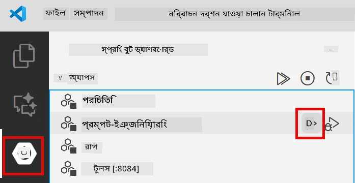
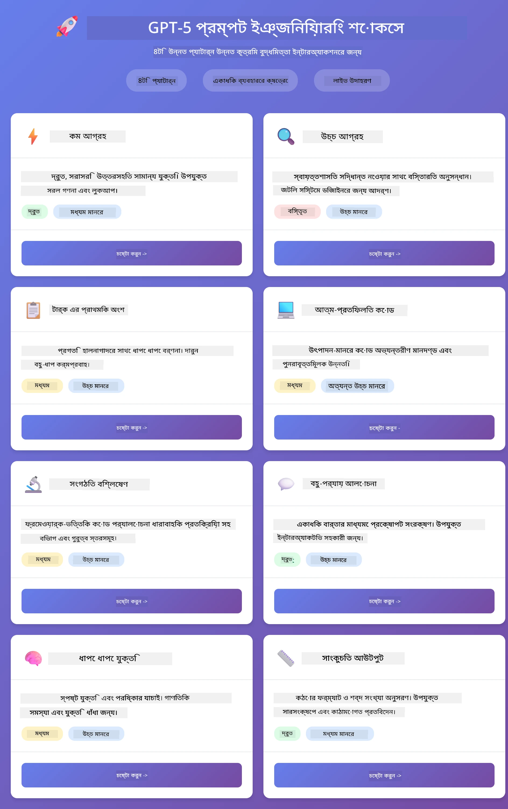
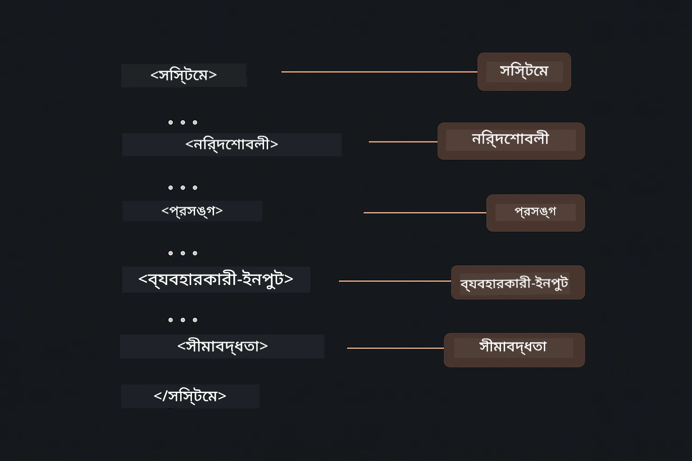

# মডিউল ০২: GPT-5.2 সহ প্রম্পট ইঞ্জিনিয়ারিং

## বিষয়বস্তু তালিকা

- [ভিডিও ওয়াকথ্রু](#ভিডিও-ওয়াকথ্রু)
- [আপনি যা শিখবেন](#আপনি-যা-শিখবেন)
- [পূর্বশর্তাবলী](#পূর্বশর্তাবলী)
- [প্রম্পট ইঞ্জিনিয়ারিং বুঝুন](#প্রম্পট-ইঞ্জিনিয়ারিং-বুঝুন)
- [প্রম্পট ইঞ্জিনিয়ারিংয়ের মৌলিক বিষয়াবলী](#প্রম্পট-ইঞ্জিনিয়ারিংয়ের-মৌলিক-বিষয়াবলী)
  - [জিরো-শট প্রম্পটিং](#জিরো-শট-প্রম্পটিং)
  - [ফিউ-শট প্রম্পটিং](#ফিউ-শট-প্রম্পটিং)
  - [চেইন অফ থট্](#চেইন-অফ-থট)
  - [রোল-ভিত্তিক প্রম্পটিং](#রোল-ভিত্তিক-প্রম্পটিং)
  - [প্রম্পট টেমপ্লেটস](#প্রম্পট-টেমপ্লেটস)
- [অগ্রগামী প্যাটার্নস](#অগ্রগামী-প্যাটার্নস)
- [অ্যাপ্লিকেশন চালান](#অ্যাপ্লিকেশন-চালান)
- [অ্যাপ্লিকেশনের স্ক্রীনশট](#অ্যাপ্লিকেশন-স্ক্রিনশট)
- [প্যাটার্নস অন্বেষণ](#প্যাটার্নগুলি-পরীক্ষা-করা)
  - [কম বনাম বেশি উৎসাহ](#low-বনাম-high-eagerness)
  - [টাস্ক এক্সিকিউশন (টুল প্রিম্বলস)](#টাস্ক-এক্সেকিউশন-টুল-প্রিমেবলস)
  - [সেলফ-রিফ্লেক্টিং কোড](#সেলফ-রিফ্লেক্টিং-কোড)
  - [স্ট্রাকচার্ড অ্যানালাইসিস](#স্ট্রাকচার্ড-অ্যানালাইসিস)
  - [মাল্টি-টার্ন চ্যাট](#মাল্টি-টার্ন-চ্যাট)
  - [ধাপে ধাপে যুক্তি](#ধাপে-ধাপে-যুক্তি)
  - [সীমাবদ্ধ আউটপুট](#সংকীর্ণ-আউটপুট)
- [আপনি আসলে কী শিখছেন](#আপনি-আসলেই-কি-শিখছেন)
- [পরবর্তী ধাপ](#পরবর্তী-ধাপ)

## ভিডিও ওয়াকথ্রু

এই লাইভ সেশনটি দেখুন যা এই মডিউল শুরু করার পদ্ধতি ব্যাখ্যা করে:

<a href="https://www.youtube.com/live/PJ6aBaE6bog?si=LDshyBrTRodP-wke"></a>

## আপনি যা শিখবেন

নিম্নলিখিত চিত্রটি এই মডিউলে আপনি যা শিখবেন তার মূল বিষয় এবং দক্ষতার একটি সংক্ষিপ্ত বিবরণ প্রদান করে — প্রম্পট রিফাইনমেন্ট কৌশলগুলি থেকে শুরু করে আপনি অনুসরণ করবেন এমন পর্যায়ক্রমিক ওয়ার্কফ্লো পর্যন্ত।


পূর্ববর্তী মডিউলে, আপনি দেখেছেন কিভাবে মেমোরি Azure OpenAI সহ কথোপকথন ইউআই সক্ষম করে। এখন আমরা ফোকাস করব কিভাবে আপনি প্রশ্ন করবেন — অর্থাৎ প্রম্পট নিজেই — Azure OpenAI এর GPT-5.2 ব্যবহার করে। আপনি যেভাবে প্রম্পটগুলো গঠন করবেন তা প্রাপ্ত উত্তরগুলির গুণগত মানে ব্যাপক প্রভাব ফেলে। আমরা শুরু করব মৌলিক প্রম্পটিং কৌশলগুলোর পর্যালোচনা দিয়ে, তারপর এগিয়ে যাব আটটি উন্নত প্যাটার্নের দিকে যা GPT-5.2 এর সক্ষমতাগুলোর পূর্ণ ব্যবহার করে।

আমরা GPT-5.2 ব্যবহার করব কারণ এটি যুক্তি নিয়ন্ত্রণ পরিচয় করায় — আপনি মডেলকে বলতে পারবেন উত্তর দেবার আগে কতটুকু চিন্তা করতে হবে। এটি বিভিন্ন প্রম্পটিং স্ট্র্যাটেজি আরও স্পষ্ট করে তোলে এবং আপনাকে বুঝতে সাহায্য করে কখন কোন পদ্ধতি ব্যবহার করবেন।

## পূর্বশর্তাবলী

- মডিউল ০১ সম্পন্ন হয়েছে (Azure OpenAI রিসোর্স মোতায়েন করা হয়েছে)
- রুট ডিরেক্টরিতে `.env` ফাইল আছে Azure ক্রেডেনশিয়ালসহ (মডিউল ০১ এ `azd up` দ্বারা তৈরি)

> **দ্রষ্টব্য:** যদি আপনি মডিউল ০১ সম্পন্ন না করে থাকেন, তাহলে আগে সেখানে ডিপ্লয়মেন্টের নির্দেশাবলী অনুসরণ করুন।

## প্রম্পট ইঞ্জিনিয়ারিং বুঝুন

মূলত, প্রম্পট ইঞ্জিনিয়ারিং হল অস্পষ্ট নির্দেশনা এবং নির্ভুল নির্দেশনার মধ্যে পার্থক্য, নিচের তুলনাটি দেখিয়েছে তা।


প্রম্পট ইঞ্জিনিয়ারিং হচ্ছে এমন ইনপুট টেক্সট ডিজাইন করা যা ধারাবাহিকভাবে আপনাকে প্রয়োজনীয় ফলাফল দেয়। এটি শুধু প্রশ্ন করার কথা নয় — এটি এমনভাবে অনুরোধগুলো রচনা করা যাতে মডেল স্পষ্টভাবে বুঝতে পারে আপনি ঠিক কী চান এবং কীভাবে তা সরবরাহ করা উচিত।

একজন সহকর্মীকে নির্দেশ দেওয়ার মত চিন্তা করুন। "বাগ ফিক্স করুন" অস্পষ্ট। "UserService.java লাইনের ৪৫-এ নাল পয়েন্টার একসেপশন ফিক্স করতে নাল চেক যোগ করুন" স্পষ্ট। ভাষার মডেলগুলো একই রকম কাজ করে — নির্দিষ্টতা এবং গঠন গুরুত্বপূর্ণ।

নিচের চিত্রটি দেখায় কিভাবে LangChain4j এই চিত্রে ফিট করে — SystemMessage এবং UserMessage নির্মাণ ব্লকে আপনার প্রম্পট প্যাটার্নগুলো মডেলের সাথে সংযুক্ত করে।


LangChain4j প্রদান করে অবকাঠামো — মডেল সংযোগ, মেমোরি, এবং মেসেজ প্রকার — যখন প্রম্পট প্যাটার্নগুলো শুধু সাবধানে গঠিত টেক্সট যা আপনি ঐ অবকাঠামোর মাধ্যমে পাঠান। মূল নির্মাণ ব্লক হল `SystemMessage` (যা AI এর আচরণ এবং ভূমিকা সেট করে) এবং `UserMessage` (যা আপনার প্রকৃত অনুরোধ বহন করে)।

## প্রম্পট ইঞ্জিনিয়ারিংয়ের মৌলিক বিষয়াবলী

নিম্নলিখিত পাঁচটি মূল কৌশল কার্যকর প্রম্পট ইঞ্জিনিয়ারিংয়ের ভিত্তি গঠন করে। প্রতিটি ভাষার মডেলগুলোর সাথে আপনার যোগাযোগের একটি ভিন্ন দিক সম্বোধন করে।


এই মডিউলে উন্নত প্যাটার্নগুলিতে প্রবেশ করার আগে, আসুন পাঁচটি মৌলিক প্রম্পটিং কৌশল পুনরালোচনা করি। এগুলো হল সেই নির্মাণ ব্লক যা প্রতিটি প্রম্পট ইঞ্জিনিয়ারকে জানা উচিত।

### জিরো-শট প্রম্পটিং

সবচেয়ে সহজ পদ্ধতি: মডেলকে সরাসরি কোনো উদাহরণ ছাড়াই নির্দেশ দেওয়া। মডেল সম্পূর্ণরূপে তার প্রশিক্ষণের ওপর নির্ভর করে কাজটি বোঝে এবং সম্পাদন করে। এটি সহজ রকমের অনুরোধের জন্য ভালো কাজ করে যেখানে প্রত্যাশিত আচরণ স্পষ্ট।


*উদাহরণ ছাড়া সরাসরি নির্দেশনা — মডেল শুধুমাত্র নির্দেশ থেকে কাজটি অনুমান করে*

```java
String prompt = "Classify this sentiment: 'I absolutely loved the movie!'";
String response = model.chat(prompt);
// প্রতিক্রিয়া: "ইতিবাচক"
```

**কখন ব্যবহার করবেন:** সাধারণ শ্রেণিবিন্যাস, সরাসরি প্রশ্ন, অনুবাদ বা এমন কোনো কাজ যা মডেল অতিরিক্ত নির্দেশনা ছাড়া পরিচালনা করতে পারে।

### ফিউ-শট প্রম্পটিং

আপনার কাঙ্ক্ষিত প্যাটার্নটি মডেলকে শেখানোর জন্য উদাহরণ প্রদান করুন। মডেল আপনার উদাহরণ থেকে প্রত্যাশিত ইনপুট-আউটপুট ফরম্যাট শিখে এবং নতুন ইনপুটে তা প্রয়োগ করে। এটি এমন কাজের জন্য ধারাবাহিকতা উল্লেখযোগ্যভাবে বাড়ায় যেখানে কাঙ্ক্ষিত ফরম্যাট বা আচরণ স্পষ্ট নয়।


*উদাহরণের মাধ্যমে শেখা — মডেল প্যাটার্ন চিনে নতুন ইনপুটে প্রয়োগ করে*

```java
String prompt = """
    Classify the sentiment as positive, negative, or neutral.
    
    Examples:
    Text: "This product exceeded my expectations!" → Positive
    Text: "It's okay, nothing special." → Neutral
    Text: "Waste of money, very disappointed." → Negative
    
    Now classify this:
    Text: "Best purchase I've made all year!"
    """;
String response = model.chat(prompt);
```

**কখন ব্যবহার করবেন:** কাস্টম শ্রেণিবিন্যাস, ধারাবাহিক ফরম্যাটিং, ডোমেইন-নির্দিষ্ট কাজ অথবা যখন জিরো-শট ফলাফল অসম্ভাব্য বা অসঙ্গত হয়।

### চেইন অফ থট

মডেলকে ধাপে ধাপে তার যুক্তি প্রদর্শন করতে বলেছেন। সরাসরি উত্তর দেয়ার পরিবর্তে, মডেল সমস্যাটি ভেঙে প্রতিটি অংশ স্পষ্টভাবে আলোচনা করে কাজ করে। এটি গণিত, যুক্তি ও বহু-পর্যায় যুক্তি সম্পাদনে নির্ভুলতা বাড়ায়।


*ধাপে ধাপে যুক্তি — জটিল সমস্যাগুলো স্পষ্ট যুক্তিসমূহে ভাঙা*

```java
String prompt = """
    Problem: A store has 15 apples. They sell 8 apples and then 
    receive a shipment of 12 more apples. How many apples do they have now?
    
    Let's solve this step-by-step:
    """;
String response = model.chat(prompt);
// মডেলটি দেখায়: ১৫ - ৮ = ৭, তারপর ৭ + ১২ = ১৯ আপেল
```

**কখন ব্যবহার করবেন:** গণিত সমস্যা, যুক্তি ধাঁধা, ডিবাগিং বা এমন কোনো কাজ যেখানে যুক্তি প্রক্রিয়া দেখানো নির্ভুলতা ও বিশ্বাসযোগ্যতা বাড়ায়।

### রোল-ভিত্তিক প্রম্পটিং

প্রশ্ন করার আগে AI এর জন্য একটি persona বা ভূমিকা সেট করুন। এটি প্রসঙ্গ প্রদান করে যা উত্তরের টোন, গভীরতা এবং ফোকাস নির্ধারণ করে। যেমন "সফটওয়্যার আর্কিটেক্ট" একটি আলাদা পরামর্শ দেয় "জুনিয়র ডেভেলপার" বা "সিকিউরিটি অডিটর" থেকে।


*প্রসঙ্গ এবং persona নির্ধারণ — একই প্রশ্ন ভূমিকা অনুযায়ী ভিন্ন উত্তর পায়*

```java
String prompt = """
    You are an experienced software architect reviewing code.
    Provide a brief code review for this function:
    
    def calculate_total(items):
        total = 0
        for item in items:
            total = total + item['price']
        return total
    """;
String response = model.chat(prompt);
```

**কখন ব্যবহার করবেন:** কোড রিভিউ, টিউটোরিয়াল, ডোমেইন-নির্দিষ্ট বিশ্লেষণ অথবা যখন নির্দিষ্ট দক্ষতা বা উৎস থেকে প্রাসঙ্গিক উত্তর প্রয়োজন।

### প্রম্পট টেমপ্লেটস

ভেরিয়েবল প্লেসহোল্ডার সহ পুনঃব্যবহারযোগ্য প্রম্পট তৈরি করুন। প্রতি বার নতুন প্রম্পট লেখার পরিবর্তে, একবার একটি টেমপ্লেট সংজ্ঞায়িত করুন এবং ভিন্ন মান দিয়ে পূরণ করুন। LangChain4j এর `PromptTemplate` ক্লাস এটি সহজ করে `{{variable}}` সিনট্যাক্স সহ।


*প্লেসহোল্ডারসহ পুনঃব্যবহারযোগ্য প্রম্পট — একটি টেমপ্লেট, বহুবিধ ব্যবহার*

```java
PromptTemplate template = PromptTemplate.from(
    "What's the best time to visit {{destination}} for {{activity}}?"
);

Prompt prompt = template.apply(Map.of(
    "destination", "Paris",
    "activity", "sightseeing"
));

String response = model.chat(prompt.text());
```

**কখন ব্যবহার করবেন:** বিভিন্ন ইনপুটের জন্য পুনরাবৃত্ত প্রশ্ন, ব্যাচ প্রসেসিং, পুনঃব্যবহারযোগ্য AI ওয়ার্কফ্লো তৈরি, বা যেকোনো পরিস্থিতি যেখানে প্রম্পটের কাঠামো একই থাকে কিন্তু ডেটা পরিবর্তিত হয়।

---

এই পাঁচটি মৌলিক বিষয় আপনাকে অধিকাংশ প্রম্পটিং কাজের জন্য একটি শক্তিশালী সরঞ্জাম প্রদান করে। এই মডিউলের বাকিটা এগিয়ে নিয়ে যাবে **আটটি উন্নত প্যাটার্নের মাধ্যমে** যা GPT-5.2 এর যুক্তি নিয়ন্ত্রণ, স্ব-মূল্যায়ন এবং স্ট্রাকচার্ড আউটপুট ক্ষমতাগুলো কাজে লাগায়।

## অগ্রগামী প্যাটার্নস

মৌলিক বিষয়গুলো আচ্ছাদিত করার পর, চলুন এগিয়ে যাই আটটি উন্নত প্যাটার্নের দিকে যা এই মডিউলটিকে অনন্য করে তোলে। সব সমস্যার জন্য একই পদ্ধতি প্রয়োজন হয় না। কিছু প্রশ্ন দ্রুত উত্তর প্রয়োজন, কিছু গভীর চিন্তা প্রয়োজন। কিছুতে দৃশ্যমান যুক্তি দরকার, আবার কিছুতে শুধু ফলাফলই যথেষ্ট। নিচের প্রতিটি প্যাটার্ন ভিন্ন প্রেক্ষাপটের জন্য অপ্টিমাইজড — এবং GPT-5.2 এর যুক্তি নিয়ন্ত্রণ পার্থক্যগুলো আরো স্পষ্ট করে।



*আটটি প্রম্পট ইঞ্জিনিয়ারিং প্যাটার্ন এবং তাদের ব্যবহার ক্ষেত্রের সারাংশ*

GPT-5.2 যোগ করেছে আরেকটি মাত্রা: *যুক্তি নিয়ন্ত্রণ*। নিচের স্লাইডারটি দেখায় কিভাবে আপনি মডেলের চিন্তা চেষ্টাকে সামঞ্জস্য করতে পারেন — দ্রুত, সরাসরি উত্তর থেকে গভীর, বিস্তৃত বিশ্লেষণ পর্যন্ত।


*GPT-5.2 এর যুক্তি নিয়ন্ত্রণ আপনাকে মডেল কতটা চিন্তা করবে তা নির্ধারণ করতে দেয় — দ্রুত সরাসরি উত্তর থেকে গভীর অনুসন্ধান পর্যন্ত*

**কম উৎসাহ (দ্রুত ও কেন্দ্রিত)** - সরল প্রশ্নের জন্য যেখানে দ্রুত, সরাসরি উত্তর চান। মডেল সর্বাধিক ২ ধাপ যুক্তি করে। এটি ব্যবহার করুন গণনায়, লুকআপে বা সহজ প্রশ্নের জন্য।

```java
String prompt = """
    <context_gathering>
    - Search depth: very low
    - Bias strongly towards providing a correct answer as quickly as possible
    - Usually, this means an absolute maximum of 2 reasoning steps
    - If you think you need more time, state what you know and what's uncertain
    </context_gathering>
    
    Problem: What is 15% of 200?
    
    Provide your answer:
    """;

String response = chatModel.chat(prompt);
```

> 💡 **GitHub Copilot দিয়ে পরীক্ষা করুন:** [`Gpt5PromptService.java`](../../../02-prompt-engineering/src/main/java/com/example/langchain4j/prompts/service/Gpt5PromptService.java) খুলুন এবং জিজ্ঞাসা করুন:
> - "কম উৎসাহ এবং বেশি উৎসাহ প্রম্পট প্যাটার্নের মধ্যে পার্থক্য কী?"
> - "প্রম্পটে XML ট্যাগগুলি কিভাবে AI এর প্রতিক্রিয়া গঠন করতে সাহায্য করে?"
> - "সেলফ-রিফ্লেকশন প্যাটার্ন কখন ব্যবহার করব বনাম সরাসরি নির্দেশ?"

**বেশি উৎসাহ (গভীর ও বিস্তারিত)** - জটিল সমস্যার জন্য যেখানে বিস্তৃত বিশ্লেষণ প্রয়োজন। মডেল গভীরভাবে অনুসন্ধান করে এবং বিস্তারিত যুক্তি প্রদর্শন করে। এটি ব্যবহার করুন সিস্টেম ডিজাইন, আর্কিটেকচার সিদ্ধান্ত, বা জটিল গবেষণার জন্য।

```java
String prompt = """
    Analyze this problem thoroughly and provide a comprehensive solution.
    Consider multiple approaches, trade-offs, and important details.
    Show your analysis and reasoning in your response.
    
    Problem: Design a caching strategy for a high-traffic REST API.
    """;

String response = chatModel.chat(prompt);
```

**টাস্ক এক্সিকিউশন (ধাপে ধাপে অগ্রগতি)** - বহু-ধাপীয় ওয়ার্কফ্লোর জন্য। মডেল একটি প্রাথমিক পরিকল্পনা দেয়, কাজ করার সময় প্রতিটি ধাপ বর্ণনা করে, তারপর একটি সারসংক্ষেপ দেয়। এটি ব্যবহার করুন মাইগ্রেশন, বাস্তবায়ন বা যেকোনো বহু-পর্যায় প্রক্রিয়ার জন্য।

```java
String prompt = """
    <task_execution>
    1. First, briefly restate the user's goal in a friendly way
    
    2. Create a step-by-step plan:
       - List all steps needed
       - Identify potential challenges
       - Outline success criteria
    
    3. Execute each step:
       - Narrate what you're doing
       - Show progress clearly
       - Handle any issues that arise
    
    4. Summarize:
       - What was completed
       - Any important notes
       - Next steps if applicable
    </task_execution>
    
    <tool_preambles>
    - Always begin by rephrasing the user's goal clearly
    - Outline your plan before executing
    - Narrate each step as you go
    - Finish with a distinct summary
    </tool_preambles>
    
    Task: Create a REST endpoint for user registration
    
    Begin execution:
    """;

String response = chatModel.chat(prompt);
```

চেইন-অফ-থট প্রম্পটিং স্পষ্টভাবে মডেলকে তার যুক্তি প্রক্রিয়া দেখানোর অনুরোধ করে, যা জটিল কাজের জন্য নির্ভুলতা বাড়ায়। ধাপে ধাপে ভাঙ্গা মানব এবং AI উভয়ের জন্য যুক্তি বোঝা সহজ করে।

> **🤖 [GitHub Copilot](https://github.com/features/copilot) চ্যাট দিয়ে চেষ্টা করুন:** এই প্যাটার্ন সম্পর্কে প্রশ্ন করুন:
> - "দীর্ঘমেয়াদি কার্যক্রমের জন্য টাস্ক এক্সিকিউশন প্যাটার্ন কিভাবে অভিযোজিত করব?"
> - "প্রোডাকশন অ্যাপ্লিকেশনে টুল প্রিম্বলস structuring এর সেরা অনুশীলন কী?"
> - "কি করে UI তে অন্তর্বর্তী অগ্রগতি আপডেট ক্যাপচার এবং প্রদর্শন করব?"

নিচের চিত্রটি এই Plan → Execute → Summarize ওয়ার্কফ্লোটি প্রদর্শন করে।



*বহু-ধাপীয় কাজের জন্য Plan → Execute → Summarize ওয়ার্কফ্লো*

**সেলফ-রিফ্লেক্টিং কোড** - প্রোডাকশন-মানের কোড তৈরির জন্য। মডেল প্রোডাকশন মানদণ্ড অনুসারে কোড তৈরি করে যথাযথ ত্রুটি পরিচালনার সাথে। এটি ব্যবহার করুন নতুন ফিচার বা সার্ভিস তৈরি করার সময়।

```java
String prompt = """
    Generate Java code with production-quality standards: Create an email validation service
    Keep it simple and include basic error handling.
    """;

String response = chatModel.chat(prompt);
```

নিচের চিত্রটি দেখায় এই পুনরাবৃত্তিমূলক উন্নয়ন চক্র — তৈরি, মূল্যায়ন, দুর্বলতা নিরূপণ, এবং পরিমার্জন যতক্ষণ না কোড প্রোডাকশন মান পূরণ করে।



*পুনরাবৃত্তিমূলক উন্নয়ন চক্র - তৈরি, মূল্যায়ন, সমস্যা চিহ্নিতকরণ, উন্নয়ন, পুনরাবৃত্তি*

**স্ট্রাকচার্ড অ্যানালাইসিস** - ধারাবাহিক মূল্যায়নের জন্য। মডেল একটি নির্দিষ্ট কাঠামো (সঠিকতা, অনুশীলন, কর্মক্ষমতা, নিরাপত্তা, রক্ষণাবেক্ষণযোগ্যতা) অনুসারে কোড পর্যালোচনা করে। এটি ব্যবহার করুন কোড রিভিউ বা গুণমান যাচাইয়ের জন্য।

```java
String prompt = """
    <analysis_framework>
    You are an expert code reviewer. Analyze the code for:
    
    1. Correctness
       - Does it work as intended?
       - Are there logical errors?
    
    2. Best Practices
       - Follows language conventions?
       - Appropriate design patterns?
    
    3. Performance
       - Any inefficiencies?
       - Scalability concerns?
    
    4. Security
       - Potential vulnerabilities?
       - Input validation?
    
    5. Maintainability
       - Code clarity?
       - Documentation?
    
    <output_format>
    Provide your analysis in this structure:
    - Summary: One-sentence overall assessment
    - Strengths: 2-3 positive points
    - Issues: List any problems found with severity (High/Medium/Low)
    - Recommendations: Specific improvements
    </output_format>
    </analysis_framework>
    
    Code to analyze:
    ```
    public List getUsers() {
        return database.query("SELECT * FROM users");
    }
    ```
    Provide your structured analysis:
    """;

String response = chatModel.chat(prompt);
```

> **🤖 [GitHub Copilot](https://github.com/features/copilot) চ্যাট দিয়ে চেষ্টা করুন:** স্ট্রাকচার্ড অ্যানালাইসিস সম্পর্কে জিজ্ঞাসা করুন:
> - "বিভিন্ন ধরনের কোড রিভিউয়ের জন্য অ্যানালাইসিস ফ্রেমওয়ার্ক কিভাবে কাস্টমাইজ করব?"
> - "স্ট্রাকচার্ড আউটপুট প্রোগ্রাম্যাটিক্যালি পার্স ও অ্যাক্ট করা সেরা উপায় কী?"
> - "কিভাবে বিভিন্ন রিভিউ সেশনে ধারাবাহিক সেবার স্তর নিশ্চিত করব?"

নিচের চিত্রটি দেখায় কীভাবে এই কাঠামো কোড রিভিউকে ধারাবাহিক বিভাগ ও সেবার স্তরে সংগঠিত করে।



*সেবার স্তর সহ ধারাবাহিক কোড রিভিউর কাঠামো*

**মাল্টি-টার্ন চ্যাট** - প্রসঙ্গ যে কথোপকথন সম্পর্কিত। মডেল পূর্ববর্তী বার্তাগুলো মনে রাখে এবং সেগুলোর উপর ভিত্তি করে নির্মাণ করে। এটি ব্যবহার করুন ইন্টারঅ্যাকটিভ হেল্প সেশন বা জটিল প্রশ্নোত্তর জন্য।

```java
ChatMemory memory = MessageWindowChatMemory.withMaxMessages(10);

memory.add(UserMessage.from("What is Spring Boot?"));
AiMessage aiMessage1 = chatModel.chat(memory.messages()).aiMessage();
memory.add(aiMessage1);

memory.add(UserMessage.from("Show me an example"));
AiMessage aiMessage2 = chatModel.chat(memory.messages()).aiMessage();
memory.add(aiMessage2);
```

নিচের চিত্রটিতে দেখানো হয়েছে কিভাবে কথোপকথনের প্রসঙ্গ একাধিক টার্নের মাধ্যমে জমা হয় এবং মডেলের টোকেন সীমার সাথে সম্পর্কিত হয়।



*কথোপকথন প্রসঙ্গ কিভাবে টার্নগুলোর মাধ্যমে জমা হয় যতক্ষণ না টোকেন সীমা পৌঁছায়*

**ধাপে ধাপে যুক্তি** - দৃশ্যমান লজিকের প্রয়োজন এমন সমস্যা জন্য। মডেল প্রতিটি ধাপে স্পষ্ট যুক্তি প্রদর্শন করে। ব্যবহার করুন গণিত সমস্যা, যুক্তি ধাঁধা বা যখন চিন্তার প্রক্রিয়া বোঝা প্রয়োজন।

```java
String prompt = """
    <instruction>Show your reasoning step-by-step</instruction>
    
    If a train travels 120 km in 2 hours, then stops for 30 minutes,
    then travels another 90 km in 1.5 hours, what is the average speed
    for the entire journey including the stop?
    """;

String response = chatModel.chat(prompt);
```

নিচের চিত্রটি দেখায় কিভাবে মডেল সমস্যাগুলো স্পষ্ট, নম্বরযুক্ত যুক্তিসম্পন্ন ধাপে ভেঙে তোলে।


*স্পষ্ট যৌক্তিক ধাপে সমস্যার বিশ্লেষণ*

**সংকীর্ণ আউটপুট** - নির্দিষ্ট ফরম্যাটের প্রয়োজন অনুযায়ী প্রতিক্রিয়ার জন্য। মডেল কঠোরভাবে ফরম্যাট এবং দৈর্ঘ্যের নিয়ম অনুসরণ করে। সারাংশের জন্য বা যখন আপনাকে নির্দিষ্ট আউটপুট কাঠামো দরকার তখন এটি ব্যবহার করুন।

```java
String prompt = """
    <constraints>
    - Exactly 100 words
    - Bullet point format
    - Technical terms only
    </constraints>
    
    Summarize the key concepts of machine learning.
    """;

String response = chatModel.chat(prompt);
```

নিম্নলিখিত চিত্রটি দেখায় কিভাবে সীমাবদ্ধতা মডেলকে আপনার ফরম্যাট এবং দৈর্ঘ্যের শর্তাবলী কঠোরভাবে অনুসরণ করে আউটপুট উৎপাদনে নির্দেশনা দেয়।



*নির্দিষ্ট ফরম্যাট, দৈর্ঘ্য এবং কাঠামো শর্তাবলী প্রয়োগ করা*

## অ্যাপ্লিকেশন চালান

**ডিপ্লয়মেন্ট নিশ্চিত করুন:**

রুট ডিরেক্টরিতে `.env` ফাইলটি থাকতে হবে যা Azure ক্রেডেনশিয়াল ধারণ করে (মডিউল 01 চলাকালীন তৈরি হয়)। এটি মডিউল ডিরেক্টরি থেকে চালান (`02-prompt-engineering/`):

**Bash:**
```bash
cat ../.env  # AZURE_OPENAI_ENDPOINT, API_KEY, DEPLOYMENT দেখানো উচিত
```

**PowerShell:**
```powershell
Get-Content ..\.env  # AZURE_OPENAI_ENDPOINT, API_KEY, DEPLOYMENT দেখান উচিত
```

**অ্যাপ্লিকেশন শুরু করুন:**

> **নোট:** যদি আপনি ইতিমধ্যে রুট ডিরেক্টরি থেকে `./start-all.sh` ব্যবহার করে সব অ্যাপ্লিকেশন চালু করে থাকেন (মডিউল 01 এর বর্ণনা অনুসারে), তবে এই মডিউল 8083 পোর্টে চলছে। নিচের স্টার্ট কমান্ডগুলি এড়িয়ে সরাসরি http://localhost:8083 তে যেতে পারেন।

**বিকল্প ১: Spring Boot Dashboard ব্যবহার করে (VS Code ব্যবহারকারীদের জন্য সুপারিশকৃত)**

ডেভ কন্টেইনারে Spring Boot Dashboard এক্সটেনশন অন্তর্ভুক্ত, যা সব Spring Boot অ্যাপ্লিকেশন পরিচালনার জন্য ভিজ্যুয়াল ইন্টারফেস প্রদান করে। এটি VS Code এর বাম পাশে অ্যাক্টিভিটি বারে পাওয়া যাবে (Spring Boot আইকন খুঁজুন)।

Spring Boot Dashboard থেকে আপনি:
- ওয়ার্কস্পেসের সব উপলব্ধ Spring Boot অ্যাপ্লিকেশন দেখতে পারবেন
- একটি ক্লিকে অ্যাপ্লিকেশন শুরু বা বন্ধ করতে পারবেন
- অ্যাপ্লিকেশন লগস রিয়েল-টাইমে দেখতে পারবেন
- অ্যাপ্লিকেশন স্ট্যাটাস মনিটর করতে পারবেন

শুধুমাত্র "prompt-engineering" এর পাশের প্লে বোতামে ক্লিক করে এই মডিউল শুরু করুন, অথবা সব মডিউল একবারে চালু করুন।



*VS Code এ Spring Boot Dashboard — এক জায়গা থেকে সব মডিউল শুরু, বন্ধ ও মনিটর করুন*

**বিকল্প ২: শেল স্ক্রিপ্ট ব্যবহার করে**

সব ওয়েব অ্যাপ্লিকেশন (মডিউল 01-04) শুরু করুন:

**Bash:**
```bash
cd ..  # রুট ডিরেক্টরি থেকে
./start-all.sh
```

**PowerShell:**
```powershell
cd ..  # রুট ডিরেক্টরি থেকে
.\start-all.ps1
```

অথবা শুধুমাত্র এই মডিউল চালু করুন:

**Bash:**
```bash
cd 02-prompt-engineering
./start.sh
```

**PowerShell:**
```powershell
cd 02-prompt-engineering
.\start.ps1
```

দুটি স্ক্রিপ্টই স্বয়ংক্রিয়ভাবে রুট `.env` ফাইল থেকে পরিবেশ ভেরিয়েবল লোড করে এবং যদি JAR ফাইল না থাকে তবে তৈরি করবে।

> **নোট:** যদি আপনি সমস্ত মডিউল ম্যানুয়ালি তৈরি করতে চান চালানোর আগে:
>
> **Bash:**
> ```bash
> cd ..  # Go to root directory
> mvn clean package -DskipTests
> ```
>
> **PowerShell:**
> ```powershell
> cd ..  # Go to root directory
> mvn clean package -DskipTests
> ```

আপনার ব্রাউজারে http://localhost:8083 খুলুন।

**থামাতে:**

**Bash:**
```bash
./stop.sh  # কেবল এই মডিউল
# অথবা
cd .. && ./stop-all.sh  # সমস্ত মডিউলসমূহ
```

**PowerShell:**
```powershell
.\stop.ps1  # শুধু এই মডিউল
# অথবা
cd ..; .\stop-all.ps1  # সব মডিউল
```

## অ্যাপ্লিকেশন স্ক্রিনশট

এখানে প্রম্পট ইঞ্জিনিয়ারিং মডিউলের প্রধান ইন্টারফেস, যেখানে আপনি পাশে পাশে আটটি প্যাটার্ন পরীক্ষা করতে পারেন।



*প্রধান ড্যাশবোর্ড যেখানে সব ৮টি প্রম্পট ইঞ্জিনিয়ারিং প্যাটার্ন তাদের বৈশিষ্ট্য ও ব্যবহারের ক্ষেত্রে প্রদর্শিত হয়েছে*

## প্যাটার্নগুলি পরীক্ষা করা

ওয়েব ইন্টারফেসটি আপনাকে বিভিন্ন প্রম্পটিং স্ট্র্যাটেজি নিয়ে পরীক্ষা করতে দেয়। প্রতিটি প্যাটার্ন বিভিন্ন সমস্যা সমাধান করে — দেখে নিন কখন কোন পদ্ধতি কার্যকর।

> **নোট: স্ট্রিমিং বনাম নন-স্ট্রিমিং** — প্রতিটি প্যাটার্ন পৃষ্ঠায় দুইটি বোতাম রয়েছে: **🔴 স্ট্রিম রেসপন্স (লাইভ)** এবং একটি **নন-স্ট্রিমিং** বিকল্প। স্ট্রিমিং সার্ভার-সেন্ট ইভেন্টস (SSE) ব্যবহার করে মডেল যখন টোকেন তৈরি করে তখন তা রিয়েল-টাইমে প্রদর্শন করে, আপনি অগ্রগতি তৎক্ষণাৎ দেখতে পারেন। নন-স্ট্রিমিং বিকল্প পুরো উত্তর পাওয়ার পর দেখায়। গভীর যুক্তি বিলম্বিত প্রম্পটগুলিতে (যেমন, High Eagerness, Self-Reflecting Code), নন-স্ট্রিমিং কল অনেকক্ষন লাগতে পারে — কখনো কখনো মিনিট পর্যন্ত — কোন দৃশ্যমান ফিডব্যাক ছাড়াই। **জটিল প্রম্পটের পরীক্ষায় স্ট্রিমিং ব্যবহার করুন** যাতে মডেল কাজ করছে দেখতে পারেন এবং মনে না হয় অনুরোধ টাইমআউট হয়েছে।  
>
> **নোট: ব্রাউজার প্রয়োজনীয়তা** — স্ট্রিমিং বৈশিষ্ট্য Fetch Streams API (`response.body.getReader()`) ব্যবহার করে যা একটি সম্পূর্ণ ব্রাউজার (Chrome, Edge, Firefox, Safari) প্রয়োজন। VS Code এর বিল্ট-ইন Simple Browser কাজ করেনা কারণ তার ওয়েবভিউ ReadableStream API সমর্থন করে না। Simple Browser ব্যবহার করলে নন-স্ট্রিমিং বোতামগুলি স্বাভাবিকভাবে কাজ করবে — কেবল স্ট্রিমিং বোতামগুলি প্রভাবিত হবে। পূর্ণ অভিজ্ঞতার জন্য `http://localhost:8083` একটি বাহ্যিক ব্রাউজারে খুলুন।

### Low বনাম High Eagerness

সহজ প্রশ্ন করুন যেমন "What is 15% of 200?" লো ইগারনেস দিয়ে। আপনি সঙ্গে সঙ্গেই সরাসরি উত্তর পাবেন। এখন জটিল কিছু জিজ্ঞাসা করুন যেমন "Design a caching strategy for a high-traffic API" হাই ইগারনেসে। ক্লিক করুন **🔴 স্ট্রিম রেসপন্স (লাইভ)** এবং মডেলের বিস্তারিত যুক্তি প্রতিটি টোকেনের মাধ্যমে দেখতে পাবেন। একই মডেল, একই প্রশ্ন কাঠামো — কিন্তু প্রম্পট বলে কতটা চিন্তা করতে হবে।

### টাস্ক এক্সেকিউশন (টুল প্রিমেবলস)

বহু ধাপের কর্মপ্রবাহ আগাম পরিকল্পনা এবং অগ্রগতি বর্ণনা থেকে লাভবান হয়। মডেল বলবে কি করবে, প্রতিটি ধাপ বর্ণনা করবে, তারপর ফলাফল সংক্ষেপ করবে।

### সেলফ-রিফ্লেক্টিং কোড

"Create an email validation service" চেষ্টা করুন। শুধু কোড তৈরি করে বন্ধ না করে, মডেল কোড তৈরি, গুণগত মান যাচাই, দুর্বলতা চিহ্নিতকরণ এবং উন্নতি করে। আপনি দেখবেন এটি পুনরাবৃত্তি করছে যতক্ষণ না কোড উৎপাদন মান পূরণ করে।

### স্ট্রাকচার্ড অ্যানালাইসিস

কোড রিভিউগুলি জন্য ধারাবাহিক মূল্যায়ন কাঠামো প্রয়োজন। মডেল নির্দিষ্ট বিভাগে (সঠিকতা, প্রাকটিস, পারফরম্যান্স, সিকিউরিটি) কোড পর্যালোচনা করে এবং তীব্রতা মাত্রা দেয়।

### মাল্টি-টার্ন চ্যাট

"Spring Boot কি?" জিজ্ঞাসা করুন, তারপর সঙ্গে সঙ্গে "Show me an example" বলুন। মডেল আপনার প্রথম প্রশ্ন মনে রাখে এবং আপনাকে Spring Boot এ উদাহরণ দেয়। স্মৃতি ছাড়া দ্বিতীয় প্রশ্ন অস্পষ্ট হত।

### ধাপে ধাপে যুক্তি

কোনো গণিত সমস্যা নিন এবং এটি Step-by-Step Reasoning এবং Low Eagerness দিয়ে চেষ্টা করুন। লো ইগারনেস দ্রুত কিন্তু অস্পষ্ট উত্তর দেয়। ধাপে ধাপে গণনা ও সিদ্ধান্ত দেখায়।

### সংকীর্ণ আউটপুট

যখন নির্দিষ্ট ফরম্যাট বা শব্দসংকোচন প্রয়োজন, এই প্যাটার্ন কঠোরভাবে তা নিশ্চিত করে। ঠিক ১০০ শব্দের সারসংক্ষেপ বিন্দু আকারে তৈরি করার চেষ্টা করুন।

## আপনি আসলেই কি শিখছেন

**যুক্তি প্রচেষ্টা সবকিছু পরিবর্তন করে**

GPT-5.2 আপনাকে প্রম্পটের মাধ্যমে গাণিতিক প্রচেষ্টা নিয়ন্ত্রণ করতে দেয়। কম প্রচেষ্টা মানে দ্রুত উত্তর ও কম অনুসন্ধান। বেশি প্রচেষ্টায় মডেল গভীর চিন্তা করে। আপনি শিখছেন কাজের জটিলতার সাথে প্রচেষ্টা মিলিয়ে নিতে — সহজ প্রশ্নে সময় নষ্ট করবেন না, কিন্তু জটিল সিদ্ধান্ত তাড়াহুড়ো করবেন না।

**কাঠামো আচরণ পরিচালনা করে**

প্রম্পটে XML ট্যাগ লক্ষ্য করেছেন? এগুলো সাজানোর জন্য। মডেল গঠনযুক্ত নির্দেশনা বেশি নির্ভরযোগ্যভাবে অনুসরণ করে। অনেক ধাপ প্রক্রিয়া বা জটিল যুক্তি দরকার হলে কাঠামো মডেলকে সাহায্য করে কোথায় আছে এবং পরবর্তী কী জানার। নিচের চিত্রে দেখুন কীভাবে `<system>`, `<instructions>`, `<context>`, `<user-input>`, এবং `<constraints>` ট্যাগগুলি স্পষ্ট বিভাগে আপনার নির্দেশ সমন্বয় করে।



*ভালভাবে গঠিত প্রম্পটের গঠন এবং XML-ধাঁচের সংগঠন*

**স্ব-মূল্যায়নের মাধ্যমে গুণগত মান**

সেলফ-রিফ্লেক্টিং প্যাটার্নগুলি গুণগত মান স্পষ্ট করে দেয়। মডেল "সঠিক" করার আশা না রেখে আপনি বলেন ঠিক কি "সঠিক": সঠিক যুক্তি, ত্রুটি হ্যান্ডলিং, পারফরম্যান্স, সিকিউরিটি। মডেল তার আউটপুট নিজে মূল্যায়ন করে উন্নত করতে পারে। কোড তৈরি প্রক্রিয়াটিকে পুরষ্কার এর বদলে একটি ধারাবাহিক প্রক্রিয়ায় পরিণত করে।

**প্রসঙ্গ সীমিত**

মাল্টি-টার্ন কথোপকথন কাজ করে প্রতিটি অনুরোধের সাথে মেসেজ ইতিহাস অন্তর্ভুক্ত করে। কিন্তু এক সীমা আছে—প্রতিটি মডেলের সর্বোচ্চ টোকেন সংখ্যা। কথোপকথন বাড়ার সাথে আপনাকে প্রাসঙ্গিক প্রসঙ্গ ধরে রাখার কৌশল শিখতে হবে যাতে সীমা ছাড়িয়ে না যায়। এই মডিউলে দেখানো হয়েছে স্মৃতি কীভাবে কাজ করে; পরে শিখবেন কখন সারাংশ দিতে, কখন ভুলতে, এবং কখন পুনরুদ্ধার করতে।

## পরবর্তী ধাপ

**পরবর্তী মডিউল:** [03-rag - RAG (Retrieval-Augmented Generation)](../03-rag/README.md)

---

**নেভিগেশন:** [← পূর্ববর্তী: মডিউল 01 - পরিচিতি](../01-introduction/README.md) | [মূল পৃষ্ঠায় ফিরে যান](../README.md) | [পরবর্তী: মডিউল 03 - RAG →](../03-rag/README.md)

---

<!-- CO-OP TRANSLATOR DISCLAIMER START -->
**অস্বীকৃতি**:
এই নথিটি AI অনুবাদ পরিষেবা [Co-op Translator](https://github.com/Azure/co-op-translator) ব্যবহার করে অনূদিত হয়েছে। যদিও আমরা শুদ্ধতার জন্য চেষ্টা করি, অনুগ্রহ করে মনে রাখবেন যে স্বয়ংক্রিয় অনুবাদে ত্রুটি বা অসঙ্গতি থাকতে পারে। মূল নথিটি তার স্বভাষায় কর্তৃত্বপূর্ণ উৎস হিসেবে বিবেচিত হওয়া উচিত। গুরুত্বপূর্ণ তথ্যের জন্য পেশাদার মানব অনুবাদ সুপারিশ করা হয়। এই অনুবাদের ব্যবহারে প্রয়োজনীয় ভুল বোঝাবুঝি বা ভুল ব্যাখ্যার জন্য আমরা দায়বদ্ধ নই।
<!-- CO-OP TRANSLATOR DISCLAIMER END -->