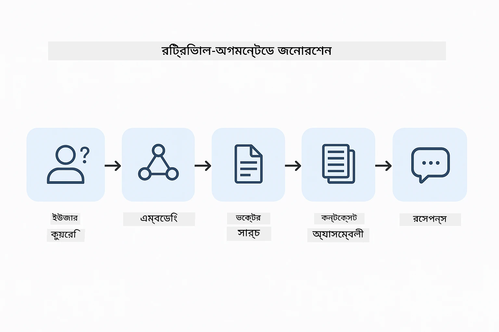
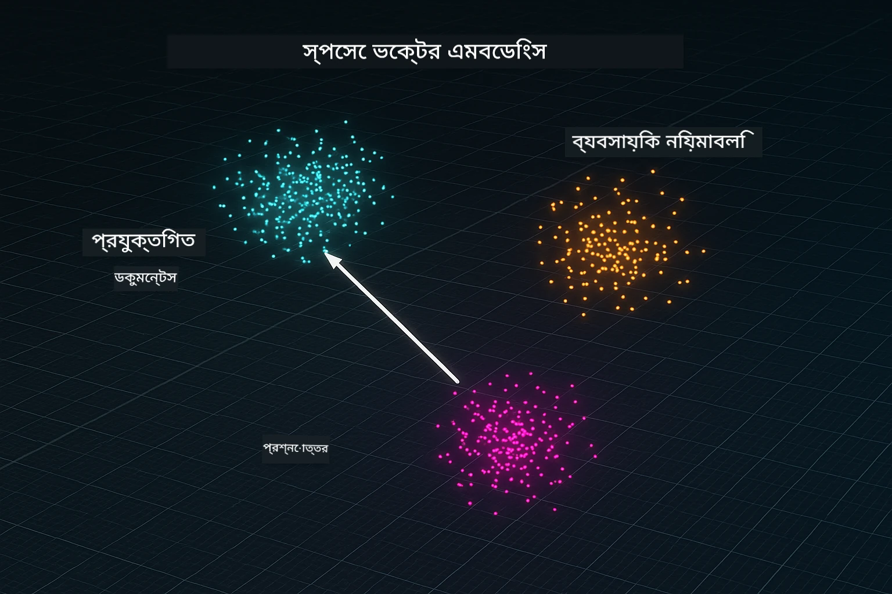
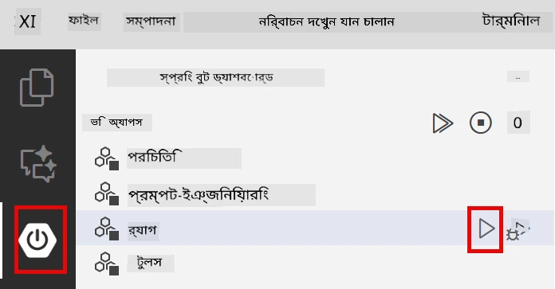
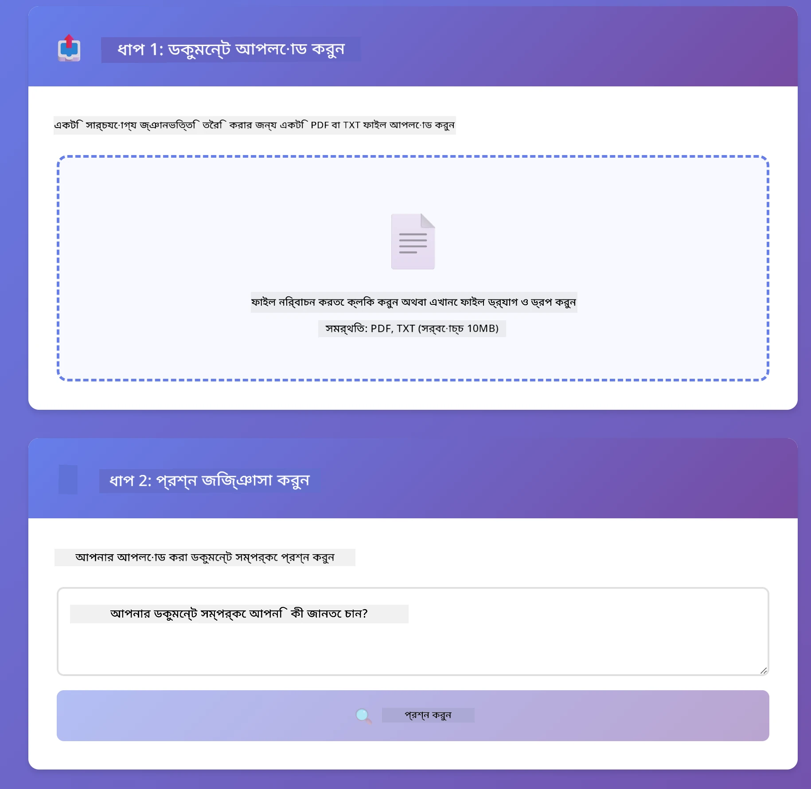
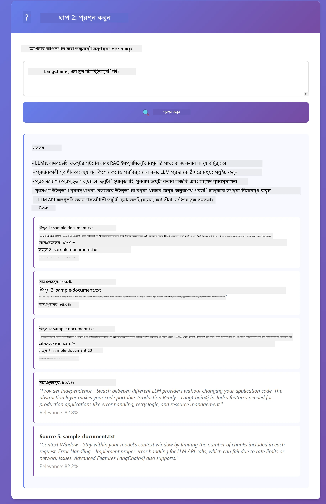

# মডিউল ০৩: RAG (রিট্রিভাল-অগমেন্টেড জেনারেশন)

## বিষয়বস্তু

- [আপনি যা শিখবেন](../../../03-rag)
- [পূর্বশর্ত](../../../03-rag)
- [RAG বোঝা](../../../03-rag)
- [কিভাবে কাজ করে](../../../03-rag)
  - [দস্তাবেজ প্রক্রিয়াজাতকরণ](../../../03-rag)
  - [এম্বেডিং তৈরি করা](../../../03-rag)
  - [সেম্যান্টিক সার্চ](../../../03-rag)
  - [উত্তর জেনারেশন](../../../03-rag)
- [অ্যাপ্লিকেশন চালান](../../../03-rag)
- [অ্যাপ্লিকেশন ব্যবহারে](../../../03-rag)
  - [একটি দস্তাবেজ আপলোড করুন](../../../03-rag)
  - [প্রশ্ন করুন](../../../03-rag)
  - [সূত্র রেফারেন্স চেক করুন](../../../03-rag)
  - [প্রশ্ন নিয়ে পরীক্ষা করুন](../../../03-rag)
- [প্রধান ধারণাসমূহ](../../../03-rag)
  - [চাঙ্কিং কৌশল](../../../03-rag)
  - [সাদৃশ্য স্কোর](../../../03-rag)
  - [ইন-মেমোরি স্টোরেজ](../../../03-rag)
  - [কন্টেক্সট উইন্ডো ম্যানেজমেন্ট](../../../03-rag)
- [কবে RAG গুরুত্বপূর্ণ](../../../03-rag)
- [পরবর্তী ধাপ](../../../03-rag)

## What You'll Learn

পূর্ববর্তী মডিউলগুলোতে, আপনি শিখেছেন কিভাবে AI এর সাথে আলোচনা করবেন এবং কিভাবে আপনার প্রম্পটগুলি কার্যকরভাবে সাজাবেন। কিন্তু একটি মৌলিক সীমাবদ্ধতা রয়েছে: ভাষা মডেলগুলো শুধুমাত্র তারা যা প্রশিক্ষণের সময় শিখেছে তাই জানে। তারা আপনার কোম্পানির নীতিমালা, আপনার প্রকল্পের ডকুমেন্টেশন বা যেকোনো এমন তথ্যের ওপর প্রশ্নের উত্তর দিতে পারে না যা তাদের প্রশিক্ষণে অন্তর্ভুক্ত ছিল না।

RAG (রিট্রিভাল-অগমেন্টেড জেনারেশন) এই সমস্যার সমাধান করে। মডেলকে আপনার তথ্য শেখানোর বদলে (যা ব্যয়বহুল এবং ব্যবহারিক নয়), আপনি মডেলকে আপনার দস্তাবেজগুলোর মধ্যে অনুসন্ধানের ক্ষমতা দেন। কেউ যখন প্রশ্ন করে, সিস্টেম প্রাসঙ্গিক তথ্য খুঁজে বের করে এবং এটি প্রম্পটে অন্তর্ভুক্ত করে। মডেল তারপর সে পুনরুদ্ধারকৃত প্রেক্ষাপটের ভিত্তিতে উত্তর প্রদান করে।

RAG কে ভাবুন এক ধরনের রেফারেন্স লাইব্রেরি হিসেবে। যখন আপনি প্রশ্ন করেন, সিস্টেম:

1. **ব্যবহারকারীর প্রশ্ন** - আপনি একটি প্রশ্ন করেন  
2. **এম্বেডিং** - আপনার প্রশ্নটিকে একটি ভেক্টরে রূপান্তর করে  
3. **ভেক্টর সার্চ** - মিলযুক্ত দস্তাবেজ চাঙ্ক খুঁজে বের করে  
4. **কন্টেক্সট অ্যাসেম্বলি** - প্রাসঙ্গিক চাঙ্কগুলো প্রম্পটে যোগ করে  
5. **প্রতিক্রিয়া** - মডেল প্রেক্ষাপটের ভিত্তিতে উত্তর তৈরি করে  

এটি মডেলের উত্তরকে আপনার আসল ডাটার ভিত্তিতে নিভর করে, প্রশিক্ষণের জ্ঞান বা অনুমান করার পরিবর্তে।



*RAG ওয়ার্কফ্লো - ব্যবহারকারীর প্রশ্ন থেকে সেম্যান্টিক সার্চ এবং প্রাসঙ্গিক উত্তর উৎপাদন পর্যন্ত*

## Preconditions

- মডিউল ০১ সম্পন্ন (Azure OpenAI রিসোর্স ডিপ্লয় করা হয়েছে)  
- রুট ডিরেক্টরিতে `.env` ফাইল যাতে Azure ক্রেডেনশিয়াল রয়েছে (মডিউল ০১ এ `azd up` দ্বারা তৈরি)

> **Note:** যদি আপনি মডিউল ০১ সম্পন্ন না করে থাকেন, প্রথমে সেখানে ডিপ্লয়মেন্ট নির্দেশাবলী অনুসরণ করুন।  

## কিভাবে কাজ করে

### দস্তাবেজ প্রক্রিয়াজাতকরণ

[DocumentService.java](../../../03-rag/src/main/java/com/example/langchain4j/rag/service/DocumentService.java)

আপনি যখন একটি দস্তাবেজ আপলোড করেন, সিস্টেম এটি ছোট ছোট টুকরো বা চাঙ্কে ভাগ করে যা মডেলের প্রেক্ষাপট উইন্ডোর মধ্যে আরামদায়কভাবে ফিট হয়। এই চাঙ্কগুলো সামান্যভাবে একে অপরকে ওভারল্যাপ করে যাতে সীমান্তে প্রেক্ষাপট হারানো না যায়।

```java
Document document = FileSystemDocumentLoader.loadDocument("sample-document.txt");

DocumentSplitter splitter = DocumentSplitters
    .recursive(300, 30, new OpenAiTokenizer());

List<TextSegment> segments = splitter.split(document);
```

> **🤖 GitHub Copilot Chat দিয়ে চেষ্টা করুন:** [`DocumentService.java`](../../../03-rag/src/main/java/com/example/langchain4j/rag/service/DocumentService.java) খুলুন এবং জিজ্ঞাসা করুন:  
> - "LangChain4j কিভাবে দস্তাবেজগুলোকে চাঙ্কে ভাগ করে এবং ওভারল্যাপ কেন গুরুত্বপূর্ণ?"  
> - "বিভিন্ন দস্তাবেজ ধরনে আদর্শ চাঙ্ক সাইজ কত এবং কেন?"  
> - "আমি কিভাবে একাধিক ভাষা বা বিশেষ ফরম্যাট সহ দস্তাবেজ পরিচালনা করব?"

### এম্বেডিং তৈরি করা

[LangChainRagConfig.java](../../../03-rag/src/main/java/com/example/langchain4j/rag/config/LangChainRagConfig.java)

প্রতিটি চাঙ্ককে একটি সংখ্যাত্মক উপস্থাপনায় রূপান্তর করা হয় যা এম্বেডিং নামে পরিচিত - যা পাঠ্যের অর্থ ধারণ করে এমন একটি গাণিতিক ফিঙ্গারপ্রিন্ট। সদৃশ টেক্সটসমূহ সদৃশ এম্বেডিং তৈরি করে।

```java
@Bean
public EmbeddingModel embeddingModel() {
    return OpenAiOfficialEmbeddingModel.builder()
        .baseUrl(azureOpenAiEndpoint)
        .apiKey(azureOpenAiKey)
        .modelName(azureEmbeddingDeploymentName)
        .build();
}

EmbeddingStore<TextSegment> embeddingStore = 
    new InMemoryEmbeddingStore<>();
```
  


*দস্তাবেজগুলো এম্বেডিং স্পেসে ভেক্টর হিসেবে উপস্থাপিত - সদৃশ বিষয়বস্তুগুলো একত্রে ক্লাস্টার করে*

### সেম্যান্টিক সার্চ

[RagService.java](../../../03-rag/src/main/java/com/example/langchain4j/rag/service/RagService.java)

আপনি যখন প্রশ্ন করেন, আপনার প্রশ্নটিও একটি এম্বেডিংয়ে রূপান্তরিত হয়। সিস্টেম আপনার প্রশ্নের এম্বেডিংকে সমস্ত দস্তাবেজ চাঙ্কের এম্বেডিংয়ের সাথে তুলনা করে। এটি শুধুমাত্র মিল থাকা কীওয়ার্ড নয়, সত্যিকার সেম্যান্টিক সাদৃশ্য দ্বারা সবচেয়ে সদৃশ অর্থসম্পন্ন চাঙ্ক খুঁজে বের করে।

```java
Embedding queryEmbedding = embeddingModel.embed(question).content();

List<EmbeddingMatch<TextSegment>> matches = 
    embeddingStore.findRelevant(queryEmbedding, 5, 0.7);

for (EmbeddingMatch<TextSegment> match : matches) {
    String relevantText = match.embedded().text();
    double score = match.score();
}
```
  
> **🤖 GitHub Copilot Chat দিয়ে চেষ্টা করুন:** [`RagService.java`](../../../03-rag/src/main/java/com/example/langchain4j/rag/service/RagService.java) খুলুন এবং জিজ্ঞাসা করুন:  
> - "এসেম্বেডিং-এর সাথে সাদৃশ্য অনুসন্ধান কিভাবে কাজ করে এবং স্কোর নির্ধারণ করে কী?"  
> - "কোন সাদৃশ্য থ্রেশহোল্ড ব্যবহার করা উচিত এবং এটি ফলাফলের উপর কিভাবে প্রভাব ফেলে?"  
> - "যখন কোন প্রাসঙ্গিক দস্তাবেজ পাওয়া যায় না তখন কিভাবে মোকাবিলা করব?"

### উত্তর জেনারেশন

[RagService.java](../../../03-rag/src/main/java/com/example/langchain4j/rag/service/RagService.java)

সবচেয়ে প্রাসঙ্গিক চাঙ্কগুলো মডেলের প্রম্পটে অন্তর্ভুক্ত করা হয়। মডেল ওই নির্দিষ্ট চাঙ্কগুলো পড়ে এবং সেই তথ্যের ভিত্তিতে আপনার প্রশ্নের উত্তর দেয়। এটি হলুসিনেশন এড়ায় – মডেল শুধুমাত্র তার সামনে থাকা তথ্য থেকেই উত্তর দিতে পারে।

## অ্যাপ্লিকেশন চালান

**ডিপ্লয়মেন্ট যাচাই করুন:**  

রুট ডিরেক্টরিতে `.env` ফাইল নিশ্চিত করুন যাতে Azure ক্রেডেনশিয়াল রয়েছে (মডিউল ০১ তে তৈরি):  
```bash
cat ../.env  # AZURE_OPENAI_ENDPOINT, API_KEY, DEPLOYMENT দেখানো উচিত
```
  

**অ্যাপ্লিকেশন চালু করুন:**  

> **Note:** আপনি যদি মডিউল ০১ থেকে `./start-all.sh` ব্যবহার করে সব অ্যাপ্লিকেশন চালু করে থাকেন, তাহলে এই মডিউলটি ইতিমধ্যে পোর্ট ৮০৮১ এ চলছে। নিচের স্টার্ট কমান্ডগুলো স্কিপ করে সরাসরি http://localhost:8081 এ যেতে পারেন।

**বিকল্প ১: Spring Boot Dashboard ব্যবহার করা (VS Code ব্যবহারকারীদের জন্য সুপারিশকৃত)**  

ডেভ কনটেইনারে Spring Boot Dashboard এক্সটেনশন অন্তর্ভুক্ত রয়েছে, যা সমস্ত Spring Boot অ্যাপ্লিকেশন ভিজুয়ালি পরিচালনার ইন্টারফেস প্রদান করে। এটি VS Code এর বাম পাশের Activity Bar এ পাওয়া যায় (Spring Boot আইকন দেখুন)।

Spring Boot Dashboard থেকে আপনি:  
- ওয়ার্কস্পেসের সমস্ত Spring Boot অ্যাপ্লিকেশন দেখতে পারবেন  
- এক ক্লিকে অ্যাপ্লিকেশন শুরু/বন্ধ করতে পারবেন  
- বাস্তব সময়ে লগ দেখতে পারবেন  
- অ্যাপ্লিকেশন স্ট্যাটাস মনিটর করতে পারবেন  

শুধুমাত্র "rag" এর পাশে প্লে বোতামে ক্লিক করে এই মডিউল শুরু করুন, অথবা সব মডিউল একসাথে শুরু করুন।



**বিকল্প ২: শেল স্ক্রিপ্ট ব্যবহার করা**

সমস্ত ওয়েব অ্যাপ্লিকেশন (মডিউল ০১-০৪) চালু করুন:  

**Bash:**  
```bash
cd ..  # রুট ডিরেক্টরি থেকে
./start-all.sh
```
  
**PowerShell:**  
```powershell
cd ..  # রুট ডিরেক্টরি থেকে
.\start-all.ps1
```
  
অথবা শুধুমাত্র এই মডিউলটি চালু করুন:  

**Bash:**  
```bash
cd 03-rag
./start.sh
```
  
**PowerShell:**  
```powershell
cd 03-rag
.\start.ps1
```
  
উভয় স্ক্রিপ্ট স্বয়ংক্রিয়ভাবে রুট `.env` ফাইল থেকে পরিবেশ পরিবর্তনশীল লোড করে এবং যদি JAR ফাইল না থাকে তবে সেগুলো তৈরি করবে।

> **Note:** আপনি যদি মডিউলগুলো নিজে থেকে বিল্ড করতে চান চালানোর আগে:  
>  
> **Bash:**  
> ```bash
> cd ..  # Go to root directory
> mvn clean package -DskipTests
> ```
  
> **PowerShell:**  
> ```powershell
> cd ..  # Go to root directory
> mvn clean package -DskipTests
> ```
  

আপনার ব্রাউজারে http://localhost:8081 খুলুন।

**বন্ধ করতে:**  

**Bash:**  
```bash
./stop.sh  # শুধুমাত্র এই মডিউল
# অথবা
cd .. && ./stop-all.sh  # সমস্ত মডিউলগুলি
```
  
**PowerShell:**  
```powershell
.\stop.ps1  # এই মডিউল মাত্র
# অথবা
cd ..; .\stop-all.ps1  # সব মডিউলগুলো
```
  

## অ্যাপ্লিকেশন ব্যবহার

অ্যাপ্লিকেশনটি একটি ওয়েব ইন্টারফেস প্রদান করে যেখানে দস্তাবেজ আপলোড ও প্রশ্ন করা যায়।

<a href="images/rag-homepage.png"></a>

*RAG অ্যাপ্লিকেশন ইন্টারফেস - দস্তাবেজ আপলোড করুন এবং প্রশ্ন করুন*

### একটি দস্তাবেজ আপলোড করুন

শুরুতে একটি দস্তাবেজ আপলোড করুন - পরীক্ষার জন্য TXT ফাইলগুলো সেরা কাজ করে। এই ডিরেক্টরিতে একটি `sample-document.txt` দেওয়া আছে যা LangChain4j এর বৈশিষ্ট্য, RAG এর বাস্তবায়ন এবং সেরা অনুশীলন সম্পর্কে তথ্য ধারণ করে – যা সিস্টেম পরীক্ষা করার জন্য উপযোগী।

সিস্টেম আপনার দস্তাবেজ প্রক্রিয়াজাত করে, চাঙ্কে ভাগ করে এবং প্রতিটি চাঙ্কের জন্য এম্বেডিং তৈরি করে। আপনি আপলোড করার সাথে সাথেই এটি স্বয়ংক্রিয়ভাবে ঘটে।

### প্রশ্ন করুন

এখন দস্তাবেজের বিষয়বস্তু সম্পর্কে নির্দিষ্ট প্রশ্ন করুন। এমন কিছু চেষ্টা করুন যা পরিষ্কারভাবে দস্তাবেজে উল্লেখ আছে। সিস্টেম প্রাসঙ্গিক চাঙ্ক খুঁজে বের করে, তা প্রম্পটে যোগ করে এবং উত্তর তৈরি করে।

### সূত্র রেফারেন্স চেক করুন

বিঃদ্রঃ প্রতিটি উত্তরে সূত্র রেফারেন্স এবং সাদৃশ্য স্কোর থাকে। এই স্কোর (০ থেকে ১ পর্যন্ত) দেখায় সেই চাঙ্কটি আপনার প্রশ্নের সাথে কতটা প্রাসঙ্গিক ছিল। বেশি স্কোর মানে ভালো মিল। এটি আপনাকে আউটপুট যাচাই করার সুযোগ দেয়।

<a href="images/rag-query-results.png"></a>

*প্রশ্ন ফলাফল প্রদর্শন করছে উত্তরসহ সূত্র রেফারেন্স এবং প্রাসঙ্গিকতা স্কোর*

### প্রশ্ন নিয়ে পরীক্ষা করুন

বিভিন্ন ধরণের প্রশ্ন চেষ্টা করুন:  
- নির্দিষ্ট তথ্য: "প্রধান বিষয় কী?"  
- তুলনা: "X এবং Y এর মধ্যে পার্থক্য কী?"  
- সারাংশ: "Z সম্পর্কে মূল পয়েন্টগুলো সংক্ষেপ করুন"  

দেখুন প্রাসঙ্গিকতা স্কোর কিভাবে পরিবর্তিত হয় আপনার প্রশ্ন দস্তাবেজের বিষয়বস্তুর সাথে কতটা মেল খায় তার উপর ভিত্তি করে।

## প্রধান ধারণাসমূহ

### চাঙ্কিং কৌশল

দস্তাবেজগুলি ৩০০ টোকেন চাঙ্কে ভাগ করা হয় যেখানে প্রতিটি চাঙ্কের সাথে ৩০ টোকেন ওভারল্যাপ থাকে। এই ভারসাম্য নিশ্চিত করে প্রতিটি চাঙ্কে যথেষ্ট প্রেক্ষাপট থাকে অর্থপূর্ণ হতে এবং একই সাথে ছোট enough হয় যাতে একাধিক চাঙ্ক প্রম্পটে অন্তর্ভুক্ত করা যায়।

### সাদৃশ্য স্কোর

স্কোর ০ থেকে ১ পর্যন্ত:  
- ০.৭-১.০: অত্যন্ত প্রাসঙ্গিক, সঠিক মেল  
- ০.৫-০.৭: প্রাসঙ্গিক, ভাল প্রেক্ষাপট  
- ০.৫ এর নিচে: বাদ দেওয়া, অত্যধিক ভিন্ন  

সিস্টেম শুধুমাত্র ন্যূনতম থ্রেশহোল্ডের উপরে থাকা চাঙ্কগুলো পুনরুদ্ধার করে যা মান বজায় রাখে।

### ইন-মেমোরি স্টোরেজ

এই মডিউলটি সরলতার জন্য ইন-মেমোরি স্টোরেজ ব্যবহার করে। অ্যাপ্লিকেশন পুনরায় শুরু করলে আপলোডকৃত দস্তাবেজগুলি হারিয়ে যায়। প্রোডাকশন সিস্টেমে Qdrant বা Azure AI Search-এর মত স্থায়ী ভেক্টর ডাটাবেস ব্যবহার করা হয়।

### কন্টেক্সট উইন্ডো ম্যানেজমেন্ট

প্রতি মডেলের একটি সর্বোচ্চ কন্টেক্সট উইন্ডো থাকে। আপনি বড় দস্তাবেজ থেকে প্রতিটি চাঙ্ক অন্তর্ভুক্ত করতে পারবেন না। সিস্টেম সর্বোচ্চ N টি প্রাসঙ্গিক চাঙ্ক (ডিফল্ট ৫) পুনরুদ্ধার করে যাতে সীমাবদ্ধতার মধ্যে থেকে যথেষ্ট প্রেক্ষাপট দিয়ে সঠিক উত্তর দেয়া যায়।

## কখন RAG গুরুত্বপূর্ণ

**RAG ব্যবহার করুন যখন:**  
- মালিকানা দস্তাবেজের ওপর প্রশ্নের উত্তর দিতে হয়  
- তথ্য ঘন ঘন পরিবর্তিত হয় (নীতিমালা, দাম, স্পেসিফিকেশন)  
- সঠিকতার জন্য সূত্র প্রদর্শন প্রয়োজন  
- বিষয়বস্তু এত বড় যা একক প্রম্পটে ফিট করে না  
- আপনাকে যাচাইযোগ্য, ভিত্তিপ্রাপ্ত উত্তর প্রয়োজন

**RAG ব্যবহার করবেন না যখন:**  
- প্রশ্ন সাধারণ জ্ঞানের ওপর যার উত্তর মডেলের মধ্যে ইতোমধ্যে আছে  
- রিয়েল-টাইম তথ্য প্রয়োজন (RAG আপলোডকৃত দস্তাবেজের ওপর কাজ করে)  
- বিষয়বস্তু ছোট যা সরাসরি প্রম্পটে অন্তর্ভুক্ত করা যায়

## পরবর্তী ধাপ

**পরবর্তী মডিউল:** [০৪-টুলস - টুলস সহ AI এজেন্টস](../04-tools/README.md)

---

**নেভিগেশন:** [← পূর্ববর্তী: মডিউল ০২ - প্রম্পট ইঞ্জিনিয়ারিং](../02-prompt-engineering/README.md) | [মূল পৃষ্ঠায় ফিরে যান](../README.md) | [পরবর্তী: মডিউল ০৪ - টুলস →](../04-tools/README.md)

---

<!-- CO-OP TRANSLATOR DISCLAIMER START -->
**দাবিদারী**:
এই দলিলটি AI অনুবাদ সেবা [Co-op Translator](https://github.com/Azure/co-op-translator) ব্যবহার করে অনূদিত হয়েছে। আমরা যথাসাধ্য সঠিকতার জন্য চেষ্টা করি, তবুও স্বয়ংক্রিয় অনুবাদে ত্রুটি বা অসত্যতা থাকতে পারে। মূল ভাষায় থাকা দলিলটিই কর্তৃত্বপূর্ণ উৎস বিবেচনা করা উচিত। গুরুত্বপূর্ণ তথ্যের জন্য পেশাদার মানব অনুবাদের পরামর্শ দেওয়া হয়। এই অনুবাদের ব্যবহারে সৃষ্ট কোনো ভুলবোঝা বা ভুল ব্যাখ্যার জন্য আমরা দায়বদ্ধ নই।
<!-- CO-OP TRANSLATOR DISCLAIMER END -->